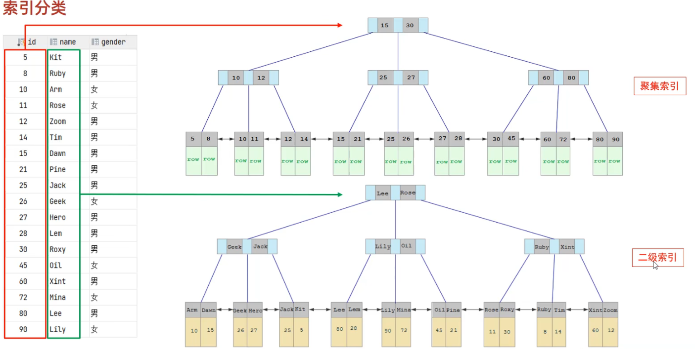

# MySQl进阶

## 存储引擎

### MySQl体系结构

- 
- 连接层
  最上层是一些客户端和链接服务，主要完成一些类似于连接处理、授权认证、及相关的安全方案。服务器也会为安全接入的每个客户端验证它所具有的操作权限。
- 服务层
  第二层架构主要完成大多数的核心服务功能，如SQL接口，并完成缓存的查询，SQL的分析和优化，部分内置函数的执行。所有跨存储引擎的功能也在这一层实现，如过程、函数等。
- 引擎层
  存储引擎真正的负责了MySQL中数据的存储和提取，服务器通过API和存储引擎进行通信。不同的存储引擎具有不同的功能，这样我们可以根据自己的需要，来选取合适的存储引擎。
- 存储层
  主要是将数据存储在文件系统之上，并完成与存储引擎的交互。


### 存储引擎简介

- 存储引擎就是储数据 建立专引 重新/查询数据等技术的实现方式 存储引擎早其于表的 而不是其于库的 所以存储引擎也可被称为表类型。

- 默认存储引擎是InnoDB。

- 语法

  ```sql
  -- 查询建表语句
  show create table account;
  CREATE TABLE 表名(
      ...
  ) ENGINE=INNODB;
  -- 查看当前数据库支持的存储引擎
  show engines;
  ```

- 例子

  ```sql
  -- 创建表 my_myisom ，并指定MyISAm存储引擎
  create table mv_myisom(
      id int ,
      name varchar(10)
  )engine = myisam;
  -- 创建表 my_memory， 指定memory有储引擎
  create table my_memory(
      id int,
      name varchar(10)
  )engine = memory;
  ```


### 存储引擎的特点

##### Inn0DB

- 介绍
  InnoDB是一种兼顾高可靠性和高性能的通用存储引擎，在 MySQL 5.5 之后, InnoDB是默认的 MySQL存储引擎。

- 特点
  DML操作遵循ACID模型，支持**事务**；
  **行级锁**，提高并发访问性能;
  支持**外键** FOREIGN KEY约束，保证数据的完整性和正确性；

- 文件
  XXX.ibd: xxx代表的是表名，innoDB引擎的每张表都会对应这样一个表空间文件，存储该表的表结构(frm、sdi)、数据和索引。
  参数：innodb_file_per_table

- 查看 Mysql 变量：

  ```sql
  show variables like 'innodb_file_per_table';
  ```

- 从idb文件提取表结构数据：（在cmd运行）

  ```
  ibd2sdi xxx.ibd
  ```

- InnoDB 逻辑存储结构：

  


##### MyISAM

- 介绍
  MyISAM是MySQL早期的默认存储引擎。
-  特点
  不支持事务，不支持外键
  支持表锁，不支持行锁
  访问速度快
- 文件
  xxx.sdi: 存储表结构信息
  XXX.MYD:存储数据
  XXX.MYI:存储索引                  

##### Memor

- Memory 引擎的表数据是存储在内存中的，受硬件问题、断电问题的影响，只能将这些表作为临时表或缓存使用。

- 特点：

  - 存放在内存中，速度快
  - hash索引（默认）

- 文件：

  xxx.sdi: 存储表结构信息

##### 存储引擎的特点

- | 特点         | InnoDB              | MyISAM | Memory |
  | ------------ | ------------------- | ------ | ------ |
  | 存储限制     | 64TB                | 有     | 有     |
  | 事务安全     | **支持**            | -      | -      |
  | 锁机制       | **行锁**            | 表锁   | 表锁   |
  | B+tree索引   | 支持                | 支持   | 支持   |
  | Hash索引     | -                   | -      | 支持   |
  | 全文索引     | 支持（5.6版本之后） | 支持   | -      |
  | 空间使用     | 高                  | 低     | N/A    |
  | 内存使用     | 高                  | 低     | 中等   |
  | 批量插入速度 | 低                  | 高     | 高     |
  | 支持外键     | **支持**            | -      | -      |


### 存储引擎的选择

- 在选择存储引擎时，应该根据应用系统的特点选择合适的存储引擎。对于复杂的应用系统，还可以根据实际情况选择多种存储引擎进行组合。
- InnoDB：是MysqI的默认存储引擎，支持事务、外键。如果应用对事务的完整性有比较高的要求，在并发条件下要求数据的一致性，数据操作除了插入和查询之外，还包含很多的更新、删除操作，那么InnoDB存储引擎比较合适的选择。
- MVISAM：如果应用是以读操作和插入操作为主，只有很少的更新和删除操作 并且对事务的完整性 并发要求不是很高.那么选择这个存储引擎是非常合适的。
- MEMORY：将所有数据保存在内存中，访问速度快，通常用于临时表及缓存。MEMORY的缺陷就是对表的大小有限制，太大的表无法缓存在内存中，而且无法保障数据的安全性。
- 电商中的足迹和评论适合使用 MyISAM 引擎，缓存适合使用 Memory 引擎。


## 索引

### 索引概述

- 介绍
  索引(index）是帮助MSOT高效取数据的数据结构（有序） 存数据夕外，数据库系统还维护芳满足杏找笪法的数据结 这些
  数据结构以某种方式引用（指向）数据，这样就可以在这些数据结构上实现高级查找算法，这种数据结构就是索引。
  
- 优点：

  - 提高数据检索效率，降低数据库的IO成本
  - 通过索引列对数据进行排序，降低数据排序的成本，降低CPU的消耗

  缺点：

  - 索引列也是要占用空间的
  - 索引大大提高了查询效率，但降低了更新的速度，比如 INSERT、UPDATE、DELETE


### 索引结构

- MySQL的索引是在存储引擎层实现的，不同的存储引擎有不同的结构，主要包含以下几种：

- | 索引结构            | 描述                                                         |
  | ------------------- | ------------------------------------------------------------ |
  | **B+Tree**          | **最常见的索引类型，大部分引擎都支持B+树索引**               |
  | Hash                | 底层数据结构是用哈希表实现，只有精确匹配索引列的查询才有效，不支持范围查询 |
  | R-Tree(空间索引)    | 空间索引是 MyISAM 引擎的一个特殊索引类型，主要用于地理空间数据类型，通常使用较少 |
  | Full-Text(全文索引) | 是一种通过建立倒排索引，快速匹配文档的方式，类似于 Lucene, Solr, ES |

- | 索引       | InnoDB        | MyISAM | Memory |
  | ---------- | ------------- | ------ | ------ |
  | B+Tree索引 | 支持          | 支持   | 支持   |
  | Hash索引   | 不支持        | 不支持 | 支持   |
  | R-Tree索引 | 不支持        | 支持   | 不支持 |
  | Full-text  | 5.6版本后支持 | 支持   | 不支持 |

##### B-Tree

- 

- B-Tree (多路平衡查找树）

  以一颗最大度数（max-degree）为5(5阶)的b-tree为例(每个节点最多存储4个key，5个指针):

  知识小贴士;树的度数指的是一个节点的子节点个数。

  

- *B-Tree 的数据插入过程动画参照：*https://www.bilibili.com/video/BV1Kr4y1i7ru?p=68
  *演示地址：*https://www.cs.usfca.edu/~galles/visualization/BTree.html

- 

##### B+Tree

- 以一颗最大度数（max-degree）为4（4阶）的b+tree为例：
- 
- *演示地址：*https://www.cs.usfca.edu/~galles/visualization/BPlusTree.html
- 相对于B-Tree区别:
  ①.所有的数据都会出现在叶子节点
  ②.叶子节点形成一个单向链表
- MySQL索引数据结构对经典的B+Tree进行了优化。在原B+Tree的基础上，增加一个指向相邻叶子节点的链表指针，就形成了带有顺序
  指针的B+Tree，提高区间访问的性能。
- 

##### Hash

- 哈希索引就是采用一定的hash算法，将键值换算成新的hash值，映射到对应的槽位上，然后存储在hash表中。
- 如果两个(或多个)键值，映射到一个相同的槽位上，他们就产生了hash冲突（也称为hash碰撞），可以通过链表来解决。
- 
- Hash索引特点
  1.Hash索引只能用于对等比较(=，in)，不支持范围查询（between，>,<,...）
  2.无法利用索引完成排序操作
  3.查询效率高，通常只需要一次检索就可以了，效率通常要高于B+tree索引
- 存储引擎支持：
  - Memory
  - InnoDB: 具有自适应hash功能，hash索引是存储引擎根据 B+Tree 索引在指定条件下自动构建的
  - 在MysQL中，支持hash索引的是Memory引擎，而InnoDB中具有自适应hash功能，hash索引是存储引擎根据B+Tree索引在指定条件下自动构建的。


##### 思考题

- 为什么InnoDB存储引擎选择使用B+tree索引结构?
  - 相对于二叉树，层级更少，搜索效率高;
  - 对于B-tree，无论是叶子节点还是非叶子节点，都会保存数据，这样导致一页中存储的键值减少，指针跟着减少，要同样保存大量数据，只能增加树的高度，导致性能降低;
  - 相对Hash索引, B+tree支持范围匹配及排序操作;


### 索引分类

- | 分类     | 含义                                                 | 特点                     | 关键字   |
  | -------- | ---------------------------------------------------- | ------------------------ | -------- |
  | 主键索引 | 针对于表中主键创建的索引                             | 默认自动创建，只能有一个 | PRIMARY  |
  | 唯一索引 | 避免同一个表中某数据列中的值重复                     | 可以有多个               | UNIQUE   |
  | 常规索引 | 快速定位特定数据                                     | 可以有多个               |          |
  | 全文索引 | 全文索引查找的是文本中的关键词，而不是比较索引中的值 | 可以有多个               | FULLTEXT |

- 在InnoDB存储引擎中，根据索引的存储形式，又可以分为以下两种：

  | 分类                      | 含义                                                       | 特点                 |
  | ------------------------- | ---------------------------------------------------------- | -------------------- |
  | 聚集索引(Clustered Index) | 将数据存储与索引放一块，索引结构的叶子节点保存了行数据     | 必须有，而且只有一个 |
  | 二级索引(Secondary Index) | 将数据与索引分开存储，索引结构的叶子节点关联的是对应的主键 | 可以存在多个         |

- 聚集索引选取规则:

  - 如果存在主键，主键索引就是聚集索引。
  - 如果不存在主键，将使用第一个唯一(UNIQUE）索引作为聚集索引。
  - 如果表没有主键，或没有合适的唯一索引，则InnoDB会自动生成一个rowid作为隐藏的聚集索引。

- 聚集索引

  

  执行过程

  

##### 思考题

- 1．以下SQL语句，那个执行效率高？为什么？

  ```sql
  select * from user where id = 10;
  select * from user where name = 'Arm';
  备注: id为主键，name字段创建的有索引;
  ```

  第一题语句执行效率更高第一题语句是聚集索引之间查找第二条语句是二级索引需要执行回表查询

- InnoDB主键索引的B+tree高度为多高呢？

  假设:
  一行数据大小为1k，一页中可以存储16行这样的数据。InnoDB的指针占用6个字节的空间，主键即使为bigint，占用字节数为8。

  高度为2:
  n * 8 +(n + 1)* 6 = 16\*1024 ,算出n约为 1170
  1171*16=18736

  高度为3:
  1171\*1171\*16=21939856


### 索引语法

- 创建索引

  ```sql
  CREATE [UNIQUE] [FULLTEXT] INDEX index_name ON table name (index col name,...)
  ```

- 查看索引

  ```sql
  SHOW INDEX FROM table name
  ```

- 删除索引

  ```sql
  DROP INDEX index_name ON table_name
  ```

- 例子

  ```sql
  -- 查看索引
  show index from tb_user;
  -- 1.name字段为姓名字段，该字段的值可能会重复，为该字段创建索引
  create index index_user_name on tb_user(name);
  -- 2.phone手机号字段的值，是非空，且唯一的，为该字段创建唯一索引。
  create unique index index_user_phone on tb_user(phone );
  -- 3.为profession、age、status创建联合索引。
  create index index_user_pro_age_sta on tb_user(profession,age,status);
  -- 4.为email建立合适的索引来提升查询效率。
  create index  index_user_ema on tb_user(email);
  -- 删除索引
  drop index index_user_ema on tb_user;
  ```


### SQL性能分析

##### SQL执行频率

- SQL执行频率

  MySQL客户端连接成功后，通过

  ```sql
  show[session global]status
  ```

  命令可以提供服务器状态信息。通过如下指令，可以查看当前数据库的
  INSERT、UPDATE、DELETE、SELECT的访问频次：

- 例

  ```sql
  SHOW GLOBAL STATUS LIKE 'com_______';
  ```

  ```sql
  SHOW SESSION STATUS LIKE 'Com_______';
  ```

##### 慢查询日志

- 慢查询日志记录了所有执行时间超过指定参数(long_query_time,单位：秒，默认10秒)的所有SQL语句的日志。MySQL的慢查询日志默认没有开启，需要在MySQL的配置文件（/etc/y.cnf)中配置如下信息：

- 注意这是linux的开启方法

  ```sql
  # 查询慢查询日志开关
  show variables  like 'slow_query_log';
  # 开启慢查询日志开关 linux配置信息非sql语句
  slow_query_log=1
  # 设置慢查询日志的时间为2秒，SQL语句执行时间超过2秒，就会视为慢查询，记录慢查询日志
  long_query_time=2
  ```

  配置完毕之后，通过以下指令重新启动MySQL服务器进行测试，查看慢日志文件中记录的信息地址：/var/lib/mysql/localhost-slow.log

- Windows下开启Mysql慢查询

- **第一步：修改my.ini(mysql配置文件)**
    在my.ini中加上下面两句话默认安装路径在：C:\Program Files\MySQL\MySQL Server 8.0

  ```
  log-slow-queries = “D:\MYSQl\mysql_slow_query.log”
  long_query_time=2
  ```

    第一句使用来定义慢查询日志的路径（因为是windows，所以不牵涉权限问题）
    第二句使用来定义查过多少秒的查询算是慢查询，我这里定义的是2秒

- 如果在MySQL路径下有权限原因无法修改my.ini文件。可以将文件剪切到别的目录，改完后在放回来。 修改完后，需要重启mysql服务。 使用管理员权限打开终端：使用如下命令停起mysql:

  ```
  net stop msyql # 停止
  net start msyql # 启动
  ```


##### profile

- show profile 能在做SQL优化时帮我们了解时间都耗费在哪里。通过 have_profiling 参数，能看到当前 MySQL 是否支持 profile 操作：

  ```sql
  SELECT @@have_profiling;
  ```

- profiling 默认关闭，可以通过set语句在session/global级别开启 profiling：

  ```sql
  SET profiling = 1;
  ```

- 查看所有语句的耗时：

  ```sql
  show profiles;
  ```

- 查看指定query_id的SQL语句各个阶段的耗时：

  ```sql
  show profile for query query_id;
  ```

- 查看指定query_id的SQL语句CPU的使用情况

  ```sql
  show profile cpu for query query_id;
  ```

##### explain

- EXPLAIN 或者 DESC 命令获取 MySQL 如何执行 SELECT 语句的信息，包括在 SELECT 语句执行过程中表如何连接和连接的顺序。语法：

  ```sql
  # 直接在select语句之前加上关键字 explain / desc
  EXPLAIN SELECT 字段列表 FROM 表名 HWERE 条件;
  ```

  例子

  ```sql
  explain select * from tb_user where id=1;
  ```

- EXPLAIN 各字段含义：

  - id：select 查询的序列号，表示查询中执行 select 子句或者操作表的顺序（id相同，执行顺序从上到下；id不同，值越大越先执行）
  - select_type：表示 SELECT 的类型，常见取值有 SIMPLE（简单表，即不适用表连接或者子查询）、PRIMARY（主查询，即外层的查询）、UNION（UNION中的第二个或者后面的查询语句）、SUBQUERY（SELECT/WHERE之后包含了子查询）等
  - type：表示连接类型，性能由好到差的连接类型为 NULL、system、const、eq_ref、ref、range、index、all
  - possible_key：可能应用在这张表上的索引，一个或多个
  - Key：实际使用的索引，如果为 NULL，则没有使用索引
  - Key_len：表示索引中使用的字节数，该值为索引字段最大可能长度，并非实际使用长度，在不损失精确性的前提下，长度越短越好
  - rows：MySQL认为必须要执行的行数，在InnoDB引擎的表中，是一个估计值，可能并不总是准确的
  - filtered：表示返回结果的行数占需读取行数的百分比，filtered的值越大越好


### 索引使用


### 索引设计原则


## SQl优化

## 视图/存储过程/触发器

## 锁

## innoDB引擎

## MySQl管理

