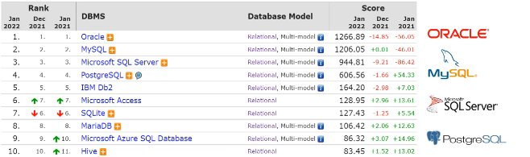
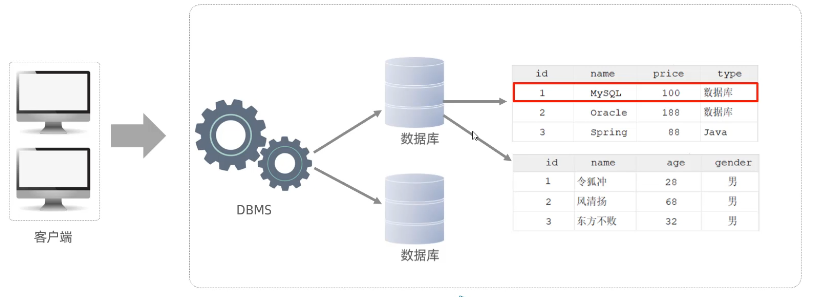
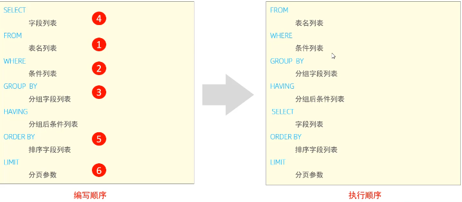
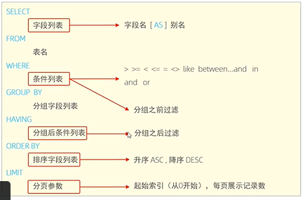
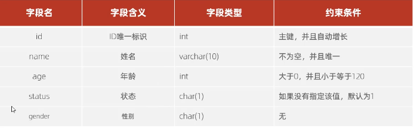
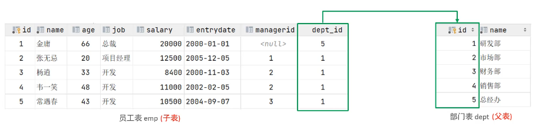

## mysql基础

### 1.mysql概述

##### 1.数据库相关概念

|      名称      |                             全称                             |               简称                |
| :------------: | :----------------------------------------------------------: | :-------------------------------: |
|     数据库     |            存储数据的仓库，数据是有组织的进行存储            |          DataBase（DB）           |
| 数据库管理系统 |                  操纵和管理数据库的大型软件                  | DataBase Management System (DBMS) |
|      SQL       | 操作关系型数据库的编程语言，定义了一套操作关系型数据库统一标准 |  Structured Query Language (SQL)  |

##### 2.主流的关系型数据库管理系统



- 数据库                数据存储的仓库
- 数据库管理系统 操纵和管理数据库的大型软件
- SQL                   操作关系型数据库的编程语言，是一套标准

##### 3.版本

1. MySQL官方提供了两种不同的版本:

   社区版（MySQL Community Server)

   免费，MySQL不提供任何技术支持

2. 商业版（MySQL Enterprise Edition)

   收费，可以试用30天，官方提供技术支持

##### 4.下载

[MySQL ：： 下载 MySQL Installer](https://dev.mysql.com/downloads/installer/)

##### 5.安装

详细的安装文档在同级目录下

##### 6.启动与停止

启动

```sql
net start mysql80
```

停止

```sql
net stop mysql80
```

注意在命令行cmd,终端中使用

##### 7.客户端连接

- 方式一：MySQL提供的客户端命令行工具

- 方式二：系统自带的命令行工具执行指令

  ```
  mysql [-h 127,0.0.1] [-P 3306] -u root -p
  //[-h 127,0.0.1] [-P 3306] 一般不用输入直接输入：
  mysql -u root -p
  ```

  注意方式二需要配置环境变量

##### 8.数据模型

- 关系型数据库（RDBMS）

  概念：建立在关系模型基础上，由多张相互连接的二维表组成的数据库。

  特点：
  1.使用表存储数据，格式统一，便于维护
  2.使用SQL语言操作，标准统一，使用方便

- 数据模型


### 2.SQL

##### 1.SQL通用语法

- SQL语句可以单行或多行书写，以分号结尾。

- SQL语句可以使用空格/缩进来增强语句的可读性。

- MySQL数据库的SQL语句不区分大小写，关键字建议使用大写。

- 注释：

  单行注释：-- 注释内容 或 # 注释内容(MySQL特有)

  多行注释： /* 注释内容 */

##### 2.SQL分类

| 分类 |            全称            |                          说明                          |
| :--: | :------------------------: | :----------------------------------------------------: |
| DDL  |  Data Definition Language  |   数据定义语言，用来定义数据库对象(数据库，表，字段)   |
| DML  | Data Manipulation Language |     数据操作语言，用来对数据库表中的数据进行增删改     |
| DQL  |    Data Query language     |         数据查询语言，用来查询数据库中表的记录         |
| DCL  |   Data Control Language    | 数据控制语言，用来创建数据库用户、控制数据库的访问权限 |


##### 3.DDL

###### **库操作**

- 查询

- 查询所有数据库

  ```sql
  SHOW DATABASES;
  ```

- 查询当前数据库

  ```sql
  SELECT DATABASE();
  ```

- 创建

  ```sql
  CREATE DATABASE [ IF NOT EXISTS ] 数据库名 [ DEFAULT CHARSET 字符集][COLLATE 排序规则];
  #[ IF NOT EXISTS ] 表示不存在则创建，存在则不创建
  #[ DEFAULT CHARSET 字符集] 
  ```

- 删除

  ```sql
  DROP DATABASE [IF EXISTS]数据库名;
  #[IF EXISTS] 表示如果存在则删除
  ```

- 使用

  ```sql
  USE 数据库名;
  ```

- 注意方括号表示可以省略

###### **表操作**

- **查询**

- 查询当前数据库所有表

  ```sql
  SHOW TABLES;
  ```

- 查询表结构

  ```sql
  DESC 表名;
  ```

- 查询指定表的建表语句

  ```sql
  SHOW CREATE TABLE 表名;
  ```

- **创建表**

  ```sql
  CREATE TABLE 表名(
  字段1 字段1类型[COMMENT字段1注释],
  字段2 字段2类型[COMMENT字段2注释],
  字段3 字段3类型[COMMENT字段3注释],
  ...
  字段n 字段n类型[COMMENT字段n注释]
  )[ COMMENT 表注释];
  ```

  注意：[…]里面为可选参数，最后一个字段后面没有逗号 comment表示注释

  列

  ```sql
   create table tb_user(
     id int comment '编号',
     name varchar(50) comment '姓名',
     age int comment '年龄',
     gender varchar(1) comment '性别 '
     )comment '用户表';
  ```

  ```sql
   create table emp(
      id int,
      workno varchar(10),
      name varchar(10),
      gender char(1),
      age tinyint unsigned,
      idcard char(18),
      entrydate date
   	);
  ```

- **表操作-修改**

- 添加字段

  ```sql
  ALTER TABLE 表名 ADD字段名 类型(长度) [COMMENT注释] [约束];
  ```

  例

  ```sql
  alter table emp nickname varchar(20);
  ```

- 修改数据类型

  ```sql
  ALTER TABLE 表名 MODIFY 字段名 新数据类型(长度);
  ```

- 修改字段名和字段类型

  ```sql
  ALTER TABLE 表名 CHANGE 旧字段名 新字段名 类型（长度）[COMMENT注释][约束];
  ```

  例

  ```sql
   alter table emp change nickname username varchar(30);
  ```

- 删除字段

  ```sql
  ALTER TABLE 表名 DROP 字段名;
  ```

  例

  ```sql
  alter table emp drop username;
  ```

- 修改表名

  ```sql
  ALTER TABLE 表名 RENAME TO 新表名;
  ```

- **删除表**

- 删除表

  ```sql
  DROP TABLE[IF EXISTS] 表名;
  ```

- 删除指定表，并重新创建该表

  ```sql
  TRUNCATE TABLE 表名;
  ```

  注意：在删除表时，表中的全部数据也会被删除。

  

##### 4.DML

DML英文全称是Data Manipulation Language(数据操作语言)，用来对数据库中表的数据记录进行增删改操作。

###### 添加数据（INSERT）

- 给指定字段添加数据

  ```sql
  INSERT INTO 表名（字段名1，字段名2,..) VALUES(值1,值2,..)
  ```

- 给全部字段添加数据

  ```sql
  INSERT INTO 表名 VALUES(值1,值2,..);
  ```

- 批量添加数据

  ```sql
  INSERT INTO 表名 (字段名1,字段名2,... ) VALUES (值1,值2,...),(值1,值2,...),(值1,值2,...);
  
  INSERT INTO 表名 VALUES(值1,值2,..),(值1,值2,..）（值1,值2,..);
  ```

- 注意：
-  插入数据时，指定的字段顺序需要与值的顺序是一一对应的。
-  字符串和日期型数据应该包含在引号中。
-  插入的数据大小，应该在字段的规定范围内。

例指定字段添加数据

```sql
insert into employee(id,workno,name,gender,age,idcard,entrydate) values (1,'1','itcast','男',10,'123456789012345678','2000-01-01');
```

例全部字段添加数据

```sql
 insert into employee values(3,'3','刘怀活','男',10,'123456789012345678','2000-01-01')
```

例批量添加数据

```sql
insert into employee values(4,'4','董g','男',10,'123456789012345678','2000-01-01'),(5,'5','刘亮','男',10,'123456789012345678','2000-01-01');
```


###### 修改数据（UPDATE）

- 修改数据

  ```sql
  UPDATE 表名 SET 字段名1=值1，字段名2=值2,...[ WHERE 条件] ;
  ```

  注意：修改语句的条件可以有，也可以没有，如果没有条件，则会修改整张表的所有数据。

  例 修改id为1 的数据，将name修改为 itheima

  ```sql
  update employee set name = 'itheima' where id=1;
  ```

  例 修改id为1 的数据，将name修改为 小昭 , gender 修改为 女

  ```sql
  update employee set name = '小昭', gender='女'  where id=1;
  ```

###### 删除数据（DELETE）

- 删除数据

  ```sql
  DELETE FROM 表名 [ WHERE 条件]
  ```

- 注意：
  DELETE语句的条件可以有，也可以没有，如果没有条件，则会删除整张表的所有数据。
  DELETE语句不能删除某一个字段的值(可以使用UPDATE)。

- 例子

  删除 gender 为女的员工

  ```sql
  delete from employee where gender='女';
  ```

  删除所有员工

  ```sql
   delete from employee;
  ```

##### 5.DQL

DQL英文全称是Data Query Language(数据查询语言)，数据查询语言，用来查询数据库中表的记录。

###### 基本查询

- 查询多个字段

  ```sql
  SELECT 字段1,字段2,字段3.. FROM 表名;
  SELECT * FROM 表名;
  ```

  例子

  查询指定字段 name, yorkno, age 返回

  ```sql
  select name,workno,age from emp;
  ```

  查询所有字段返回

  ```sql
  select * from emp;
  ```

- 设置别名

  ```sql
  SELECT 字段1 [AS 别名1],字段2 [AS 别名2] .. FROM 表名;
  ```

  例子

  查询所有员工的工作地址，起别名

  ```sql
  select workaddress as '工作地址' from emp;
  ```

- 去除重复记录

  ```sql
  SELECT DISTINCT 字段列表 FROM 表名;
  ```

  例子

  查询公司员工的上班地（不要重复）

  ```sql
  select distinct workaddress as '工作地址' from emp;
  ```

###### 条件查询

- 语法

  ```sql
  SELECT 字段列表 FROM 表名 WHERE 条件列表 ;
  ```

- 条件

  | 比较运算符      | 功能                                       |
  | --------------- | ------------------------------------------ |
  | >               | 大于                                       |
  | >=              | 大于等于                                   |
  | <               | 小于                                       |
  | <=              | 小于等于                                   |
  | =               | 等于                                       |
  | <> 或 !=        | 不等于                                     |
  | BETWEEN … AND … | 在某个范围内（含最小、最大值）             |
  | IN(…)           | 在in之后的列表中的值，多选一               |
  | LIKE 占位符     | 模糊匹配（_匹配单个字符，%匹配任意个字符） |
  | IS NULL         | 是NULL                                     |

  | 逻辑运算符 | 功能                         |
  | ---------- | ---------------------------- |
  | AND 或 &&  | 并且（多个条件同时成立）     |
  | OR 或 \|\| | 或者（多个条件任意一个成立） |
  | NOT 或 !   | 非，不是                     |

- 例子

  ```sql
  -- 年龄等于88
  select * from emp where age=88;
  -- 年龄小于20
  select  * from  emp where  age<20;
  -- 小于等于
  select * from emp where  age <=20;
  -- 没有身份证
  select  * from emp where idcard is NULL or idcard='';
  -- 有身份证
  select * from emp where idcard;
  select * from emp where idcard is not null;
  -- 年龄不等于88
  select * from emp where age != 88;
  select * from emp where age <> 88;
  -- 年龄在15到20之间
  select * from emp where  age between 15 and 20;
  select * from emp where  age>=15 && age<=20;
  select * from emp where  age>=15 and age<=20;
  -- 下面语句不报错，但查不到任何信息
  select * from emp where  age between 20 and 15;
  -- 性别为女且年龄小于30
  select  * from  emp where gender='女' and  age<30;
  -- 年龄等于18或20或40
  select * from  emp where  age=18 or age=20 or age=40;
  select * from  emp where  age in (18,20,40);
  -- 姓名为两个字
  select *from emp where name like '__';
  -- 身份证最后为X
  select * from  emp where  idcard like '%x';
  select * from  emp where  idcard like '_________________x';
  ```

###### 聚合函数

- 将一列数据作为一个整体，进行纵向计算。

- 常见聚合函数：

  | 函数  | 功能     |
  | ----- | -------- |
  | count | 统计数量 |
  | max   | 最大值   |
  | min   | 最小值   |
  | avg   | 平均值   |
  | sum   | 求和     |

- 语法

  ```sql
  SELECT 聚合函数(字段列表) FROM 表名；
  ```

  注意：null值不参与所有聚合函数运算。

- 例子

  ```sql
  -- 1. 统计该企业员工数量
  select count(*) from emp;
  select count(id) from emp;
  -- 2.统计该企业员工的平均年龄
  select avg(age) from emp;
  -- 3. 统计该企业员工的最大年龄
  select max(age) from emp;
  -- 4. 统计该企业员工的最小年龄
  select min(age) from emp;
  -- 5. 统计西安地区员工的年龄之和
  select sum(age) from emp where workaddress='西安';
  ```


###### 分组查询

- 语法

  ```sql
  SELECT 字段列表 FROM 表名[ WHERE 条件] GROUP BY 分组字段名 [HAVING 分组后过滤条件];
  ```

- where与having区别
  1.执行时机不同：where是分组之前进行过滤，不满足where条件，不参与分组；      而having是分组之后对结果进行过滤。
  2.判断条件不同：where不能对聚合函数进行判断，而having可以。

- 例子

  ```sql
  -- 1. 根据性别分组 ，统计男性员工 和 女性员工的数量
  select gender, count(*) from emp group by gender;
  -- 2. 根据性别分组 ，统计男性员工 和 女性员工的平均年龄
  select gender,avg(age) from emp group by gender;
  -- 3. 查询年龄小于45的员工 ，并根据工作地址分组 ，获取员工数量大于等于3的工作地址
  select workaddress,count(*) address_count from emp where age<45 group by workaddress having address_count>=3;
  ```

- 注意
   执行顺序: where > 聚合函数>having 。
   分组之后，查询的字段一般为聚合函数和分组字段，查询其他字段无任何意义。

###### 排序查询

- 语法

  ```sql
  SELECT 字段列表 FROM 表名 ORDER BY 字段1 排序方式1,字段2 排序方式2 ;
  ```

- 排序方式
  ASC：升序（默认值）
  DESC:降序

- 注意：如果是多字段排当第一个字段值相同时，才会根据第二个字段进行排序。

- 例子

  ```sql
  -- 1，根据年龄对公司的员工进行升序排序
  select * from emp order by  age ASC ;
  -- 2. 根据入职时间，对员工进行降序持序
  select * from emp order by entrydate desc ;
  -- 3，根据年龄对公司的员工进行升序排序 ，年龄相同 ，再按照入职时间进行降序排序
  select * from emp order by age asc , entrydate desc;
  ```

###### 分页查询

- 语法

  ```sql
  SELECT 字段列表 FROM 表名 LIMIT 起始索引,查询记录数；
  ```

- 注意
  起始索引从0开始，起始索引=（查询页码-1）*每页显示记录数。
  分页查询是数据库的方言，不同的数据库有不同的实现，MySQL中是LIMIT。
  如果查询的是第一页数据，起始索引可以省略，直接简写为limit 10。

- 例子

  ```sql
  -- 1. 查询第1页员工数据，每页展示10条记录
  select * from emp limit 0,10;
  -- 2. 查询第2页员工数据，每页展示10条记录
  select  * from emp limit 10,10;
  ```


###### 案例

```sql
-- 1. 查询年龄为20,21,22,23岁的女性员工信息。
select * from emp where gender='女' and age=20 or age=21 or age=22 or age=23;
select * from emp where gender='女' and age in(20,21,22,23);
-- 2. 查询性别为 男 ，并且年龄在 20-40 岁（含）以内的姓名为三个字的员工。
select * from emp where gender='男' and age>=20 and age<=40 and name like '___';
select * from emp where gender='男' and age between 20 and 40 and name like '___';
-- 3．统计员工表中，年龄小于60岁的 ，男性员工和女性员工的人数。
select gender ,count(*) from  emp where age<60 group by gender;
-- 4. 查询所有年龄小于等于35岁员工的姓名和年龄，并对查询结果按年龄升序排序，如果年龄相同按入职时间降序持序。
select * from emp where age<=35 order by age asc ,entrydate desc;
-- 5．查询性别为男，且年龄在20-48 岁（含)以内的前5个员工信息，对查询的结果按年龄升字排序，年龄相同按入职时间升序排序。
select * from emp where gender='男' and age between 20 and 48 order by age asc,entrydate asc limit 0,5;
```

###### 执行顺序



总结




##### 6.DCL

DCL英文全称是Dala Control Lanauaqe(数据控制语言)，用来管理数据库用户 控制数据库的访问 权限。

###### 管理用户

- 1.查询用户

  ```sql
  USE mysql;
  SELECT * FROM user;
  ```

- 创建用户

  ```sql
  CREATE USER '用户名'@'主机名' IDENTIFIED BY '密码';
  ```

- 修改用户密码

  ```sql
  ALTER USER '用户名'@'主机名' IDENTIFIED WITH mysqt_native_password BY '新密码' ;
  ```

- 删除用户

  ```sql
  DROP USER '用户名'@'主机名';
  ```

- 注意
  主机名可以使用％通配。
  这类SQL开发人员操作的比较少，主要是DBA（Database Administrator 数据库管理员）使用。

- 例子

  ```sql
  use mysql;
  select * from user;
  -- 创建用户 Atcast ，只能够在当前主机Localhost访问，密码123456；
  create user 'itcast'@'localhost' identified by '123456';
  -- 创建用户 heime ，可以在任意主机访问该数据库，密码123456 ;
  create  user 'heime'@'%' identified by '123456';
  -- 修改用户 heime 的访问密码为 1234 ;
  alter user 'heime'@'%' identified with  mysql_native_password by '1234';
  -- 则除itcast@LocaLhost用r
  drop user 'itcast'@'localhost';
  ```

###### 权限控制

- MySQL中定义了很多种权限，但是常用的就以下几种：

  | 权限                | 说明               |
  | ------------------- | ------------------ |
  | ALL, ALL PRIVILEGES | 所有权限           |
  | SELECT              | 查询数据           |
  | INSERT              | 插入数据           |
  | UPDATE              | 修改数据           |
  | DELETE              | 删除数据           |
  | ALTER               | 修改表             |
  | DROP                | 删除数据库/表/视图 |
  | CREATE              | 创建数据库/表      |

- 查询权限

  ```sql
  SHOW GRANTS FOR '用户名'@'主机名';
  ```

  例子

  ```sql
  -- 查询
  show grants  for 'heime'@'%';
  ```

- 授予权限

  ```sql
  GRANT 权限列表 ON 数据库名.表名 TO '用户名'@'主机名';
  ```

  例子

  ```sql
  -- 授予权限
  grant all on itcast.* to 'heime'@'%';
  grant all on *.* to 'heime'@'%';
  -- *.* 表示所有数据库所有表的所有权限
  ```

- 撤销权限

  ```sql
  REVOKE 权限列表 ON 数据库名.表名 FROM '用户名'@'主机名';988888866
  ```

  例子

  ```sql
  -- 撤销权限
  revoke all on itcast.*  from  'heime'@'%';
  ```

- 注意：
  多个权限之间，使用逗号分隔
  授权时，数据库名和表名可以使用* 进行通配，代表所有。


### 3.函数

函数是指一段可以直接被另一段程序调用的程序或代码。 

##### 字符串函数

| 函数                       | 功能                                                      |
| -------------------------- | --------------------------------------------------------- |
| CONCAT(s1, s2, …, sn)      | 字符串拼接，将s1, s2, …, sn拼接成一个字符串               |
| LOWER(str)                 | 将字符串全部转为小写                                      |
| UPPER(str)                 | 将字符串全部转为大写                                      |
| LPAD(str, n, pad)          | 左填充，用字符串pad对str的左边进行填充，达到n个字符串长度 |
| RPAD(str, n, pad)          | 右填充，用字符串pad对str的右边进行填充，达到n个字符串长度 |
| TRIM(str)                  | 去掉字符串头部和尾部的空格                                |
| SUBSTRING(str, start, len) | 返回从字符串str从start位置起的 len个长度的字符串          |

- 语法

  ```sql
  SELECT 函数(参数);
  ```

- 例子

  ```sql
  -- 拼接 CONCAT
  select concat('hello ','mysql');
  -- 小写 LOWER
  select lower('Hello');
  -- 大写 UPPER
  select upper('hello');
  -- 左填充 LPAD
  select lpad('01',5,'-');
  -- 右填充 RPAD
  select rpad('01',5,'-');
  -- 去除空格 TRIM
  select  trim(' hello mysql ');
  -- 切片（起始索引为1）SUBSTRING
  select substring('hello mysql',1,5);
  
  -- 1．由于业务需求变更，企业员工的工号，统一为5位数，目前不足5位轻的全部在前面补0。 比如： 1号员工的工号应该为00001.
  update emp set workno=lpad(workno,5,'0');
  ```

  

##### 数值函数

常见的数值函数如下：

| 函数        | 功能                             |
| ----------- | -------------------------------- |
| CEIL(x)     | 向上取整                         |
| FLOOR(x)    | 向下取整                         |
| MOD(x, y)   | 返回x/y的余数                    |
| RAND()      | 返回0~1内的随机数                |
| ROUND(x, y) | 求参数x的四舍五入值，保留y位小数 |

- 语法

  ```sql
  SELECT 函数(参数);
  ```

- 例子

  ```sql
  -- | CEIL(x)     | 向上取整
  select ceil(1.5);
  -- | FLOOR(x)    | 向下取整
  select floor(1.9);
  -- | MOD(x, y)   | 返回x/y的于数
  select mod(3,1);
  -- | RAND()      | 返回0~1内的随机数
  select  rand();
  -- | ROUND(x, y) | 求参数x的四舍五入值，保留y位小数
  select round(2.399,2);
  
  -- 通过数据库的函数，生成一个六位数的随机验证码。
  select lpad(round(rand()*1000000,0),6,'0');
  ```

  

##### 日期函数

常见的日期函数如下:

| 函数                               | 功能                                              |
| ---------------------------------- | ------------------------------------------------- |
| CURDATE()                          | 返回当前日期                                      |
| CURTIME()                          | 返回当前时间                                      |
| NOW()                              | 返回当前日期和时间                                |
| YEAR(date)                         | 获取指定date的年份                                |
| MONTH(date)                        | 获取指定date的月份                                |
| DAY(date)                          | 获取指定date的日期                                |
| DATE_ADD(date, INTERVAL expr type) | 返回一个日期/时间值加上一个时间间隔expr后的时间值 |
| DATEDIFF(date1, date2)             | 返回起始时间date1和结束时间date2之间的天数        |

- 语法

  ```sql
  SELECT 函数(参数);
  ```

- 例子

  ```sql
  -- | CURDATE()                          | 返回当前日期
  select curdate();
  -- | CURTIME()                          | 返回当前时间
  select curtime();
  -- | NOW()                              | 返回当前日期和时间
  select now();
  -- | YEAR(date)                         | 获取指定date的年份
  select  year(now());
  -- | MONTH(date)                        | 获取指定date的月份
  select month(now());
  -- | DAY(date)                          | 获取指定date的日期
  select day(now());
  -- | DATE_ADD(date, INTERVAL expr type) | 返回一个日期/时间值加上一个时间间隔expr后的时间值
  select date_add(now(),interval 70 day );
  -- | DATEDIFF(date1, date2)             | 返回起始时间date1和结束时间date2之间的天数
  select DATEDIFF(now(),'2021-12-01');
  
  -- 查询所有员工的入职天数，并根据入职天数倒序排序。
  select name,datediff(now(),entrydate) as 'entrdays' from emp order by entrdays desc;
  ```

  

##### 流程函数

流程函数也是很常用的一类函数，可以在SQL语句中实现条件筛选，从而提高语句的效率。

| 函数                                                         | 功能                                                    |
| ------------------------------------------------------------ | ------------------------------------------------------- |
| IF(value, t, f)                                              | 如果value为true，则返回t，否则返回f                     |
| IFNULL(value1, value2)                                       | 如果value1不为空，返回value1，否则返回value2            |
| CASE WHEN [ val1 ] THEN [ res1 ] … ELSE [ default ] END      | 如果val1为true，返回res1，… 否则返回default默认值       |
| CASE [ expr ] WHEN [ val1 ] THEN [ res1 ] … ELSE [ default ] END | 如果expr的值等于val1，返回res1，… 否则返回default默认值 |

- 语法

  ```sql
  SELECT 函数(参数);
  ```

- 例子

  ```sql
  -- | IF(value, t, f)                                              | 如果value为true，则返回t，否则返回f
  select if(true,'ok','Error');
  -- | IFNULL(value1, value2)                                       | 如果value1不为空，返回value1，否则返回value2
  select ifnull('ok','default');
  select ifnull(' ','default');
  select ifnull(null,'default');
  -- | CASE WHEN [ val1 ] THEN [ res1 ] … ELSE [ default ] END      | 如果val1为true，返回res1，… 否则返回default默认值
  -- 案例：统计班级各个学员的成绩，展示的规则如下：
  -- >= 85，展示优秀
  -- >= 60，展示及格
  -- 否则，展示不及格
  select
         id,
         name,
         (case  when math>=85 then '优秀' when math>=60 then '及格' else '不及格' end ),
         (case  when english>=85 then '优秀' when english>=60 then '及格' else '不及格' end ),
         (case  when chinese>=85 then '优秀' when chinese>=60 then '及格' else '不及格' end )
  from score;
  -- | CASE [ expr ] WHEN [ val1 ] THEN [ res1 ] … ELSE [ default ] END | 如果expr的值等于val1，返回res1，… 否则返回default默认值
  -- 查询emp表的员工姓名和工作地址（北京/上海 ----> 线城市，其他-----> 二线城市）
  select name ,
         (case workaddress when '北京' then '一线城市' when '上海' then '一线城市' else '二线城市' end) as '工作地址'
  from emp;
  
  ```

  

### 4.约束

###### 概述

- 概念: 约束是作用于表中字段上的规则，用于限制存储在表中的数据。

- 目的：保证数据库中数据的正确、有效性和完整性。

- 分类

  | 约束                    | 描述                                                     | 关键字      |
  | ----------------------- | -------------------------------------------------------- | ----------- |
  | 非空约束                | 限制该字段的数据不能为null                               | NOT NULL    |
  | 唯一约束                | 保证该字段的所有数据都是唯一、不重复的                   | UNIQUE      |
  | 主键约束                | 主键是一行数据的唯一标识，要求非空且唯一                 | PRIMARY KEY |
  | 默认约束                | 保存数据时，如果未指定该字段的值，则采用默认值           | DEFAULT     |
  | 检查约束（8.0.1版本后） | 保证字段值满足某一个条件                                 | CHECK       |
  | 外键约束                | 用来让两张图的数据之间建立连接，保证数据的一致性和完整性 | FOREIGN KEY |

- 注意: 约束是作用于表中字段上的，可以在创建表/修改表的时候添加约束。

- 常用约束

  | 约束条件 | 关键字         |
  | -------- | -------------- |
  | 主键     | PRIMARY KEY    |
  | 自动增长 | AUTO_INCREMENT |
  | 不为空   | NOT NULL       |
  | 唯一     | UNIQUE         |
  | 逻辑条件 | CHECK          |
  | 默认值   | DEFAULT        |

  

###### 约束演示

- 案例

  ```sql
  create table user(
      id int primary key auto_increment comment '主键',
      name varchar(10) not null unique comment '姓名',
      age int check ( age>0 && user.age<=120 ) comment '年龄',
      status char(1) default '1' comment '状态',
      gender char(1) comment '性别'
  )comment '用户表';
  ```

  

###### 外键约束

- 概念

  外键用来让两张表的数据之间建立连接，从而保证数据的一致性和完整性。

- 

- 注意：目前上述的两张表，在数据层面，并未建立外键关联，所以是无法保证数据的一致性和完整性的。

- 语法

  添加外键

  ```sql
  CREATE TABLE 表名(
  字段名 数据类型,
      ...
  [CONSTRAINT][外键名称] FOREIGN KEY(外键字段名) REFERENCES 主表(主表列名)
  );
  
  ALTER TABLE 表名 ADD CONSTRAINT 外键名称 FOREIGN KEY(外键字段名) REFERENCES主表(主表列名)
  ```

- 例子

  ```sql
  -- 添加外键
  alter  table emp add constraint fk_dept_id_id foreign key(dept_id) references dept(id);
  ```

- 删除外键

  ```sql
  ALTER TABLE 表名 DROP FOREIGN KEY 外键名称;
  ```

- 例子

  ```sql
  -- 删除外键
  alter table emp drop foreign key  fk_dept_id_id;
  ```

**删除更新行为**

| 行为        | 说明                                                         |
| :---------- | :----------------------------------------------------------- |
| NO ACTION   | 当在父表中删除/更新对应记录时，首先检查该记录是否有对应外键，如果有则不允许删除/更新（与RESTRICT一致） |
| RESTRICT    | 当在父表中删除/更新对应记录时，首先检查该记录是否有对应外键，如果有则不允许删除/更新（与NO ACTION一致） |
| CASCADE     | 当在父表中删除/更新对应记录时，首先检查该记录是否有对应外键，如果有则也删除/更新外键在子表中的记录 |
| SET NULL    | 当在父表中删除/更新对应记录时，首先检查该记录是否有对应外键，如果有则设置子表中该外键值为null（要求该外键允许为null） |
| SET DEFAULT | 父表有变更时，子表将外键设为一个默认值（Innodb不支持）       |

##### 语法

```sql
ALTER TABLE 表名 ADD CONSTRAINT 外键名称 FOREIGN KEY (外键字段) REFERENCES 主表名(主表字段名) ON UPDATE [行为] ON DELETE [行为];
```

例子 CASCADE

```sql
alter  table emp add constraint fk_dept_id_id foreign key(dept_id) references dept(id) on update cascade on delete cascade ;
```


### 5.多表查询

### 6.事务

### 7.mysql数据类型参考

##### 数值类型

| 类型         | 大小    | 有符号(SIGNED)范围                                    | 无符号(UNSIGNED)范围                                      | 描述               |
| ------------ | ------- | ----------------------------------------------------- | --------------------------------------------------------- | ------------------ |
| TINYINT      | 1 byte  | (-128，127)                                           | (0，255)                                                  | 小整数值           |
| SMALLINT     | 2 bytes | (-32768，32767)                                       | (0，65535)                                                | 大整数值           |
| MEDIUMINT    | 3 bytes | (-8388608，8388607)                                   | (0，16777215)                                             | 大整数值           |
| INT或INTEGER | 4 bytes | (-2147483648，2147483647)                             | (0，4294967295)                                           | 大整数值           |
| BIGINT       | 8 bytes | (-2^63，2^63-1)                                       | (0，2^64-1)                                               | 极大整数值         |
| FLOAT        | 4 bytes | (-3.402823466 E+38，3.402823466351 E+38)              | 0 和 (1.175494351 E-38，3.402823466 E+38)                 | 单精度浮点数值     |
| DOUBLE       | 8 bytes | (-1.7976931348623157 E+308，1.7976931348623157 E+308) | 0 和 (2.2250738585072014 E-308，1.7976931348623157 E+308) | 双精度浮点数值     |
| DECIMAL      |         | 依赖于M(精度)和D(标度)的值                            | 依赖于M(精度)和D(标度)的值                                | 小数值(精确定点数) |

注意如果使用 无符号(UNSIGNED)范围需要在类型后面加 UNSIGNED

##### 字符串类型

| 类型       | 大小                  | 描述                         |
| ---------- | --------------------- | ---------------------------- |
| CHAR       | 0-255 bytes           | 定长字符串                   |
| VARCHAR    | 0-65535 bytes         | 变长字符串                   |
| TINYBLOB   | 0-255 bytes           | 不超过255个字符的二进制数据  |
| TINYTEXT   | 0-255 bytes           | 短文本字符串                 |
| BLOB       | 0-65 535 bytes        | 二进制形式的长文本数据       |
| TEXT       | 0-65 535 bytes        | 长文本数据                   |
| MEDIUMBLOB | 0-16 777 215 bytes    | 二进制形式的中等长度文本数据 |
| MEDIUMTEXT | 0-16 777 215 bytes    | 中等长度文本数据             |
| LONGBLOB   | 0-4 294 967 295 bytes | 二进制形式的极大文本数据     |
| LONGTEXT   | 0-4 294 967 295 bytes | 极大文本数据                 |


##### 日期时间类型

| 类型      | 大小 | 范围                                       | 格式                | 描述                     |
| --------- | ---- | ------------------------------------------ | ------------------- | ------------------------ |
| DATE      | 3    | 1000-01-01 至 9999-12-31                   | YYYY-MM-DD          | 日期值                   |
| TIME      | 3    | -838:59:59 至 838:59:59                    | HH:MM:SS            | 时间值或持续时间         |
| YEAR      | 1    | 1901 至 2155                               | YYYY                | 年份值                   |
| DATETIME  | 8    | 1000-01-01 00:00:00 至 9999-12-31 23:59:59 | YYYY-MM-DD HH:MM:SS | 混合日期和时间值         |
| TIMESTAMP | 4    | 1970-01-01 00:00:01 至 2038-01-19 03:14:07 | YYYY-MM-DD HH:MM:SS | 混合日期和时间值，时间戳 |


### 8.MYSQL图形化界面

- 工作台（免费）： http://dev.mysql.com/downloads/workbench/
- navicat（收费，试用版30天）： https://www.navicat.com/en/download/navicat-for-mysql
- Sequel Pro（开源免费，仅支持Mac OS）： http://www.sequelpro.com/
- HeidiSQL（免费）： http://www.heidisql.com/
- phpMyAdmin（免费）： https://www.phpmyadmin.net/
- SQLyog： https://sqlyog.en.softonic.com/
