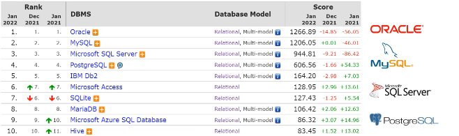
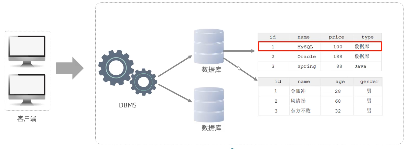

## mysql基础

### 1.mysql概述

##### 1.数据库相关概念

|      名称      |                             全称                             |               简称                |
| :------------: | :----------------------------------------------------------: | :-------------------------------: |
|     数据库     |            存储数据的仓库，数据是有组织的进行存储            |          DataBase（DB）           |
| 数据库管理系统 |                  操纵和管理数据库的大型软件                  | DataBase Management System (DBMS) |
|      SQL       | 操作关系型数据库的编程语言，定义了一套操作关系型数据库统一标准 |  Structured Query Language (SQL)  |

##### 2.主流的关系型数据库管理系统



- 数据库                数据存储的仓库
- 数据库管理系统 操纵和管理数据库的大型软件
- SQL                   操作关系型数据库的编程语言，是一套标准

##### 3.版本

1. MySQL官方提供了两种不同的版本:

   社区版（MySQL Community Server)

   免费，MySQL不提供任何技术支持

2. 商业版（MySQL Enterprise Edition)

   收费，可以试用30天，官方提供技术支持

##### 4.下载

[MySQL ：： 下载 MySQL Installer](https://dev.mysql.com/downloads/installer/)

##### 5.安装

详细的安装文档在同级目录下

##### 6.启动与停止

启动

```sql
net start mysql80
```

停止

```sql
net stop mysql80
```

注意在命令行cmd,终端中使用

##### 7.客户端连接

- 方式一：MySQL提供的客户端命令行工具

- 方式二：系统自带的命令行工具执行指令

  ```
  mysql [-h 127,0.0.1] [-P 3306] -u root -p
  //[-h 127,0.0.1] [-P 3306] 一般不用输入直接输入：
  mysql -u root -p
  ```

  注意方式二需要配置环境变量

##### 8.数据模型

- 关系型数据库（RDBMS）

  概念：建立在关系模型基础上，由多张相互连接的二维表组成的数据库。

  特点：
  1.使用表存储数据，格式统一，便于维护
  2.使用SQL语言操作，标准统一，使用方便

- 数据模型


### 2.sql

##### 1.SQL通用语法

- SQL语句可以单行或多行书写，以分号结尾。

- SQL语句可以使用空格/缩进来增强语句的可读性。

- MySQL数据库的SQL语句不区分大小写，关键字建议使用大写。

- 注释：

  单行注释：-- 注释内容 或 # 注释内容(MySQL特有)

  多行注释： /* 注释内容 */

##### 2.SQL分类

| 分类 |            全称            |                          说明                          |
| :--: | :------------------------: | :----------------------------------------------------: |
| DDL  |  Data Definition Language  |   数据定义语言，用来定义数据库对象(数据库，表，字段)   |
| DML  | Data Manipulation Language |     数据操作语言，用来对数据库表中的数据进行增删改     |
| DQL  |    Data Query language     |         数据查询语言，用来查询数据库中表的记录         |
| DCL  |   Data Control Language    | 数据控制语言，用来创建数据库用户、控制数据库的访问权限 |


##### 3.DDL

##### 4.DML

##### 5.DQL

##### 6.DCL

### 3.函数

### 4.约束

### 5.多表查询

### 6.事务

