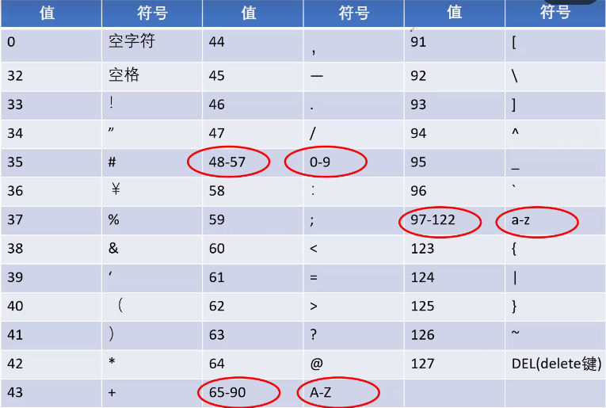
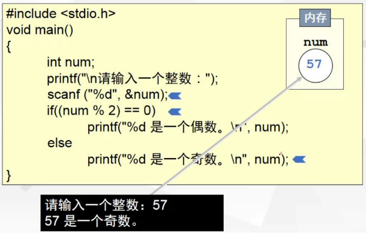
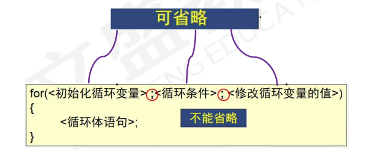

# C语言

## 第一章：C语言基础知识

### C语言基础知识 一

1. **程序**：一系列指令序列，即人机对话的语言
2. **语言分类**
   - **低级语言**：机器语言、汇编语言
   - **高级语言**：C,C++等

##### 程序设计的三大基本结构

1. 顺序结构
   - 从上到下从左到右 
2. 选择结构
3. 循环结构
   -  

##### 概念

1. 源程序：高级语言编写的程序
2. 目标程序：二进制代码表示的程序
3. 开发一个C程序的基本过程：
   - 编辑(.c 源程序)->编译(.obj 目标程序)->连接(.exe 可执行程序)->运行
4. C代码编译成可执行程序经过4步：
   - 预处理->编译>汇编->链接

##### C语言的基本结构

1. ```c
   #include <stdio.h> 
   int main(){
   	printf("Hello World\n"); 
   	return 0;
   } 
   ```

2. 介绍

   - 1、编译预处理命令
     - 以#开头  后面无分号
     - #include（包含）
     - #define    (宏定义)
   - 2、stdio.h文件中 包含了有关
     - (scanf)、输入
     - (printf) 、输出功能的函数。
   - 3、**函数是程序的基本单位。一个程序有且只有一个main()函数**，位置任意程序执行从main开始，到main结束。
   - 4、**分号为语句的分隔符**
   - 5、大括号标识一个语句组，成对使用
   - 6、若主函数为 void 可省略 主函数还可以是int

3. ```c
   #include <stdio.h> 
   int main(){
   	int a,b,c;
   	a=4;
   	b=10;
   	c=a+b;
   	printf("%d\n",c);
   	return 0;
   } 
   ```

##### 标识符

1. 标识符：在C语言中，有许多符号的命名如变量名、函数名、数组名等，都必须遵守一定**的规则**，按此规则命名的符号**称为标识符**。

2. 标迟符的命名规则：

   - **字母、数字、下划线_构成的有限序列**
   - **以字母或者下划线开头**
   - 标识符不能包含除以外的任何特殊字符，如：%、#、逗号、空格等。
   - 标识符**必须以字母或（下划线）开头。**
   - 标识符不能包含空白字符（换行符、空格和制表符称为空白字符）
   - C语言中的某些词（例如int和float等）称为**保留字**，具有特殊意义，不**能用作标识符名**。
   - C语言**区分大小写**，因此标识符price.与标识符PRICE是两个不同的标识
     符。

3. 分类

   1. **关键字**(32个)：C语言规定了一批标识符，他们在C语言中代表着固定的含义，不能另做它用。

      ```
      auto break case char const continue default do double
      else enum extern float or goto if int long register return
      short signed sizeof static struct switch typedef union
      unsigned void volatile while
      ```

   2. **预定义标识符**：C语言**语法允许**用户把这类标识符另**做它用**，但是这些标识符将失去系统规定的原意。

      比如：printf  define main scanf

   3. **用户标识符**：由用户根据需要定义的标识符称为用户标识符

##### 注释

- ```c
  //行注释
  /*注释内容不是程序代码，是给其他人员增强理解能力加上的文字说明当程序执行时注释内容视为空 */块注释
  ```

### 二、量

##### 一、常量

1. 常量是在程序中保持不变的量
2. 常量用于定义具有如下特点的数据
   - 在程序运行中**保持不变**
   - 在程序内部频繁使用
   - 用define关键字定义**符号常量**
   - 分类：整型常量、实型常量、字符常量、字符串常量  符号常量
     举例：1  2.5  'a'   “abc”
   -  

###### 整型常量

- 整数的表示
  1. 十进制表示：用一串连续的数字(0~9)表示十进制数。
     例如：345  3684  0   -23456 ***只有十进制负数前面加-**。
  2. 八进制表示：以数字**0**开头的一个连续数字序列，序列中只能有**0-7**这八个数字。（无负数）
     例如：045  067451等。  而：019 423  -078都是非法的八进制数。
  3. 十六进制表示：以0X或0x开头的连续数字和字母序列，序列中只能有0-9、A-F和a-f这些数字和字母，字母a、b、c、d、e、f分别对应十进制数字10、11、12、13、14、15,大小写均可。(0x里面x小写就用小写a-f 大写X就是A-F)（无负数）

###### 实型常量

1. 小数形式

   - 由数字和小数点组成，**必须有小数点**。(整数部分，小数部分为0可省略小数点不能省略)
     例如：3.14  0.15  .56  78.  0.0

2. 指数形式

   - 以**幂**的形式表示，以字母e或E后跟一个以10为底的幂数。

   - 数字 字母+(e/E) 指数(正负)

     

   - 字母e或E之前必须要有数字，且字母e或E后面的指数必须为整数，
     字母e或E的前后及数字之间不得有空格（实型变量也遵守这个
     规则)。技巧记忆：**e前e后必有数，e后必须是整数(负数0整数)！**e前为数
     例：2.3E5  500e-2  .5e3  4.5E0,  而e4  .5E3.6  .E5  e都不合法。

###### 字符常量

1. 定义：在程序中用**一对单引号把一个字符**括起来，作为字符常量。例'A','a','t','!','*','\n'等。Ascll A值65  a值97 
2. 说明
   - (1)字符常量只能**用单引号**括起来，**不能用双引号**；
     	如：“A”不是字符常量
   - (2)字符常量**只能包含一个字符**；如：'abc',错误。
   - (3)**区分大小写**；
      如：'A'和'a
   - (4)**字符**是**按**其代码 **ASCLL码(整数值)形式存储**，所有字符数据
     都作为整数来处理。因此，字符量可以**参与整数运算**。
   - 

###### 字符串常量

1. 定义：在程序中用一**对双撇号把若干个字符**括起来，
   作为字符串常量（但不包括一对双撇号）。
   例：“123”，“boy”,“a”等。

   字符串到\0结束后面的不要了

   占用空间个数：是串长度串中字符个数加1

   串长度：实际字母的长度不算\0结束标志

2. 说明：
   (1)字符串常量只能用**双撇号**，不能用单引号括起来；如：‘A’不是字符串常量
   (2)字符串常量**不能参与算数运算**。

3. 字符常量和字符串常量区别

   - 分界符不同字符串常量双撇号，字符常量单撇号
   - 字符串常量内容多个字符，字符常量一个字符
   - 占用空间不同字符串常量存储结尾**\0** (占用空间字节个数是字符数加1因为\0也占用一个字节)  字符常量占用1个字节
   - 字符参与运算，字符串不能参与运算

###### 符号常量

1. 用**编译预处理宏定义**一个符号名的方法来代表一个常量
   格式：**#define 宏名  宏值**

2. ```c
   #include <stdio.h> 
   #define PI 3.14159
   main(){
   	float r;
   	double s;
   	r=5.0;
   	s=PI*r*r;
   	printf("s=%f\n",s);
   }
   ```

##### 二、变量

1. 定义：在**程序运行过程中，值可以改变**的量

2. 说明

   - 每个**变量**有一个**名**字作为标识，属于用户标识符。
   - **变量**必须**先定义后使用**（定义后还得赋值才能用）
   - 变量代表了内存中的若干个存储单元，**变量名**实际上是以一个名字**代表**的一个**存储空间**（存储地址）
   - **变量名**和**变量值**是两个不同的概念
     - 定义变量时指定该变量的名字和类型
     - 从变量中取值，实际上是通过变量名找到相应的内存地址，从该存储单元中读取数据。

3. 声明变量：

   - 格式：**数据类型  变量名**；
     如：int  i

4. 变量初始化：

   - (1)**边定义变初始化： 数据类型  变量名=值**；（注意区分变量名和变量值）
   - (2)**先定义后初始化：数据类型变量名**；  变量名=值；

5. 常用定义变量的数据类型：

   int(4个字节)  char(1个字节)  float(单精度4字节) double(双精度4字节) （长度和机器有关）

### 三、运算符

##### 算术运算符

1.  

2. 基本的算术运算符：

   - | +:正号运算符（单目运算符） |
     | :------------------------: |
     | -:负号运算符（单目运算符） |
     |        *:乘法运算符        |
     |        /:除法运算符        |
     |        %:求余运算符        |
     |        +:加法运算符        |
     |        +:加法运算符        |
     |       ++:自增运算符        |
     |       --:自减运算符        |

   - 1、算术运算符

     - 1：* / %  双目/二元   从左向右  + - 双目  从左向右

       若以上5个运算符混合，* /  % 高于+ -，但是小括号()改变优先级

     - 2：**%求余要求两个操作数都为整数**

     - 3：类型转换(自动类型转换)：

       - char   char->int
       - int  char->int
       - int   int->int
       - char/int   float/double--->double
       - float    float/double--->double
       - double  double--->double
       - 注意：商 取整 向0 取整（下取整）

     - 4：**++ -- 自增 自减  单目 需要一个操作数（整型）**

       - **前缀 ++i --i 先变后用新值 先自增1在用新值  i=i+1在用新i 减同理**
       - **后缀 i++ --i 先用原值后变 先用i i在自增1 先用 i 原值 i=i+1**
       - **注意：前缀和后缀只有在表达式才有区别若作为单独语句功能相同没有区别**

   - 2.注意

     - (1)“%”的运算对象只能是整数，记法：整数%整数
     - (2)双目运算符运算结果类型
       - 运算数类型一致，结果类型同运算数类型。
       - **运算数类型不一致，**系统自动进行类型转换（**由低向高**转换)
         例：3/2的结果就是  1   3/2.0的结果就是1.5
     - (3)**强制类型转换：（类型名）(表达式)**
         如：3.5%2错误  （int）3.5%2正确

##### 赋值运算符

1. 值运算符和赋值表达式
    变量名=表达式
2. ※说明：
    1.优先级倒数第二，结合方向：右——>左
    2.**是一种赋予的关系而不是等价的关系**
    3.=**左侧只能是变量**，不能是表达式
    4.赋值号右边任意
    可以是一个赋值表达式吗？

##### 复合赋值表达式

1. 复合赋值运算符
   +=、-=、*=、/=、%=、《=、》=等（两个运算符之间不能有空格)

2. **借助复合的赋值运算符**将形如：
   “变量名=变量名+表达式”的表达式
   简化成：“**变量名+=表达式**”的形式

   说明：凡是有赋值运算符参加的运算都是从右往左算例：

   a+=3 等价于a=a+3
   x * =y+8 等价于x=x*(y+8)
   x%=3等价于x=x%3

##### 逗号运算符和逗号表达式

1. 定义：用逗号运算符将表达式连接起来的式子
2. 一般形式：表达式1，表达式2，表达式3，...，表达式n
3. 求解过程：
   从左到右一个一个求解，**最后一个表达式的值**就是整个、逗号表达式的值。
4. 说明：（1)结合方向左--右        (2)**优先级最低**
   例如：已知a=3   a=3,a+3结果：表达式的值为6
              b=a+3,a-3结果：表达式的值为0
   问：a=(2,3,4)a的值是多少？ a=4
          a=2,3,4 a的值是多少？   a=2 后面不保留

##### c语言运算优先级

- 一个表达式可以包含多个运算符。在这种情况下，运算符的优先级决定表达式的哪部分被处理为每个运算符的操作数。例如，按照运算规则，表达式中 *、/、以及 % 的优先级比 + 和 - 高。如下列表达式：

  ```
  a － b * c
  ```

  相当于 a－（b*c）。如果想让操作数以不同的方式组合在一起，则必须使用括号：

  ```
  (a － b) * c
  ```

- 如果一个表达式中的两个操作数具有相同的优先级，那么它们的结合律（associativity）决定它们的组合方式是从左到右或是从右到左。例如，算术运算符和操作数的组合方式是从左到右，赋值运算符则是从右到左，如表 1 所示。

- | 表达式 | 结合律   | 组合方式  |
  | ------ | -------- | --------- |
  | a/b%c  | 从左到右 | （a/b）%c |
  | a=b=c  | 从右到左 | a=（b=c） |

- 表 2 列出优先级次序下，所有 C 语言运算符的优先级和结合律。

- | 优先级 | 运算符                                                       | 结合律   |
  | ------ | ------------------------------------------------------------ | -------- |
  | 1      | 后缀运算符：[]   ()   ·   ->   ++   --(类型名称){列表}       | 从左到右 |
  | 2      | 一元运算符：++   --   !   ~   +   -   *   &   sizeof_Alignof | 从右到左 |
  | 3      | 类型转换运算符：(类型名称)                                   | 从右到左 |
  | 4      | 乘除法运算符：*   /   %                                      | 从左到右 |
  | 5      | 加减法运算符：+   -                                          | 从左到右 |
  | 6      | 移位运算符：<<   >>                                          | 从左到右 |
  | 7      | 关系运算符：<<=   >>=                                        | 从左到右 |
  | 8      | 相等运算符：==   !=                                          | 从左到右 |
  | 9      | 位运算符 AND：&                                              | 从左到右 |
  | 10     | 位运算符 XOR：^                                              | 从左到右 |
  | 11     | 位运算符 OR：\|                                              | 从左到右 |
  | 12     | 逻辑运算符 AND：&&                                           | 从左到右 |
  | 13     | 逻辑运算符 OR：\|\|                                          | 从左到右 |
  | 14     | 条件运算符：?:                                               | 从右到左 |
  | 15     | 赋值运算符：    =     +=     -=    *=    /=    %=    &=    ^=    \|=     <<=    >>= | 从右到左 |
  | 16     | 逗号运算符：，                                               | 从左到右 |

- 表 2 中优先级最高的运算符中的最后一个（类型名称）{列表} 是 C99 新增加的。

- 一些运算符记号在表 2 中出现了两次。例如，自增运算符 ++ 和自减运算符 --，在作后缀运算符（如表达式 x++）时，较其用作前缀运算符（如表达式 ++x）时，具有较高的优先级。

- +、-、* 和 & 运算符记号不但可以当作一元运算符（unary operator，只需要一个操作数），也可以当作二元运算符（binary operator，需要两个操作数）。例如，* 只有一个操作数的时候，就是间接运算符（indirection operator），而有两个操作数的时候，就是乘号。

- 在这些例子中，一元运算符比二元运算符具有更高的优先级。例如，表达式 *ptrl**ptr2 等同于表达式（*ptrl）*（*ptr2）。

## 第二章：流程控制结构

### 顺序结构

##### 语句

- 语句：C语言中描述计算过程的最基本单位。 由分号**；**结束。
- 顺序结构：按语句在程序中出现的顺序逐条执行，没有分支、没有转移。

##### 复合语句和空语句

1. 复合语句

   - 定义：用一对**花括号**把若干语句括起来构成一个语句组。
   - 注意：
     (1)花括号内语句的数目不限
     (2)在**花括号外面不能加分号**

2. 空语句

   ```c
   main(){
    ;
   }
   ```

##### 数据输出

1. 基本概念

   1. 输出：把数据从计算机**内部**送到计算机**外部设备**上的操作称为"输出”
   2. 输入：从计算机**外部设备**将数据送入**计算机内部**的操作称为”输入”。

2. 注意：C语言本身不提供输入和输出语句，但是有输入和输出函数。

3. 在使用输入输出函数时，要在程序文件的开头用预编译指令

   ```c
   #include <stdio.h> /根目录
   或
   #include "stdio,h" /用户目录
   ```

4. printf()函数

   1. 作用：在终端设备上按指定格式输出

   2. 一般调用形式：

      表达式：printf (格式控制，输出项表)
      **语句：printf (格式控制，输出项表)；**

   3. 

   4. 常用格式字符

      1. d格式符：用来**输出一个有符号的十进制整数**

         - 指定列宽：**%md** 右对齐 **%-md** 左对齐  

            输入的数不够m先填几个空列右对齐前面左对齐后面

         - %d输出int型数据

         - %ld输出long型数据

      2. c格式符：用来输出一个字符

         ```c
         char ch='a';
         printf("%c",ch; //输出字符：a
         printf("%5c",ch); //输出字符：空4个a
         ```

      3. s格式符：用来输出一个字符串

         ```c
         printf("%s","CHNA")
         ```
      
         输出字符串：CHINA

      4. f格式符：用来输出实数，以小数形式输出

         - 下指定数据宽度和小数位数，用%f

           例：用%输出实数，只能得到6位小数。

           ```c
           double a=1.0;
           printf("%f\n",a/3);
           0.333333
           ```
      
         - 指定数据宽度和小数位数：用%m.nf(右对齐)  m列宽 n小数位数

           ```c
           printf("%20.15f\n",1.0/3);
           //空4位 0.333333333333333 15位小数
           printf("%.0f\n",10000/3.0):
           //3333
           float n=9.478689;
           printf("%f",n);
           //输出结果：9.47869  
           //默认情况下精确到六位小数 上面是7位四舍五入
           //m宽度，表示所有的数字和小数点所占的位数，不够20位右对齐。如果m比较小比如1输出的数位数大于m就没有作用
           //n精度（精确到小数点后多少位）
           
           ```
      
         - 输出的数据向左对齐，用%-m.nf

      5. **e(E)**格式符。指定以**指数形式输出**实数

         - %e,VC++给出小数位数为6

         - 小数点前必须有而且只有1位非零数字

           ```c
           printf("%e",123.456;
           //输出：1.234560 e+002  002表示10的2次方
           ```
      
         - %m.ne 设置列宽和小数位数 m列宽 n小数位数

           ```c
           printf("%13.2e",123.456)
           //输出：    1.32 e+001 前面4个空格 
           ```
   
5. 注意

   - 遇到%号字符，按后面输出列表变量的值代替
   - 遇到 \ 转义符体现功能
   - 其他一般字符原样输出
   - 字符型用%d输出是字符码的值

6. 注意事项

   1. 格式控制中应包含与输出项**一一对应**的输出格式说明，类型必须匹配；
      (1)若格式说明的**个数少于输出项个数**，则多余的输出项不予输出。

      ```c
       如：int x=12,y=28;printf('%d',x,y);
      ```

      (2)若格式**说明的个数多于输出项个数**，输出乱码。

      ```c
      //如：
      int x=12,y=28;
      printf("%d%d%d",x,y);
      ```

      

   2. **同一变量，不同形式**，出现在同一条输出函数调用中。

      ```c
      //如：
      int k=21;
      printf("%d,%d",k,++k);
      //输出22,22
      ```

      原因：printf函数其参数**从右往左进行处理**，先计算++k。显示值时，从左往右。其实k是先执行的但是进入栈了++k后进栈 但是栈后进先出

##### 数据输入

1. scanf函数的一般调用形式
   - 作用：在终端设备上输入数据
   
   - 一般调用形式：
     表达式：scanf(格式控制，地址表列)
     语句：scanf(格式控制，地址表列)；
     
     **格式控制**含义同printf函数
     **地址表列**可以是变量的地址，或字符串的首地址
     
   - 注意：格式控制必须与你对应的变量的类型相等，否则会出现意
     想不到的数据。
     **记忆：第一部分格式控制的形式在终端输入数据    一模一样！**
     
   - scanf函数中的格式声明
   
     %+格式字符，中间可以插入附加的字符，**附加字符必须原样输入**。
   
     ```c
     scanf("a=%f,b=%f,c=%f",&a,&b,&c);
     //a=是附加字符输入的时候必须输入a=...
     ```
   
   - 
   
2. 使用scanf函数时应注意的问题

   - ```c
     scanf("%f%f%f",a,b,c);//错
     scanf("%f%f%f",&a,&b,&c);//对
     scanf("a=%f,b=%f,c=%f",&a,&b,&c);
     //132错
     //a=1,b=3,c=2对
     //a=1b=3c=2错
     scanf("%c%c%c",&c1,&c2,&c3);
     //abc对
     //a b c 错
     对于scanf("%d%c%f",&a,&b,&c);
     //若输入1234a123o.262   
      a=1234 b=a c=123 剩下不要但不是不存在
     ```


### 选择结构

##### C语言中的逻辑值

1. 逻辑值只有两个，分别用“真”和“假”表示。

2. **任何基本类型的值都可作为逻辑值**使用。
   C语言没有专门的逻辑值，**所有非0**的值被都被
   当作“真使用，而0值被当作“假”使用。

3. 关系运算符、关系表达式

   - 关系运算实际上是“比较运算”
   - C语言的关系运算符共6种：
   - **优先级**：前四种优先级高于后两种
     **结合方法**：从左向右
   - 关系运算符的操作数可以是**变量、常量或表达式**。
   - 关系表达式的
     **计算结果=逻辑值（真或假）**
     在C语言中，“0”表示“假”，“非0”表示“真”

4. 逻辑运算符、逻辑表达式

   - 3种逻辑运算符：
     &&(逻辑与)   || (逻辑或） ! (逻辑非）

   - 双目 || &&  单目 ! 

   - 逻辑运算符的优先次序

     ! → && →|| (!为三者中最高)

   - 逻辑运算符与逻辑表达式

     非取反真变假假变真

     逻辑与同真为真其他为假

     逻辑或同假为假其他未真

5. 运算符的优先次序

   -  运算次序：

6. 逻辑运算符与逻辑表达式

   - 表示逻辑运算结果时：1“真”，0“假”

   - 判断一个量是否为“真”时：0“假”，非0“真”

   - 注意：将一个非零的数值认作为“真”

   - 短路

     与遇见0就**短路** **后面不算**结果0

     或遇见1就 不算结果1

##### 选择结构

1. 选择结构：根据条件进行判断真假，执行不同的操作。
   简单if语句的一般形式为

   - 如果条件为真，语句执行一个语句或一组语句；

   - 如果条件为假，则执行if语句后面(else)的语句（如果有)。

   - if-else语句的一般形式为：

     ```c
     if(<表达式){
     <语句块>
     }else{
     <语句块>
     }
     ```

   - 

     **闰年判定**：年份能被4整除**但**(&&)不能100整除，**或者**(||)年份能被400整除

2. 嵌套if

   匹配规则

   - 有else必有if
   - 匹配：else与它前面的、紧挨着的、未被匹配的相匹配。
   - 例
   - if下面没括号是1行其他行是正常语句

3. 条件运算符和条件表达式

   - 条件表达式的一般形式为：
     表达式1？表达式2：表达式3

   - 条件运算符的执行顺序：

     ◆求解表达式1
     ◆真：求解表达式2，值为整个条件表达式的值
     ◆假：求解表达式3，值是整个条件表达式的值

     **注：唯一的三目运算符  记忆： 真前假后**

   - 算术>关系>逻辑>条件>赋值>逗号

   - 结合性：“自右至左”

   - 以下为合法的使用方法：

     ```c
     a>b?(max=a):(max=b);
     a>b?printf("%d",a):printf"%d",b)
     ```

   - 


##### switch语句break语句

1. switch语句用来实现多分支选择结构

2. switch语句的作用**是根据表达式的值，使流程跳转到不同的语句**。

3. switch语句的一般形式：

   ```c
   switch(表达式){  //整型/字符型/枚举类型的表达式
    case 常量表达式1:语句1；
    case 常量表达式2:语句2；
        ...
    case 常量表达式n:语句n; //不能相同
    default :语句n+1;  //位置任意
   }
   ```

4. 在使用switch结构时应注意以下几点：

   - (1)在case后的**各常量表达式的值不能相同**，否则会出现错误；
   - (2)case和常量表达式之间要**有空格**，如：case 10
   - (3)在case后，可以**省略语句**；也可以有多个语句，多个语句不用{}括起来；
   - (4)每个case语句后**都应该**有一个break语句；
   - (5)各case和default子句的先后顺序可以变动；
   - (6)default子句可以省 位置任意 **如果没有匹配的就执行default语句然   后退出**
   - (7)break用于结束跳出本switch

5. 注：没有break的时候，只要有一个case匹配，剩下的语句都执行，直至结束switch

6. 由条件值选择分支 

   break退出所在的switch  

   若条件值和各分支常量不同则跳过switch向下执行

7. 比较多重f和switch结构

   - 多重if结构用来实现两路、三路分支比较方便，而switch:结构实现三路以上分支比较方便。
   - 在使用switch结构时，应注意分支条件要求是简单数据类型(int、char)表达式，而且case语句后面**必须是常量表达式。**
   - 有些问题只能使用多重if结构来实现，例如要判断一个值是否处在某个**区间**的情况。

### 循环结构

- 需要多次重复执行一个或多个任务的问题一般用循环解决

##### while循环

1. while循环的一般语法：

   ```c
   while(表达式)
   {
   语句
   }
   ```

2. 工作原理

   - 计算表达式的值，当值为真（非0）时，执行循环体语句，一旦条件为假，就停止执行循环体。如果条件在开始时就为假，那么不执行循环体语句直接退出循环
   - 若循环体为一条语句不用花括号

3. 规则：

   - 1、循环中使用的变量 必须初始化
   - 2、循环体中的语句必须实现修改循环条件的值，避免死循环。
   - 例子

##### do while循环

1. do while循环的一般语法：

   ```c
   do
   {
   语句；…
   }while(表达式);
   ```

2. 工作原理

   - 它先执行循环体中的语句，然后再判断条件是否为真如果为真则继续循环；如果为假，则终止循环。
   - 

3. 比较while和do-while循环

   - 

**总结**

1. 循环结构的特点是：条件成立时，重复执行某程序段，条件不成立，退出
2. while循环**先判断后执行。**
3. do-while循环**先执行后判断**，循环将**至少**执行**一次**。
4. 在循环中，需要修改循环变量的值以改变循环条件，否则有可能形成死循环。
5. 循环可以嵌套

##### for循环

1. for语句的一般形式

   ```c
   for(表达式1;表达式2;表达式3)
   {循环体} //若为1条语句不用花括号
   ```

2. 规则

   - 表达式1设置初始条件，只执行一次。可以为零个、一个或多个变量设置初值执行
   - 表达式2循环条件表达式，用来判定是否继续循环。在每次执行循环体前先执行此表达式，决定是否继续执行循环 **为真执行循环体为假退出循环**
   - 表达式3作为循环的调整器，例如使循环变量变化，它是在执行完循环体后才进行的。

3. for语句的执行过程：

   - (1)先求解表达式
   - (2)求解表达式2，若其值为真，执行循环体，然后执行下面第(3)步。若为假，则结束循环，转到第（5）步
   - (3)求解表达式3
   - (4)转回上面步骤(2)继续执行
   - (5)循环结束，执行for语句下面的一个语句

4. for循环的表达式

   for循环中有三个表达式
   for语句中的各个表达式都可以省略
   分号分隔符(；)不能省略

   - 省略表达式1:省去循环变量赋初值，应在for语句之前有给
     循环变量赋初值语句。

   - 省略表达式2:即不判断循环条件，表达式2恒真，**应在循环体**
     **内设法结束循环（一般用if+break),**否则将成为死循环。

     ```c
     for(num=1;;num++){
         ...
      if(num >100)
       break://跳出循环
         ...
     }
     ```

   - 省略表达式3：省去修改循环变量值的操作，需要在循环体内具
     有更改循环变量的值的语句。

   - 省略三个表达式：都省略，for前须有变量初始化语句，循环体内须有控制循环结束的语句，须有改变变量值的语句。

     ```c
     for( ; ;){
       printf("这将直进行下去");
       i=getchar();
       if==(i=='X'||i=='x')
        break;
     }
     ```

5. 循环的嵌套

   - 循环的嵌套：一个循环体内又包含另一个完整的循环结构
   - 3种循环(while循环、do..while循环和for循环)可以互相嵌套

6. 例

   - 编程找出100以内的素数

     ```c
     #include <stdio.h>
     int main(){
     	int i,k,flag;
     	for(i=2;i<=100;i++){
     		flag=0;
     		for(k=2;k<i;k++){ 
                 //除了自己和1能除尽其他的数除尽了就不是素数
                 //素数又叫质数（prime number），有无限个。质数定义为在大于1的自然数中，除了1和它本身以外不再有其他因数。
     			if(i%k==0)
     			 flag=1;
     		}
     		if(flag==0){
     			printf("%d ",i);
     		}
     	}
     } 
     ```

   - 

##### 改变循环执行的状态

1. 用break语句提前终止循环
   - break语句可以用来从循环体内跳出循环体，即提前结束循环，接着执行循环下面的语句。跳出所在的循环
   - 例
   - break语句可以改变程序的控制流
   - break语句用于do-while、while、for循环中时，可使程序终
     止循环而执行循环后面的语句
   - break语句通常在循环中与if语句一起使用。若条件值为真，
     将跳出循环
   - 如果已执行break语句，就不会执行循环体中位于break语句后
     的语句
   - 在多层循环中，一个break语句**只向外跳一层**(跳出所在一层)
2. 用continue语句提前结束本次循环
   - 有时并不希望终止整个循环的操作，而只希望提前结束本次循环，而接着再一次进入循环条件的判定，执行下次循环。这时可以用continue语句。
   - continue语句一般用在循环里
   - continue语句的作用是**跳过循环体中剩余的语句而执行下一次循环**
   - 对于while和do-while循环，continue语句执行之后的动作是条件判断：**对于for循环，随后的动作是变量更新。**
3. break语句和continue语句的区别
   - break跳出整个循环 （大跳）
   - continue跳出本次循环（小跳）（还继续执行循环）
   - 

## 第三章：函数

### 函数分类

1. 可以使用**系统函数**（库函数）
   - 编译系统提供，不用自行定义。
     需要借助编译预处理的包含命令讲所在库包含进来
   - 
   - 例子
2. **用户定义的函数**：
   - 解决用户专门需要而定义的函数。
   - 先定义后使用（先声明后使用）
3. 在程序设计中要善于利用函数，**函数是C程序的基本单位**，是用于完成特定任务的程序代码单元

### 函数的定义和返回值

1. 为什么要定义函数

   - C语言要求，在程序中用到的所有函数，必须 **“先定义，后使用”****
   - 指定函数名字、函数返回值类型、函数实现的功能以及参数的个数与类型，将这些信息通知编译系统。

2. 一般形式

   ```
   函数类型 函数名 （参数表）
   {
    函数体
    //实现函数功能的语句序列，注意即使1条语句也要花括号括起来
   }
   ```

3. 函数的类型

   - 函数的返回值类型，可以是int char double...，若**函数只有动作没有返回值**此时函数的类型为 **void**
   - 若函数定义时的函数类型和return语句返回类型**不一致以定义类型为准**
   - 若**一般函数省略类型默认为int类型** （主函数省略类型默认为void）

4. 函数名

   - 见名晓意，符合命名规则的标识符。
   - 由标识符后面**紧跟着小括号(参数表)**，**确定是函数名**而不是一般变量

5. 参数表（） **//定义时，参数表后无其他符号**

   - （）无参的参数表

   - （参数类型1 参数1，参数类型2 参数2，...）有参的参数表

     注意：即便所有参数是相同类型，也要各自体现参数类型

     ```
     (int a,int b,int c)
     ```

     - 若定义时，函数名后边的参数表为形式参数表（所有参数的类型和名必须完整体现）

     - 而调用函数时，函数名后面的参数为实际参数表（只需要体现出实际参数，不需要体现类型）

       ```c
       int fun(int a,char b,double c){} //形式参数表
       fun(10,m,1.25*d)//实际参数表
       ```

6. 函数体{ } **//定义时函数体后无其他符号**

   - 函数功能实现的部分，由0条以上的执行语句构成

7. return语句

   - 在函数体中，由return语句反回值，一个函数可能有多条return语句，执行到哪个return哪个return起作用
   - 若return语句返回值类型和函数类型不一致，以定义时函数类型为准。

### 函数的声明

1. 一般，函数要先定义后使用

   - 函数声明：对即将用的函数先声明，交代有此函数，可以用，函数完整定义一般在主函数之后

2. 一般形式

   - ```c
     //函数类型 函数名(参数表); //函数头部;
     int fun(int a,int b);
     //等价
     int fun(int,int); //更合适
     ```

   - 注意：函数声明，函数类型 ，函数名，参数表中参数类型和个数必须与定义函数时的类型，函数名。参数表（参数的类型和个数）一 一对应

### 函数调用

1. 调用形式

   - 函数名(实参表) ;  //函数表达式

2. 若为无参的函数

   - 函数名();

   - 例

     ```c
     void printstar(){...}
     //调用 
     printstar();  //语句调用
     ```

   - 若为有参的函数

     函数表达式可以出现在任意位置

     ```
     (1)B+fun(0);
     (2)max(10,fun(a)); //fun(a)作为max函数的实参
     (3)b=fun(a);
     ...
     ```

### 参数传递

1. 调用函数时，由**实际**参数向**形式**参数传递，**单向**传递

   此时：形式参数会分配空间，存储实际参数传递过来的值

2. 函数调用三步

   - 参数传递 实——>形 单项
   - 执行函数体
   - 返回到调用函数的位置

3. 参数个数(调用函数时)

   - 函数调用时实参个数，看最外层括号所包含的逗号的个数，实参个数=逗号个数+1


### 函数的递归调用

1. 
2. 递归调用：在函数体内调用自身
   - (直接递归间接递归)，正向推，反向带回值
   - 要求：(1)在函数体中，有调用自身的语句一>递归体
                (2)递归出口，一般以if条件结构设定
3. 满足条件：
   - 要解决的问题转化为一个**新问题，方法与原问题相同**，只是**处理对象有规律地递增或递减。** 递归体
   - 必须有**递归结束**的出口，**一般借助if条件实**现。

### 全局变量和局部变量

1. 从变量起作用的范围分为：

   - **局部变量**：在**函数内或复合语句内定义**的变量

   - **全局变量**：在**函数之外定义**的变量

     √可以为本文件中其他函数所共用
     √有效范围为从定义变量的位置开始到本源文件结束

2. 局部变量

   - 程序执行过程中，动态地分配存储空间
   - 调用函数时，系统会自动给局部变量分配存储空间，调用结束时就自动释放空间。
   - 函数中定义的变量、函数形参，复合语句中定义的变量等。

3. 静态局部变量(static局部变量)

   - 用关键字**static**进行声明
   - 希望函数中的某些局部变量在函数调用结束后不消失而继续**保留原值**，即其占用的存储单元不释放，在下一次再调用该函数时，该
     变量已有值（上一次函数调用结束时的值），指定该局部变量为“静态局部变量”
   - 特殊：**第一次遇见分配空间，存储值，后边再次出现，会保留原有操作过的结果**

## 第四章：数组

### 一维数组

##### 定义一维数组

1. 定义：数组是**相同类型**的**数据元素**构成的**有限**集合

2. 数组：**先定义**数组，**后使用数组里的元素**

3. 一般形式

   ```
   类型 数组名[长度];
   ```

   类型： char double float 结构体类型

   数组名：符合命名规则的标识符

   长度：整型的常量表达式 表明数组中数据的个数

   ```c
   int a[10];
   ```

##### 引用数组

1. 使用数组一般形式

   ```
   数组名[i] 
   0<= i <=长度-1
   
   ```

   注意：只能**逐个引用**数组元素，**不能一次整体调用**整个数组全部元素的值

   数组名[下标表达式]  下标表达式（整型常或表达式）

2. 数组初始化

   ```c
   //在定义数组的同时，给各数组元素赋值
   int a[10]={0,1,2,3,4,5,6,7,8,9};
   
   int a[10]={0,1,2,3,4};
   //部分赋值，相当于
   int a[10]={0,1,2,3,4,0,0,0,0,0};
   
   int a[10]={0,0,0,0,0,0,0,0,0,0};
   //相当于
   int a[10]={0};
   
   int a[5]={1,2,3,4,5};
   //可写为
   int a[]={1,2,3,4,5};//省略长度，后必须有初始化列表
   
   //使用
   a[0] a[1] a[2] 
       
   //其他的初始化情况：
   int arr[10]={10,9,8,7,6,5,4,3,2,1,0};//错误！越界了
   int arr[10]={9,8,7,5};//正确，后面的6个元素初始化为0
   int arr[]=9,8,7};//正确：元素个数为3
   int arr[]={}; //错误，到底是几个元素？
   ```

3. 注意

   - 数组下标从0开始
   - 数组元素在内存中按顺序连续存放
   - 数组名代表数组的首地址，是地址常量，即score与&score[0]的值相同

4. 数据表示：变量

5. 赋值

   - 只能逐个对数组元素进行操作（字符数组例外）
   - 一般维数组的处理用**一重循环**来实现，用**循环变量**的值对
     应数组元素的下标  int a[10] ，i;
   - scanf("%d",数组名) 在for里面不能逐个输入因为数组名只表示a[0]的地址 如果scanf("%s",数组名) 可以输入一个字符串

6. 

   数组是一组相同类型的数据组成的有限集合
   数组是可以在内存中连续存储多个元素的结构
   数组中的数据称为数组元素，数组元素个数称为数组长度
   数组元素用数组名和元素下标表赤，如score[0],score[1]

### 二维数组

1. 形式

   ```
   数据类型 数组名[][];  [内为整型常量表达式]
   例：int a[3][4];  //12个整型的元素
       double b[5][6];
       char c[5][20]
       []代表维度在二维数组中,第一[]个为行数第二个[]为列数
       存储空间按行优先顺序存储
       int a[3][4];  a[0][0]  a[0][1] a[0][2] a[0][3]
                     a[1][0]  a[1][1] a[1][2] a[1][3]
                     a[2][0]  a[2][1] a[2][2] a[2][3]
   ```

2. 数组元素：数组名[行下标] [列下标]   0<=行下标 列下标<=长度-1

3. 可以把二维数组看成包含有行值那么多个的一维数组

   ```
   int a[3][4];
   看作 a[0],a[1],a[2]
   这三个元素每个都是含有列值那么多个的一维数组
   a[0]-> a[0][0]  a[0][1] a[0][2] a[0][3]
   a[0] a[1] a[2]不是二维数组的数据元素而是每行的地址
   int a[2][5]; 3X4=10个元素 X 4 =40个存储空间
   ```

4. 初始化

   - 按行赋初值：

     ```
     int a[2][3]={{1,2,3},{4,5,6}}; 123 456
     int a[2][3]={{1},{4,5,6}}; 100 456
     ```

   - 按数组元素存放顺序赋初值：

     ```
     int a[2][3]={1,2,3,4,5,6}; 123 456
     int a[2][3]={1,2,3}; 123 000
     ```

   - 省略行数（根据初值个数和列声明自动确定行数 **不可以省略列**）

     ```
     int b[][3]={1,2,3,4,5,6,7,8,9,10};4行123 456 789 1000
     int c[][3]={{1,2},{3}}; 120 300
     ```

5. 二维数组值的输入和输出

   - 一般二维数组的处理用**二重循环**来实现，用循环变量的值控制数组元素的下标     int a[3] [4], i , j；

6. 

   解题思路

   - 可以定义两个数组：数组a为2行3列，存放指定的6个数

   - 数组b为3行2列，开始时未赋值

   - 将a数组中的元素a[i] [j]存放到b数组中的b[j] [i]元素中

   - 用嵌套的for循环完成

     二维数组求最大值

## 第五章：指针

1. 指针：变量：值为某一个变量地址的变量

### 指针和变量

1. 定义类型(先定义后使用)

   ```
   数据类型 * 指针变量名;
   数据类型 *:指针可以指向的数据元素的类型
   例:int *p;//p为指针
      int n;
      p=&n;
      int m;
      p=&m;
   例
      int n;
      int *p=&n;
   ```

   >指针就是地址，地址就是指针；
   >指针变量是存放另一个对象地址的变量，称该变量指向这个对象；
   >指针变量可以赋值，一个指针的指向在程序执行中可以改变。

2. 使用指针

   - 区分 p &p *p

     ```
     例 
       double d=3;
       double *p=&d;
       用指针可以间接的操作它所指向的数据元素即*p==d
       prinf("%d,%d,%d,%d",d,p,&p,*p)  
       d,d的地址,指针的地址,d
       *p=10;间接改变 d=10
     例 
       int e=20;
       p=&e;
       prinf("%d,%d,%d,%d",d,e,p,*p)
       d,e,e的地址,e
       引用指针变量的值如：
       printf("%o"p;) //八进制输出指针的值e的地址
       例 
       int *p , n;
       double d;
       p=&n;
       *p=10;
       p=&d;//不可以因为p的指针类型为int d的指针类型为double
       p=NULL //赋值为0
     ```
     

3. 指向指针的指针

   - ```
     int **p,*s,k;
     定义的p是一个指向指针的指针变量：
     k=20;
     S=&k;
     p=&s;
     //*s==k  **p==k
     ```

4. & *运算符：

   1. &取地址运算符 &a是变量a的地址

      & 和 *互逆

      ```
      *(&n)=n
      *p=n
      ```

   2. *指针运算符(“间接访问算符)

      ```
      如果：p指向变量a,则*p就代表a
      k=*p; (把a的值赋给k)
      *p=1; (把1赋给a)
      ```

5. 给指针赋值

   1. 用变量的地址给指针变量赋值

      - (使用求地址运算符&)
        注：只能用同类型变量的地址进行赋值！

        ```
        如定义：int*s;float f;
        则s=&f;是非法的
        ```

   2. 用相同类型的指针变量赋值

   3. 赋空值

      - 若不需要指向某个特定的存储地址，或不确定指向时则赋空值。

        ```
        正确用法
        int *p;
        p=0;
        p=NULL;
        ```

      - ```
        注意：下面赋值是非法的
        int a,*p;
        p=2000;a=p;
        ```

6. 对指针变量的操作

   - C语言提供了一个称作间接地址运算符的单目运算符 * ，当指针变量中存放一个确切的地址时，可以用“*”通过指针来间接用、修改地址存储单元的内容。

   - 通过指针引用一个存储单元（间接访问）

     直接访问：通过变量本身对变量进行存取的方式。
     间接访问：通过指针变量实现对变量的访问方式。

     ```
     间接访问的过程是：
     由指针变量得到变量的地址，根据该地址找到变量的存储区，再对该
     存储区的内容进行存取，从而实现了对变量的间接访问
     int a,*p=&a;
     a=10 /*直接访问，结果a的值为10*/
     &p=*p+10;/*间接访问，结果a的值为20*/
     ```

   - :

   - 注意：* ++/-- 运算级别相同，**同时出现，从右向左进行计算**

     ```
     int a=[10],*p;
     p=a;
     a[0]=1;
     a[1]=2;
     *p++; //的含义:用的是*p,然后指针P进行自增1 然后指针p指向a[1]
     (*p)++; //的含义:指针p指向的的变量a的值进行自增1 a[0]的值自增1变成2
     ```

     

### 一维数组和指针

1. 定义

   - 数组名：**指针常量**（值是数组的起始地址，也为数组第一个元素的地址)不可改变

   - 指针：**变量**，让其指向数组后，可以借助指针变量操作数组元素

   - ```
     //可以用一个指针变量指向一个数组元素
     inta[10]={1,3,5,7,9,11,13,15,17,19};
     int *p; 
     p=&a[0]; //等价于p=a;  int*p=a  int *p=&a[0];
     //*p==a[0];  *p==*a==a[0];
     ```

   - 注意：数组名a不代表整个数组，只代表数组首元素的地址。p=a;的作用是把a数组的首元素的地址赋给指针变量p,而不是"把数组a各元素的值赋给p"

2. 在指针指向数组元素时，允许以下运算：

   - 加、减一个整数n,如p+ - n(注意界限)

   - 自增运算，如p++,++p

   - 自减运算，如p--,--p

   - 两个指针相减，如p1-p2(只有p1和p2都指向同一数组中的元素时才有意义)

   - 

   - ```
     p=a; //条件  0<i<长度
     p[i]==a[i];
     *(a+i)==*(p+i);
     数组指针可以减法不可以加法
     减法比如p=a  a[p-a]==a[0]
     a数组是常量不能改变
     注：*p++是先取p指向的变量，在将p向后移动
     ```

   - 

3. 

   

## 第六章：结构体和文件

## 第七章：综合练习