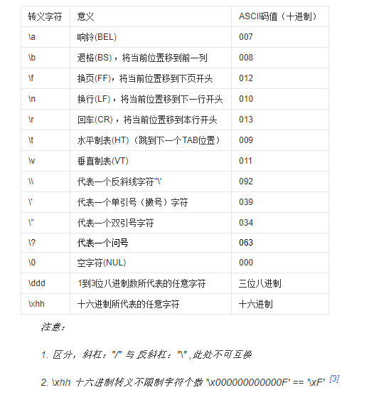
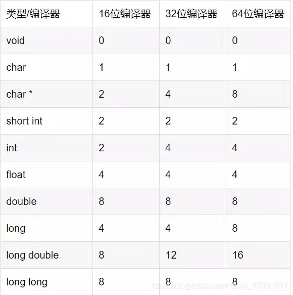
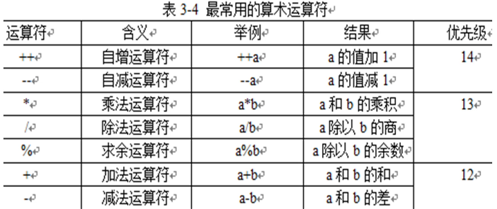
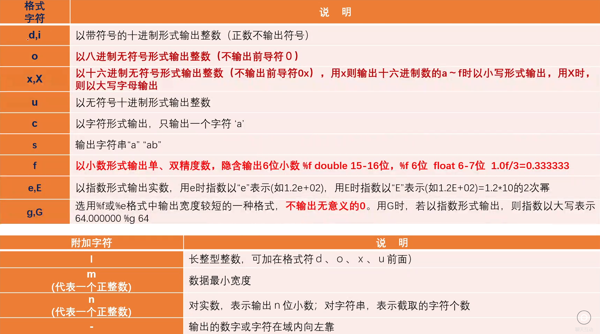

# C语言

## C语言基础

### 概念

1. **程序**：一系列指令序列，即人机对话的语言

2. **语言分类**

   - **低级语言**：机器语言、汇编语言
   - **高级语言**：C,C++等

3. 程序设计的三大基本结构

   1. **顺序结构**
   2. **选择结构**
   3. **循环结构** 

4. 源程序：高级语言编写的程序

5. 目标程序：二进制代码表示的程序

6. 开发一个C程序的基本过程：

   - **编辑(.c 源程序)->编译(.obj 目标程序)->连接(.exe 可执行程序)->运行**

7. C代码编译成可执行程序经过4步

   - 预处理->编译>汇编->链接

8. C语言是一种**结构化的程序设计语言**,简明易懂，功能强大，适合于各种硬件平台。C语言**即具有高级语言特点，又具有低级语言的功能。**

9. 基本结构

   ```c
   #include <stdio.h> 
   int main(){
   	printf("Hello World\n"); 
   	return 0;
   } 
   ```

10. **函数是程序的基本单位。一个程序有且只有一个main()函数**，**位置任意**程序执行**从main开始，到main结束**

11. **分号为语句的分隔符**

12. 大括号标识一个语句组，成对使用

13. 若**主函数为 void 可省略 主函数还可以是int**

    ```c
    #include <stdio.h> 
    int main(){
    	int a,b,c;
    	a=4;
    	b=10;
    	c=a+b;
    	printf("%d\n",c);
    	return 0;
    } 
    ```

### 标识符

1. 标识符：在C语言中，有许多符号的命名如变量名、函数名、数组名等，都必须遵守一定**的规则**，按此规则命名的符号**称为标识符**

2. 标迟符的命名规则：

   - **字母、数字、下划线_构成的有限序列**
   - **以字母或者下划线开头**
   - 标识符不能包含除以外的任何特殊字符，如：%、#、逗号、空格等。
   - 标识符**必须以字母或（下划线）开头。**
   - 标识符不能包含空白字符（换行符、空格和制表符称为空白字符）
   - C语言中的某些词（例如int和float等）称为**保留字**，具有特殊意义，不**能用作标识符名**。
   - C语言**区分大小写**，因此标识符price.与标识符PRICE是两个不同的标识符。
     

3. 分类

   1. **关键字**(32个)：C语言规定了一批标识符，他们在C语言中代表着固定的含义，不能另做它用。

      ```
      auto break case char const continue default do double
      else enum extern float or goto if int long register return
      short signed sizeof static struct switch typedef union
      unsigned void volatile while
      ```

   2. **预定义标识符**：C语言**语法允许**用户把这类标识符另**做它用**，但是这些标识符将失去系统规定的原意。

      比如：printf  define main scanf

   3. **用户标识符**：由用户根据需要定义的标识符称为用户标识符

### 注释

- ```c
  //行注释
  /*注释内容不是程序代码，是给其他人员增强理解能力加上的文字说明当程序执行时注释内容视为空 */ //块注释
  ```

### 常量

1. 常量是在程序中保持不变的量
2. 常量用于定义具有如下特点的数据
   - 在程序运行中**保持不变**
   - 在程序内部频繁使用
   - 用define关键字定义**符号常量**
   - 分类：**整型常量**、**实型常量**、**字符常量**、**字符串常量**、**符号常量**
     举例：1  2.5  'a'   “abc”

##### 整型常量

1. 十进制表示：用一串连续的数字(0~9)表示十进制数。
   例如：345  3684  0   -23456 **只有十进制负数前面加-**。
2. 八进制表示：以数字**0开头**的一个连续数字序列，序列中只能有**0-7**这八个数字。
   例如：045  067451等。  而：019 423  -078都是非法的八进制数。（**无负数**）
3. 十六进制表示：以**0X或0x开头**的连续数字和字母序列，序列中只能有0-9、A-F和a-f这些数字和字母，字母a、b、c、d、e、f分别对应十进制数字10、11、12、13、14、15,大小写均可。**(0x里面x小写就用小写a-f 大写X就是A-F)**（**无负数**）

##### 实型常量

1. 小数形式
   - 由数字和小数点组成，**必须有小数点**。(整数部分，小数部分为0可省略小数点不能省略)
   - 例如：3.14  0.15  .56  78.  0.0
2. 指数形式
   - 以**幂**的形式表示，以字母e或E后跟一个以10为底的幂数。
   - 形式：数字 字母+(e/E) 指数(正负)
   - 字母e或E的前后及数字之间不得有空格（实型变量也遵守这个规则)
   - 技巧记忆：**e前e后必有数，e后必须是整数(负数0整数)！**
   - 例：2.3e5  500e-2  .5e3  4.5e0,  而e4  .5e3.6  .e5  e都不合法。

##### 字符常量

- 定义：在程序中用**一对单引号把一个字符**括起来，作为字符常量
- 例'A','a','t','!','*','\n'等。Ascll A值65  a值97 
- 字符常量只能**用单引号**括起来，**不能用双引号**； 如：“A”不是字符常量
- 字符常量**只能包含一个字符**；如：'abc',错误。
- **区分大小写**； 如：'A'和'a
- C语言约定采用 \ 开头的字符序列 如 \101 八进制  x开头十六进制 \xhh
- 注意：**\x十六进制就两位**因为3位超过ASCLL了  **\转义字符加8进制16进制需要注意越界**
- 
- **字符**是**按**其代码 **ASCLL码(整数值)形式存储**，所有字符数据都作为整数来处理。因此，字符量可以**参与整数运算**。

##### 字符串常量

1. 定义：在程序中用一**对双撇号把若干个字符**括起来 例：“123”，“boy”,“a”等。
2. 字符串常量只能用**双撇号**，不能用单引号括起来；如：‘A’不是字符串常量
3. 字符常量和字符串常量区别
   - 分界符不同**字符串常量双撇号**，**字符常量单撇号**
   - **字符串常量内容多个字符**，**字符常量一个字符**
   - **占用空间不同**字符串常量存储结尾**\0** (占用空间字节个数是**字符数加1**因为\0也占用一个字节)  字**符常量占用1个字节**
   - 字符参与运算，**字符串不能参与运算**

##### 符号常量

1. 用**编译预处理宏定义**一个符号名的方法来代表一个常量

2. 格式：**#define 宏名  宏值**

   ```c
   #include <stdio.h> 
   #define PI 3.14159
   main(){
   	float r;
   	double s;
   	r=5.0;
   	s=PI*r*r;
   	printf("s=%f\n",s);
   }
   ```

##### 常变量

1. 定义a为一个整型变量，指定其值为3,而且在变量存在期间其值不能改变

2. 常变量与常量的异同是

   - **常变量**具有变量的基本属性:有类型，占存储单元，只是**不允许改变其值。**

   - 常变量是有名字的不变量，而常量是没有名字的不变量。

   - **有名字**就便于在程序中被引用。

     ```c
     const int a=3
     ```

### 变量

1. 定义：在**程序运行过程中，值可以改变**的量
2. 注意：
   - 每个**变量**有一个**名**字作为标识，属于用户标识符。
   - **变量**必须**先定义后使用**（定义后还得赋值才能用）
   - 变量代表了内存中的若干个存储单元，**变量名**实际上是以一个名字**代表**的一个**存储空间**（存储地址）
   - **变量名**和**变量值**是两个不同的概念
     - 定义变量时指定该变量的名字和类型
     - 从变量中取值，实际上是通过变量名找到相应的内存地址，从该存储单元中读取数据。
3. 格式：**数据类型  变量名**； 如：int  i；
4. 变量初始化
   - **边定义变初始化： 数据类型  变量名=值**；（注意区分变量名和变量值）
   - **先定义后初始化：数据类型变量名**；  变量名=值；
5. 变量类型
   - **int(4个字节)  char(1个字节)  float(单精度4字节) double(双精度4字节)** （长度和机器有关）
6. 

### 运算符

##### 基本运算符

1. 基本的算术运算符
   - 
   - 另外，对于+和-俩个运算符，还具有取原值和取负值的含义 如：a=+a;a=-a;
2. 算术运算符
   - / %  双目/二元   从左向右  + - 双目  从左向右 若以上5个运算符混合  *** /  % 高于+ -**，但是**小括号()改变优先级**
   - **%求余要求两个操作数都为整数**    如果**两个数是负数看分子** **分子为负结果为负数**  **例子：5%3 =2    2%5 =2    -5%7=-5  7%-5=2**
3. 类型转换(自动类型转换
   - char   char->int
   - int  char->int
   - int   int->int
   - char/int   float/double--->double
   - float    float/double--->double
   - double  double--->double
   - 注意：商 取整 向0 取整（下取整）
   - **如果参与运算的操作数包括float或double，运算结果都是double**
   - **如果参与运算的操作数只包括int或char型，运算结果是int型**
4. ++ -- 自增 自减  单目 需要一个操作数**（整型）**
   - **前缀 ++i --i 先变后用新值 先自增1在用新值  i=i+1在用新i 减同理**
   - **后缀 i++ --i 先用原值后变 先用i i在自增1 先用 i 原值 i=i+1**
   - **注意：前缀和后缀只有在表达式才有区别若作为单独语句功能相同没有区别**
5. 强制类型转换：（类型名）(表达式)
   - **强制类型转换只会改变当前表达式的类型**（一个变量定义后在生命周期中类型不会改变）
   - 如：3.5%2错误  （int）3.5%2正确
6. **运算数类型不一致，**系统自动进行类型转换（**由低向高**转换)
   例：**3/2的结果就是  1   3/2.0的结果就是1.5**

##### 赋值运算符

1. 值运算符和赋值表达式：变量名=表达式
2. **优先级倒数第二，结合方向：左<——右**
3. **是一种赋予的关系而不是等价的关系**
4. = **左侧只能是变量**，不能是表达式
5. 如果**赋值运算符两侧的类型不一致**，但都是**基本类型**时，在赋值时要进行类型转换。类型转换是由**系统自动进行的**，转换的规则是
   - 将**浮点型数据**（包括单、双精度）赋给**整型变量**时，先对浮点数取整，即**舍弃**小数部分，然后赋予整型变量。**int i=3.65;  printf("%d”,i);//输出3**
   - 将**整型数据赋给单、双精度变量时** **数值不变** 但**以浮点数形式存储到变量**中
   - 将一个**double型**数据赋给**float**变量时，先将双精度数转换为单精度，即**只取6~7位有效数字**，存储到float型变量的**4个字节**中。应**注意**双精度数值的大小不能超出float型变量的**数值范围**；将一个**float**型数据赋给**double**型变量时，**数值不变**，在内存中以**8个字节存储，有效位数扩展到15位**。
   - **字符型数据**赋给**整型变量时**，将字符的**ASCIl码赋给整型变量**。
   - 将一**个占字节多的整型数据**赋给一**个占字节少的整型**变量或**字符变量**时，只将其**低字节原封不动地送到被赋值的变量**（即发生“**截断**”)。

##### 复合赋值表达式

1. 复合赋值运算符
   +=、-=、*=、/=、%=、<=、>=等（两个运算符之间不能有空格)

2. **借助复合的赋值运算符**将形如

   - 变量名=变量名+表达式”的表达式
   - 简化成：“**变量名+=表达式**”的形式
   - 说明：凡是有赋值运算符参加的运算都是**从右往左算**例
     - a+=3 等价于a=a+3
     - x * =y+8 等价于x=x*(y+8)
     - x%=3等价于x=x%3

3. 嵌套赋值

   - 结合方向：自右向左

   - 每一个赋值符号出现时，计算一下右边表达式的值

   - 如果给变量赋值，记录变量的变化

     ```
     已知 int a,b=5,c=4;计算表达式a+=a-=a=b+c的值。     得0
     ```

##### 逗号运算符和逗号表达式

1. 定义：用逗号运算符将表达式连接起来的式子
2. 一般形式：表达式1，表达式2，表达式3，...，表达式n
3. 求解过程
   - **从左到右**一个一个求解，**最后一个表达式的值**就是整个、逗号表达式的值。
   - 结合方向左--右
   - 优先级最低
   - 例如
     - a=3   a=3,a+3结果：表达式的值为6
     - b=a+3,a-3 结果：表达式的值为0
     - a=(2,3,4)a的值是多少？ a=4
     - a=2,3,4 a的值是多少？   a=2 后面不保留

##### C语言中的逻辑值

1. 逻辑值只有两个，分别用“真”和“假”表示。
2. **任何基本类型的值都可作为逻辑值**使用。
   - C语言没有专门的逻辑值，**所有非0**的值被都被当作“真使用，而0值被当作“假”使用。

##### 关系运算符

1. 系运算实际上是“比较运算”

2. C语言的关系运算符共6种

   - | 操作符 | 含义       |
     | :----- | :--------- |
     | ==     | 等于       |
     | !=     | 不等于     |
     | >      | 大于       |
     | <      | 小于       |
     | >=     | 大于或等于 |
     | <=     | 小于或等于 |

3. **优先级**：后四种优先级高于前两种 **结合方法**：从左向右

4. 关系运算符的操作数可以是**变量、常量或表达式**。

5. **计算结果=逻辑值（真或假）** 在C语言中，**“0”表示“假”，“非0”表示“真”**

##### 逻辑运算符

1. | 运算符 | 含义      | 举例      | 说明                   |
   | ------ | --------- | --------- | ---------------------- |
   | !      | (逻辑非） | !-1 结果0 | 非取反真变假 假变真    |
   | &&     | (逻辑与)  | a&&b      | 逻辑与同真为真其他为假 |
   | \|\|   | (逻辑或） | a\|\|b    | 逻辑或同假为假其他未真 |

2. 双目 || &&  单目 !    

3. ! → && →|| (**!为三者中最高**)

4. 短路：**&&与遇见0就短路** **后面不算**结果0    **||或遇见1就 不算结果1**

   ```
   &&断路规则：
   int a=0,b=0;
   计算下列表达式执行后a和b的值以及表达式的值
   1）a++&&b++ a=1,b=0,result=0
   2）a++&&++b a=1,b=0,result=0
   3）++a&&b++ a=1,b=1,result=0
   4）++a&&++b a=1,b=l,result=1
   int a=1,b=1;
   计算下列表达式执行后a和b的值以及表达式的值
   1）a--&&b-- a=0,b=0,result=1
   2）a--&&--b a=0,b=0,result=0
   3）--a&&b-- a=0,b=1,result=0
   4）--a&&--b a=0,b=1,result=0
   ||断路规则
   int a=0,b=0;
   计算下列表达式计算后a,b的值以及表达式的值
   1）a++||b++  a=1,b=1 result =0
   2）a++||++b   a=1,b=1 result =1
   3) ++a||b++  a=1,b=0 result =1
   4) ++a||++b  a=1,b=0,result =1
   int a=1,b=1:
   计算下列表达式计算后a,b的值以及表达式的值
   1）a--||b-- a=0,b=1 result =1
   2)a--||--b  a=0,b=1,result =1
   3)--a||b-- a=0,b=0,result =1
   4)--a||b-- a=0,b=0,result =0
   ```

5. 运算符的优先次序：！—>算数运算符—>关系运算符—>&&—>||—>赋值运算符

6. 逻辑运算符与逻辑表达式

   - **表示逻辑运算结果时：1“真”，0“假”**
   - **判断一个量是否为“真”时：0“假”，非0“真” **注意：**将一个非零的数值认作为“真”**

##### 条件运算符

1. 条件表达式的一般形式为

   ```c
   表达式1?表达式2:表达式3 
   ```

2. 条件运算符的执行顺序

   - 求解表达式1
   - 真：求解表达式2，值为整个条件表达式的值
   - 假：求解表达式3，值是整个条件表达式的值
   - **注：唯一的三目运算符  记忆： 真前假后**

3. **算术>关系>逻辑>条件>赋值>逗号**

4. 结合性：“自右至左”

5. 以下为合法的使用方法

   ```c
   a>b?(max=a):(max=b);
   a>b?printf("%d",a):printf"%d",b)
   ```

##### 长度测试运算符

1. c语言提供了测试数据长度运算符sizeof

2. 其功能是给出exp所占用的内存字节数。

   ```c
   sizeof(exp)
   //其中，exp可以是类型关键字、变量或表达式。
   //例如
   sizeof(double),sizeof(x)
   ```

## 流程控制结构

### 顺序结构

##### 语句

1. 语句：C语言中描述计算过程的最基本单位。 由分号**；**结束。
2. 顺序结构：按语句在程序中出现的顺序逐条执行，没有分支、没有转移。

##### 复合语句和空语句

1. 复合语句

   - 定义：用一对**花括号**把若干语句括起来构成一个语句组。
   - 注意：
     - 花括号内语句的数目不限
     - 在**花括号外面不能加分号**

2. 空语句

   ```c
   main(){
    ;
   }
   ```

##### 数据输出

1. 基本概念

   - 输出：把数据从计算机**内部**送到计算机**外部设备**上的操作称为"输出”

2. 注意：C语言本身不提供输入和输出语句，但是有输入和输出函数。

3. 在使用输入输出函数时，要在程序文件的开头用预编译指令

   - 按指定路径查找文件

   - 源程序文件所在目录

   - C编译系统指定的include目录

     ```c
     #include "c:\cpp\linclude\lmyfile.h"
     #include <stdio.h> /根目录
     #include "stdio.h" /用户目录
     ```

###### printf()函数

1. 作用：在终端设备上按指定格式输出
2. 语句：**printf (格式控制，输出项表)**；
3. 

1. 常用格式字符

   - d格式符：用来**输出一个有符号的十进制整数** 输出int型数据

   - 指定列宽：**%md** 右对齐

     - **实际宽度>设定宽度m时，按实际宽度输出；**
     - **实际宽度<设定宽度m时，数据右对齐，左边用空格补位。**

   - **%-md** 左对齐  

     - **实际宽度>设定宽度m时，按实际宽度输出；**
     - **实际宽度<设定宽度m时，数据左对齐，右边用空格补位。**

   - c格式符：用来输出一个字符

     ```c
     char ch='a';
     printf("%c",ch); //输出字符：a
     printf("%5c",ch); //输出字符：空4个a
     ```

   - s格式符：用来输出一个字符串

     ```c
     printf("%s","CHNA") //输出字符串：CHINA
     ```

     - %m.ns:指定输出字符串数据的宽度为m,
       - 若n<m,**截取字符串中左端n个字符，输出靠右**，左端空格补齐。
       - 若n>m,输出字符串中截取的前n位字符字符。 

   - f格式符：用来输出实数，以小数形式输出

     - %m.nf对于float、double数据可以用“m.n”形式

     - **m指定数据总宽度**，**n指定小数部分位数**，即精度

     - **%-m.nf输出数据左对齐；**

     - **%+m.nf输出数据带正负号；**

     - **%0m.nf不够位数用0补位；**

     - ```c
       //用%输出实数，只能得到6位小数。
       double a=1.0;
       printf("%f\n",a/3);
       0.333333
       ```

     - ```c
       //指定数据宽度和小数位数：用%m.nf(右对齐)  m列宽 n小数位数
       printf("%20.15f\n",1.0/3);
       //空4位 0.333333333333333 15位小数
       printf("%.0f\n",10000/3.0):
       //3333
       float n=9.478689;
       printf("%f",n);
       //输出结果：9.47869  
       //默认情况下精确到六位小数 上面是7位四舍五入
       //m宽度，表示所有的数字和小数点所占的位数，不够20位右对齐。如果m比较小比如1输出的数位数大于m就没有作用
       //n精度（精确到小数点后多少位）
       ```

   - **e(E)**格式符。指定以**指数形式输出**实数

     - %e,VC++给出小数位数为6

     - 小数点前必须有而且只有1位非零数字

       ```c
       printf("%e",123.456;
       //输出：1.234560 e+002  002表示10的2次方
       ```

     - %m.ne 设置列宽和小数位数 m列宽 n小数位数

       ```c
       printf("%13.2e",123.456)
       //输出：    1.32 e+001 前面4个空格 
       ```

2. 注意

   - 遇到%号字符，按后面输出列表变量的值代替
   - 遇到 \ 转义符体现功能
   - 其他一般字符原样输出
   - 字符型用%d输出是字符码的值

3. 注意事项

   - 格式控制中应包含与输出项**一一对应**的输出格式说明，类型必须匹配；

   - 若格式说明的**个数少于输出项个数**，则多余的输出项不予输出

     ```c
      如：int x=12,y=28;printf('%d',x,y);
     ```

   - 若格式**说明的个数多于输出项个数**，输出乱码。

     ```c
     int x=12,y=28;
     printf("%d%d%d",x,y);
     ```

   - **同一变量，不同形式**，出现在同一条输出函数调用中。

     ```c
     //如：
     int k=21;
     printf("%d,%d",k,++k);
     //输出22,22
     ```

     - 原因：printf函数其参数**从右往左进行处理**，先计算++k。显示值时，从左往右。其实k是先执行的但是进入栈了++k后进栈 但是栈后进先出

###### putchar函数

1. 用putchari函数既可以输出**可显示字符**，也可以输出**控制字符**和**转义字符**

2. putchar(c)中的**c**可以是**字符常量、整型常量、字符变量或整型变量**（其值在字符的ASCII-代码范围内)。

   ```c
   putchar('A');//输出大写字母A
   putchar(x);//输出字符变量x的值
   putchar('\101');//也是输出字符A
   putchar('65');//也是输出字符A
   putchar('\n');//换行
   //对控制字符则执行控制功能，不在屏幕上显示。
   ```

##### 数据输入

1. 输入：从计算机**外部设备**将数据送入**计算机内部**的操作称为”输入”。

###### scanf函数

1. 作用：

2. 在终端设备上输入数据

3. 语句：scanf(格式控制，地址表列)；

   - **格式控制**含义同printf函数
   - **地址表列**可以是变量的地址，或字符串的首地址

4. 注意：格式控制必须与你对应的变量的类型相等，否则会出现意想不到的数据。

   - 记忆：**第一部分格式控制的形式在终端输入数据**    一模一样！

5. scanf函数中的格式声明

   - | 格式控制符   | 说明                                                         |
     | ------------ | ------------------------------------------------------------ |
     | %c           | 读取一个单一的字符                                           |
     | %hd、%d、%ld | 读取一个十进制整数，并分别赋值给 short、int、long 类型       |
     | %ho、%o、%lo | 读取一个八进制整数（可带前缀也可不带），并分别赋值给 short、int、long 类型 |
     | %hx、%x、%lx | 读取一个十六进制整数（可带前缀也可不带），并分别赋值给 short、int、long 类型 |
     | %hu、%u、%lu | 读取一个无符号整数，并分别赋值给 unsigned short、unsigned int、unsigned long 类型 |
     | %f、%lf      | 读取一个十进制形式的小数，并分别赋值给 float、double 类型    |
     | %e、%le      | 读取一个指数形式的小数，并分别赋值给 float、double 类型      |
     | %s           | 读取一个字符串（以空白符为结束）                             |
     | %g、%lg      | 既可以读取一个十进制形式的小数，也可以读取一个指数形式的小数，并分别赋值给 float、double 类型 |

   - %+格式字符，中间可以插入附加的字符，**附加字符必须原样输入**。

     ```c
     scanf("a=%f,b=%f,c=%f",&a,&b,&c);
     //a=是附加字符输入的时候必须输入a=...
     ```

   - scanf函数中**没有精度控制。**

   - scanf中要求给出**变量地址**，如给出变量名则会出错。

   - 在输入多个数值数据时，若格式控制串中没有非格式字符作输入数据之间的间隔则**可用空格，TAB或回车作间隔**。C编译系统在遇到**空格、TAB、回车或非法数据**（如对“%d"输入“12A”时，“A”即为非法数据)**时即认为该数据结束**。

   - **在用“%c”格式声明输入字符时**，**空格字符和“转义字符”中的字符都作为有效字符输入。**

   - 如输入的数据与格式指示字符不一致时，虽然编译能够通过，但结果将不正确。

6. 使用scanf函数时应注意的问题

   - ```c
     scanf("%f%f%f",a,b,c);//错
     scanf("%f%f%f",&a,&b,&c);//对
     scanf("a=%f,b=%f,c=%f",&a,&b,&c);
     //132错
     //a=1,b=3,c=2对
     //a=1b=3c=2错
     scanf("%c%c%c",&c1,&c2,&c3);
     //abc对
     //a b c 错
     对于scanf("%d%c%f",&a,&b,&c);
     //若输入1234a123o.262   
      a=1234 b=a c=123 剩下不要但不是不存在
     //若输入1234 a 123o.262   
      a=1234 b=空格 c=空的没有录入
     ```

###### getchar函数

1. 函数**没有参数**。
2. 函数的值就是从输入设备得到的字符，
3. 只能接收**一个**字符。
4. 如果想输入多个字符就要用**多个函数**。
5. 不仅可以从输入设备获得一个**可显示的字符**，而且可以获得**控制字符**。
6. 用getchar函数得到的字符可以赋给一个字符变量或整型变量，也可以作为表达式的一部分。如，putchar(**getchar()**);将接收到的字符输出。

### 选择结构

1. 选择结构：根据条件进行判断真假，执行不同的操作。

##### if语句

1. 简单if语句的一般形式为

   ```c
   if(表达式){
   	<语句块>
   }
   else{
   	<语句块> 
   }
   ```

   - if语句中的“表达式”**可以是关系表达式、逻辑表达式、甚至是数值表达式**。其中最直观、最容易理解的是关系表达式。

   - **else子句为可选的**，即可以有，也可以没有。

   - 如果条件**为真**，语句**执行一个语句或一组语句**；

   - 如果条件**为假**，则**执行if语句后面(else)的语句**（如果有)。

   - **闰年判定**：年份能被4整除**但**(&&)不能100整除，**或者**(||)年份能被400整除

     ```c
     //编写程序，输入一个年份，判断是否为闰年
     #include <stdio.h>
     int main(){
         int y;
         scanf("%d",&y);
         if((y%4==0&&y%100!=0)||y%400==0)
            printf("闰年")
         else printf("平年")
     }
     ```

2. 嵌套if

   - 匹配规则 

     - **有else必有if**

     - 匹配：**else与它前面的、紧挨着的、未被匹配的相匹配**。

     - ```c
       #include "stdio.h"
       main(){
       int a=1,b=2,c=3,d=4;
       if(a=b)
        {b++;c+=2;}
       else
        b+=2;c+=3;
       d=a+b+c;
       printf("%d,%d,%d,%d",a,b,c,d);
       }
       //答案  a=2 b=3 c=8 d=13
       ```

##### switch语句

1. switch语句用来实现多分支选择结构

2. switch语句的作用**是根据表达式的值，使流程跳转到不同的语句**。

3. switch语句的一般形式

   ```c
   switch(表达式){  //整型/字符型/枚举类型的表达式
    case 常量表达式1:语句1；
    case 常量表达式2:语句2；
        ...
    case 常量表达式n:语句n; //不能相同
    default :语句n+1;  //位置任意
   }
   ```

4. 在使用switch结构时应注意以下几点

   - 括号内的“表达式”，**其值的类型应为整数类型（包括字符型)**。
   - 在case后的**各常量表达式的值不能相同**，否则会出现错误；
   - case和常量表达式之间要**有空格**，如：case 10
   - 在case后，可以**省略语句**；也可以有多个语句，多个语句不用{}括起来；
   - 每个case语句后**都应该有一个break语句**；
   - 各case和default子句的先后顺序可以变动；
   - **多个case标号可以共用一组执行语句。**
   - default子句可以省 位置任意 **如果没有匹配的就执行default语句然后退出**
   - **break用于结束跳出本switch**
   - 注：**没有break的时候，只要有一个case匹配，剩下的语句都执行，直至结束switch**

5. 比较多重if和switch结构

   - 多重if结构用来实现两路、三路分支比较方便，而switch:结构实现三路以上分支比较方便。
   - 在使用switch结构时，应注意分支条件要求是简单数据类型(int、char)表达式，而且case语句后面**必须是常量表达式。**
   - 有些问题只能使用多重if结构来实现，例如要判断一个值是否处在某个**区间**的情况。

6. 例子

   - ```c
     //1.输入一个整数，判断是正数、负数还是零
     #include "stdio.h"
     main(){
     int a;
     scanf("%d",&a);
         if(a>0)printf("正数");
          else if(a==0) printf("0");
         else printf("负数");
     }
     //【例5-3】给出一百分制成绩，要求输出成绩等级'A'、B'、'C'、D'、E'。90分以上为'A',80~89分为'B',70~79分为C',60~69分为'D',60分以下为E'。
     #include <stdio.h
     main(){
         float score;
     	char grade;
     	scanf("%f",&score);
         switch((int)(score/10)){
     	case 10:
     	case 9:grade='A';break;
     	case 8:grade='B';break;
     	case 7:grade-'C';break;
     	case 6:grade='D';break;
     	default:grade='E';
         }
     printf("成绩是%5.lf,相应的等级是%cn",score,grade);	
     }
     ```

### 循环结构

- 需要多次重复执行一个或多个任务的问题一般用循环解决

##### while循环

1. while循环的一般语法

   ```c
   while(表达式)
   {语句}
   ```

2. 工作原理

   - 计算表达式的值，当值为真（非0）时，执行循环体语句，一旦条件为假，就停止执行循环体。如果条件在开始时就为假，那么不执行循环体语句直接退出循环
   - 若循环体为一条语句不用花括号

3. 规则

   - 循环中使用的变量 必须初始化

   - 循环体中的语句必须实现修改循环条件的值，避免死循环。

   - 例题

     ```c
     int a=0,b=1;
     while(a++) b++;
     printf("%d,%d",a,b);//1,1
     
     int a=2,b=1;
     while(a--)b++;//a=-1,b=3
     printf("%d,%d",a,b);
     //-1,3
     //求1到100数的和
     #include <stdio.h>
     int main(){
     	int i=1,sum=0;
         while(i<=100){
             sum+=i;
             i++;
         }
         printf("sum=%d",sum);
         return 0;
     }
     ```

##### do while循环

1. do while循环的一般语法

   ```c
   do
   {
   语句;
   ...
   }while(表达式);
   ```

2. 工作原理

   - 它**先执行循环体中的语句**，**然后再判断条件**是否为真如果**为真则继续循环；如果为假，则终止循环。**

   - 例子

     ```c
     //求1到100数的和
     #include <stdio.h>
     int main(){
         int i=1,sum=0;
         do{
             sum+=i;
             i++;
         }while(i<=100);
         printf("sum=%d",sum);
         return 0;
     }
     ```

3. 区别

   - while循环**先判断后执行。**
   - do-while循环**先执行后判断**，循环将**至少**执行**一次**。

##### for循环

1. for语句的一般形式

   ```c
   for(表达式1;表达式2;表达式3)
   {循环体} //若为1条语句不用花括号
   ```

2. 规则

   - **表达式1设置初始条件**，**只执行一次。可以为零个、一个或多个变量设置初值执行**
   - **表达式2循环条件表达式，用来判定是否继续循环**。在每次执行循环体前先执行此表达式，决定是否继续执行循环 **为真执行循环体为假退出循环**
   - **表达式3作为循环的调整器**，例如使循环变量变化，它是在执行完循环体后才进行的。

3. for循环的表达式

   - **for语句中的各个表达式都可以省略 注意：分号分隔符(；)不能省略**
   - 省略表达式1:省去循环变量赋初值，应在for语句之前有给循环变量赋初值语句。
   - **省略表达式2**:即不判断循环条件，**表达式2恒真**，**应在循环体内设法结束循环（一般用if+break),**否则将成为死循环。
   - 省略表达式3：省去修改循环变量值的操作，需要在循环体内具有更改循环变量的值的语句。
   - 省略三个表达式：都省略，for前须有变量初始化语句，循环体内须有控制循环结束的语句，须有改变变量值的语句。

4. 循环的嵌套

   - 循环的嵌套：一个循环体内又包含另一个完整的循环结构
   - 3种循环(while循环、do..while循环和for循环)可以互相嵌套

5. 例子

   ```c
   //编程找出100以内的素数
   #include <stdio.h>
   int main(){
   	int i,k,flag;
   	for(i=2;i<=100;i++){
   		flag=0;
   		for(k=2;k<i;k++){ 
               //除了自己和1能除尽其他的数除尽了就不是素数
               //素数又叫质数（prime number），有无限个。质数定义为在大于1的自然数中，除了1和它本身以外不再有其他因数。
   			if(i%k==0)
   			 flag=1;
   		}
   		if(flag==0){
   			printf("%d ",i);
   		}
   	}
   } 
   //求1到100数的和
   #include <stdio.h>
   int main(){
       int i,sum=0;
       for(i=1;i<=100;i++){
   		sum+=i;
       }
       printf("sum=%d",sum);   
       return 0;
   }
   ```

##### break语句和continue语句

1. break语句提前终止循环

   - break语句可以用来从循环体内跳出循环体，即提前结束循环，接着执行循环下面的语句。**跳出所在的循环**

   - break语句用于do-while、while、for循环中时，**可使程序终止循环而不执行循环后面的语句**

   - **break语句通常在循环中与if语句一起使用。若条件值为真，将跳出循环**

   - 如果已执行break语句，就**不会执行循环体中位于break语句后的语句**

   - **注意：break语句只能用于循环语句和switch语句之中，而不能单独使用。**

   - 例子

     ```c
     //求200到300之间所有的素数
     #include <stdio.h>
     int main(){
         int i,j;
         for(i=200;i<300;i++){
             for(j=2;j<i;j++){
                 if(i%j==0){
                     break;
                 }
             }
             if(j==i)
             printf("%d ",i);
         }
     }
     ```

2. continue语句提前结束本次循环

   - 用于**提前结束本次循环**，可以用continue语句
   - continue语句一般用在循环里
   - **while和do...while会跳转到循环条件； for会跳转到“表达式3”。**
   - continue语句的作用是**跳过循环体中剩余的语句而执行下一次循环**
   - 对于while和do-while循环，continue语句执行之后的动作是条件判断：**对于for循环，随后的动作是变量更新。**

3. break语句和continue语句的区别

   - break跳出整个循环 （大跳）
   - continue跳出本次循环（小跳）（还继续执行循环）

## 函数

### 函数介绍

1. **一个C程序由一个或多个程序模块组成**，每一个程序模块作为**一个源程序文件**
2. **一个源程序文件由一个或多个函数以及其他有关内容（如指令、数据声明与定义等)组成**
3. **c程序的执行是从main函数开始的**
4. **函数是C程序的基本单位**
5. **所有函数都是平行的**即**函数不能嵌套定义**。**函数间可以互相调用，但不能调用main函数main函数是被操作系统调用的**。
6. 函数分类（从用户使用的角度）
   - **系统函数**（库函数）：由系统提供的，用户不必自己定义，可直接使用
   - **用户自己定义的函数**：解决用户专门需要而定义的函数。
7. 函数分类（函数的形式看）
   - **无参函数**。在调用无参函数时，主调函数不向被调用函数传递数据。
   - **有参函数**。主调函数在调用被调用函数时，通过参数向被调用函数传递数据。

### 函数的定义和返回值

1. 定义函数

   - 在程序中用到的所有函数 **“先定义，后使用”**
   - 定义函数应该包括的功能**指定函数名字**、**函数返回值类型**、函数实现的功能以及参数的个数与类型

2. 一般形式

   ```c
   函数类型 函数名 (参数表) //无参函数参数表无内容
   {
        函数体 //实现函数功能的语句序列，注意即使1条语句也要花括号括起来
   }
   ```

3. 函数的类型

   - 函数的返回值类型，可以是int char double...
   - **函数只有动作没有返回值**此时函数的类型为 **void**
   - **函数定义时的函数类型**和**return语句返回类型不一致以定义类型为准**
   - **一般函数省略类型默认为int类型** （主函数省略类型默认为void）

4. 函数名

   - 见名晓意，符合命名规则的标识符
   - 标识符后面**紧跟着小括号(参数表)**，**确定是函数名**而不是一般变量

5. 参数表（）

   - **定义时，参数表后无其他符号**

   - （）无参的参数表

   - （参数类型1 参数1，参数类型2 参数2，...）有参的参数表

   - 注意：**即便所有参数是相同类型**，**也要各自体现参数类型**

     ```c
     int sum(int a,int b,int c)
     ```

   - **函数名后边的参数表为形式参数表**（所有参数的类型和名必须完整体现）

   - **而调用函数时，函数名后面的参数为实际参数表**（只需要体现出实际参数，不需要体现类型）

     ```c
     int fun(int a,char b,double c){} //形式参数表
     fun(10,m,1.25*d)//实际参数表
     ```

6. 函数体{ }

   - 定义时函数体后无其他符号
   - 函数功能实现的部分，由0条以上的执行语句构成

7. return语句

   - 在函数体中，**由return语句反回值**，一个函数**可能有多条return语句**，**执行到哪个return哪个return起作用**
   - 若**return语句返回值类型和函数类型不一致**，**以定义时函数类型为准**

### 函数的声明

1. 函数声明：**对即将用的函数先声明**，交代有此函数，可以用**，函数完整定义一般在主函数之后**

2. 一般形式

   ```c
   //函数类型 函数名(参数表); //函数头部;
   int fun(int a,int b);
   //等价
   int fun(int,int); //更合适
   ```

   - 注意：函数声明，函数类型 ，函数名，参数表中参数类型和个数必须与定义函数时的类型，**函数名。参数表（参数的类型和个数）一 一对应**

   - ```
     以下属于正确的函数原型声明的是
     1.void f(int x,y);
     2.int f(int x;int y);
     3.int f(x,y);
     4.int f(int x,int y)
     5.void f();
     6.int f(int);
     答案 5,6
     ```

### 函数调用

1. 函数调用语句

   - 直接调用

     ```c
     函数名();//这时不要求函数带回值，只要求函数完成一定的操作
     ```

   - 函数表达式

     ```c
     c=max(a,b);//这时要求函数带回一个确定的值以参加表达式的运算
     ```

   - 函数参数

     ```c
     m=max(a,max(b,c));//函数调用作为另一个函数调用时的实参
     ```

2. **赋值兼容**是指实参与形参类型不同时，能**按不同类型数值的赋值规则进行转换**。

3. 函数调用的过程

   - 在定义函数中指定的形参
   - **在未出现函数调用时**，它们**并不占内存**中的存储单元。
   - **在发生函数调用时**，**函数的形参才被临时分配内存单元**。
   - 将**实参**的**值传递给对应形参**。
   - **在执行函数期间**，由于形参已经有值，就可以利用形参进行有关的运算。
   - **通过return语句将函数值带回到主调函数**。应当注意**返回值的类型**与**函数类型一致**。如果函数不需要返回值，则不需要return语句。这时函数的类型应定义为void类型。
   - **调用结束，形参单元被释放。**
     注意：实参单元仍保留并维持原值，没有改变。如果在执行一个被调用函数时形参的值发生改变，**不会改变**主调函数的实参的值。因为实参与形参是两个不同的存储单元。

4. **实参向形参的数据传递是“值传递”**，**单向传递**，**只能由实参传给形参而不能由形参传给实参**。实参和形参在内存中占有不同的存储单元，实参无法得到形参的值

5. 例题

   ```
   对于函数
   void f(int a,float b){.....}
   以下是正确调用的是
   1.f(32,28);
   2.int i;i=f(21,23.2);
   3.f('a',43.1);
   4.f('a','b');
   5.f(34.2);
   6.f(34,45,1.2);
   7.f();
   答案1 3 4 
   ```

### 参数传递

1. 