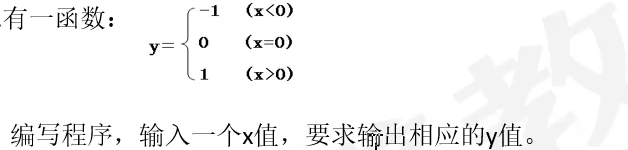
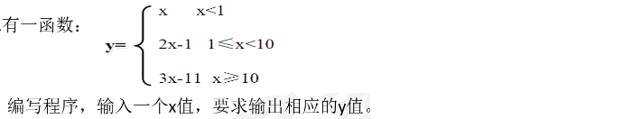
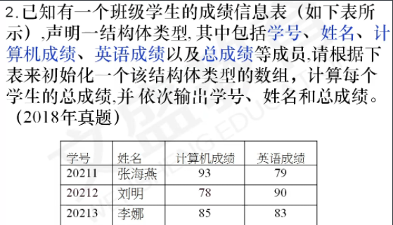

# c语言编程练习题

## 顺序结构

```c
#include <stdio.h> 
int main(){
	printf("Hello World\n"); 
	return 0;
} 
#include <stdio.h>
int main(){
    printf("we start c again!");
	return 0;
}
//5.1输入整数a,b两个值，输出两个整数之差
#include <stdio.h>
int main(){
    int a,b;
    scanf("%d%d",&a,&b);
    printf("%d",a-b);
	return 0;
}
//6.2.编写一个C程序，输入a、b、c三个值，输出其中最小者。
#include <stdio.h>
int main(){
    int a,b,c,d;
    scanf("%d%d%d",&a,&b,&c);
    d=a>b?b:a;
    printf("%d",c>d?d:c);
	return 0;
}
//6.3.请编写程序，将两个两位的正整数a,b合并成一个整数放在c中：将a的十位和个位数一次放在c的千位和十位上，b的十位和个位数一次放在c的百位和个位上，例如：输入a=45,b=12使c=4152。
#include <stdio.h>
int main(){
    int a,b,c;
    scanf("%d%d",&a,&b);
    c=a/10*1000+a%10*10+b/10*100+b%10;
    printf("%d",c);
	return 0;
}
//1.编写程序，输入直角三角形的两条直角边，求该三角形的面积
#include <stdio.h>
int mian(){
    int a,b;
    float c; //面积必须是float
    scanf("%d%d",&a,&b);
    c=a*b/2.0; //注意面积必须是2.0 要不整数除整数与结果不相符
    printf("%f",c);
    return 0;
}
//2.编写程序，输入梯形的上下底和高（整数），求梯形的面积
#include <stdio.h>
int mian(){
    int a,b,c;
    float d; //面积必须是float
    scanf("%d%d%d",&a,&b,&c);
    d=(a+b)c/2.0; //注意面积必须是2.0 要不整数除整数与结果不相符
    printf("%f",c);
    return 0;
}
//3.输入半径r求圆的周长，面积，球的体积和表面积
//圆的周长=2pi*r 圆的面积=pi*r^2 球的体积=4/3*pi*r^3 球的表面积=4*pi*r^2
#include <stdio.h>
#define PI 3.141592
int main(){
    int r;
    float zc,mj,tj,bmj;
    scanf("%d",&r);
    zc=2*PI*r;
    mj=PI*r*r;
    tj=4/3*PI*r*r*r;
    bmj=4*PI*r*r;
    printf("%f%f%f%f",zc,mj,tj,bmj);
}
//4.编写程序，输入三角形的三条边（假定可以组成三角形，整型），求该三角形的面积
// #include "math.h"  平方根公式sqrt(4)
//使用海伦公式
#include <stdio.h>
#include <math.h>
int main(){
	int a,b,c;
    float s,p;
    scanf("%d%d%d",&a,&b,&c);
    p=(a+b+c)/2.0;
    s=sqrt(p*(p-a)*(p-b)*(p-c));
    printf("%f",s);
}
```

## 常考

1、闰年

```c
//1.编写程序，输入一个年份，判断是否为闰年
#include <stdio.h>
int main(){
    int y;
    scanf("%d",&y);
    if((y%4==0&&y%100!=0)||y%400==0)
       printf("闰年")
    else printf("平年")
}//闰年判定：年份能被4整除但(&&)不能100整除，或者(||)年份能被400整除
```

2、素数 

```c
//1、编程找出100以内的素数
#include <stdio.h>
int main(){
	int i,k,flag;
	for(i=2;i<=100;i++){
		flag=0;
		for(k=2;k<i;k++){ 
            //除了自己和1能除尽其他的数除尽了就不是素数
            //素数又叫质数（prime number），有无限个。质数定义为在大于1的自然数中，除了1和它本身以外不再有其他因数。
			if(i%k==0)
			 flag=1;
		}
		if(flag==0){
			printf("%d ",i);
		}
	}
} 
//2.写程序，输入一个大于2的正整数，判断是否为素数
#include <stdio.h>
int main(){
   	int n,i,fla=0;
    scanf("%d",&n);
    for(i=2;i<n;i++){
        if(n%i==0){
            fal=1;
        }
    }
    if(fla==1){
        printf("不是素数");
    }else{
        printf("素数");
    }
    return 0;
}
#include <stdio.h>
int main(){
   	int n,i;
    scanf("%d",&n);
    for(i=2;i<n;i++){
        if(n%i==0){
           break;
        }
      }
        if(i<n) printf("不是素数");
        else printf("素数");
    return 0;
}
//3.求200到300之间所有的素数
#include <stdio.h>
int main(){
    int i,j;
    for(i=200;i<300;i++){
        for(j=2;j<i;j++){
            if(i%j==0){
                break;
            }
        }
        if(j==i)
        printf("%d ",i);
    }
}
```

3、最大公约数最小公倍数

```c
//1、最大公约数最小公倍数
//两个数的乘积=两个数的最大公约数*两个数的最小公倍数
//法1
#include <stdio.h>
int main(){
    int m,n,k=1,i;
    scanf("%d%d",&m,&n);
    for(i=2;i<=m;i++){ //注意i<=m 必须小于等于
        if(m%i==0&&n%i==0) k=i; //此处不能break 直接跳出循环得到的是最小
    }
    printf("%d和%d最大公约数%d,最小公倍数%d",m,n,k,m*n/k);
}
//法2 辗转相除法
 #include <stdio.h>
int main(){
    int m,n,a,b,t;
    scanf("%d,%d",&m,&n);
    if(m<n){
        t=m;
        m=n;
        n=t;
    }
    a=m;
    b=n;
    while(b!=0){
        t=a%b;
        a=b;
        b=t
    }
    printf("%d%d的最大公约数为%d,最小公倍数为%d",m,n,a,m*n/a);
}
```

4、斐波那契数列

5、阶乘、阶乘的和

```c
//1.编写程序，输入整数i，求1!+2!+3!+...+n!
#include <stdio.h>
int main(){
    int i,j,n;
    long fac,sum=0;
    scanf("%d",&n); 
    for(i=1;i<=n;i++){
        for(j=1,fac=1;j<=i;j++){
        fac*=j;
    	}
       sum+=fac;
	}
    printf("%d",sum);
}
#include "stdio.h"
int main() {
	int i,n;
	long fac,sum=0;
	scanf("%d",&n);//5
	for(fac=1,i=1; i<=n; i++){
		fac=fac*i;
		sum=sum+fac;	
	}
	printf("sum=%1d",sum);
}
//2.编写程序，输入整数i，求1!+2!+3!+...+20!
#include "stdio.h"
int main() {
	int i,n;
	long fac,sum=0;
	for(fac=1,i=1; i<=20; i++){
		fac=fac*i; //求i的阶乘
		sum=sum+fac; //求阶乘的和
	}
	printf("sum=%1d",sum);
}
//3.输入正整数n,求n!
#include <stdio.h>
int main(){
    int n ;
    long fac=1;
    scanf("%d",&n);
    for(;n>0;n--){
		fac*=fac*i;
    }
    printf("%ld",fac);
    return 0;
}
```

6、排序（有小到大）

7、最值（最大值、最小值）

## 选择结构

```c

//2.给出一百分制成绩，要求输出成绩等级'A'、B'、'C'、D'、E'。90分以上为'A',80~89分为'B',70~79分为C',60~69分为'D',60分以下为E'。
#include <stdio.h
main(){
    float score;
	char grade;
	scanf("%f",&score);
    switch((int)(score/10)){
	case 10:
	case 9:grade='A';break;
	case 8:grade='B';break;
	case 7:grade-'C';break;
	case 6:grade='D';break;
	default:grade='E';
    }
printf("成绩是%5.lf,相应的等级是%cn",score,grade);	
}
//3.输入一个整数，判断是正数、负数还是零
#include "stdio.h"
main(){
int a;
scanf("%d",&a);
    if(a>0)printf("正数");
     else if(a==0) printf("0");
    else printf("负数");
}
//4.输入一个正整数，判定是奇数还是偶数
#include <stdio.h>
int main(){
	int a;
    sancf("%d",&a);
    if(a%2==0){
        printf("偶数")
	}else{
        printf("奇数")
	}
}
//5.输入一个正整数，判断是否可以被3,5,7同时整除
#include <stdio.h>
int main(){
int a;
scanf("%d",&a);
    if(a%3==0&&a%5==0&&a%7==0){
		printf("yes")
    }else printf("no")
return 0;
}
//6.输入一个正整数，判断其是否为个位上的数为7，十位上为5，百位上为9并且能被3整除的数.
#include <stdio.h>
int main(){
	int a;
    scanf("%d",&a);
    if(a%10==7&&a/10%10==5&&a/100%10==9&&a%3==0)
		printf("yes")
    else printf("no")
}
//7,输入一个三位正整数，判断是否为三位水仙花数 153==27+125+1
//例如：153是一个“水仙花数”,因为153=1的三次方＋5的三次方＋3的三次方。
#include <stdio.h>
int main(){
    int a,b;
    scanf("%d",&a);
    b=(a%10)*(a%10)*(a%10)+(a/10%10)*(a/10%10)*(a/10%10)+(a/100%10)*(a/100%10)*(a/100%10);
    if(b==a) printf("yes")
        else printf("no")
}
//8,编写程序，输入一个年份，判断是否为闰年
#include <stdio.h>
int main(){
    int y;
    scanf("%d",&y);
    if((y%4==0&&y%100!=0)||y%400==0)
       printf("闰年")
    else printf("平年")
}
//9.输入两个整数，按从小到大的顺序输出
#include <stdio.h>
int main(){
    int x,y,z;
    sacnf("%d%d",&x,&y);
    if(x>y){
        z=y;
        y=x;
        x=z;
    }
     printf("%d,%d",x,y);
}
//10.编写程序，输入三个整数，按从小到大的顺序输出
#include <stdio.h>
int main(){
    int a,b,c,d;
    sacnf("%d%d%d",&a,&b,&c);
    if(a>b){
        d=a;
        a=b;
        b=d;
    }else if(a>c){
        d=a;
        a=c;
        c=d;
    }else if(b>c){
        d=b;
        b=c;
        c=d;
	}
    printf("%d%d%d",a,b,c);
}
//11.编写程序，输入十个整数，求其中正数、负数以及零的个数
#include <stdio.h>
int main(){
   	int a=0,b=0,c=0;
    int n,i;
    for(i=1;i<=10;i++){
        scanf("%d",&n);
        if(n>0) a++;
        else if(n==0) b++;
        else c++;
	}
    printf("正数%d，零%d,负数%d",a,b,c);
    return 0;
}
//12.编写程序，输入80个字符，判断其中数字字符、字母字符以及其它字符的个数。
#include <stdio.h>
int main(){
    int i,a=0,b=0,c=0;
   	char f;
    for(i=0;i<80;i++){
        scanf("%c",&f);
        if(f>='0'&&f<='9') a++;
        else if((f>='A'&&f<='Z')||(f>='a'&&f<='z')) b++;
        else c++;
    }
    printf("数字字符%d，字母字符%d,其它字符%d",a,b,c);
    return 0;
}
//13.编写程序，输出200到500之间所有以6结尾并且能被13和18同时整除的数以及这些数的和。
#include <stdio.h>
int main(){
    int i,sum=0;
    for(i=200;i<=500;i++){
        if((i%10==6)&&(i%13==0)&&(i%18==0)){
            printf("%d",i);
            sum+=i;
        }
    }
    printf("sum=%d",sum);
    return 0; 
}
//14.编写程序，输出所有的三位水仙花数。
#include <stdio.h>
int main(){
    int a,b,c,i;
    for(i=100;i<=999;i++){
        a=i%10;
        b=i/10%10;
        c=i/100%10;
        if(i==a*a*a+b*b*b+c*c*c){
            printf("%d\n",i);
		}
    }
}
//15.编写程序，输出2000年到3000年之间所有的闰年。
#include <stdio.h>
int main(){
    int i;
    for(i=2000;i<=3000;i++){
        if((i%4==0&&i%100!=0)||(i%400==0)){
            printf("%d是闰年\n",i);
        }
    }
}
```



```c
#include <stdio.h>
int main(){
	int x,y;
    scanf("%d",&x);
    if(x<0) y=-1;
     else if(x==0) y=0;
         else y=1;
    printf("y=%d",y);
}
```



```c
#include <stdio.h>
int main(){
    int x,y;
    scanf("%d"&x);
    if(x<1) y=x;
        else if(x>=1&&x<10) y=2*x-1;
    		else if(x>=10) y=3*x-11;
    printf("y=%d",y);
}
```

## 循环

```c
//1.分别使用while,dowhile和for循环，求1到100数的和。
#include <stdio.h>
int main(){
	int i=1,sum=0;
    while(i<=100){
        sum+=i;
        i++;
    }
    printf("sum=%d",sum);
    return 0;
}
#include <stdio.h>
int main(){
    int i=1,sum=0;
    do{
        sum+=i;
        i++;
    }while(i<=100);
    printf("sum=%d",sum);
    return 0;
}
#include <stdio.h>
int main(){
    int i,sum=0;
    for(i=1;i<=100;i++){
		sum+=i;
    }
    printf("sum=%d",sum);   
    return 0;
}
//2.输入两个整数m和n(m<n),求m和n之间（包括m和n)所有整数的和
#include <stdio.h>
int main(){
    int m,n,i=0;
    scanf("%d%d",&m,&n);
    for(;m<=n;m++){
        i+=m;
    }
    printf("%d",i);
    return 0;
}
//3.编写程序，输入整数n,计算 1+1/2+1/3+...+1/n
//任何大于1的自然数n阶乘表示方法：n!=1×2×3×……×n 
#include <stdio.h>
int main(){
    int n,i;
    float sum=0;
    scanf("%d",&n);
    for(i=1;i<=n;i++){
     	sum+=1.0/(i);
	}
    printf("%f",sum);
    return 0;
}
//4.编写程序，计算：1+1/2+2/3+3/4+。。。+199/200
#include <stdio.h>
int main(){
   	float sum=1.0,i;
    for(i=1;i<200;i++){
        sum+=i/(i+1.0);
    }
    printf("%f",sum);
    return 0;
}
//5.编写程序，计算：1*2*3+2*3*4+3*4*5+...+98*99*100
#include <stdio.h>
int main(){
    int i,sum=0;
    for(i=1;i<=98;i++){
        sum+=i*(i+1)*(i+2);
    }
    printf("%d",sum);
    return 0;
}
//6编写程序，用循环输出以下内容
1
1 2
1 2 3
1 2 3 4
1 2 3 4 5
1234.........10
#include <stdio.h>
int main(){
    int i,j;
    for(i=1;i<=10;i++){ 
        for(j=1;j<=i;j++){
            printf("%d ",j);
        }
        printf("\n");
    }
}
//7.写程序，输入整数i，求1!+2!+3!+...+n!
#include <stdio.h>
int main(){
    int i,j,n;
    long fac,sum=0;
    scanf("%d",&n); 
    for(i=1;i<=n;i++){
        for(j=1,fac=1;j<=i;j++){
        fac*=j;
    	}
       sum+=fac;
	}
    printf("%d",sum);
}
#include "stdio.h"
int main() {
	int i,n;
	long fac,sum=0;
	scanf("%d",&n);//5
	for(fac=1,i=1; i<=n; i++){
		fac=fac*i;
		sum=sum+fac;	
	}
	printf("sum=%1d",sum);
}

//8.一口井深h米，一只青蛙每天早上向上爬上爬m米，晚上睡觉滑下来n米(h>m>n),问多少天可以爬出井
#include <stdio.h>
int main(){
    int h,m,n,i=0,s=0;//i天数 s小青蛙爬的高度
    scanf("%d%d%d",&h,&m,&n);
    while(s<h){
        i++;
        s=s+m;
        if(s>=h) break;
        s=s-n;
    }
    printf("%d",i);
}
//9.输入1个正整数，判断是几位数，并计算各个位上数的和
5872
/10 587
/10 58
/10 5
/10 0
#include <stdio.h>
int main(){
   	int s,i,sum=0;
    scanf("%d",&s);
    for(i=1;i<20;i++){
        sum+=s%10;
        s=s/10;
        if(s==0){
            break;
        }
    }
    printf("ws%d he%d",i,sum);
    return 0;
}

#include <stdio.h>
int main(){
   	int s,i=0,sum=0;
    scanf("%d",&s);
    while(s){
        sum+=s%10;
        i++;
        s=s/10;
    }
    printf("ws%d he%d",i,sum);
    return 0;
}
//10.有一个分数数列 2/1,3/2,5/2,8/5,13/8,21/13...求出该数列前20项的和（结果用小数表示，保留10位小数）。
#include <stdio.h>
int main(){
    int i;
    double a=2.0,b=1.0,sum=0;
    for(i=0;i<20;i++){
       sum+=a/b;
       a=a+b;
       b=a-b;
    }
    printf("%.10f",sum);
}
//11.编写程序，求1-1/2+1/3-1/4+....-1/100；
#include <stdio.h>
int main(){
	int i;
    float sum=0;
    for(i=1;i<=100;i++){
        if(i%2==0){
           sum-=1.0/i;
        }else{
          sum+=1.0/i;  
        }
    }
    printf("%f",sum);
    return 0;
}
#include <stdio.h>
 int main() {
	float sum=0;
	int i,sign=1;
	for(i=1; i<=100; i++){
     	sum+=sign*1.0/i;
        sign=-sign;//通过加符号的方式
    }
	printf("sum=%f",sum);
}
```

## 函数

```c
//求n！
long fac(int n){
    long f=1;
    int i;
    for(i=1;i<=n;i++){
        f=f*i;
    }
    return f;
}
//用递归调用方法计算n!。 fac(n)=n*fac(n-1)
long fac(int n){
    if(n==1) return 1;
    else return n*fac(n-1);
}
递归函数的组成
1)函数体
2)递归终止条件
3)递归规律（递归体）
//函数的定义与调用练习
//1.编写函数ca1area,给定直角三角形的俩条直角边（整数），计算该三角形面积在主函数中，输入一个直角三角形的两条直角边长，调用函数calarea,求出该三角形面积
#include <stdio.h>
float calarea(int x,int y){
    return x*y/2.0;
}
int main(){
    int a,b;
    scanf("%d%d",&a,&b);
    printf("%f",calarea(a,b))
    return 0;
}
//2.编写函数ca1area,给定梯形的上下底和高（整数），计算梯形面积在主函数中，输入一个梯形的上下底和高，调用函数calarea,求出该梯形面积
#include <stdio.h>
float calarea(int x,int y,int z){
    return (x+y)*z/2.0;
}
int main(){
    int a,b,c;
    float s;
    scanf("%d%d%d",&a,&b,&c);
    s=calarea(a,b,c);
    printf("%f",s);
    return 0;
}
//3.编写函数 caltemp,给定华氏温度，求对应的摄氏温度在主函数中输入一个华氏温度，调用caltemp函数计算并输出对应的摄氏温度。
#include <stdio.h>
float caltemp(int x){
    return 5*(x-32)/9;
}
int main(){
    int a;
    float s;
    scanf("%d",&a);
    s=caltemp(a);
    printf("%.2f",s);
    return 0;
}
//4.编写一个函数max,求两个整数的最大数。在主函数中输入三个整数，调用函数max,求其中的最大数。
#include <stdio.h>
int max(int x,int y,int z){
    return x>y?x:y;
}
int main(){
    int a,b,c,max;
    scanf("%d%d%d",&a,&b,&c);
    max=max(a,max(b,c));
    printf("%d",max);
    return 0;
}
//63.27编写一个程序分别求两个整数的最大公约数和最小公倍数
#include <stdio.h>
int zdgys(int a,int b){
    int i,t;
	for(i=2;i<=a;i++){
		if(a%i==0&&b%i==0){
            t=i;
        }
    }
    return t;
}
int zxgbs(int a,int b){
	return a*b/zdgys(a,b);
}
int main(){
    int a,b;
    scanf("%d%d",&a,&b);
    printf("最大公因数为%d",zdgys(a,b));
    printf("最小公倍数为%d",zxgbs(a,b));
    return 0;
}
//64.29 请编写一个函数fun，它的功能是：计算门课程的哦平均分，计算结果为函数的返回值
#include <stdio.h>
#define n 10
float fun(float *a){
	float sum=0;
    int i;
    for(i=0;i<n;i++){
        sum+=a[i];
    }
    return sum/n;
}
int main(){
    float a[n],avg;
    int i;
    for(i=0;i<n;i++){
		scanf("%f",&a[i]);
    }
    printf("avg=%f",fun(a));
    return 0;
}
//64.30编写函数实现字符串函数strlen()功能，不能使用字符串函数
#include <stdio.h>
int len(char *a){
    int count=0;
	while(*a++) count++;
    return count;
}
int main (){
    char a[100];
    gets(a);
	printf("字符串的长度为%d",len(a));
    return 0;
}
//65.31简单计算器的实现，分别用函数实现两个整数m和n的加，减，乘，整除，求余，以及阶乘m!的计算
#include <stdio.h>
int jf(int a,int b) {
	return a+b;
}
int jaf(int a,int b) {
	return a-b;
}
int cf(int a,int b) {
	return a*b;
}
int cuf(int a,int b) {
	return a/b;
}
int jc(int a) {
	int i,fac=1;
	for(i=2; i<=a; i++) {
		fac*=i;
	}
	return fac;
}
int main() {
	int m,n;
	scanf("%d%d",&m,&n);
	printf("%d+%d=%d\n",m,n,jf(m,n));
	printf("%d-%d=%d\n",m,n,jaf(m,n));
	printf("%d*%d=%d\n",m,n,cf(m,n));
	if(n==0) {
		printf("除数不能为0");
	} else {
		printf("%d/%d=%d\n",m,n,cuf(m,n));
	}
	printf("!%d=%d\n",m,jc(m));
	return 0;
}
//65.32编写一个判断素数的函数，用返回值0或1分别表示素数或非素数的状态
#include <stdio.h>
int pime(int a){
    int i,f=0;
    for(i=2;i<a;i++){
		if(a%i==0){
            f=1;
        }
    }
    return f;
}
int main(){
    int a;
    printf("请输入一个大于1的整数");
    scanf("%d",&a);
   if(pime(a)){
       printf("%d不是素数",a);
   }else {
       printf("%d是素数",a);
   }
    return 0;
}
//66.33编写实现对100-200之间所有数是否素数的判别
#include <stdio.h>
int pime(int a){
    int i,f=0;
    for(i=2;i<a;i++){
		if(a%i==0){
			f=1;
        }
    }
    return f;
}
int main(){
	int a,i;
    printf("100-200之间是否是素数")
    for(i=100;i<200;i++){
        if(pime(i)){
			printf("%dno\t",i);
        }else {
            printf("%dyes\t",i);
        }
    }
    return 0; 
}
```

## 数组

```c
//【例7-1】对10个数组元素依次赋值为1,2，3,4,5,6,7,8,9,10,请按逆序输出数组元素的值。
#include <stdio.h>
int main(){
    int i,a[10];
    for(i=0;i<=9;i++){
        a[i]=i+1;
    }
    for(i=9;i>=0;i--){
        printf("%d "a[i]);
        printf("%d "a[i]);
    }
    return 0;
}
//编写程序，定义一个整型数组a[10],输入各个元素的值，求各个元素的平均值，(结果小数点后保留2位)
#include <stdio.h>
int main(){
   	int a[10],i,sum=0;
    float avg;
    for(i=0;i<10;i++){
        scanf("%d",&a[i]);
        sum+=a[i];
    } 
    avg=sum/10.0;
    printf("%.2f",avg);
    return 0;
}
//编写程序，定义一个浮点型数组F[10],输入各个元素的值，求各个元素的和(结果小数点后保留2位)
#include <stdio.h>
int main(){
    float F[10],sum=0;
    int i;
    for(i=0;i<10;i++){
        scanf("%f",&F[i]);
        sum+=F[i];
    }
    printf("%.2f",sum);
}
//编写程序，定义一个整型数组[100]，输入各个元素的值，输出其中能被13和15同时整除的元素的个数以及这些数。
#include <stdio.h>
int main() {
	int a[100],i,z;
	for(i=0; i<100; i++) {
		scanf("%d",&a[i]);
	}
	for(i=0; i<100; i++) {
		if(a[i]%13==0&&a[i]%15==0) {
			z++;
			printf("szw=%d ",a[i]);
		}
	}
	printf(" geshu=%d",z);
	return 0;
}
//编写程序，定义一个整型数组a[10],输入各个元素的值，求其中的最大元素及其下标。
#include <stdio.h>
int main(){
    int a[10],i,z=0;
    for(i=0;i<10;i++){
        scanf("%d",&a[i]);
         if(a[i]>a[z]){
            z=i;
        }
    }
    printf("xb=%d,max=%d",z,a[z]);
}
//编写程序，定义一个整型数组a[10],输入各个元素的值，计算并输出其中奇数元素的个数以及偶数元素的个数。
#include <stdio.h>
int main(){
    int a[10],i,j=0,o=0;
    for(i=0;i<10;i++){
        scanf("%d",&a[i]);
        if(a[i]%2==0){
            o++;
        }
      	else{
            j++;
        }
    }
    printf("js=%d,os=%d",j,o);
}
//编写程序，定义一个整型数组a[10],输入每个元素的值，反序存放（逆置）后输出
#include <stdio.h>
int main(){
    int a[10],i,b;
    for(i=0;i<10;i++){
        scanf("%d",&a[i]);
    }
    for(i=0;i<5;i++){
        b=a[i];
        a[i]=a[9-i];
        a[9-i]=b;
    }
    for(i=0;i<10;i++){
       printf("%d ",a[i]);   
    } 
    return 0;
}
#include <stdio.h>
int main(){
    int a[10],i,j,b;
    for(i=0;i<10;i++){
        scanf("%d",&a[i]);
    }
    for(i=0,j=9;i<j;i++,j--){
        b=a[i];
        a[i]=a[j];
        a[j]=b;
    }
    for(i=0;i<10;i++){
       printf("%d ",a[i]);   
    } 
    return 0;
}
//二维数组
//1.编写程序，定义一个二维数组a[3][4],输入每个元素的值求这些元素的均值。
#include <stdio.h>
int main(){
    int a[3][4],i,j,sum=0;
    for(i=0;j<3;i++){
        for(j=0;j<4;j++){
            scanf("%d",&a[i][j]);
            sum+=a[i][j];
        }
    }
    printf("avg=%.2f",sum/12.0);
    return 0;
}
//2.程序，定义一个二维数组a[3][4],输入每个元素的值，输出其中以3结尾的元素的个数。
#include <stdio.h>
int main(){
    int a[3][4],i,j,k;
    for(i=0;i<3;i++){
        for(j=0;i<4;j++){
            scanf("%d",&a[i][j]);
            if(a[i][j]%10==3){
                k++;
            }
        }
    }
    printf("gs=%d",k);
}
//3编写程序，定义一个二维数组a[10][10],输入每个元素的值求其中最大元素及其下标
#include <stdio.h>
int main(){
    int a[10][10],i,j,k=0,l=0;
    for(i=0;i<10;i++){
        for(j=0;j<10;j++){
            scanf("%d",&a[i][j]);
            if(a[k][l]<a[i][j]){
                k=i;
                l=j;
            }
        }
    }
    printf("zdys=%d,xb[%d] xb[%d]",a[k][l],k,l);
    return 0;
}
//4.编写程序，定义一个二维数组a[10][10],输入每个元素的值求对角线上元素的和 对角线一个是两个坐标相等 例a[10][10] 就是a[0][0] a[..][..]   a[9][9]，一个是两个坐标相加等于坐标数-1 例a[10][10] 就是a[0][9] a[9][0] 
#include <stdio.h>
int main(){
    int a[10][10],i,j,sum;
    for(i=0;i<10;i++){
        for(j=0;j<10;j++){
            scanf("%d",&a[i][j]);
            if(i==j||i+j==9){
                sum+=a[i][j];
            }
        }
    }
    printf("%d",sum);
}
//字符数组
//写程序，输入一个字符串，输出该字符串的长度
#include <stdio.h>
#include <string.h>
int main(){
    char a[100];
    int i;
    gets(a);
    i=strlen(a);
    printf("%d",i);
    return 0;
}
#include <stdio.h>
int main(){
    char a[100];
    int i;
    gets(a);
    while(a[i]!='\0'){
        i++;
    }
    printf("%d",i);
    return 0;
}//字符串编程的标准模板！！！（套路）

//编写程序，输入一个字符串，求其中字符*的个数。
#include <stdio.h>
int main(){
    char a[100];
    int i=0;k=0;
    gets(a);
    while(a[i]!='\0'){
        if(a[i]=='*') k++;
        i++;
    }
    printf("%d",k);
    return 0;
}
//编写程序，输入一个字符串，求其中元音字母的个数。
#include <stdio.h>
int main(){
    char a[100];
    int i=0,k=0;
    gets(a);
    while(a[i]!='\0'){
        if(a[i]='a'||a[i]='e'||a[i]='i'||a[i]='o'||a[i]='u'||a[i]='A'||a[i]='E'||a[i]='I'||a[i]='O'||a[i]='U'){
            k++;
        }
        i++;
    }
    printf("%d",k);
    return 0;
}
//编写程序，输入一个字符串，分别输出其中数字字符、字母字符、以及其它字符的个数
#include <stdio.h>
int main(){
    char a[100];
    int i=0,j=0,k=0,n=0;
    gest(a);
    while(a[i]!='\0'){
        if(a[i]>='0'&&a[i]<='9'){
           j++;
        }else if((a[i]>='A'&&a[i]<='Z')||(a[i]>='a'&&a[i]<='z')) k++;
        else n++;
        i++;
    }
    printf("%d,%d,%d",j,k,n);
}
//编写程序，输入一个字符串，去掉其中的'*'，形成一个新的字符串输出。
#include <stdio.h>
int main(){
    char a[100],b[100];
    int i=0,j=0;
    gest(a);
    while(a[i]!='\0'){
       if(a[i]!='*') {
         b[j]=a[i]; 
         j++  
       }
        i++;
    }
    b[j]='\0';
    puts(b);
}
#include <stdio.h>
int main(){
    char a[100];
    int i=0,j=0;
    gest(a);
    while(a[i]!='\0'){
       if(a[i]!='*') {
         a[j++]=a[i]; 
       }
        i++;
    }
    a[j]='\0';
    puts(a);
} 
//输入一个字符串，只保留其中的数字字符形成一个新的字符串，输出
#include <stdio.h>
int main(){
    char a[100];
    int i=0,j=0;
    gets(a);
    while(a[i]!='\0'){
        if(a[i]>='0'&&a[i]<='9') a[j++]=a[i];
        i++;
    }
    a[j]='\0';
    puts(a);
    return 0;
}
//编写程序，输入一个字符串，拷贝到另一个字符串中，不能使用strcpy
#include <stdio.h>
int main(){
    char a[100],b[100];
    int i=0;
    gets(a);
    while(a[i]!='\0'){
        b[i]=a[i];
        i++;
    }
    b[i]='\0';
    puts(b);
    return 0;
}
#include <stdio.h>
int main(){
    char a[100],b[100];
    int i=0;
    gets(a);
    while(b[i]=a[i]){
        i++;
    }
    puts(b);
    return 0;
}
//编写程序，输入一个字符串，将其中的大写字母改写为对应的小写字母，然后输出
#include <stdio.h>
int main(){
    char a[100];
    int i=0;
    gets(a);
    while(a[i]!='\0'){
        if(a[i]>='A'&&a[i]<='Z'){
            a[i]=a[i]+32;
        }
        i++;
    }
    puts(a);
    return 0;
}
//编写程序，输入两个字符串，把二者链接起来然后输出。（不能使用strcat)
#include <stdio.h>
int main(){
    char a[100],b[50];
    int i=0,j=0;
    gets(a);
    gets(b);
    while(a[i]!='\0') i++;
 	while(b[j]!='\0'){
        a[i++]=b[j++];
    }
    a[i]='\0';
    puts(a);
    return 0;
}
//编写程序，输入两个字符串，比较两个字符串的大小（不能使用strcmp)
#include <stdio.h>
int main(){
    char a[100],b[100];
    int i=0,k;
    gets(a);
    gets(b);
    while(a[i]==b[i]&&a[i]!='\0'&&b[i]!='\0'){
        i++;
    }
    k=a[i]-b[i];
    if(k==0) printf("a==b");
    else if(k>0) printf("a>b");
    else printf("a<b");
    return 0;
}
//编写程序，输入一个字符串，逆序输出该字符串。比如：输入"hello"输出："olleh
#include <stdio.h>
int main(){
    char a[100];
    int i=0;
    gets(a);
    while(a[i]!='\0'){
        i++;
    }
    while(i>=0){
        printf("%c",a[i--]);
    }
    return 0;
}
//52.40读入10个整数存入数组，找出其中最大值最小值
#include <stdio.h>
int main(){
    int a[10],i,x=0,d=0;
    for(i=0;i<10;i++){
        scanf("%d",&a[i]);
        if(a[d]<a[i]) d=i;//最大
        if(a[x]>a[j]) x=i;//最小
    }
    printf("最大值%d,最小值%d",a[d],a[x]);
    return 0;
}
//52.41通过赋初值按行顺序给2x3的二维数组赋予2，4，6等偶数，然后按列的顺序输出该数组
#include <stdio.h>
int main(){
    int a[2][3],i,j,s=2;
    for(i=0;i<2;i++){
		 for(j=0;j<3;j++){
			a[i][j]=s;
             s+=2;
         }
    }
    for(j=0;j<3;j++){
         for(i=0;i<2;i++){
          printf("%d ",a[i][j]);   
         }
    }
    return 0;
}
//53.42输入数组，最大的与第一个元素交换，最小的与最后一个元素交换，输出数组
#include <stdio.h>
#define n 10
int main(){
	int a[n],i,j,d,x,max,min,maxj,minj;
	for(i=0; i<n; i++) {
		scanf("%d",&a[i]);
	}
	max=min=a[0];
	for(i=0; i<n/2; i++) {
		d=i;
		x=i;
		for(j=i; j<n-i; j++) {
			if(a[d]<a[j]) {
				d=j;//最大
				max=a[d];
			}
			if(a[x]>a[j]) {
				x=j;//最小
				min=a[x];
			}
		}
		maxj=a[i]; //存储交换位置的值
		minj=a[n-i-1]; //存储交换位置的值
		a[i]=max; //最大值交换到前面
		a[d]=maxj;//交换位置的值换到最大值位置
		a[n-i-1]=min; //最小值交换到后面
		a[x]=minj; //交换位置的值换到最小值位置
		max=min=a[i+1]; //i+1 如果是i就会把当前最大值存入
	}
	for(i=0; i<n; i++) {
		printf("%d ",a[i]);
	}
	return 0;
}
//调试
#include <stdio.h>
#define n 10
int main() {
	int a[n]= {1,2,3,4,5,6,7,8,9,10},i,j,d,x,max,min,maxj,minj;
//	for(i=0; i<n; i++) {
//		scanf("%d",&a[i]);
//	}
	max=min=a[0];
	for(i=0; i<n/2; i++) {
		d=i;
		x=i;
		for(j=i; j<n-i; j++) {
			if(a[d]<a[j]) {
				d=j;//最大
				max=a[d];
			}
			if(a[x]>a[j]) {
				x=j;//最小
				min=a[x];
			}
		}
		maxj=a[i]; //存储交换位置的值
		minj=a[n-i-1]; //存储交换位置的值
		a[i]=max; //最大值交换到前面
		a[d]=maxj;//交换位置的值换到最大值位置
		a[n-i-1]=min; //最小值交换到后面
		a[x]=minj; //交换位置的值换到最小值位置
		max=min=a[i+1];
	}
	for(i=0; i<n; i++) {
		printf("%d ",a[i]);
	}
	return 0;
}
//53.43用数组实现以下功能，输入5个学生成绩，而后求出这些成绩的平均值并显示出来
#include <stdio.h>
int main(){
	int a[5],i,sum=0;
    for(i=0;i<5;i++){
        scanf("%d",&a[i]);
        sum+=a[i];
    }
    printf("5个学生平均成绩为%.2f",sum/5.0);
}
//54.44求一个3x3的整型矩阵对角线元素之和
//对角线的行值等于列值 次对角线等于 矩阵长度(3)-1=列值+行值
#include <stdio.h>
int main(){
	int a[3][3],i,j,sum=0;
    for(i=0;i<3;i++){
		for(j=0;j<3;j++){
            scanf("%d",&a[i][j]);
            if(i==j||i+j==2){
				sum+=a[i][j];
            }
        }
    }
    printf("sum=%d",sum);
}
//54.45求数组输入8个数的最大值
#include <stdio.h>
int main(){
	int a[8],i,max=0;
    for(i=0;i<8;i++){
        scanf("%d",&a[i]);
        if(a[max]<a[i]) max=i;//最大
    }
    printf("最大值为%d",a[max]);
    return 0;
}
//55.46编程实现将两个字符串连接起来（要求不能使用scrcat函数，实现相同功能）
#include <stdio.h>
int main(){
    char a[80],b[30];
    char *p=a,*d=b;
    int i=0;
    gets(a);
    gets(b);
    while(*p) p++; //注意不要写*p++ 因为指向\0之后又++指向\0后面了
    while(*d){
		*p++=*d++;
    }
    *p='\0';
    puts(a);
}
//55.47键盘输入10个数倒序输出
#include <stdio.h>
int main(){
	int a[10],i;
    for(i=0;i<10;i++){
        scanf("%d",&a[i]);
    }
    for(i=9;i>-1;i--){
        printf("%d ",a[i]);
    }
    return 0;
}
```

## 指针

```c
#include <stdio.h>
int main(){
	char a[80];
	char *p=a;
	printf("请输入一行文本按回车结束\n");
	gets(a);
	while(*p!='\0'){ //==*p
		if(*p>='A' && *p<='Z'){
			*p+=32; //大写转小写 
			p++;
		}else{
		 printf("请输入一行文本按回车结束\n");
		 gets(a);	
		}
	} 
	printf("%s",a);
	return 0;
} 
#include <stdio.h>
int main(){
	char a[80];
	char *p=a;
	printf("请输入一行文本按回车结束\n");
	gets(a);
	while(*p){ //==*p
		if(*p>='A' && *p<='Z'){
			*p+=32; //大写转小写 
			p++;
		}else{
		 printf("请输入一行文本按回车结束\n");
		 gets(a);	
		}
	} 
	printf("%s",a);
	return 0;
} 
//用指针编写求字符串长度的函数strlen()
#include <stdio.h>
int strlen(char a[]){
	char *p=a;
    int count=0;
    while(*p++) count++;
    return count;
}
int main(){
    char a[100];
    gets(a);
    printf("strlen=%d",strlen(a));
}
//74.2利用函数和指针编写一个程序，在main函数中输入10个整数并存入数组中，定义一个名称为DeleteDup的函数，将此数组中后面出现的重复元素删除，最后把剩下的元素全部显示出来，要求对数组操作用指针实现
#include <stdio.h>
void DeleteDup(int *a){
	int i;
    for(i=0;i<10;i++){
		
	}
}
int main(){
    int a[10],i;
    for(i=0;i<10;i++){
		scanf("%d",&a[i]);
    }
    DeleteDup(a);
    for(i=0;i<10;i++){
        printf("%d",a[i]);
    }
    return 0;
}
//75.3编写函数实现字符串strcat()功能
#include <stdio.h>
void strcat(char *a,char *b){
	while(*a) a++; //注意不要写成*a++会指向\0后面
    while(*b) *a++=*b++;
    *a='\0';
}
int main(){
	char a[100],b[50];
    gets(a);
    gets(b);
    strcat(a,b);
    printf("%s",a);
    return 0;
}
//75.4编写一个程序，输入15个整数，存入一维数组，在按逆序重新存放后输出
//76.5编写函数实现strcmp(),比较a和b所指字符串的大小
```

## 结构体

```c
#include <stdio.h> 
struct student{
	int num;
	char name[20];
	float score;
}; 
int main(){
	int i;
	float sum=0;
	struct student stu[3];
	for(i=0;i<3;i++){
		printf("请输入第%d个学生信息 学号 姓名 成绩\n",i+1); 
		scanf("%d%s%f",&stu[i].num,stu[i].name,&stu[i].score);
		sum+=stu[i].score;
	}
		printf("总成绩为%d",sum);
}
```



```c
#include <stdio.h>
 struct STU{
 	int num;
 	char name[20];
 	float com;
 	float eng;
 	float tota;
 }a[3]={{20211,"张海燕",93,79},{20212,"刘明",78,90},{20213,"李娜",85,83}};
 int main(){
 	int i;
 	for(i=0;i<3;i++){
 		a[i].tota=a[i].com+a[i].eng;
 		printf("学号%d 姓名%6s 总成绩%3.f\n",a[i].num,a[i].name,a[i].tota);
	 }
 }
```
