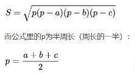

# 顺序结构

1. 从键盘输入一个大写字母，在显示屏上显示对应的小写字母。

   ```c
   #include <stdio.h>
   int main(){
       char a;
       a=getchar();
       if(a>='A'&&a<='Z') printf("%c",a+32);
       return 0;
   }
   ```

2. 输入两个整数，求它们的差。

   ```c
   #include <stdio.h>
   int main(){
       int a,b;
       scanf("%d %d",&a,&b);
       printf("%d",a+b);
       return 0;
   }
   ```

3. 从键盘输入一个正数，要求输出它的平方根（如果平方根不是整数，则输出其整数部分)。

   ```c
   #include <stdio.h>
   #include <math.h>
   int main(){
       int a;
       scanf("%d",&a);
       printf("%.0f",sqrt(a));
       return 0;
   }
   ```

4. 设圆半径r=1.5,圆柱高=3，求圆周长、圆面积、圆球表面积，圆球体积、圆柱体积。用scanf输入数据，输出计算结果，输出时要求有文字说明，取小数点后2位数字。

   ```c
   //圆的周长=2pi*r 圆的面积=pi*r²  圆球表面积S=4πr²  球的体积=4/3*pi*r^3  圆柱体积=pi*r²h
   #include<stdio.h>
   int main(){
       float r,h;
       scanf("%f,%f",&r,&h);
       printf("zc%f\n",2*3.14*r);
       printf("mj%f\n",3.14*r*r);
       printf("qtj%f\n",4*3.14*r*r);
       printf("qtj%f\n",4/3.0*3.14*r*r*r);
       printf("mj%f\n",3.14*r*r*h);
       return 0;
   }
   ```

5. 输入三角形的一条边长和这条边上的高，求三角形面积

   ```c
   #include <stdio.h>
   int main(){
       int d,h;
       scanf("%d,%d",&d,&h);
       printf("%f",d*h*1.0/2.0);
       return 0;
   }
   ```

6. 给出三角形三边长，求三角形面积

   ```c
   //海伦公式：设P=（a+b+c）/2 则：面积S=√p(p-a)(p-b)(p-c)
   #include <stdio.h>
   #include<math.h>
   int main(){
       float s,a,b,c,p;
       scanf("%f,%f,%f",&a,&b,&c);
       p=(a+b+c)/2.0;
       s=sqrt(p*(p-a)*(p-b)*(p-c));
       printf("s=%f",s);
       return 0;
   }
   ```
   
7. 输入3个整数，计算它们的和与平均值，平均值的结果保留2位小数。

   ```c
   #include <stdio.h>
   int main(){
       int a,b,c,sum;
       float avg;
       scnaf("%d%d%d",&a,&b,&c);
       sum=a+b+c;
       avg=sum/3.0;//注意此处需要3.0结果是浮点型才行
       peintf("%d,%.2f",sum.avg);
       return 0;
   }
   ```

   


需要注意的问题

1. 不是整数的一定注意

# 选择结构

1. 输入用year表示的某一年，判断是否为闰年，如果是则输出“是”，否则输出不是”。闰年的条件是符合下面二者之一：①能被4整除，但不能被100整除，如2008。②能被400整除，如2000。

   ```c
   #include <stdio.h>
   int main(){
       int y;
       scanf("%d",&y);
       if(y%4==0&&y%100!=0||y%400==0){
           printf("Yes");
       }else{
           printf("NO");
       }
       return 0;
   }
   ```

2. 求解得ax2+bx+c=0方程的根。由键盘输入a,b,c。假设a,b,c的值任意，并不保证b2-4ac≥0。需要在程序中进行判别，如果b2-4ac≥0，就计算并输出方程的两个实根，如果b^2^-4ac<0,就输出“此方程无实根”的信息。

   ```c
   #include <stdio.h>
   int main(){
       double a,b,c,x1,x2,p,q;
       
       return 0;
   }
   ```

3. 输入两个整数，如果两个数不等，则输出大数，如果相等，则输出“x==y”和x的值。

   ```c
   #include <stdio.h>
   int main(){
       int x,y;
       scanf("%d,%d",&x,&y);
       if(x==y){
           printf("x==y,%d",x);
       }else{
   		printf("%d",x>y?x:y);
       }
       return 0;
   }
   ```

4. 输入一个数，判断能否被3整除，能则输出“yes”,不能则输出“no”。

   ```c
   #include <stdio.h>
   int main(){
       int a;
       scanf("%d",&a);
       if(a%3==0){
           printf("yes");
       }else{
           printf("NO");
       }
       return 0;
   }
   ```

5. 根据输入的学生成绩（整数），给出相应的等级。90分及以上为A,60分以下为E,其余10分一个等级。（**多练switch**）

   ```c
   //注意格式
   #include <stdio.h>
   int main(){
       int a;
       char b;
       scanf("%d",&a);
       switch(a/10){
           case 10 :
           case 9: b='A';break;
           case 8: b='B';break;
           case 7: b='C';break;
           case 6: b='D';break;
           default:b='E';
       }
       printf("%c",b);
       return 0;
   }
   ```

6. 输入一个整数，打印它是奇数还是偶数。

   ```c
   #include <stdio.h>
   int main(){
       int a;
       scanf("%d",&a);
       if(a%2==0){
           printf("偶数");
       }else{
           printf("奇数");
       }
       return 0;
   }
   ```

7. 输入三个整数a、b、c,输出最大数。

   ```c
   #include <stdio.h>
   int main(){
       int a,b,c,max;
       scanf("%d %d %d",&a,&b,&c);
       max=a>b?a:b;
       max=max>c?max:c;
       printf("max=%d",max);
       return 0;
   }
   ```

8. 输入一个数，判断这个数能否同时被3和5整除。

   ```c
   #include <stdio.h>
   int main(){
       int a;
       scanf("%d",&a);
       if(a%3==0&&a%5==0){
           printf("YES");
       }
       return 0;
   }
   ```

9. 有下面一个分段函数，编写一个程序，要求输入x的值，输出y的值

   ```c
   #include <stdio.h>
   int main(){
       float x;
       scanf("%f",&x);
       if(x>0){
           x=1.0/x;
       }else if(x<0){
           x=1.0/(2*x);
       }else{
           x=0;
       }
       printf("%f",x);
       return 0;
   }
   ```

10. 有下面一个分段函数，编写一个程序，要求输入x的值，输出y相应的值

    ```c
    #include <stdio.h>
    int main(){
        int x,y;
        scanf("%d",&x);
        if(x<1) y=x;
        else if(x<10) y=2*x-1;
        else y=3*x-11;
        printf("%d",y);
        return 0;
    }
    ```

11. 输入一个百分制成绩，要求输出成绩等级A、B、C、D、E。90分以上为A,80 ~ 89分为B,70~79分为C,60-69分为D,60分以下为E。(if和switch两种方法实现)

    ```c
    //if
    #include <stdio.h>
    int main(){
        float a;
        scanf("%f",&a);
        if(a>=90){
            printf("A");
        }else if(a>=80){
            printf("B");
        }else if(a>=70){
            printf("C");
        }else if(a>=60){
            printf("D");
        }else{
            printf("E");
        }
        return 0;
    }
    //switch
    #include <stdio.h>
    int main(){
        float a;
        scanf("%f",&a);
        switch((int)a/10){
            case 10:
            case 9:printf("A");break;
            case 8:printf("B");break;
            case 7:printf("D");break;
            case 6:printf("D");break;
            default:printf("E");
        }
        return 0;
    }
    ```

12. 输入两个整数，按由小到大的顺序输出。

    ```c
    #include <stdio.h>
    int main(){
        int a,b,t=0;
        scanf("%d,%d",&a,&b);
        if(b>a){
            t=a;
            a=b;
            b=t;
        }
        printf("%d,%d",a,b);
        return 0;
    }
    ```

13. 输入三个整数，要求按照由小到大的顺序输出。

    ```c
    #include <stdio.h>
    int main(){
        int a,b,c,t;
        scanf("%d%d%d",&a,&b,&c);
        if(a>b){
            t=a;
            a=b;
            b=t;
        }
        if(a>c){
            t=a;
            a=c;
            c=t;
        }
        if(b>c){
            t=b;
            b=c;
            c=t;
        }
        printf("%d,%d,%d",a,b,c);
        return 0;
    }
    ```

14. 编写程序，输入三个整数，计算其中最大数和最小数的差。

    ```c
    #include <stdio.h>
    int main(){
        int a,b,c,t;
        scanf("%d%d%d",&a,&b,&c);
        if(a<b){
            t=a;
            a=b;
            b=t;
        }
        if(a<c){
        	t=c;
            c=a;
            a=t;
        }
        if(b<c){
            t=b;
            b=c;
            c=t;
        }
        printf("%d",a-c);
        return 0;
    }
    ```

15. 输入一个三位数的正整数，要求：(1)分别输出每一位数字：(2)按逆序输出各位数字，例如原数为123，应输出321。

    ```c
    //1
    #include <stdio.h>
    int main(){
        int a,x,y,z;
        scanf("%d",&a);
        x=a%10;
        y=a/10%10;
        z=a/100;
        printf("%d%d%d",z,y,x);
        return 0;
    }
    //2
    #include <stdio.h>
    int main(){
        int a,x,y,z;
        scanf("%d",&a);
        x=a%10;
        y=a/10%10;
        z=a/100;
        printf("%d%d%d",x,y,z);
        return 0;
    }
    ```

16. 键盘输入一个三位数，判断是否为“水仙花数"，是则输出yes,不是则输出0。所谓“水仙花数”是指一个3位数，其各位数字立方和等于该数本身。例如：1^3^+5^3^+3^3^=153,即153是一个水仙花数。

    ```c
    #include <stdio.h>
    int main(){
        int a,x,y,z;
        scanf("%d",&a);
        x=a%10;
        y=a/10%10;
        z=a/100%10;
        if(x*x*x+y*y*y+z*z*z==a){
            printf("Yes");
        }else{
            printf("NO");
        }
    }
    ```

17. 键盘输入三个整数，判断能否构成三角形，如果能构成三角形则求三角形的面积。

    ```c
    //三角形任意两边之和大于第三边
    //海伦公式  sqrt() 求根函数
    #include <stdio.h>
    #include <math.h>
    int main() {
    	int a,b,c;
    	float p,s;
    	scanf("%d,%d,%d",&a,&b,&c);
    	if(a+b>c&&a+c>b&&b+c>a) {
    		printf("yes\n");
    		p=(a+b+c)/2.0;
    		s=sqrt(p*(p-a)*(p-b)*(p-c));
    		printf("s=%f",s);
    	}else{
            printf("NO");
        }
    	return 0;
    }
    ```

# 循环结构

1. 编程求1+2+3+.+100，即。(用while、.do...while和for三种方法完成)
   (1)编程求1到100之间的奇数和？(1+3+.+99=)
   
   ```c
   #include <stdio.h>
   int main(){
       int i,sum=0;
       for(i=0;i<=100;i++){
           if(i%2==1){
               sum+=i;
           }
       }
       printf("%d",sum);
       return 0;
   }
   ```
   
   (2)编程求1到100之间的偶数和？(2+4+..+100=)
   
   ```c
   #include <stdio.h>
   int main(){
       int i,sum=0;
       for(i=0;i<=100;i++){
           if(i%2==0){
               sum+=i;
           }
       }
       printf("%d",sum);
       return 0;
   }
   ```
   
   (3)编程求1+5+9+13+17+21的和？
   
   ```c
   #include <stdio.h>
   int main(){
      int i,sum=0;
       for(i=0;i<=21;i+=4){
           sum+=i;
       }
       printf("%d",sum);
       return 0;
   }
   ```
   
   (4)编程求1^2^+2^2^+3^2^+4^2^+...+ n^2^,直到累加和大于或等于1000为止。
   
   ```c
   #include <stdio.h>
   int main(){
       int i,sum=0,n;
      	scanf("%d",&n); 
       for(i=1;i<=n;i++){
           sum+=i*i;
           if(sum>=1000){
               break;
           }
       }
       printf("%d",sum);
       return 0;
   }
   ```
   
2. 编程输出1~10之间的不能被3整除的数。

   ```c
   #include <stdio.h>
   int main(){
       int i;
       for(i=1;i<=10;i++){
           if(i%3!=0){
               printf("%d ",i);
           }
       }
       return 0;
   }
   ```

3. 整数数列问题

   ```c
   //1
   #include <stdio.h>
   int main(){
       int sum=5,i;
       for(i=10;i<=100;i+=5){
           sum+=i;
       }
       printf("%d",sum);
       return 0;
   }
   //2
   #include <stdio.h>
   int main(){
       int sum=1000,i;
       for(i=2;i<=50;i++){
           sum-=i;
       }
       printf("%d",sum);
       return 0;
   }
   //3
   #include <stdio.h>
   int main(){
       int sum=1,i,flag=-1;
       for(i=2;i<=100;i++){
           sum+=i*flag;
           flag*=-1;
       }
       printf("%d",sum);
       return 0;
   }
   //4
   #include <stdio.h>
   int main(){
       int n,i,sum=0;
       scanf("%d",&n);
       for(i=1;i<=n;i++){
           sum+=i*i;
       }
       printf("%d",sum);
       return 0;
   }
   ```

4. 分数数列问题

   ```c
   //1
   #include <stdio.h>
   int main(){
       int i;
       float sum=1;
       for(i=2;i<=100;i++){
           sum+=1.0/i;
       }
       printf("%f",sum);
       return 0;
   }
   //2
   #include <stdio.h>
   int main(){
       int i;
       float sum=1;
       for(i=2;i<=100;i++){
           sum+=(i-1.0)/i;
       }
       printf("%f",sum);
       return 0;
   }
   //3
   #include <stdio.h>
   int main(){
       int i,f=-1;
       float sum=1;
       for(i=2;i<=100;i++){
           sum+=1.0/i*f;
           f*=-1;
       }
       printf("%f",sum);
       return 0;
   }
   ```

5. 从键盘输入一个正整数，判断该数是否是素数，若是则打印yes,若不是则打印no。

   ```c
   #include <stdio.h>
   int main() {
   	int a,i,f=0;
   	scanf("%d",&a);
   	for(i=2; i<a; i++) {
   		if(a%i==0) {
   			f=1;
   		}
   	}
   	if(f) {
   		printf("NO");
   	} else {
   		printf("YES");
   	}
   	return 0;
   }
   ```

6. 编写程序，输出从公元1600年至2000年所有闰年的年号，（每输出5个年号换一行)，判断公元年是否为闰年的条件是：(1)公元年数如能被4整除，而不能被100整除，则是闰年；(2)公元年数能被400整除也是闰年

   ```c
   #include <stdio.h>
   int main(){
       int y=1600,i=1;
       for(;y<=2000;y++){
           if(y%4==0&&y%100!=0||y%400==0){
               printf("%d ",y);
               if(i++%5==0){
                   printf("\n");
               }
           }
       }
       return 0;
   }
   ```

7. 输出100到200之间，能否同时被3和5整除的数(每输出5个数换一行)
   
   ```c
   #include <stdio.h>
   int main() {
   	int i,count=0;;
   	for(i=100; i<=200; i++) {
   		if(i%3==0&&i%5==0) {
   			printf("%d ",i);
   			count++;
   			if(count%5==0) {
   				printf("\n");
   			}
   		}
   	}
   	return 0;
   }
   ```
   
8. 输出100一200之间既不能被3整除又不能被7整除的数及其个数。

   ```c
   #include <stdio.h>
   int main(){
       int count=0,i;
       for(i=100;i<=200;i++){
           if(i%3!=0&&i%7!=0){
               printf("%d",i);
               count++;
           }
       }
       printf("count=%d",count);
       return 0;
   }
   ```

9. 编写程序，计算键盘输入的一个数n的阶乘，即n！

   ```c
   #include <stdio.h>
   int main(){
       int n,i;
       long sum=1;
       scanf("%d",&n);
       for(i=2;i<=n;i++){
           sum*=i;
       }
       printf("%d",sum);
       return 0;
   }
   ```

10. **输入两个正整数m和n，求其最大公约数和最小公倍数。**

    ```c
    //两个数的乘积=两个数的最大公约数*两个数的最小公倍数
    #include <stdio.h>
    int main(){
        int m,n,i,gys;
        scanf("%d %d",&m,&n);
        for(i=2;i<=m;i++){
            if(m%i==0&&n%i==0){
                gys=i;
            }
        }
        printf("gys=%d,gbs=%d",gys,m*n/gys);
        return 0;
    }
    ```

11. 编写程序，计算：1* 2 * 3+ 2 *3 * 4 +3 *4 * 5+.·.+98 * 99 *100

    ```c
    #include <stdio.h>
    int main(){
        int i,sum=0;
        for(i=1;i<=98;i++){
            sum+=i*(i+1)*(i+2);
        }
        printf("%d",sum);
        return 0;
    }
    ```

12. 输出所有的“水仙花数”。所谓“水仙花数”是指一个3位数，其各位数字立方和等于该数本身。例如：13+53+33-153,即153是一个水仙花数。

    ```c
    #include <stdio.h>
    int main(){
        int i,a,b,c;
        for(i=100;i<=999;i++){
            a=i%10;
            b=i/10%10;
            c=i/100%10;
            if(a*a*a+b*b*b+c*c*c==i){
                printf("%d ",i);
            }
        }
        return 0;
    }
    ```

12. 一个数如果恰好等于它的因子之和，这个数就被称为“完数”。例如，6

13. 的因子为1,2,3，而6=1+2+3，因此6是“完数”。编程实现判断键盘输入的一个数是否是完数，如果是完数，则输出“是”，否则输出“不是”。

14. 求100~200间的全部素数（每输出10个素数换行）。

15. 编写程序，计算1！+2！+3！+..+20！

    ```c
    #include <stdio.h>
    int main(){
        int i,c=1,sum=0;
        for(i=1;i<=20;i++){
            c*=i;
            sum+=c;
        }
        printf("%d",sum);
        return 0;
    }
    ```

16. 编写程序，计算1！+2！+3！+..n!的值，n从键盘输入。

    ```c
    #include <stdio.h>
    int main(){
        int i,n;
        long c=1,sum=0;
        scanf("%d",&n);
        for(i=1;i<=n;i++){
            c*=i;
            sum+=c;
        }
        printf("%d",sum);
    }
    ```

18. 编写程序，计算2+2^2^+2^3^+…+2^20^的值。

    ```c
    #include <stdio.h>
    int main(){
        int i,c=1,sum=0;
        for(i=1;i<=20;i++){
            c*=2;
            sum+=c;
        }
        printf("%d",sum);
        return 0;
    }
    ```

19. **求sn=a+aa+aaa+.+aa…a(n个)的和，其中，a是一个数字，n表示a的位数，n由键盘输入，例如：2+22+222+2222+22222=？**

    ```c
    #include <stdio.h>
    int main(){
        int sn=0,i,n,a;
        scanf("%d %d",&a,&n);
        int c=0;
        for(i=1;i<=n;i++){
            c=c*10+a;
            sn+=c;
        }
        printf("%d",sn);
        return 0;
    }
    ```

19. 有一个分数序列：2/1,3/2,53,8/5,13/8,21/13.….求这个序列的前20项之和

20. 一个数如果恰好等于它的因子之和，这个数就被称为“完数”。例如，6的因子为1,2,3，而6=1+2+3，因此6是“完数”。编程序找出1000之内的所有完数并输出。

21. 输入25字符，分别统计其中英文字母、数字和其他字符的个数。

23. 输入一行字符，分别统计其中空格、数字和其他字符的个数。

24. 编写程序，输出200到500之间所有以6结尾并且能被13和18同时整除的数以及这些数的和

    ```c
    #include <stdio.h>
    int main(){
        int i,sum=0;
        for(i=200;i<=500;i++){
            if(i%10==6&&i%13==0&&i%18==0){
                printf("%d ",i);
                sum+=i;
            }
        }
        printf("sum=%d",sum);
        return 0;
    }
    ```

    

# 数组

1. 对10个数组元素依次赋值为0,1,2,3,4,5,6,7,8,9：要求按逆序输出。

   ```c
   #include <stdio.h>
   int main(){
       int a[10]={0,1,2,3,4,5,6,7,8,9},i;
       for(i=9;i>=0;i--){
           printf("%d ",a[i]);
       }
       return 0;
   }
   ```

2. 输入任意5个整数存入数组中，输出最大值。

   ```c
   #include <stdio.h>
   int main(){
       int a[5],i,max=0;
       for(i=0;i<5;i++){
           scanf("%d",&a[i]);
       }
      for(i=1;i<5;i++){
           if(a[max]<a[i]){
               max=i;
           }
       }
       printf("max=%d",a[max]);
       return 0;
   }
   ```

3. 输入任意5个整数存入数组中，输出最小值。

   ```c
   #include <stdio.h>
   int main(){
       int a[5],i,min=0;
       for(i=0;i<5;i++){
           scanf("%d",&a[i]);
       }
      for(i=1;i<5;i++){
           if(a[min]>a[i]){
               min=i;
           }
       }
       printf("min=%d",a[min]);
       return 0;
   }
   ```

4. 输入任意10个整数存入数组a中，将数组a中元素逆置后输出。

   ```c
   #include <stdio.h>
   int main(){
       int a[10],i,t=0;
       for(i=0;i<10;i++){
   		scanf("%d",&a[i]);
       }
       for(i=0;i<5;i++){
   		t=a[i];
           a[i]=a[9-i];
           a[9-i]=t;
       }
      	for(i=0;i<10;i++){
   		printf("%d ",a[i]);
       }
       return 0;
   }
   ```

5. 输入5个数，要求输出其中值最大的元素和该数是第几个数。

   ```c
   #include <stdio.h>
   int main(){
       int a[5],i,max=0;
       for(i=0;i<5;i++){
           scanf("%d",&a[i]);
       }
       for(i=0;i<5;i++){
          if(a[max]<a[i]){
              max=i;
          }
       }
       printf("max=%d,count=%d",a[max],max+1);
       //注意输出的max不加1就是当前数字从0开始的值
       return 0;
   }
   ```

6. 有一个一维数组score,内放5个学生成绩，求平均成绩。

   ```c
   #include <stdio.h>
   int main(){
       int a[5],i;
       float sum=0;
       for(i=0;i<5;i++){
           scanf("%d",&a[i]);
           sum+=a[i];
       }
       printf("AVG=%f",sum/5.0);
       return 0;
   }
   ```

7. 编写一个程序，将两个长度相同的一维数组中各下标相同的对应元素相乘，将结果存放在一个一维数组中，并输出。

   ```c
   #include <stdio.h>
   int main(){
       int a[5],b[5],i;
       for(i=0;i<5;i++){
           scanf("%d",&a[i]);
       }
      	for(i=0;i<5;i++){
           scanf("%d",&b[i]);
       }
     	for(i=0;i<5;i++){
         	a[i]=a[i]*b[i];
           printf("%d ",a[i]);
       }
       return 0;
   }
   ```

8. 编写程序，从键盘输入80个字符，统计其中数字字符的个数，并输出统计结果。

   ```c
   #include <stdio.h>
   int main(){
       char a[80];
       int i=0,count=0;
       gets(a);
       while(a[i]!=0){
           if(a[i]>='0'&&a[i]<='9') count++;
           i++;
       }
       printf("%d",count);
       return 0;
   }
   ```

9. 输入10个数存入数组中，输出其中偶数的个数及偶数的和。

   ```c
   #include <stdio.h>
   int main(){
       int a[10],i,max=0,count=0;
       for(i=0;i<10;i++){
           scanf("%d",&a[i]);
           if(a[i]%2==0){
               max+=a[i];
               count++;
           }
       }
       printf("max=%d,count=%d",max,count);
       return 0;
   }
   ```

10. 输入10个整数存入数组，找出其中最大值和最小值。

    ```c
    #include <stdio.h>
    int main(){
        int a[10],i,max=0,min=0;
        for(i=0;i<10;i++){
            scanf("%d",&a[i]);
        }
        for(i=0;i<10;i++){
            if(a[max]<a[i]){
                max=i;
            }
            if(a[min]>a[i]){
                min=i;
            }
        }
        printf("max=%d,min=%d",a[max],a[min]);
        return 0;
    }
    ```

11. 输入10个整数存入数组中，将其中最小的数与第一个数交换，输出交换后的数组。

    ```c
    #include <stdio.h>
    int main(){
        int a[10],i,min=0,t;
        for(i=0;i<10;i++){
           scanf("%d",&a[i]);
        }
        for(i=0;i<10;i++){
           if(a[min]>a[i]){
               min=i;
           }
        }
        t=a[0];
        a[0]=a[min];
        a[min]=t;
      	for(i=0;i<10;i++){
          printf("%d ",a[i]);
        }
        return 0;
    }
    ```

12. 输入10个整数存入数组中，将其中最大的数与最后一个数交换，输出交换后的数组。

    ```c
    #include <stdio.h>
    int main(){
        int a[10],i,max=0,t;
        for(i=0;i<10;i++){
            scanf("%d",&a[i]);
        }
        for(i=0;i<10;i++){
            if(a[max]<a[i]){
                max=i;
            }
        }
        t=a[max];
        a[max]=a[9];
        a[9]=t;
        for(i=0;i<10;i++){
            printf("%d",a[i]);
        }
        return 0;
    }
    ```

13. 用数组实现以下功能：输入5个学生成绩，而后求出这些成绩的平均值并显示出来。

    ```c
    #include <stdio.h>
    int main(){
        int a[5],i,sum=0;
        for(i=0;i<5;i++){
            scanf("%d",&a[i]);
            sum+=a[i];
        }
        printf("%f",sum/5.0);
        return 0;
    }
    ```

14. 编写程序，输入15个整数存入一维数组中，按逆序重新存放后再输出。

    ```c
    #include <stdio.h>
    int main(){
        int a[15],i,t;
        for(i=0;i<15;i++){
            scanf("%d",&a[i]);
        }
        for(i=0;i<7;i++){//不能15次回来了
            t=a[15-1-i];
            a[15-1-i]=a[i];
            a[i]=t;
        }
        for(i=0;i<15;i++){
            printf("%d ",a[i]);
        }
        return 0;
    }
    ```

15. 求一个3*3的整型矩阵对角线元素之和。

    ```c
    #include <stdio.h>
    int main(){
        int a[3][3],sum=0,i,j;
        for(i=0;i<3;i++){
            for(j=0;j<3;j++){
            	scanf("%d",&a[i][j]);
       		 }
        }
        
        return 0;
    }
    ```
    
    

# 函数

1. 输入两个整数，要求输出其中值较大者。要求用函数来找到大数。

   ```c
   #include <stdio.h>
   int max(int a,int b){
       return a>b?a:b;
   }
   int main(){
       int a,b;
       scanf("%d,%d",&a,&b);
       printf("%d",max(a,b));
       return 0;
   }
   ```

2. 输入两个实数，用一个函数求出它们之和。

   ```c
   #include <stdio.h>
   float sum(float a,float b){
       return a+b;
   }
   int main(){
       float a,b;
       scanf("%f %f",&a,&b);
       printf("sum=%f",sum(a,b));
       return 0;
   }
   ```

3. 定义一个函数，求两个整数的最大值。

   ```c
   #include <stdio.h>
   int max(int a,int b){
       return a>b?a:b;
   }
   int main(){
       int a,b;
       scanf("%d %d",&a,&b);
       printf("%d",max(a,b));
       return 0;
   }
   ```

4. 从键盘输入两个数，使用例题3的函数求其中最大数。

   ```c
   #include <stdio.h>
   int max(int a,int b){
       return a>b?a:b;
   }
   int main(){
       int a,b;
       scanf("%d %d",&a,&b);
       printf("%d",max(a,b));
       return 0;
   }
   ```

5. 写两个函数，分别求两个整数的最大公约数和最小公倍数。

   ```c
   //两个数的乘积=两个数的最大公约数*两个数的最小公倍数
   #include <stdio.h>
   int zdgys(int a,int b){
       int i,k;
       for(i=2;i<b;i++){
           if(a%i==0&&b%i==0){
              k=i;
           }
       }
       return k;
   }
   int zxgbs(int a,int b){
       return a*b/zdgys(a,b);
   }
   int main(){
       int a,b;
       scanf("%d %d",&a,&b);
       printf("zdgys%d,zxgbs%d",zdgys(a,b),zxgbs(a,b));
       return 0;
   }
   ```

6. 写一个判断素数的函数，在主函数输入一个整数，输出是否为素数的信息。

   ```c
   #include <stdio.h>
   int ss(int a){
       int i,flag=0;
       for(i=2;i<a;i++){
           if(a%i==0){
               flag=1;
           }
       }
       if(flag){
           printf("NO");
       }else{
           printf("YES");
       }
   }
   int main(){
       int a;
       scanf("%d",&a);
       ss(a);
       return 0;
   }
   ```

7. **写一个函数求n！**

   ```c
   #include <stdio.h>
   int jc(int n){
       int i,sum=1;
       for(i=1;i<=n;i++){
           sum=sum*i;
       }
       return sum;
   }
   int main(){
       int n;
       scanf("%d",&n);
       printf("%d",jc(n));
       return 0;
   }
   ```

8. 写一个函数，交换两个实数的值。

   ```c
   #include <stdio.h>
   void jh(int *a,int *b){
       int c;
       c=*a;
       *a=*b;
       *b=c;
   }
   int main(){
       int a,b;
       scanf("%d %d",&a,&b);
       jh(&a,&b);
       printf("a=%d,b=%d",a,b);
       return 0; 
   }
   ```

9. 编写函数实现字符串函数strlen()功能，不能使用字符串函数。

   ```c
   #include <stdio.h>
   int main(){
       char a[100];
       int count=0,i=0;
       gets(a);
       while(a[i++]!='\0') count++;
       printf("%d",count);
       return 0;
   }
   ```

10. 编写一个函数实现将整型数组中的6个整数逆序排列。

    ```c
    #include <stdio.h>
    void nx(int a[]){
    	int i,j;
        for(i=0;i<3;i++){
            j=a[i];
            a[i]=a[5-i];
            a[5-i]=j;
        }
    }
    int main(){
        int a[6],i=0;
        for(;i<6;i++){
            scanf("%d",&a[i]);
        }
        nx(a);
        for(i=0;i<6;i++){
     		printf("%d",a[i]);	
        }
       return 0;
    }
    ```

    