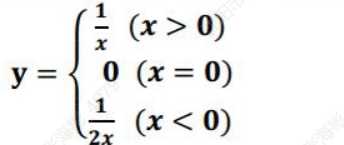
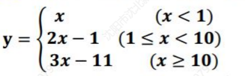
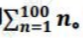
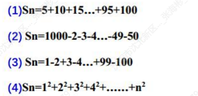
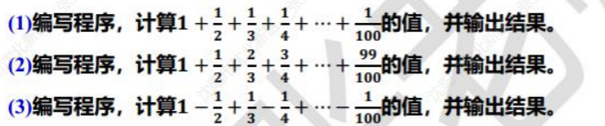

# 顺序结构

1. 从键盘输入一个大写字母，在显示屏上显示对应的小写字母。

   ```c
   #include <stdio.h>
   int main(){
       char a;
       a=getchar();
       if(a>='A'&&a<='Z') printf("%c",a+32);
       return 0;
   }
   ```

2. 输入两个整数，求它们的差。

   ```c
   #include <stdio.h>
   int main(){
       int a,b;
       scanf("%d %d",&a,&b);
       printf("%d",a+b);
       return 0;
   }
   ```

3. 从键盘输入一个正数，要求输出它的平方根（如果平方根不是整数，则输出其整数部分)。

   ```c
   #include <stdio.h>
   #include <math.h>
   int main(){
       int a;
       scanf("%d",&a);
       printf("%.0f",sqrt(a));
       return 0;
   }
   ```

4. 设圆半径r=1.5,圆柱高=3，求圆周长、圆面积、圆球表面积，圆球体积、圆柱体积。用scanf输入数据，输出计算结果，输出时要求有文字说明，取小数点后2位数字。

   ```c
   //圆的周长=2pi*r 圆的面积=pi*r²  圆球表面积S=4πr²  球的体积=4/3*pi*r^3  圆柱体积=pi*r²h
   #include<stdio.h>
   int main(){
       float r,h;
       scanf("%f,%f",&r,&h);
       printf("zc%f\n",2*3.14*r);
       printf("mj%f\n",3.14*r*r);
       printf("qtj%f\n",4*3.14*r*r);
       printf("qtj%f\n",4/3.0*3.14*r*r*r);
       printf("mj%f\n",3.14*r*r*h);
       return 0;
   }
   ```

5. 输入三角形的一条边长和这条边上的高，求三角形面积

   ```c
   #include <stdio.h>
   int main(){
       int d,h;
       scanf("%d,%d",&d,&h);
       printf("%f",d*h*1.0/2.0);
       return 0;
   }
   ```

6. 给出三角形三边长，求三角形面积

# 选择结构

1. 输入用year表示的某一年，判断是否为闰年，如果是则输出“是”，否则输出不是”。闰年的条件是符合下面二者之一：①能被4整除，但不能被100整除，如2008。②能被400整除，如2000。
2. 求解得ax2+bx+c-0方程的根。由键盘输入a,b,c。假设a,b,c的值任意，并不保证b2-4ac≥0。需要在程序中进行判别，如果b2-4ac≥0，就计算并输出方程的两个实根，如果b^2^-4ac<0,就输出“此方程无实根”的信息。
3. 输入两个整数，如果两个数不等，则输出大数，如果相等，则输出“x==y”和x的值。
4. 输入一个数，判断能否被3整除，能则输出“yes”,不能则输出“no”。
5. 根据输入的学生成绩（整数），给出相应的等级。90分及以上为A,60分以下为E,其余10分一个等级。
6. 输入一个整数，打印它是奇数还是偶数。
7. 输入三个整数a、b、c,输出最大数。
8. 输入一个数，判断这个数能否同时被3和5整除。
9. 有下面一个分段函数，编写一个程序，要求输入x的值，输出y的值
10. 有下面一个分段函数，编写一个程序，要求输入x的值，输出y相应的值
11. 输入一个百分制成绩，要求输出成绩等级A、B、C、D、E。90分以上为A,80 ~ 89分为B,70~79分为C,6069分为D,60分以下为E。(if和switch两种方法实现)
12. 输入两个整数，按由小到大的顺序输出。
13. 输入三个整数，要求按照由小到大的顺序输出。
14. 输入一个三位数的正整数，要求：(1)分别输出每一位数字：(2)按逆序输出各位数字，例如原数为123，应输出321。
15. 键盘输入一个三位数，判断是否为“水仙花数"，是则输出ys,不是则输出0。所谓“水仙花数”是指一个3位数，其各位数字立方和等于该数本身。例如：1^3^+5^3^+3^3^=153,即153是一个水仙花数。
16. 键盘输入三个整数，判断能否构成三角形，如果能构成三角形则求三角形的面积。

# 循环结构

1. 编程求1+2+3+.+100，即。(用while、.do...while和for三种方法完成)
   (1)编程求1到100之间的奇数和？(1+3+.+99=)
   (2)编程求1到100之间的偶数和？(2+4+..+100=)
   (3)编程求1+5+9+13+17+21的和？
   (4)编程求1^2^+2^2^+3^2^+4^2^^+...+ n^2^,直到累加和大于或等于1000为止。
   
2. 编程输出1~10之间的不能被3整除的数。

3. 整数数列问题

4. 分数数列问题

5. 从键盘输入一个正整数，判断该数是否是素数，若是则打印ys,若不是则打印no。

6. 编写程序，输出从公元1600年至2000年所有闰年的年号，（每输出5个年号换一行)，判断公元年是否为闰年的条件是：(1)公元年数如能被4整除，而不能被100整除，则是闰年；(2)公元年数能被400整除也是闰年

7. 输出100到200之间，能否同时被3和5整除的数(每输出5个数换一行)
   
8. 输出100一200之间既不能被3整除又不能被7整除的数及其个数。

   ```c
   #include <stdio.h>
   int main(){
       int count=0,i;
       for(i=100;i<=200;i++){
           if(i%3!=0&&i%7!=0){
               printf("%d",i);
               count++;
           }
       }
       printf("count=%d",count);
       return 0;
   }
   ```

9. 编写程序，计算键盘输入的一个数n的阶乘，即！

10. 输入两个正整数m和，求其最大公约数和最小公倍数。

11. 输出所有的“水仙花数”。所谓“水仙花数”是指一个3位数，其各位数字立方和等于该数本身。例如：13+53+33-153,即153是一个水仙花数。

12. 一个数如果恰好等于它的因子之和，这个数就被称为“完数”。例如，6

13. 的因子为1,2,3，而6=1+2+3，因此6是“完数”。编程实现判断键盘输入的一个数是否是完数，如果是完数，则输出“是”，否则输出“不是”。

14. 求100~200间的全部素数（每输出10个素数换行）。

15. 编写程序，计算1！+2！+3！+..+20！

16. 编写程序，计算1！+2！+3！+..+的值，n从键盘输入。

17. 编写程序，计算2+22+23+…+220的值。

18. 求sn=a+aa+aaa+.+aa…a(n个)的和，其中，a是一个数字，n表示a的位数，n由键盘输入，例如：2+22+222+2222+22222=？

19. 有一个分数序列：2/1,3/2,53,8/5,13/8,21/13.….求这个序列的前20项之和

20. 一个数如果恰好等于它的因子之和，这个数就被称为“完数”。例如，6的因子为1,2,3，而6=1+2+3，因此6是“完数”。编程序找出1000之内的所有完数并输出。

21. 输入25字符，分别统计其中英文字母、数字和其他字符的个数。

22. 输入一行字符，分别统计其中空格、数字和其他字符的个数。

# 数组

1. 对10个数组元素依次赋值为0,1,2,3,4,5,6,78,9：要求按逆序输出。
2. 输入任意5个整数存入数组中，输出最大值。
3. 输入任意5个整数存入数组中，输出最小值。
4. 输入任意10个整数存入数组a中，将数组a中元素逆置后输出。
5. 输入5个数，要求输出期其中值最大的元素和该数是第几个数。
6. 有一个一维数组sc0re,内放5个学生成绩，求平均成绩。
7. 编写一个程序，将两个长度相同的一维数组中各下标相同的对应元素相乘，将结果存放在一个一维数组中，并输出。
8. 编写程序，从键盘输入80个字符，统计其中数字字符的个数，并输出统计结果。
9. 输入10个数存入数组中，输出其中偶数的个数及偶数的和。
10. 输入10个整数存入数组，找出其中最大值和最小值。
11. 输入10个整数存入数组中，将其中最小的数与第一个数交换，输出交换后的数组。
12. 输入10个整数存入数组中，将其中最大的数与最后一个数交换，输出交换后的数组。
13. 用数组实现以下功能：输入5个学生成绩，而后求出这些成绩的平均值并显示出来。
14. 编写程序，输入15个整数存入一维数组中，按逆序重新存放后再输出。
15. 求一个3*3的整型矩阵对角线元素之和。

# 函数

1. 例题1：输入两个整数，要求输出其中值较大者。要求用函数来找到大数。
2. 例题2：输入两个实数，用一个函数求出它们之和。
3. 例题3：定义一个函数，求两个整数的最大值。
4. 例题4：从键盘输入两个数，使用例题3的函数求其中最大数。
5. 基础练习1：写两个函数，分别求两个整数的最大公约数和最小公倍数。
6. 基础练习2：写一个判断素数的函数，在主函数输入一个整数，输出是否为素数的信息。
7. 基础练习3：写一个函数求n:。
8. 基础练习4：写一个函数，交换两个实数的值。
9. 1：编写函数实现字符串函数strlen0功能，不能使用字符串函数。
10. 2：编写一个函数实现将整型数组中的6个整数逆序排列。