# 第1章计算机网络安全概述

## 网络安全简介

1. 网络面临多种风险

   - 物理风险
   - 系统风险
   - 管理风险
   - 信息风险
   - 应用风险
   - 其他风险
   - 网络的风险

2. 威胁的动机

   - 恶作剧
   - 扬名
   - 报复
   - 无知
   - 利益驱动
   - 政治目的

3. 当前网络存在的主要问题

   - 机房安全（设备问题）
   - 病毒的侵入和黑客的攻击（外部问题）
   - 管理不健全造成的安全漏洞（内部问题）

4. 网络脆弱性的原因

   - 造成计算机网络安全问题的原因归纳为两大类：**外在的威胁**和**内在的脆弱性**。
   - **内在的脆弱性**是计算**机网络安全问题的根本原因**。
   - **从技术角度看**，内在的脆弱性主要包括以下方面：**对象，环境，对象所受到的影响，外部输入，影响对象的方式**
   - 
   - **使用角度看**：网络系统安全的脆弱性主要包括以下方面：**操作系统**的脆弱性，**网络**的脆弱性，**数据库管理系统**的脆弱性，**防火墙**的局限性，**其他**方面的原因
   - 计算机网络安全的脆弱性
     - 操作系统的脆弱性
       - 操作系统**结构体制本身的缺陷**。
       - 在网络上传输文件，加载与安装程序，包括可执行的文件。
       - 在**创建进程**，甚至可以在网络的节点上进行远程的创建和激活
       - 操作系统中有一些**守护进程**，实际上是一些系统进程，它们总是在等待一些条件的出现。
       - 操作系统都提供**远程过程调用**(RPC)服务，而提供的安全验证功能却很有限。
       - 操作系统提供**网络文件系统**(NFS)服务，NFS系统是一个基于RPC的网络文件系统。
       - 操作系统的debug。
       - 操作系统安排的**无口令入口**，是为系统开发人员提供的边界入口，但这些入口也可能被黑客利用。
       - 操作系统还有**隐蔽的信道**，存在着潜在的危险
       - 尽管操作系统的缺陷可以通过版本的不断升级来克服，但系统的某一个**安全漏洞**就会使系统的所有安全控制毫无价值。
     - 网络的脆弱性
       - 使用**TCP/IP协议的网络所提供的FTP、E-Mail、RPC和NFS都包含许多不安全的因素存在着许多漏洞**。同时，网络的普及，使信息共享达到了一个新的层次，信息被暴露的机会大大增多。特别是Internet网络就是个不设防的开放大系统。另外，数据处理的**可访问性和资源共享**的日的性之间是一对矛盾。它造成了计算机系统保密性难。
     - 数据库管理系统的脆弱性
       - **数据库管理系统安全必须与操作系统的安全相配套**
     - 防火墙的局限性
       - 尽管利用防火墙可以保护安全网免受外部黑客的攻击，**但它只是能够提高网络的安全性，不可能保证网络绝对安全**。事实上仍然存在着一些防火墙不能防范的安全威胁，如防火墙不能防范不经过防火墙的攻击。另外，**防火墙很难防范来自于网络内部的攻击以及病毒的威胁。**
     - 其他方面的原因
       - 计算机领域中重大技术进步都对安全性构成新的威胁。
       - 安全性的地位总是列在计算机网络系统
       - 总体设计规划的最后面，勿略了网络系统的安全
       - 易受环境和灾害的影响。
       - 电子技术基础薄弱，抵抗外部环境较弱。
       - **电磁泄漏**的不可避免。

4. 网络安全的定义

   - **网络安全**是指**网络系统的硬、软件及其系统中的数据受到保护**，**不会由于偶然或恶意的原因而遭到破坏、更改、泄露等。**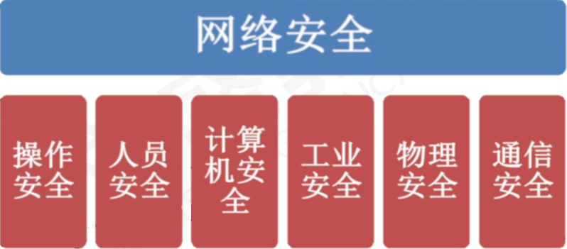
   - 广义的网络安全定义：凡是涉及到网络上信息的安全性，完整性，可用性，真实性和可控性的相关理论和技术都是网络信息安全所要研究的领域
   - 狭义的网络安全定义：指**信息内容**的安全性即保护信息的秘密性、真实性和完整性，避免攻击者利用系统的安全漏洞进行窃听、冒充诈骗、盗用等有损合法用户利益的行为，保护合法用户的利益和隐私。（考试涉及狭义范围）

5. 网络安全的基本要素

   1. **安全性**（**最基本特性**）
      - **内部安全**：用来对用户进行识别和认证；
      - **外部安全**：加强系统物理安全和人事（特别是内部人事)安全
   2. **完整性**
      - 完整性包括**软件完整性**和**数据完整性**。
      - 需要保证计算机系统内部的软件和数据不被非法**删除**和**篡改**
   3. **保密性**
      - 通过**加密算法**保证数据的保密性，防止用户非法获取关键的敏感信息，避免**信息泄露**。
   4. **可用性**
      - 可用性是说**无论何时何地**，只要用户需要，系统和网络资源**必须是可用的**，尤其是当计算机或网络系统受到攻击时，它必须能保证为用户提供正常的系统功能和服务。
   5. **不可抵赖性**
      - 也称为**不可否认性**，在网络信息交互过程中，确信参与者的真实操作性，即所有参与者都不能否认或抵赖曾经完成的操作和承诺。**插入伪造的对象**
   
6. 网络安全内容

   1. 从技术角度看网络安全的内容包括：

      - **网络实体安全（物理安全）**
      - **网络数据安全（逻辑安全）**
      - **软件系统安全（操作系统安全）**
      - **网络管理安全（联网安全）**

   2. 网络实体安全（物理安全）

      - 防盗
        像其他的物体一样，计算机也是偷窃者的目标，例如盗走软盘、主板等。计算机偷窃行为所造成的损失可能远远超过计算机本身的价值，因此必须采取严格的防范措施，以确保计算机设备不会丢失。
        
      - 防火
        计算机机房发生火灾一般是由于电气原因、人为事故或外部火灾蔓延引起的。电气设备和线路因为短路、过载、接触不良、绝缘层破坏或静电等原因引起电打火而导致火灾。人为事故是指由于操作人员不慎，吸烟、乱扔烟头等，使充满易燃物质（如纸片、磁带、胶片等）的机房起火，当然也不排除人为故意放火。外部火灾蔓延是因外部房间或其他建筑物起火而蔓延到机房而引起火灾。
        
      - **防静电**

        **静电**是由物体间的相互摩擦、接触而产生的，计算机显示器也会产生很强的静电。静电产生后，由于未能释放而保留在物体内，会有很高的电位（能量不大)，从而产生静电放电火花，**造成火灾**。还可能使大规模集成**造成电器损坏**，这种损坏可能是不知不觉造成的。

      - 防雷击
   
      - 防电磁泄漏
   
        **造成计算机的信息泄露，屏蔽是防电磁泄漏的有效措施**
   
   3. 网络数据安全（逻辑安全）
   
      - 计算机的逻辑安全需要用**口令**字、**文件许可**、**查账**等方法来实现。
         可以限制**登录的次数**或对试探操作加上时间限制；可以用软件来保护存储在计算机文件中的信息；限制存取的另一种方式是通过硬件完成，在接收到存取要求后，先询问并校核口令，然后访问列于目录中的授权用户标志号。此外，有一些安全软件包也可以跟踪可疑的、未授权的存取企图，例如，多次登录或请求别人的文件。

   4. 软件系统安全（操作系统安全）

      - **操作系统是计算机中最基本、最重要的软件**。同一计算机可以安装几种不同的操作系统。如果计算机系统可提供给许多人使用，操作系统必须能区分用户，以便于防止他们相互干扰。一些安全性较高、功能较强的操作系统可以为计算机的每一位用户**分配账户**。通常，一个用户一个账户。操作系统不允许一个用户修改由另一个账户产生的数据
   
   5. 网络管理安全（联网安全）
   
      - 联网的安全性只能通过以下两方面的安全服务来达到：
   
         - **访问控制服务**：用来保护计算机和联网资源不被非授权使用
         - **通信安全服务**：用来认证数据机要性写完整性，以及各通信的可信赖性
      
   6. 网络安全的目的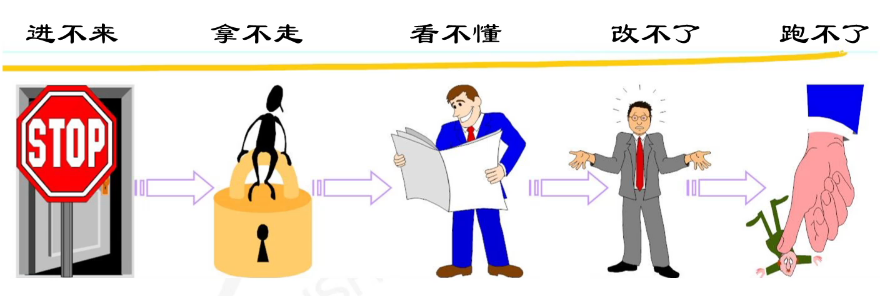

## 信息安全的发展历程

1. **面向信息的安全保障**
   - 主要体现在对**信息**的产生、传输、存储和使用过程中的保障，主要的手段的**信息加密**
   - 具体的过程是找到可能造成信息安全隐患的“漏洞”，并进行评估，最后通过技术手段将漏洞“堵上”。
2. **面向业务的安全保障**
   - 这种保障方式体现在通过**业务的生命周期**入手，对业务流程进行分析，找出其中容易出现安全问题的关键点，从安全事件出现的前、中、后三个阶段进行安全保障。争取将信息安全事件消灭在萌芽中！！！
3. **面向服务的安全保障**
   - 对**单个业务的安全**保障需求演变为对**多个业务交叉系统**的综合安全需求，安全也分解为若干个单元，安全不再面对业务本身，而是面向使用业务的客户，具体地说就是用户在使用IT承载业务时，涉及该业务安全保障。

## 网络安全所涉及的内容

1. **物理网络安全性**
   - 是指网络中的各种设备和通信线路的安全，还有包括防火、防盗、防静电、防雷击、防电磁泄露等
2. **网络管理安全性**
   - 包括个人行为（使用不当、安全意识差）；局域网安全、远程访问管理；内部和外部泄露，信息丢失，防范黑客行为等。
3. **实施网络安全的技术**
   - **攻击技术**：包括**网络扫描、网络监听、网络入侵**等
   - **防御技术**：包括**操作系统安全配置技术、加密技术、防火墙技术、入侵检测技术**等。

## 网络安全防护体系

1. 网络安全的威肋
   - 安全威胁是指某个人、物、事件或者概念，对某一资源的机密性、完整性、可用性或合法性所造成的危害，某种攻击就是某种威胁的具体实现。
   - 安全威胁可以分为**故意**的和**偶然**的，**故意威胁**可进一步**分**为**被动**和**主动**的
2. 分类
   - **截获一从网络上窃听他人的通信内容。**
   - **中断一有意中断他人在网络上的通信。**
   - **篡改一故意篡改网络上传送的报文。**
   - **伪造—伪造信息在网络上传送。**
   - **截获信息**的攻击**称为被动攻击**，而**更改信息和拒绝用户使用**资源的攻击称为**主动攻击**。
3. 对网络的被动攻击和主动攻击
   - 
   - 在**被动攻击**中，攻击者只是观察和分析某一个协议数据单元PDU而不干扰信息流。即使这些数据对攻击者来说是不易理解的，他也可以通过观察PDU的协议控制信息部分，了解正在通信的协议实体的地址和身份，研究PDU的长度和传输的频率，以便了解所交换的数据的某种性质。这种攻击又称为“**流量分析**
4. 网络安全的威胁因素
   - 软件漏洞：任何的操作系统或软件都不是完美、无缺陷、无漏洞的，这些缺陷和漏洞就有可能成为威胁。**（内部）**
   - 配置不当：安全配置不当造成威胁，如防火墙配置错误，未起到应有作用。**（内部）**
   - 安全意识不强：用户选择口令简单、随意将账号和口令泄露等。**（内部）**
   - 病毒：目前网络安全最大的隐患是病毒，计算机病毒是病毒编制者书写的一段程序，能够破坏计算机硬件、软件或者数据，并且能够自我复制等特点。**（外部）**
   - 黑客：黑客利用网络或计算机系统中的漏洞非法进入未授权的计算机、网络或数据库系统，如果黑客具有恶意倾向，那么造成的危害是十分严重的。**（外部）**
5. 几种常用的网络安全技术
   - **防火墙技术**：防火墙是指网络之间通过预定义的安全策略，对内外网通信强制实施访问控制的安全应用措施，防火墙针对两个或多个网络之间传输的数据包按照一定的安全策略来实施检查，以确定网络之间的通信是否被允许，并监视网络运行状态。
   - **数据加密技术**：数据加密技术就是对信息进行重新编码，从而因此信息内容，使非法用户无法获取信息真实内容的一种技术手段，数据加密技术是提高信息系统即数据的安全性和保密性，防止秘密数据被外部破坏所采用的主要手段之一。
   - **系统容灾技术**：系统容灾技术主要包括基于数据备份和基于系统容错的系统容灾技术。系统容灾一般使用两个存储器，在两者之间建立复制关系，一个放在本地，另一个放在异地，二者通过网络相连接，构成完整的数据容灾系统。
   - **漏洞扫描技术**：漏洞扫描是自动检测远端或本机安全的技术，它查询TCP/IP各种服务的端口，并记录目标主机的响应，收集关于某些特定项目的有用信息，这些技术就是通过安全扫描程序来具体实现的。
   - **物理安全保障**
6. 安全策略的分类
   - **物理安全策略**：物理安全策略的目的是保护计算机系统、网络服务器、打印机等硬件实体和通信链路免收自然灾害、人为破坏和搭线攻击，验证用户身份和权限，建立完备的安全管理制度，防止各种威胁网络安全的情况出现。**抑制和防止电磁泄漏**
   - **访问控制策略**：访问控制是网络安全防范和保护的主要策略主要任务是保证**网络资源不被非法使用**和**非常规访问**。访问控制可以说是保障网络安全最重要的核心策略。
     - **网络**对**内部用户**的访问控制
     - **网络**对**外部用户**的访问控制
     - **外部用户**对**网络**的访问控制
   - **信息加密策略**：信息加密的目的是保护网内的数据、文件、口令和控制信息，保护网上传输的数据。
     - **链路加密**：链路加密的目的是保护网络节点之间的链路信息安全
     - **端点加密**：端点加密的目的是对源端用户传输到目的端用户的数据提供加密保护
     - **节点加密**：节点加密的目的是对源节点到目的节点之间的传输链路提供保护
   - **网络安全管理策略（人为，制度流程的管理）**
     - 确定安全管理登记和安全管理范围；
     - 制定网络操作使用规程；
     - 制定人员出入机房管理制定；
     - 制定网络系统的维护制度和应急措施。
7. 安全策略的配置
   - 开放式网络环境下用户的合法权益通常收到两种方式的侵害
   - 主动攻击和被动攻击，这两种攻击方式的实际目的是对用户信息的**窃取**和**对信息流量的分析**
   - 根据用户对安全的需求可以采用以下保护措施**：身份认证、信息保密、数字签名、访问控制和不可否认性。**
     - **身份认证**：**检验用户的身份是否合法**，防止身份冒充及对用户实施访问控制，进行数据完整性鉴别，防止数据被伪造、修改和删除
     - **信息保密**：防止用户**数据被泄露和窃取**，保护用户的隐私权利。
     - **数字签名**：**明确对信息进行处理的人员。**
     - **访问控制**：**对用户的访问权限进行控制。**
     - **不可否认性**：也称为**不可抵赖性**，及**防止对数据操作的否认性**。
8. 安全策略实现涉及的方面
   - **证书管理**：主要是指公开密钥证书的产生
   - **密钥管理**：包括密钥的产生、协商、交换和更新，目的是在通信的终端系统之间建立实现安全策略所需要的共享密钥
   - **安全策略**：在不同的终端系统之间协商建立共同采取的安全策略。
   - **安全算法实现**：使用具体的算法如RSA等
   - **安全策略数据库**：用来保存与安全策略有关的状态、变量和指针等。
9. 安全理念
   - 安全存在于过程
   - 安全不仅仅是一个产品，它是一个汇集了硬件、软件、网络、人以及他们之间相互关系和接口的系统。
   - 安全最**主要的问题**不是安全技术、安全工具或者是安全产品上的缺乏，而**是网络管理人员、企业经理人和用户对安全知识的忽视**。
   - 安全是策略，技术与管理的综合
10. 从工程技术角度出发，在设计网络信息系统时因特网保安措施的一些原则（网络安全基本原则)
    - **最小特权**（完成某种操作时赋予每个主体（用户或进程）必不可少的特权）
    - **纵深防御**（**不能只依赖单一安全机制**，**建立多重安全机制**，相互支撑）
    - **阻塞点**（**设置一个窄道**，在那里可**对攻击者进行监视和控制**。）
    - **最薄弱链接**（**木桶原理**）**安全系统的强度取决于其最薄弱环节的强度**
    - **失效保护状态** (**设备损坏**) **当系统失效时，拒绝攻击者的访问**
    - **普遍参与** （**安全需要全体人员的努力**）
    - **防御多样化**（**使用不同种的安全手段**）
    - **简单化**（**让事情简单使他们易于理解**，复杂化可能出现问题）
11. 访问控制策略
    - 入网访问控制（**网络对内部用户的访问控制**）
    - 网络的权限控制
    - 目录级安全控制
    - 属性安全控制
    - 网络服务器安全控制
    - 网络监测和锁定控制
    - 网络端口和节点的安全控制
    - 防火墙控制（**外部用户对网络的访问控制**）
11. 病毒保护
    - **系统病毒**：感染Windows操作系统的.exe和.dll文件。
    - **蠕虫病毒**：通过网络或者系统漏洞进行传播，很大部分的蠕虫病毒都有向外发送带毒邮件，阻塞网络的特性。
    - **木马病毒**：通过一段特定的木马程序来控制另外一台或多台计算机。
    - **脚本病毒**：使用脚本语言编写，通过网页进行的传播的病毒
    - **宏病毒**：让计算机感染传统型的病毒。删除硬盘上的文件或文档
    - **后门病毒**：后门就是辅助木马进一步入侵的小程序，通常会开启若干端口或服务。
13. 病毒预防要点
    - 重要计算机专机专用，与外界隔绝
    - 不使用来历不明的移动存储设备
    - 谨慎使用免费和共享软件
    - 坚持定期检测计算机系统，并及时更新检测病毒库
    - 不要随意点击不明链接、可执行文件等
    - 定期检测系统漏洞并及时修补
    - 提高口令的强度并定期或不定期进行更改

## 网络安全的发展趋势

1. 第一：是向更高级别的认证转移
2. 第二：目前存储在用户计算机上的复杂数据将“向上移动”，由与银行相似的机构来确保它们的安全
3. 第三：是在全世界的国家和地区建立与驾照相似的制度，它们在计算机销售时限制计算机的运算能力，或要求用户演示在自己的计算机受到攻击时抵御攻击的能力。

## 数据安全

1. 内部因素
   - 由TCP/IP网络体系结构本身导致的数据安全性问题；
2. 外部因素
   - 由于非法入侵以及病毒所导致的数据安全问题；
3. 数据边界安全策略
   - **被动防御技术**：**防火墙**
   - **主动防御技术**：**入侵检测系统**
4. 数据传输安全策略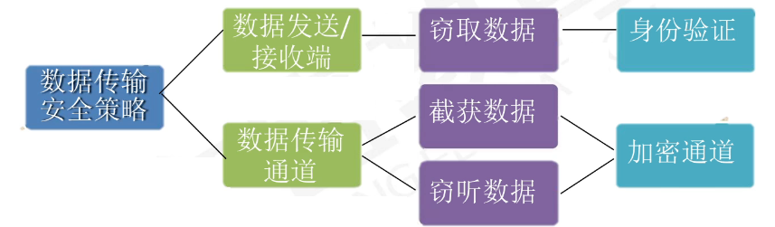
5. 数字加密技术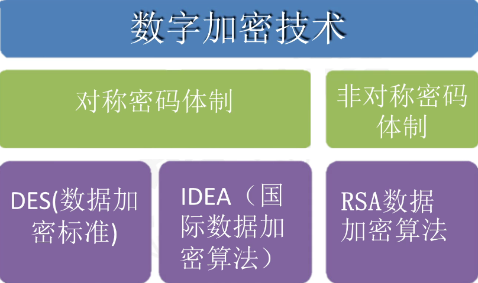
6. 访问控制技术
   - 通过ISAPI(服务器应用程序编程接口)实现访问控制
   - 使用钩子函数捕获用户输入
   - 替代动态链接库(Proxy DLL)技术
   - 修改输入地址表(ITA)技术
   - Microsoft Detours(系统函数库)
   - Windows网络底层控制
7. 网络监控软件
   - 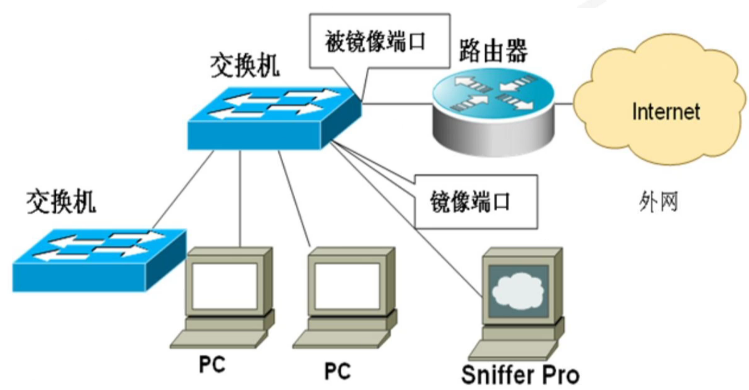
   - 网络监控软件的主要目标
     - 防止并追查重要资料，文件外泄目的主机：
     - 监督、审查、限制和规范网络使用行为；
     - 限制消耗网络资源的聊天、下载、游戏等；
     - 备份重要网络资源文件；
     - 监视聊天软件内容；
     - 流量限制以及网站方位统计。
   - 网络监控软件举例：Sniffer(嗅探器)

# 第2章黑客常用的系统攻击方法

## 黑客概述

1. 黑客：黑客一词已被用于泛指那些专门利用电脑网络搞破坏或恶作剧的人。

2. 黑客的行为有三方面发展**趋势**

   - **手段高明化**
   - **活动频繁化**
   - **动机复杂化**

3. 黑客精神：要成为一名好的黑客，需要具备四种基本素质：“Free”精神、探索与创新精神、反传统精神和合作精神。

4. 黑客十二条守则

   - 不要恶意破坏任何系统，这只会带来麻烦。
   - 不要破坏别人的软件和资料。
   - 不要修改任何系统文件，如果是因为进入系统的需要而修改了系统文件，在且的达到改回原状。
   - 不要将要黑或者黑过的站告诉不信任的人。
   - 在发表黑客文章时不要用真实名字。
   - 正在入侵的时候，不要随意离开电脑。
   - 不要入侵或破坏政府机关的主机。
   - 将笔记放在安全的地方。
   - 己侵入的电脑中的账号不得清除或修改。
   - 可以为隐藏自己的侵入而作一些修改，但要尽量保持原系统的安全性，不能因为得到系统的控制权而将门户大开。
   - 不要做一些无聊、单调并且愚蠢的重复性工作。
   - 做真正的黑客，读遍所有有关系统安全或系统漏洞的书。

5. 黑客和黑客技术

   - 研究网络安全不研究攻击技术-纸上谈兵
   - 研究攻击技术不研究网络安全-闭门造车
   - 某种意义上说**没有攻击就没有安全**
   - 网络攻击有善意也有恶意的，善意的攻击可以帮助系统管理员检查系统漏洞。
   - 攻击过程中涉及到的技术都是黑客技术

6. 黑客攻击动机

   - 贪心
   - 间谍
   - 商业
   - 仇恨
   - 黑客道德
   - 无知好奇
   - 报复
   - 名声
   - 恶作剧

7. 黑客类型

   - 白帽黑客
   - 黑帽黑客
   - 脚本小子
   - 黑客活动家
   - 国家支持的黑客
   - 间谍黑客
   - 网络恐怖分子

8. 黑客攻击入侵的过程

   1. **收集被攻击方的有关信息，分析被攻击方可能存在的漏洞。**（**收集信息**）

      确定攻击目标、获取IP地址、OS版本号。了解管理人员个人信息如生日，家庭成员，电话号码、电子邮件地址等；查找管理人员在社交媒体上发表的网络安全相关文章或其他敏感信息。

   2. **建立模拟环境，进行模拟攻击，测试对方可能的反应。**（**模拟攻击**）

   3. **利用适当的工具进行扫描。**（**目标扫描**）
      收集或编写适当的工具，进行OS分析和漏洞扫描，发现安全漏洞。

   4. **实施攻击**（**实施攻击**）
      根据前面步骤获得的所有信息，分析攻击目标的薄弱环节，进行攻击。

9. **入侵常用工具介绍**

   - **扫描器**：**自动检测远程或本地主机安全性弱点的程序**
   - **口令入侵**：口令字典
   - **特洛伊木马**
   - **网络嗅探器**：获取的流量进行数据分析
   - **破坏装置**：邮寄炸弹和病毒等

## 目标系统的探测方法

1. 常用的网络探测方法
   - **基于80端口入侵的检测**
   - **基于安全日志的检测**
   - **文件访问日志与关键文件保护**
   - **进程监控**
   - **注册表校验**
   - **端口监控**
   - **陷阱技术**
2. 扫描器概述
   - 网终安全扫描器是一种**自动检测远程**和**本地**主机**安全性弱点**的程序包，它通过与且标主机**TCP/IP端口**建立连接并请求某些服务（如TELNET、FTP等)记录且标主机的应答，搜集且标主机相关信息（如匿名用户是否可以登陆等)从而发现目标主机某些内在的安全弱点。
   - 现在比较好的**扫描器大多**采用**客户端/服务器(c/s)**架构。
   - 网络扫描技术的两种方式：
     - **侦杳扫描**：确认目标系统**是否激活**
     - **端口扫描**
       - TCP Connect扫描
       - TCP SYN扫描
       - TCP FIN扫描
       - TCP Fragmentation:扫描
   - 专用扫描器
     - 比较常用的专用扫描器有CGl扫描器、Asp扫描器、**从各个主要端口取得服务信息的扫描器、获取操作系统敏感信息的扫描器、数据库扫描器、远程控制系统扫描器。**

## 口令攻击

1. 口令攻击的三种方式

   1. **通过网络监听非法得到用户口令**
      这种方法有一定局限性，但是危害性极大，**监听者一般使用窃听或截取的方法获得账户和密码**，这种方法尤其适合TCP/IP体系结构中一些不支持加密的协议中，**比如Telnet、SMTP**等
   2. 在**知道用户的账号**后利用一些**专门软件强行用户口令破解**
      这种方法一般使用高性能计算机采用暴力破解或口令字典的方式进行密码破解需要攻击者具有足够的耐心和时间。
   3. **利用系统管理员的失误**
      利用管理员对系统管理的漏洞或者失误获取口令。
   
2. **口令的作用**就是向系统提供唯一标识个体身份的机制，只给个体所需信息的访问权，从而达到保护敏感信息和个人隐私的作用。

3. **口令必须定期更换。**

4. **最基本的规则是口令的更换周期应当比强行破解口令的时间要短**。

5. 口令破解方式

   - 口令破解方式概述
   - 词典攻击
   - 强行攻击
   - 组合攻击
   - 常见攻击方式的比较
   - 其它的攻击方式

6. 口令破解方式概述

   - 口令破解是入侵一个系统比较常用的方法。
   - 获得口令的思路：**穷举尝试**：最容易想到的方法，

     - 通过对用户的了解，猜测其可能使用某些信息作为密码，例如姓名、生日、电话号码等，同时结合对密码长度的猜测，利用工具生成口令破解字典；
   - 设法**找到存放口令的文件**并破解；
   - 通过其它途径如**网络嗅探、键盘记录器**等获取口令；
   - 这里所讲的口令破解通常是指通过前两种方式获取口令。这一般又有两种方式：**手工破解**和**自动破解**。
   - **手工破解**的步骤一般为：
     - 产生可能的口令列表
     - 按口令的可能性从高到低排序
     - 依次手动输入每个口令
     - 如果系统允许访问，则成功如果没有成功，则重试。
     - 注意不要超过口令的限制次数
   - **自动破解**
     一只要得到了加密口令的副本，就可以离线破解。这种破解的方法是需要花一番功夫的，因为要得到加密口令的副本就必须得到系统访问权。
     - 找到可用的userlD
     - 找到所用的加密算法
     - 获取加密口令
     - 创建可能的口令名单
     - 对每个单词加密
     - 对所有的userlD观察是否匹配
     - 重复以上过程，直到找出所有口令为止

7. 词典攻击

   - 所谓的词典，实际上是一个单词列表文件。这些单词有的纯粹来自于普通词典中的英文单词，有的则是根据用户的各种信息建立起来的，
     如用户名字、生日、街道名字、喜欢的动物等
   - 简而言之，词典是根据人们设置自己账号口令的习惯总结出来的常用口令列表文件
   - 使用一个或多个词典文件，利用里面的单词列表进行口令猜测的过程，就是词典攻击。
   - 多数用户都会根据自己的喜好或自己所熟知的事物来设置口令，因此，口令在词典文件中的可能性很大。而且词典条目相对较少，在破解速度上也远快于穷举法口令攻击。
   - 在大多数系统中，和穷举尝试所有的组合相比，词典攻击能在很短的时间内完成。
   - 经过仔细的研究了解周围的环境，成功破解口令的可能性就会大大的增加。
   - 从安全的角度来讲，要求用户不**要从周围环境中派生口令**是很重要的。

8. 强行攻击

   - 很多人认为，如果使用足够长的口令或者使用足够完善的加密模式，就能有一个攻不破的口令。
   - 事实上，是**没有攻不破的口令的，攻破只是一个时间的问题**，哪怕是花上100年才能破解一个高级加密方式，但是起码他着是可以破解的，而且破解的时间会随着计算机处理速度的提高而减少。10年前只需要花100年才能被解的口令可能现在要花一星期就可以了。
   - 如果有速度足够快的计算机能尝试字母、数字、特殊字符所有的组合，将最终能破解所有的口令。这种攻击方式叫做**强行攻击（也叫做暴力破解）**
   - 一种新型的强行攻击叫做**分布式暴力破解**

9. 组合攻击

   - 词典攻击虽然速度快，但是只能发现词典单词口令：强行攻击能发现所有口令，但是破解的时间长。
   - 很多情况下，管理员会要求用户的口令是字母和数字的组合，而这个时候，许多用户就仅仅会在他们的口令后面添加几个数字，例如，把口令从ericgolfi改成ericgolf2324,这样的口令利用组合攻击很有效。
   - **组合攻击**是在使用**词典单词的基础上**在**单词的后面串接几个字母和数字**进行攻击的攻击方式。

10. **常见攻击方式的比较**

    - |              | 词典攻击         | 强行攻击     | 组合攻击               |
      | ------------ | ---------------- | ------------ | ---------------------- |
      | 攻击速度     | 快               | 慢           | 中等                   |
      | 破解口令数量 | 找到所有词典单词 | 找到所有口令 | 找到以词典为基础的口令 |
      | 能否破解     | 不一定           | 一定         | 尽可能                 |

11. 其它的攻击方式

    - 口令安全最容易想到的一个威胁就是口令破解，许多公司因此花费大量功夫加强口令的安全性、牢固性、不可破解性，但即使是看似坚不可摧很难破解的口令，还是有一些其它手段可以获取的，类似大开着的“后门”。
    - 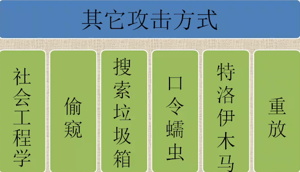
    - 社会工程学：利用人性的弱点、结合心理学知识、就是欺骗人们去获得本来无法访问的信息。
    - 重放：截取到的认证信息重放从而完成用户登陆。

12. 口令安全建议

    - 不要将口令写下来
    - 不要将口令存于计算机文件中
    - 口令要容易记住
    - 不要用字典中有的词作为自己的口令
    - 不要用生日、电话号码、纯数字或纯字母做口令
    - 口令应包含特殊字符
    - 口令应该在允许的范围内尽可能取长一点
    - 不要在不同系统上使用同一口令
    - 在输入口令时应确认没有人偷窥
    - 定期改变口令，至少6个月要改变一次。

## 网络监听

1. 网络监听是一种监视网络状态、数据流程以及网络上信息传输的管理工具，它可以将网络界面设定成监听模式，并且可以截获网络上所传输的信息。但是网络监听只能应用于连接同一网段的主机，通常被用来获取用户密码等。

2. **网络监听的目的是截获通信的内容，监听的手段是对协议进行分析。**

3. 网络监听定义：网络监听也叫**嗅探器**，其英文名是**Sniffer**,即**将网络上传输的数据捕获并进行分析的行为。**

4. 网络监听是一种网络监测设备，既可以是硬件，也可以是软件。

5. 网络监听器Sniffer工作原理

   - 监听器Sniffer的原理：在局域网中与其他计算机进行数据交换的时候，发送的数据包发往所有的连在一起的主机，也就是**广播**，在报头中包含目标机的正确地址。因此只有**与数据包中目标地址一致的那台主机才会接收数据包**，**其他的机器都会将包丢弃**。**但是，当主机工作在监听模式下时**，**无论接收到的数据包中目标地址是仕么**，主机**都将其接收下来**。然后对**数据包进行分析**，**就得到了局域网中通信的数据**。一台计算机**可以监听同网段所有的数据包**，**不能监听不同网段的计算机传输的信息**
   
6. 网络监听技术理论基础

   - **网卡有4种接收方式**：**广播方式，组播方式，直接方式，混杂方式**。

   - 混杂模式：不管数据帧中的目的地址是否与自己的地址匹配，**都接收下来**

   - 非混杂模式：只接收目的地址相匹配的数据帧，以及广播数据包（和组播数据包）
   
   - **为了监听网络上的流量，必须设置为混杂模式**
   
   - 网络监听原理
   
     **以太网数据是以广播方式发送的，也就是说局域网内的每台主机都在监听网内传输数据**。**以太网硬件将监听到的数据帧所包含的MAC地址与自己的滤MAC地址相比较，如果相同，则接收该帧，否则丢掉它，这就是以太网的过滤规则。但是，如果把网卡设置为“混杂模式”，它就能接收传输在网终上的每一个信息包。Sniffer就是依据这种原理来监测网络中流动着的数据。**
   
6. 网络监听的组成

   - **网络硬件设备**如网卡，集线器，路同器等
   - **监听驱动程序**截获数据流，进行过滤并把数据存入缓冲区
   - **捕获驱动程序**这是最重要的部件，直接控制网络硬件从信道上抓取数据，并将数据存入缓冲器
   - **缓冲器**用来存放捕获到的数据的容器是缓冲满马上停止；二是循环覆盖旧的数据
   - **实时分析程序**实时分析数据帧中所包含的数据，目的是**发现网络性能问题和故障**，侧重于网络性能和故障方面的问题
   - **解码程序**将接收到的加密数据进行解密构造自己的加密数据包并把它发送到网络
   - **数据包分析器**对截取到的数据包进行模式匹配和分析，.将感兴趣的信息从原始数据包中剥离出来
   
7. 网络监听的用途

   - 把网络中的数据流转化成可读格式。（**数据包转换为文件**）
   - 进行性能分析以发现网络瓶颈。
   - 进行入侵检测以发现外界入侵者。
   - 生成网络活动日志和安全审计。
   - 进行故障分析以发现网络中潜在的问题。

9. 网络监听的意义

   - 在网络安全中，sniffer起着“双刃刀”的作用：一方面，通过网络监听软件，管理员可以监视网络的状态、数据流动的情况以及网络上传输的信息，可以观测分析实时的数据包，从而快速地进行网络故障定位。另一方面，sniffer给以太网带来很大的隐患很多网络入侵事件往往伴随着以太网内的Sniffer行为，从而造成口令失窃，敏感数据被截获等恶性安全事件。
   
9. 数据库安全审计技术

   - 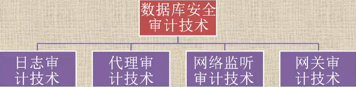
   - 数据库审计技术的根本规则

## 木马

1. 木马的工作原理
   - 木马(Trojan Horse)又称特洛伊木马，是一种通过各种方法直接或者间接与远程计算机之间建立起连接，使远程计算机能够通过网络控制本地计算机的程序。
2. 木马的基本原理分析
   - “木马”程序是目前比较流行的黑客入侵方式之一，通常木马并不被当成病毒，因为它们通常不包括感染程序，因而并不自我复制，只是靠欺骗获得传播。现在，随着网络的普及，木马程序的危害变得十分强大，如今它常被用作在远程计算机之间建立连接，像间谍一样潜入用户的计算机，使远程计算机通过网络控制本地计算机。
3. 传统木马主要特点
   - 隐蔽性好
   - 通常只改写几个、几十个注册表加载点
   - 通常不感染系统文件
   - 通常不具备主动传播性
   - 利用网页挂马，木马下载器，欺骗下载等方式传播
   - 删除木马文件即可简单清除。
4. 木马的分类
   - 按照**木马应用类型**分可分为以下**6种**类型
     - **网络游戏类木马**
     - **网银木马**
     - **即时通讯软件木马**
       - 发送消息型
       - 盗号型
       - 传播自身型
     - **网页点击类木马**
     - **下载类木马**
     - **代理类木马**
   - 根据**木马程序对计算机的具体操作方式**，可以分为以下**5类**：
     - **远程访问型木马**
     - **密码发送型木马**
     - **键盘记录型木马**
     - **破坏型木马**
     - **FTP型木马**
   - 根据**木马的网络连接方向**，可以分为两类：
     - **正向连接型**：发起通信的方向为**控制端向被控制端发起**，这是传统技术，**其缺点是不能透过防火墙**。
     - **反向连接型**：发起通信的方向为**被控制端向控制端发起**，其出现主要是为了解决从内向外不能发起连接的情况的通信要求，已经被较新的木马广泛采用。
5. 木马的结构和原理
   - **木马程序**一般由**两部分组成**，分别是**服务器端和客户端**。**服务器端**程序指的是运行在被**控制的电脑**的木马程序，该程序为.exe后缀的可执行文件。**客户端程序安装在控制端**，客户端能够对服务器端的控制。
   - 在Windows系统中，木马般作为一个网络服务程序在中了木马的计算机后台运行，监听本机一些特定端口，这个端口号多数比较大(5000以上，但也有少数是5000以下的)当该木马相应的客户端程序在此端口上请求连接时，它会与客户程序建立TCP连接，从而被客户端远程控制。
   - 木马一般采用了Windows系统启动时自动加载应用程序的方法，包括有win.ini、system.ini和注册表等。
   - 木马驻留计算机以后，还得有客户端程序来控制才可以进行相应的“黑箱”操作。客户端要与木马服务器端进行通信就必须建立连接，目前一般采用TCP连接。
6. 木马的隐藏方式
   - 在任务栏里隐藏
   - 在任务管理器里隐藏
   - 在端口隐藏 （Tcp方式 139端口，**445端口**，593端口，3127端口，6129端口，3389端口 UDP方式 123端口 137端口 138端口 445端口 1900端口）
   - 隐藏通信
   - 隐藏加载方式
7. 木马常见的功能（破坏，篡改，控制）
   - 窃取数据
   - 接受非授权操作者的指令
   - 篡改文件和数据
   - 删除文件和数据
   - 施放病毒
   - 使系统自毁
   - 远程运行程序
   - 跟踪监视对方屏幕
   - 直接屏幕鼠标控制，键盘输入控制
   - 监视对方任务且可以中止对方任务
   - 锁定鼠标键盘和屏幕
   - 远程重启、关机
   - 远程读取、修改注册表
   - 共享被控制端的硬盘
8. **传播木马的方式**主要有两种：**一种是通过邮件；另一种是下载**。
8. 木马的启动方式**6种**
   - 通过“**【开始】→【程序】→【启动】**”：隐蔽性：2星：应用程度：较低：
   - 通过**Win.ini**文件：隐蔽性：3星；应用程度：较低
   - 通过**注册表**启动：隐蔽性：3.5星：应用程度：极高
   - 通过**Autoexec.bat**文件或**winstart.bat**，**config.sys**文件启动：隐蔽性：4星；应用程度：较低
   - 通过**system.ini**启动：隐蔽性：5星；应用程度：一般
   - 通过**特定程序**启动：隐蔽性：5星：应用程度：常见
9. 木马的防御
   - 基本防御思想：备份胜于补救
   - 根本防御思想：防病胜于治病
   - 基本解决方法：进程服务注册表

## 拒绝服务攻击

1. 拒绝服务攻击(**DOS** - **Denial Of Service**)即攻击者想办法**让目标机器停止提供服务**，是黑客常用的攻击手段之。攻击者进行拒绝服务攻击，实际上让服务器实现两种效果：一**是迫使服务器的缓冲区满，不接收新的请求**：二是使用IP欺骗，**迫使服务器把合法用户的连接复位，影响合法用户的连接**。**目的**是让目标计算机或网络**无法提供正常的服务或资源访问**，使目标系统服务系统**停止响应**甚至**崩溃**，**而在此攻击中并不包括侵入目标服务器或目标网络设备**。（**可用性**）
2. DOS通常是利用传输协议中的某个**弱点**、系统存在的**漏洞**、或服务的漏洞，对目标系统发起**大规模的进攻**，用超出目标处理能力的**海量数据包**消耗可用**系统资源**，**带宽资源**等，或造成**程序缓冲区溢出错误**，致使其无法处理合法用户的正常请求无法提供正常服务，最终致使网络服务**瘫痪**，甚至系统**死机**
3. 简单的说，拒绝服务攻击就是让攻击目标瘫痪的一种“**损人不利己**”的攻击手段。
4. 拒绝服务攻击**可能是蓄意的**，**也可能是偶然的**。
5. 当未被授权的用户过量使用资源时，攻击是蓄意的；当合法用户无意地操作而使得
   资源不可用时，则是偶然的。
6. 应该对两种拒绝服务攻击都采取预防措施。但是拒绝服务攻击问题也一直得不到合理的解决，究其原因是因为这是**由于网络协议本身的安全缺陷造成的**。
7. DOS攻击的原因
   - **软件的弱点**
   - **错误配置**
   - **重复请求导致过载**
8. 拒绝服务攻击原理
   - **Ping of death(死亡之Ping)**
     - Ping是一个非常著名的程序，这个程序的目的是为了测试另一台主机是否可达。现在所有的操作系统上几乎都有这个程序，它己经成为系统的一部分。
     - Ping程序的目的是为了查看网络上的主机是否处于活动状态
     - 通过发送一份**ICMP回显请求报文给目的主机**，并等待返回ICMP回显应答，根据回显应答的内容判断目的主机的状况
     - Ping之所以会造成伤害是源于早期操作系统在处理ICMP协议数据包存在漏洞。
     - ICMP协议的报文长度是固定的，**大小为64KB**,早期很多操作系统在接收ICMP数据报文的时候，只开辟64KB的缓存区用于存放接收到的数据包。
     - 一旦发送过来的ICMP数据包的实际尺寸**超过64KB**(65536B),操作系统将收到的数据报文向缓存区填写时，**报文长度大于64KB,就会产生一个缓存溢出，结果将导致TCP/IP协议堆栈的崩溃**，造成主机的重启动或是死机。
     - Ping程序有一个**“-l "参数**可**指定发送数据包的尺寸**，因此，使用Ping这个常用小程序就可以简单地实现这种攻击。例如通过这样一个命令：
       `Ping -l 65540 192.168.1.140`
     - 如果**对方主机存在这样一个漏洞，就会形成一次拒绝服务攻击**。这种攻击被称为“**死亡之Ping**”。
     - 现在的操作系统都已对这一漏洞进行了修补。对可发送的数据包大小进行了限制。
     - Ping Of Death攻击的攻击特征、检测方法和反攻击方法总结如下：
       - **攻击特征**：**该攻击数据包大于65535个字节**（**64k**）。由于部分操作系统接收到长度大于65535字节的数据包时，就会造成内存溢出、系统崩溃、重启、内核失败等后果，从而达到攻击的目的
       - **检测方法**：判断数据包的大小是否大于65535个字节。
       - **反攻击方法**：使用新的补丁程序，当收到大于65535个字节的数据包时，丢弃该数据包，并进行系统审计。
   - **泪滴(Teardrop)攻击**
     - “泪滴”也被称为**分片攻击**，它是一种典型的利用TCP/IP协议的问题进行拒绝服务攻击的方式，由于第一个实现这种攻击的程序名称为Teardrop,所以这种攻击也被称为“泪滴”
     - 两台计算机在进行通信时，如果传输的数据量较大，无法在一个数据报文中传输完成，就会将数据拆分成多个分片，传送到目的计算机后再到堆栈中进行重组，这一过程称为“分片”。
     - 为了能在到达目标主机后进行数据**重组**，**IP包的TCP首部中包含有信息（分片识别号、偏移量、数据长度、标志位)**说明该分段是原数据的哪一段，这样，目标主机在收到数据后，就能根据首部中的信息将各分片重新组合还原为数据。
     - 这就是报文重组的信息：
       ▣PSH1:1024(1024)ack1,Wwin4096
       ▣PSH1025:2048(1024)ack 1,win 4096
       ▣PSH2049:3072(1024)ack1,win4096
       在这个报文中，可以看到在第4、5、6这三个报文中，第4个发送的数据报文中是原数据的第1-1025字节内容，第5个发送的报文包含的是第1025~2048字节，第6个数据报文是第2049-3073个字节，接着后面是继续发送的分片和服务器的确认。当这些分片数据被发送到月标主机后，.具标主机就能够根据报文中的信意将分片重组，还原出薮据
     - 如果入侵者伪造数据报文，向服务器发送含有重叠偏移信息的分段包到目标主机，例如如下所列的分片信息：
       - PSH1:1025(1024)ack1,win4096
       - PSH1000:2049(1024)ack1,win4096
       - PSH2049:3073(1024)ack1,win4096
       - 这样的信息被目的主机收到后，在堆栈中重组时，由于畸形分片的存在，会导致重组出错，这个错误并不仅仅是影响到重组的数据，由于协议重组算法，会导致内存错误，引起协议栈的崩溃。
     - 泪滴攻击的攻击特征、检测方法和反攻击方法总结如下：
       - **攻击特征**：Teardrop工作原理是**向被攻击者发送多个分片的IP包**，某些操作系统收到含**有重叠偏移的伪造分片数据包**时将会出现**系统崩溃**、**重启**等现象。
       - **检测方法**：对接收到的分片数据包进行分析，计算数据包的片偏移量(Offset)是否有误。
       - **反攻击方法**：添加系统补丁程序，**丢弃收到的病态分片数据**包并对这种攻击进行审计。
   - **UDP洪水(UDP flood)**
     - UDP洪水(UDP flood)主要是**利用主机能自动进行回复的服务**（例如使用UDP协议的chargen服务和echo服务)来进行攻击。
     - 很多提供WWW和Mail等服务设备通常是使用**Unix的服务器**，它们默认打开一些被黑客恶意利用的UDP服务。如echo服务会显示接收到的每一个数据包，而原本作为测试功能的chargen服务会在收到每一个数据包时随机反馈一些字符。
     - 当我们向echo服务的端口发送一个数据时，echo服务会将同样的数据返回给发送方，而chargen(Character Generator Protocol)服务则会随机返回字符。
     - 当两个或两个以上系统存在这样的服务时，攻击者利用其中一台主机向另一台主机的echo或者chargen服务端口发送数据，echo和chargen服务会
       自动进行回复，这样开启echo和chargen服务的主机就会相互回复数据
     - 由于这种做法**使一方的输出成为另一方的输入**，两台主机间会形成**大量的UDP数据包**。当多个系统之间互相产生UDP数据包时，**最终将导致整个网络瘫痪**
   - **SYN洪水(SYN-flood)**
     - SYN Flood,是当前**最流行**的**拒绝服务攻击方式之一**，这是一种**利用TCP协议缺陷**，发送大量伪造的TCP连接请求，使被攻击方资源耗尽(CPU满负荷或内存不足)的攻击方式。
     - SYN Flood是**利用TCP连接的三次握手过程的特性实现的**。
     - 在TCP连接的三次握手过程中，假设一个客户端向服务器发送了SYN报文后突然死机或掉线，那么服务器在发出SYN/ACK应答报文后是无法收到
       客户端的ACK报文的，这种情况下服务器端一般会重试并等待，段时间后丢弃这个未完成的连接。这段时间的长度我们称为SYN Timeout。一般来说这个时间是分钟的数量级。
     - 一个用户出现异常导致服务器的一个线程等待1分钟并不是什么很大的问题，但如果有一个恶意的攻击者大量模拟这种情况（伪造IP地址），服
       务器端将为了维护一个非常大的半连接列表而消耗非常多的资源
     - 攻击细节
       - 连接请求是正常的，但是，**源IP地址往往是伪造的**，并且是**一台不可达的机器的IP地址**，否则，被伪造地址的机器会重置这些半开连接
       - 一般，半开连接超时之后，会自动被清除，所以，**攻击者的系统发出SYN包的速度要比目标机器清除半开连接的速度要快**
       - 任何连接到Internet.上并提供基于TCP的网络服务，都有可能成为攻击的目标
       - 这样的攻击很难跟踪，因为源地址往往不可信
     - 即使是简单的保存并遍历半连接列表也会消耗非常多的CPU时间和内存，何况还要不断对这列表中的IP进行SYN+ACK的重试。
     - 实际上如果服务器的TCP/IP栈不够强大，最后的结果往往是堆栈溢出崩溃一既使服务器端的系统足够强大，、服务器端也将忙于处理攻击者伪造的TCP连接请求而无暇理睬客户的正常请求，此时从正常客户的角度看来，服务器失去响应，这种情况就称作：服务器端受到了SYN Flood.攻击(SYN洪水攻击)
   - **Land(Land Attack)攻击**
     - **Land是因特网上最常见的拒绝服务攻击类型**，它是由著名黑客组织rootshell发现的。
     - 原理很简单，**向目标机**发送大量的**源地址**和**目标地址相同的包**，**造成目标机解析Land包时占用大量的系统资源**，从而**使网络功能完全瘫痪**。
     - Land攻击也是**利用TCP的三次握手过程的缺陷进行攻击**。
     - Land攻击是向目标主机发送一个特殊的SYN包，**包中的源地址和目标地址都是目标主机的地址**。**目标主机收到这样的连接请求时会向自己发送SYN/ACK数据包**，结果**导致目标主机向自己发回ACK数据包并创建一个连接。**
     - **大量的这样的数据包将使目标主机建立很多无效的连接**，**系统资源被大量的占用。**
     - **攻击特征**：用于Land攻击的**数据包中的源地址和耳标地址是相同的**。
       **操作系统接收到这类数据包时，不知道该如何处理堆栈中的这种情况**，**或者循环发送和接收该数据包**，**消耗大量的系统资源**，从而有可能**造成系统崩溃或死机等现象**。
     - **检测方法**：**判断网络数据包的源/目标地址是否相同**。
     - **反攻击方法**：**适当配置防火墙设备**或**过滤路由器**的**过滤规测**可以**防止**
       **这种攻击行为**，并对这种攻击进行**审计**。
9. 分布式拒绝服务攻击(DDOS)
   - 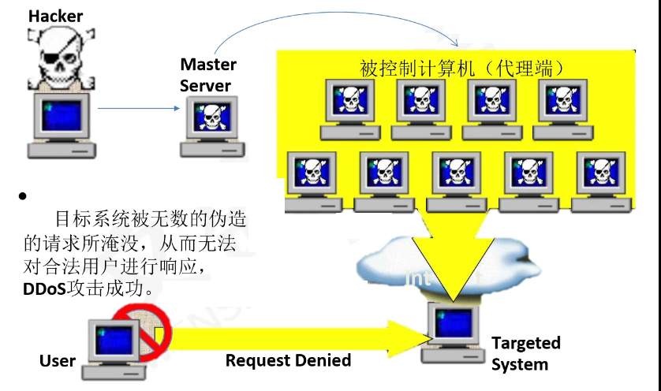
   - 步骤
     - 搜集了解目标的情况：
     - 占领傀儡主机；
     - 实际攻击；
   - 最常见的DoS攻击是利用合理的服务请求来点用过多的服务资源，致使服务超载，无法响应其他的请求
   - 这些服务资源包括网络带宽、文件系统空间容量、开放的进程、向内的连接等。
   - 这种攻击会导致资源的匮乏，无论计算机的处理速度多么快，内存容量多么大，互联网带宽多么大都无法避免这种攻击带来的后果
   - 从实施DoS攻击所用的**思路**来看，DoS攻击可以分为：
     - **滥用合理的服务清求**
     - **制造高流量无用数据**
     - **利用传输协议缺陷**
     - **利用服务程序的漏洞**
   - 按**漏洞**利用方式分类，DoS攻击可以分为
     - 特定资源消耗类
     - 暴力攻击类
   - 按攻击可能**产生的影响**，DoS攻击可以分为
     - **系统或程序崩溃类**
     - **服务降级类**：**系统对外提供服务的服务下降**

## 缓冲区溢出

1. 缓冲区溢出(Buffer Overflow,又称堆栈溢出)攻击是最常用的黑客技术之一。我们知道，UNIX本身以及其上的许多应用程序都是用C语言编写的，**C语言不检查缓冲区的边界**。在某些情况下，如果用户输入的数据长度超过应用程序给定的缓冲区，就会覆盖其他数据区。这称作“堆栈流出或缓冲溢出”。
2. 缓冲区溢出原理
   - 引起缓冲区溢出问题的根本原因是C(与其后代C++)本质就是不安全的
   - **没有边界来检查**数组和指针的引用也就是开发人员必须检香边界（而这
     一行为往往会被忽视)，否则会冒遇到问题的风险
   - **标准C库中还存在许多非安全字符串操作**，包括：strcpy()、sprintf()、gets()等
   - 向一个有限空间的缓冲区中拷贝了过长的字符串
   - 缓冲区溢出的错误正源源不断地从**UNIX、Windows、路由器、网关**以及许多其他连网设备中被发现，并构成了对系统安全威胁数量最多、程度较大的一类。
   - **在开发过程中，尽量使用带有边界检查的函数版本，或者自己进行越界检查**

## 欺骗技术

1. ARP欺骗
   - 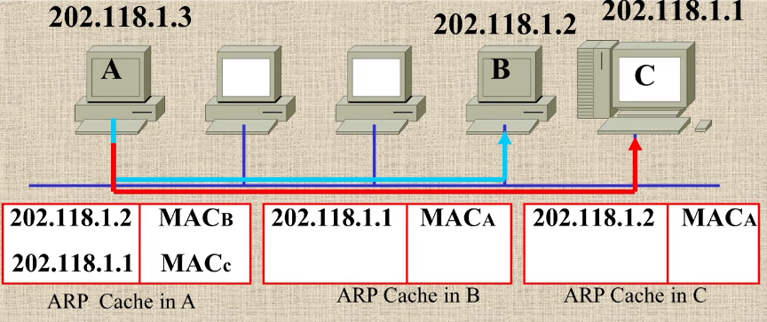
2. IP欺骗：假冒他人的IP地址发送信息
   - 盗用IP地址:**当一台主机使用的不是分配给自己的IP地址时就有盗用IP地址的嫌疑**
   - 带有假冒的IP地址的IP包既可能来自同一网段内部，也可能来自网段外部。
   - 一台主机使用另外的P地址，在同一子网中，并且具有该IP地址的主机未开机
   - 一台主机盗用另一网段一台主机的P地址，一般情况下是不可行的，正常通信时，将收不到对方返回的IP数据包
   - IP欺骗(IP spoof):**一台主机设备冒充另外一台主机的IP地址，与其它设备通信，从而达到某种直的的技术**
   - **IP欺骗(IP spoof)**:**入侵者使用假IP地址发送包。利用基于IP地址证实的应用程序。其结果是未授权的远端用户进入带有防火墙的主机系统。**
   - IP欺骗的动机
     - 隐藏自己的IP地址防止被跟踪
     - 以IP地址作为授权依据
     - 穿越防火墙
   - IP欺骗的形式
     - 单向IP欺骗：不考虑回传的数据包
     - 双向IP欺骗：要求看到回传的数据包
     - 更高级的欺骗：TCP会话劫持
3. 邮件欺骗：假冒他人email地址发送信息
   - 使用类似的电子邮件地址
   - 修改邮件客户软件的账号配置
   - 直接连到smtp服务器上发信
4. Web欺骗：Cookie欺骗；
   - 使用相似的域名
   - 改写URL
5. DNS欺骗
6. 非技术性欺骗
   - 社交工程

# 第3章计算机病毒

考试纲要：计算机病毒概述，计算机病毒的特征，计算机病毒的分类，计算机病毒的原理与实例，宏病毒，蠕虫病毒，计算机病毒的防治，防病毒应具有的基础知识。

## 计算机病毒的基本慨念

1. **计算机病毒**指“编制者在计算机程序中插入的破坏计算机功能或者**破坏**数据，影响计算机使用并且能够**自我复制的**一组计算机**指令**或者**程序代码**

2. 计算机病毒在《中华人民共和国计算机信息系统安全保护条例》中的定义为：“指**编制**或者在计算机程序中插入的破环计算机**功能**或者**数据**，影响计算机使用并且能够自我复制的一组计算机**指令**或者**程序代码**”

2. 病毒的发展史

   1. **DOS时代**：DOS是一个安全性较差的操作系统，所以在DOS时代，计算机病毒无论是数量还是种类都非常多。按照传染方式可以分为：**系统引导病毒**、**外壳型病毒**、**复合型病毒**。各类病毒的具体内容见“病毒的分类”。
   2. **Windows时代**：1995年8月，微软发布了Windows95,标志着个人电脑的操作系统全面进入了Windows9X时代，而Windowss9X对DOS的弱依赖性则使得计算机病毒也进入Windows时代。这个时代的最大特征便是大量**DOS病毒的消失**以及**宏病毒**的兴起（**主要文件型病毒**）
   3. **Internet时代**：可以这样说，**网络病毒**大多是Windows时代宏病毒的延续，它们往往利用强大的宏语言读取用户E-mail软件的地址簿，并将自身作为附件发向地址簿内的那些E-mail地址去。由于网络的快速和便捷，**网络病毒**的传播是**以几何级数进行的**，其危害比以前的任何一种病毒都要大。

   - CIH：CIH病毒，又名“切尔诺贝利”，是一种可怕的电脑病毒。它是由台湾大学生陈盈豪编制的，九八年五月间，陈盈豪还在大同工学院就读时完成以他的英文名字缩写“CIH”名的电脑病毒起初据称只是为了“想纪念一下1986的灾难或“使反病毒软件公司难堪”
   - 冲击波：年仅18岁的高中生杰弗里·李·帕森因为涉嫌是“冲击波”电脑病毒的制造者于2003年8月29日被捕。对此，他的邻居们表示不敢相信。在他们的眼里，杰弗里·李·帕森是一个电脑天才，而决不是什么黑客，更不会去犯罪。
   - 熊猫烧香：李俊，中专毕业大于1000万用户染毒损失数亿元人民币

3. 病毒的危害

   1. 病毒激发对计算机**数据信息**的**直接破坏**作用
   2. **占用磁盘空间**和对信息的破坏
   3. **抢占系统资源**
   4. **影响**计算机**运行速度**
   5. 计算机病毒**错误**与**不可预见**的**危害**
   6. 计算机病毒的兼容性对系统运行的影响

   - 间接危害
     1. 计算机病毒给用户造成严重的**心理压力**
     2. 造成**业务**上的**损失**
     3. **法律**上的问题

4. 发展阶段

   - 原始病毒阶段：攻击目标单一，
   - 混合型病毒阶段
   - 多态性病毒阶段
   - 网络病毒阶段
   - 主动攻击型病毒
   - 手机病毒

5. 病毒的破坏目标和攻击部位

   - 攻击系统数据
   - 攻击磁盘
   - 扰乱屏幕显示
   - 干扰键盘操作
   - 攻击CMOS
   - 干扰打印机
   
7. 计算机病毒的基本结构

   - **引导模块**：首先被执行，负责把病毒程序加载到内存合适的区域。
   - **传染模块**：完成计算机病毒的复制传播任务。
   - **破坏**与**表现**模块。

## 计算机病毒的特征

1. **传染性**：**传染性是病毒的基本特征**，不仅仅在生物界，计算机界的病毒也具有传染
   性，传染性是指病毒具有把自身复制到其它程序中的特性，这种传染性实际上是当病毒进入计算机系统并获得执行后，它就会寻找其他适合自己特征的文档、程序或者存储介质，并将自身代码复制并插入其中。
2. **可触发性**：病毒因为某个事件、操作或特点条件的出现，使得病毒实施感染或者攻击的特性称为可触发性。
2. **寄生性**：寄生性是指计算机病毒**寄生在其他程序**中，当执行这个程序时病毒就起到破
   坏作用，而在未启动前，是不易被人发现的。
4. **隐蔽性**：通过隐蔽技术使宿主程序的大小没有改变，以至于很难被发现。
4. **破坏性**：计算机所有资源包括**硬件资源**和**软件资源**，软件所能接触的地方均可能
   受到计算机病毒的破坏
6. **潜伏性**：潜伏性长期隐藏在系统中，只有在**满足特定条件时**，**才启动**其破坏模块。

## 计算机病毒的分类

1. 按病毒存在的**媒体分类**
   - **网络病毒**：通过**计算机网络传播感染网络中的可执行文件**（**不用硬盘**，**网络—>内存**）
   - **文件病毒**：**感染让算机中的文件**（如：**COM,EXE,DOC等**)
   - **引导型病毒**：**感染启动扇区(Boot)和硬盘的系统引导扇区MBR**
   - **混合型病毒**：**是上述三种情况的混合**。例如：多标，这样的病毒**通常都具有复杂的算法**，们使用非常规的办法侵入系统，同时使角了加密和变形算法
2. 按病毒传染的方法分类
   - **引导扇区传染病毒**：主**要使用病毒的全部或部分代码取代正常的引导记录**，而将**正常的引导记录隐藏在其他地方**。
   - **执行文件传染病毒**：寄生**在可执行程序中**，一旦**程序执行**，**病毒就被激活**，进行**预定活动**。
   - **网络传染病毒**：这类病毒是当前病毒的**主流**，特点是**通过互联网络进行传播**。例如，蠕虫病毒就是通过**主机**的**漏洞在网上传播**。
3. 按病毒**破坏的能力**分类 （2018年）
   - **无害型**：**除了传染时减少磁盘的可用空间外**，对系统**没有其它影响**。
   - **无危险型**：这类病毒**仅仅是减少内存、显示图像、发出声音及同类音响**
   - **危险型**：这类病毒在**计算机系统操作中造成严重的错误**。
   - **非常危险型**：这类病毒**删除程序、破坏数据、清除系统内存区和操作系统中重要的信息。**
4. 按病毒算法分类
   - **伴随型病毒**：这类病毒并不改变文件本身，它们根据算法产生EXE文件的伴随体，**具有同样的名字和不同的扩展名(COM)**,例如：XCOPY.EXE的伴随体是XCOPY.COM。病毒把自身写入COM文件并不改变EXE文件，当DOS加载文件时，伴随体优先被执行到，再由伴随体加载执行原来的EXE文件。（**无害**）
   - **蠕虫型病毒**：**通过计算机网络传播**，不改变文件和资料信息，**利用网络从台机器的内存传播到其它机器的内存**，计算网络地址，将自身的病毒通过网络发送。有时它们在系统存在，一般除了内存不占用其它资源。
   - **寄生型病毒**：依附在系统的导扇区或文件中，通过系统的功能进行传播。
   - **练习型病毒**：病毒自身包含错误，不能进行很好的传播，例如些病毒在调试阶段
   - **变形病毒**：这一类病毒使用一个复杂的算法，使自己每传播一份都具有不同的内容和长度。它们一般的作法是一段混有无关指令的解码算法和经过变化的病毒体组成。
5. 按计算机病毒的链结方式分类
   - **源码型病毒**：该病毒攻击高级语言编写的程序，该病毒在高级语言所编写的程序编译前插入到原程序中，经编译成为合法程序的一部分。
   - **嵌入型病毒**：这种病毒是将自身嵌入到现有程序中，把计算机病毒的主体程序与其攻击的对象以插入的方式链接。这种计算机病毒是**难以编写**的，一旦侵入程序体后也较难消除。如果同时采用多态性病毒将公些，超级病毒技术和隐蔽性病毒技术，当前的反病毒技术带来严峻的挑战。、
   - **外壳型病毒**：外壳型病毒将其自身包围在主程序的四周，对原来的程序不作修改。这种病毒最为常见，易于编写，也易于发现，一般测试文件的天小即可知。
   - **操作系统型病毒**：这种病毒用自身的程序加入或取代部分操作系统进行工作，具有很强的破坏力，可以导致整个系统的瘫痪。圆点病毒和大麻病毒就是典型的操作系统型病毒。
6. 按病毒攻击操作系统分类
   - Microsoft DOS
   - Microsoft Windows
   - 95/98/ME
   - Microsoft Windows
   - NT/2000/XP
   - Unix(Linux)
   - Macintosh(Mac Mag病毒、Scores病毒)
   - IOS
   - 安卓

## 计算机病毒的原理与实例

1. 病毒的工作步骤与机制
   - 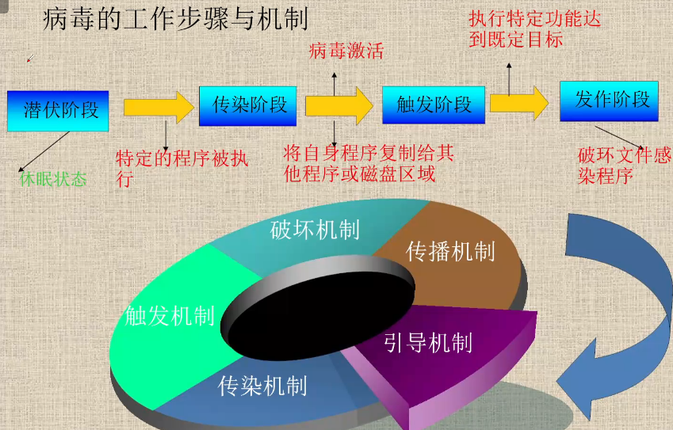
2. 计算机病毒的结构
   1. 引导机制
      - 病毒作为一种特殊的程序，就必须从**存储体进入内存才能实现其预定功能**
      - 所以其寄生对象主要分为
        - ①寄生在计算机**硬盘**的主引导扇区
        - ②寄生在计算机**磁盘逻辑分析**引导扇区
        - ③寄生在**可执行程序**中。
      - 其寄生方式为
        - 替代法 (用自身的指念代码替代原有的内容）
        - 链接法（将自身代码作为正常程序的一部分链接在程序的首部、尾部或中间）
      - 引导过程
        - **驻留内存**（**网络病毒不需要**)
        - **获取系统控制权**
        - **恢复系统功能**（为了**隐藏自己**，系统不会出现死机等异常状况，使用户无法发现病毒的存在)
   2. 传染机制
      - 传染机制指计算机病毒由一个宿主传播到另一个宿主程序，由一个系统进入另一个系统的过程。
      - 传染方式：
        - **被动传播**：用户在复制磁盘或文件时，把一个计算机病毒由一个信息载体复制到另一个信息载体，也可以通过网络把程序从一方传到另一方。
        - **主动传播**：在计算机病毒处于激活的状态下，只要传染条件满足，计算机病毒程序能主动地把计算机病毒自身传染给另一个载体或另一个系统。
      - 传染过程：
        - 对于被动传播的病毒而言：其传染过程是随着复制磁盘或文件工作的进行而进
          行的
        - 对于主动传播的病毒而言：其传染过程是在系统运行时，计算机病毒通过计算
          机病毒载体即系统的外存储器进入系统的内存储器，常驻内存，并在系统内存
          中监视系统的运作。
   3. 触发机制
      - 可触发性是计算机病毒的攻击性与潜伏性之间的调整杠杆，可以控制计算机病毒感染和破坏的频度，兼顾杀伤性和潜伏性。**一般触发条件越苛刻，病毒就具有越好的潜伏性，但不易传播，所以杀伤力就减弱**
      - 目前采用的触发条件一般有：
        - 1.日期触发 ("CIH"病毒4月26号发作)
        - 2.时间触发
        - 3.键盘触发
        - 4.感染触发
        - 5.启动触发
        - 6.访问磁盘触发
        - 7.主板触发
   4. 破坏机制
      - 与传染机制基本相同，**通过修改某一中断量入口地址**，使该中断向量指向计算机病毒程序的破坏模块，当系统访问该向量时，破坏模块就被激活，对计算机上的文件产生破坏行为。
   5. 传播机制
      - 计算机病毒的传播途径：
        1. 通过不可移动的计算机**硬件设备**进行传播，即利用专用ASIC芯片和硬盘进行传播
        2. 通过**移动存储设备**来传播，其中U盘和移动硬盘是使用最广泛、移动最频繁的存储介质
        3. 通过计算机**网络进行**传播：
        4. 通过**点对点通信系统和无线通道传播**。
      - 传播方式
        ①计算机病毒直接从有盘站复制到服务器中。
        ②计算机病毒先传染工作站，在工作站内存驻留，等运行网络盘内程序时再传染给服务器。
        ③计算机病毒先传染工作站，在工作站内存驻留，在计算机病毒运行时直接通过映像路径传染到服务器中。
        ④如果远程工作站被计算机病毒侵入，病毒也可以通过通信中数据交换进入网络服务器中。
6. 文件型病毒的实例一一CIH病毒
   - CIH病毒分析：CIH病毒是迄今为止发现的**最阴险、危害最大**的病毒之一。它发作时**不仅破坏硬盘的引导扇和分区表**，而且**破坏计算机系统FLASH BIOS芯片**中的系统程序，导致主板损坏。
   - CIH病毒发作时的现象CH病毒发作时，将用凌乱的信息覆盖硬盘主引导区和系统BOOT区，改写硬盘数据，破坏FLASH BIOS,用随机数填充FLASH内存，导致机器无法运行。所以该病毒发作时仅会破坏可升级主板的FLASH BIOS。
   - **可通过注册表删除**
7. 宏病毒
   - 宏病毒的危害：**破坏性强，隐蔽性强，危害严重，难以防治**
   - **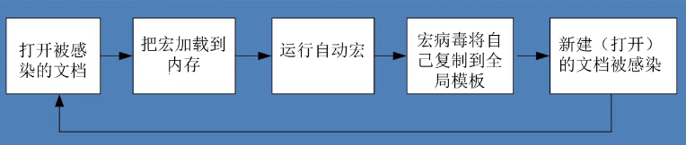**
   - 宏病毒攻击过程
     - 宏病毒会感染**DOC文档**文件和**DOT模板**文件。
     - 打开时激活，**通过Normal模板传播**。
     - 通过**AutoOpen,AutoClose,AutoNew和AutoExit**等自动宏**获得控制权**。
     - 病毒宏中必然含有对文档读写操作的宏指令
   - 宏病毒特点
     - 传播极快
     - 制作、变种方便
     - 破坏可能性极大
     - 多平台交叉感染
     - 地域性问题
   - 防范和消除宏病毒的方法
     - **首选方法**：用最新版的反病毒软件清除宏病毒；
     - **应急处理方法**：使用宏编辑器清除宏病毒。
   - 经典宏病毒-**美丽莎**Melissa，台湾NO.1B
8. **蠕虫病毒**的实例一一**熊猫烧香**
   - “熊猫烧香”病毒是一个能在Windows9X/NT/2000/XP/2003系统上运行的蠕虫病毒。
     病毒采用“熊猫烧香”头像作为图标，诱使计算机用户运行。它的变种会感染计算机上的.exe可执行文件，被病毒感染的文件图标均变为“熊猫烧香”。
     受感染的计算机还会出现蓝屏、频繁重启及系统硬盘中数据文件被破坏等现象。
   - 病毒作者李俊将这个病毒卖给了120个黑客，鼓励教导他们广撒网多抓鸡。李俊自己也购买了服务器，专门用作病毒更新，创下了天更新8次的病毒升级记录，可以堪称史上最勤奋的病毒作者。
9. “磁碟机”病毒
   - “磁碟机”病毒又名Dummycom病毒（又名“千足虫”)，据360安全中心统计每日感染磁碟机病毒人数已逾100,000用户。“磁碟机”现已经出现100余个变种，目前病毒感染和传播范围正在呈现蔓延之势。病毒造成的危害及损失10倍于“熊猫烧香”。
   - **磁碟机病毒主要通过U盘和局域网ARP攻击传播**，如果当你无法访问各个安全软件站点，或者从安全站点的官网上下载的安装程序有问题的话，极有可能是已经中了磁碟机病毒“磁碟机”，病毒感染系统可热行文件，能够利用多种手段终止杀毒软件运行，并可导致被感染计算机系统出现蓝屏、死机等现象，严重危害被感染计算机的系统和数据安全。


## 计算机病毒的防治

1. 计算机病毒引起的异常现象
   - 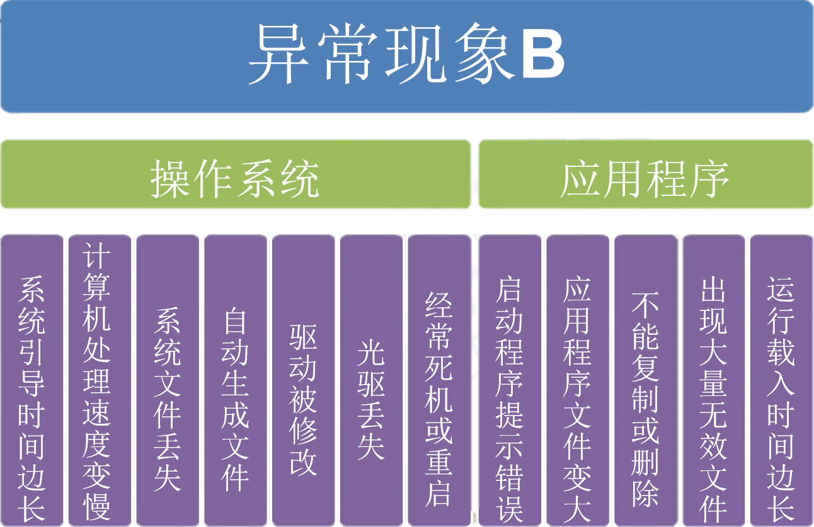
2. 计算机防病毒技术
   - **用杀毒软件对所下载的文件进行检查**
   - **不要轻易打电子邮件附件**
   - **及早发现病毒**
   - **使用反病毒软件并及时更新病毒库**
   - **设置过滤机制**
   - **用补丁保持软件最新**
   - **禁用盘启动**
3. 常用的单机杀毒软件
   - 单机杀毒软件：奇虎360，卡巴斯基，瑞星，金山毒霸，江民杀毒，诺顿
4. **网络防病毒**方案（**不管客户端**）
   - 复杂的多层次病毒
   - 网关和防火墙
   - 工作站（终端）
   - 邮件服务器
   - 备份服务器
   - Internet服务器和文件服务器
5. 防病毒软件的选择标准
   - **扫描速度**
   - **识别率**
   - **病毒清除测试**

# 第4章数据加密技术

## 密码学的有关概念

1. 密码学的起源
   - 古代加密方法大约起源于公元前440年出现在古希腊战争中的隐写术。
   - 古希腊的斯巴达人曾将军事情报刻在普通的木板上，用石蜡填平，收信的一方只要用火烤热木板，融化石蜡后，就可以看到密信
   - 密码学用于通信的另一个记录是斯巴达人于公元前400年应用锥形指挥棒在军官间传递秘密信息。
   - 我国古代的藏头诗、藏尾诗、漏格诗
   - 密码学从军事走向生活:电子邮件，自动提款机(ATM)，网上银行/网上证券，信用卡购物(POS机)
2. 密码学的发展史
   - **第一阶段**：1949年以前**古典密码阶段**：代表：**棋盘密码**
     计算机技术出现以前
     密码学作为一种艺术而不是一门科学
   - **第二阶段**：1949年~1975年**近代密码（现代密码学初期）**
     标志：1949年Shannon发表的《保密系统的信息理论》一文。
     密码学进入了科学的轨道，密码学成为科学
     主要技术：单密钥的对称密钥加密算法
   - **第三阶段**：1976年~**现代密码学阶段**
     标志：1976年Diffie和Hellman发表了《密码学新方向》一文。
     新的密码体制：**公开密钥体制**
3. 密码学的发展史概述
   1. 第一阶段一古典密码
      - 古典密码的加密方法一般是**代换**与**置换**，使用手工或机械变换的方式实现；
      - 单表替代密码Caesar密
      - 多表替代密码：Playfair密码
      - 转轮密码：著名的Enigma密码，第二次世界大战中使用过。
      - 主要特点：**数据的安全基于算法的保密**
   2. 第二阶段现代密码学初期
      - 1949年，香农发表了《保密系统的信息理论》
      - **主要特点**：数据的安全基于密钥而不是算法的保密。
   3. 第三阶段：1976~公钥
      - 公钥密码学成为主要研究方向：
      - **主要特点**：公**钥密码使得发送端和接收端无密钥传输的保密通信成为可能**
      - 1977年，Rivest,Shamir和Adleman提出了**RSA公钥算法。DES算法出现**。
4. 密码学的新方向
   - 密码专用芯片集成
   - 量子密码技术
   - DNA密码技术
5. 密码学基本概念
   - **密码学**(cryptology)：研究**信息的保密**和**复原保密信息**以获取其真实内容的学科称为密码学
   - 包括
     - **密码编码学**(cryptography):研究对信息进行编码，**实现隐蔽信息**的一门学科。(**加密**)
     - **密码分析学**(cryptanalytics)):不知道任何加密细节的条件下**解密消息**的技术，即“破译”（**解密**）
6. 密码编码学
   - 密码编码学是密码学的一个分支，研究与信息安全（例如：机密性、完整性、可鉴别性）有关的数学技术
   - 密码编码学是包含数据变换的原理、工具和方法的一门学科，这种数据变换的目的是为了隐藏数据的信息内容，阻止对数据的篡改及防止未经认可使用数据。
   - 密码编码学是论述使明文变得不可懂的密文以及把已加密的消息变换成可懂形式的艺术和技巧。
7. 密码学基本概念
   1. **加密(Encryption)**：将**明文变换为密文**的过程。把可懂的语言变换成不可懂的语言，这里的语言指人类能懂的语言和机器能懂的语言。
   2. **解密(Decryption)**：加密的逆过程，即由**密文恢复出原明文**的过程。把不可懂的语言变换成可懂的语言。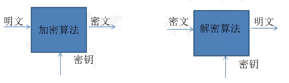
   3. 加密和解密算法的操作通常都是在一组密钥的控制下进行的，分别
      称为**加密密钥(Encryption Key)**和**解密密钥(Decryption Key)**。
      - **加密E，解密D，明文P,M，密钥K，密文C**
      - **加密：E$_K$(M)=C  解密：D$_K$(C)=M**
8. Kerckhoff原理
   - Kerckhoff假设：密码分析者知道双方使用的密码系统，包括明文的统计特性、加解密体制等，唯一不知道的是密钥。
   - Auguste Kerckhoff在1883年发表了一篇论文，认为一个密码系统中唯一应该保密的只有密钥。他认为，密码算法应该对外公开，如果一个密码系统需要保密的越多，可能的弱点也越多。
   - 这种观点对于密码研究者和私营部门来说已经是一种常识，但是军事部门和政府则不这么认为。世界上大部分的政府都研制自己的算法并且不对外公开。
   - 在设计一个密码系统时，目标是在Kerckhoffs假设的前提下实现安全
9. 密码体制分类
   - 替代密码         Vs.   换位密码
   - 对称密码算法  Vs.   非对称密码算法
   - 分组密码         Vs.   流密码
10. 密码体制分类
    - 按转换明文为密文的运算类型分类：
      - **替代密码**(Substitution Cipher)：就是明文中的每一个字符被替换成密文中的另一个字符。接收者对密文做反向替换就可以恢复出明文。
      - **置换密码**(Permutation Cipher)：又称**换位密码**(Transposition Cipher):明文的字母保持相同，但顺序被打乱了。
    - 按所用的密钥数分类：
      - **对称密码算法**(Symmetric cipher):加密密钥和解密密钥相同，或实质上等同，即从一个易于推出另一个。又称传统密码算法(Conventional cipher)、秘密密钥算法或**单密钥算法**,DES，3DES、IDEA、AES
      - **非对称密码算法**(Asymmetric cipher):加密密钥和解密密钥不同，从一个很难推出另一个。文叫公钥密码算法(Public--key cipher)。其中的加密密钥可以公开，称为公开密钥(public key)，简称**公钥**,解密密钥必须保密，称为私人密钥(private key),简称**私钥**。**RSA**
    - 按处理明文的方法分类：
      - 分组（块）密码：将明文分成固定长度的组，用同一密钥和算法对每一块加密，输出也是固定长度的密文：DES、IDEA、RC2、RC4、RC5:
      - 序列（流）密码：序列密码每次加密一位或一字节的明文：
        One-time padding.Vigenere,Vernam:
11. 密码分析学
    - 攻击传统密码体制的一般方法：
      - **穷举攻击**：对一条密文**尝试所有可能的密钥**。平均而言，成功至少需要尝试所有可能密钥的一半。
      - **密码分析**：利用**算法**的性质和**明文的特征**或某些明密文对，**密码分析学**是在不知道密钥的情况下，恢复出明文的科学；
      - 成功的密码分析能恢复出消息的明文或密钥；
    - (1)密码分析学是密码学的一个分支，它与另个分支学科一一密码编码学是两个相互对立、相互依存、相辅相成、相互促进的学科
    - (2)密码分析学是企图挫败编码技术以及更一般说来的信息安全服务的数学技术学科。
    - (3)密码分析学是对密码体制、密码体制的输入输出关系进行分析，以便推出机密变量、包括明文在内的敏感数据。有时又称作密码破译学code breaking
    - 密码分析攻击的典型方式
      - **唯密文攻击**：攻击者**己知加密算法**，**己知待破解的密文**
      - **已知明文攻击**：攻击者**己知加密算法**，**己知待破解的密文**，**已知**
        **条或者多条明文-密文对**；
      -  **选择明文攻击**：攻击者**已知加密算法**，**己知待破解的密文**，**能够**
        **获得通过加密算法生成自选的明文-密文对**：
    - **攻击强度**：**唯密文攻击 < 已知明文攻击 < 选择明文攻击**
      - **自适应选择明文攻击**
      - **选择密文攻击**
12. 两个概念
    - 绝对安全，unconditional security
      - 无论花多少时间，攻击者都无法将密文解密
      - 原因：攻击者所需要的信息不在密文里
      - 除一次一密外，所有的加密算法都不是绝对安全的
    - 计算安全，computational security
      - 破译密码的代价超过密文信息的价值
      - 破译密码的时间超出了密文信息的有效生命期

## 古典加密技术

### 古典密码

1. 古典密码技术

   - 替代法
     - 将明文字母替换成其他字母、数字或符号的方法；
     - 如果把明文看成是0或1的序列，那么密文就是0或1比特序列的另一种表达。
     - 包括：凯撒密码，单表替代密码，多表替代密码
   - 换位法

2. 凯撒密码(Caesar Cipher)

   - 由古罗马人Julius Caesar发明的一种密码体制，它是使用最早的密码体制之一；首先用在军事通信中；

   - 替代原理：

     - 用**字母后的第三个字母代替**
     - 字母表看作是循环的，即z后面的字母是a

   - 

   - 计算

     - 映射表中，明文字母中在字母表中的相应位置数为C,(如A=1,B=2,.)形式如下： 设K=3：对于明文P=computer systems则  

       密文C=Ek(P)=FRPSXRWHUVBVWHPV

     - **密文无空格，必须一行**，**密文(C),一律大写**

     - **密钥为k-1=2，k默认为3**

   - 凯撒密码的一般形式

     - 将英文字母表左环移k(0<k<26)位得到替换表，则得一般的Caesar算法。
     - **共有26种**可能的密码算法(**25种可用**)
     - 将每个字母分配一个数值，如a=0,b=1等，则算法可表示为：
       - **加密算法**：C=Ek(P)=**(P+k) mod26** (**明文+K和26取余**)
       - **解密算法**：P=Dk(C)=**(C-k) mod26** (**明文-K和26取余，负数+26**)
     
   - 凯撒密码的安全性分析

     - 凯撒密码的三个特征：
       - 加密和解密算法已知
       - 需尝试的密钥只有25个
       - 所破译的明文语言已知，其意义易于识别
       - 大多数情况下，密码算法是已知的，这三个特征**使穷举攻击很容易实现**
     - 抗攻击分析：
       - 使明文的语言未知：例如将明文压缩再进行加密
       - 加大密钥空间：如允许字母的任意替代

3. 仿射密码

   - 凯撒密码的加密公式是：c=E(x)=x+k
   - 在凯撒密码的基础上进行推广，得：
     - 加密：C=E(x)=(ax+b) mod 26
     - 解密：p=D(y)=a-1(y-b) mod 26
   - 称为仿射密码
   - 即凯撒密码是仿射密码在a=1情况下的特例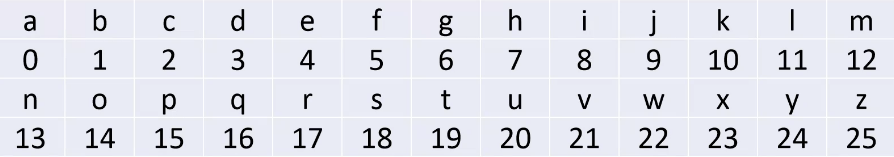
   - 已知C=(4M+7)mod26,其中M指的是明文，C表示密文。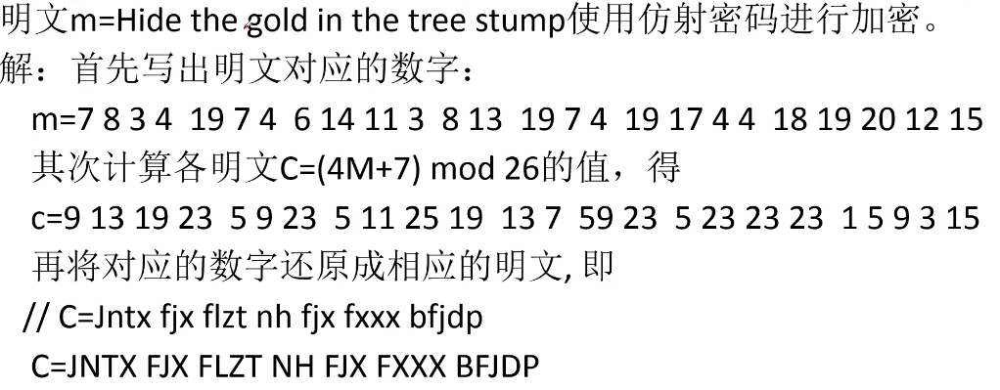
   - 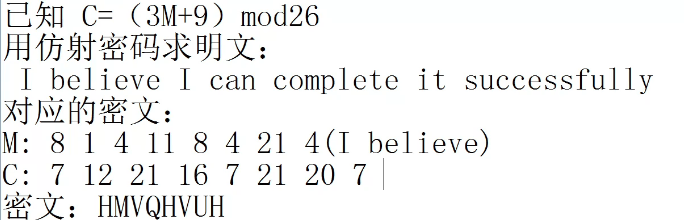
   - 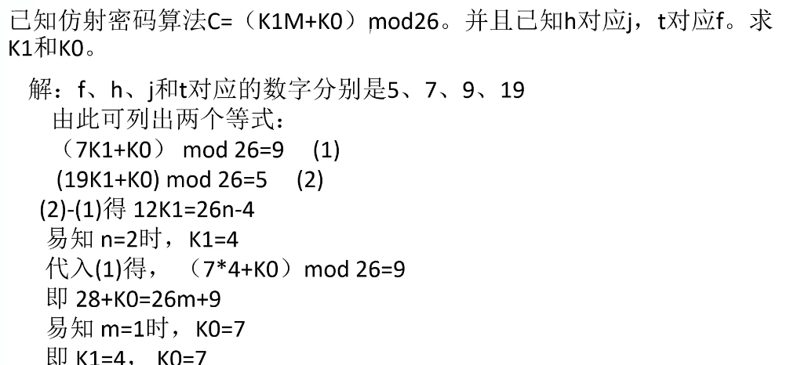

### 替代密码

1. 单表替代密码

   - 不是简单有序地字母移位
   - 每个明文字母映射到一个不同的随机密文字母
   - 密钥数目：26！
   - 包括：

     - 棋盘密码
     - 仿射密码
     - 移位代换密码：凯撒密码
     - 多项式代换密码
     - 乘数/采样密码
     - 密钥短语密码

2. playfair密码

   - 单表替代缺陷是：**密文带有原始字母使用频率的一些统计学特征**
   - 对策：每个字母提供多种代换。
   - 最著名的多表代换密码一Playfair密码：

     - Charles Wheatstone于1854年发明，用其朋友Baron Playfair命名
     - 把明文中的双字母音节作为一个单元并将其转换成密文的“双字母音节”
   - Playfair密钥矩阵

     - 密结果基于一个5*5的字母矩阵
     - 从左到右，从上到下：
       - 填写密钥单词
       - 用其他字母填写剩下的空缺
     - **I=J**
     - 假设密钥为：monarchy
     - 按照密钥去按顺序填，重复的不要，剩下的按26个字母顺序去填，I和J占一个
   - 加密算法步骤
     - 编制密码表
       - **密钥是一个单词或词组，若有重复字母，可将后面重复的字母去掉。当然也要把使用频率最少的字母去掉。如：密钥是Live and learn,去掉后则为liveandr。按行填写入5*5矩阵后，其余字母按照字母顺序填入其中。**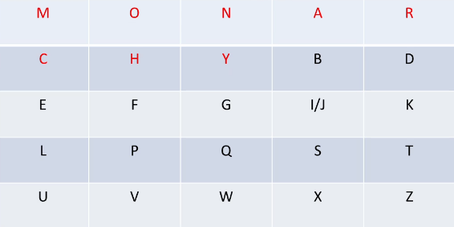
     - 整理明文
       - **将明文每两个字母组成一对。如果成对后有两个相同字母紧挨或最后一个字母是单个的，就插入一个字母X(或者Q)如，communist,应成为co,mx,mu,ni,st。**
       - 明文分组（填充）：**2个字母/组**：如有**相同字母输入X不删除相同的，最后缺补x**
     - 编写密文
       - **同行字母对加密**：**循环向右**（**其中第一列被看做是最后一列的右方**）
       - **同列字母对加密**：**循环向下**（**其中第一行被看做是最后一行的下方。**）
       - **其它字母对加密**：**矩形对角线字母**，**找自己同行和对角线同列的**（**行不变列变**）(至于横向替换还是纵向替换要事先约好，或自行尝试)

   - 假如Playfair)加密算法的当前使用的密钥为monarchy,要加密的内容为welcome to shenyang!you will change it.

     1. 第一步：编制密码表

     2. 第二步：**将明文每两个字母组成一对**。

        ```
        给welcome to shenyang!you will change it.分组，每两个字母一组
        welcome to shenyang!you will change it怎么分组？
        we lc om et os he ny an gy ou wi Ix Ic ha ng ei tx
        ```

     3. 第三步：

        - 明文分组（填充)：2个字母1组，相同字母拆开中间填X 
        - **同行字母对加密**：**循环向右**
        - **同列字母对加密**：**循环向下**
        - **其它字母对加密**：**矩形对角线字母**，**找自己同行和对角线同列的**
        - UGUENOKLAPCFYGRAQGMVXGSUUEBOYQFKSZ

   - playfair解密

     - playfair解密算法首先将密钥填写在一个5*5的矩阵中（去Q留Z),矩阵
       中其它未用到的字母按顺序填在矩阵剩余位置中，根据替换矩阵由
       文得到明文。
     - 对密文解密规则如下：
       - 同行字母对加密：循环向**左**（**逆操作**）
       - 同列字母对加密：循环向**上**（**逆操作**）
       - 其它字母对加密：矩形对角线字母，且按行排序（**相同）**

   - 假如Playfair加密算法的当前使用的密钥为monarchy,密文内容为UGUENOIU 求明文内容。

     - 第一步：根据密钥monarchy构建字母矩阵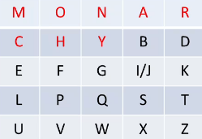
     - 第二步：密文分组UG UE NO IU
       - 同行字母对加密：循环向左（逆操作）
       - 同列字母对加密：循环向上（逆操作）
       - 其它字母对加密：矩形对角线字母，且按行排序（**相同）**

   - 安全性分析

     - 安全性优于简单的单表代换密码
       - 共有26x26个字母对，判断单个字母对困难
       - 字母对的相对频率的统计规律低于单个字母的频率
       - 利用频率分析字母对较困难
     - 虽然明文中字母的统计规律在密文中得到了降低
     - 但密文中仍含有明文的部分结构信息
     - 给定几百个字母，即可被攻破

3. 多表替代密码：Vigenere密码（维吉尼亚密码）

   - 学家Blaise de Vigenere于l858年提出的一种代换密码，它是**多表代换密码**的典型代表。
   - vigenre密码根据包含26张字符对应表的vigenre方阵来实现
     对字符串的加密。
   - 思考：明文：YES  密钥：NO
   - 规则
     - 选择一个词组作为密钥，密钥中每个字母用来确定一个代换表每个密钥字母用来加密一个明文字母。
     - 例如密钥字母为m,明文字母为k,则密文字母c为c=E(m,k)=**(m+k)mod26**。假设明文字母为‘a’（对应数字为0)，密钥是‘c’(对应数字是2)，则密文字符应该是(0+2)m0d26=2,也
       就是‘c
     - 直到所有的密钥字母用完，后再从头开始，使用第一个密钥字母加密。也就是说，密钥循环使用。
   - 加密
     - 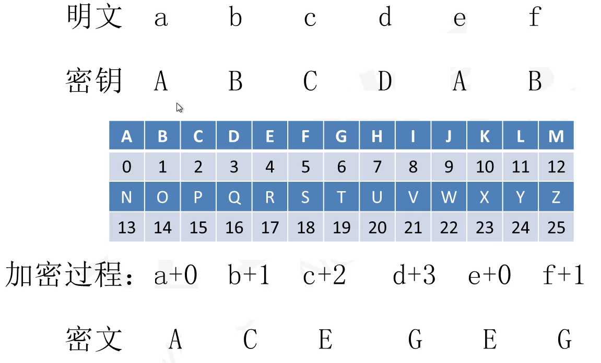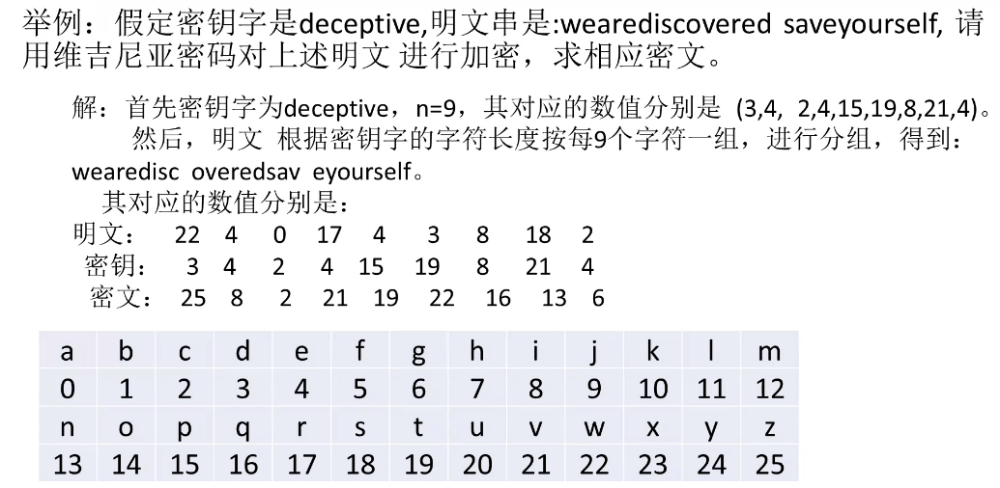
   - 解密：加密的逆向操作
   - 假如Vigenre.加密算法的当前使用的密钥为AEC,要加密内容为welcome to shenyang!,加密后，密文为？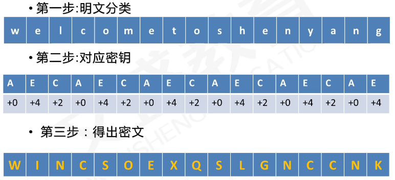
   - 假如Vigenre.加密算法的当前使用的密钥为OK,要解密内容为UYCN,解密后，明文为？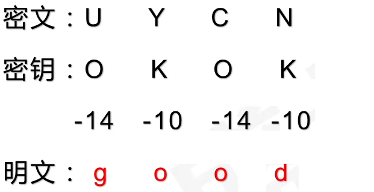
   - **注意明文小写，密文大写**
   
4. 轮转原理的密码机（转轮机）目标

   - 消除字母的统计规律以增加破译的难度
   - 向着“替代表”和“多重替代”方向发展。

5. 经典密码的机械阶段一一转轮机
   20世纪20年代，随着机械和机电技术的成熟，以及电报和无线电需求的出现，引起了密码设备方面的一场革命一一发明了转轮密码机（简称转轮机，Rotor)。转轮机由一个键盘和一系列转轮组成，每个转轮是26个字母的任意组合。转轮被齿轮连接起来，当一个转轮转动时，可以将一个字母转换成另一个字母。照此传递下去，当最后一个转轮处理完毕时，就可以得到加密后的字母。为了使转轮密码更安全，人们还把几种转轮和移动齿轮结合起来，所有转轮以不同的速度转动，并且通过调整转轮上字母的位置和速度为破译设置更大的障碍。

6. 恩格玛(Enigma)密码

   - 第二次世界大战，波兰人和英国人成功破译了德国著名的的“恩格玛密码，因此，盟军提前得知了德国的许多重大军事行动。
   - 恩格玛密码机的工作原理
     - 采用转轮机原理
     - 三级替代，将第一个旋转轮的输入开关连接到另一个旋转轮。第二个旋转轮提供第二个映射。第二个映射的输入又连接到每三个旋转轮

### 换位

1. 换位：

   - 对明文字母的某种置换，采用移位法进行加密
   - 明文中的字母重新排列，位置发生变化；

2. **栅栏技术**：按对角线的顺序写出明文，以行的顺序读出作为密文，易破译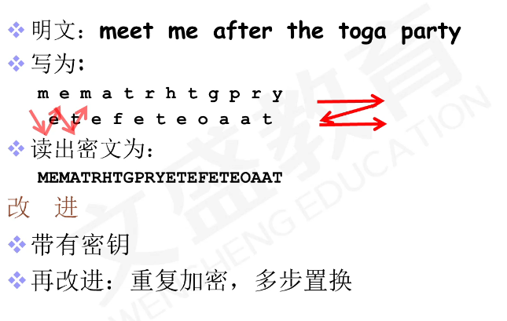

   ```
   1.根据换位密码原理，加密内容为welcome to shenyang!,加密后，密文为？
   明文：w I o e o h n a g
   	  e c m t s e y n
   密文：WLOEOHNAGECMTSEYN
   2.根据换位密码原理，密文内容为IMSUETAATDN,解密后明文为？
   解密过程：I M S U E T
   		 A A T D N
   明文：i a m a student
   I am a student
   ```

3. **矩阵排列法**：纯置预密码易识别 (列置换密码)

   1. 特性

      - 更加复杂的移位
      - 根据密钥确定矩阵列数
      - 根据明文确定矩阵行数
      - 将明文按行写入矩阵
      - **密文按照密钥指定顺序**，**以列读取。**

   2. 矩阵构建原则：

      - 以**密钥个数为列**，以**明文个数确定行数**
        矩阵空白处**需补全**，**最后一个单元格的内容为字母为Z**。

   3. 例题

      - 1.根据矩阵排列法，加密内容为attackpostponeduntiltwoam,密钥为4312567，加密后，密文为？

        - 第一步：根据密钥个数确定矩阵列数为7  密钥为4312567
        - 第二步：根据明文长度确定矩阵行数，attackpostponeduntiltwoam共25个字符，能被7的倍数包括的最小值为**4**.
        - 第三步：明文以行为单位，填入矩阵中。
          attackpostponeduntiltwoam
        - 第四步：剩余空间人工填充，最后一个字符为z。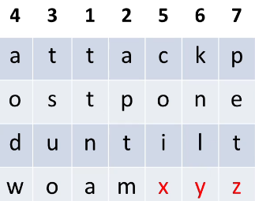
        - 密文：TTNAAPTMTSUOAODWCOIXKNLYPETZ

      - 根据矩阵排列法，密文为OXNEAESTRLTSYEED
        ELUZUCTN,密钥为garden,解密后，明文为？

        - 第一步：确定密钥顺序，并确定矩阵列数6

        - g a r d e n

          4 1 6 2 3 5

        - 第二步：根据密文确定矩阵行数4

        - 第三步：根据密文内容以列为单位，填入矩阵。

        - 第四步：根据明文规则以行为单位，读出明文。

        - 明文：youareexcellentstudentsz

        - **注：最后一个z不能删除。**
        
      - 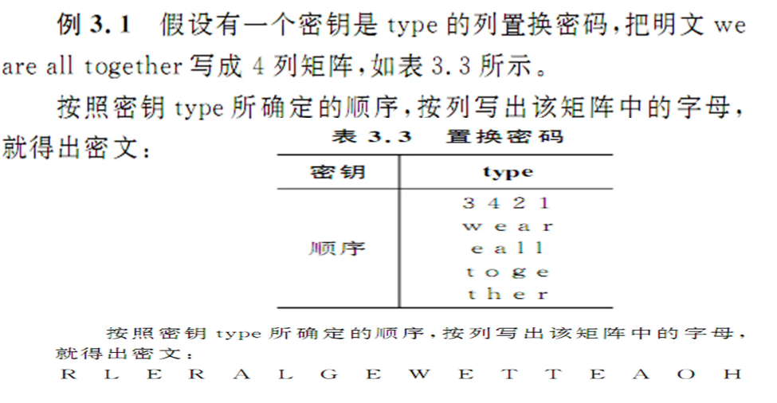

4. 周期置换密码

   - 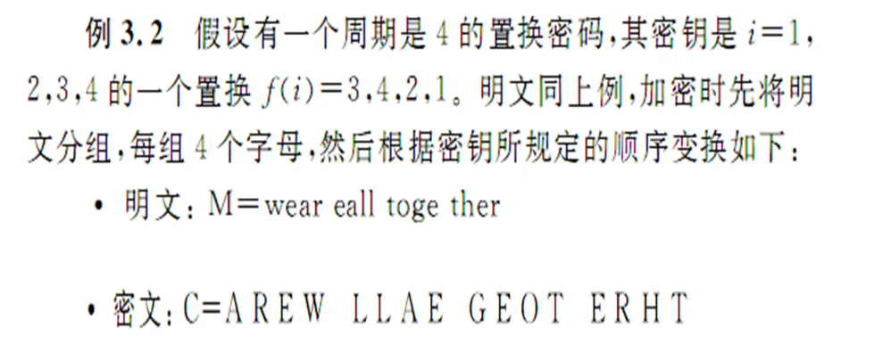

4. **多次置换**：多阶段加密，安全性更高

## 对称加密算法及其应用

1. 分类
   - **数据加密标准(DES)**
   - 国际数据加密算法(IDEA)
   - 高级数据加密标准(AES)
   
1. 加密算法要达到的目的有四点
   
   - 提供高质量的数据保护，防止数据未经授权的泄露和未被察觉的修改；
   - 具有相当高的复杂性，使得破译的开销超过可能获得的利益，同时又要便于理解和掌握；
   - DES密码体制的安全性应该不依赖于算法的保密，其安全性仅以加密密钥的保密为基础；
   - 实现经济，运行有效，并且适用于多种完全不同的应用。
   
2. DES特点
   - 设计目标：用于加密保护静态储存和传输信道中的数据，安全使用10-15年
   - 综合应用了置换、代替等
   - 分组密码：
     - **分组长度为64位，密钥56位**
     - **采用对称结构**
   - **面向二进制**的密码算法
   - 加密解密**共用一个算法** 
   - **是一种用56位密钥来加密64位数据的方法。**
   
2. DES算法将输入的明文分成(64位)的数据组块进行加密，密钥长(64位)，有效密钥
   长度为(54位)，其他(8位)用于奇偶校验。
   
2. DES算法的入口参数有三个：Key、Data、Mode。其中Key为8个字节共64位，是DES算法的工作密钥；Data也为8个字节64位，是要被加密或被解密的数据；Mode为DEs的工作方式有两种：加密或解密。DES算法是这样工作的：如Mode为加密，则用Key去把数据Data进行加密，生成Data的密码形式，(64位)作为DES的输出结果；如Mode为解密，则用Key去把密码形式的数据Data解密，还原为Data的明码形式(64位)作为DES的输出结果。
   
3. DES算法加密步骤
   1. 加密信息
   2. IP置换
   3. 密钥置换
   4. E扩展置换
   
3. 
   
4. E扩展置换
   - E扩展置换目标是IP置换后获得的右半部分R0,将32位输入扩展为48位（分为4位×8组)输出。
   - 扩展置换目的有两个：生成与密钥相同长度的数据以进行异或运算；提供更长的结果，在后续的替代运算中可以进行压缩。
   - 输入数据(10811001)H 输出48位数据(8A14028A0002)H
     - 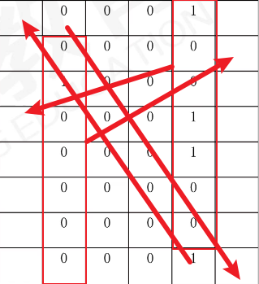
     - **左下填右上，右上填左下，剩余填对角重新在读数**
   
6. S盒代替

   - 压缩后的密钥与扩展分组异或以后得到48位的数据，将这个数据送人S盒，进行替代运算。替代由8个不同的S盒完成，**每个S盒有6位输入4位输出**。48位输入分为8个6位的分组，一个分组对应一个S盒，对应的S盒对各组进行代替操作。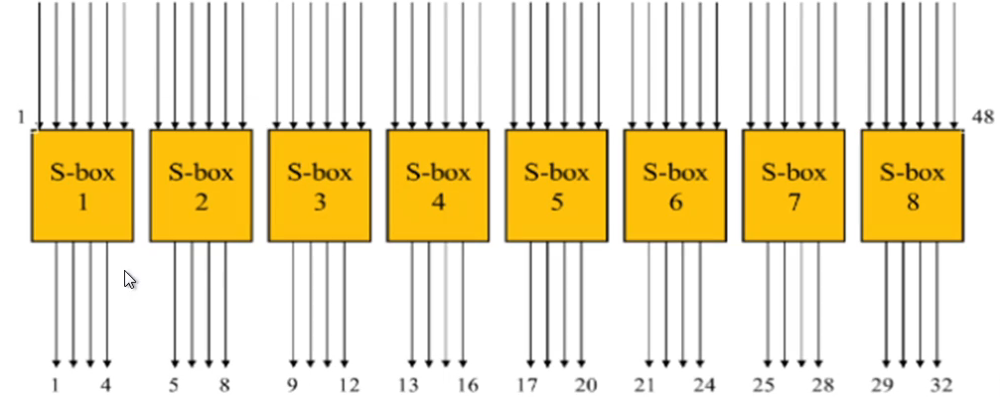

   - 一个S盒就是一个**4行16列**的表，盒中的每一项都是一个4位的数：S盒的6个输入确定了其对应的输出在哪一行哪一列，输入的高低两位做为行数H,中间四位做为列数L,在S-BOX中查找第H行L列对应的数据(**<32**)

     

   - 例如，假设S盒1的输入为110011，**第1位和第6位组合为11**，**对应于S盒1的第3行(实际第四行)**；**第2位到第5位为1001**，**对应于S盒1的第9列(实际第十列)**，S盒1的第3行第9列的数字为11，因此用1011来代替110011。**(两边对应行，中间对应列**)

   - 注意，S盒的**行列计数**都是**从0开始**。

   - 代替过程产生8个4位的分组，组合在一起形成32位数据。

   - S盒代替时DES算法的关键步骤，所有的其他的运算都是线性的易于分析，而S盒是非线性的，相比于其他步骤，提供了更好安全性。

7. P盒置换(考试不考)

   - 表中的数字代表原数据中此位置的数据在新数据中的位置，即原数据块的第16位放到新数据的第1位，第7位放到第2位，...依此类推，第25位放到第32位。例如(10A10001)H进行P盒置换后变为(80000886)H。最后，P盒置换的结果与最初的64位分组左半部分L0异或，然后左、右半部分交换，接着继续开始下一轮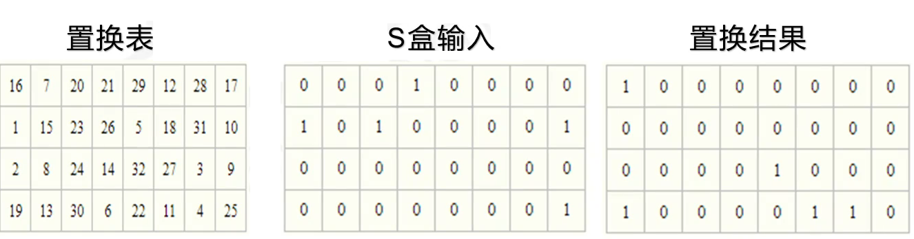

8. DES的安全性分析

   - 密钥长度=56化特
   - 强力攻击=尝试2^55^次
   - 差分密码分析=尝试2^47^次
   - 线性密码分析=尝试2^43^次
   - (但是后两种攻击是不实用的)

9. DES改造思路

   - 算法基本函数不能改变
     否则将不能利用现有的软硬件部署
   - 密钥空间得加大
     密钥过短正是目前DES的主要弱点，加大密钥空间以抵抗穷举攻击
     递进思路：
   - 用2个key,加密2回（用了多少密钥：56*2）
   - 用3个key,加密3回（用了多少密钥：56*3）


## 公开密钥算法及其应用

1. 对称密钥密码系统的缺陷：
   密钥必须经过安全的信道分配，密钥管理复杂无法用于数字签名
   
2. **非对称密钥密码**，也称**公开密钥密码**，由Diffie,Hellman1976年提出；

3. 使用两个密钥，**对于密钥分配、数字签名、认证**等有深远影响；

4. 和DES等对称算法不同，公钥体制的形式和结构导致公钥算法必须使用某种数学结构，而不能再使用替代和置换等初等方法。从形式上看，公钥算法将比对称算法更简洁和易于理解

5. 公钥密码用于加密

   - 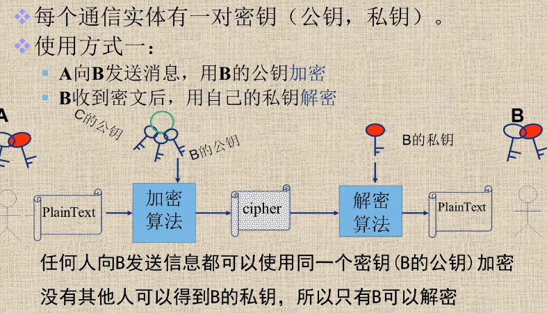

5. 常见公钥密码算法及应用
   - 三种用途
     - **加密/解密**：发送方用对方公钥加密，接收方用自己的私钥解密
     - **数字签名**：发送方用自己的**私钥**签署报文，接收方用对方的公钥验证对方的签名
     - **密钥交换**：双方协商会话密钥
   
6. RSA密码体制
   - 1978年，MIT三位年青数学家R.L.Rivest,A.Shamir和L.Adleman用数论构造双钥密码的方法，称作MT体制，后被广泛称为RSA体制；
   - 它既可用于加密、又可用于数字签名：
   - RSA算法的**安全性**基于**数论**中**大整数分解的困难性(大数分解成两个质数)**；
   
7. 参数选择
   1. 取两个大质数 p,q,保密；
   
   2. 计算n=pq,**公开n**;
   
   3. 计算欧拉函数**Φ(n)=(p-1)(q-1)**
   
   4. 任意取一个与Φ(n)互质的小整数e,即1<e<Φ(n)，**e作为公钥公开**
   
      **Φ(n)和e公因子只有1**
   
   5. **寻找d**，使得 **d * e mod Φ(n)=1**，**e*d=kΦ(n)+1**，**d作为私钥保密**
   
   6. **加密：C=M^e^%n**， **解密：M=C^d^%n** 
   
   7. 最终：**公钥(e,n)**，**私钥(d,n),**销毁p和q
   
8. RSA加密的具体方法
   1. 选择两个质数p,q。
      p=3,q=11
   2. n=p * q ，n=3 * 11=33
   3. **Φn=(p-1) * (q-1)**，Φn=2 * 10=20
   4. 求e的值（加密要用到的密码）1<e<Φn且e与n要互质
      e=2,4,5,7....     e=7
   5. 求d的值（解密要用到的密码）且
      **(d * e)%Φn=1  或   d=(Φn * k+1)/e**
      (d * 7)%20=1    =>   7*d%20=1   =>  7d=21   =>   d=3
   6. 加密过程
      - 消息M一>密文C。
      - **C=M^e^%n**
      - 假设M=2    C=2^7^%33=128%33=29          3..29
   7. 解密过程
      - 密文C一>消息M
      - M=C^d^%n
      - C=29       M=29^3^%33=24389%33=2        739..2
   8. 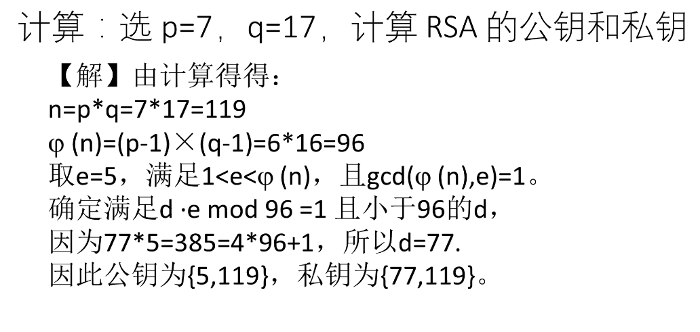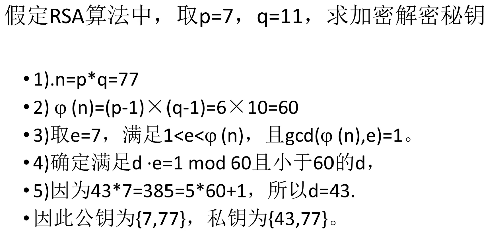
   
9. 公钥密码体制的优缺点
   - 优点：
     - 解决密钥传递的问题
     - 大大减少密钥持有量
     - 提供了对称密码技术无法或很难提供的服务（数字签名)
   - 缺点：
     - 计算复杂、耗用资源大
     - 非对称会导致得到的密文变长
   
10. RSA是典型的公钥密码体制，现截获某用户使用公钥加密并发送的密文为9，公钥e为13，p=17,q=5,试求出私钥d和用户发送的明文。
    1. N=5 * 17=85
    2. Φn=4*16=64
    3. d=(k * Φn+1)/e=(1*64+1)/13=5（一般k不超过3）
    4. M=C^d^%n=9^5^%85
    5. M=59
    
11. RSA算法的性能及安全性
    - 运算速度：软件实现比DES慢100倍，**硬件实现比DES慢1000倍**
      ■蛮力攻击：对所有密钥都进行尝试
      ■数学攻击：等效于对两个素数乘积(n)的因式分解
    - 对RSA算法的数学攻击实际上等效于对n的乘积分解
      由于M=C^d^ mod n,n公开，则需要求出d
      又由于de≡1 modΦ(n),e己知
      需要求出Φ(n)
      由于Φ(n)=(p-1)(q-1),所以必须求出p,q
      n=p*q,所以必须对n进行分解
    
13. 澄清误解

    - 公钥算法更安全
      不能简单比较
    - 传统对称算法已经过时
      事实上，现在使用的是混合密码体制
    - 公钥体制避免了传统密钥分配中心带来的麻烦
      事实上，证书体制有其优点但绝非简单
    - 公钥算法就是RSA
      RSA只是当前最重要的公钥算法

14. 公钥密码体制的优缺点
    优点：
    解决密钥传递的问题
    大大诚少密钥持有量
    提供了对称密码技术无法或很难提供的服务（数字签名)
    缺点：
    计算复杂、耗用资源大
    非对称会导致得到的密文变长

## 数据加密技术的应用

1. 信息鉴别与信息加密技术

   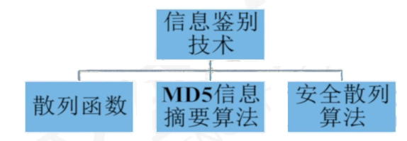

2. 数字签名技术

   1. 数字签名特点

      - **签名是可信的**
      - **签名是不可伪造的**
      - **签名是不可重用的**
      - **签名的文件是不可改变的；**
      - **签名是不可否认的**

      常用的数字函数：

      - 直接数字签名
      - 仲裁数字签名

   2. 数字签名

      - 数字签名用于**防止通信对方的欺骗或抵赖**(否认)
      - **消息认证用于防止第三方攻击**
      - 数字签名：一种基于机密技术的认证技术,用**于确认发送者身份**和**消息完整性**的一个加密的消息摘要。
      - 分类：
        直接数字签名
        需仲裁的数字签名
      - 数字签名应满足的基本条件
        签名者不能否认自己的签名：
        接收者能够验证签名，而其他任何人都不能伪造签名；
        当关于签名的真伪发生争执时，存在一个仲裁机构或第三方能够解决争执。

3. 数字签名在接收方具体步骤
   发送方
   (1)A把发送给B的消息作为散列函数的输入，生成消息摘要：
   (2)A用自己的私钥加密消息摘要，生成数字签名：
   (3)A将消息与数字签名一起发送到B0
   接收方：
   (④)B接收到后，将消息和数字签名进行拆分：
   ⑤）B用A的公钥对数字签名进行解密，得到消息摘要
   (OB将收到的消息作为A的散列函数的输入，产生消息摘要
   (⑦)B比较两个消息摘要，若相同，验证成功

3. 身份认证

   - 攻击方式
     - 数据流窃听；
     - 拷贝或重传；
     - 修改或伪造；
   - 了解系统账户：
     - 建立使用者列表；
     - 制定管理制度；
     - 检查新账号；
     - 寻找弱口令或无口令账号：
     - 及时删除不需要的账号。

4. SSL协议和SET协议

   - **SSL**(Secure socket Layer)**安全套接协议**，指使用公钥和私钥技术组合的安全网络通讯协议。
   - **SET**(Secure Electronic Transaction)**安全电子交易协议**，为了实现更加完善的电子交易，MasterCard和Visa联合其他一些业界主流厂商联合推出了一种规范，用来保证在公共网络上银行卡支付交易的安全性，从而发布了SET协议。
   
6. 数字水印

7. 公钥基础设施PKI

   - PKl技术(Public Key Infrastructure,公钥基础设施)，PKI技术采用证书
     管理公钥，通过第三方的可信任机构认证中心CA(Certificate Authority)
     把用户的公钥和用户的其他标识信息（如名称、e-mail、身份证号等
     捆绑在一起，在Internet网上验证用户的身份。目前，通用的办法是
     采用基于PKI结构结合数字证书，通过把要传输的数字信息进行加密，
     保证信息传输的保密性、完整性，签名保证身份的真实性和抗抵赖。

   - 组成

     

   - 

8. 公钥证书

   - 

9. 密钥管理

   - 

10. 

# 第5章防火墙技术

## 防火墙概述

1. 防火墙Firewall
   - **在安全需求不同的网络区域之间，通过即定原则对网络通信强制实施访问控制的安全设备。**
   - 简而言之，防火墙是位于两个（或多个）网络间，实施访问控制策略的一个或一组组件集合。
2. 防火墙基本知识
   - 防火墙(Fire Wall)是一种形象的说法，其实它是一种计算机硬件和欧件的组合，在外部网与内部网之间建立起一个安全网关Security Gateway),从而保护内部网免(受非法用户的侵入。简单地说，它其实就是一个把互联网与内部网（通常是局域网或城域网)隔开的屏障。
3. 防火墙定义
   - **防火墙是位于两个（或多个）网络间**，实施网间访问控制的一组组件的集合，它满足以下条件：
     - 防火墙是不同网络或者安全域之间信息流的**唯一通道**，**所有双向数据流必须经过防火墙**。
     - 只有经过授权的合法数据，即**防火墙安全策略允许的数据才可以通过防火墙**
     - 防火墙系统应该**具有很高的抗攻击能力**，其自身可以不受各种攻击的影响。
4. 为什么需要防火墙
   - 所有软件都是有错的；
     通常情况下99.99%无错的程序很少会出问题；
   - 同安全相关的99.99%无错的程序可以确信会被人利用那0.01%的错误
   - 0.01%安全问题等于100%的失败
5. **防火墙的功能 (技术角度)**
   - **网络安全的屏障**
   - **可以强化网络安全策略**
   - **对网络存取和访问进行监控和审计**
   - **防止内部信息外泄**
6. 防火墙的功能 (使用角度)
   - **包过滤**：**防火墙最基本的功能**就是由数据包组成的逻辑连接进行过滤，即**包过滤**（**对网络数据包头进行过滤**，无法过滤内容）
     - 数据包过滤参数：**通信双方的IP地址、端口号等**
     - 包过滤技术：**从早期的静态包过滤机制发展到动态包过滤。**
   - **代理**：代理技术是与包过滤技术截然不同的另外一种访火墙技术（**门卫保安室**）
     - 代理技术服务：
       - **透明代理**：内部网络用户在访问外部网络时，本机配置无需改变，防火墙就像透明的一样。
       - **传统代理**：与透明代理相似，需要在客户端设置代理服务器。
   - **网络地址转换**：网络地址转换是防火墙的**标准功能之一**。保护内网IP
   - **虚拟专用网VPN**：虚拟专用网VPN,在网络中建立逻辑专用数据网络通
     道进行信息传输（安全传输）。
     - 传统防火墙不允许VPN通信通过。
     - 防火墙和VPN集成在一起，VPN作为防火墙的一种新的技术。
   - **用户身份认证**：防火墙要对发出网络访问连接请求的用户和用户请
     求的资源进行认证。
     - 防火墙一般支持多种身份认证方案。如用户名+口令、数字证书等。
   - **记录，报警，分析与审计**：防火墙对于所有通过它的通信量以及由此产生的其他信息要进行记录，并提供日志管理和存储方法。
     - **自动报表、日志报告书写器**：防火墙实现报表自动化输出和日志报告功能
     - **简要列表**：防火墙按要求进行报表分类打印的功能。
     - **自动日志扫描**：防火墙的日志自动分析和扫描功能。
     - **图表统计**：防火墙进行日志分析后以图形方式输入统计结果
     - 报警机制：是在发生违反安全策略的事件后，防火墙向管理发出提供通知。
     - 分析与审计机制：用于监控通信行为，分析日志情况，进行查出安全漏洞和错误配置。
   - **管理功能**
     - 根据网络安全策略编制过滤规则。
     - 配置防火墙运行参数
     - 实现防火墙日志的自动化管理
     - 防火墙的性能管理
   - **其他特殊功能**
     - **病毒扫描**(**个别**防火墙嵌入此功能)
     - **信息过滤**：过滤URL、HTTP等
     - **用户特定权限**：使用时间、邮件发送权限、文件传输权限等。
7. **防火墙的局限性**
   - **不能防范不经过防火墙的攻击**
   - **不能解决来自内部网络的攻击和安全问题。**
   - **不能防止策略配置不当或错误配置引起的安全威胁。**
   - 不能防止可接触的人为或自然的破坏
   - **不能防止利用标准网络协议中的缺陷进行的攻击**
   - **不能防止利用服务器系统漏洞所进行的攻击**
   - **不能防止受病毒感染的文件的传输**
   - 不能防止数据驱动式的攻击
   - **不能防止内部的泄密行为**
   - **不能防止本身的安全漏洞的威肋**
8. 相关知识与术语
   - **吞吐量**
     - 定义：**在不丢包的情况下能够达到的最大速率**。
     - 衡量标准：吞吐量作为衡量防火墙性能的重要指标。
     - **百分比越大，速率越大证明设备的性能越高。**
     - 参数单位：线速百分比或流量速率
   - 并发连接数
     - 定义：指在同一时间点上，防火墙所能维护的最大网络连接数。
     - 衡量标准：防火墙建立和维持网络连接的性能，**并发连接数越大的防火墙适应大流量的网络的能力就越强。**
   - 包过滤
     - 根据预调置的包过滤规则，对穿越自身的网络数据包采取允许通
       过或禁止丢弃的功能。
     - 规则的检查项目以**源地址、耳的地址、源端口、且的端口、协这**这五项被称之为**五元组**的要素组成，有时还会附加源、目的MAC、时间、进出接口等要素。
   - 透明模式
     - 透明模式部署是一种**修改网络拓扑**比较小的部署方式，这种部署方式**，不需要对原有网络设备进行配置上的变更**，就可以新增部署防火墙。能够适应这种部署方式的防火墙配置方法称之为透明模式。
   - 动态服务
     - 特指TCP应用中，在客户端通过一个**固定端口**登录服务器端，并与服务器协商出一个新的**随机通讯端口**，随后**使用通迅端口传输后续数据**。

## 防火墙分类

1. 按防火墙采用的主要技术划分
   - **包过滤型防火墙**(**传输层**)
   - **代理型防火墙**(**应用层**)
2. 按防火墙的具体实现划分
   - 多重宿主主机
     - 多重宿主主机是放在网例与外网接口上的一堡垒主它**最少有两个网络接口**一个与内网相连，另外一个与外网相连。内、外网之间禁止直接通信，需通过多重宿主主机上应用层数据共享或者应用层代理服务来完成。
   - 筛选路由器
     - **筛选路由器**又称为**包过滤路由器**、**网络层防火墙**、**IP过滤器**或**筛选过滤器 **，通常是用一台放置在内部网络和外部网络之间的路由器来实现。它对进出内部网络的所有信息进行分析，并按照一定的信息过滤规则对进出内部网络的信息进行限制，允许授权信息通过，拒绝非授权信息通过
   - 屏蔽主机
     - 这种防火墙由内部网络和外部网络之间的一台过滤路由器和一台堡垒主机构成。它强迫所有外部主机与**堡垒主机**相连接，而不让它们与内部主机直接相连。为了达到这个目的，过滤路由器将所有的外部到内部的连接都路由到了堡垒主机上，让外部网络对内部网络的访问通过堡垒主机上提供的相应代理服务器进行。（中转）
   - 屏蔽子网
     - **屏蔽子网**与**屏蔽主机**在本质上是一样的，它对网络的安全保护通过两台包过滤路由器和在这两台路由器之间构筑的子网，即**非军事区DMZ**实现。
       在非军事区里放置堡垒主机，还可能有**公用信息服务器**。(**完成信息交换**)
3. 按防火墙部署的位置划分
   - 单接入点的传统防火墙：防火墙最普通的表现形式。位于**内部网络与外部网络相交的边界**，独立于其它网络设备，实施网络隔离。
   - 混合式防火墙：混合式防火墙依赖于地址策略将安全策略分发给各个站点，由各个站点实施这些规则。它通过装载到网络操作中心上的多**域服务器来控制多个防火墙用户模块**。多域服务器有多个用户管理加载模块，每个模块都有一个虚拟IP地址，对应着若干防火墙用户模块。安全策略通过多域服务器上的用户管理加载模块下发到各个防火墙用户模块。防火墙用户模块执行安全规
     则，并将数据存放到对应的用户管理加载模块的目录下。
   - 分布式防火墙：利用网络将不同地点的主机，统一执行指定的安全策略，并收集所在主机的通信情况记录和安全信息
4. 按防火墙的形式划分
   - 软件防火墙：软件防火墙产品形式是软件代码，它不依靠具体的硬件设备，而纯粹依靠软件来监控网络信息。软件防火墙固然有安装、维护简单的优点，但对于安装平台的性能要求较高。
   - 独立硬件防火墙：硬件防火墙则需要专用的硬件设备，它们都为数据包的检测进行了专门的优化。从外观上看，独立硬件防火墙与集线器、交换机或者路由器类似，只是只有少数几个接口，分别用于连接内部网络和外部网络。
5. 按受保护的对象划分
   - 单机防火墙：单机防火墙的设计目的是为了保护单台主机网络访问操作的安全。单机防火墙一般是以装载到受保护主机的硬盘里的软件程序的形式存在的，也有做成网卡形式的单机防火墙存在，但是不是很多。受到载机性能所限，单机防火墙性能不会很高，无法与网络防火墙相比。
   - 网络防火墙：网络防火墙的设计目的是为了**保护相应网络的安全**。网络防火墙一般采用**软件与硬件相结合的形式**，也有**纯软件的防火墙存在**。网络防火墙处于受保护网络与外部网络相接的节点上，对于网络负载吞吐量、过滤速度、过滤强度等参数的要求比单机防火墙要高。目前大部分的防火墙产品都是网络防火墙。
6. 按防火墙的使用者划分
   - 企业级防火墙：企业级防火墙的设计目的是为企业联网提供安全访问控制服务。此外，根据企业的安全要求，企业级防火墙还会提供更多的安全功能。譬如，企业为了保证客户访问的效率，第一时间响应客户的请求，一般要求支持
     千兆线速转发；为了与企业伙伴之间安全地交换数据，要求**支持VPN;**为了维护企业利益，要对进出企业内部网络的数据进行深度过滤等等。可以说，防火墙产品功能的花样翻新与企业需求的多种多样是直接相关的，防火墙所有功能都会在企业的安全需求中找到。
   - 个人防火墙：个人防火墙主要用于个人使用计算机的安全防护，实际上与单机防火墙是一样的概念，只是看待问题的出发点不同而已。
7. 防火墙CPU架构
   - **X86架构**
   - **ASIC架构**
   - **NP架构**

## 防火墙实现技术原理

1. 包过滤防火墙
   - 包过滤防火墙的优点是：**可改动应用程序**个过滤路由器能协助保护整个网络、数据包过滤对**用户透明**；过滤路由器速度快,效率高(**网络层**)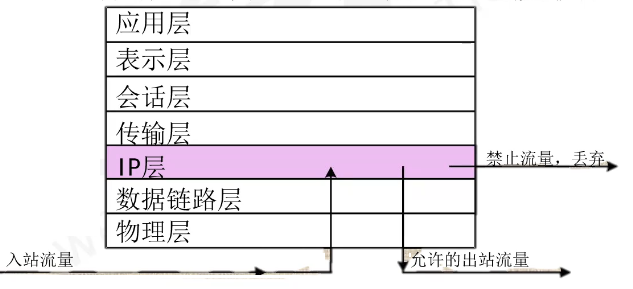
   - 包过滤防火墙的**优点**是：**可改动应用程序**；一个过滤路由器能**协助保护整个网络**、数据包过滤对用户透明；过滤路由器**速度快效率高**。**它不能彻底防止地址欺骗**；**一些应用协议不适合于数据包过滤**；**正常的数据包过滤路由器无法执行某些安全策略**：安全性较差；数据包工具存在很多局限性。
2. 代理防火墙（应用层，对数据软件进行管理）
   - 通常应用代理防火墙红作在OSI模型中的**应用层**，和我们常说的**代理服务器**原理相同，并且防火墙需要为每一种服务器创建一个进程，让外部网络看上去是在运行一个终端系统。并通过一系列进程映射，将对外会话和对内会话联系起来。而且，它还可用来保持一个所有应用程序使用的记录记录和控制所有进出流量的能力是应用层网关的主要优点之一，如图所示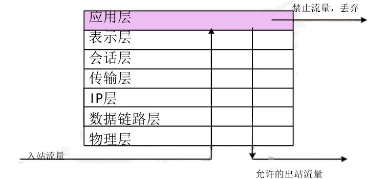
3. 状态检测防火墙
   - 状态检测防火墙通过对OS模型**顶部4层**的策略分析进行过滤，相当于以上各种防火墙的结合体。状态检测防火墙并**不破坏客户机/服务器模型**来**分析应用层数据**，它允许受信任的客户机和不受信任的主机进行直接通信。从理论上将，状态检测防火墙拥有更高的安全性。
4. 复合型防火墙（复合包过滤和代理）
   - 由于对更高安全性的要求，常把基于**包过滤**的方法与基于应用**代理**的方法结合起来形成复合型防火墙产品
   - 屏蔽主机防火墙体系结构
   - 屏蔽子网防火墙体系结构：形成非军事化区

## 防火墙的应用

1. CCProxy代理服务器的应用。

## 防火墙产品介绍

1. 防火墙的主要参数
   - 硬件参数
   - 并发连接数
   - 吞吐量
   - 安全过滤带宽
2. 选购防火墙的注意事项
   - 值得信赖
   - 易用性好
   - 支持VPN
   - 功能选择符合实际
   - 技术支持可靠
   - 关注无线网络安全
   - 可以提供网关服务
   - 内容过滤
   - 检测和报告
   - 故障转移
3. 小结
   - **防火墙**通常是指设置在**不同网络**（例如可信任的内部网络和不可信的外部网络)**或网络安全域**之间的一系列部件的组合。它是一种必不可少的安全增长点，是设置在被保护网络和外部网络之间的一道**屏障**，也是不同网络或网络安全域之间信息的**唯一出入口**，能根据网络安全**策略控制（允许、拒绝、监测)**出入网络的信息流，且本身具有**较强的抗攻击能力**。它是提供信息安全服务、实现网络和信息安全的**基础和核心控制设备**，能够有效地监控内部网和互联网之间的任何活动，防止发生不可预测的、潜在破坏性的侵入，从而保证内部网络的安全。
   - 防火墙的**功能**主要体现在：它是**网络安全的屏障、可以强化网络安全策略、对网络存取和访问进行监控审计以及防止内部信息的外泄4方面**。
   - 防火墙也有其**局限性**，它不是解决所有网络安全问题的万能药方，而只是网路安全策略中的一个组成部分。
   - 防火墙有**多种不同的分类方法**：根据采用的技术不同，可分为包过滤防火墙和代理服务器防火墙；按照应用对象的不同，可分为企业级防火墙与个人防火墙；依据实现的方法不同，又可分为软件防火墙、硬件防火墙。
   - **包过滤是防火墙**为系统提供安全保障的**主要技术**，它依据系统内设置的**访问控制表**，在网络层对进出网络的数据包进行有选择的控制与操作。包过滤操作一般都是在选择路由的同时，在网络层对数据包进行选择或过滤。
   - 包过滤防火墙**逻辑简单、价格便宜、易于安装和使用、网络性能和透明性好**，通常安装在路由器上，而路由器是内部网络与Internet连接必不可少的设备，因此在原有网络上增加这样的防火墙几乎不需要任何额外的费用。
   - **包过滤的缺点**是**安全性较差**，一些应用协议不适用包过滤防火墙、正常的数据包过滤路由器无法执行某些安全策略、不能彻底防止地址欺骗和数据包工具存在很多局限性等。
   - **代理服务器**是运行在防火墙主机上的一些特定的应用程序或者**服务程序**，它们代表客户在服务器端进行连接请求。当代理服务器收到一个客户的连接请求时，它将核实客户请求，并用特定的安全化的代理应用程序来处理连接请求，并将处理后的请求传递到真实的服务器上，然后接收服务器应答，并作进一步处理后，将答复交给发出请求的最终客户。代理服务器在外部网络向内部网络申请服务时发挥了**中间转接**和**隔离内、外部网络**的作用，所以又称为**代理防火墙**。

# 第6章Windows安全

## Windows Server概述

1. 内存管理
   - 观察内存使用状态
   - 防止内存不足
     - 增加虚拟内存
     - 安装更多RAM
2. 文件系统
   - FAT16—— DOS  最大2g
   - FAT32—— winxp 最大4g
   - NTFX——  win7   没有大小要求

## Windows Server的安全模型

1. 安全策略

   - **威胁和漏洞减少技术**
   - **安全配置评估与管理技术**
   - **身份认证和访问控制**

2. 高级安全防火墙

   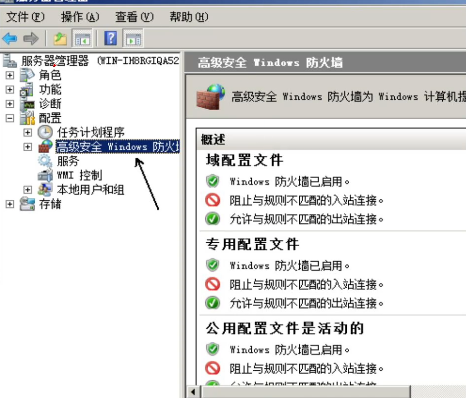

3. 网络访问控制策略

   - 管理员可通过【服务器管理器】中的【添加角色】向导，手工添加NPS服务，如图6.23所示。进而在DHCP服务中进行相应设置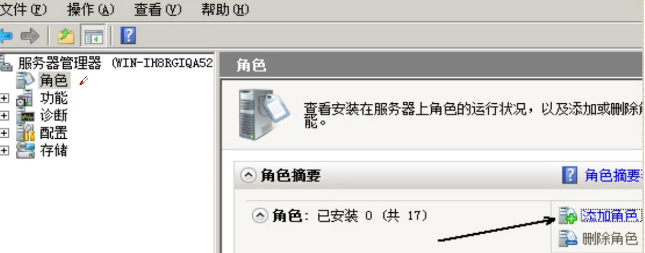

## Windows Server的账号管理

1. 空白账号控制
   - 在可信任的内网工作环境中，网络管理员为了能够提高控制效率，总喜欢使用空白密码的账户对内网中的重要计算机系统进行控制和管理操作。
   - 而Windows Server2008禁止使用空白密码对系统进行控制。
   - 必须对组策略参数进行合适设置，才能实现空白账号控制
2. 智能备份本地所有账户
   - 为了保护本地所有用户账号信息的安全，我们可以直接使用Windows Server2008系统自带的账号备份功能，来定期对本地系统中的所有用户账号信息执行智能备份操作。
3. 账户安全策略
   - 在【本地组策略编辑器】的【计算机配置】之【管理模板】正进行设置。
4. 即时监控账号创建状态
   - Internet网络中的一些病毒或木马，常常会暗地里在Windows Server2008系统中创建恶意账户，日后通过恶意账户就能对本地计算机系统实施非法攻击了
   - 我们可以利用Windows Server2008系统新增加的附加任务计划功能，第一时间知道Windows Server2008系统中有新的用户账号，并对用户账号的创建事件进行即时监控报警

## Windows Server的注册表

1. 注册表(Registry)是Microsoft Windows中的一个重要的**数据库**用于**存储系统**和**应用程序的设置信息**
2. Windows;注册表是帮助Windows操作系统**控制软件、硬件、用户环境**和**界面的数据**
   **息**，是Windows中的一个**重要的数据库**
3. 注册表的相关术语
   - hkey:主键或根键：
   - key:键；
   - subkey:子键；
   - branch:分支；
   - value entry:值项；
   - reg_sz:字符串；
   - reg_binary:二进制；
   - reg_dword:双字；
   - default:缺省字。
4. **注册表的基本信息**
   - **HKEY_CLASSER_ROOT**
     - 该分支主要包括**对各种文件和文档信息的访问数据**
     - **文件扩展名**
     - **文件**
     - **应用程序关联数据**
     - 此键信息保存在**system.dat**中。
   - **HKEY_USER**
     - 该分支主要包括了**所有用户有关的信息**
     - **桌面配置**
     - **网络连接**
     - **开始菜单**
     - 此键信息保存在user.dat中。
   - **HKEY_CURRENT_USER**
     - 该分支主要包括**当前用户信息**，它与HKEY_USERS列出的同样信息。任何在HKEY_CURRENT_USER里的改动也都会立即HKEY_USERS改动。相反也是这样
     - 桌面
     - 光标
     - 键盘
     - 鼠标等设置信息
   - **HKEY_LOCAL_MACHINE**
     - 该分支包括**计算机硬件以及软件**
     - 硬件信息
     - 软件信息
   - **HKEY_CURRENT_CONFIG**
     - 包括了系统中现有的**所有配置文件的细节**
     - **控制面板中的所有信息**
5. 注册表优化
   - 提高系统关机速度
   - 自动释放DLL占用的内存
6. 打开**本地组策略编辑器**的命令是**gpedit.msc**
7. **打开注册表**的命令**regedit**

## Windows Server常用系统进程和服务

1. 进程
   - **进程**是指在系统中**正在运行的个应用程序**
   - **线程是系统分配处理器时间资源的基本单元，或者说进程之内独立执行的一个单元**
   - 对于操作系统而言，其调度单元是线程
   - **一个进程至少**包括**一个线程**，通常该线程称为**主线程**
2. 常用系统进程
   - **csrss.exe:子系统服务器进程。**
   - dllhost.exe:用于管理DLL应用
   - dwm.exe:桌面窗口管理器跟桌面有关的。
   - **Explorer.exe:资源管理器。**
   - Isass.exe:本地安全权限服务。
   - Ism.exe:本地会话管理器服务
   - msdtc.exe:分布式传输协调程序
   - **services..exe:用于管理启动和停止服务。**
   - slsvc.exe:软件授权技术。
   - smss.exe:会话管理子系统。
   - spoolsv.exe:管理所有本地和网络打印队列及控制所有
   - **svchost.exe:从动态链接库(DLL)中运行的服务。**
   - taskeng.exe:任务计划程序引擎。

## Windows Server系统的安全模板

# 第七章Web安全性

## Web的安全性概述

1. Internet的脆弱性
   - **黑客入侵**：或窃取机密数据和盗用特权，或破坏重要数据，或使系统功能得不到充分发挥直至瘫痪
   - **TCP/IP通信协议**：TCP/IP通信协议缺乏使传输过程中的信息不被窃取的安全措施；
   - **Unix操作**：Unix操作中明显存在的安全脆弱性问题会直接影响安全服务；
   - **电子信息**：在计算机上存储、传输和处理电子信息，存在安全隐患；
   - **电子邮件**：存在着被拆、误投和伪造的可能性，使用电子邮件传输重要的机密信息存在着很大的危险。
   - **计算机病毒**：通过Internet传播，给用户带来极大的危害，也给安全防范带来困难。
2. Web的安全问题
   - 服务器向公众**提供了不应该提供的服务**，导致存在安全隐患。
   - 服务器把本**应私有的数据放到了公开访问的区域**，导致敏感信息泄露。
   - 服务器**信赖了**来自**不可信赖数据**源的数据，导致受到攻击

## Web服务器的安全性

1. Web服务器的作用
   - Web服务器也称为WWW(WORLD WIDE Web)服务器，Web服务器的主要作用是提供网上信息浏览服务。现在的服务器后台还包括数据库，用来更新前台的页面。Web可以提供将图形、音频、视频信息集合于一体的特性
2. **Web服务器存在的漏洞**
   - **物理路径泄露**：一股是由于WEB服务器处理用户请求出错导致（**精心设计的特殊请求或不存在文件的请求**)，触发CG引脚本，从而使Web服务器错误地输出Web服务器的物理路径。
   - **目录遍历**：对服务器中的文件夹进行**全部查看操作**。**利用“.”和“..”的漏洞**
     利用lIS二次解码漏洞和Unicode解码漏洞
   - **执行任意命令**：执行任意命令就是执行操作系统的命令，Web服务器把用户提交的请求SSl(Server SideInclude),通常按照服务器端嵌入指令来解析。
   - **缓冲区溢出**：通过超长请求进行适当的处理，使其中请求内容包括超长URL、Http Header域或其他超长内容，**最终导致服务执行任意命或拒绝服务**。
   - **拒绝服务**：由于接收超长URL、特殊目录、超长Http Header域、**畸形**HTTP Header等，由于Web服务器在处理这些请求**处理不当**，即可**产生错误终止或挂起**
   - **SQL注入**：**SQL注入漏洞**是**在编程过程中造成的**。**通过编写一些特殊的SQL语句** ，使其永真从而跳过必要的安全检查，**几乎所有关系数据库都有SQL注入的风险**
   - **条件竞争**：Web服务器没有对重点文件进行属性检查的功能，可能会导致重要系统文件被重写的风险，甚至获得系统控制权限。
   - **CGI漏洞**：CG引即脚本程序存在的漏洞，通过调用Web服务器中的CG引脚本，就能暴露敏感信息的风险。
3. IIS安全
   - lIS(Internet Information Server)即互联网信息服务，是由**微软公司**提供的基于运行Microsoft Windows的**互联网**基本服务。因其**方便性和易用性**，成为最受欢迎的Web服务器软件之一。
   - 但其从诞生起，其**安全性就一直备受置疑**，原因在于其经常被发现有新的安全漏洞。通过正确的安装和合理的设置，还是可以很好的保证IIS的安全性的
4. IIS的安装注意事项
   - 不要安装在系统分区上
   - 修改默认安装路径
   - 打上Windows和IS的补丁
5. IIS的安全配置
   - 删除不必要的虚拟目录
   - 删除危险的IIS组件
   - 为IIS文件设置权限
   - 删除不必要的应用程序映射
   - 保护系统日志

## 脚本语言的安全性

1. CGI程序的安全性

   - CGl(Commom Gate Interface)是外部应用程序与Web服务器交互的一个标准接口。CG应用程序可以完成客户端与服务器的交互操作。几乎所有的CGl漏洞均来自与用户的交互，这种交互性在给主页带来活力的同时，成为Web服务器的一个潜在危险。
   - 具有破坏性的数据可以从多种渠道进入Web服务器，客户端可以设计自己的数据录入方式，数据内容，然后调用服务器端的CGl程序
   - 用户在编写CGI程序时应该使其具有：数据长度检查功能和异常情况自动检测功能等。

2. ASP的安全性

   - ASP(Active Server Page)动态服务器网页，其实质是运行于服务器端的脚本(SCRIPT)以ASP为架构的网站，在浏览器上一般是以
     WWW..com/.ASP?id=的形式显示出来的
   - 黑客可以通过特殊的工具利用ASP存在的漏洞获得管理员的密码：还可以通过ASP网站架设的论坛实行攻击。

3. ASP访问Web数据库的工作原理如下

   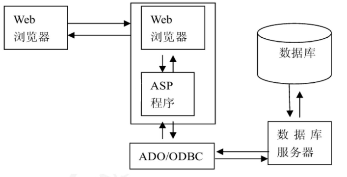

## Web浏览器的安全性

1. 浏览器本身的漏洞
   - 搜狗浏览器：“缓冲区溢出”漏洞；
   - IE7.0浏览器：“0day"漏洞；
   - 360浏览器：“缓冲区溢出”漏洞：
   - 火狐浏览器：被攻击者远程控制的漏洞
2. ActiveX的安全性
   - ActiveX:控件由**三大要素**组成：属性、方法、事件。
     - **属性**：描述控件的特征信息。
     - **方法**：是控件提供给外界的接口，ActiveX控件是通过开放函数名称及参数，为用户使用控件提供便利。
     - **事件**：是控件响应用户控制、执行相应方的触发条件，如鼠标单击、双击、悬浮等
3. ActiveX控件漏洞的检测与发现
   - 使月Fuzz测试工具
   - 人工分析方法
4. ActiveX控件漏洞的安全防范
   - 使用特征安全的ActiveX控件
   - 使用ActiveX控件前进行漏洞检测
   - 安装补丁文件
   - 浏览器中的安全设置
   - 屏蔽所有非主动安装的控件
   - 使用安全软件
5. Cookie的安全性
   - **Cookie**指某些网站**为了辨别用户身份、进行Session.跟踪而储存在用户本地终端上的数据（通常经过加密)**
   - Cookie是由服务器端生成，发送给浏览器，浏览器将会把Cookie的key/value保存到某个目录下的文本文件内，下次请求同一网站时就发送该Cookie?给服务器
   - 尽管Cookie没有病毒那么危险，但它仍包含了一些敏感信息：用户名，计算机名，使用的浏览器和曾经访问的网站

