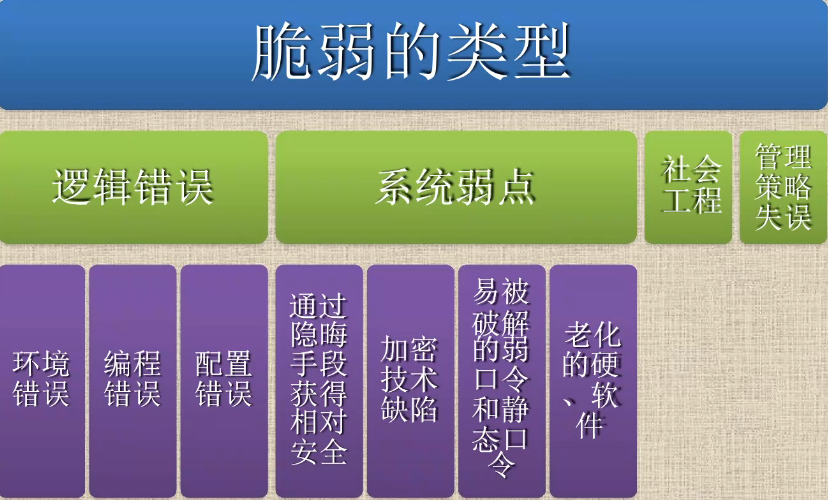
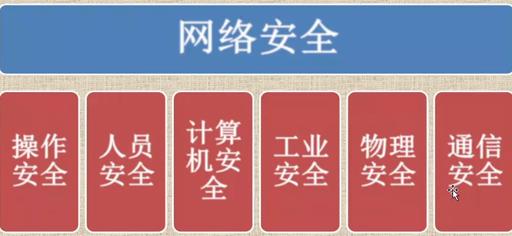
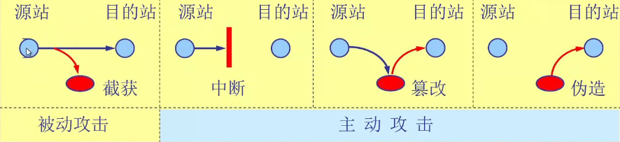

# 第1章计算机网络安全概述

## 1.网络安全简介

1. 当前网络存在的主要问题

   - 机房安全
   - 病毒的侵入和黑客的攻击

2. 网络脆弱性的原因

   - 造成计算机网络安全问题的原因归纳为两大类：外在的威胁和内在的脆弱性。其中后者是计算机网络安全问题的根本原因。从技术角度看，内在的脆弱性主要包括以下方面：对象，环境，对象所受到的影响，
   - 

3. 计算机网络安全的脆弱性

   - 操作系统的脆弱性
     - 操作系统结构体制本身的缺陷。
     - 在网络上传输文件，加载与安装程序，包括可执行的文件。
     - 在创建进程，甚至可以在网络的节点上进行远程的创建和激活
     - 操作系统中有一些守护进程，实际上是一些系统进程，它们总是在等待一些条件的出现。
     - 操作系统都提供远程过程调用(RPC)服务，而提供的安全验证功能却很有限。
     - 操作系统提供网络文件系统(NFS)服务，NFS系统是一个基于RPC的网络文件系统。
     - 操作系统的debug。
     - 操作系统安排的无口令入口，是为系统开发人员提供的边界入口，但这些入口也可能被黑客利用。
     - 操作系统还有隐蔽的信道，存在着潜在的危险
     - 尽管操作系统的缺陷可以通过版本的不断升级来克服，但系统的某一个安全漏洞就会使系统的所有安全控制毫无价值。
   - 网络的脆弱性
     - 使用TCP/IP协议的网络所提供的FTP、E-Mail、RPC和NFS都包含许多不安全的因素存在着许多漏洞。同时，网络的普及，使信息共享达到了一个新的层次，信息被暴露的机会大大增多。特别是Internet网络就是个不设防的开放大系统。另外，数据处理的可访问性和资源共享的日的性之间是一对矛盾。它造成了计算机系统保密性难。
   - 数据库管理系统的脆弱性
   - 防火墙的局限性
     - 尽管利用防火墙可以保护安全网免受外部黑客的攻击，但它只是能够提高
       网络的安全性，不可能保证网络绝对安全。事实上仍然存在着一些防火墙不能防范的安全威胁，如防火墙不能防范不经过防火墙的攻击。另外，防火墙很难防范来自于网络内部的攻击以及病毒的威胁。
   - 其他方面的原因
     - 计算机领域中重大技术进步都对安全性构成新的威胁。
     - 安全性的地位总是列在计算机网络系统
     - 总体设计规划的最后面，勿略了网络系统的安全
     - 易受环境和灾害的影响。
     - 电子技术基础薄弱，抵抗外部环境较弱。
     - 电磁泄漏的不可避免。

4. 网络安全的定义

   - **网络安全**是指**网络系统的硬、软件及其系统中的数据受到保护**，**不会由于偶然或恶意的原因而遭到破坏、更改、泄露等。**
   - 广义的网络安全定义：凡是涉及到网络上信息的安全性，完整性，可用性，真实性和可控性的相关理论和技术都是网络信息安全所要研究的领域
   - 狭义的网络安全定义：指信息内容的安全性即保护信息的秘密性、真实性和完整性，避免攻击者利用系统的安全漏洞进行窃听、冒充诈骗、盗用等有损合法用户利益的行为，保护合法用户的利益和隐私。

5. 网络安全的基本要素

   1. **安全性**
      - 安全性包括内部安全和外部安全：
        内部安全：用来对用户进行识别和认证；
        外部安全：加强系统物理安全和人事（特别是内部人事)安全。
   2. **完整性**
      - 完整性包括软件完整性和数据完整性。
      - 需要保证计算机系统内部的软件和数据不被非法删除和篡改。
   3. **保密性**
      - 通过加密算法保证数据的保密性，防止用户非法获取关键的敏感信息，避免信息泄露。
   4. **可用性**
      - 可用性是说无论何时何地，只要用户需要，系统和网络资源必须是可用的，尤其是当计算机或网络系统受到攻击时，它必须能保证为用户提供正常的系统功能和服务。
   5. **不可抵赖性**
      - 也称为不可否认性，在网络信息交互过程中，确信参与者的真实操作性，即所有参与者都不能否认或抵赖曾经完成的操作和承诺。

6. 网络安全内容

   1. 从技术角度看网络安全的内容包括：

      - **网络实体安全（物理安全）**
      - **网络数据安全（逻辑安全）**
      - **软件系统安全（操作系统安全）**
      - **网络管理安全（联网安全）**

   2. 网络实体安全（物理安全）

      - 防盗
        像其他的物体一样，计算机也是偷窃者的目标，例如盗走软盘、主板等。计算机偷窃行为所造成的损失可能远远超过计算机本身的价值，因此必须采取严格的防范措施，以确保计算机设备不会丢失。
      - 防火
        计算机机房发生火灾一般是由于电气原因、人为事故或外部火灾蔓延引起的。电气设备和线路因为短路、过载、接触不良、绝缘层破坏或静电等原因引起电打火而导致火灾。人为事故是指由于操作人员不慎，吸烟、乱扔烟头等，使充满易燃物质（如纸片、磁带、胶片等）的机房起火，当然也不排除人为故意放火。外部火灾蔓延是因外部房间或其他建筑物起火而蔓延到机房而引起火灾。
      - 防静电
      - 防雷击
      - 防电磁泄漏

   3. 网络数据安全（逻辑安全）

      1. 计算机的逻辑安全需要用口令字、文件许可、查账等方法来实现。
         可以限制登录的次数或对试探操作加上时间限制；可以用软件来保护存储在计算机文件中的信息；限制存取的另一种方式是通过硬件完成，在接收到存取要求后，先询问并校核口令，然后访问列于目录中的授权用户标志号。此外，有一些安全软件包也可以跟踪可疑的、未授权的存取企图，例如，多次登录或请求别人的文件。

   4. 软件系统安全（操作系统安全）

      1. 操作系统是计算机中最基本、最重要的软件。同一计算机可以安装几种不同的操作系统。如果计算机系统可提供给许多人使用，操作系统必须能区分用户，以便于防止他们相互干扰。一些安全性较高、功能较强的操作系统可以为计算机的每一位用户分配账户。通常，一个用户一个账户。操作系统不允许一个用户修改由另一个账户产生的数据。

   5. 网络管理安全（联网安全）

      1. 联网的安全性只能通过以下两方面的安全服务来达到：

         1.访问控制服务：用来保护计算机和联网资源不被非授权使用。

         2.通信安全服务：用来认证数据机要性写完整性，以及各通信的可信赖性

## 2.信息安全的发展历程

1. **面向信息的安全保障**
   - 主要体现在对信息的产生、传输、存储和使用过程中的保障，主要的手段的信息加密
   - 具体的过程是找到可能造成信息安全隐患的“漏洞”，并进行评估，最后通过技术手段将漏洞“堵上”。
2. **面向业务的安全保障**
   - 这种保障方式体现在通过业务的生命周期入手，对业务流程进行分析，找出其中容易出现安全问题的关键点，从安全事件出现的前、中、后三个阶段进行安全保障。争取将信息安全事件消灭在萌芽中！！！
3. **面向服务的安全保障**
   - 对单个业务的安全保障需求演变为对多个业务交叉系统的综合安全需求，安全也分解为若干个单元，安全不再面对业务本身，而是面向使用业务的客户，具体地说就是用户在使用IT承载业务时，涉及该业务安全保障。

## 3.网络安全所涉及的内容

1. **物理网络安全性**
   - 是指网络中的各种设备和通信线路的安全，还有包括防火、防盗、防静电、防雷击、防电磁泄露等
2. **网络管理安全性**
   - 包括个人行为（使用不当、安全意识差）；局域网安全、远程访问管理；内部和外部泄露，信息丢失，防范黑客行为等。
3. **实施网络安全的技术**
   - **攻击技术**：包括**网络扫描、网络监听、网络入侵**等
   - **防御技术**：包括**操作系统安全配置技术、加密技术、防火墙技术、入侵检测技术**等。

## 4.网络安全防护体系

1. 网络安全的威肋
   - 安全威胁是指某个人、物、事件或者概念，对某一资源的机密性、完整性、可用性或合法性所造成的危害，某种攻击就是某种威胁的具体实现。
   - 安全威胁可以分为故意的和偶然的，故意威胁可进一步分为被动和主动的
2. 分类
   - **截获一从网络上窃听他人的通信内容。**
   - **中断一有意中断他人在网络上的通信。**
   - **篡改一故意篡改网络上传送的报文。**
   - **伪造—伪造信息在网络上传送。**
   - **截获信息**的攻击**称为被动攻击**，而**更改信息和拒绝用户使用**资源的攻击称为**主动攻击**。
3. 对网络的被动攻击和主动攻击
   - 
   - 在**被动攻击**中，攻击者只是观察和分析某一个协议数据单元PDU而不干扰信息流。即使这些数据对攻击者来说是不易理解的，他也可以通过观察PDU的协议控制信息部分，了解正在通信的协议实体的地址和身份，研究
     PDU的长度和传输的频率，以便了解所交换的数据的某
     种性质。这种攻击又称为“**流量分析**
4. 网络安全的威胁因素
   - 软件漏洞：任何的操侮系统或软件都不是完美、无缺陷、无漏洞的，这些缺陷和漏洞就有可能成为威胁。
   - 配置不当：安全配置不当造成威胁，如防火墙配置错误，未起到应有作用。
   - 安全意识不强：用户选择口令简单、随意将账号和口令泄露等。
   - 病毒：目前网络安全最大的隐患是病毒，计算机病毒是病毒编制者书写的一段程序，能够破坏计算机硬件、软件或者数据，并且能够自我复制等特点。
   - 黑客：黑客利用网络或计算机系统中的漏洞非法进入未授权的计算机、网络或数据库系统，如果黑客具有恶意倾向，那么造成的危害是十分严重的。
5. 几种常用的网络安全技术
   - **防火墙技术**：防火墙是指网络之间通过预定义的安全策略，对内外网通信强制实施访问控制的安全应用措施，防火墙针对两个或多个网络之间传输的数据包按照一定的安全策略来实施检查，以确定网络之间的通信是否被允许，并监视网络运行状态。
   - **数据加密技术**：数据加密技术就是对信息进行重新编码，从而因此信息内容，使非法用户无法获取信息真实内容的一种技术手段，数据加密技术是提高信息系统即数据的安全性和保密性，防止秘密数据被外部破坏所采用的主要手段之一。
   - **系统容灾技术**：系统容灾技术主要包括基于数据备份和基于系统容错的系统容灾技术。系统容灾一般使用两个存储器，在两者之间建立复制关
     系，一个放在本地，另一个放在异地，二者通过网络相连接，构成完整的数据容灾系统。
   - **漏洞扫描技术**：漏洞扫描是自动检测远端或本机安全的技术，
     它查询TCPP各种服务的端口，并记录目标主机的响应，收集关于某些特定项目的有用信息，这些技术就是通过安全扫描程序来具体实现的。
   - **物理安全保障**
6. 安全策略的分类
   - **物理安全策略**：物理安全策略的目的是保护计算机系统、网络服务器、打印机等硬件实体和通信链路免收自然灾害、人为破坏和搭线攻击，验证用户身份和权限，建立完备的安全管理制度，防止各种威胁网络安全的情况出现。
   - **访问控制策略**：访问控制是网络安全防范和保护的主要策略主要任务是保证网络资源不被非法使用和非常规访问。访问控制可以说是保障网络
     安全最重要的核心策略。
   - **信息加密策略**：信息加密的日的是保护网内的数据、文件、
     口令和控制信息，保护网上传输的数据。
     - 链路加密：链路加密的目的是保护网络节点之间的链路信息安全
     - 端点加密：端点加密的目的是对源端用户传输到目的端用户的数据提供加密保护
     - 节点加密：节点加密的目的是对源节点到目的节点之间的传输链路提供保护
   - **网络安全管理策略**
     - 确定安全管理登记和安全管理范围；
     - 制定网络操作使用规程；
     - 制定人员出入机房管理制定；
     - 制定网络系统的维护制度和应急措施。
7. 安全策略的配置
   - 开放式网络环境下用户的合法权益通常收到两种方式的侵害
   - 主动攻击和被动攻击，这两种攻击方式的实际目的是对用户信息的窃取和对信息流量的分析
   - 根据用户对安全的需求可以采用以下保护措施**：身份认证、信息保密、数字签名、访问控制和不可否认性。**
     - 身份认证：检验用户的身份是否合法，防止身份冒充及对用户实施访问控制，进行数据完整性鉴别，防止数据被伪造、修改和删除
     - 信息保密：防止用户数据被泄露和窃取，保护用户的隐私权利。
     - 数字签名：明确对信息进行处理的人员。
     - 访问控制：对用户的访问权限进行控制。
     - 不可否认性：也称为不可抵赖性，及防止对数据操作的否认性。
8. 安全策略实现涉及的方面
   - **证书管理**：主要是指公开密钥证书的产生
   - **密钥管理**：包括密钥的产生、协商、交换和更新，目的是在通信的终端系统之间建立实现安全策略所需要的共享密钥
   - **安全策略**：在不同的终端系统之间协商建立共同采取的安全策略。
   - **安全算法实现**：使用具体的算法如RSA等
   - **安全策略数据库**：用来保存与安全策略有关的状态、变量和指针等。
9. 安全理念
   - 安全存在于过程
   - 安全不仅仅是一个产品，它是一个汇集了硬件、软件、网络、人以及他们之间相互关系和接口的系统。
   - 安全最主要的问题不是安全技术、安全工具或者是安全产品上的缺乏，而是网络管理人员、企业经理人和用户对安全知识的忽视。
10. 从工程技术角度出发，在设计网络信息系统时因特网保安措施的一些原则（网络安全基本原则)：
    - 最小特权
    - 纵深防御
    - 阻塞点
    - 最薄弱链接
    - 失效保护状态
    - 普遍参与
    - 一防御多样化
    - 简单化
11. 病毒保护
    - 系统病毒：感染Windows操作系统的.exe和.dll文件。
    - 蠕虫病毒：通过网络或者系统漏洞进行传播，很大部分的蠕虫病毒都有向外发送带毒邮件，阻塞网络的特性。
    - 木马病毒：通过一段特定的木马程序来控制另外一台或多台计算机。
    - 脚本病毒：使用脚本语言编写，通过网页进行的传播的病毒
    - 宏病毒：让计算机感染传统型的病毒。删除硬盘上的文件或文档
    - 后门病毒：后门就是辅助木马进一步入侵的小程序，通常会开启若干端口或服务。

# 第2章黑客常用的系统攻击方法

# 第3章计算机病毒

# 第4章数据加密技术

# 第5章防火墙技术

# 第6章Internet安全

# 第5章Web安全

