#  图像图像处理

### 基础知识

##### 点阵图和矢量图

1. 矢量图（图形）

   **矢量图**又称向量图，是由一些用数学方式描述的曲线（**贝塞尔曲线**）组成
   其基本组成单元是**锚点**和**路径**。矢量图与分辨率无关，不论放大和缩小多少
   矢量图的边缘都是平滑的。

2. 点阵图（位图、像素图、图像）

   点阵图也叫**位图**，它是由一个个小方块组成的，这些小方块被称为**像素**，
   每个像素点都有特定的位置和颜色值。

##### 像素（栅格）

- **像素**(Pixel)是组成图图像最基本的单元。
- 它是一个小的**矩形颜色块**。一幅图像通常由许多像素组成，当将图像放到足够大时就可以看到像素，也可称之为**栅格**。单位长度内的像素越多，图像的效果就越好，图片所占磁盘空间越大。

##### 图像的分辨率

- **分辨率**是指单位长度（通常厘米或者英寸）内所含有的像素或点的多少。分辨率包括**图像分辨率**、**输出分辨率**等。
- 图像分辨率的单位通常是**ppi**(pixels per inch),**即每英寸所包含的像素数量**。如果图像分辨率是72ppi,就是在每英寸长度内包含72像素。**图像分辨率越高，意味着每英寸所包含的像素越多，图像就有越多的细节。**
- 输出分辨率：以**dpi**
  (dots per inch,每英寸所含的点)为单位，是针对输出设备而言的。指激光打印机等输出设备在输出图像每英寸所产生的点数。

##### 图像的颜色深度

- **颜色深度**用来度量图像中有多少颜色信息可用于显示或打印像素。其单位是位，所以颜色深度有时也称为**位深度**。常用的颜色深度是1位，8位，24位和32位。说**白了，就是图像中到底有多少种颜色**。如1位的图像有**2^1^=2**种颜色，深度为8位的图像有**2^8^=256**种颜色，颜色深度越大，图像的色彩就越精确。

### 颜色模型和颜色模式

##### 颜色模型

- 颜色模型是用于表现颜色的一种数学算法。常见的颜色模型包括HSB、RGB、CMYK和Lab。

##### 颜色模式

-  

- HSB颜色模型：是一种基于人直觉的颜色模式，使用该模型可以非常轻松地选择不同亮度的颜色。

  1. **H（Hue)**代表色相（色调），就是色彩的颜色，如红，橙黄，绿，蓝，紫等各代表一种色相，**而黑，白以及各种灰色则属于无色系**，其设置范围在0~360度：
  2. **S(Saturation)**代表饱和度，即颜色的强度与纯度，范围在0%（灰色)~100%度（纯色）：
  3. **B(Brightness)**代表亮度，表示色彩的相对明暗程度，范围在0%（黑色）~100%度（白色）。

- RGB模式模型和模式

  1. RGB:RGB模式由红(Red)、绿(Green)和蓝(Blue)色光三原色组合而成，
     然后由这三种原色混合产生出成千上万种颜色。
  2. 红+绿=黄
     红+蓝=洋红（品红）
     绿+蓝=青
     红+绿+蓝=白
  3. 当3种亮度值**都为255**时，产生**纯白色**；当3种亮度值**都为0**时，产生**纯黑色**；当3种基色的**亮度值相等（非255或者0**）时，产生**灰色**：3种色光混合生成的颜色一般比原来的颜色亮度值高，所以RGB模型又被称为**色光加色法。**

- CMYK模型和模式

  - **CMYK**:是一种印刷的颜色模式，它由分色印刷的四种颜色组成，**青色**(Cyan)、**洋红色**(Magenta)和**黄色(**Yellow)组合在一起就可以生成**黑色**(Black),但实际上等量的CMY三原色混合并不能产生完美的黑色和灰色，只有再加上一种黑色后，才会产生图像中的黑色和灰色。黑色就以K字母表示，这样就产生了CMYK模式。

- LAB模型和模式

  - Lab模式：是一种**色域范围最广**的颜色模式，Lab颜色由**亮度或亮度分量(L)**和两个**色度分量：a分量（从绿色到红色）、b分量（从蓝色到黄色**）一组成。
  
- 灰度模式

  - **灰度模式**：该模式图像不包含颜色，彩色图像转换为该模式后，色彩信息都会被删除。灰度图像中的每个像素都有一个0到255之间的亮度值，0代表黑色，255代表白色，其他值代表了黑、白中间过渡的灰色。

- 位图模式（**只能在灰度模式的基础上转换得到**）

  **位图模式**：该模式只有黑和白两种颜色，它适合制作艺术样式或用于创作单色图形。彩色图像转换为该模式后，色相和饱和度信息都会被删除，只保留亮度信息，它包含的信息最少，因而图像也最小。

  

- 双色调模式（**只能在灰度模式的基础上转换得到**）

  双色调模式采用**1一4种彩色油墨**混合其**色阶**来创建单色调（一种颜色）、双色调
  (两种颜色)、三色调(3种颜色)和四色调(4种颜色)的图像。

  

- 索引颜色模式

  **索引颜色模式是网上和动画中常用的图像模式**，当彩色图像转换为索引颜
  色模式后，颜色数量可以指定，但是，**图像最多256种颜色（3-256）**。这样可以减小图像文件的大小。
  
  
  
- 多通道模式
  多通道模式对于有特殊打印要求的图像非常有用。例如，如果图像中只使用了两种或3种颜色时，使用多通道模式可以减少印刷成本并保证图像颜色的正确输出。（不重要）

### 文件格式

##### 常用的图像文件格式

- 图像文件有很多存储格式，在实际工作中，由于用途不同，要使用的文件格
  式也是不一样的，比如适用于网络、出版印刷等，可以根据实际需要来选择图像
  文件格式，以便更有效地应用到实践当中。
- 
- PSD格式是Photoshop自身默认生成的图像格式，它可以保存图层、通道
  和颜色模式，还可以保存具有调节层文本层的图像，PSD文件自动保留图像
  编辑的所有数据信息，便于进一步修改！
- EPS是一种包含**位图**和**矢量图**的混合图像格式，主要用于矢量图像和光栅图像的存储。EPS格式可以保存一些类型信息，例如多色调曲线、分色、剪辑路径、挂网信息和色调曲线等，**因此EPS格式常用于印刷或打印输出。**
- JPEG是目前使用非常广泛的图像格式。JPEG格式扩展名为jpg或jpeg,可
  以用较少的磁盘空间得到较好的图片质量，JPEG2000格式作为PEG格式的升级版其**压缩率**比更高。
- TIFF格式是一种应用非常广泛的**无损**压缩图像格式是用于在应用程序之间和计算机平台之间的交换文件，它的出现使得图像数据交换变得简单。TIFF格式支持
  RGB、CMYK和灰度3种颜色模式，还支持使用通道、图层和裁切路径的功能。
- GIF格式是全称是Graphics Interchange Format,可交换图像格式，由于该格式只能保存最多256色的RGB色阶数，文件压缩率高，因此在互联网产生之初，GIF格式广泛应用于网页或网络中，GIF格式在它还可以支持透明背景及动画格式。
- PNG是一种新兴的网络图形格式，采用**无损压缩**的方式，与JPG格式类似，网页中有很多图片都是这种格式，压缩比高于GIF,也**支持图像透明**，当色彩表现力优于GIF,可以表现**24位真彩**。
- BMP图像文件是Windows操作系统中的**标准图形文件格**式，能够被多种
  Windows应用程序所支持。这种格式的特点是包含的图像信息较丰富，几乎**不进行压缩**，但占用磁盘空间较大。
- PDF格式是用于文件交换所发展出的文件格式，是应用于多个系统平
  台的一种电子出版物的文档格式，它可以包含位图和矢量图，还可以包含
  电子文档查找和导航功能。
- 

### Photoshop基本操作

##### 新键文件

- 选择**【文件】/【新建】**命令或按**【Ctrl+N】**组合键，打开"新建对话框，在其中可设置名称、宽度、高度和分辨率等信息。“"**背景内容**”中三个选项用来
  设定新文件的颜色，包括“**白色”、“背景色”和“透明”。**
- 推荐分辨率设置：
  屏幕显示分辨率：72/96
  打印分辨率：150
  印刷分辨率：300

##### 打开文件

- 选择【文件】/【打开】命令，或按【Ctrl+O】组合键，或者在灰色区域双击鼠标都可以打开“打开”对话框，在其中选择需要打开的图像文件，单击“打开”按钮即可。也可以用鼠标左键双击界面灰色区域。

##### 保存文件

- 选择【文件】/【保存】命令，或按【Ctrl+S】组合键，第一次保存文件时可以打开“保存”对话框，在其中选择需要的图片格式，单击“保存”按钮即可。
- **若已经选择过保存PSD格式文件**，下次保存时，会保存到上次选择的文件上，不会再次弹出对话框。
- **若打开的图片没有新建图层**，一定要选择另存为命令来保存，否则会覆盖原文件。

##### 关闭文件

- 选择【文件】/【关闭】命令，或按【Ctrl+W】组合键，可以关闭文件，
  若文件没有保存，会弹出对话框提示保存。

##### 改变图像大小

- 使用“图像大小”命令可以调整图像的像素大小、文档大小和分辨率。

##### 改变图像分辨率

- 更改图像的分辨率，可以直接影响到图像的显示效果增大分辨率时，会自动增加图像的像素；缩小分辨率时，会自动减少图像的像素。

##### 改变画布大小

- 在实际操作中，画布指的是实际打印的工作区域。改变画布大小会直接影响最终的输出与打印。使用“画布大小”命令：

  1.可以按指定的方向增大围绕现有图像的工作空间
  2.或通过减小画布尺寸来裁剪掉图像边缘
  3.还可以设置增大边缘的颜色

##### 工具箱

-  
  1. 有些工具的右下角有一个小的黑三角，表明它有隐含的工具：
  2. 如果要在它们之间进行切换，可在按住Alt键的同时，单击工具箱中的工具找到，就可在隐含和非隐含的工具之间循环切换。
  3. 另外，在按住Shift键的同时，按键盘上对应工具的字母键，也可以循环切换隐含的工具。

##### 图像的浏览

1. 放大与缩小命令

   视图菜单下，**一个图像最大的显示比例是3200%**，最小是显示一个像素。ctrl++ ctrl--

2. 满画布显示（按屏幕大小缩放）

   使用“视图”菜单下的“满画布显示”命令，或**双击工具箱中抓手工具图标**，可以自动找到屏幕上完全显示当前图像的最大显示比例，也就是以图像完全出现在当前窗口内的最大比例来显示图像。

3. 实际像素(100%)
   100%的显示比例。在Photoshop中，直接使用"视图”菜单中的“实际像素”命令，**或双击工具箱中放大镜工具的图标，便可实现100%的显示比例**。

4. 打印尺寸
   真实印刷尺寸，即不考虑图像的分辨率，而只以图像本身的宽度和高度来表示一幅图像的大小。

5. 缩放工具
   放大或缩小图像。单击图像，即可实现图像的成倍放大。按t键使用缩放工具时，光标变为一个带减号的缩小镜，单击可实现图像的成倍缩小。

6. 抓手工具
   当图像的显示比例较大时，图像窗口不能完全显示整幅画面，这时可以使用抓手工具来拖动画面，西文输入状态下，按H键，即可切换为抓手工具。临时切换抓手工具按空格

7. 导航器面板

##### 面板

- 浮动面板指的是打开Photoshop软件后在桌面上可以移动、可以随时关闭并且具有不同功能的各种控制面板。**随意拆分，随意组合**。
  - **当按Tab键时**，可将包括工具箱在内的所有面板关闭，再按Tab键，可恢复为关闭前的状态。			

- **如果在按住Shift键的同时按Tab键**，就会关闭除了工具箱以外的其他所有面板。

### 工具

##### 颜色设定

- 前景色：各种绘图工具画出的线条颜色，默认为黑色。

- 背景色：橡皮擦工具擦除后的颜色，默认为白色。

- 

- 拾色器
  单击工具箱中的前景色或背景色图表，弹出“拾色器”对话框。包
  括RGB、CMYK、HSB和Lab四种不同的颜色描述方式

- 吸管工具

  **吸管工具可从图像中取样来改变前景色或背景色。**
  按住**Alt**键的同时用此工具在图像上单击，工具箱中的**背景色**就显示所选取的颜色软件默认的情况是吸取单个像素的颜色，但也在一定范围内取样
  按住Alt键，可在使用各种绘图工具时**暂时切换到吸管**工具，可以方便快速地选取前景色。

- 颜色取样器工具

  使用颜色取样器工具**最多可有4个取样点**。目的是测量图像中不同位置的颜
  色数值
  可通过颜色取样器工具**选项栏中的“清除**”按钮将所有取样点删除。直接用鼠标拖动就**可以移动取样点**的位置。如果想**删除**某个取样点，可以用鼠标将其拖拽出图像窗口：或者按住**Alt键**在取样点上单击。

- 使用颜色对话框可以方便的通过不同颜色模式的值调整需要的色彩。

- 

- 色板

  色板调板也可以直观的设置前景色为选择的色彩。单击鼠标就可改变工具箱中的前景色，按住**CtrI键**单击鼠标就可改变工具箱中的背景色。要删除色板”中的颜色，只要按住**Alt键**就可使图标变成剪刀的形状，在任意色块上单击鼠标键。

##### 绘图与填充工具

1. 画笔的选项设定
   - **直径**：用来控制**画笔的大小**。可以通过输入数字或拖拽滑钮来改变。
   - **硬度**：对于各种绘图工具（**铅笔工具除**外）来说，相当于所画线条**边缘的**柔化程度。铅笔工具画出的是一种边缘很硬的线条，有很明显的锯齿边，更不会出现虚边现象，**因此硬度的设置对于铅笔工具是无效的。**
   - 
2. 画笔工具
   - **单击或鼠标拖拽**：可绘出边缘柔软的画笔效果，画笔的颜色为工具箱中
     的前景色。如果想使绘制的画笔**保持直线**效果，可在画面上单击鼠标键，确定起始点，然后再**按住Sift键**的同时将鼠标键移到另外一处，再单击鼠标，两个击点之间就会自动连接起来形成一条直线。
3. 铅笔工具
   - 使用铅笔工具，可绘出**硬边的**线条，如果是**斜线，**会带有明显的**锯齿。**
     绘制的线条颜色为工具箱中的前景色
   - 在铅笔工具的选项栏中有一个“自动抹除”选项，选中此选项后：
     如果铅笔线条的**起点处**是工具箱中的**前景色**，铅笔工具将和橡皮擦工具相似，会将前景色擦除至背景色：
   - 如果铅笔线条的**起点处是**工具箱中的**背景色**，铅笔工具会和绘图工具一样使用前景色绘图；
   - 铅笔线条起始点的颜色**与前景色和背景色都不同时**，铅笔工具也是使用前景色绘图。
4. 橡皮擦工具
   - 
   - 
   - 橡皮擦工具的选项栏中有一个“**抹到历史记录**”的选项，选择此选项后，将橡皮擦工具移动到图像上时则变成图标，可将图像恢复到“历史记录”面板中任何一个状态或图像的任何一个”快照”。
   - 
   - 
5. 背景橡皮擦工具
   - 可将图层上的颜色**擦除成透明**。
   - 背景擦除工具可以在去掉背景的同时**保留物体的边缘**。通过定义不同的取样方式和设定不同的“容差”数值，可以控制边缘的透明度和锐利程度。背景擦除工具在**画笔的中心取色**，不受中心以外其他颜色的影响。
   - 
6. 魔术橡皮擦工具
   - 可根据颜色近似程度来确定将图像擦成透明的程度。
   - 当使用魔术橡皮擦工具在图层上**单击**，工具会自动将所有相似的像素变为透明。**如果当前操作的是背景层**，操作完成后变成普通图层。**如果是锁定透明的图层**，像素变为背景色。
7. 渐变工具
   - 用来**填充渐变色**，**如果不创建选区**，渐变工具将作用于整个图像。
     按住鼠标键拖拽，形成一条直线，**直线的长度和方向**决定了渐变填充的
     区域和方向，拖拽鼠标的同时按住**Shift键**可保证鼠标的方向是水平、竖直或45度。
   - 渐变样式包括**线性渐变**、**放射状渐变(径向渐变)**、**角度渐变**、**对称渐**
     **变**和**菱形渐变**。“仿色”选项用来控制色彩的显示，选中它可以使色彩过渡更平滑。
   - 
8. 油漆桶工具
   - 可根据像素的颜色的近似程度来填充颜色，填充的颜色为前景色或连续图案（油漆桶工具不能作用于位图模式的图像）。
   - 填充：有两个选项，"前景”和“图案
   - 
9. 填充快捷键
   - shift+f5 弹出对话框选择填充区域

##### 图像修饰工具

1. 仿制图章工具
   - 可准确复制图像的一部分或全部，从而产生某部分或全部的拷贝
   - 选择不同类型的画笔来定义仿制图章工具的大小、形状和边缘软硬程度。
   - 取样：首先在仿制图章工具的选项栏中选择一个软边和大小适中的画笔，然后将仿制图章工具移到图像中，按住Alt键的同时单击鼠标键确定取样部分的起点。
   - 仿制图章工具不仅可在一幅图像上操作，而且还可从任何一幅打开的图
     像上取样后复制到现用图像上。注意：两张图像的颜色模式必须一样才可以执行此项操作。
   - 若选择“**对齐**”选项，下一次的复制位置会和上次的完全相同，图像的
     复制不会因为终止而发生错位。若不选择“对齐”选项，一旦松开鼠标键，表示这次的复制工作结束，每次复制都从取样点开始，操作起来很麻烦。
   - 操作：按住**alt键**松开alt键移动到指定位置按下鼠标左键涂抹
2. 图案图章工具
   - 可将各种图案填充到图像中。不需要按住Alt键进行取样。
3. 污点修复画笔工具
   - 用于快速移去图像中的污点和其他不理想部分。污点修复
     画笔不需要制定样本点，污点修复画笔将会在需要修复区域外
     的图像周围自动取样。
   - 在“类型”后面有三个选项，当选择“近似匹配”时，自动修复的像素
   - 可以获得较平滑的修复结果；当选择“创建纹理”时，自动修复的像素将会以修复区域周围的纹理填充修复结果。
   - 
4. 修复画笔工具
   - 用于修复图像中的缺陷，并能使修复的结果**自然融入**周围的图像。修复
     画笔工具在复制或填充图案的时候，会将取样点的像素信息自然融入到复制的图像位置。
   - 在“源”后面有两个选项，当选择“取样”时，和仿制图章工具相似，
     首先按住AIt键确定取样起点。
     如果是在两个图像之间进行修复工作，同样要求两个图像有相同的图像
     模式。
     
5. 修补工具
   - 如果选择修补工具选项栏的“目的”选项，修补的操作和选择“源”不
     同。
   - 
6. 内容感知移动工具
   - 可在无需复杂图层或慢速精确的选择选区的情况下快速地重构图像。
   - 
7. 红眼工具
   - 可以移去闪光灯拍摄的人物照片中的红眼，也可以移去用闪光灯拍摄的
     动物照片中的白色或绿色反光。红眼是由于相机闪光灯在视网膜上反光引起的。
   - 
8. 模糊/锐化工具
   - 模糊工具可降低相邻像素的对比度，将较硬的边缘软化，使图像和。
   - 锐化工具可增加相邻像素的对比度，将较软的边缘明显化，使图像聚焦。这个工具并不适合过度使用，因为将会导致图像严重失真。
   - 虽然模糊和锐化在字面上是一组反义词，但在实际操作过程中，模糊后的图像是不能通过锐化完全恢复的，反之亦然。
9. 涂抹工具
   - 用于模拟用手指涂抹油墨的效果，以涂抹工具在颜色的交界处作用，会有一种相邻颜色互相挤入而产生的模糊感。
   - 
10. 减淡/加深/海绵工具
    - 减淡工具可使用细节部分变亮，类似于加光的操作。
      加深工具可使细节部分变暗，类似于遮光的操作。
      海绵工具用来增加或降低颜色的饱和度。
    - 
11. 使用仿制源面板
    - 使用“仿制源”面板，最多可以为仿制图章工具或修复画笔工具设置5个不
      同的样本源。
    - 也可以缩放或旋转样本源以按照特定大小和方向仿制源。
    - 

##### 图像的恢复

1. 恢复命令
   - 执行“文件>恢复”命令，能将被编辑过的图像恢复到上一次存储的状态。
   -    
2. 还原/重做命令
   - 执行“编辑>还原”命令，或快捷键：Ctrl+Z。
   -   
3. 历史记录面板
   - 图标右边的小图像是当前图像的缩微图被称为"快照”
   - 在“**历史记录”**面板中只保留**20步**操作。如果要保留一个特定的状态，可选择“历史记录”面板右上角弹出菜单中的“新快照”命令，或直接单击“历史记录”面板下面的“**快照”图标**，这样就会将当前选中的状态生成新的快照。快照不与图像一起存储，关闭图像时将自动删除其快照。
4. 历史记录画笔工具
   - 可以将图像的一个状态或快照绘制到当前图像窗口中。
   - 

##### 绘图模式

1. 背后模式
   - 最终色与绘图色相同。当在有透明区域的图层上操作时背后模式才会出现，可将绘制的线条放在图层中图像的后面。
   - 
2. 清除模式
   - 同背后模式一样，当在图层上操作时，清除模式才会出现。
   - 
3. 差值模式
   - 与白色混合将使底色反相；与黑色混合则不产生变化。
   - 
4. 颜色模式
   - 采用底色的亮度以及绘图色的色相、饱和度来创建最终色
   - 

##### 图像的裁剪

1. 可以使用工具箱中的裁剪工具，或通过“图像>裁剪”命令，也可以通过“图像>裁切”命令来修剪图像。
2. 裁剪工具
   - 使用工具选项栏中的拉直工具，在图像上的视平线的位置拉一条直线，构图即会沿视平线水平放置。
   - 
3. 透视裁切工具
   - 当要确认裁剪范围时，需要在裁剪框中双击鼠标或按
     Enter键，若要取消裁剪框，按Esc键即可。也可以单击裁剪
     工具选项栏中的按钮进行确认或取消。
   - 
4. 裁剪和裁切命令
   - 
   - 

##### 图像的变换

1. 变换对象
   - 图像的变换与变形河以通过编辑菜单下的变换、自由变换、操控变形和内容识别比例几个命令来完成。
   - 在执行【编辑→自由变换】命令与执行【编辑→变换】命令时，当前对象的周围会出现一个用于变换的定界框定界框的中间有一个中心点，四周还有控制点，如图。在默认情况下，中心点位于变换对象的中心，用于定义对象的变换中心，拖曳中心点可以移动它的位置；控制点主要用来变换图像
   - 
   - 在【编辑→变换】命令上提供了各种变换命令。使用这些命令可以对图层、路径、矢量图形，以及选区中的图像进行变换操作。另外，还可以对矢量蒙版和Alphai通道应用变化。【自由变换】命令是【变换】命令的加强版，它可以在一个操作中应用到旋转、缩放、斜切、扭曲、透视和变形，选中需要【自由变换】的对象后，执行【编辑一自由变换】菜单命令，或按快捷键Ctl+T,可以进入自由变换状态。
   - 
   - 
   - 内容识别比例是Photoshop中非常实用的缩放功能，它可以自动识别图像中的重点信息，在不更改重要可视内容（人物、建筑、动物等）的情况下缩放图像大小。
   - 

##### 图像的批处理

1. 动作
   - 在“动作”调板中创建的动作可以应用于其他与之模式相同的文件中，如此一来便为大家节省了大量的时间。
   - 
   - 
   - 

### 选区

##### 基本概念

1. 选区是指通过工具或者相应命令在图像上创建的选取范围。创建选区轮廓后，可以将选区内的区域进行隔离，以便复制、移动、填充或颜色校正。

2. 照片，如果要想改变树叶的颜色，就要通过选区将树叶选中，再进行颜色调整，如图所示，选区可以将编辑限定在一定的区域内，这样就可以处理局部图像而不会影响其他内容了。如果没有创建选区，则会修改整张照片的颜色。

   

3. 选区还有一种用途，就是可以分离图像，例如，如果要为树叶换一个背景，就要用选区选中它，再将其从背景中分离出来，然后置入新的背景。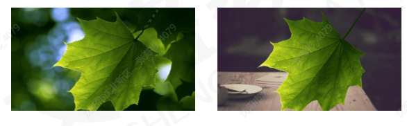

4. 像素是图像的基本组成单元，制作选区时**不可能选择半个像素。**
   **选区可以有256个级别**，这和通道中256级灰度是对应的。所以，有时明明设置了选区，但软件却提醒没有像素被选中，原因之一就是所有在选区中的像素的选择程度都低于50%。羽化命令就是这个原理。

##### 创建选区

1. 

   

2. 选框工具

   - 设置羽化参数可以使选区边缘得到柔和的效果，羽化选区参数的取值范围为0~255像素，其数值越大，选区的边缘会相应变得越模糊朦胧。通过设置选区边缘的柔化程度，使编辑或者拼合后的图像与原图像浑然一体，天衣无缝。
   - 
   - 样式：运用选框工具创建选区时，除了在图像窗口中单击鼠标左键并拖曳之外，还可以运用工具箱中”样式”选项来定义选区。
     选择“矩形选框”工具后，在“样式”下拉列表中有三个选项：
     
   - 消除锯齿：消除据齿：像素是组成图像的最小元素，由于它们都是正方形的，因此，在创建圆形、多边形等不规则选区时便容易产生据齿。例如：左图使用椭圆选框工具选出的对象。勾选该选项后，会在选区边缘一个像素宽的范围内添加与周围图像相近的颜色，使选区看上去光滑，如右图所示。由于
     只有边缘像素发生变化，因而消除锯齿不会丢失细节。这项功能在剪切、拷贝和粘贴选区以创建复合图像时非常有用。
   - 单行、单列选框工具：
   - 提示：单行与单列的选项栏与矩形选框工具的选项栏功能一致，此处不再赘述。
   - 注意：使用单行与单列创建选区时“羽化”值必须为0。
   - 

3. 魔棒工具

   - 魔棒工具用于选择图像中颜色相似的区域。在工具箱中选择魔棒工具，然后在图像中的某点上单击，即可将该图像附近颜色相同或相似的区域选取出来。
   - 连续
   - 取样大小
   - 容差

4. 快速选择工具

   - 快速选择工具,可以不用任何快捷键进行加选，在快速选择颜
     色差异大的图像会非常的直观和快捷。

     

   - 属性栏中包含新选区、添加到选区、从选区减去3种模式。

   - 

5. 套索工具组

   - 套索工具可以在图像或图层中绘制不规则形状的选区，选取不规则形状的图像：
     套索工具组共包括套索工具、多边形套索工具和磁性套索工具；反复按Shift+L组合键，可以在这3个工具之间进行切换。

   - 套索工具主要用于创建不规则选区。选择套索工具后，在图像中按住鼠标左键不放并拖动，完成选择后释放鼠标，绘制的套索线将会变为选区。

   - 当需要创建主要由直线连成的选区时，可以使用多边形套索工具。
     技巧：按住[Shift]键时，可以沿水平
     垂直或相对成45度角的方向绘制选区线。

   - 在工具箱中选择多边形套索工具，先在图像中单击创建选区的起始点，然后沿着需要选取的图像区域移动鼠标指针，并在多边形的转折点处单击，作为多边形的一个顶点。当回到起始点时，鼠标指针右下角将出现一个小圆圈，即生成最终的选区。

   - 曲线和多边形套索工具使用相对比较简单，而磁性套索工具则功能强大。磁性套索工具主要用于在图形颜色反差较大的区域创建选区，它可以在没有精确描绘的情况下自动根据图像主题的边缘创建选区，从而提高工作效率。

   - 在工具箱中选择磁性套索工具后？按住鼠标左键不放，沿图像的轮廓拖动，系统自动捕捉图像中对比度较大的图像边界并自动产生节点，当到达起始点时单击即1可完成选区的创建。

   - 

     (1)宽度：用于设置磁性套索工具在选取图像时的探查距离。值越大，探查图像边缘范围越广。可输入的数值范围为1-26。
     例如：当输入一个数字为15，那么磁性套索工具只会寻找15个像素距离之内的物体边缘。所以数字越大，可以寻找的范围也越大，但是可能会导致边缘不准确，所以宽度一般不宜过大。

     (2)对比度：用于设置磁性套索工具的敏感度。就是要抠取的物体的边缘与背景的对比度，边缘越清晰与背景反差越大就代表对比度越大。
     (3)频率：主要用于设置在创建边界线时所插入的节点数量，数值越大，则节点越多，得到的选区也越精确。

   - 色彩范围命令：

   - 【色彩范围】命令可以根据选择图像中指定的颜色自动生成选区，如果图像中存在选区，那么色彩范围只局限在选区内，执行“选择→色彩范围”命令。

##### 修改选区

1. 选区运算方式

   - **“添加到选区”按钮**：单击该按钮，在图像窗口中创建选区时，将在原有选
     区的基础上增加新的选区，相当于按住<Shift>键的同时创建选区的效果。
   - **“从选区减去”按钮：**单击该按钮，在图像窗口中创建选区时，将在原有选区中减去与新选区相关的部分，相当于按住<Alt>键的同时创建选区的效果。
   - **“与选区交叉”按钮：**单击该按钮，在图像窗口中创建选区时，将在原有选区和新建选区相交的部分生成最终选区。

2. 扩大选取与选取相以

   - 执行【选择】>【扩大选取】命令时，会查找并选择那些与当前选区中的像素色调相近的像素，从而扩大选择区域。但该命令只扩大到与原
     选区相连接的区域。
   - 执行【选择】>【选取相似】菜单命令时，同样会查找并选择那些与当前选区中的像素色调相近的像素，从而扩大选择区域。但该命令可以
     查找整个文档，包括与原选区没有相邻的像素。

3. 菜单栏方式

   - 1.扩展

     运用"扩展”命令，可以将当前选区均匀向外扩展1~100个像素。
     在图像窗口中创建选区后，执行“选择”→“修改”→“"扩展”命令。

   - 2.收缩
     收缩”命令与“扩展”命令的功能相反，运用该命令，可以按设置的像素值
     向内均匀地对选区进行收缩。
     在图像中创建选区后，执行“选择”一“修改”→“收缩”命令。

   - 3.边界
     运用“边界”命令相当于对选区进行相减操作，扩展后的选区减去收缩后的
     选区，便得到环状的选区。
     在图像窗口中创建选区后，执行"选择”→“修改”一“边界”命令。
     

   - 4.平滑
     运用“平滑”命令，可使选区边缘变得更平滑一些。
     在图像中创建选区后，执行“选择”→“修改”一→“平滑”命令。

   - 5.羽化-方法一
     运用“羽化”命令，可使选区边缘变得更柔化。
     在图像中创建选区后，执行“选择”→“修改”一“羽化”命令。

   - 5.羽化-方法二
     选择选区工具，输入羽化值，创建选区。

4. 变换选区”命令

   - 变换选区”命令指的是对图像中创建的选区的蚂蚁线进行缩放、旋转、变形
     等操作，在变换过程中不会对选区内的图像起作用。
   - 在弹出的莱单中选择缩放、旋转、斜切、扭曲和透视选项后，按住
     [Ctrl]键拖动控制点得到如图所示的效果。

##### 路径转为选区

1. 路径：指的是在图像中使用钢笔工具或形状工具创建的贝塞尔曲线轮廓。路径多用于绘制矢量图形或对图像的某个区域进行精确枢图。路径不能够打印输出，只能存放于“路径”调板中。

2. 

   **控制柄**：调整线段（曲线线段）位置、长短、弯曲度等参数的控制点。
   **锚点**：与路径相关的点，即每条线段两端的点，由小正方形表示，其中锚点表
   现为黑色实心时，表示该锚点为当前选择的定位点。
   **线段**：分为直线段和曲线段两种，使用钢笔工具可绘制出不同类型的线段。

3. 钢笔工具

   - 1.创建直线
     直线路径没有方向点和方向线。要创建直线路径，只要使用钢笔工具在图像窗口中适当位置处单击鼠标创建直线路径的起点，移动鼠标指针至另一位置处单击即可。

     用钢笔在画面中单击，保持按住Sift键可以让所绘制的点与上一个点保持45度整数倍夹角（比如零度、90度）

   - 2.创建曲线
     选择钢笔工具，在图像上单击并拖动鼠标，即可生成带控制柄的锚点，继续单击并拖动鼠标，即可在锚点之间生成一条曲线线段。

     用钢笔来绘制曲线一在起点，即第1个锚点，按下鼠标之后不要松手，向上拖动将从起点处建立一条方向线后放手，然后在第二个锚点拖动出一条向下的方向线，释放鼠标，在起点与终点间即可创建一条曲线路径。

4. 工具

   - 1.添加锚点
     添加锚点工具用于对创建好的路径添加锚点。当已经创建的路径在某个位置需要细化修改时，使用该工具添加一个锚点后可以使曲线的弧度更加容易控制。

   - 2.删除锚点工具
     删除锚点工具主要用于删除路径上已存在的锚点，将两条线段合并为一条。选择删除锚点工具，在要删除的锚点上单击鼠标即可。

   - 3.转换点工具
     转换点工具主要用于转换锚点上控制柄的方向，以更改曲线线段的弯曲度和走向。

   - 4.路径选择工具
     路径选择工具：选择路径选择工具在路径上单击即可选择该路径，在路径上按住并拖动鼠标，可移动所选路径的位置。

     移动路径时若按住【Alt】键不放再拖动鼠标，则可以复制路径，拖曳鼠标即可选择鼠标经过地方的路径。

   - 直接选择工具

     直接选择工具：选择直接选择工具，在路径上的任意位置单击，将出现锚点和控制柄，任意选择路径中的线段、锚点、控制柄，然后按住鼠标左键不放并向其他方向拖动，可对选择的对象进行编辑。

5. 自由钢笔工具

   - 自由钢笔工具主要用于绘制比较随意的路径。它与钢笔工具的最大区别就是钢笔工具需要遵守一定的规侧，而自由钢笔工具的灵活性较大，与套索工具类似。选择自由钢笔工具，在图像上单击并拖动鼠标，即可沿鼠标的拖动轨迹绘制出一条路径。
   - 在“自由钢笔”工具选项栏中除了在钢笔工具中介绍的属性外，还可以选择
     “磁性的”复选框，选择该复选框，可以激活“磁性钢笔”工具，表示“"自由钢笔”工具有了磁性，此工具的使用方法类以于“磁性套索”工具的使用方法。

6. 路径面板

   - “路径”面板主要用于储存和编辑路径。默认情况下“路径”与“图层”面板在
     同一面板组中，但由于路径不是图层，所以创建的路径不会显示在“图层”面板中，而是单独存在于“路径”面板中。
     

   - **路径转换为选区**：选择路径后，在“路径”面板下方单击“将路径作为选区载
     入”按钮或在图像窗口中的路径上单击鼠标右键，在弹出的快捷菜单中选择
     建立选区”命令，打开“建立选区”对话框，设置羽化半径等参数，单击“确定”按钮。或按【**Ctrl+Enter**】组合键也可将路径转换为选区。

   - 选区转换为路径：载入选区后，在“路径”面板下方单击“从选区生成工作路
     径”按钮◇。

   - 填充路径

     通过“路径”调板，可以为路径填充前景色、背景色或者图案。直接在“路径
     调板中选择“路径”或“工作路径”时，填充的路径会是所有路径的组合部分。

     按住<Alt>键的同时，单击“"路径”面板底部的“用前景色填充”按钮，弹出
     “填充路径”对话框，即可使用所选择的颜色或图案对路径进行填充。

   - 描边路径

     在图像中创建路径后，可以应用”描边路径”命令对路径边缘进行描边。直接
     单击“路径”调板中的“用画笔描边路径”按钮

     按住<Alt>键的同时，单击“路径”面板底部的“用画笔描边路径”按钮，弹出
     ”描边路径”对话框，即可使用所选择的工具对路径进行描边。

   - 剪贴路径
     使用“剪贴路径”命令可以将图像的局部从整体中分离出来，在其他软件中可
     以得到透明背景的图像。沿图像边缘创建路径，拖动“工作路径”到“创建新路径”上，得到“路径1”

     打开“剪贴路径”对话框，设置参数，单击“确定”按钮，再执行“文件→存储
     为”命令，选择存储位置，设置"格式”为PhotoshopEPS。

     提示：使用“剪贴路径”命令可以将路径内的图像单独分离出来，应用“剪贴
     路径”命令后不能直接看到效果，只有将其存储为EPS格式，在其他软件中置入后，才会发现该图像为透明背景的图像。

7. 调整边缘

   - “调整边缘”命令可以对已建立的选区进行半径、对比度、平滑、羽化以及扩
     展与收缩、输出等的综合调整。

### 蒙版、通道

##### 蒙版的概念

1. 蒙版是一种**选区的表达形式。**
2. 蒙版有灰阶模式，**256个层级。**
3. **白色**区域是选区，**灰色**区域是半透明选区，**黑色**区域是选区外。
4. 蒙版可以用**工具编辑**，如画笔工具、橡皮擦工具等。
5. **快速蒙版**用以红色为表现形式。

##### 快速蒙版

1. 快速蒙版又称为**临时蒙版**，是用来创建、编辑和修改选区的。

2. 在快速蒙版状态下，被选择的区域显示原图像，而**不被选择的区域显示默认的半透明红色。**

3. 还可以使用**多种工具和滤镜命令来修改蒙版**，常用于选取复杂图像或创建特殊图像的选区。

4. 快速蒙版创建过程

   - 创建快速蒙版的具体操作如下，单击工具箱下方的⊙或者按键盘上的“Q”键，按钮就可直接创建快速蒙版。

5. 编辑快速蒙版

   - 进入快速蒙版模式编辑状态时，使用相应的**工具可以对抢创建的快速蒙版**
     **重新编辑**。在默认状态下，使用深色在可编辑区域填充时，即可将其转换为保护区域的蒙版；使用浅色在蒙版区域填充时，即可将其转换为可编辑状态。

6. 退出快速蒙版

   - 在快速蒙版状态下编辑完毕后，单击工具箱中的按钮，即可退出快速蒙版，此时被编辑的区域会以选区显示。

7. 更改蒙版颜色

   - 蒙版颜色是指覆盖在图像中保护图像某区域的透明颜色，默认状态下为“红色”，“透明度”为“50%”。**双击“以快速蒙版模式编辑”按钮**O,弹出“快速蒙版选项”对话框。

8. 更改蒙版颜色

   (1)色彩指示：用来设置在快速蒙版状态时遮罩的显示位置。

   被蒙版区域：有颜色的区域代表被蒙版的范围，没有颜色的区域则是选区范围。
   所选区域：有颜色的区域代表选区范围，没有颜色的区域则是被蒙版的范围。
   (2)颜色：用来设置当前快速蒙版的颜色和透明程度。

9. 更改蒙版颜色

   - **按住Alt键单击“以快速蒙版模式编辑”按钮**，可以在不打开"快速蒙
     版选项”对话框的情况下，自动切换"被蒙版区域”和“所选区域”选项，
     蒙版会根据所选的选项而变化。

##### 理解通道

1. 什么是通道？

   - **通道是**存储不同类型信息的**灰度图像**。
   - **颜色信息通道**是在打开新图像时自动创建的。图像的颜色模式决定了所创建的颜色通道的数目。例如，RGB图像的每种颜色（红色、绿色和蓝色）都有一个通道并且还有一个用于编辑图像的复合通道。

2. 通道类型

   - Photoshop:提供了3种类型的通道：颜色通道、Alpha通道和专色通道。
   - **颜色通道**：自动创建，像摄影胶片，记录了图像内容和**颜色信息**。
   - **Alpha通道**：能够创建和存储图像的**选区**并可以对其进行相应的编辑。
   - **专色通道**：可以对有要求的图像进行**专色的输出。**
   - "通道”面板将默认创建颜色通道。Alpha通道和专色通道都需要手动进行创建

3. 介绍

   - 1.颜色通道
     图像的颜色模式不同，包含的颜色通道也有所不同。
     RGB图像包含红、绿、蓝和一个用于编辑图像内容的混合通道，如左图；
     CMYK图像包含青色、洋红、黄色、黑色和一个混合通道，如中图：
     Lab图像包含明度、a、b和一个混合通道，如右图；
     **位图、灰度、双色调和索引颜色的图像都只有一个通道。**

     

   - 2.Alpha通道
     **方法一**：在“通道”面板中单击“创建新通道”按钮
     **方法二**：在创建选区后，单击“"将选区存储为通道”按钮都可得到Alpha通道。

     在Alpha通道中，**白色**为选区内区域，**黑色**为选区外区域，**灰色**为半透明选区（羽化区域)。用白色涂抹可以**扩大选区范围**，用黑色涂抹则**收缩选区**，用灰色涂抹可以**增加羽化范围。**

   - 3.专色通道
     专色通道用来存储印刷用的专色。专色是特殊的预混油墨，如金属金银色
     油墨、荧光油墨等，它们用于替代或补充普通的印刷色(CMYK)油墨。通常
     情况下，专色通道都是以专色的名称来命名的。

     如果通道中存在Alpha通道，只要使用鼠标**双击Alpha通道的缩略图**，即
     可打开**“通道选项”对话框**，在对话框中只要选择“专色”单选框，单击“确
     定”按钮，此时就会发现Alpha通道已经转换成了专色通道。

##### 通道的基本操作

1. 选择通道
   - **单击**【通道】面板中的一个通道即可选择该通道，文档窗口中会显示所选
     通道的灰度图像。
   - **按住Shift键单击**其他通道，可以**选择多个通**道，此时窗口中会显示所选颜色通道的复合信息。
2. 复制和删除通道
   - 将一个通道拖曳到【通道】面板底部的**【创建新通道】按钮**上，可以复制
     该通道。在【通道】面板中选择需要删除的通道，单击【删除当前通道】按钮可将其删除，也可以直接将通道拖曳到该按钮上进行删除。
3. Alpha通道与选区的互相转换
   - 选区转换为通道：如果在画面中创建了选区，单击【通道】面板中的
     【将选区存储为通道】按钮可将选区保存到Alpha通道中。
   - 在处理图像时创建的选区不止使用一次，如果对创建的选区要多次使用，
     就应该将其存储以便以后多次应用。选区的存储可以通过“存储选区'命令来完成，创建选区，执行莱单中的“选择→存储选区”命令，打开“存储
     选区”对话框。
   - 单击“确定”按钮，即可将当前选区存储到Alpha通道中。
   - (1)**文档**：当前选区存储的文档。
     (2)**通道**：用来选择存储选区的通道。
     (3)**名称**：设置当前选区存储的名称，设置的结果会将Alpha通道名称替换。
     (4)**新建通道**：存储当前选区到新通道中。(默认只有新建通道激活)
   - 如果通道中存在Alpha通道，在存储新选区时，在对话框中的“通道”选项
     栏中选择存在的“Alpha”通道时，操作部分的“新建通道”会变成“替换通
     道”，其他的选项会被激活。
   - 
     - **替换通道**：替换原来的通道。
     - **添加到通道**：在原有通道中加入新通道，如果选区相交，则组合成新的通道，即添加选区。
     - **从通道中减去**：在原有通道中加入新通道，如果选区相交，则合成的选择区域会减去相交的区域。
     - **与通道交叉**：在原有通道中加入新通道，如果选区相交，则合成的选择区域会只留下相交的部分。
   - **通道转换为选区**：在【通道】面板中选择要载入选区的Alpha通道，单
     击将通道作为**选区载入按钮**，即可载入该通道中的选区。此外，**按住Ctrl**键单击Alpha**通道也可以载入选区**。
   - 通道转换为选区
     - **反相**：勾选该复选框，会将选区反选。
     - **新建选区**：载入通道中的选区。当图像中存在选区时，勾选此项可以替换图像中的选区，此时操作部分的其他选项会被激活。
     - **添加到选区**：载入选区时与图像的选区合成一个选区。
     - **从选区中减去**：载入选区时与图像中选区交叉的部分将会被包刨除。
     - **与选区交叉**：载入选区时与图像中选区交叉的部分保留。
4. 分离通道
   - 分离通道：可以将图像从彩色图像中拆分出来，从而显示原本的灰度图像。
   - 具体操作方法为：在“"通道”弹出菜单中选择“"分离通道”命令，即可将图像拆分为组成彩色图像的灰度图像。
5. 合并通道
   - 合并通道可以将分离后并调整完毕的图像合并。单击“通道”调板下拉菜
     单中的“合并通道”选项，弹出“合并通道”对话框。在“模式”下拉列表中
     选择“RGB颜色”，在“通道”文本框中输入数量为“3”，单击“确定”按
     钮，会弹出“合并RGB通道”对话框，在"指定通道”选项中指定合并后的通
     道，单击“确定”按钮。

### 图层

##### 图层的操作

1. 新建图层
   - 新建图层指的是在原有图层或图像上新建一个可用于参与编辑的空白图层。创建图层可以在“图层”菜单中完成，也可以直接通过“图层”调板的新建图层按钮来完成该操作。
   - 新建背景图层完成的操作是将背景图层解锁转换为普通图层，也可以通过“图层”调板双击背景图层解锁。
2. 显示、隐藏图
   - 图层的显示与隐藏 只需在“图层”调板中 单击图层前面的 图 标，即可将图层在显示 与隐藏之间转换。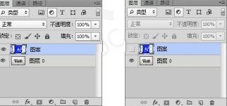
3. 选择图层
   - 使用鼠标在“图层”调板中的图层上单击即可选择该图层并将其变为 当前工作图层。按住[Ctrl]键或[Shift]键在调板中单击不同图层，就可以选 择多个图层。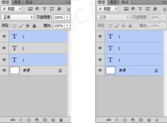
2. 复制图层
   - 1.执行菜单中的“图层一复制图层”命令，可以打开“复制图层”对话框。
   - 2.在“图层”调板中拖动当前图层到“创建新图按钮上，即可得到该图层的副本。
   - 3.执行莱单中的“图层→新建一通过复制的图层”命令或按组合键[Ctrl+j]也可以达到复制图层的效果。
   - 4.在图层上点击右键，在弹出的菜单上选择 复制命令也可以实现复制图层的操作
3. 删除图层
   - 删除图层指的是将选择的图层从“图层”调板中清除。
   - 1.执行菜单中的“图层一→删除一图层”命令.
   - 2.选择图层后，直接使用【DEL】键可以直接删除当前图层。（注意图层中不能存在选区）
   - 3.在"图层”调板中选择“删除”按钮或者将图层拖拽到“删除”按钮上。
   - 4.在图层上点击右键，在弹出的菜单上选择制除命令也可以实现册到除图层的绿作。
4. 移动图层
   - 移动图层时，如果要每次移动10像素的距离，可以按住Shift键的同时
     按键盘上的箭头键。
   - 如果想控制移动的角度，可在移动时按住Shift键，就能以水平、垂直或
     45度移动。
   - 如果要以1个像素的距离移动，可直接按键盘上的箭头键（上、下、左、右），每按一次，图层中的图像或选中的区域就会移动1个箭头。
5. 锁定图层
   - 将图层的某些功能锁住，避免误操作。
   - 1.锁定图层中的透明部分。只能针对有像素的部分进行操作。
   - 2.锁定图层中的图像编辑。不管是透明部分，还是图像部分都不允许编辑。
   - 3.锁定图层的移动。不能被移动或者进行任何编辑。
   - 4.锁定图层的全部。图层或图层组所有编辑功能被锁定。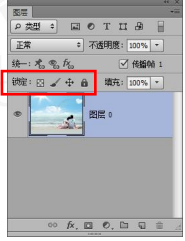
8. 图层对齐
   - 在Photoshop中选择多个图层或选择具有链接的图层后，可以对图层中的 图像进行对齐与分布设置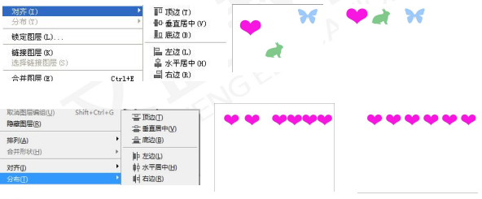
9. 更改图层顺序
   - 执行菜单中的“图层→排列”命令， 在弹出的子菜单中选择相应命令就可以 对图层的顺序进行改变。 在“图层”调板中利用鼠标直接拖 动当前图层到该图层的上面图层或下面 图层，即可更改图层顺序。 要注意的是背景图层永远处于最下 方，若需要调整其顺序需要先将背景图 层转换为普通图层才可以进行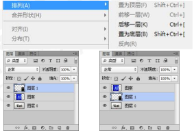
10. 图层的合并
   - 合并图层可以减小当前编辑的图像在磁盘中占用的空间，缺 点是文件重新打开后，合并后的图层将不能拆分。 执行菜单中的“图层→拼合图像”命令，即可拼合图像。也 可以在图层上通过右键菜单选择合并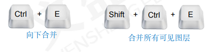
11. 修边
    - 图像边缘不平滑，用“修边”功能可以轻松地将多余的像素清除，使合成图 像的边缘更加平滑或自然。 包括“移去黑色杂边” 、 “移去白色杂边”和“去边” 、 “净化颜色”选项。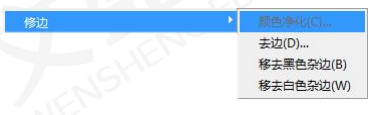
12. 图层组
    - 图层组可以让你更方便地管理图层，图层组中的图层可以被统一进行移动 或变换，还可以对其进行单独编辑。图层组的功能类似于Windows操作系统 中的文件夹。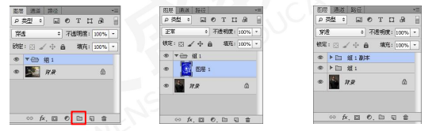
13. 链接图层
    - 链接图层可以将两个以上的图层链接到一 起，被链接的图层可以被一起移动或变换。链 接方法是在“图层”调板中多选图层后，单击 “图层”调板中的“链接图层”按钮，此时在 图层后会出现链接符号。链接图层后通过选择 链接在一起的任何一个图层，就可以将所有被 链接的图层选中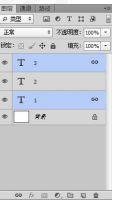
    - 重命名图层
    - 通过重命名图层命令可 以直接修改图层名称，这样 可以更方便进行寻找图层， 或者通过双击图层名称进行 重命名操作，但是要注意的 是不能对背景图层进行重命 名操作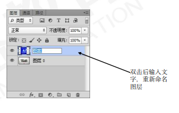

##### 剪切蒙版和图层蒙版

1. 剪贴蒙版

   - 在Photoshop中，可以通过“创建剪贴蒙版”命令将两个图层制作剪贴
     蒙版效果。
   - 底部图层的透明像素覆盖它上面的图层。剪贴蒙版中只能包括连续图层。
     底部图层名称带下划线，上层图层的缩略图是缩进的。
   - 方法一：在按住Alt键的同时，将鼠标移到“图层”面板中两个图层之间的细线处，此时鼠标变成两圆相交的形状，单击鼠标后，两图层之间的细线变成了虚线，上面的图层和下面的图层就形成了剪贴蒙版关系。
   - 方法二：执行“图层>创建剪贴蒙版”命令，也可使两图层之间成为裁切关系。若要取消剪贴蒙版关系，可执行“图层>释放剪飘贴蒙版”命令。

2. 图层蒙版

   - 图层蒙版相当于一个8位灰阶的Alpha通道。

   - 图层蒙版可以理解为在当前图层上面覆盖一层玻璃片，这种玻璃片有透明
     的、半透明的、完全不透明的，图层蒙版是Photoshop中一项十分重要的功能。

   - 可用各种绘图工具在蒙版上涂色，只能涂黑、白、灰色，涂黑色的地方蒙版变为不透明，看不见当前图层的图像；涂白色则使涂色部分变为透明，可看到当前图层上的图像；涂灰色使蒙版变为半透明，透明的程度由涂色的深浅决定。

   - 1.创建图层蒙版的方法
     (1)执行菜单中的“图层”一“蒙版”一“显示全部”命令，此时在图层调板的该
     图层上便会出现一个白色蒙版缩略图；**在“图层调板中单击“添加图层蒙版”按钮**，可以快速创建一个白色蒙版缩略图。

      

     (2)执行菜单中的“图层”→“蒙版”一“隐藏全部”命令，此时在图层调板的该图层上便会出现一个黑色蒙版缩略图；在“图层调板中按住**Alt键单击“添动加图层蒙版”按钮**，可以快速创建一个黑色蒙版缩略图。

     (3)如果图层中存在选区，执行菜单中的“图层”一“蒙版”一“显示选区”
     命令，或在“图层”调板中单击“添动加图层蒙版”按钮，此时选区内的图像会被显示，选区外的图像会被隐藏。

   - 2.链接和取消图层蒙版的链接

     创建蒙版后，在默认状态下蒙版与当前图层中的图像是处于链接状态的
     此时移动图像时蒙版会跟随移动。执行菜单中的“图层”一“蒙版”一“取消链接”命令，会将图像与蒙版之间的链接取消，此时移动图像时蒙版不会跟随移动。

   - 3.启用和停用图层蒙版

     创建蒙版后，执行菜单中的“图层”一“蒙版”一“停用”命令，或在蒙版缩略图上单击鼠标右键，在弹出的菜单中选择“停用图层蒙版”命令，此时在蒙版缩略图上会出现一个红叉，表示此蒙版应用被停用。

   - 4.删除图层蒙版

     创建蒙版后，执行菜单中的“图层”一“蒙版”一“删除”命令，即可将当前
     应用的蒙版效果从图层中删除，图像恢复原来效果。

   - 5.应用图层蒙版

     创建蒙版后，执行菜单中的“图层”一“蒙版”一“应用”命令，可以将当
     前应用的蒙版效果直接与图像合并。                 

   - 6.“属性”调板

     “属性”调板可以对创建的蒙版进行更加细致的调整使图像合成更加细腻，使图像处理更加方便，创建蒙版后，执行菜单中的“窗口”→“属性”命令即可。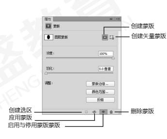
     
     其中“创建矢量蒙版” ：用来为图像创建矢量蒙版或在矢量蒙版与图像之 间选择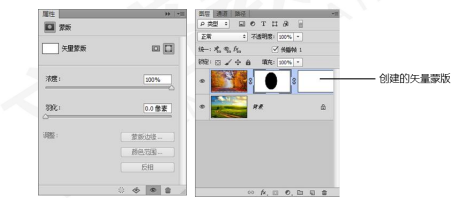
     
     其中“浓度” ：用来设置蒙版中黑色区域的透明程度，数值越大，蒙版越 透明。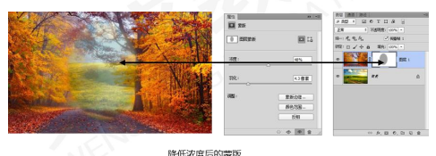其中“蒙版边缘：可以更加细致地调整蒙版的边缘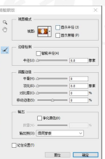
     
     其中“颜色范围” ：用来重新设置蒙版的效果。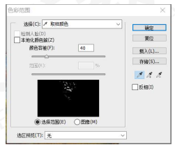

##### 其它图层类型

1. 填充图层
   - 填充图层与普通图层具有相同的颜色混合模式和不透明度，也可以对其进行图层顺序调整、删除、隐藏、复制和应用滤镜等操作。执行菜单中的**“图层→新建填充图层”命令**即可打开子菜单，其中包括**“纯色”、“图案”和“渐变”命令**，也可以直接使用图层面板中的**快捷按钮**添加。
   - **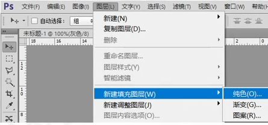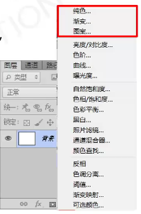**
2. 调整图层
   - 使用“调整图层”不会更改原图像中的像素。执行菜单中的“**图层→新建调整图层”命令，**系统会弹出该命令的子菜单，包括**“色阶”、“色彩平衡”、“色相/饱和度”**等命令。所有的修改都在新增的“调整”调板中进行，也可以使用图层面板直接添加。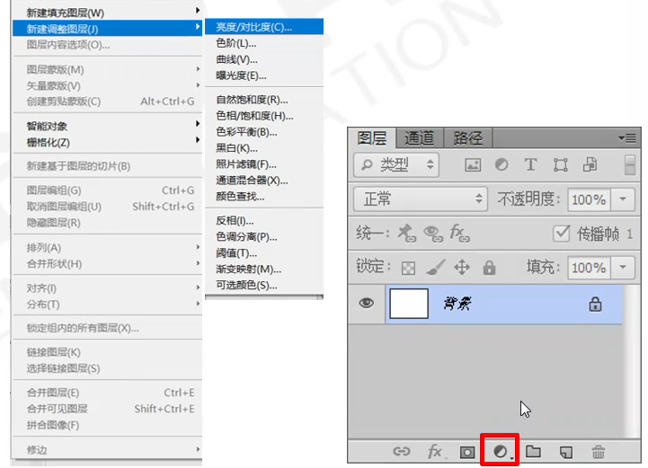
3. 智能对象
   - **智能对象**将保留图像的源内容及其所有原始特性，从而让您能够对图层执行**非破坏性编辑**。智能对象”就像一个有单性的容器，可以在其中**嵌入栅格或矢量图像数据**，Photoshop可将一个或多个图层转换为智能对象。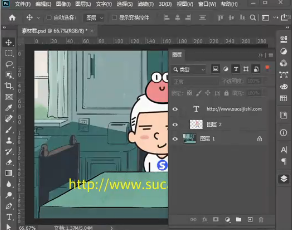

##### 总结

1. 图层类型非常多，每种图层类型在图层面板中会有不同显示常见的图层有**背景图层、普通图层、图层组、填充图层、调整图层、蒙版图层、剪贴蒙版图层、形状图层、文字图层、变形文字图层，智能对象图层等**，还可以在不同图层上应用图层样式或智能滤镜效果。

   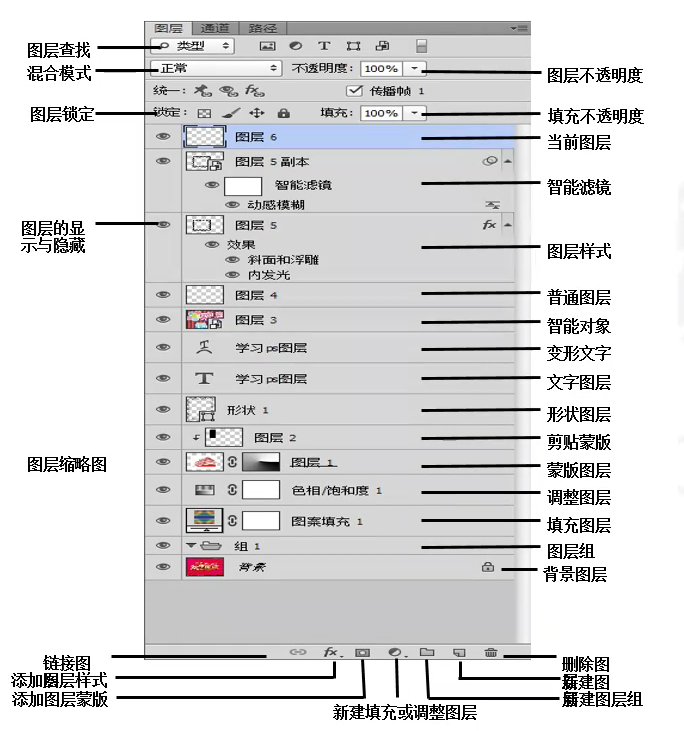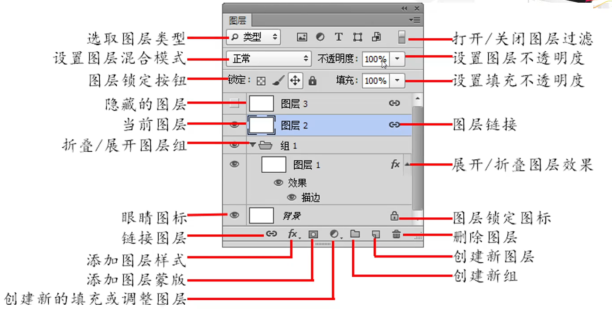

### 文字

##### 文字工具与颜色修改

1. 创建文字
   - 工具箱中共包含4种文字工具：
   - 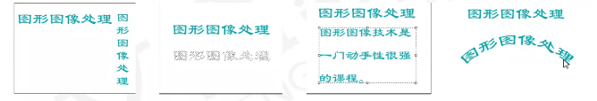
   - 如果在工具选项栏中看到。与√图标，说明文字工具处于编辑状态。
     确认操作的方法：Enter键、Ctrl+Enter键、更换其它工具、在某面板
     单击鼠标。
2. 修改文字颜色
   - 方法一：拖拽鼠标将文字选中，单击工具箱中的前景色，在弹出的“拾色 器”中选择新的颜色。 
   - 方法二：使用填充快捷键。填充前景色：Alt+Backspace；填充背景色： Ctrl+Backspace。 
   - 方法三：单击工具选项栏中的颜色块，弹出“拾色器” ，设定文字颜色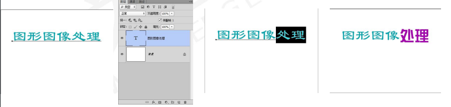

##### 点文字与段落文字

- 点文字
  - 点文字：输入少量文字。不会自动换行，需要回车换行。
    选择文字工具后，直接在需要的地方单击鼠标，创建文字输入位置后，可
    以直接输入文字内容，需要换行可以通过回车键完成。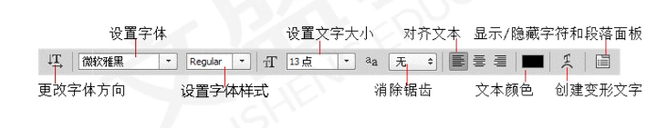
- 段落文字
  - 选择文字工具后，设置好相关属性，在图片中，**拖动鼠标绘制文本定界框**，即
    可在文本定界框中输入文字。段落文字文本定界框它具有**自动换行**、可调整文字区域大小等优势。段落文字主要用在大量的文本中，如海报、画册等。按住**Ctrl键**的同时，用鼠标拖拽改变**中心点**位置。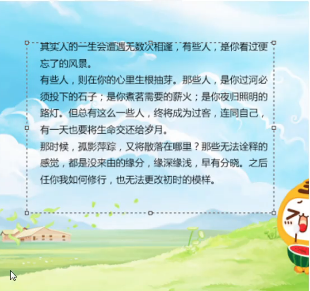
  - 用鼠标拖拽文字框的把手可缩小段落文字框，但不影响文字框内文字的各项设
    定。按住**Ctrl键**的同时拖拽文字框四角的角把手，不仅可放大缩小文字框，**同时也放大缩小文字**；如果**加按Shift键**，就会**成比例缩放**，文字不会被拉长或压扁。
  - 在按住**Ctrl键**的同时，将鼠标放在文字框各边框中心的**边框把手上拖拽**，可使
    文字发生**倾斜变形**；**如果加按Shift:键**，**可限制变形的方向**。点文字与段落文字在建立后，还可以**互相转换**。“文字>转换为段落文本”命令，或“文字>转换为点文本”命令。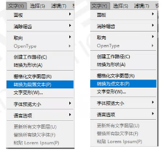
- 字符属性
  - 文字输入完成后或是在文字编辑的过程中都可以改变文字的属性。执行“窗口”>“字符”命令，或是在文字工具选项中单击显示字符和段落面板按钮国，可以调出“字符面板。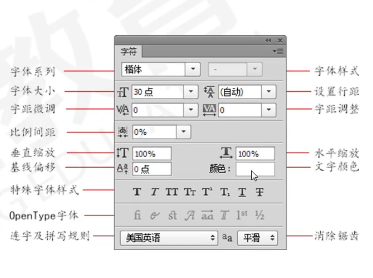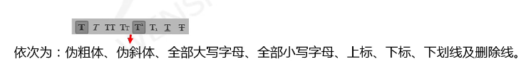
- 段落属性
  - 格式化段落就是对段落文字的相关参数进行设置，包括对齐、缩进等相关设置。段落对齐：齐左、居中、齐右、左右齐行、末行齐左、左右齐行、未行居中、左右齐行、末行齐右、左右强制齐行。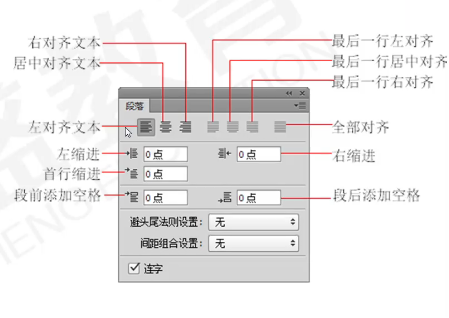

##### 文字变形与转换

1. 文字弯曲变形
   - 通过“变形”选项进行不同形状的变形，如波浪形、弧形等。“变形”操作
     对文字图层上所有的字符有效，不能只对选中的字符执行弯曲变形。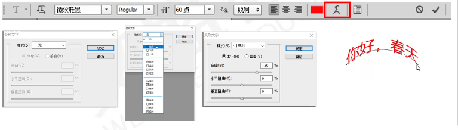
   - 注意：有两种情况文字图层是不**能执行“变形”命令的**，一种是文字图层中
     的文字只有**点阵字**而没有TrueType字；另一种是文字图层中的文字执行了"字
     符”面板弹出菜单中的“**伪粗体**”命令。
     当对文字图层执行了“**变形”操作后**，段落文字的**边框就不能像正常**的文字
     块那样变形或调节大小。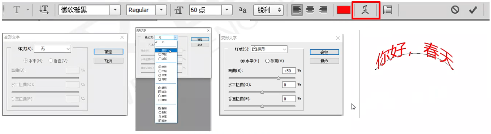
2. 文字转换
   - 文字图层可以更改文字方向，可以在点文字与段落文字之间转换，可以移动、重新排放和拷贝，可以更改文字图层的图层选项等。执行“编辑>变换”命令。“透视”和“扭曲”除外。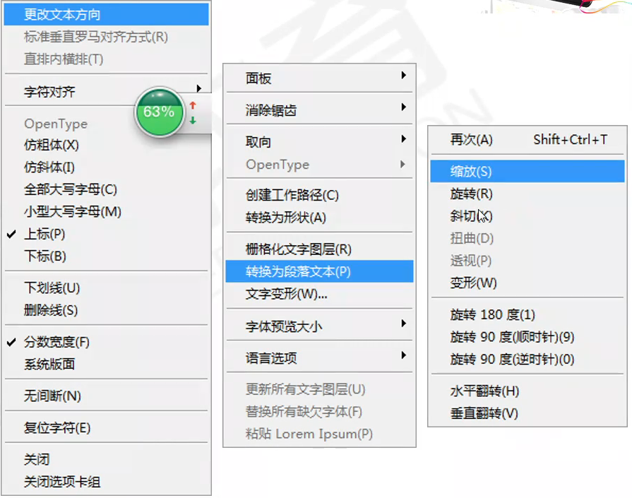
   - 文字转换：
     1.文字图层**转为图像图层**。“图层>**栅格化**>文字
     2.文字图层**转换为工作路径或形状。**
     (1)“文字>创建工作路径”命令，可以看到文字上有路径显示，在“路径”面板中看到一个根据文字图层创建的工作路径。但工作路径的创建对原来的文字图层并没有任何影响。
     (2)“文字>转化为形状”命令。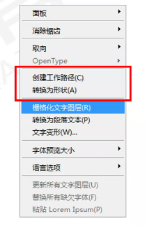

##### 路径文字

1. 路径文字创建
   - Photoshop的文字可以实现路径文字效果，首先利用路径工具创建一条路
     径，文字工具可以**在路径上直接创建点式文字**。**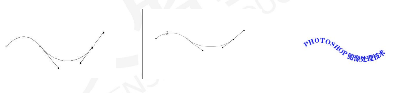**
   - 路径文字除了在**不封闭路径**上，还可以在封闭路径上完成创建，用同样的
     方法也可以**调整文字的位置和方向**。****
   - 当创建了封闭路径后，还可以将文字在路径中创建，类似于将封闭路径作
     为了文字的界定框，这样文字就可以按照路径的区域进行排列。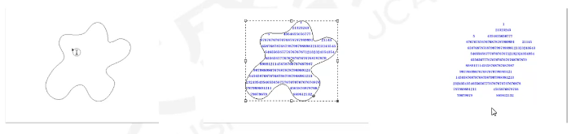

##### 文字图层效果

- 文字图层和其他图层一样可以执行“图层样式”中定义的各种效果
- 而且这些效果在文字进行像素化或矢量化之后，仍然保留，并不受影响。

### 图层样式

##### 图层样式概念

- 图层样式是指图形图像处理软 件Photoshop中的一项图层处理功能， 是后期制作图片以期达到预定效果 的重要手段之一。图层样式的功能 强大，能够简单快捷地制作出各种 立体投影，各种质感以及光景效果 的**图像特效**，图层样式被广泛地应 用于各种效果制作当中
- 文字图层和其他图层一样 可以执行“图层样式”中定义的 各种效果，而且这些效果在文 字进行像素化或矢量化之后， 仍然保留，并不受影响。**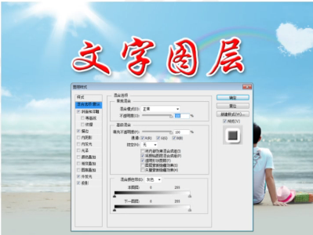
- ”图层样式”中提供了10种不 同的效果**。10种效果**包括：投影、 内阴影、外发光、内发光、斜面 和浮雕、光泽、颜色叠加、渐变 叠加、图案叠加和描边效果。 “图层>图层样式”，或单击 “图层”面板下方的 按钮， 或双击“图层”面板上的图层缩览 图，会弹出“图层样式”对话框。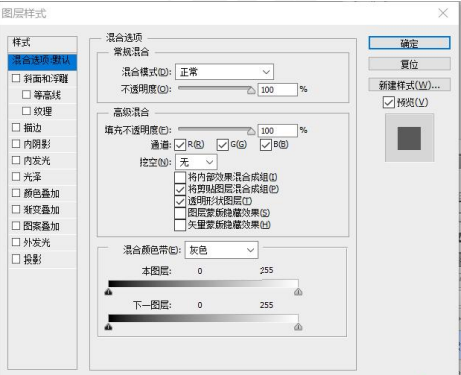

##### 混合选项

- **常规混合**：此处的“**不透明度**”设定会影响图层中**所有的像素**，这其中包括执行图层样式后增加或改变的部分。通过“投影”给图层增加阴影，当调整“不透明度”数值的时候，不但图层上原有的图像的不透明度发生变化，而且阴影的不透明度也发生同样的变化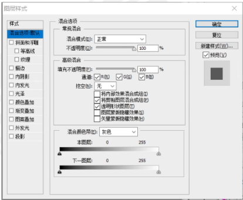
- 高级混合：
  **填充不透明度**
  改变“填充不透明度”**只影响图层中原有的**像素或绘制的图形，并不影响执行图层样式后带来的新像素的不透明度，如执行“投影”后所增加的阴影并不随着“填充不透明度”数值的变化而变化。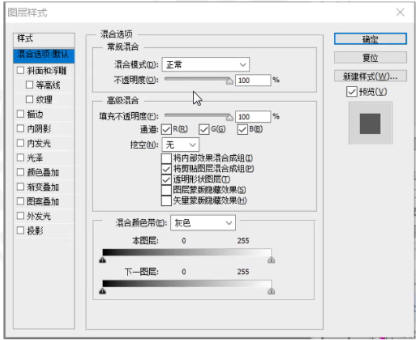

##### 图层效果

- 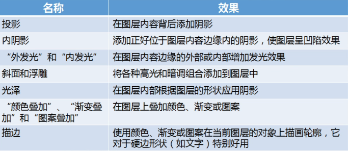
- **斜面和浮雕**
  **“外斜面”**在图层内容的外边缘上创建斜面“**内斜面**”在图层内容的内边缘上创建斜面，**“浮雕**”创建出使图层内容相对于下层图层呈浮雕状的效果，“**枕状浮雕**”创建出将图层内容的边缘压入下层图层中的效果，“**描边浮雕**”将浮雕限于应用于图层的描边效果的边界，如果图层没有应用“描边”效果，则“描边浮雕”效果不可见。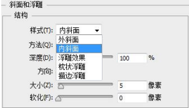

##### 图层间的混合模式

- Photshop共提供了**25种混合模式**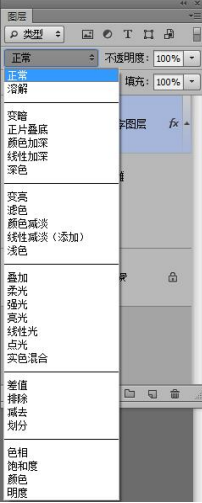

###  矢量

##### 创建矢量图形

- 形状填充
  - 在一个新的图层上创建一个“形状”，“形状”会自动填充当前工具箱
    中的**前景色，**可以改变它的填充颜色，也可以使用**渐变**或**图案**。**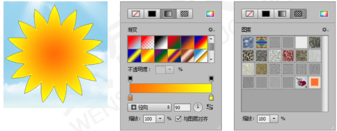**
- 形状相减
  - 创建了形状图层以后，可设定选项从现有的形状中减去其他的矢量形状，也可以用工具箱中的路径选择工具和直接选择工具来移动、缩放和编辑形状。
    **正图**：为了保证绘制的是正圆形，在绘制的过程中需按住**Shift键。**
    **复制**：在工具箱中选择路径选择工具，将圆形块选中，然后在按住**Alt键**的同时拖拽圆形块，就可将其复制。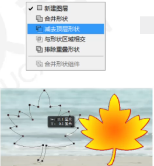
- 形状工具
  - Photoshop主要是用来处理像素图像的，但它也提供了绘制矢量图形的功
    能，矢量图形的**基本组成是锚点和路径**。
    通常所说的绘图是指使用**钢笔工具**或**形状工具**绘制几何形状的过程。这里
    的几何形状也就是**矢量图形**，它是面向对象的，**与分辨率无关**，放大缩小都不
    会影响边缘的平滑程度。
  - 形状工具包括：**矩形**工具、**圆角矩形**工具、**椭圆**工具、**多边形**工具、**直线**工具、**自定形状**工具。
    形状工具选项栏中提供了3种不同的绘图状态包括**形状图层**、路径和**填充像素**。形状图层是带图层矢量蒙版的填充图层；填充图层定义形状的颜色，而图层矢量蒙版定义形状的几何轮廓。
    **多边形工具**：
    **平滑拐角**：用圆角代替原来突出的尖角。
    **平滑缩进**：用圆角代替原来缩进的尖角。
  - 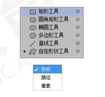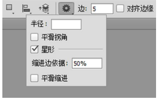
  - 直线工具： “起点”和“终点”：当“起点”和“终点”都选中时，画出的线两边都 带箭头。 “宽度”和“长度” ：箭头的宽度和长度的数值范围是1%~1500%，这 表示箭头和线宽之间的比例，比例越高，箭头相对于线宽就越大。 凹度：用来定义箭头凹进去的程度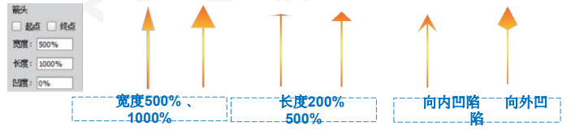

##### 图层矢量蒙版

- “**形状图层**”就是具有图层矢量蒙版的填充图层，填充图层用来定义图形的颜色。
- 两种蒙版：**像素蒙版、矢量蒙版**。在一个图层上既可以使用图层蒙版也可以使用图层矢量蒙版，或两者同时使用。
  **栅格化**：也可以将图层**矢量蒙版转换为图层蒙版**，也就是将矢量的路径像素化，使之转换为基于像素的图层蒙版。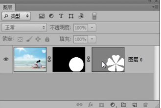

### 色彩

##### 明暗调整

- 亮度、对比度
  - 【亮度/对比度】命令可以调整图像的**色调范围**。它的使用方法非常简单，对于暂时还不能灵活使用【色阶】和【曲线】的用户，需要调整亮度和对比度时，可以用该命令来操作。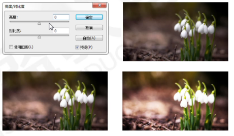
- 色阶
  - 【色阶】对话框中图形根据每个亮度值(0-255阶)处像素点的多少划分，最暗的像素点在左面，最亮的像素点在右面。“输入色阶”用于显示当前的数值，“**输出色阶**”用于显示将要输出的数值。
  - **3个吸管工具**直接单击图像可以在图像中以取样点作为图像的最亮点、灰平衡点和最暗点(lab模式图像不能使用中间的灰色吸管)。
    如果对调整的结果不满意，请按住键盘上的**Alt键**，此时“取消”按钮会变成“**回复**”按钮。
- 曲线
  - 曲线上可以**添加14个控制点**，拖曳控制点改变曲线形状便可以调整图像的色调和颜色，单击控制点，可将其选择，按住**Shift键**单击可以**选择多个**控制点。选择控制点后按下**Delete键**可以将其删除。
- 阴影高光
  - 【阴影/高光】命令适用于**校正**由于强逆光而形成**剪影**的照片，可用于使暗调区域变亮；或者校正由于太接近相机闪光灯而**有发白焦点**的照片，可用于减低高光域的亮度。

##### 色彩调整

- 色相饱和度、自然饱和度

  - 【**色相/饱和度**】命令可以控制图像的色相、饱和度和明度。
  - 【**自然饱和度**】命令，在颜色接近最大饱和度时最大限度地减少修剪。

- 色彩平衡

  - 【色彩平衡】命令可改变彩色图像中颜色的组成，此命令只是对图像进行**粗略的调整**，不能像“色阶”和曲线”那样进行较准确的调整。可对**阴影、中间调、高光部分**进行针对性的调整。

- 黑白

  - 【黑白】命令可将彩色图像**转换为灰度图像**，同时保持对**各颜色**的转换方式的完全控制。

    

- 变化

  - 【变化】命令可调整图像的色彩平衡、亮度和饱和度。

##### 强化颜色

- 反相
  - 【反相】命令用于产生原图的**负片**。当使用此命令后，白色就变成了黑色，也就是像素值由255变成了0，其他的像素点也取其对应值(**255-原像素值=新像素值**)。
- 色调分离
  - 【色调分离】命令可定义色阶的多少。在灰阶图像中可用此命令来**减少灰阶数量**，此命令可形成一些特殊的效果。
- 阈值
  - 【阈值】命令可将彩色或灰阶图像变成高对比度的黑白图。

##### 改变颜色

- 去色
  - 【去色】命令可使图像中所有的颜色的**饱和度成为0**，也就是说，可将所
    有颜色转化为灰阶值。这个命令**保持原来的彩色模式**，只是显示为灰阶图。
- 匹配颜色
  - 【匹配颜色】命令将一个图像的颜色**与另一个图像相匹配**。(RGB)
- 替换颜色
  - 【替换颜色】命令将一个图像的某种颜色替换。
- 可选颜色
  - 【可选颜色】命令可对RGB、CMYK和灰度等色彩模式的图像**分通道调整颜色**

### 滤镜

##### 滤镜

1. 滤镜的种类

   - 
   - 滤镜只对普通像素图层起作用，文本图层和形状图层要先转换为普通图层。 所有的滤镜命令都能作用于（RGB）颜色模式的图像，而不能作用于（ 索引 ） 颜色模式的图像

2. 重复使用滤镜

   - 注意：如果在使用一次滤镜后，效果不理想，可以按**Ctr+F组合键**
     **重复使用滤镜**。

3. 模糊 滤镜组

   - “模糊”滤镜组通过削弱图像中相邻像素的对比度，使相邻的像素产生平滑过渡效果，从而产生边缘柔和、模糊的效果。
   - **“场景模糊”、”光圈模糊”、“倾斜模糊”**，使用直观的图像控件快速创建三种不同的照片模糊效果。这组滤镜对摄影的后期是相当有效的。

4. “扭曲”滤镜组

   - “扭曲”滤镜组可以生成发光、波纹、旋转及扭曲
     效果。
     其中包括波浪、波纹、极坐标、挤压、扩散、切变、
     球面化、水波、旋转扭曲和置换多种滤镜。

5. 锐化 滤镜组

   - “锐化”滤镜组可以增强图像中相邻像素间的对比度，使图像更清晰，一般用于调整模糊的照片。在使用锐化滤镜时要注意，使用过度会造成图像失真。
     其中包括USM锐化、进一步锐化、锐化、锐化边缘
     和智能锐化5种滤镜。

     

6. 像素化 滤镜组

   - 像素化滤镜组主要通过将图像中相似颜色值的像素转化
     成**单元格**，使图像分块或平面化。像素化滤镜一般用于增强
     图像质感，使图像的纹理更加明显。
     其中包括**彩块化、彩色半调、点状化、晶格化、马赛克、**
     **碎片和铜版雕刻**7种滤镜。
   - *

7. “渲染”滤镜组

   - 在制作和处理一些风格照，或模拟不同光源下不同的光
     线照明效果时，可以使用渲染滤镜组。渲染滤镜组主要用于
     模拟光线照明效果。
     其中包括**分层云彩、光照效果、镜头光晕、纤维和云彩**5种滤镜。

8. 杂色 滤镜组

   - “杂色”滤镜组可以将图像中存在的噪点与周围像素融
     合，使其看起来不太明显，还可以在图像中添加许多杂色使
     之与图像转换成像素图案，其中包括减少杂色、蒙尘与划痕、
     添加杂色和中间值4种滤镜。

     

9. “其他” 滤镜组

   - 其他滤镜组中的滤镜是一组单独的滤镜，不适用任何滤
     镜组中的滤镜。该组中的滤镜可以用来偏移图像、调整最大
     值和最小值等，其中包括高反差保留、位移、自定、最大值
     和最小值5种滤镜。

     

   

##### 滤镜库

1. 滤镜库
   - Photoshop中的滤镜库整
     合了**“风格化”“画笔描边””扭曲”"素描””纹理”“艺术效果”6种**滤镜功能。使用滤镜库，可以累积应用滤镜，并可**多次应用**单个滤镜还可以**重新排列**滤镜并更改已应用的每个滤镜的设置。
   - 滤镜按照选择**顺序应用**，可通过在已应用的滤镜列表中将滤镜名称拖移到另一个位置来**重新排列**它们，可**显著改变**图像的外观。单击滤镜旁边的眼睛图标可**隐藏**其效果，单击**删除**按钮可删除已应用的滤镜。
   - 使用“纹理”滤镜来生成一些纹路的变化，或者说来产生一种将图像制作
     在某种材质上的质感变化。纹理的大小及高低变化可通过对话框中的选项进行自由控制。

##### 液化

- 使用液化滤虑镜可以对图像的任意部分进行各种类似液化效果的变形处理
  如**收缩、膨胀、旋转**等，多用于人物修身。还可以通过工具或Alpha通道将某些区域保护起来，不受各种变形操作的影响。“液化”命令只对RGB、CMYK、Lab颜色模式和灰度模式中的8位或16位图像有效。

##### 镜头校正

- 使用“镜头校正”滤镜命令可以对摄影时产生的镜头缺陷进行校正，例如 桶形失真、枕形失真、晕影以及色差等。选择【滤镜】/【镜头校正】命令，打 开 “镜头校正”对话框

##### 自适应广角

- 自适应广角滤镜校正是由于可以使用广角镜头而造成的镜头扭曲，可以快
  速拉直在全景图或采用鱼眼镜头和广角镜头拍摄的照片中看起来弯曲的线条。例如，建筑物在使用广角镜头拍摄时会看起来向内倾斜。

##### 油画

- 使用“油画”滤镜命令可以将照片转换为具有经典油画视觉效果的图像可
  以调整描边样式的数量、画笔比例、描边清洁度和其他参数，就能够快速实现油画图像的制作。

##### 渐隐命令

- 执行完各种滤镜中的效果命令后，可通过“编辑>渐隐”命令对其效果
  进行控制。

##### 智能滤镜

- 智能滤镜**基于智能对象**，对任何智能对象使用的滤镜都是智能滤镜。智能
  滤镜出现在“图层”面板中应用这些智能滤镜的**智能对象图层的下方**。由于可
  以调整、移去或隐藏智能滤镜，因此使用智能滤镜**不会破坏图像的像素**。
- 除**液化**、**消失点之外**，可以将任何滤镜作为智能滤镜应用。在创建智能滤镜之前，**首先需要将图层转换成智能对象**。
- 分类
  - **重新排序**：重新排序智能滤镜，可以得到不一样的效果。
  - **编辑**智能滤镜：**双击**“图层”面板中智能滤镜的名称，即可打开该滤镜的对话框，可重新调整参数。
  - **隐藏**智能滤镜：与隐藏图层样式的操作一样，要隐藏单个智能滤镜应在“图层”面板中单击该智能滤镜旁边的**眼晴图标**。
  - **复制**智能滤镜：在“图层”面板中选择所要复制的智能滤镜，按下Alt键，将其拖拽到智能对象上，释放鼠标。
  - **删除**智能滤镜：将滤镜拖拽到**删除按钮**上。
  - **遮盖**智能滤镜：智能对象下方的智能滤镜上显示一个白色**蒙版**图，可
    以在滤镜蒙版上进行绘画。

### 其他

##### 图像的批处理

- 在“动作”调板中创建的动 作可以应用于其他与之模式相同 的文件中，如此一来便为大家节 省了大量的时间

  

  

##### 切片工具

- 切片工具，能根据需求截出图片中的 任何一部分，同时一张图上**可以切多个**地方。所切的各个部分分别保存一张图片， 在制作网页或者截取图片某一部分时，经 常会用到这个工具的
- 点击“**切片工具**”以后，你的鼠标变 成一把小刀的样子，在你想切片大小的图 片上面，点击左键，**拖拽画框**，需要多大， 框就画多大
- 想切成多少张图片，就拉多少个框， 每张图左上角都有数字标识，告诉你是第 几张，如果数字有断开的话，就是你画的 框不准确，多出了边角料，重新画框即可。
- 图片切开完毕，就要保存到电脑，准 备使用，点击左上角“文件” ，下拉框找 到“**存储为Web所用格式**...”点击
- 弹出对话框里面，右上角“品质”一 般写70以上即可，数值越大图片越清晰。 右下角有图片整体大小，点击下面“存储” 按钮

##### 动画

- **GIF**的全称是 Graphics Interchange Format（可交换的文件格 式），其文件后缀名为“.gif” 。GIF动画 是电脑制作的一种动画，是互联网发展初 期，为了适应较慢的网络传输速度而产生 的一种**动画图片格式**，它是一种压缩率较 高、并能表现动画的一种图像格式
- 动画是将**一系列静止画面，以一定的速度连续播放，因视觉暂留**产
  生错觉，使人感觉画面活动的作品。为了得到活动的画面，每个画面中
  都会有一定差别。

