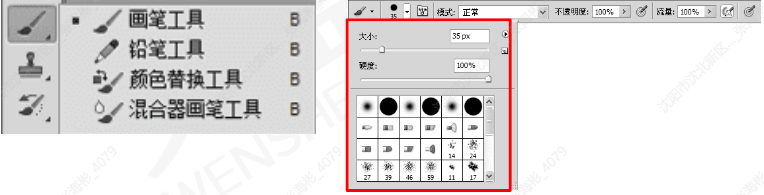
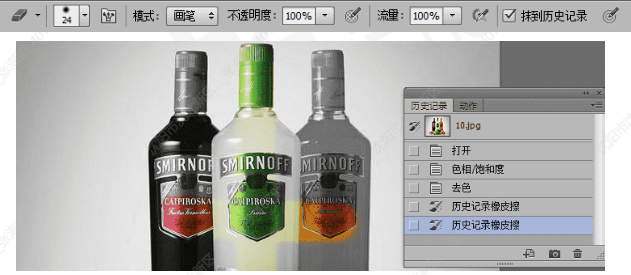

# 图像图像处理

## 第一章

### 基础知识

##### 点阵图和矢量图

1. 矢量图（图形）

   **矢量图**又称向量图，是由一些用数学方式描述的曲线（**贝塞尔曲线**）组成
   其基本组成单元是**锚点**和**路径**。矢量图与分辨率无关，不论放大和缩小多少
   矢量图的边缘都是平滑的。

2. 点阵图（位图、像素图、图像）

   点阵图也叫**位图**，它是由一个个小方块组成的，这些小方块被称为**像素**，
   每个像素点都有特定的位置和颜色值。

##### 像素（栅格）

- **像素**(Pixel)是组成图图像最基本的单元。
- 它是一个小的**矩形颜色块**。一幅图像通常由许多像素组成，当将图像放到足够大时就可以看到像素，也可称之为**栅格**。单位长度内的像素越多，图像的效果就越好，图片所占磁盘空间越大。

##### 图像的分辨率

- **分辨率**是指单位长度（通常厘米或者英寸）内所含有的像素或点的多少。分辨率包括**图像分辨率**、**输出分辨率**等。
- 图像分辨率的单位通常是**ppi**(pixels per inch),**即每英寸所包含的像素数量**。如果图像分辨率是72ppi,就是在每英寸长度内包含72像素。**图像分辨率越高，意味着每英寸所包含的像素越多，图像就有越多的细节。**
- 输出分辨率：以**dpi**
  (dots per inch,每英寸所含的点)为单位，是针对输出设备而言的。指激光打印
  机等输出设备在输出图像每英寸所产生的点数。

##### 图像的颜色深度

- **颜色深度**用来度量图像中有多少颜色信息可用于显示或打印像素。其单位是位，所以颜色深度有时也称为**位深度**。常用的颜色深度是1位，8位，24位和32位。说**白了，就是图像中到底有多少种颜色**。如1位的图像有**2^1^=2**种颜色，深度为8位的图像有**2^8^=256**种颜色，颜色深度越大，图像的色彩就越精确。

### 颜色模型和颜色模式

##### 颜色模型

- 颜色模型是用于表现颜色的一种数学算法。常见的颜色模型包括HSB、RGB、CMYK和Lab。

##### 颜色模式

-  

- HSB颜色模型：是一种基于人直觉的颜色模式，使用该模型可以非常轻松地选择不同亮度的颜色。

  1. **H（Hue)**代表色相（色调），就是色彩的颜色，如红，橙黄，绿，蓝，紫等各代表一种色相，**而黑，白以及各种灰色则属于无色系**，其设置范围在0~360度：
  2. **S(Saturation)**代表饱和度，即颜色的强度与纯度，范围在0%（灰色)~100%度（纯色）：
  3. **B(Brightness)**代表亮度，表示色彩的相对明暗程度，范围在0%（黑色）~100%度（白色）。

- RGB模式模型和模式

  1. RGB:RGB模式由红(Red)、绿(Green)和蓝(Blue)色光三原色组合而成，
     然后由这三种原色混合产生出成千上万种颜色。
  2. 红+绿=黄
     红+蓝=洋红（品红）
     绿+蓝=青
     红+绿+蓝=白
  3. 当3种亮度值**都为255**时，产生**纯白色**；当3种亮度值**都为0**时，产生**纯黑色**；当3种基色的**亮度值相等（非255或者0**）时，产生**灰色**：3种色光混合生成的颜色一般比原来的颜色亮度值高，所以RGB模型又被称为**色光加色法。**

- CMYK模型和模式

  1. **CMYK**:是一种印刷的颜色模式，它由分色印刷的四种颜色组成，**青色**(Cyn)、**洋红色**(Magenta)和**黄色(**Yellow)组合在一起就可以生成**黑色**(Black),但实际上等量的CMY三原色混合并不能产生完美的黑色和灰色，只有再加上一种黑色后，才会产生图像中的黑色和灰色。黑色就以K字母表示，这样就产生了CMYK模式。

- LAB模型和模式

  1. Lab模式：是一种**色域范围最广**的颜色模式，Lab颜色由亮度或亮度分量(L)
     和两个色度分量：a分量（从绿色到红色）、b分量（从蓝色到黄色）一组成。

- 灰度模式

  1. 灰度模式：该模式图像不包含颜色，彩色图像转换为该模式后，色彩信息都会被删除。灰度图像中的每个像素都有一个0到255之间的亮度值，0代表黑色，255代表白色，其他值代表了黑、白中间过渡的灰色。

- 位图模式（只能在灰度模式的基础上转换得到）

  位图模式：该模式只有黑和白两种颜色，它适合制作艺术样式或用于创作单色图形。彩色图像转换为该模式后，色相和饱和度信息都会被删除，只保留亮度信息，它包含的信息最少，因而图像也最小。

  

- 双色调模式（只能在灰度模式的基础上转换得到）

  双色调模式采用1一4种彩色油墨混合其色阶来创建单色调（一种颜色）、双色调
  (两种颜色)、三色调(3种颜色)和四色调(4种颜色)的图像。

  

- 索引颜色模式

  索引颜色模式是网上和动画中常用的图像模式，当彩色图像转换为索引颜
  色模式后，颜色数量可以指定，但是，图像最多256种颜色。这样可以减小图像
  文件的大小。

  

- 多通道模式
  多通道模式对于有特殊打印要求的图像非常有用。例如，如果图像中只使用
  了两种或3种颜色时，使用多通道模式可以减少印刷成本并保证图像颜色的正确
  输出。（不重要）

### 文件格式

##### 常用的图像文件格式

- 图像文件有很多存储格式，在实际工作中，由于用途不同，要使用的文件格
  式也是不一样的，比如适用于网络、出版印刷等，可以根据实际需要来选择图像
  文件格式，以便更有效地应用到实践当中。
- 
- PSD格式是Photoshop自身默认生成的图像格式，它可以保存图层、通道
  和颜色模式，还可以保存具有调节层文本层的图像，PSD文件自动保留图像
  编辑的所有数据信息，便于进一步修改！
- EPS是一种包含**位图**和**矢量图**的混合图像格式，主要用于矢量图像和光栅图像的存储。EPS格式可以保存一些类型信息，例如多色调曲线、分色、剪辑路径、挂网信息和色调曲线等，**因此EPS格式常用于印刷或打印输出。**
- JPEG是目前使用非常广泛的图像格式。JPEG格式扩展名为jpg、jpe或jpeg,可
  以用较少的磁盘空间得到较好的图片质量，JPEG2000格式作为PEG格式的升级版其**压缩率**比更高。
- TIFF格式是一种应用非常广泛的**无损**压缩图像格式是用于在应用程序之间和计
  算机平台之间的交换文件，它的出现使得图像数据交换变得简单。TIFF格式支持
  RGB、CMYK和灰度3种颜色模式，还支持使用通道、图层和裁切路径的功能。
- GIF格式是全称是Graphics Interchange Format,可交换图像格式，由于该格式只能保存最多256色的RGB色阶数，文件压缩率高，因此在互联网产生之初，GIF格式广泛应用于网页或网络中，GIF格式在它还可以支持透明背景及动画格式。
- PNG是一种新兴的网络图形格式，采用**无损压缩**的方式，与JPG格式类似，网
  页中有很多图片都是这种格式，压缩比高于GIF,也**支持图像透明**，当色彩表现力
  优于GIF,可以表现**24位真彩**。
- BMP图像文件是Windowsi操作系统中的**标准图形文件格**式，能够被多种
  Windows应用程序所支持。这种格式的特点是包含的图像信息较丰富，几乎**不**
  **进行压缩**，但占用磁盘空间较大。
- PDF格式是用于文件交换所发展出的文件格式，是应用于多个系统平
  台的一种电子出版物的文档格式，它可以包含位图和矢量图，还可以包含
  电子文档查找和导航功能。
- 

### Photoshop基本操作

##### 新键文件

- 选择**【文件】/【新建】**命令或按**【Ctrl+N】**组合键，打开"新建对话框，在其中可设置名称、宽度、高度和分辨率等信息。“"**背景内容**”中三个选项用来
  设定新文件的颜色，包括“**白色”、“背景色”和“透明”。**
- 推荐分辨率设置：
  屏幕显示分辨率：72/96
  打印分辨率：150
  印刷分辨率：300

##### 打开文件

- 选择【文件】/【打开】命令，或按【Ctrl+O】组合键，或者在灰色区域双击
  鼠标都可以打开“打开”对话框，在其中选择需要打开的图像文件，单击“打开”
  按钮即可。也可以用鼠标左键双击界面灰色区域。

##### 保存文件

- 选择【文件】/【保存】命令，或按【Ctl+S】组合键，第一次保存文件时可以
  打开“保存”对话框，在其中选择需要的图片格式，单击“保存”按钮即可。
- **若已经选择过保存PSD格式文件**，下次保存时，会保存到上次选择的文件上，不会再次弹出对话框。
- **若打开的图片没有新建图层**，一定要选择另存为命令来保存，否则会覆盖原文件。

##### 关闭文件

- 选择【文件】/【关闭】命令，或按【Ctl+W】组合键，可以关闭文件，
  若文件没有保存，会弹出对话框提示保存。

##### 改变图像大小

- 使用“图像大小”命令可以调整图像的像素大小、文档大小和分辨率。

##### 改变图像分辨率

- 更改图像的分辨率，可以直接影响到图像的显示效果增大分辨率时，会自动增加图像的像素；缩小分辨率时，会自动减少图像的像素。

##### 改变画布大小

- 在实际操作中，画布指的是实际打印的工作区域。改变画布大小会直接影响最终的输出与打印。使用“画布大小”命令：

  1.可以按指定的方向增大围绕现有图像的工作空间
  2.或通过减小画布尺寸来裁剪掉图像边缘
  3.还可以设置增大边缘的颜色

##### 工具箱

-  
  1. 有些工具的右下角有一个小的黑三角，表明它有隐含的工具：
  2. 如果要在它们之间进行切换，可在按住Alt键的同时，单击工具箱中的工具找到，就可在隐含和非隐含的工具之间循环切换。
  3. 另外，在按住Shift键的同时，按键盘上对应工具的字母键，也可以循环切换隐含的工具。

##### 图像的浏览

1. 放大与缩小命令

   视图菜单下，**一个图像最大的显示比例是3200%**，最小是显示一个像素。

2. 满画布显示（按屏幕大小缩放）

   使用“视图”菜单下的“满画布显示”命令，或**双击工具箱中抓手工具图标**，可以自动找到屏幕上完全显示当前图像的最大显示比例，也就是以图像完全出现在当前窗口内的最大比例来显示图像。

3. 实际像素(100%)
   I00%的显示比例。在Photoshop中，直接使用"视图”菜单中的“实际像素”命令，或双击工具箱中放大镜工具的图标，便可实现100%的显示比例。

4. 打印尺寸
   真实印刷尺寸，即不考虑图像的分辨率，而只以图像本身的宽度和高度来表示一幅图像的大小。

5. 缩放工具
   放大或缩小图像。单击图像，即可实现图像的成倍放大。按t键使用缩放工具时，光标变为一个带减号的缩小镜，单击可实现图像的成倍缩小。

6. 抓手工具
   当图像的显示比例较大时，图像窗口不能完全显示整幅画面，这时可以使用抓手工具来拖动画面，西文输入状态下，按H键，即可切换为抓手工具。

7. 导航器面板

##### 面板

- 浮动面板指的是打开Photoshop软件后在桌面上可以移动、可以随时关闭并且具有不同功能的各种控制面板。**随意拆分，随意组合**。
- **当按Tab键时**，可将包括工具箱在内的所有面板关闭，再按Tab键，可恢复为关闭前的状态。
- **如果在按住Shift键的同时按Tab键**，就会关闭除了工具箱以外的其他所有面板。

### 工具

##### 颜色设定

- 前景色：各种绘图工具画出的线条颜色，默认为黑色。

- 背景色：橡皮擦工具擦除后的颜色，默认为白色。

- 

- 拾色器
  单击工具箱中的前景色或背景色图表，弹出“拾色器”对话框。包
  括RGB、CMYK、HSB和Lab四种不同的颜色描述方式

- 吸管工具

  **吸管工具可从图像中取样来改变前景色或背景色。**
  按住**Alt**键的同时用此工具在图像上单击，工具箱中的**背景色**就显示所选取的颜色软件默认的情况是吸取单个像素的颜色，但也在一定范围内取样
  按住Alt键，可在使用各种绘图工具时**暂时切换到吸管**工具，可以方便快速地选取前景色。

- 颜色取样器工具

  使用颜色取样器工具**最多可有4个取样点**。目的是测量图像中不同位置的颜
  色数值
  可通过颜色取样器工具**选项栏中的“清除**”按钮将所有取样点删除。直接用鼠标拖动就**可以移动取样点**的位置。如果想**删除**某个取样点，可以用鼠标将其拖拽出图像窗口：或者按住**Alt键**在取样点上单击。

- 使用颜色对话框可以方便的通过不同颜色模式的值调整需要的色彩。

- 

- 色板

  色板调板也可以直观的设置前景色为选择的色彩。单击鼠标就可改变工具箱中的前景色，按住**CtrI键**单击鼠标就可改变工具箱中的背景色。要删除色板”中的颜色，只要按住**Alt键**就可使图标变成剪刀的形状，在任意色块上单击鼠标键。

##### 绘图与填充工具

1. 画笔的选项设定
   - **直径**：用来控制**画笔的大小**。可以通过输入数字或拖拽滑钮来改变。
   - **硬度**：对于各种绘图工具（**铅笔工具除**外）来说，相当于所画线条**边缘的**柔化程度。铅笔工具画出的是一种边缘很硬的线条，有很明显的锯齿边，更不会出现虚边现象，**因此硬度的设置对于铅笔工具是无效的。**
   - 
2. 画笔工具
   - **单击或鼠标拖拽**：可绘出边缘柔软的画笔效果，画笔的颜色为工具箱中
     的前景色。如果想使绘制的画笔**保持直线**效果，可在画面上单击鼠标键，确定起始点，然后再**按住Sift键**的同时将鼠标键移到另外一处，再单击鼠标，两个击点之间就会自动连接起来形成一条直线。
3. 铅笔工具
   - 使用铅笔工具，可绘出**硬边的**线条，如果是**斜线，**会带有明显的**锯齿。**
     绘制的线条颜色为工具箱中的前景色
   - 在铅笔工具的选项栏中有一个“自动抹除”选项，选中此选项后：
     如果铅笔线条的**起点处**是工具箱中的**前景色**，铅笔工具将和橡皮擦工具相似，会将前景色擦除至背景色：
   - 如果铅笔线条的**起点处是**工具箱中的**背景色**，铅笔工具会和绘图工具一样使用前景色绘图；
   - 铅笔线条起始点的颜色**与前景色和背景色都不同时**，铅笔工具也是使用前景色绘图。
4. 橡皮擦工具
   - 
   - 
   - 橡皮擦工具的选项栏中有一个“**抹到历史记录**”的选项，选择此选项后，将橡皮擦工具移动到图像上时则变成图标，可将图像恢复到“历史记录”面板中任何一个状态或图像的任何一个”快照”。
   - 
   - 
5. 背景橡皮擦工具
   - 可将图层上的颜色**擦除成透明**。
   - 背景擦除工具可以在去掉背景的同时**保留物体的边缘**。通过定义不同的取样方式和设定不同的“容差”数值，可以控制边缘的透明度和锐利程度。背景擦除工具在**画笔的中心取色**，不受中心以外其他颜色的影响。
   - 
6. 魔术橡皮擦工具
   - 可根据颜色近似程度来确定将图像擦成透明的程度。
   - 当使用魔术橡皮擦工具在图层上**单击**，工具会自动将所有相似的像素变为透明。**如果当前操作的是背景层**，操作完成后变成普通图层。**如果是锁定透明的图层**，像素变为背景色。
7. 渐变工具
   - 用来**填充渐变色**，**如果不创建选区**，渐变工具将作用于整个图像。
     按住鼠标键拖拽，形成一条直线，**直线的长度和方向**决定了渐变填充的
     区域和方向，拖拽鼠标的同时按住**Shift键**可保证鼠标的方向是水平、竖直或45度。
   - 渐变样式包括线性渐变、放射状渐变(径向渐变)、角度渐变、对称渐
     变和菱形渐变。“仿色”选项用来控制色彩的显示，选中它可以使色彩过渡更平滑。
   - 
8. 油漆桶工具
   - 可根据像素的颜色的近似程度来填充颜色，填充的颜色为前景色或连续图案（油漆桶工具不能作用于位图模式的图像）。
   - 填充：有两个选项，"前景”和“图案
   - 

##### 图像修饰工具

1. 仿制图章工具
   - 可准确复制图像的一部分或全部，从而产生某部分或全部的拷贝
   - 选择不同类型的画笔来定义仿制图章工具的大小、形状和边缘软硬
     程度。
   - 取样：首先在仿制图章工具的选项栏中选择一个软边和大小适中的画笔，然后将仿制图章工具移到图像中，按住At键的同时单击鼠标键确定取样部分的起点。
   - 仿制图章工具不仅可在一幅图像上操作，而且还可从任何一幅打开的图
     像上取样后复制到现用图像上。注意：两张图像的颜色模式必须一样才可以执行此项操作。
   - 若选择“对齐”选项，下一次的复制位置会和上次的完全相同，图像的
     复制不会因为终止而发生错位。若不选择“对齐”选项，一旦松开鼠标键，表示这次的复制工作结束，每次复制都从取样点开始，操作起来很麻烦。
2. 图案图章工具
   - 可将各种图案填充到图像中。不需要按住Alt键进行取样。
3. 污点修复画笔工具
   - 用于快速移去图像中的污点和其他不理想部分。污点修复
     画笔不需要制定样本点，污点修复画笔将会在需要修复区域外
     的图像周围自动取样。
   - 在“类型”后面有三个选项，当选择“近似匹配”时，自动修复的像素
   - 可以获得较平滑的修复结果；当选择“创建纹理”时，自动修复的像素将会以修复区域周围的纹理填充修复结果。
   - 
4. 修复画笔工具
   - 用于修复图像中的缺陷，并能使修复的结果**自然融入**周围的图像。修复
     画笔工具在复制或填充图案的时候，会将取样点的像素信息自然融入到复制的图像位置。
   - 在“源”后面有两个选项，当选择“取样”时，和仿制图章工具相似，
     首先按住AIt键确定取样起点。
     如果是在两个图像之间进行修复工作，同样要求两个图像有相同的图像
     模式。
     
5. 修补工具
   - 如果选择修补工具选项栏的“目的”选项，修补的操作和选择“源”不
     同。
   - 
6. 内容感知移动工具
   - 可在无需复杂图层或慢速精确的选择选区的情况下快速地重构图像。
   - 
7. 红眼工具
   - 可以移去闪光灯拍摄的人物照片中的红眼，也可以移去用闪光灯拍摄的
     动物照片中的白色或绿色反光。红眼是由于相机闪光灯在视网膜上反光引起的。
   - 
8. 模糊/锐化工具
   - 模糊工具可降低相邻像素的对比度，将较硬的边缘软化，使图像柔
     和。
   - 锐化工具可增加相邻像素的对比度，将较软的边缘明显化，使图像
     聚焦。这个工具并不适合过度使用，因为将会导致图像严重失真。
   - 虽然模糊和锐化在字面上是一组反义词，但在实际操作过程中，模
     糊后的图像是不能通过锐化完全恢复的，反之亦然。
9. 涂抹工具
   - 用于模拟用手指涂抹油墨的效果，以涂抹工具在颜色的交界处作用，会
     有一种相邻颜色互相挤入而产生的模糊感。
   - 
10. 减淡/加深/海绵工具
    - 减淡工具可使用细节部分变亮，类似于加光的操作。
      加深工具可使细节部分变暗，类似于遮光的操作。
      海绵工具用来增加或降低颜色的饱和度。
    - 
11. 使用仿制源面板
    - 使用“仿制源”面板，最多可以为仿制图章工具或修复画笔工具设置5个不
      同的样本源。
    - 也可以缩放或旋转样本源以按照特定大小和方向仿制源。
    - 

##### 图像的恢复

1. 恢复命令
   - 执行“文件>恢复”命令，能将被编辑过的图像恢复到上一次存储的状态。
   -    
2. 还原/重做命令
   - 执行“编辑>还原”命令，或快捷键：Ctrl+Z。
   -   
3. 历史记录面板
   - 图标右边的小图像是当前图像的缩微图被称为"快照”
   - 在“**历史记录”**面板中只保留**20步**操作。如果要保留一个特定的状态，可选择“历史记录”面板右上角弹出菜单中的“新快照”命令，或直接单击“历史记录”面板下面的“**快照”图标**，这样就会将当前选中的状态生成新的快照。快照不与图像一起存储，关闭图像时将自动删除其快照。
4. 历史记录画笔工具
   - 可以将图像的一个状态或快照绘制到当前图像窗口中。
   - 

##### 绘图模式

1. 背后模式
   - 最终色与绘图色相同。当在有透明区域的图层上操作时背后模式才
     会出现，可将绘制的线条放在图层中图像的后面。
   - 
2. 清除模式
   - 同背后模式一样，当在图层上操作时，清除模式才会出现。
   - 
3. 差值模式
   - 与白色混合将使底色反相；与黑色混合则不产生变化。
   - 
4. 颜色模式
   - 采用底色的亮度以及绘图色的色相、饱和度来创建最终色
   - 

##### 图像的裁剪

1. 可以使用工具箱中的裁剪工具，或通过“图像>裁剪”命令，也可
   以通过“图像>裁切”命令来修剪图像。
2. 裁剪工具
   - 使用工具选项栏中的拉直工具，在图像上的视平线的位置拉一条直线，构图即会沿视平线水平放置。
   - 
3. 透视裁切工具
   - 当要确认裁剪范围时，需要在裁剪框中双击鼠标或按
     Enter键，若要取消裁剪框，按Esc键即可。也可以单击裁剪
     工具选项栏中的按钮进行确认或取消。
   - 
4. 裁剪和裁切命令
   - 
   - 

##### 图像的变换

1. 变换对象
   - 图像的变换与变形河以通过编辑菜单下的变换、自由变换、操控变形和内容识别比例几个命令来完成。
   - 在执行【编辑→自由变换】命令与执行【编辑→变换】命令时，当前对象的周围会出现一个用于变换的定界框定界框的中间有一个中心点，四周还有控制点，如图。在默认情况下，中心点位于变换对象的中心，用于定义对象的变换中心，拖曳中心点可以移动它的位置；控制点主要用来变换图像
   - 
   - 在【编辑→变换】命令上提供了各种变换命令。使用这些命令可以对图层、路径、矢量图形，以及选区中的图像进行变换操作。另外，还可以对矢量蒙版和Alphai通道应用变化。【自由变换】命令是【变换】命令的加强版，它可以在一个操作中应用到旋转、缩放、斜切、扭曲、透视和变形，选中需要【自由变换】的对象后，执行【编辑一自由变换】菜单命令，或按快捷键Ctl+T,可以进入自由变换状态。
   - 
   - 
   - 内容识别比例是Photoshop中非常实用的缩放功能，它可以自动识别图像中的重点信息，在不更改重要可视内容（人物、建筑、动物等）的情况下缩放图像大小。
   - 

##### 图像的批处理

1. 动作
   - 在“动作”调板中创建的动作可以应用于其他与之模式相同的文件中，如此一来便为大家节省了大量的时间。
   - 
   - 
   - 

### 选区

##### 基本概念

1. 选区是指通过工具或者相应命令在图像上创建的选取范围。创建选区轮廓后，可以将选区内的区域进行隔离，以便复制、移动、填充或颜色校正。

2. 照片，如果要想改变树叶的颜色，就要通过选区将树叶选中，再进行颜色调整，如图所示，选区可以将编辑限定在一定的区域内，这样就可以处理局部图像而不会影响其他内容了。如果没有创建选区，则会修改整张照片的颜色。

   

3. 选区还有一种用途，就是可以分离图像，例如，如果要为树叶换一个背景，就要用选区选中它，再将其从背景中分离出来，然后置入新的背景。

4. 像素是图像的基本组成单元，制作选区时**不可能选择半个像素。**
   **选区可以有256个级别**，这和通道中256级灰度是对应的。所以，有时明明设置了选区，但软件却提醒没有像素被选中，原因之一就是所有在选区中的像素的选择程度都低于50%。羽化命令就是这个原理。

##### 创建选区

1. 

   

2. 选框工具

   - 设置羽化参数可以使选区边缘得到柔和的效果，羽化选区参数的取值范围为0~255像素，其数值越大，选区的边缘会相应变得越模糊朦胧。通过设置选区边缘的柔化程度，使编辑或者拼合后的图像与原图像浑然一体，天衣无缝。
   - 
   - 样式：运用选框工具创建选区时，除了在图像窗口中单击鼠标左键并拖曳之外，还可以运用工具箱中”样式”选项来定义选区。
     选择“矩形选框”工具后，在“样式”下拉列表中有三个选项：
     
   - 消除锯齿：消除据齿：像素是组成图像的最小元素，由于它们都是正方形的，因此，在创建圆形、多边形等不规则选区时便容易产生据齿。例如：左图使用椭圆选框工具选出的对象。勾选该选项后，会在选区边缘一个像素宽的范围内添加与周围图像相近的颜色，使选区看上去光滑，如右图所示。由于
     只有边缘像素发生变化，因而消除锯齿不会丢失细节。这项功能在剪切、拷贝和粘贴选区以创建复合图像时非常有用。
   - 单行、单列选框工具：
   - 提示：单行与单列的选项栏与矩形选框工具的选项栏功能一致，此处不再赘述。
   - 注意：使用单行与单列创建选区时“羽化”值必须为0。
   - 

3. 魔棒工具

   - 魔棒工具用于选择图像中颜色相似的区域。在工具箱中选择魔棒工具，然后在图像中的某点上单击，即可将该图像附近颜色相同或相似的区域选取出来。
   - 连续
   - 取样大小
   - 容差

4. 快速选择工具

   - 快速选择工具,可以不用任何快捷键进行加选，在快速选择颜
     色差异大的图像会非常的直观和快捷。

     

   - 属性栏中包含新选区、添加到选区、从选区减去3种模式。

   - 

5. 套索工具组

   - 套索工具可以在图像或图层中绘制不规则形状的选区，选取不规则形状的图像：
     套索工具组共包括套索工具、多边形套索工具和磁性套索工具；反复按Shift+L组合键，可以在这3个工具之间进行切换。

   - 套索工具主要用于创建不规则选区。选择套索工具后，在图像中按住鼠标左键不放并拖动，完成选择后释放鼠标，绘制的套索线将会变为选区。

   - 当需要创建主要由直线连成的选区时，可以使用多边形套索工具。
     技巧：按住[Shift]键时，可以沿水平
     垂直或相对成45度角的方向绘制选区线。

   - 在工具箱中选择多边形套索工具，先在图像中单击创建选区的起始点，然后沿着需要选取的图像区域移动鼠标指针，并在多边形的转折点处单击，作为多边形的一个顶点。当回到起始点时，鼠标指针右下角将出现一个小圆圈，即生成最终的选区。

   - 曲线和多边形套索工具使用相对比较简单，而磁性套索工具则功能强大。磁性套索工具主要用于在图形颜色反差较大的区域创建选区，它可以在没有精确描绘的情况下自动根据图像主题的边缘创建选区，从而提高工作效率。

   - 在工具箱中选择磁性套索工具后？按住鼠标左键不放，沿图像的轮廓拖动，系统自动捕捉图像中对比度较大的图像边界并自动产生节点，当到达起始点时单击即1可完成选区的创建。

   - 

     (1)宽度：用于设置磁性套索工具在选取图像时的探查距离。值越大，探查图像边缘范围越广。可输入的数值范围为1-26。
     例如：当输入一个数字为15，那么磁性套索工具只会寻找15个像素距离之内的物体边缘。所以数字越大，可以寻找的范围也越大，但是可能会导致边缘不准确，所以宽度一般不宜过大。

     (2)对比度：用于设置磁性套索工具的敏感度。就是要抠取的物体的边缘与背景的对比度，边缘越清晰与背景反差越大就代表对比度越大。
     (3)频率：主要用于设置在创建边界线时所插入的节点数量，数值越大，则节点越多，得到的选区也越精确。

   - 色彩范围命令：

   - 【色彩范围】命令可以根据选择图像中指定的颜色自动生成选区，如果图像中存在选区，那么色彩范围只局限在选区内，执行“选择→色彩范围”命令。

##### 修改选区

