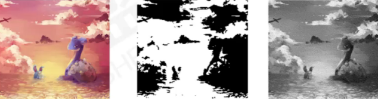

# 图像图像处理

## 第一章

### 基础知识

##### 点阵图和矢量图

1. 矢量图（图形）

   **矢量图**又称向量图，是由一些用数学方式描述的曲线（**贝塞尔曲线**）组成
   其基本组成单元是**锚点**和**路径**。矢量图与分辨率无关，不论放大和缩小多少
   矢量图的边缘都是平滑的。

2. 点阵图（位图、像素图、图像）

   点阵图也叫**位图**，它是由一个个小方块组成的，这些小方块被称为**像素**，
   每个像素点都有特定的位置和颜色值。

##### 像素（栅格）

- **像素**(Pixel)是组成图图像最基本的单元。
- 它是一个小的**矩形颜色块**。一幅图像通常由许多像素组成，当将图像放到足够大时就可以看到像素，也可称之为**栅格**。单位长度内的像素越多，图像的效果就越好，图片所占磁盘空间越大。

##### 图像的分辨率

- **分辨率**是指单位长度（通常厘米或者英寸）内所含有的像素或点的多少。分辨率包括**图像分辨率**、**输出分辨率**等。
- 图像分辨率的单位通常是**ppi**(pixels per inch),**即每英寸所包含的像素数量**。如果图像分辨率是72ppi,就是在每英寸长度内包含72像素。**图像分辨率越高，意味着每英寸所包含的像素越多，图像就有越多的细节。**
- 输出分辨率：以**dpi**
  (dots per inch,每英寸所含的点)为单位，是针对输出设备而言的。指激光打印
  机等输出设备在输出图像每英寸所产生的点数。

##### 图像的颜色深度

- **颜色深度**用来度量图像中有多少颜色信息可用于显示或打印像素。其单位是位，所以颜色深度有时也称为**位深度**。常用的颜色深度是1位，8位，24位和32位。说**白了，就是图像中到底有多少种颜色**。如1位的图像有**2^1^=2**种颜色，深度为8位的图像有**2^8^=256**种颜色，颜色深度越大，图像的色彩就越精确。

### 颜色模型和颜色模式

##### 颜色模型

- 颜色模型是用于表现颜色的一种数学算法。常见的颜色模型包括HSB、RGB、CMYK和Lab。

##### 颜色模式

-  

- HSB颜色模型：是一种基于人直觉的颜色模式，使用该模型可以非常轻松地选择不同亮度的颜色。

  1. **H（Hue)**代表色相（色调），就是色彩的颜色，如红，橙黄，绿，蓝，紫等各代表一种色相，**而黑，白以及各种灰色则属于无色系**，其设置范围在0~360度：
  2. **S(Saturation)**代表饱和度，即颜色的强度与纯度，范围在0%（灰色)~100%度（纯色）：
  3. **B(Brightness)**代表亮度，表示色彩的相对明暗程度，范围在0%（黑色）~100%度（白色）。

- RGB模式模型和模式

  1. RGB:RGB模式由红(Red)、绿(Green)和蓝(Blue)色光三原色组合而成，
     然后由这三种原色混合产生出成千上万种颜色。
  2. 红+绿=黄
     红+蓝=洋红（品红）
     绿+蓝=青
     红+绿+蓝=白
  3. 当3种亮度值**都为255**时，产生**纯白色**；当3种亮度值**都为0**时，产生**纯黑色**；当3种基色的**亮度值相等（非255或者0**）时，产生**灰色**：3种色光混合生成的颜色一般比原来的颜色亮度值高，所以RGB模型又被称为**色光加色法。**

- CMYK模型和模式

  1. **CMYK**:是一种印刷的颜色模式，它由分色印刷的四种颜色组成，**青色**(Cyn)、**洋红色**(Magenta)和**黄色(**Yellow)组合在一起就可以生成**黑色**(Black),但实际上等量的CMY三原色混合并不能产生完美的黑色和灰色，只有再加上一种黑色后，才会产生图像中的黑色和灰色。黑色就以K字母表示，这样就产生了CMYK模式。

- LAB模型和模式

  1. Lab模式：是一种**色域范围最广**的颜色模式，Lab颜色由亮度或亮度分量(L)
     和两个色度分量：a分量（从绿色到红色）、b分量（从蓝色到黄色）一组成。

- 灰度模式

  1. 灰度模式：该模式图像不包含颜色，彩色图像转换为该模式后，色彩信息都会被删除。灰度图像中的每个像素都有一个0到255之间的亮度值，0代表黑色，255代表白色，其他值代表了黑、白中间过渡的灰色。

- 位图模式（只能在灰度模式的基础上转换得到）

  位图模式：该模式只有黑和白两种颜色，它适合制作艺术样式或用于创作单色图形。彩色图像转换为该模式后，色相和饱和度信息都会被删除，只保留亮度信息，它包含的信息最少，因而图像也最小。

  

- 双色调模式（只能在灰度模式的基础上转换得到）

  双色调模式采用1一4种彩色油墨混合其色阶来创建单色调（一种颜色）、双色调
  (两种颜色)、三色调(3种颜色)和四色调(4种颜色)的图像。

  

- 索引颜色模式

  索引颜色模式是网上和动画中常用的图像模式，当彩色图像转换为索引颜
  色模式后，颜色数量可以指定，但是，图像最多256种颜色。这样可以减小图像
  文件的大小。

  

- 多通道模式
  多通道模式对于有特殊打印要求的图像非常有用。例如，如果图像中只使用
  了两种或3种颜色时，使用多通道模式可以减少印刷成本并保证图像颜色的正确
  输出。（不重要）

### 文件格式

##### 常用的图像文件格式

- 图像文件有很多存储格式，在实际工作中，由于用途不同，要使用的文件格
  式也是不一样的，比如适用于网络、出版印刷等，可以根据实际需要来选择图像
  文件格式，以便更有效地应用到实践当中。
- 
- PSD格式是Photoshop自身默认生成的图像格式，它可以保存图层、通道
  和颜色模式，还可以保存具有调节层文本层的图像，PSD文件自动保留图像
  编辑的所有数据信息，便于进一步修改！
- EPS是一种包含**位图**和**矢量图**的混合图像格式，主要用于矢量图像和光栅图像的存储。EPS格式可以保存一些类型信息，例如多色调曲线、分色、剪辑路径、挂网信息和色调曲线等，**因此EPS格式常用于印刷或打印输出。**
- JPEG是目前使用非常广泛的图像格式。JPEG格式扩展名为jpg、jpe或jpeg,可
  以用较少的磁盘空间得到较好的图片质量，JPEG2000格式作为PEG格式的升级版其**压缩率**比更高。
- TIFF格式是一种应用非常广泛的**无损**压缩图像格式是用于在应用程序之间和计
  算机平台之间的交换文件，它的出现使得图像数据交换变得简单。TIFF格式支持
  RGB、CMYK和灰度3种颜色模式，还支持使用通道、图层和裁切路径的功能。
- GIF格式是全称是Graphics Interchange Format,可交换图像格式，由于该格式只能保存最多256色的RGB色阶数，文件压缩率高，因此在互联网产生之初，GIF格式广泛应用于网页或网络中，GIF格式在它还可以支持透明背景及动画格式。
- PNG是一种新兴的网络图形格式，采用**无损压缩**的方式，与JPG格式类似，网
  页中有很多图片都是这种格式，压缩比高于GIF,也**支持图像透明**，当色彩表现力
  优于GIF,可以表现**24位真彩**。
- BMP图像文件是Windowsi操作系统中的**标准图形文件格**式，能够被多种
  Windows应用程序所支持。这种格式的特点是包含的图像信息较丰富，几乎**不**
  **进行压缩**，但占用磁盘空间较大。
- PDF格式是用于文件交换所发展出的文件格式，是应用于多个系统平
  台的一种电子出版物的文档格式，它可以包含位图和矢量图，还可以包含
  电子文档查找和导航功能。
- 

### Photoshop基本操作

##### 新键文件

- 选择**【文件】/【新建】**命令或按**【Ctrl+N】**组合键，打开"新建对话框，在其中可设置名称、宽度、高度和分辨率等信息。“"**背景内容**”中三个选项用来
  设定新文件的颜色，包括“**白色”、“背景色”和“透明”。**
- 推荐分辨率设置：
  屏幕显示分辨率：72/96
  打印分辨率：150
  印刷分辨率：300

##### 打开文件

- 选择【文件】/【打开】命令，或按【Ctrl+O】组合键，或者在灰色区域双击
  鼠标都可以打开“打开”对话框，在其中选择需要打开的图像文件，单击“打开”
  按钮即可。也可以用鼠标左键双击界面灰色区域。

##### 保存文件

- 选择【文件】/【保存】命令，或按【Ctl+S】组合键，第一次保存文件时可以
  打开“保存”对话框，在其中选择需要的图片格式，单击“保存”按钮即可。
- **若已经选择过保存PSD格式文件**，下次保存时，会保存到上次选择的文件上，不会再次弹出对话框。
- **若打开的图片没有新建图层**，一定要选择另存为命令来保存，否则会覆盖原文件。

##### 关闭文件

- 选择【文件】/【关闭】命令，或按【Ctl+W】组合键，可以关闭文件，
  若文件没有保存，会弹出对话框提示保存。

##### 改变图像大小

- 使用“图像大小”命令可以调整图像的像素大小、文档大小和分辨率。

##### 改变图像分辨率

- 更改图像的分辨率，可以直接影响到图像的显示效果增大分辨率时，会自动增加图像的像素；缩小分辨率时，会自动减少图像的像素。

##### 改变画布大小

- 在实际操作中，画布指的是实际打印的工作区域。改变画布大小会直接影响最终的输出与打印。使用“画布大小”命令：

  1.可以按指定的方向增大围绕现有图像的工作空间
  2.或通过减小画布尺寸来裁剪掉图像边缘
  3.还可以设置增大边缘的颜色

##### 工具箱

-  
  1. 有些工具的右下角有一个小的黑三角，表明它有隐含的工具：
  2. 如果要在它们之间进行切换，可在按住Alt键的同时，单击工具箱中的工具找到，就可在隐含和非隐含的工具之间循环切换。
  3. 另外，在按住Shift键的同时，按键盘上对应工具的字母键，也可以循环切换隐含的工具。

##### 图像的浏览

1. 放大与缩小命令

   视图菜单下，**一个图像最大的显示比例是3200%**，最小是显示一个像素。

2. 满画布显示（按屏幕大小缩放）

   使用“视图”菜单下的“满画布显示”命令，或**双击工具箱中抓手工具图标**，可以自动找到屏幕上完全显示当前图像的最大显示比例，也就是以图像完全出现在当前窗口内的最大比例来显示图像。

3. 实际像素(100%)
   I00%的显示比例。在Photoshop中，直接使用"视图”菜单中的“实际像素”命令，或双击工具箱中放大镜工具的图标，便可实现100%的显示比例。

4. 打印尺寸
   真实印刷尺寸，即不考虑图像的分辨率，而只以图像本身的宽度和高度来表示一幅图像的大小。

5. 缩放工具
   放大或缩小图像。单击图像，即可实现图像的成倍放大。按t键使用缩放工具时，光标变为一个带减号的缩小镜，单击可实现图像的成倍缩小。

6. 抓手工具
   当图像的显示比例较大时，图像窗口不能完全显示整幅画面，这时可以使用抓手工具来拖动画面，西文输入状态下，按H键，即可切换为抓手工具。

7. 导航器面板

##### 面板

- 浮动面板指的是打开Photoshop软件后在桌面上可以移动、可以随时关闭并且具有不同功能的各种控制面板。**随意拆分，随意组合**。
- **当按Tab键时**，可将包括工具箱在内的所有面板关闭，再按Tab键，可恢复为关闭前的状态。
- **如果在按住Shift键的同时按Tab键**，就会关闭除了工具箱以外的其他所有面板。
