# 图形图像

## Photoshop 的基本功能和图像处理的相关概念

### Photoshop 的基本功能

1. **绘图功能(绘图、路径、形状工具绘制图像)**
   - 使用钢笔工具时，【Ctrl】临时切换为【直接选择工具】
   - 画笔工具，“[ ”和“ ] ”控制画笔大小
   - 【Shift】：正方形，正圆形，水平线，竖直线，45度角线
   - 【填充】：【Shift】+【F5】
2. **图像基本编辑(调整尺寸、旋转、裁剪等操作)**
   - 自由变换：【Ctrl】+【T】
   - 扭曲(在自由变换模式下)： 【Ctrl】调角控制点
   - 斜切：【Ctrl】+【Shift】+调边控制点
   - 透视：【Ctrl】+【Shift】+【Alt】+调角控制点
   - 定旋转中心点：【Ctrl】+移动中心点
   - 【Shift】：保持长宽比例、15度旋转
3. **修图(仿制图章工具、修复画笔工具、修补工具、污点修复工具)**
   - 仿制图章工具和修复画笔工具，【Alt】取样
4. **合成(将各个素材通过叠加、拼接、虚化、透明、抠图、混合、修饰和调色等操作，处理成一幅新的完整的图像)**
   - 临时使用移动工具 【Ctrl】
   - 使用套索工具时，按【Alt】互相切换
   - 磁性套索和多边形套索，【Delete】删除上一个节点，【Esc】取消全部
5. **调色(利用各种调色命令或者调整图层对图像和图层的色彩和明暗进行调整)**
6. **特效制作(通过综合应用各种滤镜菜单，命令和工具，后期再添加一些必要的元素和创意完成特殊效果)**
7. **动画功能( GIF 动画)**

### 相关概念

1. 数字图像的种类
   - **矢量图**：用**数学方式描述的曲线**(贝塞尔曲线)构成，组成单元是**锚点和路径**。矢量图的特点是**不论放大和缩小多少。它的边缘都是平滑、清晰的**。创作软件 Adobe Illustrator、CoreDRAW 等。
   - **点阵图**：又称之为**位图**或者**像素图**。**基本组成单元是像素**。图像的清晰度和像素的数量有关系，**像素的数量越少，图像越模糊**。反之，图像越清晰。点**阵图放大的时候会失真**。
2. 像素
   - **像素是组成图像的最基本单元**。它是一个小的矩形颜色块。一幅图像通常有许多像素组成，也可以称之为**栅格**。**每个像素有**不同的**颜色值**和**亮度值**。
3. 图像的分辨率
   - **图像的分辨率是单位长度像素的数量**。单位可以是**英寸**，也可以是**厘米**，**通常用英寸**为单位。
   - **PPI 是指每英寸所包含的像素数量**。分辨率越高，图像越清晰。反之，图像越模糊。
4. 输出分辨率
   - **DPI 是指输出设备的分辨率**，代表设备**每英寸的拥有的点数**。
5. 颜色深度
   - **用来度量图像中有多少颜色信息可用于显示或打印。**
   - **是指一幅图像中颜色的数量**
   - **单位是位（bit）**，也可以称之为**位深度**。通常有 1 位、8 位、24 位和 32 位。要会计算，如 8 位的图的颜色深度是：2^8^=256 种。
6. 颜色模型（表示颜色的数学算法）
   - HSB
     - **H 色相 0-360 度** 颜色的基本特征
     - **S 饱和度 0%-100%** 颜色的强度或者纯度
     - **B 亮度（明度）0%-100%** 颜色的明暗
   - RGB（红绿蓝）
     - 这是光的三基色。每个颜色的取值范围都是 0-255；
     - 红绿蓝都是 **0 是黑色** ，都是 **255 是白色**，其他都**一样的数值是灰色**；
     - 色光加色法；
     - **红色的补色是青色**；**绿色的补色是洋红色**；**蓝色的补色是黄色**。
   - CMYK（青、洋红、黄、黑）
     - 印刷色；CMYK 与 RGB 互为相反；**色域较窄**；色光减色法。
   - LAB
     - 具有**最宽的色域**。
     - L 亮度分量；A 分量（绿到红）；B 分量（蓝到黄）
7. 颜色模式
   - **RGB 颜色模式**
   - **CMYK 颜色模式**
   - **LAB 颜色模式**
   - 灰度模式： **256 级灰度**，**0 代表黑色**，**255 代表白色**。
   - 位图模式：**黑白两色**， 1 位颜色深度。**在灰度模式转换得到**
   - 双色调模式：**用1~4种油墨混合** 单 双 三和四色调。在灰度模式转换得到
   - 索引颜色模式：颜色**最多有 256 种**，文件较小。
   - 多通道模式（不重要）

### 常见文件格式

1. Photoshop 格式
   - 文件扩展名为.PSD，支持所有颜色模式；支持图层；支持专色通道；支持 ALPHA通道；一句话，**啥都支持**。
2. PDF 格式
   - 支持图层；支持专色通道；**支持 ALPHA 通道**
3. TIFF 格式
   - 支持跨平台的应用软件。支持图层；支持专色通道；**支持 ALPHA 通道。**
4. EPS 格式
   - **可以同时包含像素信息和矢量信息**。**不支持 ALPHA 通道**。可以制作剪贴路径。
5. DCS 格式
   - **分 DCS1.0** 和 **DCS2.0**。DCS2.0 支持专色通道。
6. BMP 格式
   - 标准的 Windows **位图格式**。**不压缩，文件大。**
7. JPEG 格式
   - 网页中最常见的一种图片文件格式。**有损压缩**，高压缩比，但是的**质量没有太大的变化**。是目前最好的一种压缩算法。**不支持图层通道**
8. GIF 格式
   - 索引颜色模式。最多 256 种颜色。**可以是透明的**。可以是**动图**。
9. PNG 格式
   - 分为 **PNG-8 和 PNG-24**。PNG-8 颜色最多 256 种颜色，文件较小。PNG-24 颜色非常多，文件较大。**可以是透明的。**

### 简单操作

1. 新建文件

   - 快捷键为 **Ctrl+N**，可以设置文件的**名称、宽度、高度、分辨率**和**颜色深度、颜色模式、背景内容（白、背、透）**等信息。

2. 更改图像大小

   - 【**图像-文件大小**】命令，可以改变**像素大小、印刷尺寸和分辨率**信息

3. 图像的浏览

   - 缩放图像
     - 可以使用**视图菜单下**的放大\缩小命令;
     - （**ctrl+[+]**）（**ctrl+[-]**）；
     - 也可以使用**缩放工具**（快捷键 **Z**），**默认**单击**放大**，**按住 ALT 单击缩小**；
     - 还可以使用**导航器面板**;
     - **【Alt】+滚鼠标**；
     - **双击缩放工具：实际像素**。
   - 抓手工具
     - 用于移动放大后的图像（快捷键 **H**），在使用其他工具时，**按住空格键临时切换到抓手工具。双击**抓手工具：**按屏幕大小显示**。

   - 屏幕显示模式
     - 快捷键 **F**
     - 标准屏幕模式下，**【tab】隐藏工具箱、控制面板**

## 各种工具的使用和图像变换、批处理

### 颜色设定

1. 拾色器
   - 单击前景色或者是背景色调出拾色器。可以在拾色器中修改前景色和背景色。
   - 默认**前景色是黑色，背景色是白色**，快捷键**D**；
   - **互换**前景背景色快捷键**X**。
2. 颜色面板
   - **默认修改前景色**；按 **alt** 键改**背景色**
3. 色板面板
   - **默认修改前景色**；按 **ctrl 键改背景色**。**Alt键起到删除**作用。
4. 吸管工具
   - 用来吸取图像中的像素的颜色来修改前景色和背景色。**默认修改前景色**；**按 alt 键改背景色**。
   - **使用绘图工具（画笔、铅笔、形状）**时，按【**Alt**】**临时切换吸管工具**。
5. 颜色取样器工具
   - **最多取 4 个取样点**。取样点可以全部清除；也可以单个删除，也可以移动位置。单个删除的方法：**拖出图外**、**按【Alt】键单击**、**单击右键**。

### 绘图工具

1. 画笔工具
   - 可以画出边**缘柔软的画笔效果**，**画笔的颜色为工具箱中的前景色**。常见的属性有**大小**（快捷键**[** 缩小 **]** 放大）和**硬度**、**不透明度**、**流量**。**硬度大**：绘制出来的线条**边缘生硬清晰**；**硬度小**：绘制出来的线条**边缘柔和模糊**。
2. 铅笔工具
   - **硬度对铅笔无效**，绘制出来的线条永远都是清晰生硬的，会带有明显的锯齿。**使用前景色**。**勾选自动抹除选项**，如果铅笔线条的**起点处是工具箱中的前景色**，就会**使用背景色绘制线条**。
3. 橡皮擦工具
   - 可以将**背景层或锁定透明**的图层擦除至**背景色**，将**未锁定透明的普通图层**擦除至**透明**。如果勾选【**抹到历史记录**】选项，橡皮擦工具和历史记录画笔工具的功能一样。
4. 背景橡皮擦工具
   - 可将**图层上的颜色**擦除**至透明**。可以在去掉背景的同时**保留物体的边缘**。使用时会把**背景图层变成普通的图层**。在画笔的**中心取色**，不受中心以外其他颜色的影响。有**容差值**的设定。**容差值越大**，擦除的颜色范围就**越大**。
5. 魔术橡皮擦工具
   - 可根据颜色**近似程度**来确定将图像**擦成透明**的程度。使用时会把**背景层变成普通的图层**。**如果图层锁定透明**，擦除的部分**变为背景色**。
6. 渐变工具
   - 用来填充渐变色。如果没有选区，将作用整个图像。
   - 包括**线性渐变、径向渐变，角度渐变，对称渐变和菱形渐变**。有**反向、仿色**复选框。
   - **可以自定义渐变颜色**。在渐变编辑器中包括**实底**和**杂色**两种类型。
   - **不能作用于位图模式，位图模式大部分工具无法使用**。
   - **灰度模式可以使用，灰度模式可以使用大部分工具**。
7. 油漆桶工具
   - **根据像素的颜色近似程度来填充颜色**。填充的内容包括**前景色**和**图案**。有**容差**值设定。**不能作用于位图模式**。
8. 混合模式
   - 背后、清除、颜色加深、颜色减淡、差值、颜色

### 图像修饰工具

1. 仿制图章工具
   - 用来复制图像的一部分或全部。如果跨图像来使用，要求**两个图像拥有相同的颜色模式**。按住 **alt 键取样**。选项栏上有**对齐**复选框。勾选**对齐**，下一次复制的位置和上次完全相同。**若不选择对齐**，**每次复制都从取样点开始**。
2. 图案图章工具
   - 就是**使用各种图案填充到图像**中或者是**选区**中。
3. 污点修复画笔工具
   - 用于**快速移去图像中的污点和其他不理想部分**。**不需要手动取样**。使用时会在需要修复区域外的图像周围自动取样。
   - 有三个类型：**近似匹配、创建纹理、内容识别。**
4. 修复画笔工具（可配合“仿制源”面板使用）
   - 用于修复图像中的缺陷，并能使修复的结果**自然融入**周围的图像。
   - 有两种用法：**取样和图案**。
   - **选择取样时和仿制图章的用法和功能相似**。**选择图案时，和图案图章的用法相似。**
5. 修补工具
   - 可以从图像的其他区域或使用图案来修补当前选中的区域。有两种用法：**源**和**目标。**
6. 内容感知移动工具
   - 可在无需复杂图层或慢速精确的选择区域的情况下，快速的**重构图像**。有**移动**和**扩展**两种模式。移动就是移动位置，扩展就是复制选择区域内的图像。
7. 红眼工具
   - 可以去除闪光灯拍摄的人物照片中的红眼。也可以去除闪光灯拍摄的动物照片的白色或绿色反光。用法非常简单，直接在红色的眼球上单击即可。
8. 颜色替换工具
   - 可以将像中的选定的颜色替换成另外一种颜色 。
   - 前景色的色相、饱和度+底图的亮度。
9. 模糊工具
   - **降低相邻像素的对比度**，将**较硬的边缘软化**，使图像柔和
10. 锐化工具
    - **增加相邻像素的对比度**，**将较软的边缘明显化**，使图像聚焦。
11. 涂抹工具
    - 用于模拟手指涂抹油墨的效果，以涂抹工具在颜色的交界处作用会有一种相邻颜色互相挤入而产生的模糊感。
12. 减淡工具
    - 别看这个工具长得黑，但是它可以使细节部分**变亮**，类似于加光的操作。
13. 加深工具
    - 虽然长得白，但是它可以使细节部分**变暗**，类似于遮光的操作。
14. 海绵工具
    - 用来**增加**或**降低**颜色的**饱和度**。
15. **定义图案**对被定义矩形选区有着严格的要求，要求选取**不能被羽化**，**不能是非矩形，不能没有像素**

### 撤销和裁剪

1. 撤销
   - 历史记录画笔工具
     - 可以将图像的一个状态或快照绘制到当前图像窗口中。涂抹过的部分，可以实现**局部撤销**。
   - 橡皮擦工具
     - 勾选【**抹到历史记录**】选项 可以实现**局部撤销**。
   - 整体撤销
     - **【文件】【恢复】**、**【编辑】【后退一步】**、快捷键**Ctrl+Z**、**Ctrl+Alt+Z**
   - 历史记录面板
     - 最多保存**20步**
     - 快照
     - 未勾选“允许非线性历史记录”
2. 裁剪
   - 裁剪工具
     - 使用时，裁剪框大小可以输入裁剪的宽度和高度数值。也可以选择不受约束，也可以选择不同的比例。
     - 裁剪图像不仅可以**裁剪大小**，也可以**修改分辨率**。
     - **拉直**工具。
   - 透视裁剪工具
     - 可以使正常的图像具有**透视效果**，也可以使具有透视效果的图像变成平面的效果。确认裁剪框的方法有：按回车键或双击鼠标，或点按选项栏中的对勾。
   - 命令：**裁剪、裁切**
     - **裁剪**要求**先画选区**；
     - 裁切自动判断，可弹出对话框进行设置。

### 图像的变换

- 变换可以对**图层**、**图层中选中的部分**、**多个图层**、**图层蒙版**、**路径**、**矢量图形**、**选区**和 **Alpha 通道**进行缩放，旋转、斜切和透视等操作。可以使用【变换】或【自由变换】命令实现。

1. 变换命令

   - 利用变换命令可以实现**缩放、旋转、斜切、扭曲、透视、变形**等操作。还可以实现某些特定角度的旋转和水平和垂直翻转。在使用时，**每次只能使用其中的一个功能**。确认的方法和裁剪图像一样。

2. 自由变换（**Ctrl+T**）

   - 可一次完成变换子菜单中的所有操作，不用多次选择不同的命令。但需要一些捷键配合进行操作。
   - 需要快捷键来配合完成的有 **扭曲（Ctrl）、斜切（Ctrl+Shift）、透视（Ctrl+Alt+Shift）**。
   - 另外在缩放时按住 **shift** 的键可以保证**等比例缩放**；按 **Alt** 键时可以保证缩放对象的**中心点位置不动**；**旋转**时按 **shift 键**，每次旋转的**角度是 15 度的倍数**。

3. 变形

   - 一共 **15 种变形样式**。常见的变形样式有拱形、扇形、下弧、上弧、旗帜等。**旗帜有透明部分，波浪没有透明部分**

     

4.  内容识别比例

   - 与自由变换的命令不同，可以**保护图像**中某一部分的内容不做改变而缩放其周围图像。

5. 操控变形

   - 可以**随意的扭曲**特定图像区域的同时保持其他区域不变。**要求图层中必须得有透明部分**，最好是抠出来的图像主体。

### 批处理

- 图像的批处理借助于**动作面板**来完成。**由若干命令组成的一个操作被称之为一个动作**。若干的动作可以组成一个**动作组**。动作组的功能和图层组类似。如四分颜色、木质画框等

1. 动作面板
   - 动作在播放时由上到下，**动作中的某些命令可以跳过**。也可以**双击**某个命令，在弹出的对话框中**修改参数**。也可以**自己录制**动作。
2. 批处理命令
   - **文件-自动-批处理** 命令，在批处理对话框中应该选择一个动作并设置多张图片所在的目录，确定后 Photoshop 就会自动的对文件夹中的所有的图片添加某个动作实现的效果。

## 创建选区与修改选区

### 创建选区的方法

##### 规则选框工具

1. 矩形选框工具
   - **没有消除锯齿选项**，做选区前可以**设定羽化**。按住 **shift 键**可以得到正方形选区。按住 **alt 键**可形成以鼠标的落点为中心的矩形选区。选区**可以保存和载入**。
2. 椭圆形选框工具
   - **有消除锯齿选项**，做选区前可以**设定羽化**。按住 **shift 键**可以得到正圆形选区。按住**alt 键**可形成以鼠标的落点为中心的椭圆形选区。
   - **取消选择的快捷键为 CTRL+D**。
3. 单行选框工具（高度为一个像素）没有消除锯齿选项
4. 单列选框工具（宽度为一个像素）没有消除锯齿选项

##### 魔棒工具和快速选择工具

1. 魔棒工具
   - 基于图像中相邻像素颜色的近似程度来进行选择。有**容差值**的设定，取值范围 **0~255**。**有消除锯齿，没有羽化。有“连续”、“对所有图层取样”**
2. 快速选择工具
   - 也是基于图像中相邻像素颜色的近似程度来创建选区。但是用法和魔棒工具不一样，需要按住鼠标并拖拽，不断的选取相似颜色扩大选区。**“对所有图层取样”，有“添加” 和“减少”模式，有画笔大小设置。没有羽化，没有容差值**

##### 套索工具组

1. 套索工具
   - 可以绘制**任意形状**的选区。多用来选区的加减运算。在使用时，可以按住 **alt 键**切换到多边形套索工具。
2. 多边形套索工具
   - 可产生**直线型**的多边形选区。在使用时，可以**按住 Alt 键切换到套索工具**。
3. 磁性套索工具
   - 在拖动鼠标的过程中，**自动捕捉**图像中**物体的边缘**以形成选区。
   - 使用前需要设定三个参数。**宽度、对比度，频率**。**宽度**表示此工具检索的【**距离范围**】。**对比度**用来定义此工具对边缘的【**敏感程度**】。**频率**用来控制【**生成固定点的多少**】。
   - 如果要**删除已画的固定锚点和路径片段**，可直接按键盘上的 **delete 键（或退格键）**来完成。**ESC全退**。
   - 误区：**误认为有容差值**

##### 色彩范围命令

- 利用图像中的**颜色变化关系来制作选区的命令**。里面有**颜色容差**可以设定。可以使用吸管进行**加色**和**减色**的操作。在预览区中，**白色代表选中的区域**，**黑色代表非选区**，**灰色表示半透明**的区域。
- **CTRL：切换视图**

### 修改选区

1. 选区相加
   - 在绘制选区时，可以按 **shift 键**实现选区的相加。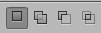
   - **快速选择工具不能设置选取的相加相减相交等。**
2. 选区相减
   - 在绘制选区时，可以按 **alt 键**实现选区的相减。
3. 选区相交
   - 在绘制选区时，同时按 **shift 键和 alt 键实现选区的相交**。
4. 扩大选取和选取相似命令
   - 扩大选取：**只作用于相邻的像素。**
   - 选取相似：**选取相似：不要求相邻，针对图像中所有颜色相近的像素。**
   - 两个命令都是用来扩大选区的范围的，但是用法不同。
   - **都依赖于魔棒工具的“容差”值。**
5. 修改命令
   - 边界
   - 平滑
   - 扩展
   - 收缩
   - **羽化（Shift+f6）**
   - 在绘制选区之前没有添加羽化，可以使用此命令给没有羽化的选区添加一定的羽化效果。
6.  变换选区命令
   - 和自由变换的功能一样，可以实现**选区**的缩放、旋转、斜切、透视、变形等操作，对选择区域内图像的像素没有影响。
7. 调整边缘
   - 可以提高选区边缘的品质，特别适合抠出毛发边缘。使用**调整半径工具**和**抹除调整工具**，可以精确调整边缘

### 将路径转换成选区

1. 路径的构成
   - 路径由**锚点**组成。锚点分**直线点**和**曲线点**。有**开放**路径和**封闭**路径。
2. 绘制直线路径
   - 使用钢笔工具在图像当中通过**单击方式创建直线路径**。绘制路径时要**结束路径**可**按住 ctrl 键单击路径以外的任意处**。
   - **钢笔工具只有 形状和路径** 
   - **ctrl键：临时切换为 “ 直接选择工具 ”**                                    
3. 绘制曲线路径
   - 使用钢笔工具在图像当中按住并**拖拽**绘制曲线路径。**曲线点两侧有控制手柄**
4. 添加锚点
   - 可使用钢笔工具或添加锚点工具**在路径上的没有锚点的位置**单击来完成。
5. 删除锚点
   - 可使用钢笔工具或删除锚点工具**在路径上的锚点的位置单击来完成**。
6. 转换锚点类型
   - 使用转换点类型工具在曲线点上**单击**可将曲线点转换成直线点。
   - 在直线点上单击并**拖拽出方向线**，可以将直线点转换成曲线点。
   - 在使用**钢笔工具时**，**按Alt键**，放在锚点上，可**临时切换为“转换点工具”**。
7. 移动和调整路径
   - 使用**路径选择工具**和**直接选择工具**来完成。**路径选择工具只能选择整条路径**，**直接选择工具可以选择单独的一个锚点和一段线**。
8. 使用自由钢笔工具绘制路径
   - 受到“**曲线拟合**”参数的影响，“曲线拟合”的数字范围为**“0.5~10”**。**数字越大，锚点越少**，形成的路径就越简单。**勾选【磁性】选项**，和磁性套索工具的用法相似。
9. 路径的保存、复制与删除
   - 路径的保存
     - 可以在路径面板的弹出菜单里面选择【**保存路径**】命令；也可以直接**双击**路径面板的某个路径保存路径
   - 路径的复制
     - 将路径**拖拽到新建按钮上完成复制**（注意：**工作路径用此操作是保存**），也可在路径面板的弹出菜单里边选择【复制路径】命令。
   - 路径的删除
     - 将路径拖拽到**垃圾桶图标**上，或者在弹出的菜单里边选择【删除路径】命令
10. 路径和选区之间的相互转换
    - **用路径生成选区**（路径还在）
      - 选中某条路径，在弹出菜单里边选择【建立选区】。**Ctrl+单击路径缩略图。**
    - **用选区生成工作路径**（选区消失）
      - 在弹出的菜单里面选择【**建立工作路径**】命令，可以设置容差值，取值范围为 **0.5~10个像素**。数字越小，生成的工作路径和选区就越接近。
11. 填充路径（同样适用 填充子路径）****
    - 在弹出的菜单中选择【填充路径】命令，可以使用前景色、背景色、图案等内容进行填充。
    - **填充的内容被填充在当前的图层上，是像素。**
12.  描边路径（同样适用 描边子路径）
    - 在弹出的菜单中选择【描边路径】命令，**可以使用。铅笔、画笔、橡皮、涂抹工具**等**进行描边**。**描边在当前的图层上，是像素。**
13. 建立剪贴路径
    - 目的导入到专业矢量图形软件如 AI 里继续编辑。首先选中某**一条已保存的路径**，在弹出的菜单中选择【剪贴路径】。
    - 在“**展平度**”中输入合适的数值。取值范围为 **0.2~100**。**数字越小**，构成路径的**直线片段越多**，**锚点越多**，路径越复杂；**数字越大，越展平，直线片段少，锚点少，路径越简单**。
    - 在Ai软件里看效果，文件格式要求**eps或tiff。**

## 快速蒙版和通道

### 快速蒙版

1. 快速蒙版的定义
   - 快速蒙版就是选区的另外一种表现形态。在图像中已经有一个选区的情况下，可以**单击工具箱中**的【**快速蒙版**】按钮或者按【**Q**】键进入快速蒙版，在**默认状态下，选区变成透明**，**非选区用半透明的红色来蒙盖**。
   - **快速蒙版是一个临时通道。**
2. 快速蒙版的编辑
   - 进入快速蒙版后，只能使用**灰度颜色**进行编辑。
   - 默认状态下，**白色可以使选区扩大**，**黑色可以使选区变小**，**灰色可以使选区变成半透明**。
   - 一般使用画笔来进行编辑。
   - **双击**工具箱中的**快速蒙版按钮**，**可以修改快速蒙版的颜色和不透明度以及被蒙区域和所选区域**。
   - **Alt+单击快速蒙版按钮**：**切换被蒙区域**。

### 通道

1. 通道的定义
   - 通道是用于保存**图像颜色**或**选区**的**灰度图**。一个文件最多有**56个**通道。
   - 一个文件的所有通**道尺寸相同、分辨率相同**。
   - **所有通道**都是**8位的灰度图**
2. 通道的类型
   - 颜色通道
     - 用于保存图像的颜色信息。一个图像颜色通道的数量和图像的**颜色模式**有关。
     - 如 **RGB颜色**模式的图像颜色通道是红绿蓝 **3 个**，**CMYK 颜色**模式的图像有 **4 个颜色通道**，**LAB**颜色模式的图像有 **2 个颜色通道**，L 是亮度通道。
     - 有些颜色模式的图像只有**一个通道**，如**索引颜色模式、灰度模式、位图模式、双色调模式**。
     - **无法改名**、**但可以删除**。**颜色通道的明暗代表该颜色用量的多少，对于RGB来说，越亮表示颜色用量越多；对于CMYK来说，越亮表示颜色用量越少。可以用来调色**
   - 专色通道
     - 专色是用来保存四种原色油墨（CMYK）以外的油墨颜色，在高档印刷领域里边应用。使用添加专色通道的形式添加专色。
     - **专色通道可以合在颜色通道中。**
   - Alpha 通道
     - 可以用来**新建**、**编辑**、**载入（Ctrl+单击通道缩略图）**和**保存选区**。默认状态下，**白色代表选区，黑色代表非选区，灰色代表半透明的选区，可以颠倒**。
     - **Alpha 通道可以转换成专色通道**。
3. 通道的基本操作
   1. 建立专色通道
      - 在弹出菜单中选择【建立专色通道】命令。
   2. 建立 Alpha 通道
      - 在弹出菜单中选择【建立通道】命令或者单击通道面板下面的创建新通道按钮
   3. 复制通道
      - 在弹出菜单中选择【复制通道】或者将通道拖拽到新建按钮上。
   4. 删除通道
      - 将通道拖拽到垃圾桶图标上或者使用弹出菜单中的【删除通道】命令。
   5. 通道的分离
      - 要求图像必须是**一个图层**的文件。**所有的通道**都可以分离，分离出去之后的文件都是**灰度模式**的文件。
   6. 通道的合并
      - **只要是灰度模式文件，图像尺寸和分辨率也相同**，就可以合并成不同颜色模式的图像。
      - 如果要合并的通道的**数量超过 4 个**，**只能合并成“多通道”模式**的图像。在弹出菜单里面选择【通道合并】命令。 

## 图层的应用

### 图层的基本概念

1. 图层的定义
   - 可以将图像的不同部分**分层存放**，并由所有的图层组合成**复合图像**。对于一幅包含多图层的图像，可以将其形象的理解为**叠放在一起的胶片**。多图层图像的最大优点是**可以对某个图层做单独处理**，而**不会影响**到图像中的**其他图层**。

### 图层的类型

1. 背景图层
   - 背景图层里边是**像素**。
   - 永远是图层面板里边**最下面**的图层。
   - 背景图层**锁定**了**透明和位置**，并没有锁定图像编辑，背景图层不允许有透明像素。
   - **双击**背景图层，可以将背景图层**转换成普通的图层**。
2. 图像图层
   - 也称为像素图层、普通图层。
   - 由**像素**构成，**拥有透明像素**。**能**够**执行所有的图层命令**。
3. 文字图层
   - 具有**矢量**特征，不是像素。不能对其直接使用滤镜命令。不能使用像素类工具编辑，除非**栅格化为**像素图层。文字图层**可以编辑**文字的基本属性。比如字体，字号，颜色等。  
4. 填充图层
   - 是**矢量**类型的图层。分**纯色**填充，**渐变**填充和**图案**填充。创建填充图层时**自带图层蒙版**。
   - 也可以设置图层的不透明度，混合模式等。
5. 调整图层
   - 用来调整图像的明暗和颜色的。此图层里边**没有实质内容**。默认状态下可以**调整它下面所有图层**的颜色。也可以通过创建剪贴蒙版的方法调整其下面的一个图层。是非破坏性编辑思路。也可以设置图层的不透明度，混合模式等。
6. 智能对象
   - 智能对象就像一个有弹性的容器，里面可以**包含像素和矢量**信息。任意缩放变形不失真。是非破坏性编辑思路。
7. 形状图层
   - **矢量**内容，可以设置**填充内容和描边**。**无法使用像素类工具**去编辑。本质上就是带有矢量蒙版的填充图层。使用形状工具组、钢笔工具创建。

### 图层的基本操作

1. 创建新图层
   - 单击**图层面板下**的创建新图层**按钮**
   - **Ctrl+新建按钮**：在当前图层下方直接新建图层
   - 在**弹出的菜单**中选择【新建图层】命令
   - 在**图层菜单**中选择【新建-图层】命令
   - 通过**复制、粘贴**的方法创建新图层
   - 通过**移动图像**的方法创建新图层
   - 快捷键**Ctrl+Shift+N**：**弹出对话框，新建图层**
   - 快捷键**Ctrl+Shift+Alt+N**：在当前图层上方直接新建图层
2. **特殊的双向操作**
   - 【图层】【新建】【背景图层】：把背景层转换为普通图层
   - 【图层】【新建】【图层背景】：把所选图层转换为背景层
3. 图层的编辑
   - **显示与隐藏** ：使用眼睛图标控制。按**Alt**单击眼睛，只显示当前图层。
   - **选择当前图层**：可以选择一个或多个。 **Ctrl不连续多选**，**Shift连续多选**。
   - **复制图层**：多种方法复制------将**图层拖拽至新建**按钮或者使用快捷键 **Ctrl+J**；在**弹出菜单**中选择【复制图层】命令；在**图层菜单**中选择【复制图层】命令。
   - **删除图层**：将图层**拖拽到垃圾桶图标**；在**弹出的菜单**中选择【删除图层】命令；在**图层菜单**中选择【删除-图层】命令；直接按 **delete 键**。
   - **移动图层**：**使用移动工具**来移动图层或者使用方向键每次移动一个像素，移动时按 **shift 键**加方向键可以使图层每次移动 10 像素。
4. 图层的锁定
   - （1）锁定**透明**：透明像素不能编辑，但是有像素的部分可以编辑。 
   - （2）锁定图像的**编辑（锁定图像像素）**：透明像素和图像都不能编辑。 
   - （3）锁定图层的**移动** ：图层不能移动。
   - （4）锁定**全部**：啥也干不了。****
5. 图层的对齐与分布
   - 图层的对齐
     - 选中**两个或两个以上**的图层，可以实现**左对齐，右对齐，居中对齐**等。 
   - 图层的分布
     - 选中**三个或三个以上**的图层，让他们的间距按照某种方式平均分布。
6. 改变图层的顺序
   - （1）可以使用鼠标**直接拖放**，实现改变图层的顺序。**背景图层总是最下面**。
   - （2）也可以使用【图层-排列】里面的相关命令改变图层的顺序。如【上移一层】，【下移一层】，【至于顶层】等。快捷键：**Ctrl+【、Ctrl+】**
7. 图层的合并
   - 向下合并
     - 将当前选定的**一个图层**和下面的一个图层合并。 **Ctrl+E**
   - 合并图层
     - 将当前选定的**多个图层**合并成一个图层。**Ctrl+E**
   - 合并可见图层
     - **合并图层面板当中所有的可见图层**，**保留隐藏的图层**。 **Ctrl+Shift+E**
   - **拼合图像**（后果很严重）
     - 如果有**隐藏图层将删除**，并将所有的**可见图层合并成背景层**。
8. 图层的修边（不重要）
   - 颜色净化
   - 移去白色杂边
   - 去边
   - 颜色净化
9. 图层组
   - 单击图层面板下面的 【创建新组】 按钮。
   - 在弹出菜单里面选择 【新建-组】 命令。
   - 在图层菜单中选择 【新建-组】 命令。
   - **选中多个图层**。在**图层菜单中选择【图层编组】**命令。**Ctrl+G**
   - 删除：仅组、组和内容

### 剪贴蒙版

1. 定义
   - 使用底层的透明像素蒙盖它上面的图层形成剪贴蒙版的效果。
2. 方法
   - 至少需要**两个图层**，有透明像素的图层（约束显示范围）放在下一层。
   - 方法一：在两个**图层中间**的细线处**按住 alt 键单击**，形成剪贴蒙版。
   - 方法二：**选中上面的图层**，执行【图层】【创建剪贴蒙版】命令。
   - 释放剪贴蒙版和创建剪贴蒙版的“方法一”一样；也可以在图层菜单下选择释放剪贴蒙版命令。

### 图层蒙版

1. 定义
   - 图层蒙版相当于一个**八位灰阶**的 **Alpha 通道**。黑白灰、选区的另一种形式。
   - 功能是用来显示、隐藏和半透明显示它下边的图层的。
   - 图层蒙版是**基于像素**的。如果先创建选区，然后添加蒙版，默认情况下，**白色部分表示选区内，黑色部分表示选区外，灰色部分表示半透明选区**。
2. 创建方法
   - 1.单击**图层面板下**的添加蒙版按钮，**创建的蒙版是白色（显示全部）**的，如果按住 **alt 键**，则**黑白颠倒**，**单击此按钮创建的是黑色的蒙版（隐藏全部）**。如果在有选区的情况下创建蒙版，**选区内是白色的**，**选区外是黑色的**。
   - 2.执行【图层-图层蒙版-显示全部】这个命令，生成的是白色蒙版。执行【图层-图层蒙版-隐藏全部】这个命令，生成的是黑色蒙版。
   - 3.图层与蒙版是**链接**的，单击链接图标可解开链接，可单独选中蒙版进行移动。
3. 删除方法
   - 将图层蒙版拖拽到垃圾桶图标上。
   - 执行【图层-图层蒙版-删除】命令。
4. 停用（暂时关闭）方法
   - 按住 **shift 键**在**图层蒙版的缩略图上单击**，**出现“红色叉号”**，**再次单击，图层蒙版启用**
   - 执行【图层-图层蒙版-停用】命令。
   - 【蒙版】面板也可停用/启用。
5. 应用蒙版
   - **功能**：用蒙版轮廓裁剪图层，蒙版删除。
   - 单击**蒙版属性面板**下面的应用蒙版按钮，或者在**蒙版缩略图上右键**，在弹出的菜单中选择【应用蒙版】命令。
   - 当图层中分别有图层蒙版和矢量蒙版时，应当分别应用。
   - **当图层为智能对象时可以创建蒙版，但无法应用。**
   - **滤镜蒙版**，**不能应用蒙版**。

### 填充图层

1. 特点 
   - 填充图层是**矢量**信息，在**栅格化之前**不能使用像素工具编辑。填充图层有**纯色**、**渐变**和**图案** 3 种。填充图层**自带蒙版**。
   - 也可以设置图层的不透明度，混合模式等。
2. 建立方法
   - 单击图层面板下面的【添加新的填充和调整图层】 按钮。
   - 执行【图层-新建填充图层】命令创建。

### 调整图层

1. 特点
   - 调整图层是用来调整图像的**明暗和颜色**用的。
   - 里面并**没有实质的内容（既不是矢量，也不是像素，不能栅格化）**。
   - 对图层色彩和明暗的调整，是一种**非破坏性的编辑**，和【图像-调整】命令有本质的区别。
   - 默认情况下调整图层对**下面所有的图层起作用**（而填充图层没有此功能）。调整图层**自带蒙版**。也**可以设置**图层的**不透明度，混合模式**等。****
2. 建立方法
   - 和创建填充图层的方法一样。
   - 利用调整面板也可以添加调整图层

### 智能对象

1. 定义
   - 智能对象就像一个有弹性的容器，可以在其中嵌入**像素**或**矢量**数据。**对智能对象进行**任意的**缩放**，**旋转**以及图层**变形**等**不会影响智能对象的清晰度**。
2. 建立方法
   - 在图层右侧空白处单击**鼠标右键**，执行【**转换为智能对象**】命令。智能对象在进行自由变换时，中间是**交叉线**。

## 文字图层

### 特点

1. 文字图层**不是像素**，具有**矢量**特征。因此不能使用像素类工具编辑文字。也不能直接使用滤镜命令。
2. **可以栅格化**。
3. **可以添加图层样式。**
4. **可以添加图层蒙版，矢量蒙版。**
5. **可新增文字图层（位图、索引、多通道模式除外）。**

### 种类

1. 点文本
   - 点文本适合少量的文字输入，**不会自动换行**，可以使用**回车键强制换行**。用文字工具在图像上**单击**。
2. 段落文本
   - 段落文本适合大量文字的输入，可以自动换行。用文字工具在图像上**拖拽出文字框**。文字框可以**变换**（**缩放、旋转、斜切、变形**）。
   - **缩放时按Ctrl键，字号也会缩放**（**所以透视和扭曲无法使用**）

### 建立

1. 使用**文字工具**创建。文字工具包括横排文字工具、直排文字工具、横排文字蒙版工具和直排文字蒙版工具。其中**横排文字工具和直排文字工具**可以得到**文字图层**；**横排文字蒙版工具和直排文字蒙版工具**得到的是**选区**。
2. 在图像上直接**单击**输入文字，得到的是**点文字**。在输入前**绘制**一个输入框，得到的是**段落文字**。
3. 结束文字输入的方法
   - **主键盘：Ctrl+Enter**
   - **数字小键盘：Enter**
   - **更换工具、在面板空白处单击**

### 修改

1. 可修改的属性
   - **没栅格化之前**文字图层在进入编辑状态的时候，**可以修改选定文字的颜色，字体，字号等。还可以修改文字的对齐属性**。
   - 使用文字工具修改，可以选择部分文字，也可以选择整个文字图层。
2. 字符面板
   - 利用字符面板可以**修改文字的字体，字号、行间距、字间距、是否加粗、倾斜等**属性。
3. 段落面板
   - 利用段落面板可以**修改文字的对齐方式**。如**左对齐，居中对齐，右对齐、最后一行左对齐，最后一行居中对齐，最后一行右对齐，全部对齐**等。
4. 修改颜色的方法
   - **选中要修改的文字，有三种方法可以改。**
     - (1) 单击工具箱中的前景色，在拾色器中修改。
     - (2) 使用填充快捷键（alt+backspace 或者 ctrl+backspace。）
     - (3) 利用工具选项栏中的【设定文字颜色块】进行修改。
   - **如果选中整个文字图层，只有两种方法可以修改。**
     - (1) 使用填充快捷键（alt+backspace 或者 ctrl+backspace。）
     - (2) 利用工具选项栏中的【设定文字颜色块】进行修改。
5. 弯曲变形
   - **15 种变形效果**，和自由变换里边的变形是一样的。**有两种情况文字图层不能变形**：一是加了**仿粗体**，二是使用了**点阵字字体**。对**整个文字图层**起作用。
   - **执行【变形】操作后**，文本框就**不能变换**。 
6. 文字转换
   - 文字方向（**横竖**）和类型（**点文字和段落文字**）**可以转换**；
   - 文字也可以**栅格化**成像素图层。
   - 可以**生成工作路径（调整修改路径对文字图层无影响）**。
   - 可以**转换成形状图层** 文字图层变为形状图层。
7. 在路径上书写文字
   - 使用**钢笔**工具或**形状**工具。在图像中**绘制一条路径**。然后使用横排文字工具或者直排文字工具在路径上单击，可以**沿着路径输入文本**。
   - **钢笔工具**可以绘制 **形状和路径**
   - **形状工具**可以绘制 **像素，形状，路径**

## 图层样式

1. 种类
   - 图层样式共有 **10 种**效果。2 个阴影（**投影、内阴影**）；两 2 个发光（**外发光、内发光**）；3 个叠加（**颜色叠加、渐变叠加、图案叠加**）；**斜面与浮雕；光泽；描边。**
   - 对**像素图层、文字图层、形状图层、填充图层、调整图层、智能对象都添加图层样式**。
2. 添加方法
   - 根据图层面板下面的 **fx 按钮**，选择某种图层样式。
   - 双击**图层右侧空白处**，**弹出图层样式面板**。
   - 执行【**图层-图层样式**】命令，选择某种图层样式。
   - 可以在**样式面板**当中单击某一种样式直接应用给图层。
   - 拷贝图层样式、粘贴图层样式。
3. **填充不透明度**只**影响图像中原有的像素或绘制的图形**，**不透明度**只**影响图层样式带来的新像素**

## 矢量图形和矢量蒙版

### 形状图层

1. 形状图层是**带图层矢量蒙版的填充图层**。
2. 形状图层包括**描边**和**填充**的内容。
3. 都可以设置**无，纯色，渐变**和**图案**。

### 形状工具

1. 矩形工具
   - 使用方法和矩形选框工具的方法一致，只不过得到的是形状图层。
   - **形状工具**可以绘制 **像素，形状，路径**
2. 圆角矩形工具
3. 椭圆工具
   - 使用方法和椭圆选框工具的方法一致。
4. 多边形工具
   - 绘制多边形的时候，注意勾选**星型、平滑拐角，平滑缩进**。
5. 直线工具
   - 在绘制直线之前，首先设置宽度信息代表直线的**粗细**。勾选**起点**和**终点**，**直线将带有箭头**。**“凹度”** 取值范围：**-50%~50%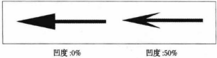**
6. 自定形状工具
   - 选择自定形状工具。可以在自定形状库中选择预设的形状，也可以把绘制好的矢量形状存储为自定形状。
7. 形状的运算法则
   - 新建图层、合并形状、减去顶层形状、与形状区域相交、排除重叠形状、合并形状组件。

### 矢量蒙版

1. **使用钢笔工具或形状工具**来进行**创建路径**，并且**只能通过与路径有关的操作进行修改和编辑。**
2. 可以将图层矢量蒙版**栅格化**成图层蒙版。

## 图像的调色

### 调整图像的色调（明暗调整）

1. 亮度\对比度
   - 可以简单的调整色调范围，**增加对比度可以使图像当中亮的更亮，暗的更暗**，反之**明暗之间的反差会变小**。
2. 色阶（Ctrl+L）
   - 默认状态下调整**复合通道**，可以**调整图像的明暗。**
   - 对话框中包括**输入色阶**和**输出色阶**两部分。输入色阶有**黑场滑块**，**白场滑块和灰场滑块**。**黑场滑块向右调整，图像变暗，白场滑块向左调整，图像变亮**。**灰场滑块向左调整，图像变亮；灰场滑块向右调整，图像变暗。**
   - 可以对**单个颜色通道**进行调整，此时**是调色**。
   - 可以使用**吸管工具指定黑场，白场和灰场**。
   - 有 4 种自动调整的算法：**增强单色对比度；增强每通道的对比度；查找深色与浅色；增强亮度与对比度**（默认）。
3. 曲线（**CTRL+M**）
   - 曲线命令**可以调整灰阶曲线中的任何一点**。默认状态下调整**复合通道**，可以调整图像的明暗。也可以对**单个颜色通道**进行调整，此时是调色。
   - 是整个调色里**最精确**的一个命令。
   - **横轴**表示图像**原来的亮度值**，**纵轴**表示**新的亮度值。**
   - **RGB 颜色模式和 CMYK 颜色模式曲线的弧度正好相反**。**RGB 颜色模式中**，**曲线向左上**。**图像变亮**，**曲线向右下**图像**变暗**。**CMYK 颜色模式**正好**相反**。
   - **S 型曲线**可**增大图像的对比度**。
   - 在**曲线中**可以实现**反相**的功能。
4. 曝光度（不重要） 整体调亮或者调暗。

### 调整图像的颜色（色彩调整）

1. 色彩平衡（**CTRL+B**）

   - 可以**改变彩色图像中颜色的组成**，对图像进行**粗略的调整**。**不能调整图像的明暗**。调整时可以使图像中的灰色带有色彩。
   - 可分别调整不同色调（**阴影、中间调、高光**）的颜色构成。
   - 包含“**色彩平衡**”和“**色调平衡**”两部分。              

2. 色相/饱和度（**Ctrl+U**）

   - 可以改变图像中的**色相**、**饱和度**和**明度**信息。如果**饱和度设置为最小值**，图像变成**灰度**效果。
   - 勾选【**着色**】，可以**设置单色效果。**                         

3. 自然饱和度：**防止出现图像过度饱和或没有颜色的现象。**

4. 匹配颜色（必须RGB）

   - **将一个图像的颜色与另一个图像相匹配**至少需要打开两张图片。**或者将一个图层与另一个图层相匹配**。只能用在RGB模式的图像。

5. 去色（**Ctrl+shift+U**）

   - 将**彩色图像处理成灰度效果图像**，**不改变图像的颜色模式**。保留图像的原始的亮度信息。**对图层样式的颜色不起作用。对矢量图层不起作用**。

6. 黑白

   - 将**彩色图像处理成灰度效果图像**，**不改变图像的颜色模式**。**可以调整原图像中某种颜色在灰度图中的明暗**。**比去色命令高级**。也可以**将彩色图像转换成单色图像**。

7. 通道混合器

   - **可以分通道来调整图像的颜色，可调整的通道是图像的颜色通道。**

8. 可选颜色

   - 可以分通道来调整图像的颜色，可调整的通道较多。

9. 渐变映射

   - 将相等的图像灰度范围映射到指定的渐变填充色上。

10. 照片滤镜

    - 可将照片处理成暖色调（加温滤镜）和冷色调（冷却滤镜）。

11. 阴影/高光

    - **提高阴影部分的光线亮度。降低高光部分光线的亮度。**

12. 反相（**Ctrl+I**）

    - **将照片处理成负片（颜色相反）的效果。**

13. 色调均化

    - **重新分配图像中各像素的像素值。平均所有的亮度值，可提高图像的对比度。**

14. 阈值

    - **将彩色或者灰度照片处理成**高对比度的**黑白图**。

15. 色调分离

    - 可以定义图像中色阶的数量。当用于**灰度图像**时，**色阶设定为 2** 时，**图像是黑白两色**，**和阈值的效果一样**。

16. 变化

    - 可选择调整区域。

    - 可调整图像的**色彩平衡**、**亮度**和**饱和度**。

    - 提供多种调整后的**预览缩略图**。

      

## 滤镜

### 滤镜

- **滤镜只对普通像素图层起作用**，文本图层，形状图层， 填充图层，矢量蒙版要先转换为普通图层。
- 所有的滤镜命令**都能作用于（RGB）颜色模式**的图像，而**不能作用于（ 索引  ）颜色模式**的图像。
- 滤镜的种类
  - 滤镜组
  - 滤镜库
  - 特殊滤镜
  - 智能滤镜
  - 外挂滤镜（网上下载，安装）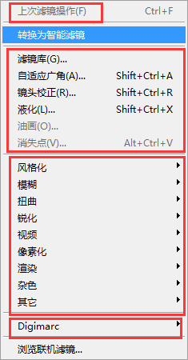
- 重复使用滤镜
  - 注意：如果在使用一次滤镜后，效果不理想，可以按**Ctrl+F**组合键，**重复使用滤镜**。

### 滤镜组

1. 风格化滤镜组
   - 扩散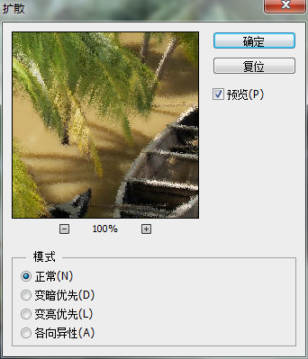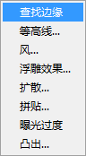
   - **浮雕效果**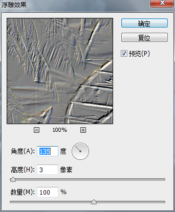
   - **风**
     - 三种方法：风、大风、飓风
     - 两个方向：从右、从左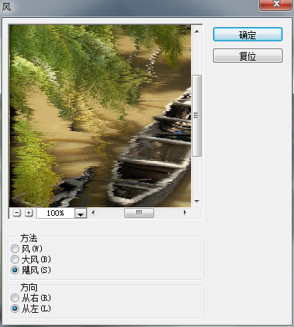
   - **凸出：金字塔和块状**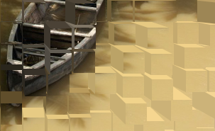
   - 查找边缘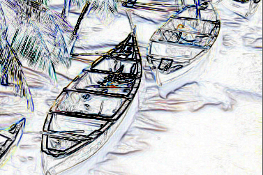
   - 曝光过度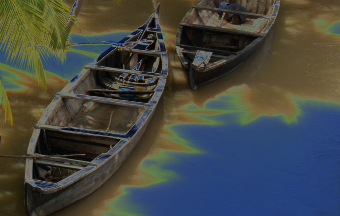
   - **拼贴**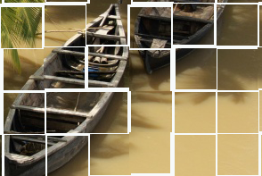
   - 等高线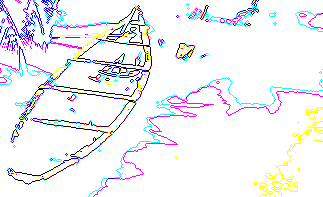
   
2. **模糊滤镜组**
   
   - 模糊：模糊程度小。
   - 进一步模糊：模糊程度大。
   - 高斯模糊：模糊程度可以调整。
   - **特殊模糊**：模糊的同时**保持边缘的清晰**。可以做出**卡通效果**。和“**表面模糊”相似**。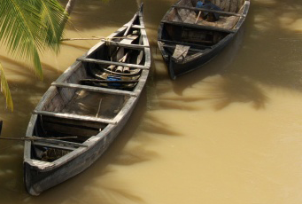
   - **径向模糊**：方法有**缩放**和**旋转**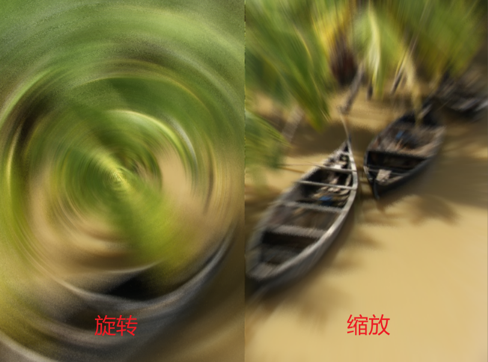
   - **动感模糊**：能看出模糊方向（**直线**）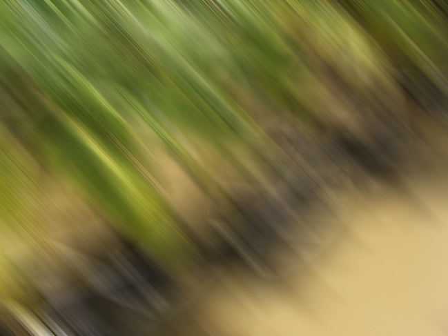
   - 镜头模糊
   - 形状模糊
   - 方框模糊
   - **表面模糊**：**和“特殊模糊”相似。**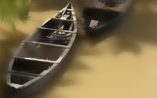
   - **平均**：**计算出图像中的平均颜色，并满图填充。**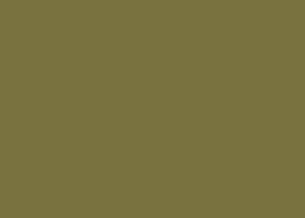
   - 场景模糊、光圈模糊、倾斜偏移（属于**照片模糊画廊**）**虚实对比，分区域模糊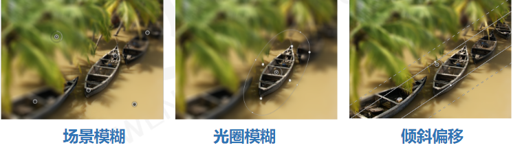**
   
3. 扭曲滤镜组（使图层产生明显形变）
   - 扩散亮光 （滤镜库）
   
   - **波浪（三种类型：正弦、三角形、方形 ）** 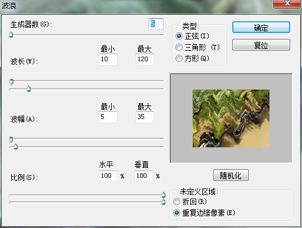
   
   - **波纹**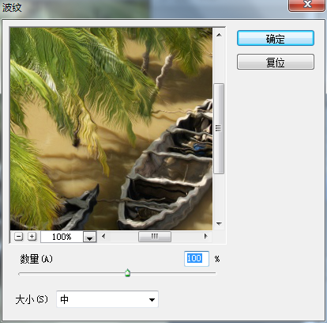
   
   - 海洋波纹 （滤镜库）
   
   - 玻璃 （滤镜库）
   
   - **挤压（-100%-100%） 负数：中间膨胀  正数：中间挤压**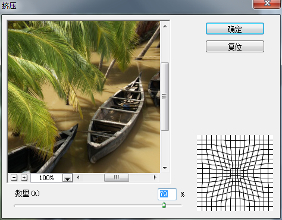
   
   - 切变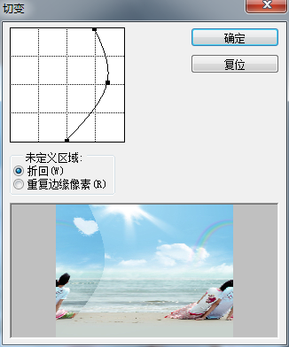
   
   - **极坐标** 有两种方法：**平面坐标到极坐标，极坐标到平面坐标**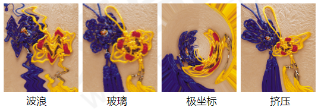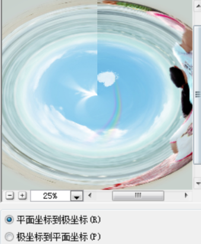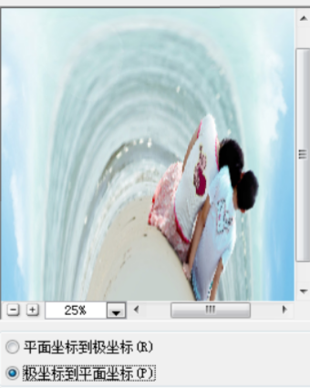
   
   - **球面化（范围：-100%-100%，负数：中间收缩，正数：中间球面化）**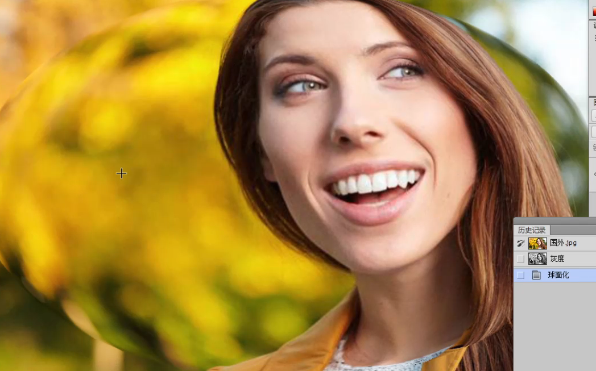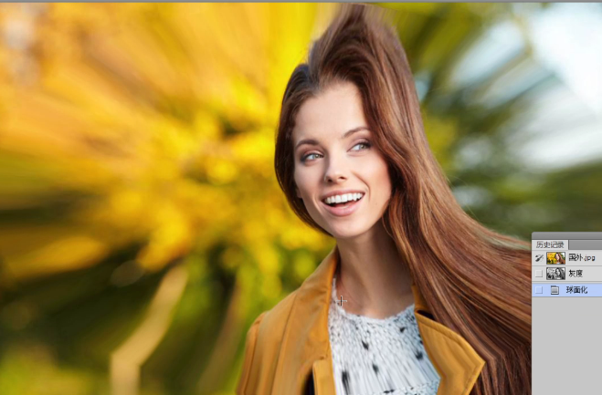
   
   - **置换**（**用一个PSD文件**）
   
   - **旋转扭曲** 旋转扭曲的幅度：**-999-999 度**
   
   - **水波** 三种样式：**围绕中心、从中心向外、水池波纹**
   
     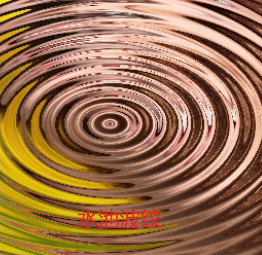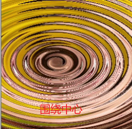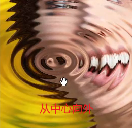
   
4.  锐化滤镜组（可以使图像的局部反差增大，提高图像的清晰效果）
   - 锐化 ：力度小
   - 进一步锐化：比锐化的力度大
   - 锐化边缘 ：只提高边缘的反差，强调颜色边缘
   - USM 锐化 ：对图像的细微层次进行清晰度强调，原理是两种颜色相交时不改变颜色本身。只是将其交线变得清楚一些。
   - 智能锐化：比 USM 锐化锐化更高级一些，可单独控制图像阴影和高光的锐化程度。
   
5. 像素化滤镜组（ 作用是将图像以其他形状的元素重新再现出来）
   - **彩色半调**
     - 将图像中所有颜色用黄、品红，青和黑四色网点的相互叠加进行再现的效果。都是圆圈，圆圈的大小随机（圆的直径有上限）。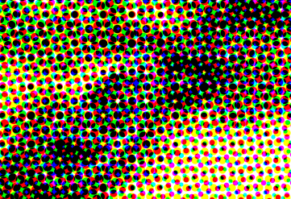
   - 彩块化：没有对话框，将相近的颜色合并，使这些颜色变化平展一些。
   - **晶格化**：产生大小不一，形状不一，不同颜色的几何图形（**多边形**）。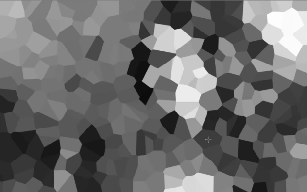
   - 铜版雕刻：以各种**点**和**线**再现图像。
   - **马赛克**： 产生像素块效果，像素块（**正方形**）大小可调整。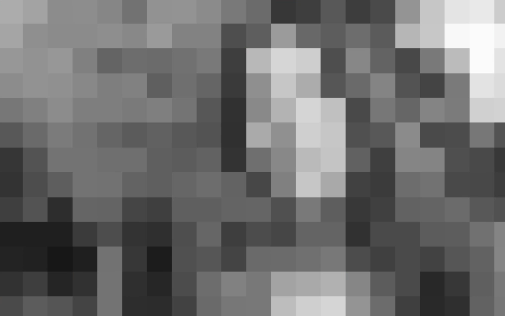
   - **点状化**：和晶格化效果类似（**圆形，与其它点相连处是直边**）。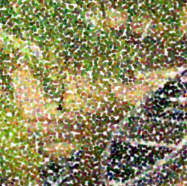
   - 碎片 ： 没有对话框（模拟玻璃碎片观察效果）。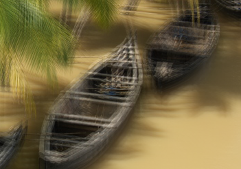
   
6. **渲染滤镜组**
   
   - **云彩**
     
     - 把前景色和背景色混合，形成柔和的云彩的纹理，将原图内容覆盖。
     - 按住 **alt 键**执行此命令将**得到对比分明、生硬的云纹图案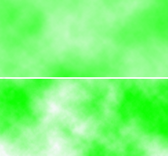**
     
   - **分层云彩**
     
     - 把前景色和背景色混合，形成云的纹理，并和底图以“**差值”**方式合成。
     - 和黑色混合，混合色没有变化，和白色混合得到反相的效果。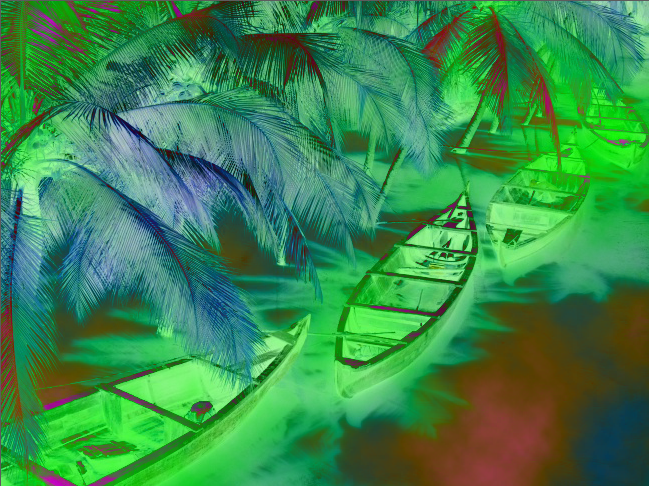
     
   - **纤维**
     
     - 用前景色和背景色创建**编织纤维的外观**。可调整差异和强度两个参数。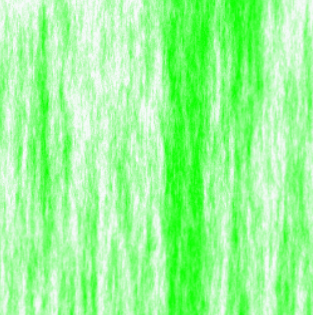
     
   - **镜头光晕**
     
     - 产生一种透镜接受光照时形成的光斑，模拟日光的效果。不同类型的镜头效果不同。
     
     - 亮度：10%~300%
     
       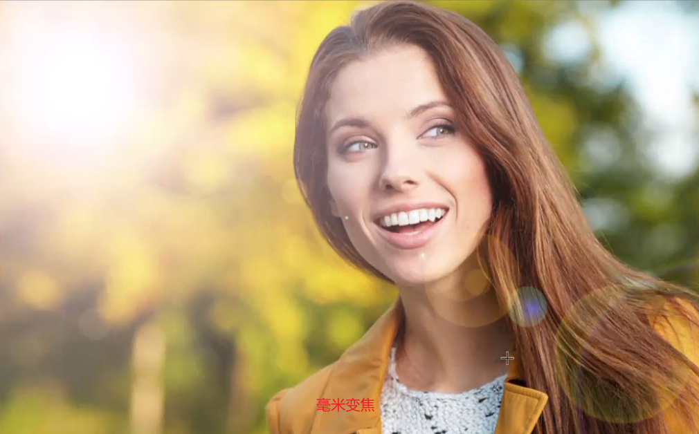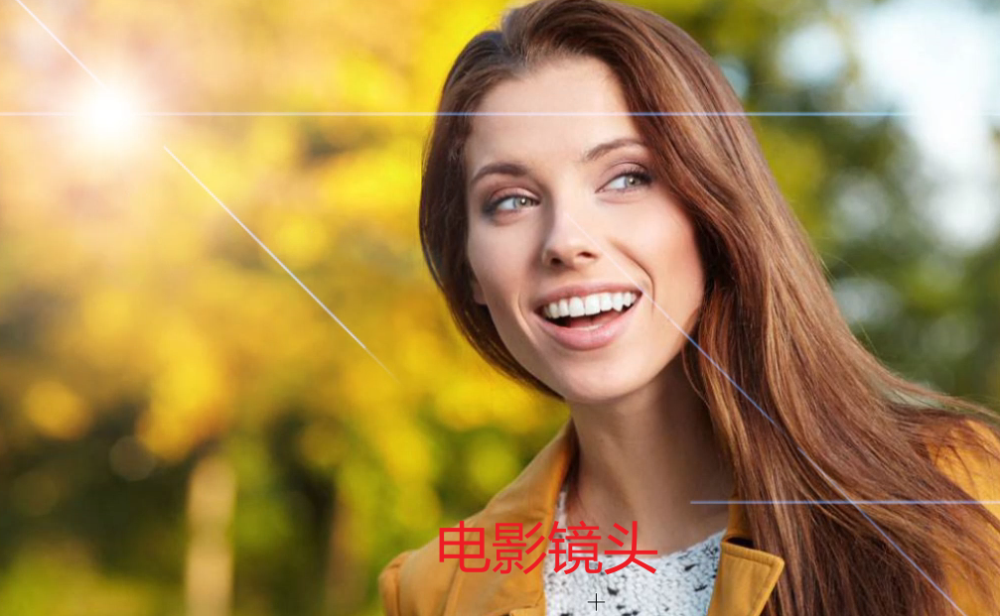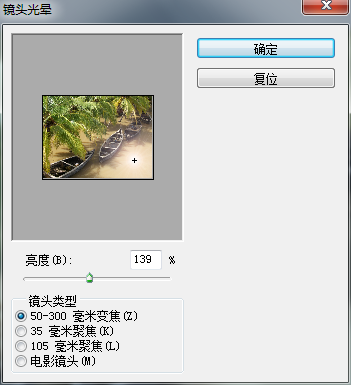
     
   - **光照效果**
     
     - **【光照效果】滤镜只在 RGB 模式图像应用。**
     - 模拟光源照射在图像上的效果。光源分**点光**、**聚光灯**和**无限光**。图像中可添加任意多个灯光。灯光的发光强度、发光范围等参数可以调整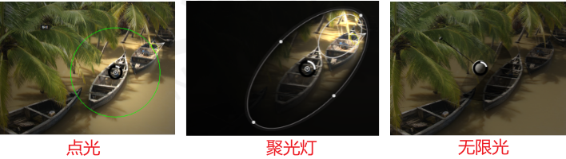
   
7.  杂色（**是一些颜色随机分布的像素点**，也称之为**噪点**。**可以增加和减少杂色**）
   - 添加杂色：在图像中添加一些随机分布的噪点。
   - 去斑：可去除图像中有规律的杂色或噪点。
   - 蒙尘和划痕：去除图像中没有规律的噪点和划痕。
   - 中间值：同样可去除图像中的杂点和划痕。
   - 减少杂色：可去除图像中杂色以及消除 JPEG 存储低品质图像导致的斑驳效果。
   
8. 其他
   - 高反差保留：保留色彩变化最大的部分，也就是保留边缘。
   - 最大值：强调图像中较亮的像素，扩大白色区域。
   -  最小值：强调图像中较暗的像素，缩小白色区域。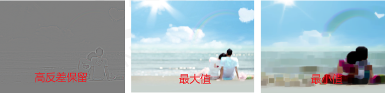

### 嵌入及读取水印

- 是 Photoshop 唯一一个第三方厂商滤镜，本质上属于**外挂滤镜**，但是随 Photoshop 一块儿安装。用于嵌入水印制作版权保护。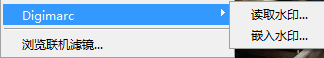

### 滤镜库

- 可**积累应用**滤镜，并可**多次应用**单个滤镜。还可以**重新排列**滤镜，并**更改**已应用的每个滤镜的**设置**，以便实现所需的效果。**重新排列**滤镜效果**可显著改变图像的外观**。可以**隐藏**某个滤镜图层或**删除**某一个滤镜。

1. 艺术效果
   - 主要表现不同的**绘画效果**，通过模拟绘画时使用的不同技法得到各种精美艺术品的特殊效果。包括彩色铅笔、木刻、干画笔、胶片颗粒、壁画、霓虹灯光、绘画涂抹、调色刀、塑料包装、海报边缘、粗糙蜡笔、涂抹棒、海绵、底纹效果、水彩。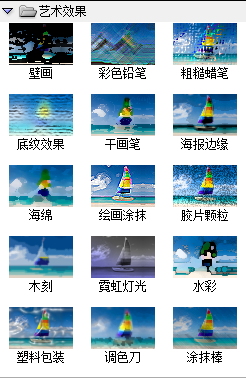
2. 画笔描边
   - 模拟绘画时各种笔触技法的运用。
   - 包括强化的边缘、成角的线条、阴影线、深色线条、墨水轮廓、喷溅、喷色描边、烟灰墨。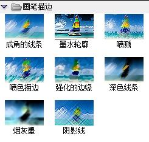
3. 素描
   - 使用当前前景色和背景色的变化来渲染效果。最终得到的图像**往往是一幅单色画面**。包括基底凸现、粉笔和炭笔、炭笔、铬黄、碳晶笔、绘图笔、半调图案、便条纸、影印塑料效果、网状图章、撕边、水彩画纸。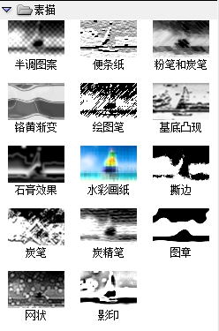
4. 纹理
   - **生成一些纹路的变化**。产生一种将图像制作在某种材质上的质感变化。包括龟裂纹、颗粒、马赛克拼贴、拼缀图、染色玻璃、**纹理化（类型：砖型、粗麻布、砂岩、画布）**。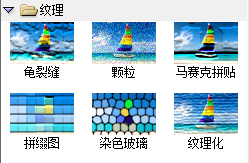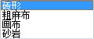

### 特殊滤镜

1. 液化
   - **可以对像素进行类似液化效果的变形**。如旋转扭曲，收缩，膨胀等。
   - **向前变形**工具 ： 向前推动像素。按Alt键：相反功能
   - **重建工具** ：修复图像。
   - **顺时针旋转扭曲工具** 按Alt键：相反功能
   - **褶皱**工具 按Alt键：相反功能
   - **膨胀**工具 按Alt键：相反功能
   - **冻结工具** ： 绘制可保护的图像区域，以免被编辑。
   - **解除冻结工具** ：可将冻结的区域解除保护
2. 消失点（不重要）
   - 创建在**透视**的角度下编辑图像，允许在包含透视平面的图像进行透视校正编辑。
3. 镜头校正（不重要）
   - 可**修正**常见的**镜头缺陷**，如桶状和枕状扭曲等。
4. 自适应广角（不重要）
   - 可将全景图或使用鱼眼和**广角镜头**拍摄的照片中的**弯曲线条拉直**。
5. 油画（不重要）
   - 创建油画的效果。

### 智能滤镜

1. 应用于**智能对象**，**对任何智能对象使用的滤镜都是智能滤镜**。智能滤镜出现在**图层面板**中智能对象图层的下方。智能滤镜不会破坏图像中的像素，是**非破坏性的**。在创建智能滤镜之前，首先要将图层**转换成智能对象**。
2. 相关操作
   -  **重新排列**智能滤镜：用鼠标**拖拽**。
   - **编辑**智能滤镜：双击智能滤镜名称，在弹出的对话框中**修改参数**。
   -  **隐藏**智能滤镜：**单击眼睛图标**。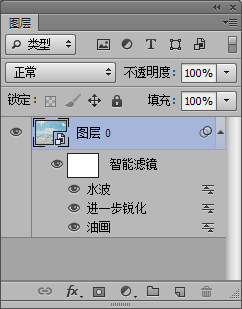

## 网页图像的制作

### 图像的切片

- 切片的目的是把一张大的图像切成若干个切片，每一个切片都可以保存一个文件，这样在制作网页的时候，可以把这些切片图片用表格定位形成一个完整的图片，在加载网页的时候，可以**一片一片的载入**。

- 切片方法
  1. 使用切片工具进行切片
     - 使用切片工具时，可以在图像中绘制**任意大小、任意数量**的切片，切片的**形状是矩形**。每一个切片都可以单独设置属性，**可以为其添加超链接**。切片分为**用户切片**和**自动切片**，**自动切片可以提升为用户切片**。
  2. 借助参考线进行切片
     - 首先将图像的**标尺**调出来，然后从标尺中拖动多条横竖的**参考线**，划分多个区域。单击**切片工具**选项栏中的【基于参考线的切片】按钮，即可完成切片。

### 动图的制作

- 动图的原理是利用人眼的视觉暂留特性，快速的播放多帧不同的画面，就形成了动图。保存动图时，必须将图片保存为 **GIF 格式**。**用【时间轴】面板制作**。
- 动图的种类
  1. 逐帧动画
     - 每一帧画面都是相似的内容，把这些画面连续播放形成了动画。
  2. 过渡帧动画
     - 利用两帧画面的**位置、不透明度和效果**参数的不同，在两帧画面之间自动插入若干个过渡帧形成动画。（**不支持颜色、大小、角度**）

### 网页图片的保存优化

- 在文件菜单中选择【**存储为 web 所用格式**】，弹出【图像优化保存】窗口。图像优化保存的**目的是**尽可能的将图片**存储空间变得小一些**，这样能在网页中快速加载。
- 优化保存文件的格式有 **GIF、JPEG、PNG-8、PNG-24、WBMP**。
- PNG-8 和 GIF 格式类似，最多能保存 256 种颜色。PNG-24 颜色数量较多，保存后的文件较大。
- WBMP 是黑白两种颜色，不常用。

