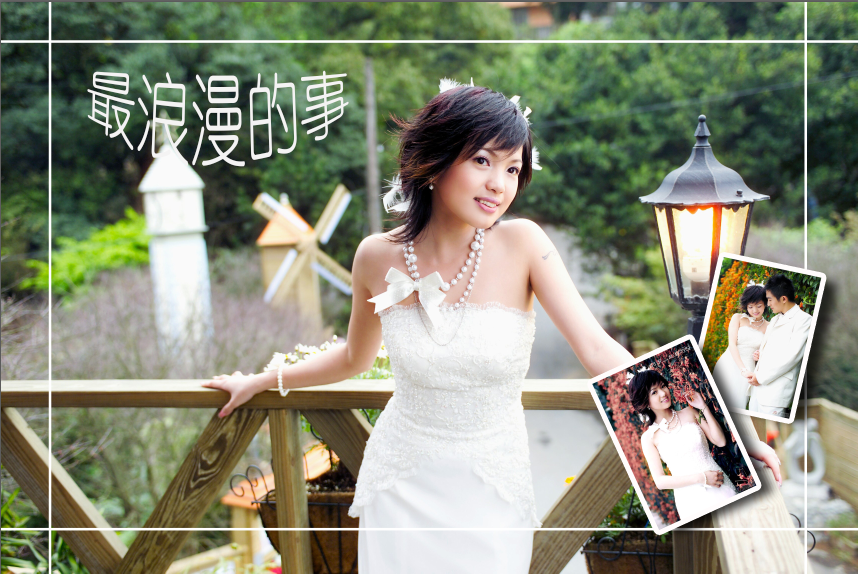

# 简答题

1. 简述 Photoshop 软件的**基本功能**。
   1. **绘图功能**(利用**绘图工具、路径、形状工具等绘制图像**)
   2. **图像基本编辑**(**对图像进行复制、放大、缩小、旋转、裁剪等操作**)
   3. **修图**(利用**修图工具**如**仿制图章工具、修复画笔工具、修补工具、污点修复工具**等**将图片中的瑕疵修掉**)
   4. **调色**(**利用各种调色命令或者调整图层对图像和图层的色彩和明暗进行调整**，达到自己想要的效果)
   5. **合成**(利用Photoshop的众多工具，**将要合成的各个图像通过叠加、拼接、虚化、透明、抠图、混合、修饰和调色等操作，最终处理成一幅新的完整的图像**。)
   6. **特效制作**(**通过综合应用各种滤镜菜单，命令和工具**，后期再添加一些必要的元素和创意**完成特殊效果**。)
   7. **动画功能**(Photoshop**可以制作简单的GIF动画**)
   
2. 简述**数字图形图像的类型**及其各自**特征**。
   - **类型**：**矢量图和点阵图**
   - 各自特征：
     - **矢量图又称向量图**，是由一些用**数学方式描述的曲线组成**，其**基本组成单元是锚点和路径**。**以线条和色块为主**。矢量图**与分辨率无关**，**不论放大和缩小多少**，矢量图的**边缘都是平滑**的。可以将它**设置为任意大小**。 
     - **点阵图(像素图)也叫位图**，它是由**许多单独的小方块组成的**，这些小方块又**称为像素点**，每个像素点都**有特定的位置和颜色值**。点阵图**放大时会失真**。
   
2. 什么是图像的**分辨率**，和图像质量有什么**关系**。
   
   - **概念**：图像分辨率是**指图像单位长度的像素多少**。
   - **关系**：**分辨率越高**，**单位长度的像素越多**，**图像就越清晰**。分辨率越低，单位长度内的像素越少，图像就越模糊。**通常分辨率的单位是像素/每英寸(PPI)**。
   
4. 说出任意三种图像**颜色模式**的**名称**及其**特点**。
   1. **RGB颜色模式**
       - RGB模式由**红(Red)、绿(Green)和蓝(Blue)色光三原色组合**而成，三种原色**按照0-255的亮度值**在**每个色阶中分配**，**3种颜色的光混合后颜色比原来的颜色亮度高**，因此被称为**色光加色法。**
   2. **CMYK颜色模式**
       - 是一种**印刷的颜色模式**，它**由印刷的四种油墨颜色组成**，**青色(Cyan)、洋红色(Magenta) 和黄色(Yellow)和黑色(Black)**，CMYK和RGB模式正好相反，**产生颜色的方法**被称为**色光减色法。**
   3. 位图颜色模式
       - **颜色深度为1**，**只有黑白两种颜色**，必须在**灰度模式的基础上转换。**
   
5. 说出三种类型蒙版的名称及其各自特点。
   1. **图层蒙版**（基于像素）
        - **依附在图层旁边**，用于**显示和隐藏图层中的部分区域**，**在图层蒙版中**，**只能使用黑、白、灰三种颜色**，**白色代表显示区域**，**黑色代表隐藏区域**，**灰色代表半透明区域**。可以**使用像素工具编辑**。图层蒙版是基于像素的，因此只可以使用像素工具和命令编辑，如画笔工具、铅笔工具、填充命令等。
   2. **矢量蒙版**（基于矢量）
        - 也**用于显示和隐藏图层中的部分区域**，**只能使用路径工具编辑其形状**，可以**栅格化为图层蒙版。**
   3. **快速蒙版**
        - 是**选区的另外一种形式**，**用于编辑选区形状**，**进入快速蒙版时**，只能使用**黑、白、灰三种颜色编辑**，使用**白色可以扩大选区**，**黑色用于减少选区**，**灰色会使选区成为半透明**。
   
5. 列举形状工具的三种创建模式及各自特征。
   
   1. **形状**：创建结果是一个**矢量的形状图层**，**产生新图层**。
   2. **路径**：创建结果是一个**矢量的路径**，**不产生新图层**，产生在**路径面板里**。
   3. **像素**：创建结果是一个**基于像素的图像**，**创建在当前所选图层上**。
   
5. 说出多边形工具的三个重要参数及作用。
   
   - 绘制多边形的时候，可以勾选**星形、平滑拐角，平滑缩进、边**。
   - **星形**：**绘制多角星形**。
   - **平滑拐角**：用**圆角代替原来突出的尖角**。
   - **平滑缩进**：用**圆角代替原来缩进的尖角**。
   
5. 说出直线工具的三个重要参数及作用
   
   - 绘制直线的时候，可以勾选**起点、终点，凹度、宽度、长度**。
   - **起点和终点**：当“起点”和“终点”都**选中时**，画出的线两边都**带箭头**。
   - **宽度和长度**：箭头的宽度和长度的数值**范围是1%~1500%,**这表示**箭头和线宽之间的比例**，**比例越高，箭头相对于线宽就越大**。
   - **凹度**：用来**定义箭头凹进去的程度**。
   
6. 说出新建图层的 5 种方法？
   1. 使用**图层面板下面**的**创建新图层按钮**创建一个空图层
   2. **Ctrl+新建按钮**：在**当前图层下方**直接新建图层
   3. 在**图层面板**的**弹出式菜单中**选择“**新建图层**”命令，创建一个空图层
   6. 在**“图层”菜单**中选择“**新建图层**”命令，**创建一个空图层**。
   7. 快捷键**Ctrl+Shift+N**：**弹出对话框，新建图层**
   8. 快捷键**Ctrl+Shift+Alt+N**：在当前图层上方**直接新建图层**
   8. **选择图像的一部分像素**，**使用复制、粘贴命令**，将其**复制到新图像**，**新图像就会得到一个新图层。**
   8. **使用移动工具将一个图像拖拽至另一个图像之中**，就会**在另一个图像**中**得到一个新图层**，**图层的内容就是被拖拽的图像**。
   
8. 什么是图层，如何理解图层？
   - **可以将图像的不同部分分层存放**。并由**所有的图层组合成复合图像**。对于**一幅包含多图层的图像**，可以将其**形象地理解为叠放在一起的胶片**。多图层图像的最大**优点**是**可以对某个图层做单独处理**，而**不会影响到图像中的其他图层**。
   
8. 说出在 Photoshop 中 5 种类型的图层名称及每种图层的特点。
   
   1. **背景图层**。  **图层面板最下面**，**不能移动**，**没有透明部分**，**不能修改混合模式**，**不透明度等**。
   2. **普通图层**。  **像素构成，没有限制，所有命令都可执行**
   3. **填充图层**。  **纯色、渐变、图案三种类型**，**不能使用像素工具编辑**，**可以使用蒙版来显示和隐藏部分区域**。  **可以修改混合模式，不透明度等**。
   4. **调整图层**。  **能够对它下面的图层完成调色任务**，**本身没有内容**，**本质上是一个命令**。**可以使用蒙版来显示和隐藏作用区域**，**可以修改混合模式，不透明度等。**
   5. **文字图层**。  **需要文字工具创建**，**不能使用像素工具编辑**，**文字内容、字体、字号等格式可以编辑**，**可以添加图层样式和蒙版，可以修改混合模式，不透明度等。**
   
9. 如何理解Photoshop中的通道？
   - **通道**是**存储不同类型信息的灰度图像**。通道**分为颜色通道、alpha通道和专色通道**三种类型。**颜色通道用于保存图像的颜色数据**。**alpha通道用于建立、保存选区**。**专色通道用于印刷出片时的专色版。**
   
10. **色调**与**色彩调整**有什么**不同**？

    1. **色调**是指图像的**相对明暗程度**，可以**调整图像的亮度、对比度。可以使用色阶、自动色阶、自动对比度、曲线和亮度/对比度调整命令实现**。
    2. **色彩调整**是指对图像**颜色的调整**，可以**使用色相/饱和度、替换颜色、可选颜色等命令实现**。

11. 请说出在 Photoshop 中 **5 种缩放图像的方法**。
    1. 使用**视图菜单中的放大和缩小命令**
    2. 使用**缩放工具单击图像放大**，**按住alt键单击缩小图像**
    3. 使用**导航器面板**，**向右拖动滑块放大图像**，**向左拖动缩小图像。**
    4. 使用**ctrl++ 放大图像**；**使用ctrl+- 缩小图像**
    5. **按住ALT键**，**向上滚动鼠标滚轮放大**，**向下滚动鼠标滚轮缩小图像**。
    6. 使用**抓手工具**，**按Ctrl键单击放大图像**，**按Alt键单击缩小图像。**
    
13. 在 Photoshop 中，图层有几种锁定功能？说出每种锁定的名称及其功能。
    
    - **4种**锁定功能
    
    1. **锁定透明**：**将图层中的透明像素锁定，不允许编辑。**
    2. **锁定图像像素**：**将图层中的透明像素和图像部分锁定，都不允许编辑。**
    3. **锁定图层的移动**：**将图层位置锁定**，**不允许使用移动工具移动位置。**
    4. **锁定全部**：将**图层所有属性锁定，都不能编辑。**
    
14. 在 Photoshop 中合并图层的命令有哪些？分别有什么功能？
    - **有向下合并（合并图层），合并可见图层和拼合图像三个命令。**
    - **向下合并**命令会**把当前图层和下面的一个图层合并成一个图层**，**其他图层不受影响**；
    - **合并可见图层**命令把**所有可见图层合并成一个图层**，**隐藏的图层不受影响**；
    - **拼合图像**命令把**所有可见图层合并成背景层**，**扔掉隐藏的图层**。
    
15. 分别说出在 Photoshop 中修改选中文字和整个文字图层颜色的方法。
    - 修改选中文字颜色的方法：**首先使用文字工具选中要修改的文字**
      1. **修改前景色，将选中文字颜色改变**
      2. 使用填充快捷键改变文字颜色，**按ALT+BACKSPACE 将选定文字修改前景色**，**按Ctrl+BACKSPACE 将选定文字修改背景色。**
      3. **单击文字工具栏中的颜色色块**，**在弹出的拾色器中修改颜色即可。**
    - 修改所有文字颜色的方法：**首先选中文字图层**
      1. **选择文字工具，单击文字工具栏中的颜色色块，在弹出的拾色器中修改颜色即可**。
      2. 使用填充快捷键改变文字颜色，**按ALT+BACKSPACE 将文字图层修改前景色，按Ctrl+BACKSPACE 将文字图层修改背景色。**
    
15. 请简述文字的两种类型及其各自特征。
    
    1. **点文字**。**选中文字工具后，在图像上单击**，**适合输入少量文字**，**不会自动换行**，**可通过回车键使之进入下一行**。
    2. **段落文字**。**选中文字工具后，在图像上拖拽**，**生成文字框**，**适合输入大段的需要换行或分段的文字**，**具备自动换行的功能，可以对文字框进行变换**。
    
15. 请列举设定颜色的三种方法。
    
    1. **通过拾色器设定颜色**。**单击前景色或者是背景色调出拾色器**，可以**在拾色器中修改前景色和背景色**。**默认前景色是黑色，背景色是白色，快捷键D**，**互换**前景背景色**快捷键X**
    2. **通过【颜色】面板设定颜色**。默认情况，**单击颜色可修改前景色**，**按 alt 键改背景色**。
    3. **通过【吸管】工具设计颜色**。用来**吸取图像中的像素的颜色来修改前景色和背景色**，**默认修改前景色**，**按 alt 键改背景色**。**使用绘图工具（画笔、铅笔、形状）时，按【Alt】临时切换吸管工具**。
    
16. 简述橡皮擦工具的类型及其各自特征。
    1. **橡皮擦工具**
       - 可以**将背景层或锁定透明的图层擦除**至**背景色**，将**未锁定透明的普通图层**擦除至**透明**。如果勾选【**抹到历史记录**】选项，**橡皮擦工具和历史记录画笔工具的功能一样**。
    2. **背景橡皮擦工具**
       - 可将**图层上的颜色擦除**至**透明**。可以在**去掉背景的同时保留物体的边缘**。使用时会把**背景图层变成普通的图层**。在画笔的**中心取色**，**不受中心以外其他颜色的影响**。有**容差值**的设定**。容差值越大，擦除的颜色范围就越大**。
    3. **魔术橡皮擦工具**
       - **可根据颜色近似程度来确定**将图像**擦成透明**的程度。使用时**会把背景层变成普通的图层**。**如果图层锁定透明**，擦除的部分**变为背景色**。
    
17. 简述套索工具的类型及其各自特征。
    1. **套索工具**
       - **可以绘制任意形状的选区。**多用来选区的加减运算。**在使用时**，可以按住**alt键切换**到**多边形套索工具。**
    2. **多边形套索工具**
       - **可产生直线型的多边形选区**。在使用时，可以按住 **alt 键切换到套索工具。**
    3. **磁性套索工具**
       - **在拖动鼠标的过程中**，**自动捕捉图像**中**物体的边缘**以**形成选区**。使用前需要设定**三个参数**。**宽度、对比度，频率。**
    
17. 简述磁性套索工具的功能和重要参数。
    
    - **功能**：在**拖动鼠标**的过程中，**自动捕捉**图像中**物体的边缘**以**形成选区**。
    - 使用前需要设定三个参数。**宽度、对比度，频率(0-100)**。宽度表示此工具**检索**的【**距离范围**】。**对比度**用来定义此工具对**边缘**的【**敏感程度**】。**频率**用来控制【**生成固定点的多少**】。
    
17. 简述【色彩范围】命令的功能和使用方法。
    
    - **功能**：**利用图像**中**的颜色变化关系**来**制作选区**的命令。
    - **使用方法**：用**吸管单击图像初步确定选区**，设置里面**有颜色容差可以设定**，可以使用**吸管**进行**加色**和**减色**的操作。在**预览区**中，**白色代表选中的区域**，**黑色代表非选区**，**灰色表示半透明的区域**。**CTRL:切换视图**。
    
17. 如何理解“剪贴路径”。
    
    - 目的：导入到专业矢量图形软件如**AI里继续编辑**，文件格式要求**eps或tiff**。
    - 创建方法：首先选中某**一条已保存的路径**，在**弹出的菜单中**选择【**剪贴路径**】。在“**展平度**”中输入合适的数值。取值范围为**0.2~100**。数字**越小**，构成路径的**直线片段越多**，**锚点越多**，路径**越复杂**；数字**越大**，越展平，**直线片段少**，**锚点少**，路径**越简单**。
    
18. 请列举两种将图像变为黑白两色图的方法。

    1. **阈值**：执行**【图像】【调整】【阈值】**命令，**将彩色或者灰度照片处理**成高对比度的**黑白图**。
    2. **色调分离**：利用**【图像】【调整】【去色】**命令，将图片转为**灰度图像**，执行**【图像】【调整】【色调分离】**命令，**将色阶设定为 2** ，图像变为**黑白两色**。
    3. “**位图”模式**：执行**【图像】【模式】【灰度】**命令，**将图片转换为灰度模式**，然后再执行**【图像】【模式】【位图】**命令，**将图片转为位图模式**，方法**选择“50%阈值”。**
    
18. 请列举两种将彩色图像变为灰阶图的方法。

    - **黑白**：执行【**图像】【调整】【黑白**】命令，将彩色图像处理成灰度效果图像，还可以**调整原图**像中**某种颜色在灰度图中的明暗**。
    - **去色**：利用【**图像】【调整】【去色**】命令，将彩色图像处理成灰度效果图像，**保留**图像的**原始的亮度信息**。
    - **色相/饱和度**：利用【**图像】【调整】【色相/饱和度**】命令，将**饱和度减低至-100**，**彩色图像处理成灰度效果图像**，**保留**图像的**原始的亮度信息**。
    
18. 请列举【图像】【调整】菜单中的四个命令名称和效果。

    1. **色阶**。**根据每个亮度值处像素点的多少来划分**，**最暗的像素点在左面**，**最亮的像素点在右面**。**“输入色阶”用于显示当前的数值**，**“输出色阶”用于显示将要输出的数值**。
    2. **曲线**。**和“色阶”命令类似**，**都用来调整图像的色调范围**，**不同的是**，**色阶命令只能调整亮部、暗部和重点灰度**，而**曲线命令可调整灰阶曲线中的任何一点**。
    3. **色彩平衡**。**可改变彩色图像中颜色的组成**，此命令只是**对图像进行粗略的调整**，**不能像“色阶”和“曲线”命令一样来进行较准确的调整**。
    4. **亮度/对比度**。**可以对图像的色调范围进行简单地调整**。
    5. **色相/饱和度**。**可以控制图像的色相、饱和度和明度**。
    
19. 如何理解“智能滤镜”。

    - 智能滤镜**应用于智能对象**，**对任何智能对象使用的滤镜都是智能滤镜**。
    - 智能滤镜**出现在“图层”面板**中**应用这些智能滤镜的智能对象图层的下方**。
    - 由于**可以调整、移去或隐藏智能滤镜**，因此使用智能滤镜**不会破坏图像中的像素**，是**非破坏性**的。在创建智能滤镜之前，**首先要将图层转换成智能对象**。
    
29. 如何理解”滤镜库”。

    - **滤镜库**包括“风格化”、"扭曲”等多种滤镜。可**积累应用滤镜**，并可**多次应用单个滤镜**。还可以**重新排列**滤镜，并**更改**已应用的每个滤镜的**设置**，以便实现所需的效果。**重新排列滤镜**效果可**显著改变**图像的**外观**。**可以隐藏**某个滤镜图层或**删除**某一个滤镜。

30. 请写出三种“渲染”滤镜名称及各自特征。

    - **云彩**：把**前景色**和**背景色混合**，形成**柔和的云彩**的纹理，**将原图内容覆盖**。按住**alt键**执行此命令将**得到对比分明、生硬的云纹图案**。
    - **分层云彩**：把**前景色**和**背景色混合**，**形成云的纹理**，并和**底图以“差值”方式合成**。和**黑色混合**，混合色**没有变化**，和**白色混合**得到**反相**的效果。
    - **光照效果**：**模拟**以**光源照射**在**图像上**的效果。光源分**点光**、**聚光灯**和**无限光**。图像中可**添加任意多个灯光**。灯光的发光**强度**、发光**范围**等**参数可以调整**。**只在RGB模式图像应用。**

# 操作题

1. 根据“图 1”和“图 2”素材，请写出应用 Photoshop 制作如图 3 所示效果的主要步骤。
   1. 使用**快速选择工具**（**磁性套索工具**）选中图1手臂，使用移动工具将其向下移动到合适位置。
   2. 使用**仿制图章工具**将移动后的痕迹修补。（第1、2步骤，也可用**“内容感知移动工具**”)
   3. 使用**修补工具**（或**修复画笔工具**）将图1右下角的文字修补掉。
   4. 使用**快速选择工具**（**磁性套索工具**）选中图2的福娃，用移动工具将其拖拽到图1（或拷贝粘贴）。
   5. 使用**自由变换命令**，将福娃**等比例缩小**，并放置在手心中。
   6. 使用**文字工具**输入“相约-北京2008”，字体为**华为彩云**，在样式面板中给文字添加“绿色回环”效果。
   7. **存盘**
   
2. 根据“图 1”和“图 2”素材，请写出应用 Photoshop 制作如图 3 所示效果的主要步骤。
   1. 使用**椭圆选框工具**绘制圆形选区，右键，变换选区，将图1地球选中。用**移动工具**将选中的地球拖拽到图2，**自由变换**，放到手中，盖住小鸡。用**橡皮擦**擦掉地球下面多余部分，使其好像在手中心。
   2. 使用**修补工具**将图2右下角文字修掉。
   3. 双击地球图层空白处，调出【**图层样式**】面板，添加外发光效果，蓝色，调整大小和扩展参数，使光晕效果明显。
   4. 存盘。
   
3.  根据“图 1”和“图 2”素材，请写出应用 Photoshop 制作如图 3 所示效果的主要步骤

   

   1. 图像：①使用【**修补工具**】将图 2 右下角文字修掉。②使用【**椭圆选框工具**】绘制圆形选区，变换选区，将图 1 地球选中。③用【**移动工具**】将选中的地球拖拽到图 2，自由变换，**放到手中，盖住小鸡**。④用【**橡皮擦**】擦掉地球下面多余部分，使其好像在手中心。⑤双击地球图层空白处，调出【**图层样式**】面板，添加外发光效果，蓝色，调整大小和扩展参数，使光晕效果明显。
   2. 图形：在【**自定形状工具**】的形状库中选择手型，添加一个形状图层，**白色描边，无填充。**
   3. 文字：使用【**横排文字工具**】添加文字“保护我们的家园”，使用合适的字体、字号、颜色，设置【**旗帜**】形状的变形。
   4. 保存图像文件。

3. 根据图1-图6素材，请写出应用 Photoshop 制作如图7所示效果的主要步骤。
   1. 使用**移动工具拖拽**图1、图2至图6，**分别自由变换，调整为合适大小，添加描边效果**
   2. 使用**快速选择工具**选中图4水龙头，复制到图6，**自由变换，调整为合适大小**
   3. 使用**快速选择工具**选中图3水滴，复制到图6，**自由变换，调整为合适大小，复制2个水滴图层，排列好，有一定间距**。
   4. 使用**快速选择工具选中**图5手臂，复制到图6，自**由变换，调整为合适大小，使用移动工具放在右侧合适位置。**
   5. 使用**文字工具**输入“节约用水，人人有责！”，**设置合适的字体、字号**。添加**阴影图层样式**。
   6. 保存图像。
   
4. 根据图1-图4素材，请写出应用Photoshop制作如图5所示效果的主要步骤。
   
   1. 图形：使用【**自定形状工具**】，**选择邮票形状**，**深色半透明填充，绘制邮票图形**。
   2. 图像：①使用【**快速选择工具**】选中图3手臂，复制到图4，自由变换，调整为合适大小，使用移动工具放在右侧合适位置。②使用【**快速选择工具**】选中图2 水龙头，复制到图 4，自由变换，调整为合适大小。③使用【**快速选择工具**】选中图1水滴，复制到图4，自由变换，调整为合适大小，**复制 2 个水滴图层**，**排列好，有一定间距**。
   3. 文字：使用【**直排文字工具**】输入“**节约用水，人人有责**！”，设置合适的字体、字号和颜色，添加深色的【**描边**】**图层样式**。
   4. 保存图像文件。
   
4. 根据图 1 素材，请写出应用 Photoshop 制作如图 2 所示效果的主要步骤。
   
   1. **新建图像，宽度800*600**，**白色背景，分辨率72ppi，RGB颜色模式**。
   2. **使用椭圆形选框**工具选择图1，**添加10像素的羽化效果**，**复制，粘贴到新建图像。**
   3. 使用**自定义形状工具**，**选择邮票形状**，**绘制黑色邮票边框**。**按住shift键使用椭圆形状工具绘制圆形，有边框，无填充色。**
   4. 使用**横排文字工具**分别输入“中国邮政”文字图层，“60分”，“分”字设置为**上标**， “CHINA”图层。**创建圆形路径，在路径上写字**，内容为“中国北京”。使用横排文字工具输入“2022.05”，**自由变换，旋转到合适角度** 。
   5. 存盘。
   
5. 根据图 1-图 3 素材，请写出应用 Photoshop 制作如图 4 所示效果的主要步骤。
   1. **使用移动工具**将图1和图2拖拽到图3，**自由变换（Ctrl+T），缩放、旋转到合适大小和位置。添加描边、阴影图层样式。**
   2. **使用直线工具**，**选择像素(形状)模式**，**按住shift键绘制四条直线**（2横，2竖），**白色。放置到图形的合适位置**
   3. 使用**文字工具**输入“最浪漫的事”，白色，字体“幼圆”，选择合适大小字号。执行文字变形，选择“**下弧**”形变。
   4. 存盘。
   
6. 根据图 1-图 5 素材，请写出应用 Photoshop 制作如图 6 所示效果的主要步骤。
   1. 在图5中，使用自**定义形状工具添加三个如效果图中的形状**，**添加描边效果，分别自由变换，旋转到合适角度。**
   2. 将图1、图2、图3复制到图5，使用**自由变换命令分别放置在三个形状中**。**分别添加剪贴蒙版，使图片内容显示在形状中**。
   3. **使用快速选择工具**选中图4的小孩，复制到图5，**在复制一个效果，变换，水平翻转。并分别移动到两侧。**
   4. 使用**横排文字工具**输入“我的幸福童年”，黑体。添加深色描边2个像素，并添加“下弧”的形变。
   5. 存盘。
   
7. 根据图 1 中提供的素材，写出应用 Photoshop 制作出图 2 所示效果的主要步骤。
   
   1. **新建一个空白图像**。
   2. 图像：选择【**套索工具**】，设置一定的**羽化数值如25左右**，**沿着球的上边轮廓并带着一部分草地**，**得到一个选区**，将其**复制到新建的图像中作为一个图层**。
   3. 图形：①使用【**钢笔工具**】，选择**形状模式**，**黑色填充**，**绘制月牙形状**，**使用自由变换命令**，调整这个形状图层**的位置、角度和大小**。②**复制**两个形状图层，分别使用**自由变换命令**调整到**合适位置和角度**。③选择【**自定形状工具**】，**邮票形状**，**绘制一个黑色邮票形状图层**，使用**自由变换命令调整大小和位置**。
   4. 文字： ①使用【**文字工具**】输入“**摄影**”文字，设置**合适的字体、字号、颜色**，并将**文字图层移动到邮票图层上方**。 ②用【**钢笔工具**】**绘制一条向上弯曲的曲线路径**，然后**使用文字工具在路径上写字**：广阔天地，通过镜头看世界。 
   5. **保存图像文件。**
   
8. 根据图1和图2素材，请写出应用Photoshop制作如图3所示效果的主要步骤。
   - 第一步：使用**磁性套索工具**将图1中的奖杯选中，复制到图2，使用**自由变换(Ctrl+T)**,将奖杯缩放到合适大小和位置。**添加外发光图层样式**
   - 第二步：使用**椭圆形状工具绘制一条路径**，在路径上用**横排文字工具**创建一个文字图层，内容为“激情世界杯”，设置合适的颜色、字体和字号。
   - 第三步：使**用横排文字工具**输入“2022卡塔尔”，设置合适的颜色、字体和字号。
   - 第四步：**将Ps的所有自定义图形加载到形状列表**，然后选择艺术效果9在图像左侧绘制一个形状，**将图层的透明度设置为50%**，复制这个图层，使用**自由变换**将其旋转180度，并放置在图像右侧。
   - 第五步：**使用自定义形状工具**，添加**波浪形形状图层**
   - 第六步：在背景图层上**使用光照效果滤镜**，在预设效果中**选择5处下设光效果**。
   - 第七步：存盘
   
11. 根据图 1 、图2中提供的素材，写出应用 Photoshop 制作出图 3 所示效果的主要步骤。

    1. 新建：**新建**一个天蓝色背景的横版文件。
    2. 图像：①使用【**移动工具**】将图2的图像拖拽至新文件中，并利用“**自由变换**”功能，**保持长宽比例**，将图像调整至合适大小。②使用【**移动工具**】将图1的图像拖拽至新文件中，图层在上面，并利用“**自由变换**”功能，保持长宽比例，调整至合适大小。
    3. 图形：使用【**钢笔工具**】，选择**形状模式**，白色填充，无描边，绘制若干个白云的图形。
    4. 文字：使用【**文字工具**】输入“最快乐的一天”，字体为黑体，颜色为白色，设置合适的字号，**设置“扇形”变形**，**并为该文字图层添加“红色描边”和“投影”的图层样式**。
    5. 保存图像文件。

12. 根据图 1 中提供的素材，写出应用 Photoshop 制作出图2所示效果的主要步骤。

    1. 新建：**新建**一个橙色背景的竖版图像文件。
    2. 图像：使用【**磁性套索工具**】将图1中左上角的兔子精准圈选。使用“拷贝”、“粘贴”操作，将选中的兔子放在新文件中，并执行**【编辑】【变换】【水平翻转】**命令，再利用【**自由变换**】命令**，按Shift键，保持长宽比例，将图像调整至合适大小**。
    3. 图形：使用【**矩形选框工具**】在左侧绘制选区，使用【**渐变工具**】**填充半透明白色渐变**。使用【**自定形状工具**】，**白色填充**，**无描边**，**形状模式**，**绘制若干个大小不一的花形**。给所有花形图层设置【**外发光**】图层样式。
    4. 文字：使用【**文字工具**】输入“2023元旦”，字体为黑体，颜色为白色，设置合适的字号，用Enter键换行，并为该文字图层添加红色【**描边** 】和白色【**外发光**】图层样式。
    5. 保存图像文件。

13. 根据图 1 、图2、图3中提供的素材，写出应用 Photoshop 制作出图4所示效果的主要步骤。

    1. 新建：**新建**一个天蓝色背景的横版图像文件。
    2. 图形：使用【**椭圆形状工具**】，**形状模式**，**填充色为透明到白色的渐变**，**描边为“无”**，**绘制若干**个**大小不一**的圆形，并调整至合适大小和位置。使用【**圆角矩形工具**】，**形状模式，白色填充，描边为“无”** ，绘制圆角矩形。再使用【**圆角矩形工具**】，**填充色为“无”，描边为虚线，绘制虚线框**。
    3. 图像：使用【**磁性套索工具**】将图1中的树叶精准圈选，使用【**移动工具**】将选中的树叶放在新文件中，并调整至合适大小，放到图像的左上角。选择树叶所在的图层，按【**Ctrl+J**】**复制两次图层**，并将新图层**水平翻转及旋转**，并放在图像的右下角。使用【**磁性套索工具**】将图2中的西瓜精准圈选，使用【**移动工具**】放在新文件中，并调整至合适大小、角度和位置。使用【**磁性套索工具**】将图3中的水果精准圈选，使用【**移动工具**】放在新文件中，并调整至合适大小和位置。
    4. 文字：使用【**横排文字工具**】输入“1至5的认识”，字体为“微软雅黑”，颜色为深蓝，设置合适的字号，并为该文字图层添加黑色**“描边”和“投影”的图层样式**。
    5. 保存图像文件。
    
14. 根据“图1”和“图2”素材，请写出应用 Photoshop 制作如图3所示效果的主要步骤。

    - 图像：使用快速选择工具在图2中圈选树叶,使用移动工具将树叶拖拽到图1中，双击图1的背景图层，将其变为普通图层，并调整至树叶图层的上方。按Alt键在图层0和图层1之间单击鼠标，为风景图层设置剪贴蒙版，并调整到合适位置。使用裁剪工具将图像裁剪为竖版图片。新建一个图层，设置前景色和背景色为棕色和白色，执行【滤镜】【渲染】【云彩】命令，生成云纹图案，并将该图层移至最下层。
    - 文字：使用横排文字工具，设置合适的字体、字号和颜色，输入大写字母“MEMORY”，然后双击该文字图层，设置白色外发光，设置合适的扩展和大小值。
    - 保存图像文件。

15. 根据“图1”、“图2”、“图3”素材，请写出应用 Photoshop 制作如图4所示效果的主要步骤。

    - 

