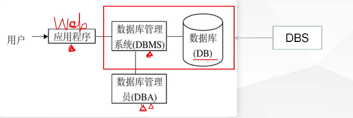
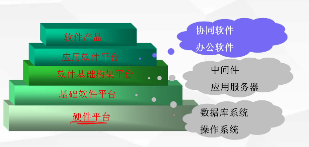
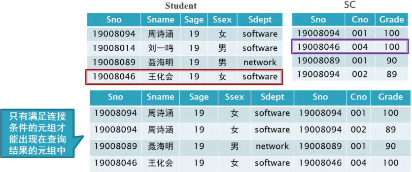

# 数据库

## 数据库的基本概念及操作

### 概念

- 数据库的定义

  数据库(Database,简称DB)是**长期储存**在计算机内、**有组织**的、**可共享**的**大量**数据的集合。

- 数据库的基本特征

  1. 数据按一定的数据模型**组织**、描述和储存
  2. 可为各种用户**共享**
  3. **冗余度较小**
  4. 数据**独立性较高**
  5. **易扩展**
  6. 良好的**可靠性**
  7. 保证**完整性**

- 数据(Data):的定义

  - 定义：描述事物的符号记录，是数据库中存储的基本对象
  - 种类：文字、图形、图像、声音。

- 数据的记录：计算机中表示和存储数据的一种格式或一种方法

  - 例子：(李明，男，1998，江苏，计算机系，2017)
  - 语义：学生姓名、性别、出生年月、籍贯、所在系别、入学时间

- 数据库管理系统

  - 什么是DBMS(数据库管理系统-数据库的核心)
    - 位于用户与操作系统之间的一层**数据管理软件**。
    - 是**系统软件**，是一个大型复杂的软件系统

- DBMS的用途 

  - 科学地组织和存储数据、高效地获取和维护数据

- 数据库系统(Database System,简称DBS)

  - 定义：是指在计算机系统中引入数据库后的系统构成。常常把**数据库系统**简称为**数据库**。
  - 构成：由数据库、数据库管理系统（及其开发工具）、应用程序、数据库管理员（和用户)构成。
  - **注：DBS(数据库系统)=DB(数据库)+DBMS(数据库管理系统)**
  
- 数据库系统(DBS)数据库(DB)、数据库管理系统(DBMS)的关系

  

- 数据库在计算机系统中的位置

  

- 数据库系统发展

  - **人工管理阶段(40年代中-50年代中)**
  - **文件系统阶段(50年代末-60年代中)**
    -  数据共享性差，冗余度大
    -  数据独立性差
  - **数据库系统阶段(60年代末-现在)**
    - **数据共享性高**，冗余度低且容易扩充
    - 高度的**物理独立性** 和 一定的**逻辑独立性**
    - 整体**结构化**
    -  数据冗余度：**冗余度（重复性）低**
    -  数据独立性高
  
- 数据库系统的三级模式

  - **外模式**：也称子模式或用户模式，是数据库用户的数据**视图**（可有多个）
  - **模式(**Schema):也称逻辑模式，**定义数据的逻辑结构**（如数据记录由哪些数据项构成，数据项的名字，类型，取值范围等)(只有一个)（**就是表**）
  - **内模式**：也称存储模式，是数据在数据库内部的表示方式（只有一个：**存储过程**、**索引**等)
  - 外模式——>模式 逻辑独立性
  - 模式——>内模式 物理独立性

### SQLServer2012简介

- 版本

  - √企业版(Enterprise)
  - √商业智能(Business intelligence)
  - √标准版(Standard)
  - √Web版

- SQLServer2012数据库相关概念

  - 4个系统数据库（安装完数据库后自动安装）

    - **master数据库**：系统最重要的数据库，记录了所有**系统信息**。如所有的登录信息、系统设置信息、SQL Server的初始化信息和其它系统数据库及用户数据库的相关信息。
    - **model数据库**：是**模板数据库**，为新建立的数据库提供模板和原型。
    - **tempdb数据库**：是一个**临时数据库**，它为所有的临时表、临时存储过程及其它临时操作提供存储空间。
    - **msdb数据库**：是**代理服务数据库**，为其警报、任务週度和记录操作员的操作提供存储空间。
    
  - SQL Server数据库具有以下2种类型的文件
  
    - 数据文件：用来存放数据和数据库对象。
      数据库对象：表table视图view、存储过程procedure,触发器trigger、函数function、索引index等。
    - 日志文件：存放事务日志
      最多可拥有32767个数据文件和32767个日志文件。
    
  - 数据库文件和日志
  
    1. **主数据文件**：包含数据库的启动信息，用户数据和对象存储在此文件中，扩展名为**.mdf(有且只有一个)**
  
    2. **次要数据文件**：可选，扩展名为**.ndf(可以没有可以有多个)**
  
    3. **事务日志文件**：保存用于恢复数据库的日志信息，扩展名**.ldf(至少包含一个)**
  
       **提示：虽然SQL Server2012不强制这3种类型文件必须使用带mdf、ndf和ldf扩展名，但使用它们指出文件类型是个良好的文件命名习惯**。
       **注：以上几种文件都放在文件组中，主文件和日志文件必须有，其中主文件只能有一个，其他类型文件可以有多个**
    
  - 文件组
  
    - 文件组分**主文件组**和**用户定义的文件组**。
    - 主文件组（系统自动创建）
      主文件组包含**主数据文件(.mdf)、次数据库文件（如果没有为次数据文件分配其他的文件组)**和任何没有明确指派给其它文件组的其它文件。
    - 用户定义的文件组
      用户定义文件组是在create database或alter database语句中，使用FILEGROUP关键字指定的文件组。
    - **说明：日志文件不存在于任何文件组中。**

## 数据库操作

- 创建数据库 语法 

  ```sql
  CREATE DATABASE 数据库名;
  on primary  -- 主数据文件  只能有一个
  (
  name = mydb,   -- 名字 -- 自定义最少有名字
  filename ='D:\data\mydb.mdf',  -- 位置 文件名
  size=5,  -- 初始大小 
  maxsize= 20， -- 最大大小 
  filegrowth =unlimited -- 增长方式 百分比 绝对值 unlimited表示不限制
  )，
  ( -- 次数据文件 可以定义一个用户定义的文件组 前面可以加 filegroup 文件组名字 
  name = mydb_sec,   -- 名字
  filename ='D:\data\mydb_sec.ndf',  -- 位置文件名
  size=5,  -- 初始大小  
  maxsize= 20， -- 最大大小
  filegrowth =10% -- -- 增长方式 百分比 绝对值
  ) -- 没有逗号 
  log on    -- 日志文件 最少一个
  (
  name = mydb_log, -- 名字
  filename ='D:\data\mydb_log.ldf', -- 位置
  size =2,  -- 大小  
  maxsize=10, -- 最大大小
  filegrowth =1 -- 每次增长多少
  )
  ```

  - **maxsize:指定文件可增长到的最大值。如果没有指定，则文件可以不断增长直到充满磁盘 如果是unlimited表示不限制**

  - **filegrowth:指定文件每次增加容量的大小当指定数据为“0“时，表示文件不增长**

  - **filegroup:定义文件组写在次数据前面 后名接用户自定义文件组名字**

  - 创建最简单的数据库

    ```sql
    create database 数据库名称
    ```

  - 最简单的数据库语句，默认创建一个主数据文件一个日志文件

    - 主数据文件默认名称为 **数据库名** 如果带后缀**数据库名.mdf**
    - 日志文件默认名称为 **数据库名_log** 如果带后缀 **数据库名 _log.ldf**

- 例子

  ```sql
  create database MyDb
  on primary (
  size=20,
  name = MyDb,
  maxsize=unlimited, -- unlimited 最大尺寸
  filegrowth=10%,
  filename='D:\EXE\BC\sql server\sql server sl\MSSQL11.MSSQLSERVER\MSSQL\DATA\MyDb.mdf'
  ),
  (
  name=MyDb_sec,
  size=20,
  maxsize=200, -- unlimited 最大尺寸
  filegrowth=10%,
  filename='D:\EXE\BC\sql server\sql server sl\MSSQL11.MSSQLSERVER\MSSQL\DATA\MyDb_sec.ndf'
  )
  log on
  (
  name=MyDb_log,
  size=20,
  maxsize=200, -- unlimited 最大尺寸
  filegrowth=10%,
  filename='D:\EXE\BC\sql server\sql server sl\MSSQL11.MSSQLSERVER\MSSQL\DATA\MyDb_log.ldf'
  )
  ```

- 修改数据库 

- 修改数据库名称  语法

  ```sql
  alter database 数据库名 modify name=数据库新名字
  ```

- 例子

  ```sql
  alter database MyDb modify name=mydd
  ```

- 增加数据文件 语法

  ```sql
  alter database 数据库名  add file(
  name = mydb,   -- 名字 -- 自定义最少有名字
  filename ='D:\data\mydb.mdf',  -- 位置 文件名
  size=5,  -- 初始大小 
  maxsize= 20， -- 最大大小
  filegrowth =10% -- 增长方式 百分比 绝对值
  )
  ```

- 增加日志文件 语法

  ```sql
  alter database 数据库名  add log file(
  name = mydb,   -- 名字 -- 自定义最少有名字
  filename ='D:\data\mydb.mdf',  -- 位置 文件名
  size=5,  -- 初始大小 
  maxsize= 20， -- 最大大小
  filegrowth =10% -- 增长方式 百分比 绝对值
  )
  ```

- 例子

  ```sql
  alter database mydb add file(add log file)( -- 次数据日志
  name = mydb,   -- 名字 -- 自定义最少有名字
  filename ='D:\data\\',  -- 位置 文件名
  size=5,  -- 初始大小 
  maxsize= 20， -- 最大大小
  filegrowth =10% -- 增长方式 百分比 绝对值
  )
  ```

- 修改文件（数据或日志）语法

  ```sql
  alter database 数据库名 modify file(
  name = mydb,   -- 逻辑名不能更改
  filename ='D:\data\mydb.mdf',  -- 位置 文件名
  size=5,  -- 初始大小 
  maxsize= 20， -- 最大大小
  filegrowth =10% -- 增长方式 百分比 绝对值
  )
  ```

- 例子

  ```sql
  alter database mydb modify file(
  name=mydb_data,-- 逻辑名不能更改
  size=5MB
  )
  ```

- 删除(移除)文件(数据或日志) 语法

  ```sql
  alter database 数据库名 remove file 数据文件逻辑名-- 只能逻辑名
  ```

- 例子

  ```sql
  alter database mydb remove file mydb_data
  ```

- 增加文件组

  ```sql
  alter database 数据库名 add filegroup 文件组名
  ```

- 例子

  ```sql
  alter database mydb add filegroup Fgroup
  alter database test3
  add file
  (
  name=test3_data2,
  filename='d:\SQL\test3 data2.ndf'
  size=10
  ),
  (
  name=test3_data3,
  filename='d:\SQL\test3 data3.ndf',
  size=5
  )
  to filegroup FGroup -- to filegroup 把新添加的次要数据文件放到FGroup组
  ```

- 删除文件组

  ```sql
  alter database 数据库名 remove filegroup 文件组名
  -- 说明：删除文件组必须先删除数据文件，且不能删除主文件组
  ```

- 删除数据库 语法

  ```sql
  drop database 数据库名
  ```

- 例子

  ```sql
  drop database mydb
  ```

## 管理维护数据库

### 数据库备份与恢复

- 为了保证数据库中数据的一致性和正确性，DBMS提供了将数据库从错误状态恢复到某一正确状态的功能，这种功能称为**恢复**

- 数据库恢复是以**备份**为基础的

- 备份内容：

  1. 数据文件（主数据文件.mdf和次数据文件.ndf)
  2. 日志文件 ldf

- 备份介质

  1. 磁盘disk:常用的备份介质，可以用于备份本地文件，也可以用于网络文件
  2. 磁带tape:是大容量的备份个质，仅可用于备份本地文件

- 备份方法

  1. **完全备份**：每次都备份整个数据库，包括事务日志。
  2. **差异备份**：只备份自上次备份以来发生过变化的数据库的数据，也称增量备份用来扩充完全备份或数据库和事务日志备份方法。**差异备份的前提是完全备份**
  3. **数据库和事务日志备份**：不需要频繁地定期进行数据库备份，而是在两次完全数据库备份期间，进行事务日志备份。
  4. **数据库文件或文件组备份**：只备份特定的数据库文件或文件组，同时还要定期备份事务日志。

- 创建备份设备

  1. 进行数据库备份时首先必须创建用来存储备份的备份设备。备份设备可以是磁带或磁盘
  2. **创建备份设备后**才能通过T-SQL命令将需要备份的数据库备份到**备份设备**中。
     - **临时备份设备**：只能使用**物理名（物理路径）**访问的备份设备称为临时备份设备。
     - **永久备份设备**：可以使用**逻辑名**访问的备份设备称为命名的备份设备，用于创建永久备份设备；
  3. 若使用磁盘设备备份，**备份设备实际上就是磁盘文件**，该文件的**后缀为.bak**

- 语法

  - 使用临时备份设备备份数据库

    ```sql
    backup database 数据库名 to disk = '文件位置(需要加文件名)'
    ```

  - 例子

    ```sql
    backup database mydb to disk = 'D:\EXE\BC\sql server\sql server sl\MSSQL11.MSSQLSERVER\MSSQL\DATA\MyDb_log.bak'
    ```

  - 使用临时备份设备还原数据库

    ```sql
    restore  database 数据库名 from disk = '文件位置(需要加文件名)'
    ```

  - 例子

    ```sql
    restore  database mydb from disk = 'D:\EXE\BC\sql server\sql server sl\MSSQL11.MSSQLSERVER\MSSQL\DATA\MyDb_log.bak'
    ```

  - 使用永久备份设备备份数据库步骤

    1. 创建备份设备

       ```sql
       sp_addumpdevice 'disk','备份设备逻辑名称','备份设备物理路径'
       ```

       - 备份设备实际上就是磁盘文件，该文件的后缀为**.bak**
       - 备份设备逻辑名称即为文件名称中**.bak前面的名字**
       - 例如备份设备物理路径D:\SQL\test.bak 则该备份设备的逻辑名称可为test
       - 设备介质：disk硬盘/磁盘  tape磁带

    2. 使用永久备份设备备份数据库

       ```sql
       backup database 数据库名 to 备份设备逻辑名称
       ```

    3. 使用永久备份设备还原数据库

       ```sql
       restore database 被还原数据库名 from 备份设备逻辑名称
       ```

    - 例子

      ```sql
       -- 将数据库备份到D盘下“"mybackup”文件夹中的success.bak文件中
       -- 创建备份设备
       sp_addumpdevice 'disk','success','D:\mybackup\success.bak'
       -- 备份数据库
       backup database zy to success
       -- 还原数据库
       restore database zy from success
      ```

### 分离附加数据库

1. 分离

   - 分离数据库是将某个数据库（例如myDB_stu)从SQL Server**数据库列表中删除**，使其**不再被SQL Server管理和使用**，但**该数据库的文件(.mdf)和对应的日志文件(.ldf)完好无损。**

   - 分离成功后，可以把该数据库文件(.mdf)和对应的日志文件(.ldf)拷贝到其它磁盘中作为备份保存。

   - 分离数据库 语法 （系统数据库master、empdb、moel不可分离)

     ```sql
     execute sp_detach_db 数据库名
     sp_detach_db '数据库名'
     ```

     例子

     ```sql
     execute sp_detach_db mydb
     sp_detach_db 'student' /*分离student数据库*/
     ```

2. 附加

   - 附加数据库就是将一个备份磁盘中的数据库文件(md)和对应的日志文件(ldf)拷贝到需要的计算机，并将其添加到某个SQL Server数据库服务器中，由该服务器来管理和使用这个数据库。

   - 附加数据库 语法

     ```sql
     execute sp_attach_db 数据库名 '文件位置(需要加文件名)'
     sp_attach_db '数据库名','主数据文件物理路径','日志文件物理路径'
     ```

     - 数据库文件的物理名称，包括路径；最多可以指定16个文件名：
     - 文件路径至少包含主文件。

   - 例子

     ```sql
     execute sp_attach_db mydb ,'D:\EXE\BC\sql server\sql server sl\MSSQL11.MSSQLSERVER\MSSQL\DATA\MyDb_log.bak'
     /*附加student数据库格式1*/
     sp_attach_db 'student','D:\student.mdf','D:\student log.ldf'
     /*附加student数据库格式2*/
     create database student
     on(
     	filename='C:\student.mdf')
     log on(
     filename='C:\student log.ldf')
     for attach
     ```

   - 注：通过分离和附加数据库可以实现SQL Server数据库**文件存储位置的改变**（移植数据库）

## 数据表操作

- 表和表结构：每个数据库包含了若干个表。表是SQL Server中最主要的数据库对象，它是用来**存储数据**的一种**逻辑结构**。**表由行和列组成**，因此也称为**二维表**。表是在日常工作和生活中经常使用的一种**表示数据及其关系**的形式

- 下面简单介绍与表有关的几个概念：
  1. 表结构。组成表的各列的名称及数据类型，统称为表结构。
  2. 记录。每个表包含了若干行数据，它们是表的"值”，表中的一行称为一个记录。
  3. 字段。表中的一列称为字段。例如，表3.1中表结构为（学号，姓名，性别，出生时间，专业，总学分，备注)，包含7个字段，由5个记录组成。
  4. 空值。空值(NULL)通常表示未知、不可用或将在以后添加的数据。若一个列允许为空值，则向表中输入记录值时可不为该列给出具体值；而一个列若不允许为空值，则在输入时必须给出具体值。
  5. 关键字。若表中记录的某一字段或字段组合能唯一标识记录，则称该字段或字段组合为候选关键字(Candidate key)。若一个表有多个候选关键字，则选定其中一个为主关键字（Primary key),也称为主键。
  5. **外码(不能是当前表的主码)一定会参照另一个表的主码**
  
- 创建表 语法

  ```sql
  create table 表名(
  字段1 字段1类型 列级完整性约束条件,
  字段2 字段2类型 列级完整性约束条件,
  字段3 字段3类型 列级完整性约束条件,
  ...
  字段n 字段n类型 列级完整性约束条件
  )
  ```

- 注：列级完整性约束条件如下：

  1. **primary key**：指定该字段为主键（不为空且唯一） 

  2. **null / not null**：指定的字段允许/不允许为空，如果没有约束条件，则默认为NULL(列级约束)

  3. **unique** :指定字段取值唯一，即每条记录的指定字段值不能重复 (允许列中有一个空值) 

  4. **default<默认值>**：指定设置字段的默认值。（列级约束） 

  5. **check<条件表达式>**：对输入值检验，拒绝接受不满足条件的值。只看非空约束 （不是null  的）

  6. **identity(1,1)**：自增长（第一个值,步长）**不能直接添加数据**系统自动增长

     如果想强制执行  set identity_insert 表名 on

  7. **foreign key** 外键  注意字段类型必须一样

     例子

     ```sql
     foreign key(字段) references 表名(字段)
     字段 字段类型 references 表名(字段)
     字段 字段类型 foreign key(字段) references 表名(字段)
     字段 字段类型 foreign key references 表名(字段)
     ```

  8. **null / not null和default只能是列级约束**    **其他**的**是列级约束和表级约束都可以** **列级约束是 只能针对当列约束**   **表级约束可以多列**

  9. 级联更新

     ```sql
     字段 字段类型 on update cascade
     ```

  10. 级联删除

      ```sql
      字段 字段类型 on delete cascade
      ```

- 例子

  ```sql
  create table student(
   sno char(8) not null primary key,
   sanme char(10) not null,
   grender char(2) null default '男' check(grender='女' or grender='男'),
   -- check(grender='女' or grender='男') 等同于check(grender in('男','女')) 
   sbirth date,
   email char(30) unique, -- 唯一约束
   major char(20),
   chedit int check(chedit>=0 and chedit<120),
   remark varchar(500)
  )
  ```

- 注意：一个主键可以由多个字段构成

  ```sql
  create table student(
   sno char(8) ,
   sanme char(10),
   grender char(2) null default '男' check(grender='女' or grender='男'),
   sbirth date,
   email char(30) unique, -- 唯一约束
   major char(20) references 表名(major),
   chedit int check(chedit>=0 and chedit<120),
   remark varchar(500),
    primary key(sno,sanme),  --联合主键
    foreign key(cno) references sc(sno)
  )
  ```

- 修改数据表 语法

  ```sql
  -- 增加字段
  alter table 表名 add 新字段名称 数据类型 列级完整性约束条件
  -- 修改字段的数据类型
  alter table 表名 alter column 字段名称 新数据类型 [约束写只能 not null]
  -- 删除字段
  alter table 表名 drop column 字段名称  
  -- 添加约束
  alter table 表名 add constraint 约束名 约束条件 (字段名称)
  -- 添加主键约束
  alter table 表名 add constraint 约束名 primary key(字段)
  -- 添加唯一约束
  alter table 表名 add constraint 约束名 unique(字段)
  -- 添加检查约束
  alter table 表名 add constraint 约束名 check(检查的条件)
  -- 添加默认值约束
  alter table 表名 add constraint 约束名 default(默认值) for 字段名
  -- 添加非空约束 相当于修改字段
  alter table 表名 alter column 字段名称 数据类型 not null
  -- 添加外键约束
  alter table 表名 add constraint 约束名 foreign key(字段) references 另一个表名(字段)
  -- 修改约束
  alter table 表名 alter constraint 约束名 约束条件 (字段名称)
  -- 删除约束
  alter table 表名 drop constraint 约束名
  ```

- 例子

  ```sql
  -- 增加字段
  alter table student add sql char(30) null
  -- 修改字段的数据类型
  alter table student alter column sql char(20)
  -- 删除字段
  alter table student drop column sql 
  -- 添加主键约束
  alter table student add constraint zjys primary key(sno)
  -- 添加取值唯一约束
  alter table student add constraint qzwy unique(sno)
  -- 添加检查约束
  alter table student add constraint ch check(cno>0)
  -- 添加默认值约束
  alter table student add constraint de default(2) for cno
  -- 添加非空约束 相当于修改字段
  alter table student alter column sql char(20) not null
  -- 添加外键约束
  alter table student add constraint wjys foreign key cno references sc(cno)
  -- 修改约束
  alter table student alter constraint uq_stu_sq primary key (cname)
  -- 删除约束
  alter table student drop constraint uq_stu_sq
  ```

- 删除表 语法

  ```sql
  drop table 表名
  ```

- 例子

  ```sql
  drop table student
  ```
  
- 系统数据类型

  - 整型

    | 类型              | 字节数  | 范围                            |
    | ----------------- | ------- | ------------------------------- |
    | bigint(长整型)    | 8个字节 | 其取值范围-2^63^~2^63^-1        |
    | int（基本整型)    | 4个字节 | 其取值范围-2^31^~2^31^-1        |
    | smallint（短整型) | 2个字节 | 其取值范围-2^15^~2^15^-1        |
    | tinyint(微整型)   | 1个字节 | 表示无符号整数，其取值范围0~255 |

  - 精确数值型

    - decimal和numeric两种类型(等价)该数值型数据由**整数部分**和**小数部分**组成
    - 格式：decimal(p,s)或者numeric(p,s)
      - p(有效位数，小数点（**左右两侧位数之和**)
      - s(小数位数)，s默认值为0,  0<=s<=p
    - **decimal(10,6)表示数中共有10位数，其中数部分占4位，小数部分占6。**

  - 近似数值型

    - 包括real和float两种类型。
    - real:精确到7位小数，数据范围：-3.40E^+38^~3.40E^+38^
    - float:可以精确到第15位小数，数据范围：-1.79E^+308^~1.79E^+308^。

  - 字符数据类型（表示8000字符以内）

    - 字符型包括char、varchar、nchar 和 nvarcharl四种类型。
    - char(n)
      - 存放**固定长度**的n个字符数据。若输入字符长度不足n时，则用**空格**补足。
        1≤n≤8000。
      - char(10),那么不论存储的数据是否达到了10个字节，都要占去10个字节的空间，不足的自动用空格填充。
    - varchar(n)
      - 存放**可变长度**的n个字符数据。若输入字符长度不足n时，则**按实际输入长度存储**。1≤n≤8000
    - nchar[(n)]
      - 可存储1~4000个定长Unicode字符串，字符串长度在创建时指定；如未指定，默认为nchar(1)。**每个字符占用2bytes存储空间**。
    - nvarchar[(n)]
      - 可存储最大值为4000个字符**可变长**Unicode字符串。可变长Unicode字符串的最大长度在创建时指定，如nvarchar(50),**每个字符占用2 bytes存储空间。**

  - 文本数据类型（表示8000字符以上）

    - 当存储的字符数目大于8000时使用文本型，文本型包括text和ntext两种。
    - text
      - 用来存储ASCII编码字符数据，最多可以存储2^31^-1（约20亿）个字符。在定义Text数据类型时，不需要指定数据长度.
    - ntext:
      - 用来存储Unicode编码字符型数据，最多可能存储2^30^-1（约10亿)个字符 其存储长度为实际字符个数的**两倍**，因为Unicode字符用双字节表示。

  - 日期数据类型

    - date  日期格式 yyyy-MM-dd(年月日)
    - datetime 日期格式 yyyy-MM-dd HH:mm:ss.fff (年月日时分秒 精确到3.33毫秒)
    - 日期型属性的具体数值需要**加单引号**

  - **写T-SOL语句时，日期型属性、char、varchar、nchar、nvarchar、text、ntext类型的属性的具体数值需要加单引号**。

**关系的完整性**

- 关系的完整性（最大限度地保证数据的**正确性**）

- 关系模型的完整性规则是对关系的某种约束条件。

- 关系模型中允许定义3类完整性约束：

  1. √实体完整性,**由primary key主键/主码保证**

     实体完整性规则若属性A是基本关系R的主属性，则属性A不能取空值。
     例如：学生关系“学生学号，姓名，性别，专业号，年龄”中，“学号”
     为主码，则“学号”不能取空值。

  2. √参照完整性,**由foreign key外键/外码保证**

     学生、课程、学生与课程之间的多对多联系选修可以用如下3个关系表示。
     √学生（**学号**，姓名，性别，专业号，年龄)
     √课程（**课程号**，课程名，学分）
     √选修（**学号**，**课程号**，成绩）

  3. √用户自定义的完整性**(域完整性)：not null、unique、check(...)**

     用户自定义的完整性就是针对某一具体关系数据库的约束条件，它反映某一具体应用所涉及的数据必须满足语义要求。例如某个属性必须取唯一值、属性值之间应满足一定的函数关系、某属性的取值范围在0~100之间等。
     √例如，性别只能取“男”或“女”；学生的成绩必须在0~100之间。

## 操作数据表中的数据

### 插入

1. 插入单条记录

   - 语法

     ```sql
     insert into 表名 [列名清单] values 常量清单
     ```

     如果省略<**列名清单**>，则按<常量清单>顺序为**每个属性**列赋值，即每个属性列上都应该有值

   - 例子

     ```sql
     insert into student values ('20200101','张三','男','2001-06-09','666@QQ.COM','计算机系',100,'备注1')
     ```

   - 注：

     1. **表中不允许为空值的项必须输入**
     2. **省略列名清单**，则**常量清单应于表中的列名顺序一致**

2. 插入多条记录 

   - 语法

     ```sql
     insert into 表名 [列名清单] values (常量清单1),(常量清单2),...
     ```

   - 例子

     ```sql
     insert into student values ('20200102','张三','男','2001-06-09','999@QQ.COM','计算机系',100,'备注1'),('20200103','萧炎','男','2001-06-09','66666@QQ.COM','计算机系',100,'备注1'),('20200104','刘6','男','2001-06-09','666999@QQ.COM','计算机系',100,'备注1'),
     ('20200105','张齐','男','2001-06-09','666999666@QQ.COM','计算机系',100,'备注1'),('20200106','钱多多','男','2001-06-09','999666999666@QQ.COM','计算机系',100,'备注1')
     ```

   - 小结

     1. INSERT语句中的INTO可以省略
     2. 如果某些属性列在表名后的列名表没有出现，则新记录在这些列上取空值
     3. 如果没有指明任何列名，则新插入的记录必须在每个属性列上均有值
     4. 字符型或日期型数据必须使用' '（单引号）将其括起来
     5. 常量的顺序必须和指定的列名顺序保持一致
   
3. 插入子查询结果

   - 语法

     ```sql
     insert into <表名> [列名清单] select属性1，属性2，--子查询 from 表 where group by ... order...
     ```

   - 功能：将**子查询结果插入指定表中**

   - 例子

     ```sql
     -- 现有表stu temp与Student结构相同，查询年龄大于18岁的女同学，并将其信息插入。
     insert into stu_temp select * from student where sage > 18 and Ssex='女'
     ```

### 修改

- 语法

  ```sql
  update 表名 set 列名1=表达式1 [,列名2=表达式2] [where 条件表达式]
  ```

  说明：

  1. 如果不指定条件，则会修改表中所有记录
  2. 如果要修改多列，则在SET语句后用”，”分割各修改子句
  2. 表格四种操作：**增、删、改、（只能单表操作）查（可以多表）**

- 例

  ```sql
  -- 将所有选修了课程的同学的成绩增加10分。
  update SC  set Grade=Grade+10
  update student set sanme ='刘德华' where sanme='张齐'
  update student set chedit=60 where chedit<60
  -- 将software.系全体学生的成绩加5分
  update sc set Grade=Grade+5 where Sno in(select Sno from Student
  where Sdept='software')
  -- 将software系前两名学生的备注写无，
  update top(2) student set remark='无' where Sdept='software'
  -- 此格式中top(2) ()不能省略
  -- 将计算机系所有选计算机文学课程的都加10分
  update sc set grade=grade+10 where sno in(select sno from student sdept='计算机系') and cno in(select cno from course where cname='计算机文学')
  ```

### 删除

- 语法

  ```sql
  delete from 表名  [where 条件表达式]
  ```

  - 说明：当无WHERE<条件表达式>时将删除<表>中**所有记录**，但是，该表结构还在，只是变为了空表
  
- 例

  ```sql
  -- 删除所有学生的信息
  delete from Student
  delete from student where sanme='刘德华' 
  -- 删除Student表中25%的行数据。
  delete top(25) percent from student
  -- 此格式中top(25) ()不能省略
  -- 删除software系全体学生的选课信息及成绩。
  delete from sc where son in (select sno from student Sdept='software')
  ```

### 单表查询

- 语法

  ```sql
  SELECT all[DISTINCT][TOP N][PERCENT][with ties],字段1,字段2,字段3..[AS 别名] FROM 表名;
  ```

- 说明

  1. all:表示输出所有记录，包括重复记录。默认值为all。
  2. distinct:表示在查询结果中去掉重复值**作用范围是所有目标列**
  3. top n:返回查询结果集中的前N行。（n必须取整数）

     - 加[**percent**]返回查询结果集中的前n%行。n的取值范围是0~100。注意：**如果1.2条数据的话取的是两条 向上取整**
     - **with ties**:指定从基本结果集中返回**额外的数据行(包含并列的)**，只有在select子句中包含了**order by**子句时才使用（输出并列的）
     - **top写在select,后面**，**属性名的前面**，如果有distinct,**写在distinct后面**

- 例

  ```sql
  select * from student
  select distinct *  from student
  select top 6 *  from student
  -- top % 计算结果向上取整数
  select top 80 percent  * from student
  select sno as '学号'  from student
  -- 计算年龄现在减出生日期
  select sanme ,year(getdate())-year(sbirth) from student
  -- 分数提20%
  select sno,chedit*1.2 AS 成绩 from student
  -- 查询选修了3号的学生中考试成绩最高的3个学号及其成绩。
  select top 3 sno grade from sc where Cno='3' order by grade desc
  -- 查询Student表中前10条学生信息。
  select top 10 * from student 
  -- 查询Student表中前10%学生信息。
  select top 10 percent * from student
  
  ```

- 单表有条件查询

- 语法

  ```sql
  SELECT all[DISTINCT][TOP N[PERCENT]],字段1,字段2,字段3..[AS 别名] FROM 表名 where 条件;
  ```

- WHERE条件中的运算符

  | 查询条件   | 运算符                                                       |
  | ---------- | ------------------------------------------------------------ |
  | 比较运算符 | =，<，>，<=，>=，**!=，<>**，not+比较运算符                  |
  | 逻辑运算符 | AND,OR,NOT                                                   |
  | 范围运算符 | BETWEEN AND（**包括边界**）,NOT BETWEEN AND（**不包括边界**） |
  | 列表运算符 | IN,NOT IN                                                    |
  | 字符匹配符 | LIKE,NOT LIKE                                                |
  | 空值       | IS NULL,IS NOT NULL                                          |

  1. !=，<>都是不等于  not+比较运算符 列 not> 表示不大于
  
  2. WHERE子句中可以使用逻辑运算符AND、OR和NOT,这3个逻辑运算符可以混合使用。
  
  3. 在WHERE子句中使用between关键字**查找在某一范围内的数据**（包括边界），也可以使用not between**关键字查找不在某一范围内的数据**（不包括边界）。
  
  4. in (值 , 值)：用逗号分隔的一组取值，**满足集合中的一个值**。
  
  5. 在WHERE子句中使用字符匹配符LIKE或NOT LIKE可以把表达式与字符串进行比较，从而实现对字符串的**模糊查询**不能等号 比如查询姓张的如果='张'就是名字为张的了。
  
     通配符**%** 表示**0**或者**多个字符**(任意长度)
  
     通配符**_** 表示任意**一个字符**
  
     通配符**[ ]** (中括号) 匹配 [ ] 中的**任意一个字符** 例子 [ac]  ab可以 cd可以 bd不可以
  
  6. 在WHERE子句中，如果需要确定表达式的取值是否属于某一列表值之一时，就可以使用关键字IN或NOT IN来限定查询条件
  
  7. 当数据表中的值为NULL时，可以使用IS NULL关键字的WHERE子句进行查询，反之要查询数据表的值不为NULL时，可以使用IS NOT NULL关键字。**注意无法用等于号（=）判断空**

- 例子

  ```sql
  select * from student WHERE grender='男'
  select * from student WHERE chedit>60
  select * from student WHERE major='计算机系'
  -- 查询计算机系女生的信息。
  select * from student where major='计算机系' and grender='女'
  -- 查询成绩在90分以上或不及格的学生学号和课号信息。
  select * from student where chedit>90 or chedit<60
  -- 查询非计算机
  select * from student where not major='计算机系'
  -- 查询成绩在60~70分之间含(60,70)的学生学号及成绩。
  select sno,chedit from student where chedit between 60 and 70
  -- 查询所有姓张的学生的个人信息。
  select * from student where sanme like '张%'
  -- 查询所有名字第2个字带三的学生的个人信息。
  select * from student where sanme LIKE '_三%'
  -- 查询所有姓张姓唐的学生的个人信息。
  select * from student where sanme like'[张唐]%' 
  -- 查询名字中第2个字为"阳"或"洋“字的学生的姓名和学号。
  select * from student where sname like '_[阳洋]%'
  -- 查询软件和计算机的学生
  select * from student where major in('软件','计算机系')
  -- 查询缺少成绩的学生
  select * from student where chedit is  null
  -- 不为空
  select * from student where chedit is not null
  ```

### 聚合函数

- SQL Server的聚集函数是综合信息的统计函数，也称为聚合函数或集函数，

  1. 包括计数、求最大值、求最小值、求平均值和求和等。
  2. 聚集函数可作为列标识符出现在SELECT子句的目标列或HAVING子句的条件中。
  3. 在SQL查询语句中，如果有GROUP BY子句，则语句中的函数为**分组统计函数**；否则，语句中的函数为**全部结果集的统计函数**。SQL提供的聚集

- | 函数          | 说明                       |
  | ------------- | -------------------------- |
  | COUNT(*)      | 统计行的个数（不忽略空值） |
  | COUNT(<列名>) | 统计一列中值的个数         |
  | MAX(<列名>)   | 计算一列中值的最大值       |
  | MIN(<列名>)   | 计算一列中的最小值         |
  | SUM(<列名>)   | 计算一列中值的总和         |
  | AVG(<列名>)   | 计算一列中值的平均值       |
  
  - 注意：**聚集函数忽略空值** 所以用非空项查询  ，**除了count其他都不能用*号**
  - 注意：**count(*)**计元组的个数即表中行的个数，**不会因为元组中某个属性值为NULL**或者**重复而不计数**
  - 注意：**聚合函数不去重**  **count(distinct 字段) 去重复值** 
  - 注意：**除了count(*)外其他函数计算当中会忽略null**
  - 注意：**聚合函数单独出现可以执行 如果有其他字段没有分组就会报错**
  
  例子
  
  ```sql
  -- 查询学生总数。
  select count(*) from student
  -- 查询选修了课程的学生人数。
  select count(distinct sno) from sc 
  -- 计算男学生平均成绩。
  select avg(chedit) from student where grender='男'
  -- 查询学生最高分和最低分。
  select max(chedit),min(chedit) from student
  ```

### 分组与排序

1. 对查询结果集进行分组

   - 使用GROUP BY子句可以将查询结果按照**某一列或多列数据**值进行**分类**，换句话说，就是对查询结果的信息进行**归纳**，以**汇总**相关数据。
     
   - GROUP BY子句把查询结果集中的各行按列名清单进行分组，在这些列上，对应值都相同的记录分在同一组。若无HAVING子句，则各组分别输出；若有HAVING子句，**只有符合HAVING条件**的组才输出。
     
   - 未对查询结果分组，聚合函数将作用于**整个查询结果，此时认为整个查询结果就是一个组，即最后只产生一个结果**
     
   - 对查询结果分组后，聚合函数将分别作用于**每个组，每个组都将产生一个集合函数的计算结果**
     
   - 什么情况下使用group by分组？
     
     - select语句中有集合函数，需要进一步考虑是否分组
     - **分组属性从题目中涉及的属性中产生**
     - 如果分组，格式：group by分组属性
       ①分组属性**不可能**是**集合函数中的属性**
       ②分组属性与**where中查询条件**中的属性相同，则**不需要分组**
     
   - 语法

     ```sql
     [GROUP BY列名清单][HAVING条件表达式]
     ```

   - 例子：

     ```sql
     -- 统计各系人数
     select sdept, count(*) from student group by sdept
     -- 统计表中男女学生人数
     select gender, count(*) from student group by gender
     -- 统计各系男女学生人数
     select sdept, gender, count(*) from student group by gender,sdept
     -- 统计各系女学生人数
     select sdept, gender, count(*) from student where gender='女' group by gender,sdept 
     select sdept, gender, count(*) from student   group by gender,sdept having gender='女'
     -- 查询选修了2门以上课程的学生学号 每个学生的选课门数
     select sno, count(*) from sc group by sno having count(*)>2
     -- 变式处理：查询被2个以上同学选过的课程号
     select cno ,count(*) from sc group by cno having count(*)>2
     ```

     - **where子句**用于筛选**from子句中指定的表所产生的行数据做筛选**
     - group by子句用于对经where子句筛选后的结果数据进行分组
     - group by写在where子句之后
     - having子句用于**对分组后的统计结果再进行筛选**
     - having**不能单独存在**，必须在group by存在的前提下使用
     
     - 聚合函数**不能写在where里**  **可以出现在 having order后面**
     
     
     - 注意分组和聚合函数里面没有的字段不能直接查询因为没进行过处理无法查询会报错
     - **使用group by子句后**，**select语句的列名列表中**只能出现**分组和聚合函数出现的字段**

2. 对查询结果集进行排序

   - 用户可以利用ORDER BY子句对查询结果按照一个或多个字段
     进行**升序(ASC)或降序(DESC)排序**，默认值为升序。

   - **asc查询空值在最前面**  **desc查询空值在最后面**
     
   - order by子句中，可以使用列名进行排序，可以使用字段在选择列表中的**位置序号进行排序。**
     
   - 语法

     ```sql
     ORDER BY<列名1> ASC|DESC , <列名2> [ASC|DESC],…
     ```
   
   - 例子
   
     ```sql
     -- 查询选修了C02号课程的学生的学号、其成绩，查询结果按分数(sc)的降序排列。
     select sno,cno,degree from sc where cno='C02' order by degree desc
     -- 查询全体学生情况，查询结果按所在系升序排列，同一系中的学生按出生口期除序排列。
     select * from student order by sdept asc, sbirth desc
     select sno,cno,degree -- 选择列表
     from sc order by 3 desc -- 这个3指的是选择列表的序号
     select sno,degree,cno -- 选择列表
     from sc order by 2 desc -- 这个2指的是选择列表的序号
     -- 查询选修了3号的学生中考试成绩最高的3个学号及其成绩。
     select top 3 sno grade from sc where Cno='3' order by grade desc
     -- 查询Student表中前10条学生信息。
     select top 10 * from student 
     -- 查询Student表中前10%学生信息。
     select top 10 percent * from student
     ```

### 多表连接查询

1. 内连接

   - 使用内连接时，如果**两个表的相关字段满足连接条件**，则从两个表中提取数据组成新的记录。

   - 特点：**只有满足连接条件的元组才能进行连接**。
   
   - 
   
   - 两个表能否连接取决于有没有公共属性
   
     1. 名称一样，但含义相同，数据类型相同
     2. 名称不一样，但含义相同，数据类型相同
     
   - 语法
   
     ```sql
     select目标属性1，日标属性2 from 表1，表2，.. where连接条件[and查询条件]
     select目标属性1，日标属性2 from 表1 inner join 表2，.. on 连接条件[and查询条件]
     ```
     
     注意：若在输出列或条件表达式中出现两个表的公共字段，则在公共、字段名前必须加别名
     
   - 例子
   
     ```sql
     -- 输出所有女学生的学号、姓名、课号及成绩。
     select s.sno,s.sname,c.cno, c.degree from student s, sc c where s.sno=c.sno and s.gender='女'
     select  s.sno,s.sname,c.cno, c.degree  from student s inner join sc c on s.sno=c.sno where s.gender='女'
     -- 查询选修了数据库课程的学生的学号、姓名与成绩。
     select Student.Sno,Sname,Grade from Student ,SC ,Course  where Student.Sno=SC.Sno and Course.Cno=SC.Cno and Cname='数据库'
     -- 统计每个系的平均成绩，列出系及平均成绩。（分组的多表查询）
     select Sdept,avg(Grade) from Student,SC where Student.Sno=SC.Sno
     group by Sdept
     ```
   
2. 外连接

   - 在自然连接中，**只有**在两个表中**匹配**的行才能在结果集中出现。而在外连接中可以**只限制**一个表（**从表**），而对另外一个表**不加限制**（**主表**）。外连接分为**左外连接、右外连接和全外连接。**

   - 语法

     ```sql
     SELECT [ALL | DISTINCT][别名]<选项1>[AS<显示列名>][，[别名.<选项2>[AS<显示列名>]，...]
     FROM<表名1>LEFT|RIGHT|FULL[OUTER]JOIN<表名2>
     oN<表名1.列1>=<表名2.列2>
     ```
     
     注意：对于左连接对于主表（left前面是主表）有限制对于从表要进行on的连接右连接同理
     
   - 例子
   
     ```sql
     -- 利用左外连接查询每个学生及其选修课的情况。
     select s.*,c.cno ,c.degree from student s left join sc c on s.sno= c.sno
     select * from student left join sc on student.sno=sc.sno 
     -- 查询那些课程没人选，要求列出课程号和课程名
     select course.cno,cname from  course left join sc where sc.cno=course.cno where sc.cno is null 
     -- 主要选择主表时候要看表中数据哪个全面才能做主表
     -- 右外连
     select student.*,cno from sc  right join student  on student.sno= sc.sno
     ```
     
   - 左外连接left join:**将左侧的表格作为主表**，不加任何限制；左侧作为从表
   
   - 右外连接right join:**将右侧的表格作为主表**，不加任何限制；左侧作为从表
   
   - 如果**两个表都有同一字段，用主表的**
   
3. 嵌套查询-非相关子查询

   - 在SQL语言中，一个**SELECT一FROM一WHERE语句称为一个查询块**。将一个**查询块嵌套在另一个查询块**的WHERE子句或HAVING子句的条件中称为嵌套查询或子查询。

   - 非相关嵌套子查询的执行过程为：首先执行子查询，子查询得到的结果集不被显示出来，而是传给外部查询，作为外部查询的条件使用，然后执行外部查询，并显示查询结果。子查询可以多层嵌套。

   - 子查询的限制  **不能使用ORDER BY子句除非是用了TOP、OFFSET、FOR XML语句**。

   - 执行过程：**首先执行子查询**，再在子查询的基础上**执行外层父查询**。
   
   - 语法
   
     ```sql
     SELECT<查询列表> FROM表1 where<列名>[not] IN(SELECT<列名> FROM表2
     [WHERE ...]
     外层列名与内层列名通常一致(公共属性) 表1和表2应有公共属性
     SELECT<查询列表> FROM表1 where<列名>  比较运算符 (SELECT<列名> FROM表2[WHERE ...])           
     ```
     
     - 使用嵌套子查询**进行比较测试时**，要**求子查询只能返回单个值。**
     - 外层查询一般通过比较运算符(>、>=、<、<=、=、<>、!=)
     - 将外层查询中**某个列的值与子查询返回的值进行比较**。    
     
   - 公共的属性：
   
     - 属性名称相同（**公共属性**）且数**据类型相同**，**含义相同**
   
       ```
       Student 学号 Sno char(10) SC 学号 Sno char(10)
       ```
   
     - **属性名称可以不同**，**但数据类型相同，含义要相同**
   
       ```
       Student 学号 Sno char(10) SC 学号 no char(10)
       ```
   
       **表1与表2必须是有一致属性的两个表**
   
   - 例子
   
     ```SQL
     -- 查询选修了课程号C02的学生信息
     select * from student where sno in(select sno from sc where cno='C02')
     -- 查询与刘晨在同一个系学习的学生信息。
     select * from student where sdept in(select sdept from student where sname='刘晨')
     -- 统计选了“数据库”课程的学生的学号、选课门数和平均成绩
     select sno,count(*),avg(degree) from sc where sno in(select sno from sc where cno in(select cno from course where canme='数据库')) group by sno
     select sname from student where sno in (select top 1 sno from sc group by sno having max(grade)) and sdept='计算机系'
     ```
   
   - 嵌套子查询一般也分为两种：子查询返回单个值和子查询返回一个值列表。
   
     ```sql
     -- 查询所有年龄大于平均年龄的学生信息
     select * from student where sage > (select avg(sage) from student)
     -- 查询IS系中年龄高于该系平均年龄的学生的学号、姓名、性别、年龄。
     select Sno,Sname,Ssex,Sage from student
     where sdept='Is'and sage >(select avg(sage) from Student where Sdept='Is')
     ```
   
   - 带有ANY或ALL操作符的子查询。ANY和ALL操作符在使用时必须和比较运算符一起使用，其格式如下。
   
     ```sql
     <字段><比较符>[ANY|ALL<子查询>
     ```
   
     ALL代表所有 ANY代表其中一个
   
   - 例子
   
     ```sql
     -- 查询其他系中比计算机系学生年龄都小的学生。
     select * from student where sage<all(select sage
     from student where sdept='信息系' ) and sdept <> '信息系'
     -- 查询其他系中比计算机系任一个学生年龄小的学生信息。
     select * from student where sage <ANY(select sage
     from student where sdept='信息系' ) and sdept <> '信息系'
     ```
   
   - 使用存在量词 EXISTS(相关子查询)
   
     执行过程：对外层查询student表的每一条记录，检查内层查询是否为空，若不为空，则输出该记录（先执行外层查询，后执行内层查询）
   
   - 例子
   
     ```
     -- 查询选修了课程号C02的学生信息
     
     ```

## 数据库高级操作

### 视图

1. 视图的定义 

   - 视图是从**一个或多个表（或视图）导出的表**，即可以基于表创建视图，也可以基于视图创建视图
   - 视图中包含的字段**少于**其源自的基本表
   - 视图与基本表不同，视图是一个**虚表**，即**视图所对应的数据不进行实际存储**，即DBMS中只**存储视图的定义，不存储数据，数据来源于基本表**；
   - **基本表中的数据发生变化**，从视图中**查询出的数据也随之改变**；
   - 必须使用SQL中的**select语句**实现**视图定义**
   - 视图总是显示最新的数据，每次查询视图时，**DBMS通过使用SQL语句重建数据**；
   - 视图的主要作用是**提供用户视角的数据**。

2. 视图的作用

   - **提供用户视角的数据**
   - 用户可以只关系其感兴趣的某些特定数据，或者他们所负责的特定任务，通过视图可以只允许用户看到视图中定义的数据而不是见图引用的基本表中的全部数据，从而**提高了数据的安全性。**
   - **简化操作**
   - 定制数据
   - 合并分隔数据
     - **保持了数据的逻辑独立性**。
   - 安全性

3. 创建视图

   - 创建视图语法

     ```sql
     create view 视图名 [(属性名1，属性名2)] [with encryption]  as 查询语句
     [with check option]
     ```

     - **属性可以不写**,但**写就要和后面select 查询的属性名顺序一致**

     - 视图定义中某列是**函数/数学表达式/常量**(**表中没有的**)，**必须定义列名称。**

     - **with encryption 对视图的定义进行加密**

     - **with check option**  在视图上进行的修改都要符合SQL查询语句所指定的查询条件，这样可以保证数据修改后，仍**可通过视图看到修改的数据**

     - select_statement:选择哪些列进入视图的SELECT语句。

     - 注意：创建视图中如果有原表中没有的数据需要起别名 通过视图还可以进行筛选

     - 注意：视图中的SELECT命令**不能包括INTO、ORDER BY等子句**。

     - ```sql
       -- 例子
       --  1.定义视图V_stu,查询学生的学号、姓名、所在系。
       create view V_stu as select Sno,Sname,Sdept from student
       -- 说明：由于视图V_stu的后面没有写属性的名称，即没有为视图定义属性的名字，视图中默认包含3个属性，名称默认为select,后面查询的字段的名称，即Sno,Sname,Sdept
       -- 2.有条件的视图定义。定义视图v_student,查询所有选修c01号 
       -- 课程的学生的学号(sno)、姓名(sname)、课程名称(cname)和成绩(degree)
       create view v_student as select sno,sname,cname,degree from studnet,sc,course where student.sno=sc.sno and sc.cno=course.cno and cno='co1'
       -- 3.定义视图v_student_.count,查询不同性别的学生人数。
       create view v_student_count(性别,人数) as select Ssex,count(Sno) from student
       group by Ssex
       -- 视图定义中某列是函数/数学表达式/常量，必须定义列名称。
       -- 有条件的视图定义。定义视图v_student,查询所有选修C01号 
       -- 课程的学生的学号(sno)、姓名(sname)、课程名称(cname)和成绩(degree)
       create view v_stdent with encryption as select student.sno,sname,sc.cno,degree from student ,sc,course where student.sno=sc.sno and sc.cno = course.cno and sc. cno='C01'
       ```

4. 修改视图

   - 修改视图语法

     ```sql
     alter view 视图名 [(属性名1，属性名2)] [with encryption]  as 查询语句
     [with check option]
     ```

   - 例子

     ```sql
     -- 修改视图v_student_.count,查询不同性别的学生人数及平均年龄。
     alter view v_student_count(性别,人数,平均年龄) as select Ssex,count(sno),avg(sage) from student group by Ssex
     ```

5. 删除视图

   - 删除视图语法

     ```sql
     drop view 视图名
     ```

     - 删除视图时，**由该视图导出的其他视图的定义仍在数据字典中**，但已不能使用，必须显式删除；
     - **删除基表时不影响视图的定义**，**但该视图无法正常使用**，由该基表导出的所有视图定义都必须显式删除；

   - 例子

     ```sql
     -- 删除视图
     drop view v_student_count
     ```

6. 查询视图

   - 查询视图语法

     ```sql
     select * from 视图名
     ```

     - 注意：**查询字段必须使用在视图中已经创建的字段**

   - 例子

     ```sql
     -- 查询视图
     select * from v_stdent -- 用户视角 提高安全性
     -- 定义视图
     create view v_student as select S.Sno,Sname,Cname,Grade
     from Student S,Course C,SCwhere S.Sno=SC.Sno and C.Cno=SC.Cno
     and C.Cn0='003';
     -- 通过上面视图查询选修了003号课程且成绩高于90的学生的 学号 姓名 成绩 
     select Sno,Sname,Grade from v_student where Grade>90 
     -- 注意查询中没写003号课程的条件是在创建视图的时候已经筛选掉了
     -- 通过视图查询性学生人数超过1人
     select * from v_student_count where 学生人数>1 
     ```

7. 更新视图-插入数据

   - 插入数据语法

     ```sql
     insert into 视图名 (属性1，属性2，...) values (值1，值2....)
     ```

     - 注意：视图是虚表不能存放数据，插入的数据实际是存放在创建视图的原表中

   - 例子

     ```sql
     -- 更新视图V_stu,向其中插入数据
     create view V_stu as select Sno,Sname,Sdept from Student
     insert into V_stu values('20060106','圆圆','计算机系')
     ```

8. 更新视图-修改数据

   - 修改数据语法

     ```sql
     update 视图名 set 列名1=表达式1 [,列名2=表达式2] [where 条件表达式]
     ```

     - 注意：**视图上计算列、内置函数列、聚合函数、group by 视图定义的from子句包含多个表。不能更改视图数据表示插入删除 更新 删除 都不可以** 但是多表的数据一次操作一个表可以修改但删除不可以

   - 例子

     ```sql
     -- 更新视图V_stu,将95001同学的系别改为CS。
     create view V_stu as select Sno,Sname,Sdept from Student
     update V_stu set Sdept='cs' where sno='95001'
     ```

9. 更新视图-删除数据

   - 删除数据语法

     ```sql
     delete from 视图名 where 条件
     ```

     - **视图中依赖多个表是不可以进行删除的**

   - 例子

     ```sql
     -- 删除视图V_stu中的数据，将95001同学的信息删除。
     create view V_stu as select Sno,Sname,Sdept from Student
     delete from V_stu where sno='95001'
     ```

### 索引

1. 索引概念

   - 索引：是SQL Server编排数据的内部方法。它为SQL Server提供一种方法来编排**查询**数据
   - 索引页：数据库中存储索引的数据页；索引页类似于汉语字(词)典中按拼音或笔画排序的目录页。
   - 索引的作用：通过使用索引，可以大大**提高数据库的检索(查询)速度，改善数据库性能**。 
   - 基于**表**或**视图创建索引**
   - 优点
     - 加快查询访问速度
     - 加强行的唯一性
   - 缺点
     - 带索引的表在数据库中需要**更多的存储空间**
     - **操纵数据的命令需要更长的处理时间**，因为需要对索引进行更新

2. 索引

   - **聚集索引(Clustered)**
   
     - 定义：将数据行的键值在表内排序并存储对应的数据记录，使得表中**记录的物理顺序与索引顺序一致。**
   
     - 检索效率**高于非聚集索引**
   
     - 对数据新增/删除的**影响较大**
   
     - **每个表只能有一个聚集索引**
   
     - SQL Server将**主键默认定义为聚集索引**
   
     - **聚集索引适合范围查找**
   
     - 语法
   
       ```sql
       create clustered index 索引名 on 表名（属性名 asc / desc) [with fillfactor=x]
       -- 排序方式：adc (默认值)升序 desc降序
       ```
   
     - 注意：聚集索引并不一定是唯一索引，由于SQL SERVER将主键默认定义为聚集索引，事实上，索引是**否唯一与是否聚集是不相关**的，聚集索引可以是唯一索引，也可以是非唯一索引；
   
     - FILLFACTOR表示填充因子，指定一个0到100之间的值，该值指示索引页填满的空间所占的百分比
   
     - 注意：在执行此命令前先删除原来该表的主关键字属性
   
     - 提示：主关键字约束默认相当于聚集索引和唯一索引的结合。
   
   - **非聚集索引(Nonclustered)**
   
     - 非聚集索引：不改变表记录的物理存放顺序（适用于**直接匹配单个条件的查询**)，数据存储在一个位置，索引存储在另一个位置
   
     - 非聚集索引是索引结构和数据分开存放的索引，**不影响表中的数据存储顺序。**
   
     - 检索效率**低于聚集索引**
   
     - 未指定索引类型，**默认为非聚集索引**
   
     - 对数据新增/删除的影响**较小**
   
     - 每个表**最多有249个**非聚集索引
   
     - **在创建非聚集索引之前创建聚集索引**
   
     - 语法
   
       ```sql
       create nonclustered index 索引名 on 表名（属性名 asc / desc)
       -- 排序方式：adc (默认值)升序 desc降序
       ```
   
     - 例子
   
       ```sql
       create nonclustered index s on student(sname desc);
       ```
   
   - **唯一索引**
   
     - **被索引列不能有重复值，不能有两个NULL**
   
     - 在create table时使用**primary key**或**unique**约束时，会在表上**自动创建**一个**唯一索引**，**且无法删除**
   
     - 唯一性约束unique强制在指定列上创建一个唯一性索引；
   
     - **只能建立在取值唯一的属性上**
   
     - **unique索引既可以采用聚集索引结构，也可以采用非聚集索引结构**，如果**不指明**采用的索引结构，则SQL Server系统**默认为采用非聚集索引结构**。(**唯一和聚集不具有相关性**)
   
     - 语法
   
       ```sql
       create unique index 索引名 on 表名（属性名 asc / desc)
       -- 排序方式：adc (默认值)升序 desc降序
       ```
   
     - 例子
   
       ```sql
       create unique index s on student(sname desc);
        --为Student表的sno列创建一个唯一性的聚集索引：
        create unique clustered index idx_student_sno on student(sno)
       ```
   
   - 复合索引
   
     - 复合索引：**在两个以上的列上创建一个索引（组合）**
   
     - 语法
   
       ```sql
       create index 索引名 on 表名（属性名1 排序方式,属性名2 排序方式,...)
       -- 排序方式：adc (默认值)升序 desc降序
       ```
   
     - **每个属性都有自己的排序方式**
   
     - 例子
   
       ```sql
       create index s on sc(sno,cno desc);
       -- 在sc表中先按学生学号升序(asc)进行排序，如果有某个学号有对应多门课程号，则在该基础上在某个学号内部对课程号按降序(desc)进行排序
       ```
   
   - 删除索引
   
     - 索引不可以更改，必须先删除再重新建立索引。
   
     - 语法
   
       ```sql
       drop index 表名.<索引名>
       drop index 索引名 on 表名
       ```
   
     - 例子
   
       ```sql
       -- 删除student表上的索引s
       drop index student.s
       drop index s on student
       ```
   
2. 建立索引的情况

   1. 考虑建索引的列
      - **主键**
      - **连接中频繁使用的列**
      - **频繁搜索**的列和按**排序**顺序频繁检索的列
   2. 不考虑建索引的列
      - **很少**或**从来不在查询中引用**的列
      - 只**有几行或很少几个值**的列
      - 以bit,text,image数据类型定义的**列数据行数很少的小表**一般也没有建立索引的必要

### 存储过程

- 存储过程的定义：是一组为了完成特定功能的SQL语句，**经编译后存储在数据库中**。

- 存储过程的分类：系统存储过程、用户定义存储过程、扩展存储过程

- 存储过程定义语句可以是增删改查任何语句

- 创建

  ```sql
  create procedure 存储过程名字 [@变量名 类型] as 语句
  ```

- 使用存储过程

  ```sql
  execute 存储过程名字 '参数值'
  execute 存储过程名字 @变量='参数值'
  ```

- 修改

  ```sql
  alter procedure 存储过程名字 as 语句
  ```

- 删除

  ```sql
  drop procedure 存储过程名字
  ```

  注意 procedure 可以缩写称 proc    execute 可简写 exec

- 例子

  ```sql
  -- 创建存储过程
  -- 例：查询选修了课程号CO2(sc)的学生信息(sno,sname,gender,)student
  -- 连接查询
  create procedure proc_t1  as select student.*,cno from student,sc where student.sno=sc.sno and cno='C02'
  -- 执行存储过程
  execute proc_t1
  -- 修改存储过程
  alter procedure proc_t1 as select * from student
  -- 删除存储过程
  drop procedure proc_t1
  ```

- 存储功能可以带参数 用@加参数名称

  例子

  ```sql
  -- 例：查询选修了某课程号的学生信息(sno,sname,gender,)student
  create procedure proc_t2 @cno char(4) as select student.*,cno from student,sc where student.sno=sc.sno and cno=@cno
  -- 使用
  execute proc_t2 'C01'
  execute proc_t2  @cno='C01'
  -- 修改存储过程
  alter proc proc_t1  as select student.*,cno from student,sc where student.sno=sc.sno and cno='C02'
  ```

### 函数

- 函数的分类

  - 根据函数返回值的类型，用户定义的函数分为：
    - **标量函数**：返回一个标量值：
    - **表值函数**：返回值为整个表，根据函数的主体方式分为：
      - **内嵌表值函数**：返回一个table(表)
      - **多语句表值函数**：返回一个table型**变量**，即**表变量**

- 函数语法

  - 函数的创建

    ```sql
    create function
    ```

  - 函数的修改

    ```sql
    alter function
    ```

  - 函数的删除

    ```sql
    drop function
    ```

### 触发器

- 触发器种类：

  - DML触发器  DML:数据操纵语言 (insert update delete select)
  - DDL触发器  DDL:数据定义语言(create alter drop)

- 语法

  - 创建触发器

    ```sql
    create trigger
    ```

  - 修改触发器

    ```sql
    alter trigger
    ```

  - 删除触发器

    ```sql
    drop trigger
    ```

    
