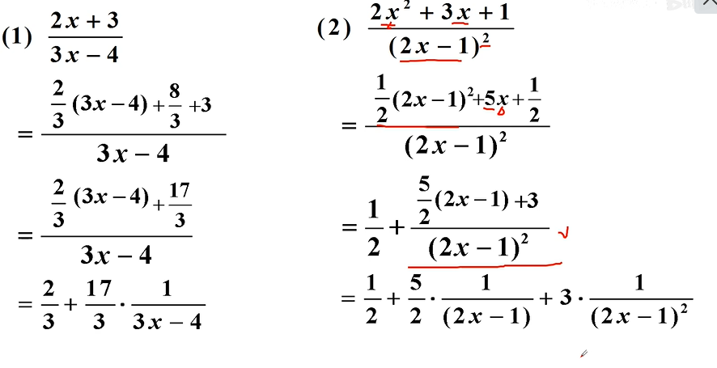

# 数学

## 温馨提示

- 学好数学的一个很重要的思想一“口”的思想！

  “口”的思想：未知变量x实际上是“口”,“口”里可以随便填！

  

- 数学的尽头是哲学

  佛家讲“色即是空”，道家讲“大道无为”，庄子讲“用心若镜”。

  其实就指我们的心应该像未知数x一样，虽然你不知道它存在明哪里？但是可以能容纳万事万物，包揽整个宇宙。

  如果我们能够做到这一点，我们就会脱离烦恼，人生充满智慧！

## 预备知识

##### 邻域与去心邻域

- 邻域：U(a,δ)=(a-δ，a+δ) 

  

  U(2,1)=(1,3) 表示1——3这样的开区间

- 

  

  从1-2这个开区间并上2-3这个开区间

##### 十字相乘法

- 二次多项式：ax^2^+bx+c  a:二次项系数 b:一次项系数 c:常数项

- ax2 +bx+c =(a$_{1}$x+c$_{1}$)(a$_{2}$x+c$_{2}$)

- 

- 例子 x^2^-x-2  = (x-2)(x+1)

  

- 例子 12x^2^-17x+6  = (3x-2)(4x-3)

  

- 有些题目，十字相乘法需要反复尝试！

##### 配方法 

- 多项式ax^2^±bx±c配方步骤：

  1. 提取系数a

  2. 配方
     要诀：加或减一次项系数一半的平方；再减常数项的平方乘以系数。

     

- 

##### 分离常数法

- 题型：
- 思路：分子x凑成分母的形式，分离常数
- 例题

##### 绝对值不等式

- 不等式|x|<2的几何意义是什么？

  表示：数轴上与原点距离小于2的点

  

- 不等式|x|>2的几何意义是什么？

  表示：数轴上与原点距离大于2的点

  

- |x|<a(a>0)→ -a<x<a
  |x|>a(a>0)→ x<-a或x>a

  口诀：“小于夹中间，大于取两边”

- 

- 例

  

##### 二次不等式

- 方法一：配方法思想：转化为绝对值不等式
  常见结论：

  例子：

- 方法二：因式分解法

  

  例子：

  

  

##### 倒数不等式

- 
- 例子：
- 

##### 均值不等式

-   

- 结论 ：

  

- 

