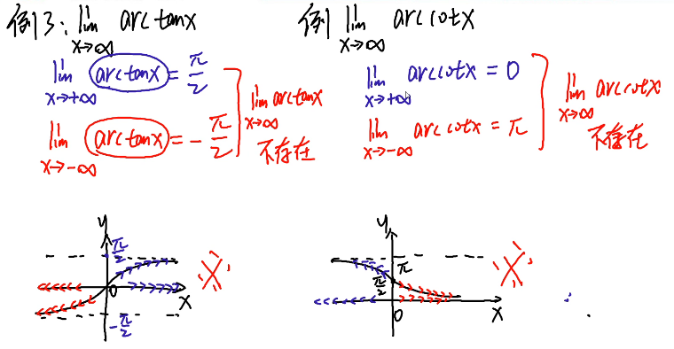
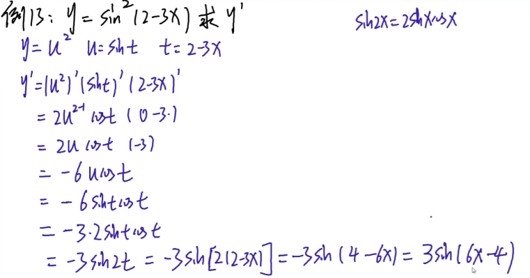
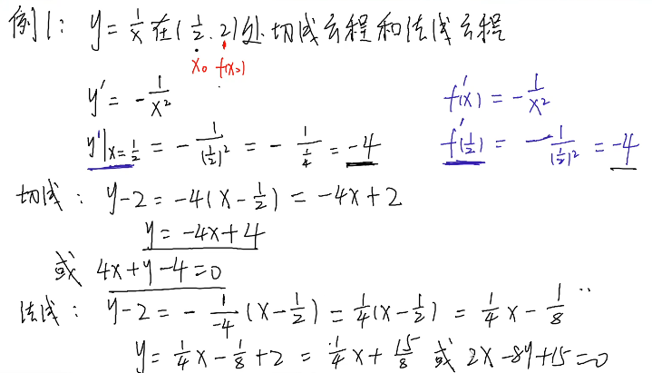
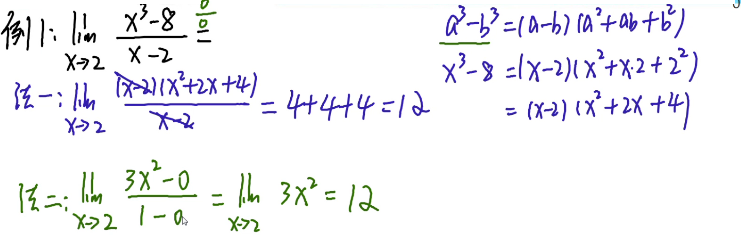
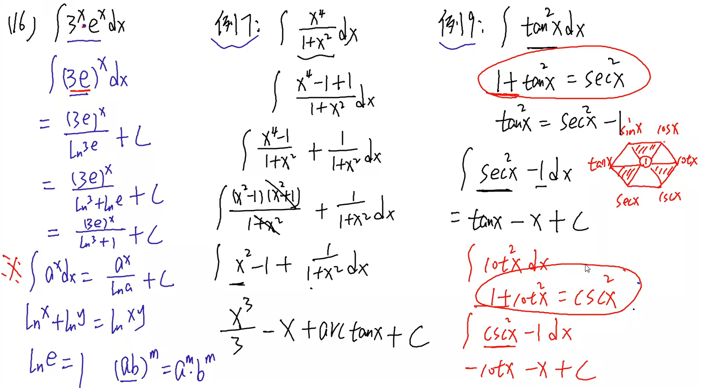
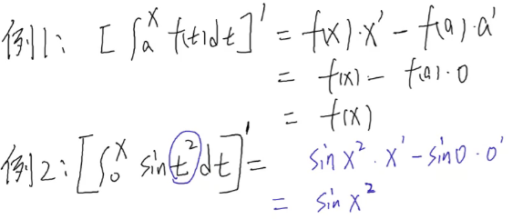
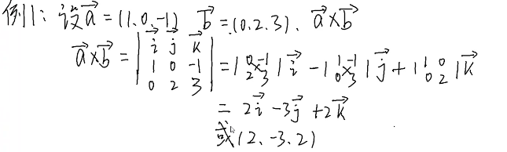
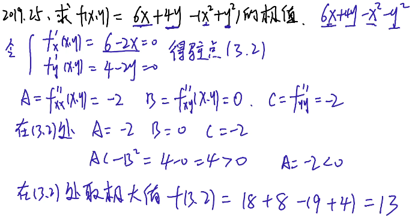

数学

[TOC]

## 数学基础

### 函数

##### 区间

1. 区间是高等数学中最常用的一类数集

   设a,b是实数，且a<b,规定：

   - 满足不等式a≤x≤b的所有实数x的集合叫做**闭区间**，表示为[a,b];
   - 满足不等式a<x<b的所有实数x的集合叫做**开区间**，表示为(a,b):
   - 满足不等式a≤x<b或a<x≤b的所有实数x的集合叫做**半开半闭间**，分别表
     示为[a,b)或(a,b]

2. a,b称为区间的端点，b-a是区间的长度.

   - 
   - 不知道a,b左右时 区间长度为 |b-a|
   - 全体实数的集合R可以用区间表示为(-$\infty$,$\infty$).相应地，把满足x≥a,x>a,x≤b,x<b的实数x的集合分别表示为[a,+$\infty$),(a,+$\infty$),(-$\infty$,b],(-$\infty$,b)
   - 注意无穷是取不到的所以是闭区间小括号

##### 邻域

- 
- 

##### 一次函数

1. 函数关系：X$\in$D,对应规则 f 存在**唯一**的y值

   x可以多对1y   x不可以1对多y

2. 图像判断法：垂直于x轴画直线与图像只能有一个交点

3. 正比例函数 y=kx (k!=0)

   - 横过原点
   - k绝对值越大图越陡
   - k是斜率
   - k>0时是增函数 位于1 3 象限
   - k<0时是减函数 位于2 4 象限
   - 象限

4. 反比例函数 y=$\frac{k}{x}$

5. 一次函数 y=kx+b (k!=0)

   - 上加下减(对整个表达式)  左加右减(只对x)
   - b与y轴交点
   - k>0是增函数
   - k<0时是减函数
   - 两个线平行k相等
   - 两个线垂直 k$_1$K$_2$=-1 
   - 点斜式：y-y值=k(x-x值)
   - 两点式：$\frac{y-y_1}{x-x_1}$=$\frac{y_2-y1}{x_2-x_1}$
   - 斜截式： y=kx+b 

##### 二次函数

1. 二次函数 y=ax^2^+bx+c (a!=0)
   - 抛物线
   - a的绝对值越大抛物线开口越小 越小开口越大
   - a>0 开口向上 a<0开口向下
   - 顶点坐标（-$\frac{b}{2a}$,$\frac{4ac-b^2}{4a}$）
   - 对称轴 x=-$\frac{b}{2a}$   左同右异（a,b符号相同在y轴左 不同在y轴右）
   - 与y轴交点 (0,c)

##### 三角函数

1. sinx=$\frac{{对边}}{斜边}$
2. cosx=$\frac{{邻边}}{斜边}$
3. 

## 第一章函数极限和连续

### 1.函数

- y=f(x)  
  - x是自变量 x 的范围叫定义域  
  - y是因变量 y 的范围叫做值域  
  - f是对应法则
- **$\frac{b}{a}、\frac{x}{y}、\frac{1}{x+1}$**  $\sqrt[开方数]{被开方数}$

##### 常数函数

- y=c(常数)   偶函数 关于y轴对称

  

##### 基本初等函数

###### 幂函数

幂函数 y=x^μ^ (μ != 0)

- y=x^1^ =x   奇函数

  

  **注意 奇函数特点关于圆点对称**

- y=kx+b (一条直线)    

  例子 y=2-x  如何判断是直线  x是一次幂

  

- y=x^2^ 偶函数 

  

  注意 偶函数特点关于y轴对称

- y=x^4^  偶函数 

  

- y=ax^2^ +bx +c(抛物线)

  a>0 开口向上

  a<0 开口向下

- y=-x^2^ 偶函数 

  

- y=x^3^ 奇函数

  

- y=x^-1^  = $\frac{1}{x}$  奇函数 定义域（-$\infty$,0)$\cup$（0，+$\infty$)

  

- y=$\sqrt{x}$ =x^ $\frac{1}{2}$ ^  非奇非偶   定义域 [0,+$\infty$)

  

###### 幂函数的性质

1. (x^p^)^q^ =x^p*q^   

   例子 （x^3^）^2^ =x^6^  != x ^5^

2. X^p^ * X^q^ =x^p+q^

   例子（x^3^）^2^ =x^5^  != x^6^

3. x^q^ \ x^p^  = x^p-q^   

   例子  x^3^ \ x^2^ = x  

4. x^p^ \ 1 = x^-p^  

   例子  x \ 1 = x^-1^ （反比例函数）      x^3^ \ 1 = x^-3^   

5. ^m^√￣x^n^ = x^m\n^  

   例子  ^2^√￣x^1^ =√￣x = x^2\1^   ^3^√￣x = x^3\1^     ^4^√￣x^3^ = x^4\3^    

###### 指数函数 

- y= a ^x^ (a>0 且, a!= 1)   x$\in$ (-$\infty$,+$\infty$)   y$\in$(0,+$\infty$)

  1. a^0^ =1   a必须大于0

  2. a>1    y=2^x^  y=3^x^ 

     

  3. 0<a<1  y=( $\frac{1}{2}$)^x^  y=( $\frac{1}{3}$)^x^ 

     

  4. y=e^x^  e=2.718281...   >1

     **注意：y=e^x^<=>x=ln^y^**

     

  5. y=e^-x^    =(e^-1^)^x^  = (e\1)^x^    e\1<1   和y=e^x^ 对称
  
     

###### 指数函数性质

1. (e^x^ )^y^ =e^xy^ 
2. e^x1^ * e^x2^ =e^x1+x2^
3. e^x1^ \ e^x2^ =e^x1-x2^
4. e^x^ \ 1 =e^-x^
5. ^m^√￣(e^x^)^n^ =^m^√￣e^xn^ =e^m\xn^
6. (a*b)^x^ =a^x^ * b^x^
7. 例题
   - (e^x^)^2^ =e^2x^  != e^x^^2^
   - e^3x^ * e^2x^ =e^5x^
   - e^3x^ - e^2x^  =e^2x^ (e^x^ -1)                ! =e^x^
   - e^3x^ \ e^2x^=e^x^
   - ^3^√￣e^2x^ =e^3\2x^ 
   - 2^x^ * e^x^ =(2e)^x^

###### 对数函数

- y=log^x^$_{a}$    x>0 x是对数里面的真数   a >0 a != 1   a是对数里面的底数 定义域 （0，+$\infty$）

- a>1

  

- 0<a<1

  

- y=log^1^$_{a}$=0      y=log^a^$_{a}$ =1

- a=e 时 y=log^x^$_{e}$ =ln^x^  

  

- a=10 时 y=log^x^$_{10}$ =lg^x^

  

###### 对数性质

1.  log^x^$_{a}$ +log^y^$_{a}$ =log^xy^$_{a}$     ln^x^ + ln^y^ =ln^xy^
2. log^x^$_{a}$ -log^y^$_{a}$ =log^x/y^$_{a}$       ln^x^ - ln^y^ =ln^x/y^
3.              
4. 对数恒等式  e^lnA^ =A   
5. log^b^$_{a}$ =                          

###### 三角函数

1. 正弦函数 y=sinx  周期 t=2$\pi$  有界函数  奇函数  最大1 最小-1

   

2. 余弦函数 y=cosx  周期 t=2$\pi$   有界函数  偶函数 最大1 最小-1

   

   **cos$\pi$=-1**   必考

   **cos0=1**    必考

3. 正切函数 y=tanx = $\frac{sinx}{cosx}$  周期 t=$\pi$  奇函数

   

4. 余切函数 y=cotx=   $\frac{1}{tanx }$= $\frac{cosx}{sinx}$ 周期 t=$\pi$  奇函数

   

5. 正割函数  y=secx=$\frac{1}{cosx }$ 偶函数

6. 余割函数  y=cscx=$\frac{1}{sinx}$ 奇函数

**记忆技巧**

- :

- **sin^2^x + cos^2^ x=1  tan^2^x+1=secx^2^  1+ cot^2^x=csc^2^x** 

  **三角形上顶点的平方等于下顶点的平方**

- **tanx=$\frac{sinx}{cosx}$   cotx=$\frac{cosx}{sinx}$** 

  **任意一个顶点等于顺时针的两个相邻顶点的商**

- **secx=$\frac{1}{cosx}$   tanx=$\frac{1}{cotx}$  cscx=$\frac{1}{sinx}$** 

  **对角线互为倒数**

**二倍角公式**：

- sin2x=2 sinx * cosx 
- cos2x=cos^2^x-sin^2^x = 2cos^2^-1=1-2sin^2^x

**降幂公式**

- sin^2^x=$\frac{1-cos2x}{2}$    sin^2^**$\frac{x}{2}$**=$\frac{1-cosx}{2}$ 

- cos^2^x=$\frac{1+cos2x}{2}$  cos^2^**$\frac{x}{2}$**=$\frac{1-cosx}{2}$ 

  

###### 三角函数值

| 角α                      | 0^。^ | 30^。^          | 45^。^          | 60^。^          | 90^。^          | 120^。^          | 135^。^          | 150^。^          | 180^。^ |
| ------------------------ | ----- | --------------- | --------------- | --------------- | --------------- | ---------------- | ---------------- | ---------------- | ------- |
| 弧度制                   | 0     | $\frac{\pi}{6}$ | $\frac{\pi}{4}$ | $\frac{\pi}{3}$ | $\frac{\pi}{2}$ | $\frac{2\pi}{3}$ | $\frac{3\pi}{4}$ | $\frac{5\pi}{6}$ | ${\pi}$ |
| sinx                     | 0     | 1/2             | √2/2            | √3/2            | 1               | √3/2             | √2/2             | 1/2              | 0       |
| cosx                     | 1     | √3/2            | √2/2            | 1/2             | 0               | -1/2             | -√2/2            | -√3/2            | -1      |
| tanx=$\frac{sinx}{cosx}$ | 0     | √3/3            | 1               | √3              | \               | -√3              | -1               | -√3/3            | 0       |
| cotx=$\frac{1}{tanx}$    | \     | √3              | 1               | √3/3            | 0               | -√3/3            | -1               | -√3              | \       |
| secx=$\frac{1}{cosx}$    |       |                 |                 |                 |                 |                  |                  |                  |         |
| cscx=$\frac{1}{sinx}$    |       |                 |                 |                 |                 |                  |                  |                  |         |

###### 反三角函数

1. 反正弦函数 y=arcsinx   奇函数  有界函数    定义域  x [-1,1]  y[-$\frac{{\pi}}{2}$,$\frac{{\pi}}{2}$]

   

2. 反余弦 y=arccosx    定义域  x  [-1,1]  y[0,${\pi}$]  

   

3. **反正切函数** y=arctanx   奇函数  有界函数  定义域  x  [-$\infty$,$\infty$]  y[-$\frac{{\pi}}{2}$,$\frac{{\pi}}{2}$]

   

4. **反余切函数** y=arccotx 有界函数   定义域  x  [-$\infty$,$\infty$]   y[0,${\pi}$]  

   

   图像可能有差距

5. 考试题型

   1. sin$\frac{{\pi}}{6}$=$\frac{{1}}{2}$    arcsin$\frac{{1}}{2}$=$\frac{{\pi}}{6}$
   2.  tan$\frac{{{\pi}}}{4}$=1  arctan1=$\frac{{{\pi}}}{4}$

##### 复合函数

- 例 y=(x^2^+3)^3^   由u=x^2^+3 和 y=u^3^ 复合
- 技巧 符合拆分分单独的初等函数
- 例题
  1. y=sin(x+1)     由u=x+1 和 y=sinu 复合
  2. y=log^2x+2^$_{3}$      由u=^2x+2 和 y= log^u^$_{3}$    复合
  3. y=arssinx^2^     由u=x^2^  和 y=arssinu 复合
  4. y=cos^2^x         由u=cosx  和 y=y=u^2^   复合
  5. y=ln^2^x            由u=lnx   和 y=u^2^ 复合

##### 初等函数

- 初等函数：由基本初等函数及常数，经过有限次的加，减，乘，除及有限次的复合运算所构成，并能用一个式子表示的函数

##### 分段函数

- $$y = \begin{cases}  
  x& x > 0 \\ 1-x & x<=0
  \end{cases}$$

##### 考点：求函数定义域

1. 求初等函数及分段函数的定义域

   1. **$\frac{{{1}}}{口}$  口              ! = 0                例  $\frac{{{1}}}{x}$   ! = 0** 

   2. **^2n^√￣口            口 >= 0           例  y=√￣x  x>=0** 偶次方有限制

   3. ^2n+1^√￣口         口  [-$\infty$,$\infty$]     例   y=^3^√￣x     [-$\infty$,$\infty$]  奇次方没限制

   4. **y=log^口^$_{a}$           口 > 0             或者  y=ln^x^   x>0    y=lg^x^   x>0**

   5. arcsin口  或者  arccos口    口  [-1,1]    例子 arcsinx    [-1,1]        arccosx   [-1,1] 

   5. **不等式在乘除负数的时候要变号**

   6. 例子

      y=√￣2-x      2-x>=0  -> x<=2 ->$\infty$

      y=ln(x-3)      x-3>0   -> x>3    -> **$\infty$**

      y=$\frac{{{1}}}{x+1}$         x+1 !=0 ->x!=-1 -> **(-$\infty$,-1)U(-1,$\infty$)**

      y=$\frac{{√￣64-x^2 }}{ln(x-5)}$ **** 

      注意ln算法是 ln^1^ =0 所以 x-5 !=1   大于取两边小于取中间

      y=√￣16-x^2^ + ln(x-2)

      y=$\frac{{arcsin(\frac{x-1}{3}) }}{^3√￣x-2}$   
   
      y=$$ \begin{cases}  
      x& x <= 0 \\ x+1 & 0<x<2 \\ x^2 &  2<=x<=5
      \end{cases}$$  

      取分段各区间的并集**分段函数求定义域 就是把所有加一起**

   7. 真题   
   
      1. 2017 .11 
      2. 2018.11  
      3. 2019.11  
      4. 2020.11  
      5. 2021.11 
      6. 2022.11 
      7. 第6题   分段函数取并集   
      
   8. 求抽象函数的定义域
   
      1. **定义域x的取值范围**
      2. **f对()内的范围一致**

      - 例：y=f(x)的定义域（0，1] 则f(x+1) 的定义域  (-1, 0]
   
      
      ​		0<x<=1                           0<x+1<=1  -> -1<x<=0  
      
      - 例：y=f(x)的定义域[0，1] 则f(ln^x^) 的定义域  [1,e]
      
      ​	0<=x<=1                     	0<=ln^x^<=1  ->  1<=x<=e
      
      - **注ln^x^ 函数性质  x=1 时y=0  x=e时y=1**         
      
      - 例：y=f(2x-1)的定义域[0,1]，求f(x)的定义域 [-1,1]
      
   
      ​       0<=x<=1    0<=2x<=2  -1<=2x-1<=1   [-1,1]
      
      - 解题思路：f(2x-1)=f(x)  需要用当前x的定义域去还原
      - :
   
   

##### 考点：单调性

###### 单调性

- 定义：若对任意x$_{1}$,x$_{2}$ $\in$(a,b) ,当x$_{1}$<x$_{2}$则f(x$_{1}$)<f(x$_{2}$)称f(x)在a,b单调递增

  ​	   	若对任意x$_{1}$,x$_{2}$ $\in$(a,b) ,当x$_{2}$<x$_{1}$则f(x$_{2}$)<f(x$_{1}$)称f(x)在a,b单调递减

###### 奇偶性

- 定义：设函数f(x)在定义域D关于圆点对称（-a,a）

  ​			f(x)=f(-x)  偶函数  关于y轴对称

  ​			f(-x)=-f(x)或f(x)+f(-x)=0 奇函数 关于圆点对称

- 常见奇函数

  x,x^3^,x^5^,...,x^2n+1^ ,sinx,tanx,cotx,cscx,arcsinx,arctanx

  g(x)=f(x)-f(-x)  例：g(x)=e^x^-e^-x^  ->g(-x)=e^-x^-e^x^  -> g(x)=-g(x) =>奇函数

- 常见偶函数

  x^2^,x^4^,x^6^,...,x^2n^, cosx ,secx, |x|  ,c(常数)  

  g(x)=f(x)+f(-x)  例：g(x)=e^x^+e^-x^  ->g(x)=e^x^+e^-x^  -> g(x)=-g(x) =>偶函数

- 计算

  - 加减奇偶性： 奇 +/- 奇=奇  偶 +/- 偶 =偶     奇 +/- 偶 =非奇，非偶  

  - 乘除奇偶性：同偶异奇  ， 奇 x/÷ 奇=偶    偶 x/÷ 偶 =偶  奇 x/÷ 偶 =奇

  - 复合函数奇偶性：内偶则偶，内奇同外  奇与奇复合=奇、

    ​							 内层是偶的复合函数是偶

- 例题

  判断奇偶性：

  1. y=x^3^-3sinx   奇-奇=奇
  2. y=$\frac{{1-x^2}}{1+x^2}$        $\frac{{偶}}{偶}$   =偶
  2. :

###### 周期性

- 定义：设函数的定义域D,若存在实数T>0,对于任意x$\in$恒有f(x+/-T)=f(x),则称        f（x）为周期函数 T周期

- 注意：**周期一般是最小正周期**

- 例

  - y=Asin(ωx+φ)+B   T=$\frac{2\pi}{|ω|}$  

  - y=Acos(ωx+φ)+B   T=$\frac{2\pi}{|ω|}$  

    例子 y=sin2x 周期 T=$\frac{2\pi}{2}$  =$\pi$

    例子 y=cos(x+3)+4 周期 T=$\frac{2\pi}{1}$  =2$\pi$  看x前面系数

    例子 y=sin2x+cos$\frac{x}{3}$  周期 T1=$\frac{2\pi}{2}$ =$\pi$   T2=$\frac{2\pi}{\frac{1}{3}}$  =6$\pi$  然后找最小公倍数  6$\pi$ 

  - y=Atan(ωx+φ)+B   T=$\frac{\pi}{|ω|}$  

  - y=Acot(ωx+φ)+B   T=$\frac{\pi}{|ω|}$  

    例子：y=tan2x+1 周期 $\frac{\pi}{2}$ 

###### 有界性

- 定义：设函数f(x)在某个区间有定义，若存在实数M>0，对于改区间内任意的x恒有      |f(x)| <=M 则称函数f(x)在该区间内有界函数 
- 例
  - y=sinx    -1<=sinx<=1  |sinx|<=1 
  - y=cosx  |cosx|<=1
  - y=arctanx   |arctanx|<$\frac{\pi}{2}$ 
  - y=arccotx   arccotx  <$\pi$ 

### 2.极限

##### 数列极限

- 分析下面几个数列的变化趋势 n->$\infty$

  - 1,$\frac{{1}}{2}$  ,$\frac{{1}}{2}$  ^2^,$\frac{{1}}{2}$  ^3^,......,$\frac{{1}}{2}$  ^n^   -->0           收敛
  - 2,$\frac{{3}}{2}$  ,$\frac{{4}}{3}$ ,......,$\frac{{n+1}}{n}$  ...... 1+ $\frac{{1}}{n}$-->1      收敛
  - 1,√￣2 ,√￣3 ,...... √￣n ,...... -->$\infty$    发散
  - 0,1,0,1,...... $\frac{{1+(-1)^n}}{2}$      不清楚0/1     发散
  - 6,6,6,6,6,...... , 6 ,...... ,6                     收敛

- 数列的定义：当n——>$\infty$时，若数列{x$_{n}$}无限接近某个确定的常数a则称

  n——>$\infty$时,{x$_{n}$}收敛于a   $\lim_{n\rightarrow+\infty} x_{n}$=a

  若这样的a不存在，则称|x$_{n}$|发散 $\lim_{n\rightarrow+\infty} x_{n}$不存在

- 结论：

  - $\lim_{n\rightarrow+\infty} {c}$=c                     例：$\lim_{n\rightarrow+\infty} {6}$=6 
  - $\lim_{n\rightarrow+\infty} {q^n}$=0  ( |q| < 1 )  例：$\lim_{n\rightarrow+\infty} {\frac{{1}}{2}^n}$=0 
  - $\lim_{n\rightarrow+\infty} {\frac{{1}}{n}}$=0 
  - $\lim_{n\rightarrow+\infty} {\frac{{1}}{n^k}}$=0  (k>0)        例：$\lim_{n\rightarrow+\infty} {\frac{{1}}{n^2}}$=0 

- 收敛数列的性质：

  1. 唯一性，若{xn}收敛则它的极限唯一

  2. 有界性，若{xn}**收敛**则{xn}**必有界**，反之不成立

      注意：**有界不一定收敛**

     **无界一定发散**  例如：1^2^,2^2^,3^3^,...,n^2^,...发散

  3. 单调有界数列必收敛

     例：收敛是有界的**充分不必要**条件

     **箭头向右=>充分条件**

     **箭头向左<=必要条件**

     **箭头向左向右<=>充分必要条件**

- 数列极限四则运算法则

  - $\lim_{n\rightarrow+\infty} x_{n}$=A   ,    $\lim_{n\rightarrow+\infty} y_{n}$=B 则
    1. $\lim_{n\rightarrow+\infty} (x_n+y_n)$=A +/- B
    2. $\lim_{n\rightarrow+\infty} (x_n*y_n)$=A * B
    3. $\lim_{n\rightarrow+\infty} (\frac{{x_n}}{y_n})$=$\frac{{A}}{B}$（B != 0）

- 例题

  - $\lim_{n\rightarrow+\infty} (\frac{{n-2}}{3n+3})$ 

    **技巧抓大头** $\frac{{n}}{3n}$=$\frac{{1}}{3}$

  - $\lim_{n\rightarrow+\infty} (\frac{{n^2+2n+3}}{4n^2+5n+6})$   $\frac{{n^2}}{4n^2}$=$\frac{{1}}{4}$

  - $\lim_{n\rightarrow+\infty} (\frac{{(n+1)(n+2)(n+3)}}{5n^3})$  $\frac{{n^3}}{5n^3}$=$\frac{{1}}{5}$

  - 2017.12  $\lim_{n\rightarrow+\infty} (\frac{{2n^2+n-1}}{3n^2-5n+7})$  $\frac{{2n^2}}{3n^2}$=$\frac{{2}}{3}$

  - $\lim_{n\rightarrow+\infty} (\frac{{3n+1}}{2n+5})^2$  $\frac{{9n^2}}{4n^2}$=$\frac{{9}}{4}$

  - $\lim_{n\rightarrow+\infty} \frac{{(4n+5)(2n+8)}}{(3n+6)(n+2)}$ $\frac{{8n^2}}{3n^2}$=$\frac{{8}}{3}$

  - $\lim_{n\rightarrow+\infty} \frac{{3^n}}{5^n}$ = $\lim_{n\rightarrow+\infty} (\frac{{3}}{5})^n$    =0

  - $\lim_{n\rightarrow+\infty} (\frac{{1}}{2})+(\frac{{1}}{2^2})+(\frac{{1}}{2^3})+...(\frac{{1}}{2^n})$ 

    等比数列求和公式$\frac{{a_1(1-q^n)}}{1-q}$

  - $\lim_{n\rightarrow+\infty} (\frac{{1}}{n^2})+(\frac{{2}}{n^2})+(\frac{{3}}{n^2})+...(\frac{{n}}{n^2})$

    等差数列求和公式$\frac{(a_1+a_n)n}{2}$

  -  

##### 函数极限

###### x --> x$_{0}$ 时极限  

- 一.x --> x$_{0}$ 时极限   

- x ——> x$_{0}$的含义：

  1. x——>x$_{0}$^-^
  2. x——>x$_{0}$^+^
  3. x != x$_{0}$

-  定义：当x —> x$_{0}$时，若f(x)无限接近某个确定常数A,则称x ——> x$_{0}$时，t(x)以A为极限

- 记：$\lim_{x\rightarrow x_0} f(x)$=A

- **结论：$\lim_{x\rightarrow x_0} f(x)$=A  <=> $\lim_{x\rightarrow x_0^-} f(x)$=$\lim_{x\rightarrow x_0^+} f(x)$=A**

- 真题：2019.1  $\lim_{x\rightarrow a} f(x)$=A 的充要条件（）

   A:$\lim_{x\rightarrow a^-} f(x)$=A    B:$\lim_{x\rightarrow a^+} f(x)$=A   

  C:$\lim_{x\rightarrow a^-} f(x)$=$\lim_{x\rightarrow a^+} f(x)$    D:C:$\lim_{x\rightarrow a^-} f(x)$=$\lim_{x\rightarrow a^+} f(x)$=A

- 极限的性质：如果函数的极限存在，则极限唯一

  1. $\lim_{x\rightarrow x_0} c$=c    
  2. $\lim_{x\rightarrow x_0} x$=x$_0$

- 函数极限四则运算法则：

   设：$\lim_{x\rightarrow x_0} f(x)$=A  $\lim_{x\rightarrow x_0} g(x)$=B (均存在)，则

   - $\lim_{x\rightarrow x_0} [f(x)+g(x)]$=A+B
   - $\lim_{x\rightarrow x_0} [f(x)-g(x)]$=A-B
   - $\lim_{x\rightarrow x_0} [f(x)*g(x)]$=A*B     $\lim_{x\rightarrow x_0} cf(x)$=C * A     $\lim_{x\rightarrow x_0} f^2(x)$=A^n^
   - $\lim_{x\rightarrow x_0} \frac{{f(x)}}{g(x)}$=$\frac{{A}}{B}$ (B !=0 )

- 例题：

   1.  $\lim_{x\rightarrow 2} [2x^3-x^2+1]$= 2*2^3^-2^2^+1=16-4+1=13

   2. $\lim_{x\rightarrow 1} [x^3+2√￣x+\frac{{1}}{x} ]$=1+2+1=4

   3. $\lim_{x\rightarrow -1} \frac{{4x^2-3x+1}}{2x^2-6x+4}$=$\frac{{4+3+1}}{2+6+4}$=$\frac{{8}}{12}$=$\frac{{2}}{3}$

      推广： $\lim_{x\rightarrow x_0} (a_nx^n+...a_1x^1+a_0)$= $a_nx^n_0+...a_1x_0+a_0$**（将x$_0$代入）**

   4. $\lim_{x\rightarrow 3} \frac{{x^2-4x+3}}{x^2-9}$=$\frac{{(x-1)(x-3)}}{(x+3)(x-3)}$=$\frac{{2}}{6}$=$\frac{{1}}{3}$

      做题思路因为带入之后分母为0 分母因式分解 a^2^-b^2^=(a+b)(a-b) 分子十字相乘法

   5. $\lim_{x\rightarrow 2} (\frac{{x^2}}{x^2-4}-\frac{{1}}{x-2})$=$\lim_{x\rightarrow 2} (\frac{{x^2}}{(x-2)(x+2)}-\frac{{1}}{x-2})$=$\lim_{x\rightarrow 2} (\frac{{x^2}}{(x-2)(x+2)}-\frac{{x+2}}{(x-2)(x+2)})$=$\lim_{x\rightarrow 2} \frac{{x^2-x-2}}{(x-2)(x+2)}$=$\lim_{x\rightarrow 2} \frac{{(x-2)(x+1)}}{(x-2)(x+2)}$=带入 =$\frac{{3}}{4}$

   6. f(x)=$$ \begin{cases}  
      x^2+1& x != 0 \\ 2 & x=0 
      \end{cases}$$  求$\lim_{x\rightarrow 0} f(x)$   找不等于0 的式子 
      =$\lim_{x\rightarrow 0} x^2+1$=1 

   7. f(x)=$$ \begin{cases}  
      2x+5& x > 0 \\ 0 & x=0\\x^2+1&x<0 
      \end{cases}$$  求$\lim_{x\rightarrow 0} f(x)$ 正方向 负方向分别求

      =$\lim_{x\rightarrow 0^+} 2x+5$=5 

      =$\lim_{x\rightarrow 0^-} x^2+1$=1 

      因为$\lim_{x\rightarrow x_0^+} f(x)$ !**=$\lim_{x\rightarrow x_0^-} f(x)$

      所以$\lim_{x\rightarrow 0} f(x)$不存在
      
   8. :
   
   9. :

###### x-->$\infty$时的极限

- 含义$$ \begin{cases}  
  x-> +\infty \\ x-> -\infty
  \end{cases}$$

- 定义：如果当x-->$\infty$时，f(x)无限接近某个确定的常数A，则称x-->$\infty$时，f(x)以A为极限

- 记作：$\lim_{x\rightarrow \infty} f(x)$=A

- **结论：$\lim_{x\rightarrow  \infty} f(x)$=A  <=> $\lim_{x\rightarrow - \infty} f(x)$=$\lim_{x\rightarrow + \infty} f(x)$=A**

- 例：

  1. $\lim_{x\rightarrow \infty} 1+\frac{{1}}{x^2}$=1  x^2^分之1相当于1

  2. $\lim_{x\rightarrow \infty} \frac{{2x^2-2x+1}}{x^2+6x+5}$=抓大头 =2

  3. $\lim_{x\rightarrow \infty} \frac{{4x^2+5x-3}}{2x^3+8}$= $\frac{{4x^2}}{2x^3}$=

  4. $\lim_{x\rightarrow \infty} \frac{{3x^4-2x^2-7}}{5x^2+3}$=$\infty$     5分之无穷大=无穷大

            

     **口诀分母大则为0 分子大则为$\infty$ 相等看系数**

  5. 2020.12  $\lim_{x\rightarrow \infty} \frac{{2x^2+10x-1}}{3x^3-5x^2+8}$=0

  6. 2022.12 $\lim_{x\rightarrow \infty} \frac{{ax^2}}{(x+2)^3-x^3}$=2   则a= 

  7. $\lim_{x\rightarrow \infty} arctanx$=

  8. :
  
  9. :

###### 考点：无穷大量与无穷小亮

1. **无穷小量**

   - 若$\lim_{x\rightarrow 口} f(x)$=0 则称x-->口时，f(x)为**无穷小量**

     **注：口表示x-->x$_0$,x-->x$_0$^+^,x-->x$_0$^-^,x-->$\infty$,x-->-$\infty$,x-->+$\infty$**

   - 例题：

     $\lim_{x\rightarrow \infty} \frac{{1}}{x+1}$= 0， 所以当x-->$\infty$时， y=$\frac{{1}}{x+1}$是无穷小

     $\lim_{x\rightarrow 1} \frac{{1}}{x+1}$= $\frac{{1}}{2}$， 所以当x-->1时， y=$\frac{{1}}{x+1}$就不是无穷小

     $\lim_{x\rightarrow 1} {x-1}$= 0， 所以当x-->1时， y=x+1是无穷小

   - 注意：**无穷小是与极限过程联系的，必须指出极限过程**

   - 若$\lim_{x\rightarrow 口} 0$=0， **零是可作为无穷小的唯一常数**

   - 无穷小的性质：

     1. **有限个无穷小的和，差，积，仍为无穷小**

        例1：$\lim_{x\rightarrow \infty} \frac{{1}}{x}+\frac{{1}}{x^2}+\frac{{1}}{x^3}$=0

        例2：$\lim_{n\rightarrow \infty} \frac{{1}}{n^2}+\frac{{2}}{n^2}+\frac{{3}}{n^2}...+\frac{{n}}{n^2}$=$\lim_{n\rightarrow \infty} \frac{{1+2+3...+n}}{n^2}$=$\lim_{n\rightarrow \infty} \frac{{\frac{{(1+n)n}}{2}}}{n^2}$=$\lim_{n\rightarrow \infty} \frac{{\frac{{n^2+n}}{2}}}{n^2}$=$\lim_{n\rightarrow \infty} \frac{{n^2+n}}{2n^2}$=$\frac{{1}}{2}$   不是无穷小

     2. **有界函数与无穷小的乘积为无穷小**

        例1：$\lim_{x\rightarrow \infty} \frac{{sinx}}{x}$= $\lim_{x\rightarrow \infty} sinx*\frac{{1}}{x}$ =0

        例2：$\lim_{x\rightarrow \infty} \frac{{arctanx}}{x}$=

        例3:$\lim_{x\rightarrow 0} xsin*\frac{{1}}{x}$=0

        **常见有界函数：sinx cosx 加上4个反三角 arcsinx arccosx arctanx arccotx**

     3. **常数与无穷小的乘积还是无穷小**

2. **无穷大量**

  - 当x->口，若 | f(x) | 无限增大，则称x->口时，f(x)为无穷大量
  - 记作：$\lim_{x\rightarrow 口} f(x)$= $\infty$ (不存在)
  - 例：

    1. $\lim_{x\rightarrow 0^+} lnx$= -$\infty$（不存在）
    2. $\lim_{x\rightarrow 1}\frac{{1}}{x-1} $=$\infty$(分母为0 是无穷大)

3. **无穷大与无穷小的关系**

  - 定理：$\lim_{x\rightarrow 口} f(x)$= $\infty$ ，**则**$\lim_{x\rightarrow 口} \frac{{1}}{f(x)}$= 0 

    反之：$\lim_{x\rightarrow 口} f(x)$=0   ，**则**$\lim_{x\rightarrow 口} \frac{{1}}{f(x)}$=  $\infty$

    $\frac{{1}}{0}$=$\infty$   $\frac{{2}}{0}$=$\infty$   $\frac{{k(k!=0)}}{0}$=$\infty$

    $\frac{{1}}{\infty}$=0   $\frac{{2}}{\infty}$=0     $\frac{{k(k!=0)}}{\infty}$=0 

###### 考点：无穷小的比较$\frac{0}{0}$型

- 定义：设$\lim_{} \alpha(x)$= 0 $\lim_{} \beta(x)$= 0  且$\beta$(x) !=0 则

  1. $\lim_{} \frac{{\alpha(x)}}{\beta(x)}$= 0   ，则$\alpha(x)$是$\beta$(x) 的**高阶无穷小**

     例子：$\lim_{x\rightarrow 0}\frac{{x^2}}{x} $=$\lim_{x\rightarrow 0}x $=0

  2. $\lim_{} \frac{{\alpha(x)}}{\beta(x)}$= $\infty$， 则$\alpha(x)$是$\beta$(x) 的**低阶无穷小**

     例子：$\lim_{x\rightarrow 0}\frac{{x}}{x^2} $=$\lim_{x\rightarrow 0}x $= $\infty$

  3. $\lim_{} \frac{{\alpha(x)}}{\beta(x)}$= c (c!=0 c!=1 常数) ， 则$\alpha(x)$是$\beta$(x) 的**同阶无穷小**

     例子：$\lim_{x\rightarrow 0}\frac{{2x}}{x} $=2

  4. $\lim_{} \frac{{\alpha(x)}}{\beta(x)}$= 1  ， 则称$\alpha(x)$是$\beta$(x) 的**等价无穷小**，记：$\alpha(x)$~~$\beta$(x) 

     例子：$\lim_{x\rightarrow 0}\frac{{x}}{x} $=1 (x~x) 

- **必背八个等价无穷小代换**

  - 

  - **注意：替换看里面的数是否趋近于狗 例sin3x 在x趋近于$\pi$ 的时候sin3$\pi$为0但是不可以替换 必须 3x为0才可以替换  但是sin3x可以用洛必达**

  - 例题：

    1. f(x)=2x^3^+4x^2^   g(x)=2x^2^ 当x->0时f(x)是g(x)的___无穷小

       注意：**不能抓大头无穷才能抓大头**、

       

    2. $\lim_{x\rightarrow 0} \frac{{sinx}}{x^2}$=   sin(x)是x^2^的___无穷小  低阶

       

  -  **等价无穷小替换定理**：

    在同一极限过程中则$\alpha(x)$~$\alpha_1(x)$  $\beta$(x)~$\beta_1$(x) 则

    1. $\lim_{} \frac{{\beta(x)}}{\alpha(x)}$=$\lim_{} \frac{{\beta_1(x)}}{\alpha_1(x)}$   必须$\frac{{0}}{0}$

    2. $\lim_{} \alpha(x)\beta(x)$=$\lim_{} \alpha_1(x)\beta_1(x)$

       **注意:乘积和除法是可以无穷小替换  加法和减法不可以替换**

  - 例题：

    例1 $\lim_{x\rightarrow 0} \frac{{tan2x}}{sin3x}$=

    例2 $\lim_{x\rightarrow 0} \frac{{1-cosx}}{xsinx}$=

    例3 当x->0时 ax^2^ 与sin^2^x等价 a=

    例4 

    例5 x->0时  2x+a sinx 与x等价 则a=

    

  - 

  - 
  
  - 

###### 考点：两个重要极限

1. **重要极限  “  $\frac{0}{0}$ ” 型**

   - **式子： $\lim_{x\rightarrow 0} \frac{{sinx}}{x}$=1**

   - 例：

     1.  $\lim_{x\rightarrow 0} \frac{{tanx}}{x}$=1

     2.  $\lim_{x\rightarrow 2} \frac{{sin(x-2)}}{x^2-4}$=

        **虽然x->2但是复合函数整体趋近于0 所以可以用公式**

2. **重要极限  “  1^∞^ ” 型 (未定式)**

   - 式子： $\lim_{x\rightarrow 0} (1+x)^ \frac{{1}}{x}$=2.71828...=e  

     ​            $\lim_{x\rightarrow ∞} (1+\frac{{1}}{x}_0)^ x$=2.71828...=e

   - 例：

     1. $\lim_{x\rightarrow ∞} (1+\frac{{2}}{x})^ x$=

        教材方法 必须变成互为相反数缺的在补上

        快速方法  

        **把这两个数1以外的数(正负号)直接相乘得数就是幂的次方如果没有1的形式需要换成有1的如果两个数相乘不出结果就把极限带入算极限**

     2.  $\lim_{x\rightarrow 0} (1-2x)^ \frac{{1}}{x}$=e^-2^

   - 真题：

     

   - 

### 3.连续

##### 考点：函数的连续性

1. 函数连续的定义

   - 定义：设f(x)在x$_0$附近有定义，且$\lim_{x\rightarrow x_0} f(x)$=f(**x$_0$**)则称f(x)在**x$_0$**出是连续的
   - 注：f(x)在**x$_0$**处连续的3个要素：
     1. 设f(x)在x$_0$处有定义 ：能把点带入 
     2. $\lim_{x\rightarrow x_0} f(x)$存在  ：$\lim_{x\rightarrow x_0^-} f(x)$=$\lim_{x\rightarrow x_0^+} f(x)$
     3. $\lim_{x\rightarrow x_0} f(x)$=f(**x$_0$**)  ：极限值等于函数值
   - $\lim_{x\rightarrow x_0^-} f(x)$则称f(x)在x$_0$处左连续
   - $\lim_{x\rightarrow x_0^+} f(x)$则称f(x)在x$_0$处右连续

2. 例题

   -  :

3. 例题

   - :

     解题思路：因为正负无穷所以第一个式子求极限就可以求极限把加法分开单独计算在把两个式子单独求极限最后相加因为极限值等于函数值所以2+2a=3a

   - 

     解题思路：因为x>0和x<0都有式子所以分开求极限第一个极限为2a第二个极限值为2+a因为极限左右极限值必须相等所以2+a=2a   a=2

   - 

##### 考点：函数的间断点及类型的判定

1. 例1：讨论 f(x)$$ \begin{cases}   \frac{{sinx}}{x}
   & x != 0 \\ 0 & x=0
   \end{cases}$$ 在x=0处的连续性

   - f(0)=0

   - $\lim_{x\rightarrow 0} f(x)$=$\lim_{x\rightarrow 0} \frac{{sinx}}{x}$=1   

   - $\lim_{x\rightarrow 0} f(x)$ !=f(0)

     **在x=0处不连续**   => x=**0为可去间断点**

   例2：讨论 f(x)$\frac{{-x}}{|x|}$ 在x=0处的连续性

   - **x=0处无定义 x=0为间断点**

   - $\lim_{x\rightarrow 0^+} f(x)$=$\lim_{x\rightarrow 0^+} \frac{{-x}}{|x|}$=$\frac{{-x}}{x}$=-1

     $\lim_{x\rightarrow 0^-} f(x)$=$\lim_{x\rightarrow 0^-} \frac{{-x}}{|x|}$=$\frac{{-x}}{-x}$=1

     左右及极限值不相等所以极限值不存在

     x>0绝对值是自己x<0绝对值是相反数

   - 在x=0处不连续  => x=**0为跳跃间断点**

   例3：讨论 f(x)$\frac{{1}}{x^2}$ 在x=0处的连续性

   - **x=0处无定义 x=0为间断点**

   - $\lim_{x\rightarrow 0} f(x)$=$\lim_{x\rightarrow 0}\frac{{1}}{x^2}$=$\infty$  

     在x=0处不连续  => x=**0为无穷间断点**

   例4：讨论 f(x)=sin$\frac{{1}}{x}$ 在x=0处的连续性

   - **x=0处无定义 x=0为间断点**

   - $\lim_{x\rightarrow 0} f(x)$=$\lim_{x\rightarrow 0}sin\frac{{1}}{x}$=sin $\infty$  [-1,1]

     在x=0处不连续  => x=**0为震荡间断点**

   总结：

   第一类**正负方向都有极限值**

   第二类**正负方向极限值至少有一个不存在**（不知道无穷没有确定值是不存在振荡有范围不知道是几也是不存在）

   注意：**必须通过求极限$\lim_{x\rightarrow 0} f(x)$才能来确定间断点的类型**

   注意：**极限存在表示极限值是确定的常数**
   
2. 例题：

   - 

   - 

   - 

   - 

     思路：直接带入无穷小分之1无穷大

   - 

     思路：求极限因为是可去间断点所以分子分母不能得0所以需要约掉最后a=1

3. 真题

   - 
   - 
   - 
   - 
   - 
   - 

##### 函数在一点处连续的性质

1. 定理：**设f(x),g(x)在x$_0$处连续，则f(x) +- g(x) , f(x)*g(x) ,$\frac{{f(x)}}{g(x)}$ (g(x$_0$)!=0)在x=x$_0$处连续**

2. 定理：**函数 y=f[g(x)]由y=f(u)与u=g(x) 复合成的，则复合函数y=f[g(x)]在x$_0$处也连续**
3. 基本初等函数的连续性：定理：**基本初等函数**在其**定义域**内**是连续的函数**
4. 定理：**初等函数在**其**定义区间**(**包含在定义域内的区间**)内为连续的函数
5. **若f(x)在（a,b)内每一个点都连续则称f(x)在（a,b）连续**
6. 若f(x)在（a,b)内连续，且f(x)在x=a处右连续，在x=b处左连续，则称f(x)在[a,b]连续

- 例题：

##### 考点：闭区间上连续函数的性质

1. 最值定理：设函数f(x)在闭区间[a,b]上连续，**则函数f(x)在[a,b]上必定存在最大值 M 和最小值 m** 

   **m<=f(x)<=M**

2. 有界性定理：**若函数f(x)在闭区间上连续**，**则函数f(x)在闭区间[a,b]上必有界**(充分不必要)

3. 零点定理：设函数f(x)在**闭区间**[a,b]上连续，且**f(a) * f(b)<0,**则**至少存在一点** ξ$\in$(a,b)使得f(ξ)=0

   注意：若f(ξ)=0则称x=ξ为f(x)的零点也称x=ξ为方程f(x)=0的根

   例题：

   例题：
   
   思路做题直接**带入**然后**判断两个结果是否为异号**因为异号乘积小于0满足零点定理

总结

## 第二章一元函数的微分学及应用

### 1.导数与微分

##### 考点：导数的定义及连续性的关系

1. 导数的定义

   $\lim_{\Delta x\rightarrow 0} \frac{{\Delta y}}{\Delta x}$=$\frac{{f(x_0+\Delta x)-f(x_0)}}{\Delta x} $存在则称f(x)在x=x$_0$处可导，称此极限值为f(x)在x=x$_0$处的导数或者称为函数在x$_0$处的变化率

   记作 y^,^|x=x$_0$ ,f^,^(x$_0$) ,$\frac{{dy}}{d x}$|x=x$_0$ ,$\frac{{df(x)}}{d x}$|x=x$_0$

   常见的导数形式：f^,^(x$_0$)=$\lim_{x\rightarrow x_0} \frac{{f(x)-f(x_0)}}{ x- x_0} $=$\lim_{h\rightarrow 0} \frac{{f(x_0+h)-f(x_0)}}{h} $

   左导数：f^,^$_-$(x$_0$)=$\lim_{x\rightarrow x^-} \frac{{f(x_0+\Delta x)-f(x_0)}}{\Delta x} $=$\lim_{x\rightarrow x_0^-} \frac{{f(x)-f(x_0)}}{ x- x_0} $

   右导数：f^,^$_+$(x$_0$)=$\lim_{x\rightarrow x^+} \frac{{f(x_0+\Delta x)-f(x_0)}}{\Delta x} $=$\lim_{x\rightarrow x_0^+} \frac{{f(x)-f(x_0)}}{ x- x_0} $

   定理：函数f(x)在点x$_0$处可导<=>  f^,^$_-$(x$_0$)=f^,^$_+$(x$_0$)

   **注意：可导一定连续，连续不一定可导  可到=>连续 是充分不必要条件**

   ​		 **不连续一定不可导**

1. 例题

   - 求是否可导

   - 

   - 

   - 

   - 求值

   - 

     方法：利用左导数等于右导数的性质带入$\lim_{x\rightarrow x_0} \frac{{f(x)-f(x_0)}}{ x- x_0} $公式即可求出结果

   - 

     注意sin$\frac{1}{ x}$不可以直接替换因为x是0 0分之无穷小是无穷大不可以等价替换 如果式子是接近于无穷就变成无穷小可以等价替换

   - 求一点的导数（一般考试第5题）

   - 

   - 做题思路看式子和这几个公式那个像然后看值部分x和x值相等 h也是 不是就变形变成一样的（意思就是往熟悉的导数上带）

     快捷方法去f法直接把上面式子f去掉 进行计算的数在乘导数就是最后结果

   - 

     例3正好等于导数公式的导数所以是5分之1 的倒数结果是5

   - 

     没有差值解题思路：补一个差值把题给的f(x)带入注意带入的不是这个函数的结果而是f(x)补全进行计算带入 极限值乘以这点的导数=极限式子的导数

   - 

   - 

     如果没有分母就变形   极限值乘以这点的导数=极限式子的导数

     **式子首先满足   (1)分子做差   (2)有分母  (3)比值是几就是几倍的这个点的导数**

   - 真题

   - 

   - 

##### 考点：基本初等函数的导数

1. y=f(x)在任意点处的导函数 y^,^ , f^,^(x) ,$\frac{{dy}}{d x}$ , $\frac{{df(x)}}{d x}$

2. 导数的四则运算法则

   - (u+(-) v)^,^=u^,^+v^,^    多个相相加或相减的导数等于分别求导后加减(可推广到有限个可导函数相加减)

   - (u * v)^,^=u^,^v+uv^,^   第一个求导第其他不变加上第二个求导其他不变一直排下去

     (uvw)^,^=u^,^vw+uv^,^w+uvw^,^

   - ($\frac{{u}}{v}$)^,^ =$\frac{{u^,v-uv^,}}{v^2}$     等于分子求导乘以分母减去分子乘以分母求导最后除以分母的平方

   - 注意：(cu)^,^=c^,^u+cu^,^=cu^,^   (c是常数)  常数求导是0   

3. 基本的求导公式：

   - 
   - 带余子的三角函数都是负的

4. 例题

   - 
   - 做法带入公式  sin7分之π是常数常数的导数是0
   - 
     
   -   

##### 复合函数的导数

1. y=f[g(x)]  f(u)和u=g(x)复合   y^,^=f^,^(u)*u^,^=f^,^(u) * g^,^(x)

2. 例子
   -  
   
   - 找到复合关系分别求导在乘积 最后在把u带回来
   
   -   :
   
   - 注意：2cos sin x 是二倍角公式所有得sin2x  sin^2^x写在中间是整体的平方 写在x上可以拆成sin u和u=x^2^ 
   
   - 
   
   -  
   
   -   ****
   
   - 
   
   - **特殊求导换元法**
   
   - 
   
     先换元求出t在换成x表达式在求导数
   
   - 
   
   - 
   
   - 
   
   - 
   

##### 考点：导数的几何意义

1. f^,^(x)表示曲线在f(x)在点M(x$_0$,f(x$_0$))处切线的斜率，

   即：f^,^(x)=k=tan a 其中a是切线的倾斜角

     

   切线方程： y- f(x$_0$)=f^,^(x$_0$)(x-x$_0$)

   法线方程： y- f(x$_0$)= -$\frac{{1}}{f^,(x_0)}$(x-x$_0$)

   **注意：切线和法线是负倒数  （乘积是-1） 两条直线平行斜率相等** **两条线垂直相乘为-1**

2. 例题

   -  

     解题思路：先求公式的导数 把x$_0$带入求导数值 导数值就是k斜率 然后带入求切线或者 法线的方程

   -  

   - 

   - 

   - 

##### 考点：函数的微分

1. $\frac{{dy}}{dx}$=f^,^(x)

   dy=f^,^(x)dx 微分

   dy|${_{x=x_0}}$ =f^,^(x)dx

2. 例子

   -   

##### 考点：抽象函数求导

1. 例题
   -   

##### 考点：高阶导数

1. 定义：如果函数y=f(x)的导数f^,^(x)在点x处的导数[f^,^(x)]^,^存在 则称[f^,^(x)]^,^为函数的二阶导数，记作  f^,,^(x) , y^,,^  ,,$\frac{{d^2y}}{d x^2}$ , $\frac{{d^2f(x)}}{d x^2}$

   类似的，二阶导数的导数称为三阶导数，三阶导数的导数称为四阶导数

   (n-1)阶导数的的导数称为n阶导数 记作   f^(n)^(x) , y^(n)^  ,,$\frac{{d^ny}}{d x^n}$ , $\frac{{d^nf(x)}}{d x^n}$

   其中二阶及二阶以上的导数称为高阶导数

2. 例题

   -  
   -  
   -  

课后习题：

- 
- 
- 
- 

##### 考点：可微，可导，连续的关系

- 可微<=>可导=>连续
- 

### 2.导数的应用

##### 考点：洛必达法则

###### 一.普通类型

1. ‘$\frac{{0}}{0}$’，‘$\frac{{\infty}}{\infty}$’ 能用洛必达法则

   如果函数f(x) g(x) 满足下列条件：

   (1) $\lim_{x\rightarrow 口} f(x)$=$\lim_{x\rightarrow 口} g(x)$=0或者$\infty$

   (2) f^,^(x) g^,^(x)存在g^,^(x) !=0

   (3) $\lim_{x\rightarrow 口}  \frac{{f(x)}}{g(x)} $=$\lim_{x\rightarrow 口}  \frac{{f^,(x)}}{g^,(x)} $=A或者$\infty$

2. 注意

   -  x->口时                
   - **洛必达法则注意：**
   - **使用洛必达法则应该注意：**
     1. **使用前先要判断所求极限是否满足洛必达法则的条件**
     2. **当使用一次洛必达法则之后任为‘$\frac{{0}}{0}$’，‘$\frac{{\infty}}{\infty}$’ 则可以继续使用洛必达**
     3. **洛必达法则与其他方法求极限的方法可以混合使用**（**等价无穷小或抓大头）**
     4. **对应其他类型可以通过适当的变形转化成‘$\frac{{0}}{0}$’，‘$\frac{{\infty}}{\infty}$’** 

3. 例题

   -  
   - 注意：题中如果还是‘$\frac{{0}}{0}$’，‘$\frac{{\infty}}{\infty}$’ 还可以继续使用洛必达法则直到出结果
   - 
   - 注意：如果可以等价无穷小替换一定要先替换可以少算
   - 
   - 
   - 
   - 
   - 这样的是不存在不能用洛必达法则计算

###### **二.特殊类型**

1. "$\infty$-$\infty$"型（未定式）  **方法：通分转化成‘$\frac{{0}}{0}$’，‘$\frac{{\infty}}{\infty}$’**
   - 例题
   - 
   - 
   - 
2. "0 * $\infty$"型（未定式）  方法：转化成$\frac{{0}}{\frac{{1}}{\infty}}$或者$\frac{{\infty}}{\frac{{1}}{0}}$ (意思就是乘以一个数等于除一个数的倒数 但是那个放在分母就看那个好算) 或者 等价无穷小替换
   - 例题
   - 
3. “  1^∞^ ” 型 (未定式) **对数恒等式  e^lnA^=A**
   - 例题
   - 思路就是 e^lnA^=A  第二步就是 e^lnA^ 因为等于之前的式子 第三步是ln次幂的次幂可以提到式子之前 所以变形化简之后求极限洛必达即可求出  
4. “  ∞^0^ ” 或 “  0^∞^ ”或 “  0^0^ ” “  ∞^∞^ ” 型 (未定式)  **对数恒等式  e^lnA^=A**
   - 例题
   - lnx是无穷大在这题中因为x趋近于0正 lnx越来越大

**课后习题 **

-  

- 如果需要拆分极限需要存在

- 

- 第六题不可以替换因为sin$\pi$ 和 tan$\pi$是0 但是 sin3$\pi$ 和tan5$\pi$不是0只能洛必达

  如果是x的话是0 ， 3x是3$\pi$ 狗趋近的不是0

- sin$\pi$ =sin($\pi$ +2$\pi$ )=0   tan$\pi$ =tan($\pi$ +4$\pi$ )=0   (周期性) 无论是几$\pi$都是0

- ###### cos$\pi$=cos($\pi$+2$\pi$)=cos($\pi$+4$\pi$)= -1         (周期性) 无论是几$\pi$都是-1

- 正弦(sinx) 余弦(cosx) 周期 2$\pi$

- 正切(tanx) 余切(cotx) 周期 $\pi$

##### 考点：函数的单调性 

###### 1.函数的单调性

1. 函数的单调性：

   定理：设函数f(x)在[a,b]上连续，在(a,b)可导 则有

   - 如果x$\in$(a,b)内 f^,^(x)>0 则称f(x)在[a,b]内单调增加 $\uparrow$
   - 如果x$\in$(a,b)内 f^,^(x)<0 则称f(x)在[a,b]内单调增加 $\downarrow$

2. 讨论函数单调性的步骤：

   - 确定f(x)定义域，求出导数f^,^(x)
   - 求出f^,^(x)=0的点和f^,^(x)不存在的点
   - 列表
   - 由表得结论

3. 例题

   - 
   - 注意最好写圆括号用方括号等于的地方用
   - 

###### 2.函数的极值

1. 极值的一阶导数判别法：

   定理：设f(x)在点x$_0$处连续且在点x$_0$的附近可导的则

   - **当x<x$_0$时 f^,^(x)>0 当 x>x$_0$时  f^,^(x)<0 则f(x$_0$)为f(x)的极大值**
   - **当x<x$_0$时 f^,^(x)<0 当 x>x$_0$时  f^,^(x)>0 则f(x$_0$)为f(x)的极小值**
   - **若在x$_0$两侧f^,^(x)不比变号则f(x$_0$)不是f(x)的极值**
   - 函数的极大值与极小值统称为极值
   - 极大值点与极小值点称为极值点
   - 注意：
     - **极值点表示形式为该点的横坐标即x=x$_0$**
     - **函数在一个区间上可能有几个极大值或极小值**

   定理：**如果x=x$_0$是f(x)的极值点则  f^,^(x)=0或者  f^,^(x)不存在点**

   定理：**设f(x)在x$_0$处可导且x=x$_0$为极值点则  f^,^(x)=0**

   定理：**若 f^,^(x)=0 则称x=x$_0$为f(x)的驻点**

   **x=x$_0$为f(x)的极值点 <!=!>(非充分非必要) x=x$_0$为f(x)驻点**  因为 

   例 

   例题：

   

   注意：先求定义域 在求导化简  求极值 让导数得0求驻点 和导数不存在的点 画表格 带数到导数里求单调性 结论 如果求极值 一定要把数带到原方程求值

   

   -1即是驻点又是极小值 驻点导数等于0 -1点 y=0 极小值点是因为导数只研究导函数正负确实是一个负一个正满足极小值条件 **极值点只研究这个点的横坐标**

   可以直接化简判断导函数大于0还是小于0 大于0 增加 小于0 减少

2. 极值的二阶导数判别法：

   定理：设f(x)在点x$_0$处具有二阶导数且f^,^(x$_0$)=0 , f^,,^(x$_0$) !=0

   1. **f^,,^(x$_0$) >0 则  f(x$_0$)为f(x)的极小值**
   1. **f^,,^(x$_0$) <0 则  f(x$_0$)为f(x)的极大值**
   1. **f^,,^(x$_0$) =0 则可能是极值也可能不是极值无法判断**

   求函数极值的步骤

   1. **求出函数的定义域**
   2. **求出 f^,^(x) ,f^,,^(x) 确定f(x)在定义域内的全部驻点(让一阶导数化简之后等于0 求出驻点 或者那些不存在点比如分母不为0 在拿没化简的一阶导数算二阶导数 )**
   3. **根据f^,,^(x)的符号确定极值点 求出极值点（把驻点带入二阶导数求值>0极小值 <0 极大值 如果要算极值的话把驻点带入原函数方程不要带错哟）**

   例题

   

##### 考点：函数的最值

1. 求连续函数f(x)在[a,b]上最大值，最小值

   方法：	

   1. 求f(x)在(a,b)内所有驻点和一阶导数不存在的点并计算各点处的函数值(带入原函数)
   2. 求f(a) 的值和 f(b)的值（带入原函数）
   3. 比较所有驻点 导数不存在点 f(a)  和 f(b)（f(a),f(b)是函数定义域端点）

2. 例题

   

##### 考点：求实际问题的最值

1. 例题

   
   求实际问题：思路 找关系列方程  两个式子求法 转化成 x或者y带入另一个式子

   然后求导数 让导数等于0 得出驻点 x 在把x数值带入原方程求出y 

   注意：实际问题不需要画表格不需要二阶导数但是 需要写

   由于驻点唯一索取实际问题最值存在所有...把x和y值写出

##### 考点：曲线的凹凸性与拐点的问题

1. 定义：设函数f(x)在区间(a,b)内可导

   - 如果f(x)在(a,b)内任意点的切线总位于曲线下方则称曲线在（a,b)内凹的，也称（a,b)为曲线f(x)的凹区间
   - 如果f(x)在(a,b)内任意点的切线总位于曲线上方则称曲线在（a,b)内凸的，也称（a,b)为曲线f(x)的凸区间
   - 定义**连续曲线上的凹的曲线与凸的曲线的分界点称为**曲线的**拐点**

   凹凸性辨别定理：设f(x)在[a,b]连续，在(a,b)内存在二阶导数

   - **如果在(a,b)内f^,,^(x)>0,则称y=f(x)在(a,b)内凹的**
   - **如果在(a,b)内f^,,^(x)<0,则称y=f(x)在(a,b)内凸的**

   注意：

   - **在拐点左右两侧f^,,^(x)符号是异号**
   - **点（x$_0$,y$_0$）是曲线拐点 => f^,,^(x$_0$)=0 或者 f^,,^(x$_0$)不存在**
   - **拐点  !=>(既不充分也不必要)<=! f^,,^(x$_0$)=0**

   求曲线凹凸区间及拐点的步骤：

   - **定义域  求出f^,,^(x)**
   - **令f^,,^(x) = 0 和 f^,,^(x) 不存在的点**
   - **画图**
   - **得结论**

2. 例题

   

   拐点 在f^,,^(x)=0 处产生  或者  f^,,^(x)不存在的点产生

   单调性>0是增加的 凹凸性<0是凸的

## 第三章 一元函数积分学及应用

### 第一节  不定积分

##### 考点：原函数与不定积分的概念及性质

###### 1.原函数

- 定义：设f(x)是定义在某区间上的函数如果存在可导函数F(x),使得[F(x)]^,^=f(x)或dF(x)=f(x)dx 则称F(x)为f(x)在该区间上的一个原函数

- 注：

  1. 若F(x)为f(x)在某区间上的原函数，则F(x)+c也为f(x)的原函数，且F(x)+c为f(x)在该区间内的原有原函数，其中c**为任意常数**   （常数求导都是0）

  2. 若函数F(x)，G(x)都是f(x)的原函数，则**F(x)-G(x)**=**a(a为某个确定的常数**)

     即同一个函数的原函数之间差一个常数

###### 2.不定积分的概念

- 定义：f(x)在某区间上的全体原函数称为f(x)在该区间上的不定积分用$\int$f(x)dx表示，若F(x)为f(x)的一个原函数则  $\int$f(x)dx=F(x)+c    （F(x)+c 求导等于 前面的f(x))

  $\int$不定积分符号  f(x)被积分函数  x积分变量   f(x)dx被积表达式   c为常数

- 例题

  - 
  - 例6：导函数sinx是  原函数求导之后得到的所有直接把选项求导
  - [F(x)]^,^=f(x)   F(x)原函数(大哥)   f(x)导函数(小弟)   (大哥求导变小弟)
  - 

###### 3.不定积分的基本公式

- 

###### 4.不定积分的性质

- 性质

  1.  $\int$kf(x)dx=k $\int$f(x)dx (k !=0 常数)

  2.  $\int$f(x) + - g(x)dx= $\int$f(x)dx + -  $\int$g(x)dx

  3.  $\int$f^,^(x)dx=f(x)+c 或  $\int$df(x)=f(x)+c

  4. [$\int$f(x)dx]^,^=[F(x)+c]^,^=f(x)

  5. $\int$f(x)dx=F(x)+c

     注意：性质3 和 4 说明不定积分运算 $\int$与求导运算^,^ 或(微分运算d)是互逆的

- 例题

  - 

##### 考点：直接积分法求不定积分

- 
-  

##### 考点：第一类换元积分法求不定积分(凑微分法)

- 公式 $\int$e^x^dx=e^x^+c    $\int$e^u^du=e^u^+c     只要变量一样就能计算

- 例$\int$e^2x^dx=$\frac{{1}}{2}$$\int$e^2x^d2x  求微分差了2倍 凑微分 因为为2x 和dx差2倍 无法计算换成 一样的与原式子差2倍所以在前面加$\frac{{1}}{2}$使等式相等（里面是谁就写谁然后凑微分把等式相等)

- 注意：算题之前应看后面的u求导和现在的式子是否是常数倍数不是常数倍数不能用凑微分法  需要变形或者其他方法

  
  
  作业
  
  
  
  
  
  

##### 考点：第二类换元积分法求不定积分(处理带根号的)

1. 根式换元积分法令
   - 例：
   
2. 三角换元积分法

   - 三角换元积分法

     解释1.

     解释2.

     解释3.

     **注意根号下二次方是三角换元积分法**（目的去根号）

     sint=$\frac{{对边}}{斜边}$      

     tant=$\frac{{对边}}{邻边}$

     三角形

   -  例

     

##### 考点：分部积分法求不定积分

- 推导过程：(u * v)^,^=u^,^v+uv^,^ => uv^,^=(u * v)^,^-u^,^v =>  

  $\int$uv^,^dx=$\int$[(u * v)^,^-u^,^v ]dx=$\int$(u * v)^,^dx-$\int$u^,^vdx=uv-$\int$v^,^udx

  **公式:$\int$uv^,^dx=uv-$\int$vdu**    **公式:$\int$udv=uv-$\int$vdu**    

  **口诀：反 对 幂 指 三  (函数)，排在前是u排在后面是v^,^**

- 例题

  

  思路：求完两次公式后发现变回原来的：但是可以移动到左边原来是负的移动到左边是正的变成两倍的这个式子然后去掉倍数右边乘以二分之一求出原式子的积分

  如果式子只有一个函数：不是公式里面的就表示u和v是确定的了$\int$udv后面的公式是一样的

  
  求v的原函数直接带入积分 然后求微分用凑微分法
  
  作业
  
  

不定积分总结

### 第二节 定积分

##### 考点：定积分的概念及性质

1. 定积分定义：$\int_a^ b$f(x)dx 

    a积分下限 b积分上限  f(x)被积函数  f(x)dx被积表达式  x积分变量

   注意：$\int_a^ b$f(x)dx =$\int_a^ b$f(t)dt=$\int_a^ b$f(u)du  **定积分与积分变量用什么字母表示无关**

2. 定积分存在定理：

   **定理1：若f(x)在[a,b]区间上连续，则定积分$\int_a^ b$f(x)dx一定存在**

   连续 => 积分   连续  <=!  积分  

   **定理2：若f(x)在 [a,b]区间上有界的，且只要有限个间断点，则定积分存在**

   **定理3：若f(x)在 [a,b]区间上单调有界，则定积分$\int_a^ b$f(x)dx必存在**

   可微<=>可导 !<=>连续 !<=> 可积 !<=> 有界   ！表示无法回推

3. 定积分的几何意义：

   定积分就是f(x)在[a,b]中所包围的阴影部分图形的面积的代数和

   即由 y=0 ,x=a ,x=b ,y=f(x)所围成的图形面积   

   

   注意：

   例题：

4. 定理（牛顿-莱布尼茨公式）

   $\int_a^ b$f(x)dx = F(x)$|_a^ b$=f(b) - f(a)

   例子：$\int_0^ 1$xdx= $\frac{{x^2}}{2}$$|_0^ 1$=$\frac{{1^2}}{2}$-$\frac{{0^2}}{2}$=$\frac{{1}}{2}$    

5. 定积分性质：

   (1)当a=b时，$\int_a^ b$f(x)dx =0         F(x)$|_a^ a$=f(a) - f(a)=0

   (2)当a>b时，$\int_a^ b$f(x)dx = -$\int_b^ a$f(x)dx   （互为相反数）

   - 性质1：$\int_a^ b$ [f(x) + - g(x)] dx =$\int_a^ b$f(x)dx +- $\int_a^ b$g(x)dx 

   - 性质2：$\int_a^ b$ kf(x)dx =k$\int_a^ b$f(x)dx 

   - 性质3：区间可加法：假设a<c<b 则 $\int_a^ b$f(x)dx =$\int_a^ c$f(x)dx +$\int_c^ b$f(x)dx 

     例题：有绝对值需要考虑区间可加性

     

   - 性质4：$\int_a^ b$ 1dx=b-a    

   - 性质5：如果在[a,b]上f(x)>=0 ,则$\int_a^ b$f(x)dx>=0

   - 性质5推论：

     - 1.如果在区间[a,b]上，f(x)<=g(x),则$\int_a^ b$f(x)dx <= $\int_a^ b$g(x)dx  (f(x)指的是数)
     - 2.|$\int_a^ b$f(x)dx | <=$\int_a^ b$ |f(x)| dx   (里面加绝对值大于等于整体加绝对值)
     - 例题：

   - 性质6：如果f(x)在[a,b]上的最大值和最小值分别为M和m 

   ​			 则m(b-a) <= $\int_a^ b$f(x)dx  <=M(b-a) 

   ​			

   - 性质7(积分的中值定理)：如果f(x)在[a,b]上连续，则[a,b]上至少存在一点ξ使下式成立：$\int_a^ b$f(x)dx=f(ξ)(b-a)  称 $\frac{{\int_a^ b f(x)dx}}{b-a}$ 为f(x)在[a,b]上平均值

     例题：

   - 性质8：设f(x)在[-a,a]上连续则

     - 1.如果f(x)为奇函数，则  

     - 2.如果f(x)为偶函数，则

     - 偶倍奇零    奇数：  偶数：

     - 

     - 加减奇偶性： 奇 +/- 奇=奇  偶 +/- 偶 =偶     奇 +/- 偶 =非奇，非偶  

       乘除奇偶性：同偶异奇  ， 奇 x/÷ 奇=偶    偶 x/÷ 偶 =偶  奇 x/÷ 偶 =奇

     - 例题:

   - 性质9：(变限积分求导)

     -   
     -  例
     
   - 作业

##### 考点：第一类换元积分法求定积分

1. 

##### 考点：用分部积分法求定积分

1. 公式
2. 例题：
   - 

##### 考点：第二类换元积分法求定积分

1. 例题
   - 注意：换元要换积分上下限

##### 考点：定积分的应用

1. 求面积
   1. 当图形x型区域（上下型）（y上减y下）
      - S=$\int_a^ b$f(x)dx 
      -  S=$\int_a^ b$ [f(x) - g(x)] dx 
   2. 当图形y形区域（左右型）（x右减x左）
      -  S=$\int_c^ d$f(y)dy    
      - S=$\int_c^ d$ [f(y) - g(y)] dy
   3. 例题
      - 
   
2. 求旋转体的体积

   1. 旋转体：由一个平面图形绕这平面内一条直线旋转一周而成的立体 这条直线叫做旋转轴

   2. 类型

      - 当平面图形X型

        V$_x$=$\int_a^ b$$\pi$r^2^dx =$\int_a^ b$$\pi$f^2^(x)dx 

         V$_x$=$\int_a^ b$($\pi$r^2^$_A$-$\pi$r^2^$_B$)dx=$\int_a^ b$[$\pi$f^2^(x)-$\pi$g^2^(x)]dx 

      - 当平面图形Y型

        V$_y$=$\int_c^ d$$\pi$r^2^dy =$\int_c^ d$$\pi$$\xi$^2^(y)dy

        V$_y$=$\int_c^ d$[$\pi$r^2^$_右$dy-$\pi$r^2^$_左$dy ]=$\int_c^ d$[$\pi$x^2^$_右$dy-$\pi$x^2^$_左$dy ]

   3. 例题

      - 
      
        对称就是2倍                

## 第四章 向量代数与空间解析几何

### 第一节 向量代数

##### 考点：向量的基本概念 计算即关系

1. 基本概念 

   - 既有大小又有方向的量叫向量    表示法：$\overrightarrow {a}$    $\overrightarrow {b}$  $\overrightarrow {MM_2}$

   - 向量的大小叫向量的模 |$\overrightarrow {a}$ |   |  $\overrightarrow {b}$ |  |$\overrightarrow {MM_2}$|

   - 模长为1的向量叫单位向量 

   - 与向量$\overrightarrow {AB}$同方向的单位向量 记作$\overrightarrow {AB}^0$或 $\overrightarrow {e\overrightarrow {AB}}$       $\overrightarrow {e\overrightarrow {AB}}$   = $\frac{\overrightarrow {AB}}{|\overrightarrow {AB}|} $

     与向量$\overrightarrow {AB}$同方向的单位向量 记作$\overrightarrow {AB}^0$或 $\overrightarrow {e\overrightarrow {AB}}$      - $\overrightarrow {e\overrightarrow {AB}}$   =- $\frac{\overrightarrow {AB}}{|\overrightarrow {AB}|} $

   - 模长为0的向量叫零向量$\overrightarrow {0}$   方向任意

   - 若$\overrightarrow {a}$    $\overrightarrow {b}$  大小相等，方向相同，则称$\overrightarrow {a}$   与  $\overrightarrow {b}$  相等 记作$\overrightarrow {a}$ = $\overrightarrow {b}$  

   - 若$\overrightarrow {a}$    $\overrightarrow {b}$  大小相等，方向相反，则称$\overrightarrow {a}$ 为 $\overrightarrow {b}$  负向量 记作$\overrightarrow {a}$ = $\overrightarrow {-b}$  或$\overrightarrow {-a}$ = $\overrightarrow {b}$  

   - $\overrightarrow {a}$ 与 $\overrightarrow {b}$  夹角θ$\in$[0,180] 或<$\overrightarrow {a}$ ,$\overrightarrow {b}$ >

     若θ=0^0^或180^0^则称$\overrightarrow {a}$ 与 $\overrightarrow {b}$  平行（或共线）记$\overrightarrow {a}$ // $\overrightarrow {b}$ 

     若θ=90^0^则称$\overrightarrow {a}$ 与 $\overrightarrow {b}$ 垂直 记作$\overrightarrow {a}$ $\bot$ $\overrightarrow {b}$  

   - 设A(x,y,z),则向量$\overrightarrow {oA}$ =x$\overrightarrow {i}$ +y$\overrightarrow {j}$+z$\overrightarrow {k}$  (坐标分解式)  记（x,y,z）(坐标表达式)

     如图

     称x$\overrightarrow {i}$ 为$\overrightarrow {oA}$在x轴上分向量

     称y$\overrightarrow {j}$为$\overrightarrow {oA}$在y轴上分向量

     称z$\overrightarrow {k}$为$\overrightarrow {oA}$在z轴上分向量

     称x为$\overrightarrow {oA}$在x轴上投影

     称y为$\overrightarrow {oA}$在y轴上投影

     称z为$\overrightarrow {oA}$在z轴上投影

     i为与x轴正方向同向的单位向量

     j为与y轴正方向同向的单位向量

     z为与z轴正方向同向的单位向量

   - 设点 M$_1$(x$_1$,y$_1$,z$_1$)和点M$_2$(x$_2$,y$_2$,z$_2$)

     $\overrightarrow {M_1M_2}$=(x$_2$-x$_1$,y$_2$-y$_1$,z$_2$-z$_1$)

2.  向量的线性运算

   - 向量加减法：设$\overrightarrow {a}$=（a$_1$,a$_2$,a$_3$）$\overrightarrow {b}$=（b$_1$,b$_2$,b$_3$）

     $\overrightarrow {a}$+ - $\overrightarrow {b}$=a$_1$+ - b$_1$,a$_2$+ - b$_2$ ,a$_3$+ - b$_3$）

   - 数与向量乘法：λ$\overrightarrow {a}$=λ(a$_1$,a$_2$,a$_3$) =（λa$_1$,λa$_2$,λa$_3$）

3. 向量的模，方向角，方向余弦

   向量的模：设$\overrightarrow {a}$=(a$_1$,a$_2$,a$_3$),则|$\overrightarrow {a}$|=$\sqrt{a_1^2,a_2^2,a_3^2}$

   向量$\overrightarrow {a}$与x轴正方向夹角$\alpha$

   向量$\overrightarrow {a}$与y轴正方向夹角$\beta$

   向量$\overrightarrow {a}$与z轴正方向夹角$\gamma$

   则$\alpha$，$\beta$，$\gamma$为$\overrightarrow {a}$的方向角，$\alpha$，$\beta$，$\gamma$ ∈[0,$\pi$]

   则cos$\alpha$，cos$\beta$，cos$\gamma$ 称为$\overrightarrow {a}$的方向余弦

   cos^2^$\alpha$+cos^2^$\beta$+cos^2^$\gamma$=1

   cos$\alpha$=$\frac{a_1}{|\overrightarrow {a}|} $  cos$\beta$=$\frac{a_2}{|\overrightarrow {a}|} $  cos$\gamma$=$\frac{a_3}{|\overrightarrow {a}|} $

   **例题**

##### 向量的数量积与向量积

1. 向量的数量积(点积)

   定义：$\overrightarrow {a}$  *  $\overrightarrow {b}$ =|$\overrightarrow {a}$ | | $\overrightarrow {b}$ |cos$\theta$     0<=$\theta$<=$\pi$

   性质：

   - $\overrightarrow {a}$  *  $\overrightarrow {b}$ =|$\overrightarrow {a}$ | | $\overrightarrow {b}$ |cos0=|$\overrightarrow {a}$ |^2^ = |$\overrightarrow {a}$ |=$\sqrt{\overrightarrow {a} *\overrightarrow {a}}$   =$\sqrt{(\overrightarrow {a})^2 }$

   - $\overrightarrow {a}$ $\bot$ $\overrightarrow {b}$   <=>$\overrightarrow {a}$  *  $\overrightarrow {b}$ =0

   - $\overrightarrow {a}$  *  $\overrightarrow {b}$ =  $\overrightarrow {b}$  * $\overrightarrow {a}$  （交换律）

   - $\lambda$($\overrightarrow {a}$  *  $\overrightarrow {b}$) =( $\lambda$$\overrightarrow {a}$  )*  $\overrightarrow {b}$   ($\lambda$常数)

     ( $\lambda$$\overrightarrow {a}$  ) * ( $\mu$$\overrightarrow {b}$  )=$\lambda$$\mu$($\overrightarrow {a}$  *  $\overrightarrow {b}$)    ($\lambda$ $\mu$常数)  (结合律)

   - （$\overrightarrow {a}$+  $\overrightarrow {b}$）*  $\overrightarrow {c}$ =$\overrightarrow {a}$ * $\overrightarrow {c}$ +$\overrightarrow {b}$ * $\overrightarrow {c}$   (分配律)

   - $\overrightarrow {a}$=（a$_1$,a$_2$,a$_3$）$\overrightarrow {b}$=（b$_1$,b$_2$,b$_3$）

     $\overrightarrow {a}$ * $\overrightarrow {b}$=a* b$_1$+a * b$_2$ +a * b$_3$）

   - cos$\theta$  =$\frac{ \overrightarrow {a} * \overrightarrow {b}} {|\overrightarrow {a}| |\overrightarrow {b}|} $

     例

   

2. 向量积（叉积）

   定义：$\overrightarrow {a}$  X  $\overrightarrow {b}$  是一个向量

   |$\overrightarrow {a}$  X  $\overrightarrow {b}$ |=|$\overrightarrow {a}$ ||$\overrightarrow {b}$ |sin$\theta$ 

   $\overrightarrow {a}$  X  $\overrightarrow {b}$ 的方向是与$\overrightarrow {a}$  ， $\overrightarrow {b}$都垂直，且$\overrightarrow {a}$  ， $\overrightarrow {b}$，$\overrightarrow {a}$  X  $\overrightarrow {b}$符和右手法则

   性质：

   - 反交换律：$\overrightarrow {a}$  X  $\overrightarrow {b}$ =- $\overrightarrow {b}$  X  $\overrightarrow {a}$ 

   - |$\overrightarrow {a}$  X  $\overrightarrow {b}$ |=|$\overrightarrow {a}$ ||$\overrightarrow {b}$ |sin$\theta$0 =0

   - $\overrightarrow {a}$  // $\overrightarrow {b}$   <=> |$\overrightarrow {a}$  X  $\overrightarrow {b}$ |=0

     $\overrightarrow {a}$  // $\overrightarrow {b}$   <=>  $\overrightarrow {b}$ =$\lambda$

     $\overrightarrow {a}$  // $\overrightarrow {b}$   <=>$\frac{a_1}{b_1} $=$\frac{a_2}{b_2} $=$\frac{a_3}{b_3} $

   - 结合律：( $\lambda$$\overrightarrow {a}$  ) X ( $\mu$$\overrightarrow {b}$  )=$\lambda$$\mu$($\overrightarrow {a}$  X  $\overrightarrow {b}$)    ($\lambda$ $\mu$常数)  

   - $\overrightarrow {a}$ X($\overrightarrow {b}$+$\overrightarrow {c}$  ) =$\overrightarrow {a}$ X $\overrightarrow {b}$ +$\overrightarrow {a}$ C $\overrightarrow {c}$  

   - |$\overrightarrow {a}$  X  $\overrightarrow {b}$ |=|$\overrightarrow {a}$ ||$\overrightarrow {b}$ |sin$\theta$表示以$\overrightarrow {a}$和$\overrightarrow {b}$为邻边的平行四边形状面积

   - $\overrightarrow {a}$=（a$_1$,a$_2$,a$_3$）$\overrightarrow {b}$=（b$_1$,b$_2$,b$_3$）

     $\overrightarrow {a}$  X  $\overrightarrow {b}$ =$
     \left[
     \begin{array}{ccc}
     i & j & k \\
     a_1 & a_2 & a_3 \\
     b_1 & b_2 & b_3
     \end{array}
     \right]
     \tag{6}
     $=$\left[
     \begin{matrix}
     a_2 & a_3 \\
     b_2 & b_3 
     \end{matrix}
     \right]
     \tag{2}
     $$\overrightarrow {i}$  -$\left[
     \begin{matrix}
     a_1 & a_3 \\
     b_1 & b_3 
     \end{matrix}
     \right]
     \tag{2}
     $$\overrightarrow {j}$ +$\left[
     \begin{matrix}
     a_1 & a_2 \\
     b_1 & b_2 
     \end{matrix}
     \right]
     \tag{2}
     $$\overrightarrow {K}$

     =(a$_2$b$_3$-a$_3$b$_2$)$\overrightarrow {i}$ -(a$_1$b$_3$-a$_3$b$_1$)$\overrightarrow {j}$ +(a$_1$b$_2$-a$_2$b$_1$)$\overrightarrow {k}$   (交叉相乘)

     - 

### 第二节 平面与直线

##### 考点：求平面方程

1. 平面的点法式方程

   定义：垂直于平面的非零向量叫平面的法向量

   

   - 叉乘的结果就是与平面垂直的求叉乘结果就是法向量

##### 考点：求直线方程

1. 直线的一般式方程

   $
   \begin{cases}
   -A_1x +B_1y +C_1Z+D_1=0 \\[2ex]
   -A_2x +B_2y +C_2Z+D_2=0
   \end{cases}
   \tag{1}
   $

   是直线L的方程，称为直线的一般方程

2. 直线的点向式方程

   如果一个非零$\overrightarrow {s}$平行于直线L,则称$\overrightarrow {s}$为直线L的方向向量

   设直线L过点M$_0$(x$_0$,y$_0$,z$_0$)且以$\overrightarrow {s}$=(m,n,p)为方向向量，则直线L的方程

   $\frac{x-x_0}{m}$=$\frac{y-y_0}{n}$=$\frac{z-z_0}{p}$  称为直线点向式方程 

3. 直线的参数式方程

   $\frac{x-x_0}{m}$=$\frac{y-y_0}{n}$=$\frac{z-z_0}{p}$  =t

   则直线L的参数方程：

   $
   \begin{cases}
   x=mt+x_0 \\[2ex]
   y=nt+y_0 \\[2ex]z=pt+z_0
   \end{cases}
   \tag{1}
   $其中t参数

例题

- :

  因为直线与平面平行 所以直线和平面的法向量垂直求出平面的法向量直线的方向向量  直线的方向向量和平面的法向量垂直点积=0

## 第五章 多元函数微积分

### 第一节 多元函数微分学

1. 二元函数
   - 设D是平面上的一个非空平面点集，如果有一个对应法则 f ,使每一个点(x,y)$\in$D都对应唯一确定的值Z,则称Z为D上的二元函数
   - 记作：Z=f(x,y)      (x,y)$\in$D
   - 其中：x与y称自变量 Z称因变量 自变量x，y在变化过程中的取值范围D叫做函数的定义域

##### 考点：二元函数求定义域

1. 规则
   - **$\frac{{{1}}}{口}$  口              ! = 0                例  $\frac{{{1}}}{x}$   ! = 0** 
   - **^2n^√￣口            口 >= 0           例  y=√￣x  x>=0**

   - ^2n+1^√￣口         口  [-$\infty$,$\infty$]     例   y=^3^√￣x     [-$\infty$,$\infty$] 

   - **y=log^口^$_{a}$           口 > 0             或者  y=ln^x^   x>0    y=lg^x^   x>0**

   - arcsin口  或者  arccos口    口  [-1,1]    例子 arcsinx    [-1,1]        arccosx   [-1,1]      -1<=口<=1
2. 例
   - 
   - 注意：二元函数写法不同如题  如果没有限制可以不写
   - 

##### 考点：求二元函数的偏导数

1. 偏导数

   - 定义：设二元函数Z=f(x,y)在点(x$_0$,y$_0$)某一邻域内有定义当y固定在y$_0$，而x在x$_0$处有增量$\Delta x$时，相应的函数增量 f(x$_0$+$\Delta x$,y$_0$)-f(x$_0$,y$_0$)

   - 如果极限$\lim_{x\rightarrow 0} \frac{f(x_0+\Delta x,y_0)-f(x_0,y_0)}{ \Delta x} $存在，则称此极限为Z=f(x,y)在点 (x$_0$,y$_0$)处对x的偏导数

     记：$\frac{{\partial Z}}{\partial x}$|$_\frac{{x=x_0}}{y=y_0}$  ，$\frac{{\partial f}}{\partial x}$|$_\frac{{x=x_0}}{y=y_0}$  ，Z$_x$|$_\frac{{x=x_0}}{y=y_0}$ ,  f$_x$(x$_0$,y$_0$)   f^,^$_x$(x$_0$,y$_0$)

   - 类似地：二元函数Z=f(x,y)在点 (x$_0$,y$_0$)处对y的偏导数

     $\lim_{y\rightarrow 0} \frac{f(x_0,y_0+\Delta y)-f(x_0,y_0)}{ \Delta y} $

     记：$\frac{{\partial Z}}{\partial y}$|$_\frac{{x=x_0}}{y=y_0}$  ，$\frac{{\partial f}}{\partial y}$|$_\frac{{x=x_0}}{y=y_0}$  ，Z$_y$|$_\frac{{x=x_0}}{y=y_0}$ ,   f$_y$(x$_0$,y$_0$)    f^,^$_y$(x$_0$,y$_0$)

   - 如果函数Z=f(x,y)在区域D内每一点(x,y)处对x的偏导数

     $\frac{{\partial Z}}{\partial x}$   $\frac{{\partial f}}{\partial x}$  Z$_x$  Z^,^$_x$  f$_x$(x,y)  f^,^$_x$(x,y)

   - 如果函数Z=f(x,y)在区域D内每一点(x,y)处对y的偏导数

     $\frac{{\partial Z}}{\partial y}$   $\frac{{\partial f}}{\partial y}$  Z$_y$  Z^,^$_y$  f$_y$(x,y)  f^,^$_y$(x,y)

2. 例题

   -  :

   - x求导y就是常数求导 常数求导为0

     先带值后求导和先求导后带值结果一样  但先带值求x带y值求y带x值

##### 考点：二元函数高阶偏导数

1. 高阶偏导数
   - 高阶偏导数：二阶及二阶以上偏导数
   - 二元函数Z=f(x,y)二阶偏导数
   - 
   - 其中:$\frac{{\partial^2 Z}}{\partial x \partial y}$ 与 $\frac{{\partial^2 Z}}{\partial y \partial x}$ 称为混合偏导数
   - 定理：若Z=f(x,y)的两个二阶混合偏导数$\frac{{\partial^2 Z}}{\partial x \partial y}$ 与 $\frac{{\partial^2 Z}}{\partial y \partial x}$ 都在区域内D内连续则$\frac{{\partial^2 Z}}{\partial x \partial y}$ = $\frac{{\partial^2 Z}}{\partial y \partial x}$
2. 例题
   - : 

##### 考点：二元函数Z=f(x,y)的全微分

1. 二元函数Z=f(x,y)的全微分

   - dz=$\frac{{\partial Z}}{\partial x}$dx+$\frac{{\partial Z}}{\partial y}$dy

   - 二元函数Z=f(x,y)在点(x$_0$,y$_0$)的全微分

     dz|$_ {(x_0y_0)}$=$\frac{{\partial Z}}{\partial x}$|$_ {(x_0y_0)}$dx+$\frac{{\partial Z}}{\partial y}$|$_ {(x_0y_0)}$dy

2. 例题

   - :

##### 考点：二元函数求极值

1. 极值

   - 定义：设二元函数Z=f(x,y)在点M$_0$(x$_0$,y$_0$) 的某一邻域内有定义，对于该邻域内异于M$_0$(x$_0$,y$_0$)的任何点（x,y)

     如果都有f(x,y)>=f(x$_0$,y$_0$)则称点M$_0$(x$_0$,y$_0$)是Z=f(x,y)的一个极小值的点，f(x$_0$,y$_0$)为极小值

     如果f(x,y)=<f(x$_0$,y$_0$)则称点M$_0$(x$_0$,y$_0$)是Z=f(x,y)的一个极大值的点，f(x$_0$,y$_0$)为极大值

   - 极小值点和极大值点统称为**极值点**

     极小值和极大值统称为**极值**

   - 定理(极值点的必要条件)：设Z=f(x,y)在点M$_0$(x$_0$,y$_0$)处取得极值，且f^,^$_x$(x$_0$,y$_0$),f^,^$_y$(x$_0$,y$_0$)都存在，则 f^,^$_x$(x$_0$,y$_0$)=0 f^,^$_y$(x$_0$,y$_0$)=0

   - 定义：若 f^,^$_x$(x$_0$,y$_0$)=0 f^,^$_y$(x$_0$,y$_0$)=0，则称(x$_0$,y$_0$)为Z=f(x,y)的驻点

   - 注：偏导数存在的函数的极值点必定是驻点，但是函数的驻点不一定是极值点

   - 定理(极值点的充分条件)：设Z=f(x,y)在点M$_0$(x$_0$,y$_0$) 处的某一邻域内连续，且有连续的一阶，二阶偏导数，若M$_0$(x$_0$,y$_0$)是驻点，令、

     - A=f^,,^$_{xx}$(x$_0$,y$_0$)     B=f^,,^$_{xy}$(x$_0$,y$_0$)     C=f^,,^$_{yy}$(x$_0$,y$_0$)  \
       1. 当AC - B^2^>0时，A>0 ,Z=f(x,y)在点M$_0$(x$_0$,y$_0$)取极小值
       2. 当AC - B^2^>0时，A<0 ,Z=f(x,y)在点M$_0$(x$_0$,y$_0$)取极大值
       3. 当AC - B^2^<0时，点(x$_0$,y$_0$)不是极值
       4. 当AC - B^2^=0时，点(x$_0$,y$_0$)可能是也可能不是极值点无法判断

   - 求二元函数极值步骤

     1. 解方程$
        \begin{cases}
        f^,_x(x_0 y_0)=0 \\[2ex]
        f^,_y(x_0 y_0)=0
        \end{cases}
        \tag{1}
        $得一切驻点
     2. 对每一个驻点(x$_0$,y$_0$)，求出二阶偏导数A,B,C
     3. 确定AC-B^2^符号，按充分条件的结论判断点(x$_0$,y$_0$)是否为极值点
     4. 如果(x$_0$,y$_0$)是极值点，求出函数值f(x$_0$,y$_0$)

2. 例题

   - : 

##### 考点：二元函数的最值应用

- 

##### 考点：多元复合函数求一阶偏导数

1. Z=f(u,v)其中u=$\vartheta$(x,y)  v=g(x,y)
   - 
   - 口诀：连线相乘，分线
2. 例题
   - :

### 第二节 二重积分

1. 曲顶柱体：它的底面是xoy面上的封闭区域D,它的侧面是以D的边界线为准线而母线平行于Z轴的柱面它的顶是曲面Z=f(x,y),这里f(x,y)>=0

2. 二重积分定义：$\iint_D$f(x,y)dσ  =$\iint_D$f(x,y)dxdy

   D积分区域   f(x,y)被积函数     x,y积分变量   dσ=dxdy面积元素

3. 二重积分的几何意义

   1. 当被积函数Z=f(x,y)>=0时，二重积分是柱体体积
   1. 当被积函数Z=f(x,y)<=0时，二重积分是柱体体积的**负值**
   1. 当被积函数Z=f(x,y)有正有负时，二重积分是各部分区域上柱体体积的**代数**和**即xoy平面上取正，在xoy平面下取负**
   

##### 考点：二重积分性质

1. $\iint_D$kf(x,y)dσ=k$\iint_D$f(x,y)dσ

2. $\iint_D$f(x,y)+ - g(x,y)dσ=$\iint_D$f(x,y)dσ + - $\iint_D$g(x,y)dσ 

3. 设D=D$_1$+D$_2$

   $\iint_D$f(x,y)dσ = $\iint_{D1}$f(x,y)dσ + $\iint_{D2}$f(x,y)dσ 

4. $\iint_D$ 1 dσ =S   S为区域D的面积

   - :

5. 设f(x,y)>=g(x,y)  则$\iint_D$f(x,y)dσ >= $\iint_D$g(x,y)dσ 

   推论：$\iint_D$ |f(x,y)| dσ >= |$\iint_D$g(x,y)dσ|

   例

6. 二重积分的估值性质：设m<=f(x,y)<=M 其中s为D的面积则 

   m<=f(x,y)<=M    **m * S<=$\iint_D$f(x,y)dσ<=M * S**

7. 二重积分中值定理：设S为区域D的面积，则在($\xi$,$\eta$)$\in$D

   使$\iint_D$f(x,y)dσ=f($\xi$,$\eta$) * S

8. 偶倍奇零

   1. 当积分区域D关于x轴对称时 **(看y)**

      则$\iint_D$f(x,y)dσ$\begin{cases}
       0\quad \quad \quad  \quad \quad  \quad \quad 当f(x,y)关于y为奇函数\\
      2\iint_{D半}f(x,y)dσ\quad 当f(x,y)关于y为偶函数
      \end{cases}
      \tag{1}
      $

   2. 当积分区域D关于y轴对称时 **(看x)**

      则$\iint_D$f(x,y)dσ$\begin{cases}
       0\quad \quad \quad  \quad \quad  \quad \quad 当f(x,y)关于x为奇函数\\
      2\iint_{D半}f(x,y)dσ\quad 当f(x,y)关于x为偶函数
      \end{cases}
      \tag{1}
      $

      - 例

##### 考点：二重积分的计算

1. 当积分区域D为x型区域（上下型）

   - 
2. 当积分区域D为y型区域（左右型）

   -  
3. 例子

   - 

##### 考点：交换积分次序

1.  例题
   - :

### 常用计算公式       

-    对数常用计算公式
-    :
- 根号常用计算公式
-    :
-  三角函数 后面根0是1
-  根号左边是分数下面的  根号里面是分数上面的
-  三角函数
-  反三角
-  圆
-  三次公式

