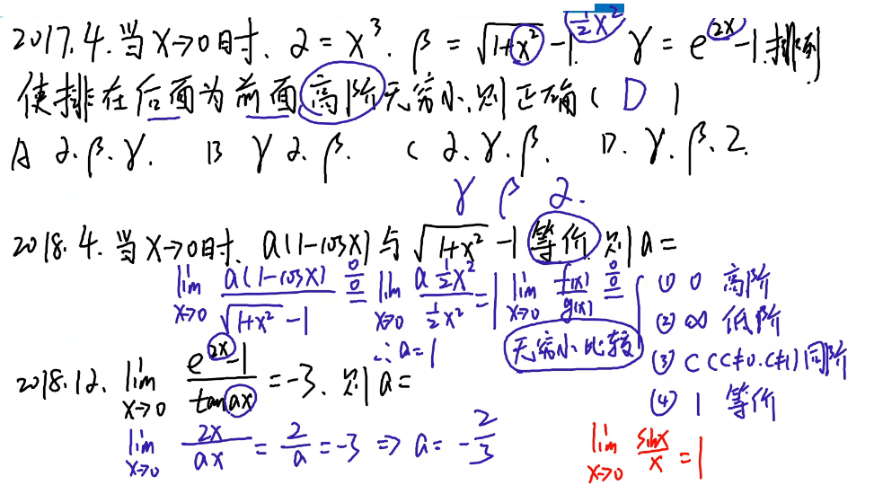
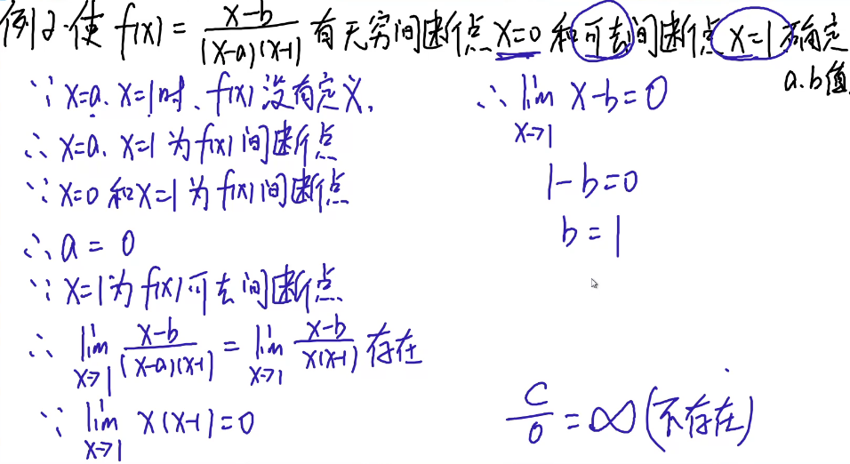
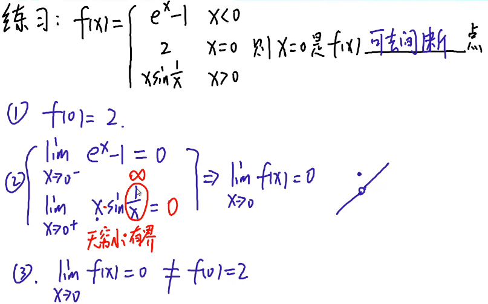
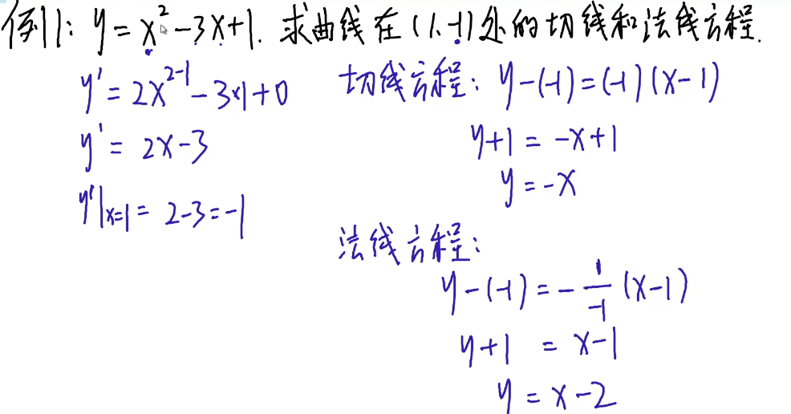
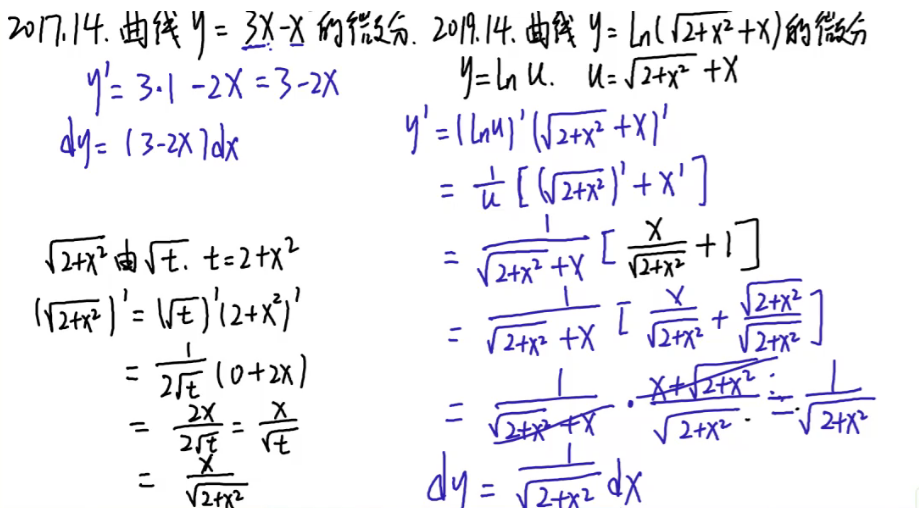

# 第一章

## 三角函数

1. 

## 考点一定义域

1. 
2. 规则
   - **大于取两边小于取中间**
   - **分段函数的定义域：最终结果取并集U**
3. 

## 考点二抓大头

1. 

## 考点三1$^\infty$

1. 

## 考点四无穷小的比较

1. 
1. 
3. **拆开是具体的数就可以拆开，拆开是无穷大就不可以拆**

## 考点五函数的连续性与间断点

1. 

2. 

   绝对值趋近于正是自己，趋近于负是相反数

   因为x=0，1为间断点表示函数不存在分母需要为0，由方程可以看出(x-1)和(x-0)需要为0所以a为0

# 第二章

## 考点一导数的定义

1. 
2. 
3. 

## 考点二切线和法线方程

1. 
2. 

##  考点三微分

1. 
2. 

## 考点四高阶导数

1. 
2. 

## 考点五函数的单调性

1. 
1. 注意：**如果函数是两个要通分看看**

   
