# 数学

## 第一章 函数极限与连续

### 函数

- 函数的概念：描述变量之间的关系 

  ```
  y=f(x) 
  f——>对应法则 
  x——>自变量  :定义域
  y——>因变量  :值域
  ```

### 基本初等函数

##### 1.常数函数

- 常数函数  y=c(常数) 是偶函数

  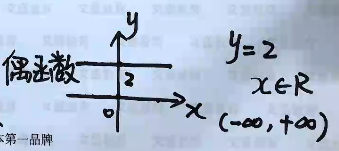

##### 2.幂函数

- 幂函数  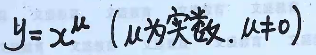

- μ =1 

  - y=x 直线 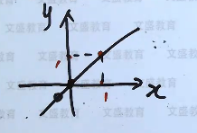

  - y=2x  直线      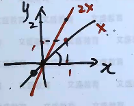

  - y=2x-1 直线    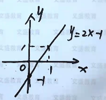

  - y=2x 与  y=2x-1 平行

  - **y=kx+b (k!=0)  k：斜率**

  - 斜率相乘是-1 就垂直  k1*k2=-1

  - 斜率相等就平行 

  - 求直线方程：点斜式

    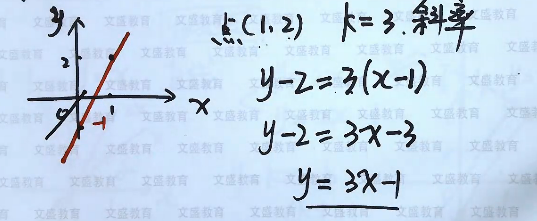

- μ =2

  - y=x^2 抛物线

    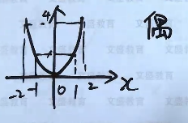

  - y=x^4 抛物线

    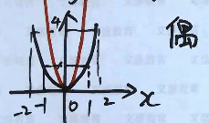

  - y=-x^2

    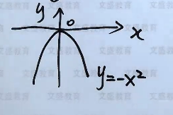

  - y=2x^-1

    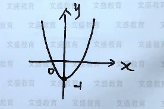

    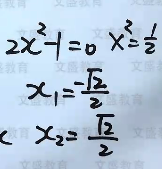

- μ =3

  - y=x^3  奇函数

    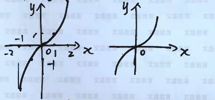

  - y=x^5 y=x^7 奇函数 

- μ =-1 

  - y=x^-1  = x\1  双曲线 x!=0  奇函数 

    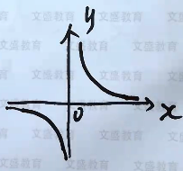

- μ =2/1

  - y=x^2/1 =√￣x     x>=0

    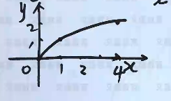

  - (y)^2  =(√￣x)^2 =x    =  x=y^2     >=0

    **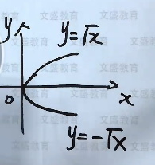**

##### 3.幂函数的性质

- (x^p^)^q^ =x^p*q^   

  例子 （x^3^）^2^ =x^6^  != x ^5^

- X^p^ * X^q^ =x^p+q^

  例子（x^3^）^2^ =x^5^  != x^6^

- x^q^ \ x^p^ = x^p-q^   

  例子  x^3^ \ x^2^ = x  

- x^p^ \ 1 = x^-p^  

  例子  x \ 1 = x^-1^      x^3^ \ 1 = x^-3^   

- ^m^√￣x^n^ = x^m\n^  

  例子  ^2^√￣x^1^ = x^2\1^   ^3^√￣x = x^3\1^     ^4^√￣x^3^ = x^4\3^    

##### 4.指数函数

- y= a ^x^ (a>0 , a!= 1)   x$\in$ (-$\infty$,+$\infty$)   y$\in$(0,+$\infty$)

  - a^0^ =1 

  - a>1    y=2^x^  y=3^x^ 

    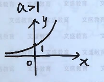

  - 0<a<1  y=(2\1)^x^  y=(3\1)^x^ 

    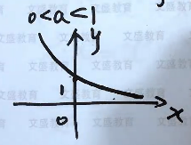

  - y=e^x^  e=2.718281...   >1

    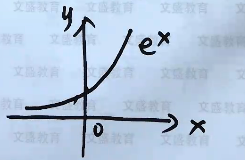

  - y=e^-x^    =(e^-1^)^x^  = (e\1)^x^    e\1<1   和y=e^x^ 对称

    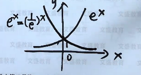

##### 5.指数函数的性质

- (e^x^ )^y^ =e^xy^ 
- e^x1^ * e^x2^ =e^x1+x2^
- e^x1^ \ e^x2^ =e^x1-x2^
-  e^x^ \ 1 =e^-x^
- ^m^√￣(e^x^)^n^ =^m^√￣e^xn^ =e^m\xn^
- (a*b)^x^ =a^x^ * b^x^
- 例题
  - (e^x^)^2^ =e^2x^  != e^x^^2^
  - e^3x^ * e^2x^ =e^5x^
  -  e^3x^ - e^2x^  =e^2x^ (e^x^ -1)                ! =e^x^
  -  e^3x^ \ e^2x^=e^x^
  - ^3^√￣e^2x^ =e^3\2x^ 

##### 6对数函数

- y=log^x^$_{a}$    x>0 x是对数里面的真数   a >0 != 1   a是对数里面的底数

  注意对数中x=1 y=0

  y=a^x^  --> x=log$_{a}$ ^y^  --> y=log^x^$_{a}$ 2 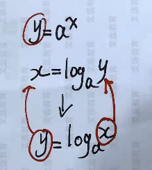

  - a>1

    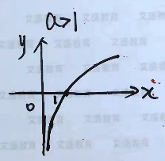

  - 0<a<1

    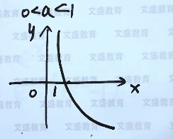

  - 

- 


## 第二章 一元函数微分学及应用

### 导数与微分

### 导数应用

## 第三章 一元函数积分学及应用

### 不定积分

### 定积分

### 定积分与应用

## 第四章 向量代数和空间解析几何

## 第五章 多元函数微积分

### 偏导数与全微分

### 偏导数应用

### 二重积分