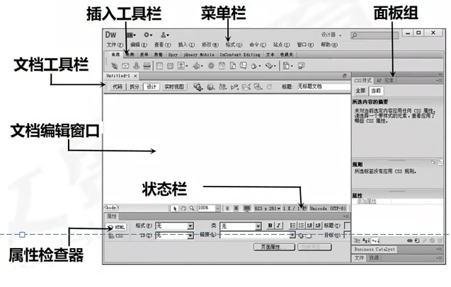

# 网页制作核心知识点

## **网页、网站、互联网的含义及三者之间的联系，网站设计规划流程，以及不同网站类型中不同的设计与制作要求。**

1. 网页、网站、互联网的含义及三者之间的联系。
   - **Internet**中文正式译名为“**因特网**”，是一个**全球性的、开放的计算机互联网络**，是世界上**最大**的计算机网络；
   - **WWW**是World Wide Web的缩写，中文名字常译作“**万维网**”，WWW是一个**由许多互相链接的超文本文档组成的系统，通过互联网访问**。
   - **网页**是使用**HTML语言编写的文件**，是**一种可以在www网上传输**，并**被浏览器认识和翻译成页面**显示出来的文件。
   - **通常把一系列逻辑上可以视为一个整体的**页面叫做**网站**，或者说，**网站**就**是一个相互链接的网页集合**。
2. 网站设计规划流程。
   - 网站**建设前的准备**工作
   - 创建**网站的导航结构**
   - **组织文档和数据**，**进行具体的网站建设**
   - **测试网站**
   - 网站建设后要**申请域名和主页空间**
   - 网站制作完成后的**发布**
   - **网站备案**
   - **网站的宣传**
3. 不同网站类型中不同的设计与制作要求。
   1. **展示型网站**：这种类型的网站主要在于显示和查询产品。设计此类网站时，需要在主页上突出显示更多产品并设计一些产品显示模块。
   2. **品牌宣传类型**：品牌宣传网站通常以宣传为重点，目的是提高企业的知名度。对于品牌类别比较多的公司，可以基于不同的类别构建不同的网站，这样可以让市场营销和网站内容相统一。
   3. **营销性质的网站设计**：该网站以卖产品为主，目的是为了让用户买单，设计网站时一定要让用户感受到产品的好。设计网站时要注意创意好不好，产品卖点设计够不够突出，或者文案信息够不够吸收人。
   4. **门户综合信息网站**：该网站是企业针对潜在客户或业内人士的窗口。这类型的网站设计包括技术支撑、社会公共关系处置等等。网站包含的东西十分多，信息量大，访问的客户十分广，信息更新比较多，要多个部门互相配合才干完成。
   5. **商城网站**：商城网站主要用于产品销售。购买对象可以是公司或个人。设计这种类型的网站应注意网站的布局规划，并且层次结构应合理。由于购物中心类型的网站上有很多品，因此该网站容易造成混乱，如果操作不当，将会影响用户体验。
   6. **服务公司的网站设计**：该类网站主要目的是整合信息，以及提供平台。在设计时应考虑信息能否阅读明晰，界面是否简洁，能否便于用户寻觅信息，以及企业优势的展现。
   7. **处理计划级企业网站设计**：这种网站既要显示产品，又要集成资源。为客户提供营销
      思路，又提供处理计划。那么在设计的时能否让用户明白业务类型，理解公司的优势和实力，以及产品能否醒目等，是比较重要的。

## **FTP、HTTP等基础网络知识含义，HTML语言的一般规律，包括语法结构和常用标签。**

1. FTP(File Transfer Protocol,文件传输协议)

   - **FTP是TCP/IP协议组中的协议之一**。FTP协议包括**两个组成**部分。**FTP服务器**和**FTP客户端**，其中**FTP服务器用来存储文件**，用户可以**使用FTP客户端通过FTP协议访问位于FTP服务器上的资源**。在开发网站的时候，**通常利用FTP协议把网页或程序传到Web服务器上**
   
2. HTTP协议

   - **Internet遵循一个重要的协议及HTTP**(Hypertext Transfer Protocol)**超文本传输协议**，**HTTP**是**用于传输Web页的客户端/服务器协议**。它详细**规定了浏览器**和**万维网服务器**之间**互相通信的规则**。

3. HTML语言的一般规律，包括语法结构

   1. **“<”和“>”**是**任何标记的开始和结束**。**元素的标记**要**用这对尖括号括起来**，并且**结束的标记总是在开始的标记前加一个斜杠“/”**；

   2. **标记可以嵌套使用，但不能交叉使用**。

   3. 在源代码中**不区分大小写**，如以下几种写法都是正确并且相同的标记：<**HEAD**><**head**>、<**Head**>,但推荐在一个项目中使用一种风格；

   4. **任何回车符**和**空格**在**HTML代码中都不起作用**。为了代码清晰，**建议不同的标记都单独占一行**

   5. **标记中可以放置各种属性**，**属性值都用" "括起来**；

   6. 编写代码，一般应该使用**缩进风格**，以便更好的理解页面的结构，便于阅读和维护。

   7. 一个完整的HTML文件**包含头部和主体两个部分**的内容，**在头部内容里，可定义**
      **标题、样式等**，文档的**主体内容就是要显示的信息**。基本结构如下：

      ```
      <html>
      	<head></head>
      	<body></body>
      </html>
      ```

## **网页制作软件Dreamweaver的开发与设计环境，界面各模块的作用及各个模块之间的功能联系。**

1. Dreamweaver CS6的工作界面由**菜单栏、文档标签栏、文档工具栏、文档编辑区、标签选择器、“属性”面板、“文件”面板**组等组成。
   
   - 菜单栏
     **菜单栏**几乎集中了DreamweaverCS6的**全部操作命令**，利用这些命令可以编辑网页、管理站点以及设置操作界面等。要执行某项命令，可首先单击主菜单名打开其下拉菜单，然后用鼠标单击相应菜单项。
   
   - 文档标签栏
   
     文档标签栏位于应用程序栏下方，左侧显示当前打开的所有网页文档的名称及其关闭按钮：右侧显示当前文档在本地磁盘中的保存路径以及还原按钮。
   
   - 文档工具档
     利用文档工具栏中左侧的按钮可以在文档的不同视图之间快速切换。
   
   - 文档编辑窗口
     显示当前创建和编辑的文档。
   
   - 属性面板
     用于查看和更改所选对象或文本的各种属性。每个对象都具有不同的属性。
   
   - 标签选择器
     位于“文档”窗口底部的状态栏中。显示环绕当前选定内容的标签的层次结构。单击该层次结构中的任何标签可以选择该标签及其全部内容。
   
   - 面板组
     帮助监控和修改工作。包括“插入”面板、CSS面板和“文件”面板。若要展开某个面板，
     请双击其选项卡。
   
   - “文件”面板
     无论它们是Dreamweaver站点的一部分还是位于远程服务器，都可以将它们用于管理
     文件和文件夹。使用“文件”面板，还可以访问本地磁盘上的所有文件。

## **站点规划及管理，站点中的文件和文件夹的管理，规划站点及重新布局编辑**

1. 网站的规划
   (1)网站总体结构的确立
   (2)网站目录的设置
   (3)网站链接结构的设置
2. 站点的创建与管理

   1. **站点**的概念：**站点可以简单地理解为存放网页及各种素材的文件夹**。
   2. 站点的**分类**：
      - 按**地理位置分**：**本地站点**：本地计算机硬盘中存放网页的文件夹；**远程站点**：internet网络服务器上存放网页的文件夹。
      - **按交互性分**：**静态站点**：浏览者与网页之间不涉及交互活动，静态页面向每一位浏览者发送完全相同的响应；**动态站点**：动态页面可自定义响应，根据浏览者的输入信息提供不同的页面。
   3. Dreamweaver中创建站点
      - 创建本地静态站点的步骤
        ①运行Dreamweaver,.选择**“站点→新建站点**”命令，打开“**站点定义向导**”对话框；
        ②在“**编辑文件**”**对话框中输入站点的名称，单击“下一步**”；
        ③在“**编辑文件**，第2部分”对话框中询问是否使用服务器技术，选择“否”，单击“下一
        步”
        ④在“**编辑文件**，第3部分”中，选择网页存放的处理方式及指定指定文件夹，单击“下
        一步”；
        ⑤在“**共享文件**”对话框中询问如何连接到远程服务器，选择“无”单击“下一步”：
        ⑥显示“总结”对话框，单击“完成”。
   4. 管理站点
      站点被创建后，选择“站点→管理站点”命令，打开“管理站点”对话框，可以对其进行**编辑，复制、删除、导出后导入**等操作。
      - 如果需要编辑某个站点，只需在“站点管理”对话框中选择这个站点的名称，然后点
        击“编辑”按钮，可以修改其站点设置，操作与创建站点的步骤类似。
      - 站点复制操作将建立本站点的副本，副本将出现在站点列表窗口中，此操作容易引发混乱，因此对于初学者不建议使用。
      - 站点删除操作：将删除所选站点，此操作无法撤销。需要注意的是此操作仅删除
        Dreamweaver CS中的站点，不会删除磁盘上的文件夹以及相关文件。
      - 导入/导出站点：可以将站点导出为包含站点设置的ML文件，并在以后将该站点
        导入Dreamweaver CS。这样，就可以在各计算机和产品版本之间移动站点，甚至与其他用户共享这些设置。
3. 站点中的文件和文件夹的管理

   - Dreamweaver中在“文件”面板上，从“站点”弹出式菜单中选择一个“站点”，
     就可以对相应的站点文件内容进行维护管理。使用“文件”面板工具栏的工具可以方便
     与远程服务端上的文件进行“同步”、“获取”、“上传”等操作。
     通过“文件”面板可以直接对站点中的文件或者文件夹进行操作，十分方便，例如，
     可以打开文件、更改文件名、添加、移动或删除文件。其主要操作有：
     - (1)查看站点中的文件
     - (2)在站点中新建文件夹和文件
     - (3)重命名文件或文件夹
     - (4)删除文件或文件夹
     - (5)移动文件或文件夹
     - (6)刷新“文件”面板
     - (7)在站点中查找最近修改的文件

## **网页常见元素，如文字、图像、脚本程序等的含义。**

1. **文本**：文本(text)指由字符（如字母、数字等）组成的符号串，例如句子、段落、文章等。
2. **图形**：图形(graphic)也称为矢量图，一般是指由计算机生成的由直线、任意曲线、圆弧、矩
   形等构成的几何图和统计图等。
3. **图像**：图像(image)是指由输入设备捕捉的实际场景画面，或以数字化形式存储的任意画面，是由像素点阵构成的位图。
4. **音频**：人类能够听到的所有声音（包括噪音）都称为音频(audio)。
5. **动画**：静态画面的连续播放便形成了动画(animation)。
6. **视频**：视频(video)泛指将一系列静态影像以电信号方式加以捕捉、记录、处理、存储、传送和重现。
7. **脚本程序**：脚本是使用**特定描述性语言以特定格式编写的一系列指令**。

## **超级链接基础知识，目录分类、绝对路径、文档路径和相对路径的概念与区别，超级链接的分类。**

1. 超链接基础知识

   1. **超链接允许从一个网页跳转到另一个网页**，**多个网页正是因为有了超链接才成为一个网站**

   2. **超链接不仅可以链接到一个网页**，还**可以链接到图片、视频、音频，甚至任何一种文件**

   3. **超链接链接到一个网页的时候，这个网页既可以是内部网页，也可是外部网页**。

   4. 超链接的语法结构：

      ```html
      <a href=‘链接目标’ name=‘’ target='打开链接的目标窗口'>链接对象<a>
      ```

      - **href用于设置链接目标**，可以是网页文件等各种资源，即超链接的链接地址
      - **name用于设置超链接当前位置的锚名称**，决定其他超链接链接到的位置
      - **target用于设置打开超链接地址的目标窗口**
      - **链接对象可以是文字，也可以是图片**

2. 目录分类、绝对路径、相对路径

   1. **链接目标可以是相对地址指定也可以通过绝对地址指定**。对应的也成为**相对路径和绝对路径**。
   2. **绝对路径是按照硬盘文件的真正路径**，也可以是按照域名的完整网页路径。**使用绝对路径定位链接目标比较清晰**，但是如果该目标文件的**位置发生了变化**，就**需要重新设置**所有的相关链接。
   3. **相对路径就是自己相对目标位置的路径**，**使用相对路径**，不论将**这些文件放在哪里**，**只要他们的相对关系没有变化，就不会出错**。
      - **同一目录下的文件**，**直接输入链接文件的名字即可访问**（文件名需要加后缀名）
      - **上一级目录中的文件**，**在目录名和文件名之间加“../”**，**再加上链接文件的名字即可访问**。**如果上两级，则“../../”**
      - **下一级目录的文件**，**添加目录名加上“/”**，**再加上链接文件的名字即可访问**。

3. 超链接的**分类**

   - **不同的分类标准有不同的类别**
   - 根据**链接目标**可以分为**外部链接和内部链接、书签链接（锚点链接）、图像热区链接**
   - 根据**链接对象**可以分为**文字链接、图像链接**

## 网页制作中表格的概念和作用，表格对浏览器的兼容程度，表格布局和标准布局的区别，创建、编辑、格式化表格的方法和作用。

1. 网页制作中表格的概念和作用

   - **表格**以**简洁明了和高效快捷的方式将数据、文本、图片、表单等元素有序地显示在页面上，从而设计出版式漂亮的页面。**

   - **创建表格语法**

     ```html
     <table>
     <caption>表题</caption>
     	<tr>
     		<th>表头</h>
     	</tr>
     	<tr>
     		<td>表格内容</td>
     	</tr>
     </table>
     ```

   - HTML中的表格除了**用来对齐数据**之外，更多地用来**进行页面排版**

2. 表格对浏览器的兼容程度

   - **所有的浏览器都支持表格**

3. **表格布局和标准布局的区别  何为标准布局？可以介绍下表格布局与div+css布局**

   1. **表格是网页设计制作中的一个重要的网页元素，用于网页的排版，使页面的信息布局合理、简洁**。
   
      表格排版存在的问题：
   
      - 表格排版**页面难修改或升级**，当页面制作完成后，要将**其中的位置对调，那么相当于重新制作一个页面**。而**CSS排版利用position和float属性可以快速的移动和重新定位**，让用户动态选择界面的功能。
      - 表格排版的页面**在下载时必须等整个表格的内容都下载完毕后才会一次性显示出来**，而利用**DIV+CSS排版的页面在下载时，各个子块可以分别下载显示**，从而**提高了页面的下载速度**。
      - **复杂的表格设计使得设计不易，修改更复杂**，最后生成的网页代码除了表格本身的代码，还有许多没有任何意义的图像占位符及其他元素，文件量庞大，导致**浏览器下载，解析速度变慢**，**维护和更新困难**。
   
   2. DIV+CSS布局，**网页改版维护与方便快捷**
      运用**CSS技术可以把要展示的内容与其表现样式分开**，对**CSS文件进行修改**，其他HTML文件中**自动进行套用**，不必在每个HTML文件中重复设置，**减少设计者更多负担，修改页面更省时**。
      
      - **保持视觉的一致性**：运用DIV+CSS技术，方便地为所有网页设置一种风格，使用DIV+CSS的制作方法，可以将所有页面，或所有区域统一由CSS文件控制，避免了不同区域或不同页面体现出的效果偏差。
      - **页面载入得更快**：大部分页面代码写在了CSS当中，使页面体积容量更小。相对于表格嵌套的方式，DIV+CSS将页面独立成更多区域，打开页面时，逐层加载，而不像表格嵌套那样整个页面圈在一个大表格里，由此页面加载速度更加极速。
      - **搜索引擎友好程度高**：用表格进行网页布局的代码较多，搜索引擎要把多的代码去掉。而使用DIV+CSS布局设计网页，所有样式都在CSS里，正文代码得到极大的精简，也减少了HTML代码，正文就突出了，搜索程序能在更短的时间内爬完整个页面，搜索程序执行效率得到了提升。
      
   3. 总之：**使用DIV+CSS布局，实现了结构、表现和行为的分离**。**提高了网页开发的效率和页面下载的速度**，**提高了网站维护和修改的效率**，对**比**与传**统表格布局更加方便以及轻松**，**传统表格使得设计不易，修复复杂，会有很多没有意义的东西占用元素，文件量过大使得浏览下载失败。**

## **模板和库项目的含义与作用。**

1. **模板**是制作其他网页文档时使用的基本文档，一般在**制作统一风格的网页**时会经常使用该功能。
   - **能使网站的风格保持一致**
   - **有利于网站的维护，在修改共同的一面时不必每个页面都修改，只需修改应用的模板即可**
   - **极大地提高了网站的制作效率**。
2. **库**是指将**页面的导航条、版权信息、公司商标等常用的构成元素转换为库保存起来**，在需要的时候调用。
   - Dreamweaver**允许将网站中需要重复使用或经常更新的页面元素存入库中**，存入库中的元素**称为库项目**，它**包含已创建并且便于放在Web页上的单独资源或资源副本的集合**。
   - **当页面需要时**，**可以把库项目拖拽到页面中**。若**对库项目进行修改**，**整个网站各页面上与库项目相关的内容都会更新**。
   - **库**本身是**一段HTML代码**，而**模板本身是一个文件**。Dreamweaver CS6将所有**模板文件存放在站点根目录下的Templates子目录中**，**扩展名**为.**dwt**，**将库项目存放在每个站点的本地根目录下的Library文件夹中，扩展名为.lbi**。

## 框架布局和层布局的概念，以及两者与表格布局的不同

1. **框架**是**网页文档窗口带有边框的矩形区域**，是**一个网页文档容器**，用于**显示一个独立网页文件**
2. **框架集**是HTML文件，**它定义一组框架的布局和属性**，包括**框架的数目、框架的大小**和**位置**以及在每个框架中**初始显示的页面URL**。**一个含有框架的网页文档必须要有一个框架集文件**。
3. 框架集在制作框架网页时的**作用**：**框架集本身不包含要在浏览器中显示的内容，只包含框架网页的基本结构和样式，以此规定浏览器如何显示一组框架以及在这些框架中显示哪些网页文档**
4. 表格、框架和APDⅳ在网页布局方面的特点：
   - **表格具有制作简单、兼容性好等特点**
   - 使用**框架布局网页**，**浏览者单击框架网页中某个超链接时**，浏览器**通常不需要重新加载**（即重新从Web服务器下载）**框架中的每个网页**，**只需要重新加载某个框架中的网页**，因此**可以减少一些不必要的网络传输**，提高网页的**浏览速度**。此外框架都**具有自己的滚动条**，**子页可以独立滚动**，并且在**框架网页重新加载时也互不影响**
   - 使用**APDⅳ布局网页可以产生许多重叠效果**，由于**层游离于网页之上**，因此在**布局时，使用AP Div布局网页非常自由、灵活**。
5. AP Div的基本操作有：**调整AP Div大小、移动AP Div、对齐AP Div、更改AP Div的顺序、设置AP Div的可见性和删除AP Div**等。

## CSS样式表的概念、规则和作用，创建管理CSS样式表的意义，DIV+CSS布局网页的优点。

1. 概念

   **CSS全称**为Cascading Style Sheets，中文翻译为“**层叠样式表**”，简称**CSS样式表**，也称为**级联样式表**。它是一种用来**表现HTML或XML等文件式样的计算机语言**。是用来**表示html样式的一种编程语言，**是可以**做到网页和内容进行分离的一种样式语言**。

   - 主要用来**定位网页中的元素以及对网页进行排版和风格设计**。可以**定义网页网速的各种属性改变元素的外观或者元素的位置**。
   - 在网页制作时采用CSS技术，**可以有效地对页面的布局、字体、颜色、背景**和其它效果实现更加**精确的控制**。只要对**相应的代码做一些简单的修改**，就可以改变同一页面的不同部分，或者页数不同的网页的外观和格式。

2. CSS样式表有**三种类型**

   - **外部链接的样式表。指使用CSS文件链接到HTML文件**。
   - **内部样式表。是指HTML页面头部(head里)的样式表，形式为：声明{属性：值；}**
   - **内嵌样式表。是指HTML标签里面内嵌的样式，形式为style="属性：值；”**

3. CSS的作用

   **CSS主要用来设计网页的样式，美化网页**；它不仅**可以静态地修饰网页**，还可以**配合各种脚本语言动态地对网页各元素进行格式化**。

   - CSS能够对网页中元素位置的排版进行**像素级精确控制**，**支持几乎所有的字体字号样式**，拥有**对网页对象和模型样式编辑的能力**。
   - 在**主页制作**时采**用CSS技术**，**可以有效地对页面的布局、字体、颜色、背景和其它效果实现更加精确的控制**。
   - 只要对相应的代码做**一些简单的修改**，就**可以改变同一页面的不同部分**，或者页数不同的网页的外观和格式。
   - 在css进入前端语言之前，很多一部分人都把css当做一种前端语言，发展至今，css不仅能装饰网页，也可以配合各种脚本对于网页进行格式化。
   - **主要用来设计网页的样式，美化网页；能够对网页中元素位置的排版进行像素级精确控制，支持几乎所有的字体字号样式：对页面的布局、字体、颜色、背景和其它效果实现更加精确的控制。**

4. 使用CSS的意义

   CSS的最大优点是它**允许将样式和布局从文档的内容中分离出来**。

   - **CSS节省大量时间**。CSS为设置元素的样式属性提供了很大的灵活性。您可以编写一次CSS;然后可以将相同的代码应用于HTML元素组，也可以在多个HTML页面中重用。
   - **易维护**。CSS提供了一种简单的方法来更新文档的格式，并保持多个文档之间的一致性。因为可以使用一个或多个样式表轻松控制整个网页集的内容。
   - **页面加载速度更**快。CSS使多页能够共享格式信息，从而减少了文档结构内容的复杂性和重复性。它显着地减少了文件传输的大小，从而导致了更快的页面加载。
   - **HTML的高级样式**。CSS比HTML具有更广泛的表示能力，并且对网页的布局提供了更好的控制。因此，与HTML表示元素和属性相比，您可以更好地查看您的网页。
   - **多设备兼容性**。CSS还允许为多种设备或媒体优化网页。使用CSS,可以为不同的呈现设备（如桌面、手机等）以不同的查看样式表示相同的HTML文档。

5. DIV+CSS布局，网页改版维护与方便快捷

   **运用CSS技术可以把要展示的内容与其表现样式分开**，**对CSS文件进行修改**，**其他HTML文件中自动进行套用**，**不必**在每个HTML文件中**重复设置**，**减少**设计者更多**负担**，**修改**页面**更省时**

   - **保持视觉的一致性**：运用DIV+CSS技术，方便地为所有网页设置一种风格，使用DIV+CSS的制作方法，可以将所有页面，或所有区域统一由CSS文件控制，避免了不同区域或不同页面体现出的效果偏差。
   - **页面载入得更快**：大部分页面代码写在了CSS当中，使页面体积容量更小。相对于表格嵌套的方式，DIV+CSS将页面独立成更多区域，打开页面时，逐层加载，而不像表格嵌套那样整个页面圈在一个大表格里，由此页面加载速度更加极速。搜索引擎友好程度高：用表格进行网页布局的代码较多，搜索引擎要把多的代码去掉。而使用DIV+CSS布局设计网页，所有样式都在CSS里，正文代码得到极大的精简，也减少了HTML代码，正文就突出了，搜索程序能在更短的时间内爬完整个页面，搜索程序执行效率得到了提升。
   - 总之：**使用DIV+CSS布局，实现了结构、表现和行为的分离。提高了网页开发的效率和页面下载的速度，提高了网站维护和修改的效率，对比与传统表格布局更加方便以及轻松，传统表格使得设计不易，修复复杂，会有很多没有意义的东西占用元素，文件量过大使得浏览下载失败。**

## 表单的概述，包括表单的定义、作用和制作方法。

1. 表单**定义**、**作用**

   - **用于收集用户在客户端提交的各种信息，是动态网页的外在形式，是浏览器与服务器交互的重要手段。它通过收集来自用户的信息，并将信息发送给服务器端程序处理，来实现网上注册、网上登录、网上交易等多种功能。**

2. 表单的基本语法如下

   - ```html
     <form action='URL地址'method='提交方式'name='表单名称'>
     	表单控件（也称为表单元素）
     <form>
     ```

## 网页制作中，层的设置和时间轴的概念及行为的含义与作用。

1. **层**
   1. **如果用户想在网页上实现多个元素重叠的效果，可以使用层。层是网页中的一个区域，并且游离在文档之上。利用层可以精确定位和重叠网页元素。通过设置不同层的显示或隐藏，实现特殊的效果。**
   2. 层的引入有2个方面的**优势**
      - 层出现之前，一般使用表格控制网页元素的位置。如果要精确定位网页元素，则必须在表格内嵌套表格，使得设计网页变得复杂，而且加载速度也会变慢。层可以灵活的定位网页元素。
      - 层出现之前，所有网页元素在同一个平面内，可以利用的空间和设计技术手段十分有限。层出现后，网页设计的空间由二维拓展成三维，从而大大增加了设计人员的自由空间。
2. **时间轴**
   1. DW提供了在**网页上制作动态效果的功能**，**利用时间轴组织、控制层和图像等对象，在一定时间内播放，从而产生动态效果。**
   2. **时间轴也叫时间线**，是一条贯穿时间的线，用来表示网页显示时间内发生的各种状态。在时间轴上不同时间部位放置不同的内容，可以实现网页的动态效果。它是通过向文档中添加JavaScript代码实现动态效果的，不需其他空间、插件或Java小程序的支持。
   3. **时间轴动画是通过让层的位置、可见性和叠加顺序等属性随时间变化所生成的动画**。
   4. 基本原理是**使层中的内容在一定时间内，按照设计好的路线显示在页面中**。
   5. 时间轴例的层叫做**动画栏**，时间轴的**基本单位是帧**，整个时间轴**由许多帧构成，这些帧在页面中连续播放就构成了时间轴动画**。
   6. 由时间轴的原理可知，**时间轴必须与层结合起来使用**。**创建动画时，各种元素先放置到层中，然后再结合时间轴创建动态效果。**
3. 什么是行为？什么是事件？什么是动作？三者之间有什么联系？
   - **对象**：是**产生行为的主体**。**网页中的很多元素都可以成为对象**，**如网页中的一个图像、一段文字等元素，也可以是整个网页文档。**
   - **事件**：是**由用户或浏览器触发的事件**。**事件经常是针对页面元素的，如鼠标经过、鼠标单击、按下键盘上的键、网页加载等**。
   - **动作**：**通常是一段JavaScript代码，用于完成某些特殊的任务。如打开一个窗口时自动播放声音、弹出信息窗口等**。
   - **行为**：事**件和动作组合起来就构成了行为**。事件是产生行为的条件，动作是行为的具体结果。
   - **行为是由对象、事件和动作构成的。例如，当用户把鼠标移到对象上，这个对象会发生预定义的变化。**