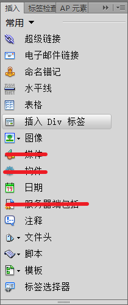
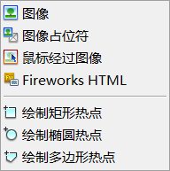
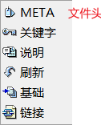
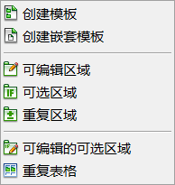
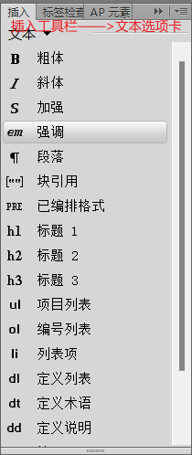
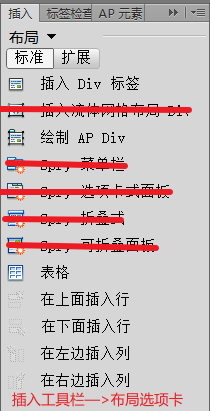
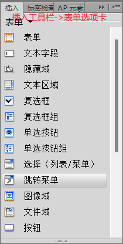
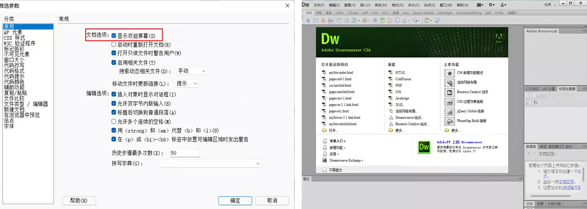
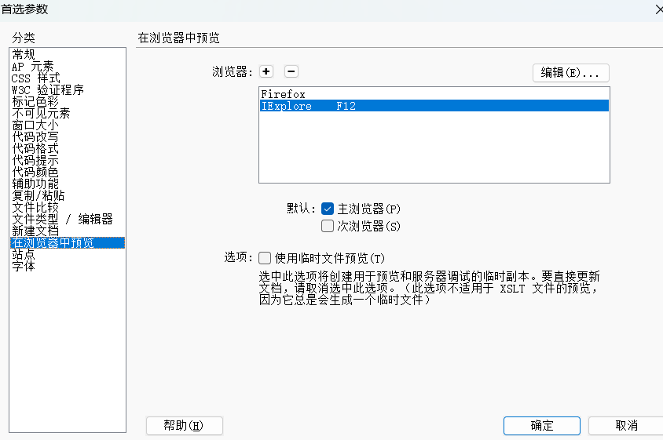
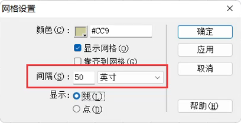

# 第一章网页制作基础知识

## 网络基础知识

1. Internet

   - **Internet**由不同地区、规模大小不一的网络互相连接而成是一个全球性的计算机互联网络，一般翻译为“**因特网**”或**国际互联网**”
   - 其**作用**是可以在国际范围进行**信息传递、资源共享**。
   - 常用的服务有
     - **WWW服务：最广泛的服务**
     - **电子邮件（E-mail)**
     - **网上交际**
     - **电子商务**
     - **文件传输**
     - **远程登录Telnet**
     - **网络新闻Usenet**

2. WWW简介

   - **WWW**是**World Wide Web**的缩写，“环球信息网”，中文名字常译作“**万维网**”
   - WWW是一个由许多**互相链接**的**超文本文档(网页)**组成的**系统**，通过互联网**Internet**访问
   - WWW是**单向连接**而不是双向连接

3. 浏览器

   - **浏览器作为Web客户端**通过URL向**Web服务器**发送所有请求，**Web服务器**根据收到的请求向客户端**回送应答**信息。
   - 浏览器(Browser)是对网页浏览器的简称，是**Web客户端**，它是一个应用程序，用于与**Web服务器**建立连接，并与之进行通信。
   - 网页浏览器主要是通过**HTTP(Hypertext Transfer Protoco），超文本传输协议)**与**Web服务器**进行交互并获取网页。
   - 常见的网页浏览器
     - 微软的Internet Explorer（IE)/Edge
     - Mozilla的Firefox
     - Apple的Safari
     - Opera
     - Google Chrome
     - 360安全浏览器
     - 搜狗高速浏览器

4. 服务器

   - **Web服务器**又称WWW服务器、网站服务器或站点服务器。从本质上讲，Web服务器就是一个**软件系统**，它通过网络**接收HTTP请求**，然后**提供HTTP响应**给请求者(浏览器)。
   - **发布**就是将本地网站的内容通过**FTP协议(文件传输协议)**传输到连接Internet的**Web服务器**上。网站发布后，即获得一个网站地址(URL)。**网站通常位于Web服务器上。**
   - **服务器与客户端可以是同一个计算机也可以不是同一个**

5. IP地址

   - 每台**主机**都**必须**有一个**唯一**的**网络地址**，即IP(Internet Protocol)地址，即TCP/IP协议表示的地址，并遵循相同的协议
   - IP地址是**层次地址**，由**网络地址**和**主机地址**组成
   - 主机间访问就是通过**IP地址**实现的，IP地址**长度为32位**，**分为4段**，由**十进制数字**组成，每段都在**0-255**之间，段与段之间用**句点**分隔，经常被写成“点分十进制”的形式。

6. 域名

   - IP地址（主机在网络中的位置)不便于人们记忆，不能显示地址组织的名称和性质，设计了**域名**，**通过DNS(Domain Name System域名系统)将域名和IP地址相互映射**
   - **一个域名对应一个IP地址，多个域名可同时被解析到一个IP地址**
   - 域名(Domain Name)是由一串用点分隔的名字组成的Internet.上某一台主机或一组**主机的名称**。
   - 域名采用**分层结构**，每个域名是由几个**域**组成的，域与域之间用“.”分开，最末域称为**顶级域**，其他的域称为**子域**
   - 顶级域分为两类
     - 国家顶级域名：**中国cn**,美国us,日本jp
     - 国际顶级域名：**.com**表示工商企业，**.net**表示网络提供商，**.org**表示非营利组织。新增**.firm**公司企业，.store销售公司或企业，.web突出www活动的单位，.arts突出文化艺术活动的单位， .rec突出消遣娱乐活动的单位，.info提供信息服多的单位，.nom个人
   - 中国的二级域名分为类别域名和行政区域名
     - .ac科研机构.com工业、商业、金融等公司，.edu教育机构，.gov政府部门，.mil军事部门，.net从事Internet相关的机构或公司，.org非盈利的组织或团体，.info提供信息服务的企业， .top顶级、标杆组织机构或个人
   - DNS规定
     - 域名中的每个域都由英文字母、数字、连接符(-)组成
     - 每个域不超过63个字符（最好小于12个字符)
     - 完整域名不超过255个字符
     - 域名不区分大小写
     - 级别越低的域名写在最左边,级别越高的域名写在最右边

7. HTTP协议

   - HTTP**(Hypertext Transfer Protocol)超文本传输协议**是Internet遵循一个重要的协议 ，HTTP是用于传输Web页的客户端/服务器协议。
   - 详细规定了**浏览器**和**网站服务器**之间互相通信的**规则**。
   - HTTP协议**默认使用80端口**。

8. URL

   - URL(**Uniform Resource Locator**)**统一资源定位符**，用于标识WWW上的某种资源，简称**网址**。用于完整地描述Internet.上网页和其他资源的**地址**的一种标识方法。

   - 每个网页都具有一个唯一的名称标识，即URL

   - **URL由四部分组成：协议类型，主机名，端口号和路径**

     - **主机名**：上例中的"www.sina.com.cn”部分，新浪网站的主机名，**可以是域名，也可以是IP地址。**
     - **端口号**：http 80,https 443 FTP 21
     - **所要访问的文件路径**：指明要访问资源的具体位置。在主机名与文件路径之间，一般用“/”符号隔开。
     - **URL组成中，只有端口号可以省略不写**

   - 协议类型

     - **file**：本地计算机上的文件，格式为file://

     - **http**：通过HTTP访问资源，用于传送网页，格式为

       http://www.sina.com.cn

     - **ftp**：通过FTP访问资源，用于传送文件，格式为

       ftp://192.168.1.20

     - **https**,通过安全的HTTPS访问资源，格式为https://

     - **mailto**,资源为电子邮件地址，通过SMTP访问，格式为mailto:

       **SMTP(Simple Mail Transfer Protocol)电子邮件传输协议**

     - gopher,通过Gopher协议访问资源，格式为gopher://

9. FTP协议

   - **FTP(File Transfer Protocol,文件传输协议)**(**默认端口号21**)是TCP/IP协议组中的协议之一。
   - **FTP协议包括两个组成部分**
     - **FTP服务器**：用于存储文件
     - **FTP客户端**：用户可以使用FTP客户端通过FTP协议访问位于FTP服务器上的资源。

10. TCP/IP协议

    - **TCP/IP(Transmission Control Protocol /Internet Protocol)**的简写，中文译名为**传输控制协议**/“**因特网互联协议**”或“**网际协议**”
    - TCP/IP**是Internet最基本的协议，是Internet基础。**

11. W3C

    - W3C(world Wide Web Consortium,万维网联盟)是Web技术领域非常具有权威性和影响力的国际中立性**技术标准机构**。
    - W3C非常重要的工作就是**发展Web规范，制定Web标准**。

## 网页

1. 网页
   - **网页（web page）存储在Web服务器上**，**其内容是由HTML**(Hyper Text Markup  Language,**超文本标记语言**)**语言编写而成的**。
   - 构成网页的基本元素
     - 文本
     - 图形
     - 图像：常用的格式bmp,tif,gif,jpeg,psd,png等
     - 音频：常用的格式midi,wav,mp3,afi等
     - 视频：常用的格式avi,mpeg,wmv,rm,asf,flv等
     - 动画：常用flash动画，.swf
   - **文字与图片是构成网页的两个最基本元素。**
2. 网页分类
   - 根据采用的技术，大致可以分为**静态网页**和**动态网页**两种
     - 静态网页：**浏览器端与服务器端不发生交互操作。.htm和.html为扩展名的文件**
     - 动态网页：**“动”指的是“交互性”  信息存储在服务器端的数据库**
     - 动态网页开发技术
       - ASP技术，网页文件后缀.asp
       - ASP.Net技术，网页文件后缀.aspx
       - JSP技术，网页文件后缀.jsp
       - PHP技术，网页文件后缀.php
   - 根据网页在网站中所处位置，网页可分为**主页/首页**和**内页**两种；
3. 网页制作的核心技术
   - 网页制作的核心技术 HTML网页结构+CSS+JavaScript(JS)
   - CSS**(Cascading Style Sheets)层叠样式表**,是一种用来表现HTML文件样式的标记语言，不仅可以静态地修饰网页还可以配合各种脚本语言动态地对网页各元素进行格式化。
   - **JavaScript是Web页面中的一种脚本编程语言**，也是一种通用的、跨平台的、基于对象和事件驱动并具有安全性的脚本语言。
   - 脚本编程语言：VBScript和JavaScript,**JavaScript是最常用的。**

## 网站

1. 网站是一组相关**网页**和**有关文件**的集合，以一定的方式相链接，成为一个整体。
2. **网页是网站的基本组成要素**。
3. 打开一个网站时看到的第一个页面就是**主页**，主页也是网站的**首页**。
4. 与主页相链接的其他各个页面称之为**内页**。
5. 一个网站通常只有一个首页文件。
6. **主页文件的名称index或者default;**
7. **主页/首页**是一个网站的主索引页，是网站的重中之重，是网站的灵魂。

## 网页设计与制作

1. 网页制作工具按照其工作方式，一般可以划分为两类，**一类是直接编写HTML源代码的软件**，例如EditPlus、微软的记事本HBuilder、Vebstorm等
2. **另外一类就是所谓的“所见即所得”的网页编辑工具**，这类软件一般提供了可视化的界面，使用者不需要手工编写HTML等代码。例如**Dreamweaver**软件。

# 第二章网页制作软件CS6

## Dreamweaver CS6

1. 菜单栏
   - Dreamweaver CS6有**10个主菜单**
   - 另外，也可以通过键盘打开菜单：**按下Alt键**，然后单击菜单名称后面括号内的大写字母。例如按Alt+F组合键就可以打开“文件”菜单。
     - **文件AIt+F，编辑AIt+E，查看Alt+V，插入AIt+I，修改Alt+M**
     - **格式Alt+O，命令AIt+C，站点Alt+S，窗口AIt+W，帮助Alt+H**
2. 插入工具栏
   - 
3. 文档”工具栏
   - “文档”工具栏包含：代码/拆分/设计/实时视图、设置网页标题和在浏览器中预览等
   - **设计视图**：是一个**可视化页面布局**、可视化编辑和快速应用程序开发的设计环境。在该视图中，CS6显示HTML文档完全编辑后的可视化表现形式，类似于在浏览查看时的内容。
   - **代码视图**：是一个用于**编写和编辑HTML代码、JavaScript代码**等的环境。
   - **拆分视图**：可以同时看到文档的“**设计视图**”和“**代码视图**”
   - **实时视图**：更为逼真地**呈现页面在浏览器中的外观，同时也可编辑**，在不必离开Dreamweaver.工作区的情况下提供另一种实时查看页面外观的方式。
4. 文档编辑窗口
   - 文档编辑窗口显示**当前正在编辑的文档内容**，可通过代码视图或设计视图，在文档窗口中插入文本、图像及音频和视频文件等内容。
   - 在Dreamweaver CS6中**可以同时打开多个文档**，通过单击"文档"”工具栏上方的标签在不同的文档中进行切换，如图
5. 状态栏
   - 
   - (1)标签选择器
     - 显示**环绕当前选定内容的标签**的**层次结构**。**单击该层次结构中的任何标签可以选择该标签及其全部内容**。
     - **单击body**可以选择文档的**整个正文**。另外，右键单击，可以弹出快捷菜单，通过该菜单可以对标签进行处理。
   - (2)选取工具
     - 可以选择页面中的对象，
   - (3)手形工具
     - 可以将网页在“文档”窗口中整体拖动。单击“选择”工具可禁用手形工具。
   - (4)缩放工具
     - 可以对页面的设计视图进行放大或缩小，**按住Alt键**可以进行放大/缩小功能的切换。
   - (5)设置缩放处比率
     - 在该项的下拉列表中可以为文档设置缩放比率。
   - (6)手机大小
     - 默认情况下，按手机大小480X800显示文档的预览
   - (7)平板电脑大小
     - 默认情况下，按平板电脑大小768X1024显示文档的预览。
   - (8)桌面电脑大小
     - 默认情况下，在宽度大小为1000像素的桌面中显示文档预览。
   - (9)窗口大小
     - 可以将“文档”窗口的大小调整到预定义或自定义的尺寸。更改设计视图或实时视图中页面的视图大小时，仅更改视图大小的尺寸而不更改文档大小。
   - (10)文档大小和估计下截时间
     - 显示当前文档的大小以及下载该文档所需要的时间。
   - (11)页面编码
     - 显示当前页面的编码格式。
6. 属性检查器
   - “**属性”检查器（属性面板)**主要用于**检查和编辑当前选定页面元素（如文本和插入的对象)的最常用属性**(不是所有属性)。页面中的元素都有各自的属性，属性检查器中的内容根据选定的元素会有所不同。
   - 默认情况下，属性检查器位于文档工作区的底部，但是如果需要的话，也可以将它变为工作区中的浮动面板。
   - 
   - 
   - 依次为项目列表、编号列表、别除内缩区块、内缩区块(<**blockquote**>)
   - 
   - 依次为编辑、编辑图像设置（优化)、剪裁、亮度和对比度、锐化
   - 依次为矩形热点工具、圆形热点工具、多边形热点工具
   - 
   - 清除列宽，清除行高，将表格宽度转换成像素，将表格宽度转换成百分比
   - 
   - 合并单元格，拆分单元格
   - 
   - 
   - 
   - 
7. 面板组
   - **插入工具栏**（插入面板）**默认显示**  Ctrl+F2
   - **属性检查器**（属性面板）**默认显示**  Ctrl+F3
   - **文件面板 默认显示** **F8**  F5刷新文件面板
   - CSS样式面板Shift+F11
   - 框架面板 Shift+F2
   - 行为面板 Shift+F4
   - 资源面板
   - AP元素面板
   - **时间轴面板**DWCS6没有**AIt+F9**
   - **F9 “标签检查器”面板**
   - 在编辑页面时**按F4键**可**暂时隐藏整个面板组**，再按下**F4键**即可**恢复**整个面板组的显示。
   - 面板组中的各个组合面板都可以通过**“窗口”菜单Alt+W**进行选择，以确定是否显示该面板。
8. 文件面板
   - 文件面板是面板组中的一个面板，使用“文件”面板可以**查看文件或文件夹**以及执行标准文件维护操作，如打开或移动文件等，这些文件可以是Dreamweaver站点的一部分，也可以是远程服务器上的。
9. “编码”工具栏
   - “编码”工具栏包含可用于执行多种标准编码操作的按钮例如折叠和展开所选代码、高亮显示无效代码、应用和删除注释、缩进代码以及插入最近使用过的代码片断等等。
   - “编码”工具栏垂直显示在“文档”窗口的左侧，仅当显示“代码”视图时才可见

## Dreamweaver CS6参数设置

1. 通过设置“**首选参数**”对话框中的属性可以**改变**Dreamweaver CS6**操作环境**、**界面的整体外观**。
   - 可以通过设置“常规”参数来控制是否显示欢迎屏幕；
   - 可以通过“新建文档”参数来设置默认文档类型、默认文档扩展名；
   - 可以通过“在浏览器中预览”参数来设置主浏览器、次浏览器。
2. 单击“**编辑**”一“**首选参数**”菜单命令，打开“首选参数”对话框,**快捷键Ctrl+U**
3. 常规
   - 在“文档选项”选中启动时显示欢迎界面。
4. 新建文档
   - Ctrl+N打开“新建文档”对话框，或者“文件”→“新建”
   - 在“默认文档”下拉列表框内可以选择默认的文档类型；在“默认编码”下拉列表框中选择文档编码类型等
5. 在浏览器中预览设置
   - 在“浏览器”栏的显示框内列出了当前可以使用的浏览器。可以删除/ 增加浏览器。可以设定选择的浏览器是否为**主浏览器(F12)，次浏览器(Ctrl+F12)**
6. 网格
   - “查看” 菜单 -> 网格设置 -> 显示网格 Ctrl+AIt+G
   - “查看” 菜单 -> 网格设置 -> 网格设置 -> **间隔50px**
7. 标尺
   - “查看”菜单 -> 标尺 -> 显示 Ctrl+AIt+R

## 快捷键

1. 菜单栏
   - **文件AIt+F，编辑AIt+E，查看Alt+V，插入AIt+I，修改Alt+M**
   - **格式Alt+O，命令AIt+C，站点Alt+S，窗口AIt+W，帮助Alt+H**
2. 选中要重命名的文件或文件夹，再按F2键，进入可编辑状态进行重命名
3. Ctrl+E打开“插入标签”对话框
4. 按Enter键（在设计视图中）相当于插入段落标记<**p**>
5. 按Shit+Enter组合键相当于插入换行标记<**br/**>
6. 按Ctrl+Shit+Space插入不换行空格，即 `&nbsp;`
7. 如果要选择多个热点，按住Shift键，单击所要选择的所有热点；
8. 如果要选择整个图像上的所有热点，按下Ctrl+A组合键
9. 面板组
   - 插入工具栏（插入面板）默认显示Ctrl+F2
   - 属性检查器（属性面板）默认显示Ctrl+F3
   - 文件面板默认显示F8 F5刷新文件面板
   - CSS样式面板Shift+F11
   - 框架面板 Shift+F2
   - 行为面板 Shift+F4
   - 资源面板
   - AP元素面板
   - 时间轴面板DWCS6没有AIt+F9
   - F9 “标签检查器”面板
   - 上述面板可通过F4键整体控制显示或隐藏。也可通过“窗口”菜单进行选择。
10. Ctrl+N打开“新建文档”对话框，或者“文件”→“新建”
11. Ctrl+O打开“打开文档”对话框，或者“文件”→“打开”
12. Ctrl+Z撤销
13. Ctrl+Y重做
14. Ctrl+组合键打开“页面属性”对话框，或者“修改”→“页面属性”
15. Ctrl+U组合键打开“首选参数”对话框，或者"编辑”→“首选参数”
16. Ctrl+Alt+T打开插入“表格”对话框
17. Ctrl+AIt+G显示网格
18. Ctrl+AIt+R显示标尺

# 第三章创建本地站点

## 站点

1. 站点概述
   - Dreamweaver站点（即Web站点）是**一组**具有相关主题、类似设计的**链接文档和资源**。Dreamweaver是一个站点创建和管理工具，因此使用它不仅**可以创建单独的文档**，还可以**创建完整的Web站点**。
   - **Dreamweaver站点**：在Dreamweaver制作网页的过程中所使用的术语是定义一个站点名称、存放文件的文件夹、使用的Web服务器和应用服务器技术等。
   - **Internet web站点**：则是已经成功地把网站内容放到Internet或Intranet的Web服务器上供用户浏览，即运行系统的Web服务器上的站点。
2. 站点规划
   - 在利用Dreamweaver CS6制作网页前，应先创建一个**Web站点**，再进行网页的制作。
   - Dreamweaver站点由3个文件夹组成，具体取决于开发环境和所开发的Web站点类型。

     - **本地根文件夹**即工作目录，是存放正在处理的web的文件夹index.html
       Dreamweaver CS6将该文件夹作为Web站点的“**本地站点**”，一般在制作静态网页时只创建本地站点。
     - **远程文件夹**，存储用于测试、生产、协作等文件，Dreamweaver.在文件”面板中将此文件夹称为“**远程站点**。”一般位于网络上运行的**Web服务器**的计算机上。
     - **测试服务器文件夹**是Dreamweaver CS6处理动态网页的文件夹，也称“**测试站点**”，一般位于网络上运行的**Web服务器**的计算机上
3. 本地站点
   1. 创建站点
      - 在Dreamweaver中指定本地站点后，可以根据开发环境和需要为站点指定远程服务器。远程服务器（通常叫做Web服务器)是用于发布站点文件以便联机查看。
      - 在设置远程文件夹时，必须为Dreamweaver选择连接方法，以将文件上传和下载到Web服务器。**最典型的连接方法是FTP**,但Dreamweaver还支持本地/网络、FTPS、SFTP、Nadav和RDS连接方法。
      - 只需要知道如果**添加服务器需要设置服务器地址、用户名、密码等信息**
   2. 管理站点
      - 选择[站点]->[管理站点]菜单命令，打开管理站点对话框或者在“文件”面板中，选择“管理站点”子项。
      - ”管理站点”对话框可以完成站点的**创建、编辑、复制、删除、导入和导出**等功能。
      - **站点复制操作将建立本站点的副本**，副本将出现在站点列表窗口中，此操作容易引发混乱，因此对于初学者不建议使用。
      - **站点删除操作**：**此操作无法撤销**。需此操作仅删除Dreamweaver CS6中的站点，**不会删除磁盘上的文件夹以及相关文件**。
      - 导入/导出站点：可以将站点导出为包含站点设置的XML文件，并在以后将该站点导入Dreamweaver CS6。Dreamweaver CS6会在指定位置**将每个站点保存为后缀为.ste扩展名的XML文件。**
   3. 使用站点
      - **通过“文件”面板**(F8)可以直接对站点中的文件或者文件夹进行操作
        1. 查看站点中的文件（窗口->文件 ， F8）
        2. 在站点中新建文件夹和文件(**鼠标右键** 新建文件/文件夹) 
        3. 重命名文件或文件夹(**选中单击/鼠标右键/编辑，重命名/F2**)
        4. 删除文件或文件夹(**Del，选择右键/编辑/删除**)
        5. 移动文件或文件夹(**拖拽**)
        6. 刷新“文件”面板(**文件面板上的刷新按钮，F5**)
        7. 在站点中查找最近修改的文件(右上角选项菜单 编辑 最近修改的文件 此时打开最近修改日期对话框 )
      - 
4. Dreamweaver中的命名原则
   - **唯一性**
   - **小写**：建议用户在命名时全部使用小写文件名
   - **不带空格以及特殊字符**：**用户在命名中可以随意使用26个罗马字母以及10个阿拉伯数字，而不建议使用其它标点符号。**可以有下划线
   - **以字母开始**：**有些浏览器不接受以数字开头的文件名。**
5. 命名规范
   1. 文件/目录的命名规范
      - 网站中文件/目录的名称**最好不要用中文**，而要用**英文缩写也可或汉语拼音**。
      - 目录（文件夹）命名**一般长度一般不超过20个字符**，**命名采用小写字母。**
      - 文件名**称统一用小写的英文字母、数字和下画线的组合**。
   2. 图片的命名规范
      - 网页中使用的图片文件，**命名是一般采用“头部+尾部”两段**式来命名。
      - 头部：表示此图片的大类性质。例如网页顶部长方形位置处一般是放置广告或者装饰性图案通常取名为banner;
      - 尾部：用来表示图片的具体含义，通常使用英文字母表示。
   3. 目录结构规范
      - 网站目录**建立的原则**是以最少的层次提供最清晰、简便的访问结构。
      - **根目录**一般只存放**index.htm/index.html**(网站的首页)以及其他必须的系统文件，**每个主要栏目开设一个相应的独立目录**（建立文件夹）。
      - **同类型的文件，最好放在一个文件夹中**。例如：将图片文件都放在image文件夹中；将.css文件都放在css文件夹中，将.js文件都放在js文件夹中，将网站的内页文件放入pags文件夹中。

