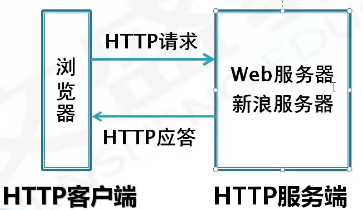
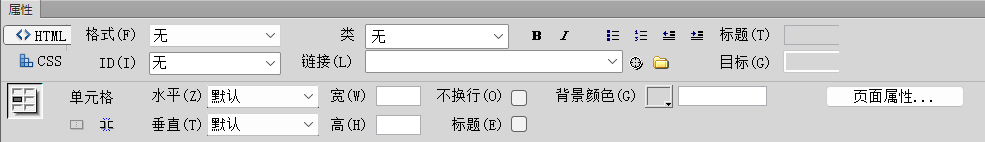

# ****第一章网页制作基础知识****

## 网络基础知识

1. Internet

   - **Internet**由不同地区、规模大小不一的网络互相连接而成是一个全球性的计算机互联网络，一般翻译为**因特网**或**国际互联网**（网络集合）
   - **作用**：可以在国际范围进行**信息传递、资源共享**。
   - 常用的服务有
     - **WWW服务：最广泛的服务**
     - **电子邮件（E-mail)**
     - **网上交际**
     - **电子商务**
     - **文件传输**
     - **远程登录Telnet**
     - **网络新闻Usenet**

2. WWW简介

   - **WWW**是**World Wide Web**的缩写，环球信息网，中文名字常译作**万维网**
   - WWW是一个由许多**互相链接**的**超文本文档(网页)**组成的**系统**，通过互联网**Internet**访问
   - WWW是**单向连接**而不是双向连接

3. 浏览器

   - **浏览器作为Web客户端**通过URL向**Web服务器**发送所有请求，**Web服务器**根据收到的请求向客户端**回送应答**信息。
   - 浏览器(Browser)是对网页浏览器的简称，是**Web客户端**，它是一个应用程序，用于与**Web服务器**建立连接，并与之进行通信。
   - 网页浏览器主要是通过**HTTP(Hypertext Transfer Protoco），超文本传输协议)**与**Web服务器**进行交互并获取网页。
   - 常见的网页浏览器
     - 微软的Internet Explorer（IE)/Edge
     - Mozilla的Firefox
     - Apple的Safari
     - Opera
     - Google Chrome
     - 360安全浏览器
     - 搜狗高速浏览器

4. 服务器

   - **Web服务器**又称WWW服务器、网站服务器或站点服务器。Web服务器就是一个**软件系统**，它通过网络**接收HTTP请求**，然后**提供HTTP响应**给请求者(浏览器)。
   - **发布**就是将本地网站的内容通过**FTP协议(文件传输协议)**传输到连接Internet的**Web服务器**上。**网站通常位于Web服务器上。**
   - **服务器与客户端可以是同一个计算机也可以不是同一个**

5. IP地址

   - 每台**主机**都**必须**有一个**唯一**的**网络地址**，即IP(Internet Protocol)地址，即TCP/IP协议表示的地址，并遵循相同的协议
   - **IP地址**是**层次地址**，由**网络地址**和**主机地址**组成
   - 主机间访问就是通过**IP地址**实现的，IP地址**长度为32位**，**分为4段**，由**十进制数字**组成，每段都在**0-255**之间，段与段之间用**句点** . 分隔（**点分十进制**）

6. 域名

   - IP地址（主机在网络中的位置)不便于人们记忆，不能显示地址组织的名称和性质 设计了**域名**
   - **通过DNS(Domain Name System域名系统)将域名和IP地址相互映射**
   - **一个域名对应一个IP地址，多个域名可同时被解析到一个IP地址**
   - 域名(Domain Name)是由一串用点分隔的名字组成的Internet.上某一台主机或一组**主机的名称**。
   - 域名采用**分层结构**，每个域名是由几个**域**组成的，域与域之间用.分开，**最末域**称为**顶级域**，其他的域称为**子域**
   - 顶级域分为两类
     - 国家顶级域名：**中国cn**,美国us,日本jp
     - 国际顶级域名：**.com**表示工商企业，**.net**表示网络提供商，**.org**表示非营利组织。**.firm**公司企业，.store销售公司或企业，.web突出，www活动的单位，.arts突出文化艺术活动的单位， .rec突出消遣娱乐活动的单位，.info提供信息服多的单位 ，.nom个人
   - 中国的二级域名分为类别域名和行政区域名
     - .ac科研机构 .com工业、商业、金融等公司，**.edu教育机构**，.**gov**政府部门，.**mil**军事部门，.net从事Internet相关的机构或公司，.org非盈利的组织或团体，.info提供信息服务的企业， .top顶级、标杆组织机构或个人
   - DNS规定
     - 域名中的每个域都由英文字母、数字、连接符(-)组成
     - 每个域不超过63个字符（最好小于12个字符)
     - 完整域名**不超过255个字符**
     - 域名**不区分大小写**
     - 级别越低的域名写在最左边,级别越高的域名写在最右边

7. HTTP协议

   - **HTTP**(**Hypertext Transfer Protocol**)**超文本传输协议**是Internet遵循一个重要的协议 ，HTTP是用于传输Web页的客户端/服务器协议。
   - 详细规定了**浏览器**和**网站服务器**之间互相通信的**规则**。
   - **默认使用80端口**。

8. URL

   - URL(**Uniform Resource Locator**)**统一资源定位符**，用于标识WWW上的某种资源，简称**网址**。用于完整地描述Internet上网页和其他资源的**地址**的一种标识方法

   - 每个网页都具有一个唯一的名称标识，即URL

   - **URL由四部分组成：协议类型，主机名，端口号和路径**

   - 协议类型

     - **file**：本地计算机上的文件，格式为file://

     - **http**：通过HTTP访问资源，用于传送网页，格式为http://www.sina.com.cn

     - **ftp**：通过FTP访问资源，用于传送文件，格式为ftp://192.168.1.20

     - **https**：通过安全的HTTPS访问资源，格式为https://

     - **mailto**：资源为电子邮件地址，通过SMTP访问，格式为mailto:

       **SMTP(Simple Mail Transfer Protocol)电子邮件传输协议**

     - gopher：通过Gopher协议访问资源，格式为gopher://
     
   - **主机名**：上例中的www.sina.com.cn部分，新浪网站的主机名，**可以是域名，也可以是IP地址。**

   - **端口号**：**HTTP 80，HTTPS 443，FTP 21**，URL组成中，**只有端口号可以省略**，注意：**默认**的端口号时，**可以省略**的。**端口号修改**，**不能省略**。http:81

   - **所要访问的文件路径**：指明要访问资源的具体位置。在主机名与文件路径之间，一般用 / 符号隔开。

   - 

9. FTP协议

   - **FTP(File Transfer Protocol,文件传输协议)**(**默认端口号21**)是TCP/IP协议组中的协议之一。
   - **FTP协议包括两个组成部分**
     - **FTP服务器**：用于存储文件
     - **FTP客户端**：用户可以使用FTP客户端通过FTP协议访问位于FTP服务器上的资源。
     - **CuteFTP软件**，**LeapFTP软件**实现网站的发布，**DW网站的发布**

10. TCP/IP协议

    - **TCP/IP(Transmission Control Protocol /Internet Protocol)**的简写，中文译名为**传输控制协议**/**因特网互联协议**或**网际协议**
    - TCP/IP**是Internet最基本的协议，是Internet基础。**

11. W3C

    - **W3C**(**world Wide Web Consortium**),**万维网联盟**是Web技术领域非常具有权威性和影响力的国际中立性**技术标准机构**。
    - W3C非常重要的工作就是**发展Web规范，制定Web标准**。

## 网页

1. 网页
   - **网页（web page）存储在Web服务器上**，**其内容是由HTML**(Hyper Text Markup  Language,**超文本标记语言**)**语言编写而成的**。
   - 构成网页的基本元素
     - 文本
     - 图形
     - 图像：常用的格式bmp,tif,gif,jpeg,psd,png等
     - 音频：常用的格式midi,wav,mp3,afi等
     - 视频：常用的格式avi,mpeg,wmv,rm,asf,flv等
     - 动画：常用flash动画，.swf
   - **文字与图片是构成网页的两个最基本元素。**
2. 网页分类
   - 根据采用的技术，大致可以分为**静态网页**和**动态网页**两种
     - 静态网页：**浏览器端与服务器端不发生交互操作。.htm和.html为扩展名的文件**
     - 动态网页：**动指的是交互性  信息存储在服务器端的数据库**
     - 动态网页开发技术
       - ASP技术，网页文件后缀.asp
       - ASP.Net技术，网页文件后缀.aspx
       - JSP技术，网页文件后缀.jsp
       - PHP技术，网页文件后缀.php
   - 根据网页在网站中所处位置，网页可分为**主页/首页**和**内页**两种；
3. 网页制作的核心技术
   - 网页制作的核心技术 HTML网页结构+CSS+JavaScript(JS)
   - CSS**(Cascading Style Sheets)层叠样式表**,是一种用来表现HTML文件样式的标记语言，不仅可以静态地修饰网页还可以配合各种脚本语言动态地对网页各元素进行格式化。
   - **JavaScript是Web页面中的一种脚本编程语言**，也是一种通用的、跨平台的、基于对象和事件驱动并具有安全性的脚本语言。
   - 脚本编程语言：VBScript和JavaScript,**JavaScript是最常用的。**

## 网站

1. **网站**（**Website**）是一组相关**网页**和**有关文件**的集合，以一定的方式相链接，成为一个整体。
2. **网页是网站的基本组成要素**。
3. 打开一个网站时看到的第一个页面就是**主页**，主页也是网站的**首页**，与主页相链接的其他各个页面称之为**内页**。
4. 一个网站通常只有一个首页文件。
5. **主页文件的名称index或者default;**
7. **主页/首页**是一个网站的主索引页，是网站的重中之重，是网站的灵魂。

## 网页设计与制作

1. 网页制作工具按照其工作方式，一般可以划分为两类，**一类是直接编写HTML源代码的软件**，例如EditPlus、微软的记事本HBuilder、Vebstorm等
2. **另外一类就是所谓的所见即所得的网页编辑工具**，这类软件一般提供了可视化的界面，使用者不需要手工编写HTML等代码。例如**Dreamweaver**软件。

# 第二章网页制作软件CS6

## Dreamweaver CS6

1. 菜单栏
   
   - Dreamweaver CS6有**10个主菜单**(**所有功能**)
   - 另外，也可以通过键盘打开菜单：**按下Alt键**，然后单击菜单名称后面括号内的大写字母。
     - **文件菜单**：**管理文件**。如新建、打开、保存、关闭、退出、导入、预览等。**文件 AIt+F** 
     - **编辑菜单**：编辑文本。如选择、复制、粘贴、查找、替换、**首选参数设置**等。**编辑 AIt+E**
     - **查看菜单**：**显示代码或设计视图、切换视图模式**以及**标尺、网格设置等**。**查看Alt+V**
     - **插入菜单**：**插入各种页面元素**。**插入 AIt +i**
     - **修改菜单**：**修改**插入到网页中的对象的一些基本属性。 **修改Alt+M**
     - **格式菜单**：用于设置文本的格式。**格式Alt+O**
     - **命令菜单**：提供了对各种命令的访问。**命令AIt+C** 
     - **站点菜单**：用于**创建**和**管理站点**。**站点Alt+S**
     - **窗口菜单**：用于访问DW的**所有面板**、检查其和窗口。**窗口AIt+W** 
     - **帮助菜单**：提供对DW帮助文件的在线学习。**帮助Alt+H**
   
2. 插入工具栏（**Ctrl+F2**）（**9个选项卡**）
   - 包含常用、布局、表单、数据、Spry、jQuery Mobile、IN Context、Editing、文本、收藏夹**9种类型按钮**
   - 
   
3. 文档工具栏
   - 文档工具栏包含：代码/拆分/设计/实时视图、设置网页标题和在浏览器中预览等
   
   - **设计视图**：是一个**可视化页面布局**、可视化编辑和快速应用程序开发的设计环境。在该视图中，CS6显示HTML文档完全编辑后的可视化表现形式，类似于在浏览查看时的内容。
   
   - **代码视图**：是一个用于**编写和编辑HTML代码、JavaScript代码**等的环境。
   
   - **拆分视图**：可以同时看到文档的**设计视图**和**代码视图**
   
   - **实时视图**：更为逼真地**呈现页面在浏览器中的外观，同时也可编辑**，在不必离开Dreamweaver.工作区的情况下提供另一种实时查看页面外观的方式。
   
     注：**设计视图冻结；代码视图可编辑；更改代码后刷新实时视图生效。**
   
   - **多屏幕**：设计者**可选择**网页**显示的屏幕分辨率**。
   
   - **文件管理：**可以快速执行获取、取出、上传、回放等文件管理命令
   
   - **检查浏览器兼容性**：检查所设计的页面对不同类型浏览器的兼容性。
   
   - **标题**：显示在浏览器的标题栏中(title)。
   
4. 编码工具栏
   
   - 默认**显示在文档窗口左侧(不能更改移动)**。
   - 包含用于执行多种标准编码操作的按钮。
   - **代码视图，拆分视图时显示。**
   - 隐藏方式：**查看→工具栏→编码。**
   
4. 标准工具栏
   
   - 默认不显示
   - **查看→工具栏→标准。**
   - 包含文件菜单和编辑菜单中的常见按钮：新建、打开、保存、全部保存、打印代码、剪切、复制、粘贴、撤销和重做。
   
4. 文档编辑窗口
   
   - 文档编辑窗口显示**当前正在编辑的文档内容**
   - 代码视图和设计视图都可以编辑文档
   - 在Dreamweaver CS6中**可以同时打开多个文档**，通过单击文档工具栏上方的标签在不同的文档中进行切换，如图
   - 文件名带*，表示文件修改未保存。保存后 * 消失。
   - **标尺和网格单位：像素、英寸、厘米。** **只在设计视图显示**
     - **标尺**：显示标尺：**查看→标尺→显示  (Ctrl+Alt+R)。**
   - 网格：**查看菜单 -> 网格设置 -> 显示网格 Ctrl+AIt+G** 
   - **查看菜单 -> 网格设置 -> 网格设置 -**> **间隔50px**
   
5. 状态栏
   - 
   - (1)标签选择器
     - 显示**环绕当前选定内容的标签**的**层次结构**。**单击该层次结构中的任何标签可以选择该标签及其全部内容**。 
     - **单击body**可以选择文档的**整个正文**。另外，**右键单击**，可以**弹出快捷菜单**，通过该菜单可以对标签进行处理。
   - (2)选取工具
     - 可以选择页面中的对象
   - (3)手形工具
     - 可以将网页在文档窗口中整体拖动。**单击选择工具可禁用手形工具**。
   - (4)缩放工具
     - 可以对页面的**设计视图进行放大或缩小**，**按住Alt键**可以进行放大/缩小功能的**切换**。
   - (5)设置缩放处比率
     - 在该项的**下拉列表中可以为文档设置缩放比率**。
   - (6)手机大小
     - 默认情况下，按手机大小480X800显示文档的预览
   - (7)平板电脑大小
     - 默认情况下，按平板电脑大小768X1024显示文档的预览。
   - (8)桌面电脑大小
     - 默认情况下，在宽度大小为1000像素的桌面中显示文档预览。
   - (9)窗口大小
     - **可以将文档窗口的大小调整到预定义或自定义的尺寸**。**更改设计视图或实时视图中页面的视图大小**时，**仅更改视图大小的尺寸**
   - (10)文档大小和估计下截时间
     - **显示**当前文**档的大小**及**下载**该文档的**时间**
   - (11)页面编码
     - **显示当前页面的编码格式**。
   
6. 属性检查器（Ctrl+F3）（属性面板）
   - **属性检查器（属性面板)**主要用于**检查和编辑当前选定页面元素（如文本和插入的对象)的最常用属性**(**不是所有属性**)。
   - **对象不同属性不同**
   - 默认位于文档**工作区底部**
   - **可变为工作区中的浮动面板**
   - 
   - 
   - 依次为项目列表、编号列表、删除内缩区块、内缩区块<**blockquote**>
   - 
   - 依次为编辑、编辑图像设置（优化)、剪裁、重新取样、亮度和对比度、锐化
   - 依次为矩形热点工具、圆形热点工具、多边形热点工具
   - 
   - 清除列宽，清除行高，将表格宽度转换成像素，将表格宽度转换成百分比
   - 
   - 合并单元格，拆分单元格
   - 
   - 
   - 
   - 
   
7. 面板组（**都在窗口菜单**）
   - 包含插入面板、CSS样式面板和文件面板等
     - 面板右上角折叠为图标或展开面板按钮
     - **双击**面板名称
   - **按F4键**可**暂时隐藏整个面板组**，再按下**F4键**即可**恢复**整个面板组的显示。
   - 面板组中的各个组合面板都可以通过**窗口菜单Alt+W**进行选择，以确定是否显示该面板。
   
8. 文件面板 (F8)
   - 用于管理文件，可以**查看文件或文件夹**。文件可以是**本地站点**的文件，也可以是**远程服务器**上的文件

## Dreamweaver CS6参数设置

1. 通过设置**首选参数**对话框中的属性可以**改变**Dreamweaver CS6**操作环境**、**界面的整体外观**。
   - 可以通过设置常规参数来控制是否显示欢迎屏幕；
   - 可以通过新建文档参数来设置默认文档类型、默认文档扩展名；
   - 可以通过在浏览器中预览参数来设置主浏览器、次浏览器。
2. 单击**编辑**一**首选参数**菜单命令，打开首选参数对话框,**快捷键Ctrl+U**
3. 要**设置Dreamweaver CS6的外观**，需要在**首选参数**对话框中完成
4. 欢迎页
   - **首选参数**可**设置启动时显示欢迎界面。**
   - 欢迎页打开最近的项目
     - 显示最近**打开过的文档**
     - **单击**快速打开文档
     - 打开选择要编辑的文档
   - 快速创建**文档**或**站点**
4. 新建文档
   - 在默认文档下拉列表框内**可以选择默认的文档类**型；
   - 在默认编码下拉列表框中选择**文档编码类型**等
5. 在浏览器中预览设置
   - 在浏览器栏的显示框内列出了当前可以使用的浏览器。可以**删除/ 增加浏览器**。
   - **设定选择的浏览器**是否为**主浏览器(F12)，次浏览器(Ctrl+F12)**

## 快捷键

1. 菜单栏
   - **文件AIt+F，编辑AIt+E，查看Alt+V，插入AIt+I，修改Alt+M**
   - **格式Alt+O，命令AIt+C，站点Alt+S，窗口AIt+W，帮助Alt+H**
2. 选中要重命名的文件或文件夹，再按**F2**键，进入可编辑状态进行**重命名**
3. **Ctrl+E**打开**插入标签对话框**
4. 按**Enter**键（在设计视图中）相当于插入段落标记<**p**>
5. 按**Shit+Enter**组合键相当于插入换行标记<**br/**>
6. 按**Ctrl+Shit+Space**插入不换行空格，即 **`&nbsp;`**
7. 如果要选择**多个热点**，按住**Shift**键，单击所要选择的所有热点；
8. 如果要选择整个图像上的**所有热点**，按下**Ctrl+A**组合键
9. 面板组
   - **插入工具栏**（插入面板）**Ctrl+F2**（**默认显示**）
   - **属性检查器**（属性面板）**Ctrl+F3**（**默认显示**）
   - **文件面板   F8** F5刷新文件面板（**默认显示**）
   - **CSS样式面板Shift+F11**
   - **行为面板 Shift+F4**
   - **框架面板 Shift+F2**
   - 资源面板
   - AP元素面板
   - **时间轴**面板DWCS6没有 **AIt+F9**
   - **F9** **标签检查器面板**
   - 上述面板可通过**F4**键**整体控制显示或隐藏**。也可通过窗口菜单进行选择。
10. **Ctrl+N**打开**新建文档对话框**，或者**文件→新建**
11. **Ctrl+O**打开**打开文档对话框**，或者**文件→打开**
12. **Ctrl+Z撤销**
13. **Ctrl+Y重做**
14. **Ctrl+J**组合键打开**页面属性对话框**，或者**修改→页面属性**
15. **Ctrl+U**组合键打开**首选参数对话框**，或者**编辑→首选参数**
16. **Ctrl+Alt+T**打开**插入表格**对话框
17. **Ctrl+AIt+G显示网格**
18. **Ctrl+AIt+R显示标尺**
19. **Ctrl+AIt+I插入图片**
20. **Ctrl+AIt+A插入锚点**
22. **Ctrl+Alt+V可编揖区域**

# 第三章创建本地站点

## 站点

1. 站点概述
   - **站点可以简单地理解为存放网页及各种素材的文件夹**。
   - Dreamweaver站点（即Web站点）是**一组**具有相关主题、类似设计的**链接文档和资源**。
   - Dreamweaver是一个站点创建和管理工具，因此使用它不仅**可以创建单独的文档**，还可以**创建完整的Web站点**。
   - **Dreamweaver站点**指属于某个Web站点的文档的**本地或远程存储的位置**
   - **Web站点**指运行系统的**Web服务器上的站点。**
   - **网站的发布过程就是DW站点变成Web站点的过程**
2. 站点规划
   - 网站目录**建立的原则**是以最少的层次提供最清晰、简便的访问结构（**分门别类的放文件**）
   - 规划站点结构是指利用**不同的文件夹**将**不同的网页内容分门别类地保存**，**合理地组织站点结构可提高工作效率**，**加快对站点的设计**。便于后续站点管理和维护
   - **根目录**一般只存放**index.htm/index.html**(网站的首页)以及其他必须的系统文件，**每个主要栏目开设一个相应的独立目录**（建立文件夹）。
   - **同类型的文件，最好放在一个文件夹中**。例如：将图片文件都放在image文件夹中；
3. Dreamweaver站点由3个文件夹组成，具体取决于开发环境和所开发的Web站点类型。
   - **本地根文件夹**即工作目录，是存放正在处理的web的文件夹index.html
     Dreamweaver CS6将该文件夹作为Web站点的**本地站点**，一般在制作静态网页时只创建本地站点。
   - **远程文件夹**，存储用于测试、生产、协作等文件，Dreamweaver.在文件面板中将此文件夹称为**远程站点**。一般位于网络上运行的**Web服务器**的计算机上。
   - **测试服务器文件夹**是Dreamweaver CS6处理动态网页的文件夹，也称**测试站点**，一般位于网络上运行的**Web服务器**的计算机上
3. 本地站点
   1. 创建站点
      - **站点菜单→新建站点**命令，打开站点设置对象对话框，在站点选项卡，站点名称项输入站点名称，点击保存按钮
      - 在**文件面板中可见新建的站点**。
      - 在设置远程文件夹时，必须为Dreamweaver选择连接方法，以将文件上传和下载到Web服务器。**最典型的连接方法是FTP**,但Dreamweaver还支持本地/网络、FTPS、SFTP、Nadav和RDS连接方法。
      - 只需要知道如果**添加服务器需要设置服务器地址、用户名、密码等信息**
   2. 管理站点
      - 选择[**站点]->[管理站点**]菜单命令，打开管理站点对话框或者在文件面板中，选择管理站点子项
      - 管理站点对话框可以完成站点的**创建、编辑、复制、删除、导入和导出**等功能
      - **编辑**某个站点，只需在站点管理对话框中**选择这个站点的名称**，点击**编辑**，可以**修改其站点设置**，可以**点击（多选），双击（编辑）**，**无右击和F2操作**。
      - **站点复制操作将建立本站点的副本（复制的站点和原站点指向同一个文件夹）**
      - **站点删除操作**：**此操作无法撤销**，将删除所选站点，**不会删除磁盘上的文件夹以及相关文件**。
      - **导入/导出站点**：会在指定位置**将每个站点保存为后缀为==.ste==扩展名的XML文件**
   3. 使用站点：**通过文件面板**(**F8**)可以直接对站点中的文件或者文件夹进行操作
      1. 查看站点中的文件（窗口->文件 ， F8）
         - 在**站点下拉列表框中**选择要查看的站点
         - 在**视图下拉列表框**中选择要查看的视图，选择本地站点还是远程站点
         - 在显示框中选中相应的文件，**双击文件图标打开文件**（或**右击文件图标选择打开命令**)，**文件在文档窗口中打开**。
      2. 在站点中新建文件夹和文件(**鼠标右键** 新建文件/文件夹) 
         - 在目录图标上右击，**在弹出的快捷菜单中选择新建文件或新建文件夹命令**
         - 自动创建名为**untitled.html**的文件，或名为**untitled**的文件夹。且名称为可**改写状态**。**输入新名称**。
         - **Ctrl+Shift+N**：**确定文件类型.html和路径**（**新建空白网页**）
         - **Ctrl+N**：**弹出对话框选择创建类型**，**不指定位置，保存弹出对话框Untitled.html区别首字母大写**
      3. 重命名文件或文件夹(**选中右击/鼠标右键/编辑，重命名/F2**)
         - **两次单击**要重命名的文件或文件夹，**名称变为改写状态**，**输入新名称**
         - 右击要重命名的文件或文件夹，编辑>重命名命令，名称变为改写状态，输入新名称。
         - 选中要重命名的文件或文件夹，**按F2键**，名称变为改写状态，输入新名称
      4. 删除文件或文件夹(**Del，选择右键/编辑/删除**)(**==同时删除硬盘上的文件==**)
         - 右击要删除的文件夹或文件，在弹出的快捷菜单中选择**编辑→删除命令**，在弹出的确认对话框单击确定按钮。
         - 选中要删除的文件或文件夹，**按Delete键**，在弹出的确认对话框单击确定按钮。
      5. 移动文件或文件夹(**拖拽**)
         - 右击要移动的文件夹或文件，在弹出的快捷菜单中选择**编辑→复制**命令，选中目标文件夹，右键在弹出的快捷菜单中选择**编辑→  粘贴** 命令，删除原来位置中被复制的文件或文件夹。
         - **拖拽**要移动的文件夹或文件，到目标位置松开，在弹出的**更新文件对话框**中点击**更新**按钮。
      6. 刷新文件面板(**文件面板上的刷新按钮，F5**)
         - **右击**选择**刷新本地文件**
         - 点击**文件面板工具栏刷新按钮**。
         - 按**F5键**。
      7. 在站点中查**找最近修改**的文件（**单击文件面板右上角的选项菜单**，选择**编辑→选择最近修改日期**命令，打开选择最近修改日期对话框，完成设置，单击确定按钮。文件面板中会高亮显示指定时间段内修改的文件）
      8. 与远程服务端上的文件进行**同步、获取、上传**
4. Dreamweaver中的命名原则
   - **唯一性**
   - **小写**
   - **由数字、字母、下划线组成，不以数字开头。**
   - **避免使用系统关键字、汉字。**
   - 命名基本原则：使用独一无二的、不带空格的小写名称，名称应由字母和数字组成，并以字母开始，名称中可以包含_符号
5. 命名规范
   1. 文件/目录的命名规范
      - 网站中文件/目录的名称**最好不要用中文**，而要用**英文缩写也可或汉语拼音**。
      - 目录（文件夹）命名**一般长度一般不超过20个字符**，**命名采用小写字母。**
      - 文件名**称统一用小写的英文字母、数字和下画线的组合**。
   2. 图片的命名规范
      - 网页中使用的图片文件，**命名是一般采用头部+尾部两段**式来命名。
      - 头部：表示此图片的大类性质。例如网页顶部长方形位置处一般是放置广告或者装饰性图案通常取名为banner;
      - 尾部：用来表示图片的具体含义，通常使用英文字母表示。

# 第四章制作简单的网页

## 网页的基本操作

1. 新建网页
   - 在**起始页对话框**中，单击新建的HTML选项。**Untitled-1**
   - **文件菜单→新建**命令，在打开的 **新建文档，对话框中选择，空白页 **选项卡下，**页面类型中的HTML**，选择文档类型下拉列表中的HTML5选项，单击创建按钮**Untitled-1**
   - 在文件面板中右击已创建的站点，在弹出的快捷菜单中选择新建文件命令**untitled.html**
   - 注：**设计视图下是空白，代码视图下是文档基本结构。**
2. 保存网页
   - 方法1：**文件菜单→保存命令。**
   - 方法2：**文件菜单→另存为命令。**
   - 方法3：**文件菜单一保存全部命令**。保存当前**正在编辑的所有文档**。
3. 预览网页
   - 在浏览器中打开网页。
   - 方法1：**单击文档工具栏中**的**在浏览器中预览/调试按钮**→**选择浏览器**。
   - 方法2：**文件菜单→在浏览器中预览→选择浏览器**。
   - 方法3：按**F12键**启动**主**浏览器，按**Ctrl+F12键**启动**次**浏览器。
4. 打开网页
   - 方法1：在起始页对话框中，**单击**在打开最近的项目列表中要打开的文件。
   - 方法2：在起始页对话框中，单击打开最近的项目列表中**打开**命令，在弹出的打开对话框中选择要打开的文件。
   - 方法3：**文件菜单→打开命令**，在弹出的打开对话框中选择要打开的文件，**默认打开html格式文件。**
   - 方法4：**文件菜单→打开最近的文件**→选择菜单中的文件。
5. 关闭网页
   - 方法1：**文件菜单**→**关闭**命令。
   - 方法2：**文件菜单**一**全部关闭**命令。
   - 方法3：**点击文档标签栏中**，文件标签名右侧的**x关闭按钮**。
   - 方法4：**Ctrl+W**。
   - 注：**未保存关闭，弹出提示框询问是否保存。**

## HTML概述

1. **HTML ( Hypertext Markup Language,超文本标记语言 )**是一种用来制作超文本文档的**标记语言**，是Internet中的所有网站共同的语言，网页都是以HTML格式的文件为基础的，再加上其他语言工具(JavaScript、.VBScript等)构成。

2. 标签

   - HTML标签是组成HTML文档的元素，每一个标签都描述了一个功能。
   - HTML标签包括一对尖括号<>。
   - 标签可分为**单标签**和**双标签**两种
     - 双标签
       - 双标签由**始标签**和**尾标签**两部分构成，**必须成对使用**。始标签告诉浏览器从此处开始执行该标签所表示的功能，而尾标签告诉浏览器在这里结束该功能。

       - `语法格式：<标签名称>内容</标签名称>`
     - 单标签
       - `语法格式：<标签名称/>`

3. 标签属性

   - 为了增强标签的功能，单标签和双标签的始标签内会添加一些**属性**；

     ```html
     语法格式：
     <标签名称 属性1="属性值1" 属性2="属性值2"...>内容</标签名称>
     <标签名称 属性1="属性值1" 属性2="属性值2".../>
     ```

   - **属性值**推荐用**双引号 **括起来。
   
   - **多对属性之间用空格分隔，属性之间没有顺序。**

## HTML文档结构

1. HTML文档结构

   ```html
   <!doctype html>  <!--文档声明/类型-->
   <html>			<!--根元素-->
   	<head>		<!--文档头部-->
   		<meta charset="utf-8" /> 	<!--元信息-->
   		<title>文档标题</title>		 <!--文档标题-->
   	</head>
   	<body>					       <!--网页主体内容-->
   		网页内容
   	</body>
   </html>
   ```

2. 概念

   - HTML文件以**纯文**本形式存放，扩展名为**.htm**或**.html**；

   - **<html**>是文档**根标签**，其他所有标签都包含在这对标签中，即<**html**>是文档的开始，<**/html**>是文档的结束；

   - 文件中的标签可以**嵌套、并列**，但**不可以交叉**

   - HTML源文件中的**换行、回车符和空格**在**显示效果中是无效的。**

   - 标签**不区分大小写**，HTML5**建议用小写**格式。

   - HTML文档中，一行可以写多个标签，一个标签也可以分行写不用任何续行符号

   - 例如

     ```html
     <head><title>我爱学习</title></head>正确的格式
     <head><title>我爱学习</head></title>错误的格式
     <head><title>我爱学习</head></title>错误的格式
     ```

3. <**!DOCTYPE html**>文档类型声明语句

   - **DTD**(**文档类型定义**)是一组机器可读的规则，定义HTML特定版本中可以出现哪些标记。

   - HTMLA.01和XHTML1.0规定了**三种DTD(文档类型定义)**：

     - **过渡型(transitional)**
     - **严格型(strict)**
     - **框架型((frameset)**

   - **不是HTLM标签**，是指示Web浏览器关于页面使用哪个HTLM版本进行编写的指令

   - **HTML5不需要对DTD进行引用**，但是需要DOCTYPE来规范浏览器的行为（让浏览器按照他们应该的方式来运行）

     ```html
     <!DOCTYPE html>文档类型声明语句
     ```

   - 该语句表明声明文档类型为HTML5,在HTML5文档中**必不可少**，且**必须放在文档的第一行，不区分大小写**；

4. 块级元素/行级元素

   - 块级元素：自成一行，宽高可变<**li**><**div**>
- 行内元素：不成行，宽高不可变<**a**>
   - 行内块元素：不成行，宽高可变<**img**/>

4. <**head**>头部标签

   - 通常设置页面的基本信息，如页面文档的标题、作者、与其他文档的关系、在Web中的位置等；

   - 绝大多数<**head**>标签包含的数据都不会真正作为内容显示在网页；

     ```html
     <head>标签放在文档的开始处，紧跟在<html>后面。 
     ```
   
5. <**meta**>元信息标签

   - <**meta**>标签用于定义HTML页面的基本信息，例如名称、关键字、作者；

   - <**meta**>是一个**单标签**：非成对出现；

   - `<meta>标签包含在<head>与</head>之间；`

     ```html
     一个HTML头部中可有多个<meta>标签；
     <meta charset="uft-8">
     utf-8是一种变长的编码方式，可以使用1~4个字节表示一个字符，根据不同的符号而变化字节长度
     ```

   - **author**定义**网页的作者** content定义具体作者信息

     ```html
     <meta name="author" content="李四"/>
     ```

   - **description**定义网页的**描述信息（说明）** content定义具体内容

     ```html
     <meta name="description" content="腾讯网(www.QQ,com)是中国浏览量最大的中文门户网站，是腾讯公司推出的集新闻信息、互动社区、娱乐产品和基础服务为一体的大型综合门户网站。"/>
     ```
     
   - **keywords**定义网页的**搜索关键字**  content定义关键字具体内容

     ```html
     <meta name="keyword" scontent="资讯，新闻，财经，房产，视频，NBA,科技，腾讯网，腾讯，QQ,Tencent"/>
     ```
   
   - **其中http-equiv属性的值为refresh(刷新)**content属性的值为数值和url地址，中间用分号，隔开，用于指定在特定的时间后跳转至目标页面，该时间**默认以秒为单位**。

     ```html
     <meta http-equiv="refresh" content="2;url=http://www.baidu.com"/>
     ```
   
6. 标题标签

   - <**title**>标签用于定义HTML页面的**标题**，即给网页取一个名字；

   - 标题信息设置在页面的头部，也就是<**head**>与<**/head**>之间；

   - <**title**>标签是<**head**>**唯一必需**的元素。

     ```html
     语法：<title>网页标题信息</title>
     ```
     
   - 网页标题设置方式，手动<**title**>中，**文档工具栏**，**页面属性**

7. 主体标签

   - 标签<**body**>与<**/body**>为可视化网页内容，是网页的主体信息，包括各种字符 、表格、图像、音频、视频、超链接、样式等；

   - ```html
     语法：<body>网页主体内容</body>
     ```

   - ```html
     <body标签属性=值>标签常用属性：
     ```

     - background 属性设置文档的**背景图像**
     - bgcolor        属性设置文档的**背景颜色**
     - text              属性设置文档中**所有非链接文本**的颜色
     - link              属性设置文档中**未访问链接**的颜色**默认蓝色**,**下划线**,**鼠标小手**
     - alink            属性设置文档中**活动链接**的颜色**默认红色，下划线**
     - vlink            属性设置文档中**已被访问链接**的颜色**默认紫色，下划线**
     - leftmargin   左边距属性设置**页面左侧的留白距离**，像素Px为单位
     - topmargin  上边距属性设置**页面上侧的留白距离**，像素Px为单位

   - **同时设置背景颜色和图像，显示背景图像**

8. 注释标签

   - ```html
     <!-- 在此处写注释 -->
     ```

   - ```css
     /*--css注释--*/
     ```

## 文本类标签

1. 段落标签

   - <**p**>标签用来创建一个**段落**，在始标签<**p**>与尾标签</**p**>之间加入的

   - **特点**：文本在一个段落中会**根据浏览器窗口**的大小**自动换行**；**自动在段落添加一个额外的换行**以及**上下留有空行**，**自成一行，自成一段**。

     ```html
     语法：<p align=对齐方式>文本内容</p>
     ```
   
   - **align属性为可选属性（默认left左对齐，center居中对齐，right右对齐，justify两端对齐)**，**用于指定段落的对齐方式**。

   - </**p**>**尾标签可省略**，但不推荐，选择题会遇到！

   - 在设计视图文档窗口中

     - 按**Enter**键相当于插入<**p**>
     - 按**Shift+Enter**键相当于插入<**br**/>
   
2. 换行标签

   - 在HTML中，一个段落的文字会从左到右依次排列，直到浏览器窗口的右端，然后自动换行。如果希望某段文本**强制换行，但不分段(上下不留有空行)**显示，就需要使用换行标签<**br/**>;  

     ```html
     语法：<br/>
     ```

3. 标题标签

   - HTML提供了6个等级的标题，即<**h1**><**h2**><**h3**><**h4**><**h5**>和<**h6**>,从<**h1**>到<**h6**>**大小递减**；
   - 文字**加粗**一行显，**自成一行，自成一段**
   - align属性为可选属性（默认left左对齐，center居中对齐，right右对齐，justify两端对齐)，**用于指定标题的对齐方式。(同p)**

4. mark标签（**不成行不成段**）

   - 突出显示部分文本（**黄色背景**）；

     ```html
     语法：<mark>需要突出显示的内容</mark>
     ```

5. time标签

   - time标签定义公历的时间（24小时制)或日期。

   - datetime属性规定日期或时间。在该元素的内容中未指定日期或时间时，使用该属性

   - ```html
     <time>时间或日期</time>
     <time datetime=日期>内容</time>
     ```

6. details标签

   - <**details**>标签提供了一个展开/收缩区域，用于描述文档或文档某个部分的细节，
   - <**details**>与<**summary**>配合使用。
     <**summary**>提供标题或图例，标题是可见的。
   - HTML5新标签。

7. pre预格式化标签

   - **pre标签**可以**保留文本中的空格和换行**，**独自成行、独自成段**。

     ```html
     <pre>
     奥里给
     干就完了
     </pre>
     ```

8. blockquote段落缩进标签

   - <**blockquote**>标签能够**向左右缩进5个英文字符**的位置。**独自成行、独自成段**

     ```html
     语法：<blockquote>需要缩进的内容</blockquote>
     ```

9. hr水平线标签

   - 实现在页面上画水平线，用于页面上内容的分隔，表示一个主题结束

     ```html
     语法：<hr align="对齐方式" size="粗细" color="颜色" width="宽度" noshade/>
     ```

   - **align属性**：left左对齐，**默认center居中对齐**，right右对齐，**没有两端对齐**用于指定水平线的对齐方式；

   - **size属性**：粗细/高度/厚度，单位：像素，**默认值2**

   - **color属性**：颜色，**默认灰色**；

   - **width属性**：**宽度**，单位：像素或%，**默认100%**（网页宽度的100%)。

   - **noshade属性**，书写该属性表名**水平线无阴影**，不写则表明有阴影

   - **插入工具栏-常用-水平线** ，**插入菜单-HTML-水平线**

10. font标签（**行元素**）（**不成行不成段**）

    - <**font**>规定文本的字体、字体尺寸、字体颜色。

      ```html
      语法：<font size="字体尺寸" colot="颜色" face="字体">内容</font>
      ```

    - **size**：**字体大小**，**从1到7的数字，浏览器默认值是3**；可以使用用加减（加减的是默认值3）比如 `size="+3"` 是6号字

    - **color**：颜色，`color=#XXXXXX`或英文表示的颜色，其中x是一个十六进制数；

    - **face**：字体类型，操作系统安装的字体决定。如：宋体、楷体GB2312

11. address标签

    - <**address**>标签定义文档的联系信息。

    - **斜体效果，成行不成段**

      ```html
      语法：<address>.</address>
      ```

12. small标签

    - <**small**>标签**小一号字体效果**。每个<**small**>标签都**把文本的字体变小一号 ，直到达到下限1号字**。

    - **最小字号即1号字**，<**small**>标签**将不起任何作用**。

    - <**small**>标签可以嵌套，从而连续地把文字缩小。

      ```html
      语法：<small>...</small>
      ```

13. big标签

    - <**big**>标签呈现大一号字体效果。每一个<**big**>标签都**可以使字体大一号，直到上限7号字。**

    - 如果被包围的字体**已经是最大号字体即7号字**，该<**big**>标签**将不起任何作用**

    - 可以嵌套<**big**>标签来放大文本。

      ```html
      语法：<big>...</big>
      ```

14. center标签（成行不成段）

    - <**center**>对其所包括的文本进行水平居中。

      ```html
      语法：<center>.</center>
      ```

15. <**marquee**>标签

    - <**marquee**>用来插入一段**滚动**的**文字**或**图像**。使用其属性可以控制当文本到达容器边缘发生的动作。

    - 语法

      ```html
      <marquee 属性1="属性值1" 属性2="属性值2">...</marquee>
      ```
    
    - behavior属性：设置文本在marquee元素内如何滚动。可选值有scroll滑动，slide滑动和alternate.来回卷动，默认值为scroll.
      
    - direction属性：设置marquee内文本滚动的方向。可选值有left,right,up and down,默认值为left。
    
    - height,属性：以像素或百分比值设置高度。
    
    - width属性：以像素或百分比值设置宽度。
    
    - loop属性：设置marquee滚动的次数，如果未指定值，默认值为-1，表示marquee将连续滚动。
    
    - bgcolorz属性：通过颜色名称或十六进制值设置背景颜色。
    
    - scrollamount属性：设置每次滚动速度（以像素为单位)。默认值为6
    
    - scrolldelay属性：设置每次滚动时的时间（以毫秒为单位)。默认值为85。注意，除非指定truespeed值，否则将忽略任何小于60的值，并改为使用60。
    
    - onMouseOver事件：鼠标悬停于触发。
    
    - onMouseOut事件：鼠标离开时触发。
    
    - start()方法：开始滚动marquee。
    
    - stop()方法：停止滚动marquee

## 列表标签

1. HTML支持**无序列表、有序列表和定义列表**

2. 无序列表（**项目列表**）-**块级元素**

   - 无序列表是一个**没有特定顺序**的列表项的集合，各个列表项之间属于**并列关系**，没有先后顺序之分；

   - 列表项默认使用粗体圆，点（典型的小黑圆圈)进行标记；

   - ```html
     <!--格式-->
     <ul type="编号类型">
     	<li>列表项1</1i>
     	<li type="编号类型">列表项2</i>
     	...
     </ul>
     ```

   - **ul的type属性**决定列表的**图标类型**

     - **disc：实心圆（默认）**
     - **circle：表示空心圆**
     - **square：表示小方块**

   - li里面的type

   - 若在<**li**>中指定**type属性值**，可规定列表中的**列表项目**的项目符号的**类型**

   - <**li**>**可以省略结束标记，不推荐**

   - **仅仅改变该**<**li**>的符号类型，对于有序编号类型(type=1/a/A/i)，项目符号的**具体值**取决于当前<**li**>是列表中的**第几个**<**li**>。

3. 有序列表（编号列表）-块级元素

   - 有序列表是一个有**特定顺序的列表项的集合**；

   - 各个列表项有**先后顺序**之分，列表项间以编号来标记；

   - ```html
     格式：
     <ol type="编号类型" start="数字" reversed >
     	<li>列表项1</li>
     	<li type="编号类型"value="数字">列表项2</li>
     </ol>
     ```

   - **start描述编号的起始值，值只能是数字，默认1**

   - **reversed 逆序**

     - **有start属性，从start值开始逆序**
     - **没有start属性**，计算<**li**>个数，**从该个数值开始逆序**

   - **ol 里面的type**

     - **type=1默认值**
     - type=A
     - type=a
     - type=I
     - type=i

   - li里面的type

   - 例子

   - 若在<**li**>中指定**value属性值**，则可**改变当前及其后列表项的编号数值**不改变类型

   - value属性规定列表项目的**编号数值（整数数字)**，接下来的列表项目会从该数字开始进行**升序排列**；

4. 定义列表-块级元素

   - 自定义列表的每一项前既没有项目符号，又没有编号，它**通过缩进的形式使内容层次清晰**；

   - <**dt**>只能在<**dl**></**dl**>中使用；<**dd**>列表项解析的内容可以是文字、段落、图片

   - ```html
     语法：
     <dl>
     	<dt>列表项1</dt>
         	<dd>列表项解析</dd>
     	<dt>列表项2</dt>
     		<dd>列表项解析</dd>
     </dl>
     ```

   - 例子

5. 列表嵌套

   - 嵌套列表可以是**无序列表的嵌套**，也可以是**有序列表的嵌套**，还可以是**有序与无序列表的混合嵌套。**
   - 例子

## 文本格式化标签

- 

## 特殊字符标签

- 
- 在HTML文件中，添加空格的方式与其他文档添加空格的方式不同，网页中通过**代码**来添加空格，而在其他编辑器中通过**键盘空格键来输入空格**。
- 在<**body**>内无论**通过键盘**输入多少空格,页面在显示时都会**保留1个空格**,其他的忽略
- 默认情况下，DW中只能输入一个空格，不能连续输入多个。输入多个空格方法如下
  - 方法1：中文全角输入法
  - 方法2：**插入菜单**→**HTML→特殊字符**→**不换行空格**菜单命令可插入一个空格，反复操作插入多个空格
  - 方法3：代码视图中，输入字符实体 `&nbsp;`
  - 方法4：编辑菜单→**首选参数**菜单命令→**常规**分类→**编辑选项**中勾选**允许多个连续的空格**

## 在网页中使用颜色

1. **颜色名**称：是用**颜色名称**表示，比如red表示红色。
2. **十六进制**：**格式规定#RRGGBB**,其中**RR红色**、**GG绿色和BB蓝色**，是介于**00和FF之间的十六进制整数**，表示色彩强度，例如#FF0000红色、#00FF00绿色、#0000FF蓝色 #FFFFFF白色、#000000黑色。
3. **RGB**值：**格式规定RGB(R,G,B)**。**R为红色，G为绿色，B为蓝色**。取值范围是**0到255之间的整数**，**或0%到100%间的整数**。例如RGB(255,0,0)红色、RGB(0,255,0)绿色、RGB(0,0,255)蓝色、RGB(0,0,0)黑色、RGB(255,255,255)白色。
4. **RGBA**(R,G,B,A) **A[0.0 - 1.0]取值是小数**，**0.0(完全透明)**和**1.0(完全不透明)**（透明度）
5. 传统经验是，**有216中常见颜色**，而且任何结合了00、33、66、99、CC或FF数对(RGB值分别是0、51、102、153、204、255)的十六进制值都代表了网页安全色。
6. 但测试显示**网页安全色仅有212种**。

## 单位

- 

## DW操作

1. 页面属性对话框
   - 方法1：**属性面板**，点击**页面属性**按钮
   - 方法2：**修改**菜单中，选择**页面属性**命令
   - 方法3：Ctrl+J
   - 方法4：**设计视图**文档窗口**空白处鼠标右键**在快捷菜单中选择**页面属性**
2. 插入文本
   - 方法1：键盘输入
   - 方法2：复制粘贴
   - 方法3：插入**工具栏**，**文本标签页**
   - 方法4：**插入菜单**→**HTML**→**文本**对象→选择要插入的文本类型菜单命令
3. 插入特殊字符
   - 方法1：**插入菜单**→**HTML**→"**特殊字符**菜单命令
   - 方法2：**插入工具栏**，**文本**标签页**字符**按钮
4. 插入文件头
   - 方法1：**插入菜单**→**HTML**→**文件头标签菜单命**令
   - 方法2：**插入工具栏**，**常用**标签页**文件头**按钮
5. 文本的查找与替换
   - 编辑莱单→查找和替换菜单命令一打开查找和替换对话框
6. 文本属性检查器
   - 方法1：格式菜单
   - 方法2：属性检查器
     - 属性检查器分为**HTML(默认)和CSS两个选项**
     - HTML属性面板：**在代码视图中**，在<**body**>内显示更改的**HTML标签和属性**
     - CSS属性面板：在代码视图中，在文档头部以内部样式表形式嵌入，显示CSS样式

# 第五章超链接

1. 超文本链接(Hyper Text Link)通常简称为超链接(Hyper Link),或者简称为链接(Link):指从一个网页的信息节点指向一个目标的链接关系。
2. 超链接中由于**单击而引**起跳转的对象称为超链接的**载体**；
3. 超链接跳转到的**对象**称为链接**目标**；
4. 按**超链接载体**的载体分为
   - **文本链接**：用文本作为链接载体
   - **图像链接**：用图像作为链接载体
5. 按超**链接目标**分类，将链接分为：
   - **内部链接**：链接目标是本站点的其他文件，用以实现本站点内跳转：
   - **外部链接**：链接目标是本站点之外的其他站点或文件，可以跳转到其他站点
   - **锚点链接**：链接到同一网页或不同网页中指定位置的链接
   - **E-mail链接**：目标是一个电子邮件地址；
   - **执行文件链接**：链接网站中可执行的程序，常用于下载在线执行。
6. 超链接的源头图像可以是**起始对象**也可与做**目标对象**

## 超链接标签

1. 超级链接主要通过<**a**><**/a**>标签环绕链接对象创建：

   ```html
   语法格式：<a href="属性值" target="属性值" >链接对象</a>
   ```

2. 标签<**a**> 表示超链接的开始， <**/a**>表示超链接的结束，**行元素**

3. 链接对象可以是文本或图像等，被作为超链接来显示

4. **href**：**链接目标的URL**(网址)，<**a**>标签最重要的属性

5. **target**

   - **_self**：目标文档载入并显示在**相同的框架**或者**窗口**中作为源文档（**默认**）(**当前窗口**)
   - **_blank**：浏览器**总在一个新打开、未命名的窗口中载入目标文档**(**不同的新窗口**)
   - **_parent**：在**父框架**窗口中打开目标文档：**上一级**
   - **_top**：将会清除所有被包含的框架并将文档载入**整个浏览器窗口**
   - **_new**：浏览器总 是打开**同一个新窗口**载入目标文档。
   - **target=某个框架的名称**，**意味着目标对象在该框架中打开**。

6. **title**：**鼠标悬停在超链接上方**，会在超链接的**附近显示title**属性设置的**提示信息**

## 绝对路径

1. 链接是否正确与href属性值有关，href属性定义了链接目标的文档路径，包括：
   - 绝对路径：**完整路径**
   - 相对路径：**相对于当前文档**
   - 根路径：**相对于根目录（打开目录文件夹的第一层就是根目录)** **/a.html 表示根路径**
2. 绝对路径是**包括通信协议名、服务器名、路径及文件名的完整路径** 
   - 例如：https://www.synu.edu.cn/786/list.html
3. 如果站点之外的文档在本地计算机上，例如F盘book_store目录下default.html文件
   - 例如：file:///F:/book_store/default.html 或者 F:\book_store\default.html
   - **网页中使用 " / " 操作系统中使用  " \ "**

## 相对路径

1. 文档相对路径是指相对于**当前文件**（即当前写<**a**>的这个文件)**的路径**，以**当前文件为起点**进行**目标文件查找的路径**。

2. 文档相对路径一般用于网站**内部链接**。

   - 如果链接到**同一目录**下，则只需直接输入**目标文件的名称。**

     **直接看见直接写，写目标文件的名称**

   - 要链接到**下级目录中**的文件。只需**先输入目标文件所在的目录名**，然后**加"/"**，再**输入目标文件名**，**即目标文件所在目录名/目标文件名**

     **不能直接看见时，看见什么写什么**

   - 要链接到**上一级目录**中文件，则先输入"../"，再输入目标文件名。即**../目标文件名** 

   - **如果是上一级目录，写 ../ 目标文件的名字，上两级 ../ ../**

## 锚点链接

1. 锚点可以理解为标记，**点击锚点链接跳转到相应锚点所在的位置**

2. 锚点是可以与链接的文字在同一个页面，也可以在不同的页面的超链接

3. 创建**锚点链接**（**书签连接**）(**Ctrl+Alt+A**)分为两步

   - 先定义锚点

     ```html
     <!--锚点的定义语法-->
     <a name="锚点名称">文字</a>
     <!--或者-->
     <a id="锚点名称">文字</a>
     <!--在该语法中，锚点名称就是对后面跳转所创建的锚点，文字则是设置链接后跳转的位置。-->
     ```

   - 锚点链接跳转到**同一个网页内**点锚点所标记的位置

     ```html
     <!--同一个页面锚点链接的语法-->
     <a href="#锚点的名称">链接的文字</a>
     <!--在该语法中，锚点的名称就是name/id的赋值。而#则代表这个锚点的链接地址-->
     ```

   - **不同页面**锚点链接的语法

     ```html
     <a href="目标网页URL#锚点的名称">链接的文字</a>
     <!--在该语法中，锚点的名称就是name/id的赋值。而#则代表这个锚点的链接地址-->
     <!--目标网址就是锚点链接所在的位置-->
     ```

## 文件下载超链接

1. 网站经常提供软件、文件等资料下载，下载文件的链接指向文件所在的相对路径或绝对路径

2. 文件类型：***.doc/ *pdf/ *.exe/ *.rar / *.zip**等。

3. ```html
   语法格式<a href="路径">链接内容</a>
   ```

## 电子邮件超链接

1. 一般网站上都会设置联系我们这样的栏目或超链接，目的是方便用户及时与网站管理员进行沟通与联系。

2. ```html
   格式：<a href="mailto:E-mail地址">链接文本</a>
   ```

3. 邮件地址E-mail**必须完整**  **多个收件人用" ; "分隔**

## 空链接

1. ```html
   格式<a href="#">空链接</a>
   ```

2. **自动的跳转到当前页面的顶部** 

## Dw操作

1. 创建超链接 
   - 方法1：**属性面板**→**链接**文本框**输入目标URL** 
   - 方法2：**属性面板**→**点击链接右侧浏览文件按钮**，**打开选择文件对话框，链接到本站其他文件** 
   - 方法3：**属性面板**→**拖拽链接右侧指向文件图标**，到文件面板**指向目标文件** 
   - 方法4：**插入菜单**→**超级链接**菜单命令→打开**超级链接对话框**
   - 方法5：**插入工具栏**→**超级链接**命令→打开**超级链接对话框**
2. 创建锚记链接 
   - **插入菜单** →**命名锚记**→**打开命名锚记对话框**→**输入锚记名称**→点击**确定**按钮。（或**插入工具栏 -> 常用-> 命名锚记**) 制作锚记链接 
   - 方法1：**插入菜单**→**超级链接**菜单命令→打开**超级链接对话框**→点击 链**接**栏右侧下拉框→**选择已定义的锚点**。 
   - 方法2：**属性面板**→**链接文本框输入#锚点名**。
3. 创建邮件链接
   - 方法1：**插入菜单**→**电子邮件链接**菜单命令→**打开电子邮件链接对话框** →**E-Mail文本框输入邮箱地址**。 
   - 方法2：**属性面板**→**链接文本框输入 mailto**:邮箱地址。
   - 方法3：**插入工具栏** -> **常用** -> **电子邮件链接** **输入电子邮件**
   - 注意：**在电子邮箱对话框中输入链接不带mailto** **在属性检查器的链接栏就是 写mailto**

# 第六章图像

## 图像标签

1. 网页中常用的图像格式

   - **GIF**：**无压缩（非失真**），**支持背景透明**，**256色**；GIF分为**静态GIF和动画GIF**。
   - **PNG**：**无损压缩（非失真）**，**支持背景透明**，**PNG-8 256色、PNG-24 1670万种色**。
   - **JPEG**：**有损压缩（失真）**，**不支持背景透明**，**1670万种色**，扩展名为jpg或jpeg，下载速度快，但解码速度较GIF格式慢；

2. HTML语言专门提供了<**img/**>标签来处理图像的输出，所有浏览器都支持<**img/**>标签，**单标签**。

3. 语法

   - ```html
     
     ```

   - **src属性**用于指定**图像文件的路径和文件名**，可以是**相对路径**也可以是**绝对路径**，是img标签的**必需属性**。

   - **alt属性**用于表示图像无法显示时的**替代文字**，是img标签的**必需属性**。

   - | 属性   | 描述                                                         |
     | ------ | ------------------------------------------------------------ |
     | src    | **图像的URL路径（必需属性）**                                |
     | alt    | **图像无法显示时替代文字（必需属性）**                       |
     | title  | 鼠标悬停时显示的内容，**提示信息**                           |
     | align  | **图像和文字之间的对齐方式**，值可以是top、middle、**bottom默认值**left、right |
     | width  | 图像的宽度，通常只设为图片的真实大小以免失真，像素/%         |
     | height | 图像的高度，通常只设为图片的真实大小以免失真，像素/%         |
     | border | 图像周围的边框的宽度，border=”0”,默认图像是没有边框的        |
     | hspace | 水平间距，设置**左边和右边**的**文字与图像之间的间距**，以像素为单位 |
     | vspace | 垂直间距，设置**上面和下面**的**文字与图像之间的距离**，以像素为单位 |
   
   - title属性：
   
     ```html
     语法：
     title属性用于对图片的描述与进一步说明，即鼠标悬停在图片上时显示的文字信息。
     ```
   
   - align属性：
   
     ```html
     语法：
     ```
   
     - **align属性**定义了**图像相对于周围元素的水平和垂直对齐方式**，即控制**带有文字包围的图像的对齐方式。**
     - **水平**对齐：**left**将图像对**齐到文字左边**、**right**将图像**对齐到文字右边** 
     - **垂直**：**middle**将图像与**文字中夹对齐**、**top**将图像与**文字顶部对齐**、**bottom**将图像与**文字底部对齐**（**默认**）；
     - left和tight值会把图像周围与其相连的文本转移到相应的边界中；其余的三个值将图像与其相邻的文字在垂直方向上对齐。
   
   - border属性：
   
     ```html
     语法：
     border属性定义图像周围的边框，单位：像素；
     ```
   
     - **默认地，图像是没有边框的。**
   
   - width属性与height属性
   
     ```html
     语法：
     ```
   
     - **width属性**定义图像的宽度，单位：像素/%；
     - **height属性**定义图像的高度，单位：像素/%；
     - 采用百分比%表示图像width时，这将使浏览器按照与浏览器显示窗口的一定比例来缩放图像；
     - 如果**提供了**一个百分比形式的**width值**而**忽略了height**,那么不管是放大还是缩小浏览器都将**保持图像的宽高比例**。这意味着图像的高度与宽度之比将不会发生变化，图像也就不会发生扭曲。
   
   - hspace属性与vspace属性
   
     ```html
     语法：
     ```
   
     - **hspace属性**设置图像**左边和右边的文字与图像之间的间距**，单位：像素；
     - **vspace属性**设置图像**上边和下边的文字与图像之间的间距**，单位：像素；
     - **图像与其周围文字**之间**默认2个像素**的距离；

## 影像地图

1. 将图像划分成不同的区域进行超链接设置被称为影像地图，包含**热点**的图像也可以称为影像地图。

2. 语法

   - ```html
     
     <map name="planetmap">
     	<area shape="rect"coords="0,0,110,260"href="sun.htm"alt="Sun"/>
     	<area shape="circle"coords="129,161,10"href="mercur.htm"alt="Mercury"><map/>
     ```

   - <**img**>中的**usemap属性**可引用<**map**>中的**id或name属性**，**创建图像与映射之间的联系。**

   - **area**元素永远嵌套在**map元素内部**。**area元素可定义图像映射中的区域**。

   - **shape**定义图像**地图区域的形状**。取值有**rect(矩形),circle(圆形),poly(多边形)**

     - 圆形：shape="circle",coords="x,y,r"这里的x和y定义了圆心的位置（0,0"是图像左上角的坐标)，r是以像素为单位的圆形半径。
     - 多边形：shape="polygon",coords="x1,y1,x2,y2,x3,y3."每一对x,y坐标都定义了多边形的一个顶点(0,0是图像左上角的坐标)。定义三角形至少需要三组坐标；高维多边形则需要更多数量的顶点。
     - 矩形：shape="rectangle",coords="x1,y1,x2,y2"第一个坐标是矩形的一个角的顶点坐标，另一对坐标是对角的顶点坐标，"0,0是图像左上角的坐标。

   - coords设定区域坐标。

   - href设定热区的链接地址。

   - alt替代文字。

3. 当用户单击某个热区时，会发生某种动作（例如，打开一个新文件)。热点可以链接到不同的网页、URL或其他资源中。

## DW设置图像

1. 插入图像
   - 方法1：**插入菜单**→**图像**菜单命令**选择图像源文件**对话框
   - 方法2：**插入工具栏→常用**类别中单击**图像**按钮→**选择图像源文件**对话框输入替换文本
   - 方法3：**文件面板中左键拖拽图像文件到页面**
   - Ctrl+Alt+i(img)
2. 设置图像属性及编辑图像
   - 
   - 通过图中**工具可以创建热点**
   - 可以在属性检查器中更改属性值
   - 修改图片大小：选中要编辑的图像，点击属性面板中编辑可启动在外部编辑器首选参数中指定的图像编辑器并打开选定的图像。
   - **图像编辑** 依次为**编辑、编辑图像设置（优化）、剪裁、重新取样、亮度和对比度、锐化**
3. 插入鼠标经过图像
   - 当浏览者的鼠标指针经过一个图像（**主图像**）时立即显示另一个图像（**次图像**)，当鼠标离开时又恢复原来的图像。鼠标没有指向图像时显示原始图像。单击鼠标可以跳转到其他链接页面。
   - **这种效果是由2幅图像完成的，主图像（原始图像）、次图像（鼠标经过图像)，2个图像应该大小相同**。**两幅图像大小不同**时：**以原始图像为准**
   - 方法1：**插入工具栏  -> 常用**  -> **图像**  -> **鼠标经过图像** 选择原始图像 鼠标经过图像 按下前往的url
   - 方法2：**插入菜单→图像对象**→**鼠标经过图像**菜单命令。
4. 插入图像占位符
   - 图像占位符：图像占位符是在**准备好将最终图形添加**到页面**之前**使用的**图形**。页面设计时可应用图像占位符先将图像的位置预留出来，以便网页中其他对象的添加，加快网页制作速度。
   - **图像占位符**的**属性**：**名称，宽度，高度，颜色，替换文本**
   - 插入**工具栏  -> 常用  -> 图像  -> 图像占位符** （**名称 宽度 高度 颜色 替换文本**）
   - **显示替换文本** 因为没有图像
   - 插入占位符：名称(name属性)：由数字、字母、_组成，以字母开头
   - 设置占位符属性
5. 创建图像地图
   - 绘制热点区域：**矩形热点工具、圆形热点工具、多边形热点工具**(单击箭头按钮闭合)。**Shift绘制正方形和圆**。
   - **同一文档**中**使用多个图像地图**，**要求地图名称唯一(name)。**
   - 选择热点：**选多个Shift ， 选所有Ctrl+A。**
   - **热点形状**，可以取值：**rect(矩形)，circle(圆形区域)，poly(多边形区域)**
   - 编辑热点：**改变热点大小/形状、移动热点、删除热点、对齐热点。**
     - **改变热点大小/形状**：应用指针热点工具选择图像上的热点后，热点轮廓线上会显示控制点，拖动控制点可以改变热点的大小/形状
     - **移动热点**：用鼠标直接拖动热区，可以实现移动热区。
     - **删除热点**：按下Dl键可删除所选热点。
     - **对齐热点**：选择要对齐的热点，右键单击后从快捷菜单中选择热点的对齐方式
6. 导航条
   - 
   - **需要四个图像**
   - **分为水平和垂直**

# 第七章表格

## 表格概述

1. 表格由不同行和列的单元格组成，常用于组织和显示数据信息，直观清晰。
2. 作用：
   - 组织数据：使用HTML表格的最初目的是为了按行和列来组织数据。
   - 网页进行布局：HTML表格采用网格状的结构，可方便地对齐和放置内容，使用表格的单元格对网页元素进行横向/纵向对齐。
3. 一张表格(table)横向称为行（row),纵向称为列(column),行列交叉部分称作做**单元格**(cell)
4. 一个单元格中的**内容**和此**单元格的边框**之间的距离称作**边距**。
4. 一个**单元格和相邻**的单元格**之间的距离**称为**间距**。
4. **整张表格**的边缘称作表格的**边框**（border)
5. 表格由**表头**、**行**和**单元格**组成分别对应标签表头<**th**>**(居中、加粗)**行<**tr**>单元格<**td**>

## 表格标签

1. HTML表格通过<**table**>..<**/table**>标签来定义。

2. <**tr**>定义表格**行**，<**td**>定义一行内的**单元格**，<**th**>定义**表头单元格。**

3. 格式

   ```html
   格式<table align="属性值"></table> 
   ```

   - 

   - 在**table**中**align**属性有3个值：left左对齐，**默认值**；center居中对齐；right右对齐；**在table中的align**属性表示**表格在页面中的对齐方式**

   - **border**属性

     - border属性规定围绕表格的边框的宽度，单位：像素px;

     - 不写border属性，表示表格**没有边框**，border=0也表示**没有边框**，即表格没有边框 、单元格也没有边框；

     - border的值>=1时，**表格有边框，单元格也有变框**；

     - 如果border属性的值发生改变，那么**只有表格周围边框**的粗细会发生变化。表格**内部的边框（单元格的边框）侧是1像素（px)宽**。

       ```html
       格式<table border="数字"></table> 
       ```

   - width与height属性

     - width属性规定表格的宽度，单位：像素/%；

     - height属性规定表格的高度，单位：像素/%；

     - 如果没有设置width与height属性，表格会占用需要的空间来显示表格数据

       ```html
       格式<table width="属性值" height="属性值"></table>
       ```

   - cellspacing与cellpadding属性(只能写在table里)

     - **cellspacing**属性规定**单元格之间**的空间（**间距**）**默认值2px(像素)**

     - **cellpadding**属性规定**单元格边**沿与**单元内容**之间**的空间**（**边距**）**默认值1px(像素)**

       ```html
     格式<table cellspacing="属性值" cellpadding="属性值"></table>
       ```

     - **cellspacing=0时可实现合并**表格边框与单元格边框，**此时边框粗细是2px**;
     
       ```html
     <table border="1" cellspacing="0">
       ```

   - background属性为表格设定背景图像，绝对路径/相对路径；
   
     ```html
     格式<table background="路径"> </table>
     ```

   - bgcolor属性为表格设定背景颜色：
   
     ```html
     格式<table bgcolor="颜色值"></table>
     ```

   - bordercolor属性为表格设定边框色；
   
     ```html
     格式<table bordercolor="颜色值"></table>
     ```

   - frame属性规定table外侧边框的哪个部分是可见的。
   
     ```html
     格式<table frame="属性值">
     ```

     - frame="void"不显示外侧边框；
     - frame="above'"只显示上部的外侧边框；
     - frame="below"只显示下部的外侧边框；
     - frame="hsides'"只上部和下部的外侧边框；
     - frame="vsides"只左边和右边的外侧边框；
     - frame="lhs"只显示左边的外侧边框；
     - frame="rhs"只显示右边的外侧边框；
     - frame="box"在所有四个边上显示外侧边框；
     - frame="border'"在所有四个边上显示外侧边框；
     - frame属性无法在Internet Explorer中正确地显示。
   
   - rules属性规定table内侧边框的哪个部分，即分割线是可见的。
   
     ```
     格式<table rules="属性值".>
     ```

     - rules="none"不显示任何分割线；
     - rules="rows"只显示行与行间的分割线；
     - rules="cols"只显示列与列间的分割线；
     - rules="all"显示所有的分割线；
     - rules="group"只显示位于行组和列组之间的分割线；
   
4. 表格的标题

   - <**caption**>.<**/caption**>定义表格标题，一个表格**只能有一个标题**，caption标签必须紧随table标签之后，**并使用align属性**定义标题的位置。
   - align属性有4个值
     - top(标题放在表格的上方)**默认**
     - bottom(标题放在表格的下方)
     - left（标题放在表格的左上方)
     - right（标题放在表格的右上方)

5. 表格标签

   - 表格中**数据内容对于单元格边界的水平**的**对齐**包括**水平方向**上的对齐和在**垂直方向**上的对齐。

   - **数锯水平方向对齐**是在<**tr**>、<**th**>、<**td**>中使用**align属性**：**center、Ieft、right** justify(两端对齐)、char(将内容对准指定字符)。<**tr**>,<**td**>**默认为left左对齐**，<**th**>(**默认居中**)。

   - **数据垂直方向对齐**是在<**tr**>、<**th**>、<**td**>中使用**valign属性**：**top**(单元格顶部)、**bottom**(单元格底部)、**middle**(垂直方向的**居中**，**默认值**)、baseline(内容基线对齐)。

     ```html
     <!--格式-->
     <tr align="属性值" valign="属性值" >
     	<th align="属性值" valign="属性值" nowap>..</th>
     	<td align="属性值" valign="属性值">..</td>
     </tr>
     <!--nowarp 内容不换行-->
     ```
   
   - <**tr**>、<**th**>、<**td**>的height与width属性
   
     - width属性规定表格中行、表头、单元格的宽度，单位：像素/%
   
     - height属性规定表格中行、表头、单元格的高度，单位：像素/%
   
       ```html
       格式
       <tr width="属性值" height="属性值">..</tr>
       <th width="属性值" height="属性值">..</th>
       <td width="属性值" height="属性值">..</td>
       ```
   
   - <**tr**>、<**th**>、<**td**>的bgcolor属性
   
     - 规定行、表头、单元格的背景颜色，#XXXXXX或颜色名称；
   
       ```html
        格式
       <tr bgcolor="属性值">..</tr>
       <th bgcolor="属性值">..</th>
       <td bgcolor="属性值">..</td>
       ```
   
   - <**tr**>、<**th**>、<**td**>的background属性
   
     - background.属性为表格的行、表头、单元格设定背景图像，绝对路径/相对路径；
   
       ```html
       格式
       <tr background="路径">..</tr>
       <th background="路径">..</th>
       <td background="路径">..</td>
       ```
   
   - 合并单元格方式
   
     - **跨行合并**：**rowspan**="合并单元格的个数 "**只能写在**<**th**>或<**td**>
   
     - **跨列合并**：**colspan**="合并单元格的个数 "**只能写在**<**th**>或<**td**>
   
     - rowspan属性规定单元格可横跨的行数，可用在<**th**>、<**td**>中。
       **占下面行的单元格**<**td**>,**下面行的单元格**<**td**>**就得少一个**
   
     - colspan属性规定单元格可横跨的列数，可以用在<**th**>、<**td**>中。
       **多占一列**，本行中<**td**>/<**th**>的**个数就得少一个**
   
       ```html
       <table border="1" align="center">
       	<tr>
       		<th>奥里给</th>
               <th>奥里给</th>
               <th>奥里给</th>
       	</tr>
           <tr>
           	<td rowspan="2">666</td>
               <td colspan="2">999</td>
           </tr>
           <tr >
           	<td>666</td>
               <td>666</td>
           </tr>
       </table>
       ```
   
       运行
   
   - 表格格式设置优先顺序
   
     - 同时在<**table**>、<**tr**>、<**td**>、<**th**>中设置表格格式，例如bgcolor、align、valign、background、width、height等，优先级：<**td**> <**tr**> <**table**>
   
       ```html
       例如：<table bgcolor="red">而某个<td bgcolor-="green">,则该
       <td>最终呈现的背景颜色为green。
       ```

## 表格嵌套

1. 在表格的**某个单元格**<**td**><**td**>中**添加一个表格**<**table**></**table**>即可实现表格嵌套。

2. 表格嵌套时，一般外**部的大表格多采用绝对像素**，例如600x,并且不显示表格边框；单元格可以安排不同的内容，甚至可以嵌套表格，**嵌套的表格多采用百分比**，这样定位出来的网页才不会由于显示器分辨率的差异引起混乱。

   ```html
   <table>
      <tr>
          <td>
              <table>...</table>
          </td>
       </tr>
    </table>
   ```

## 表格布局

1. 表格布局**思路**：由总表格规划整体的结构，由嵌套的表格负责各个子栏目的排版，并插入到表格的相应位置，可以使页面的各个部分有条不紊、互不冲突，清晰整洁。
2. 具体操作：一般**外部的**大表格多采用**绝对像素**，并且**不显示表格边框**；单元格可以安排不同的内容，甚至可以嵌套表格，**嵌套的表格多采用百分比**，这样定位出来的网页才不会由于显示器分辨率的差异引起混乱。 

## DW操作表格

1. 创建表格
   - 在DW中，可以**导入外部表格**也可以将网页中的表格导出为**纯文本**的数据。
   - 方法1：**插入菜单→表格菜单命令**
   - 方法2：**插入工具栏→常用→表格按钮**
   - **Ctrl+Alt+T**
   - 注意：**设置表格边框不可见border="0"**
2. 选择表格对象
   - 方法1：将鼠标移到表格外框上，当指针尾部出现标志时，**单击**选中**整个表格。**
   - 方法2：将鼠标移到表格内框线，当鼠标指针变为形状或形状时，**单击选中整个表格。**
   - 方法3：**将光标置于表格内的任意单元格内**，选择**修改→表格→选择表格 **菜单命令。
3. 选择单元格方法
   - 选择多个：**ctrl+单击**
   - 在Dreamweaver中，**可以选定不相邻的单元格，但无法复制、剪切、合并。**
   - 粘贴表格时**会粘贴表格和内容**；
   - 状态栏：选择<**td**>标签
4. **添加行或列**
   - 前提：**光标定位在表格中任意单元格内**
   - **修改→表格**→**插入行**命令，在**当前行之上**添加行。
   - **修改→表格**→**插入列**命令，在**当前列左侧**添加列。
   - 方法2：**修改→表格**→**插入行或列**命令，**弹出插入行或列对话框**(可多行多列，添加位置自定义)
5. **删除行或列**
   - 前提：**光标定位在表格中任意单元格内**
   - **修改→表格→删除行**命令，**删除光标所在行**。
   - **修改→表格→删除列**命令，**删除光标所在列**。
   - 方法2：**设计视图下，右键快捷菜单**，**表格→删除行|删除列**等。
6. 合并单元格
   - 前提：**选择要合并的单元格**
   - 方法1：**修改→表格→合并单元格命令。**
   - 方法2：**设计视图下，右键快捷菜单，表格→合并单元格**。
   - 方法3：**属性面板中，点击合并所选单元格，使用跨度按钮。**
7. 拆分单元格
   - 前提：**光标定位在要拆分的单元格内**
   - 方法1：**修改→表格→拆分单元格命令。**
   - 方法2：**设计视图下，右键快捷菜单，表格→拆分单元格。**
   - 方法3：**属性面板中，点击拆分单元格为行或列按钮。**
   - **拆分表格会弹出对话框**
8. **在Dreamweaver中，粘贴表格时会粘贴表格内容。**
9. **网页水平方向无法并列放置多个独立的表格**，除非写css `display：inline`。

# 第八章表单

## 表单概述

1. 工作原理：表单是允许浏览者进行输入的区域，可以使用表单从用户处收集信息。浏览者在表单中输入信息，然后将这些信息提交给**服务器**，服务器中的应用程序会对这些信息进行处理，进行**响应**，这样就完成了浏览者和服务器之间的交互。表单的工作机制如图所示。
2. 允许用户输入信息，以实现用户与服务器的信息交互功能的区域，称之为表单。
3. 表单区域不同于其他标签：
   - 表单允许显示信息，其他标签也可显示信息；
   - 表单允许用户输入信息，其他标签不允许；
   - 表单数据提交至服务器处理，其他标签不允许。
4. 表单的作用是从访问Web站点的用户那里获得信息
5. 用户处理表单数据的常用服务器端技术包括Macromedia **ColdFusion**、Microsoft Active Server Page(**ASP**)、**PHP**。
6. 一个表单有三个基本组成部分：**表单域、提示信息（说明文字）、表单控件**。

## 表单标签

1. 表单标签（块元素，默认无样式）

   - ```html
     <form action="url" method="get/post" name="value" target="">...</form>
     ```

   - 

   - **不要使用get方法发送长表单**。URL的长度限制在8192个字符以内。如果发送的数据量太大，数据将被载截断，从而导致意外或失败的处理结果。

   - **get方法**传递的参数所生成的动态页可以添加书签，这是因为重新生成页面**所需的全部值都包含在浏览器地址栏显示的URL中。**

   - **Post方法**传递的参数所生成的动态页**不可以添加书签**。

   - **Post方法**发送的信息是**未经加密**的。

2. 表单元素（表单控件），具体是指文本域、密码域、隐藏域、多行文本域、复选框、单选框、下拉菜单、列表框和文件域等各类控件。
   
   - 
   
   - **单行文本域**
   
     - 单行文本域允许用户输入一些简短的**单行信息**，如用户姓名
   
     - ```html
       <input type="text"name="" maxlength="" size="" value="" required disabled readonly/>
       ```
   
       - name属性：文本域名称；
       - **maxlength属性**：**输入的最大字符数**，单位：**字符数**；
       - **size属性**：文本域**宽度**(无高度)，即可**显示的字符数**，单位：**字符数，默认值：20**
       - **value属性**：**初始值**；
       - **required属性**：文本域**内容不允许为空**；
       - **disabled属性**：**文本域禁用**；不能提交也不能修改
       - **readonly属性**：**只读**，不能修改。值可以提交到服务器，不能修改
   
   - 密码输入域
   
     - 定义密码字段，该字段中的字符被掩码（显示为星号或原点)。
   
     - ```html
       <input type="password"name=""maxlength=""size=""
       value=""requierd disabled readonly/>
       ```
   
       - name属性：密码域名称；
       - maxlength属性：输入的最大字符数；
       - size属性：密码域宽度，单位：**字符数**；
       - **value属性**：初始值；（但一般密码没有初始值)
       - **required属性**：**密码域内容不允许为空；**
       - disabled属性：密码域禁用。readonly.属性：只读，不能修改；
       - **placeholder属性**：**简短提示或指导**（提示是灰色的不用删除）
       - **表单中只有（单行文本域，密码文本域，多行文本域，隐藏域）4种域**
   
   - 多行文本域
   
     - 定义多行的文本输入控件。
   
     - 文本区中可容纳无限数量的文本，其中的文本的默认字体是等宽字体。
   
     - ```html
       <textarea name=""cols=""rows=""maxlength=""required disabled readonly> </textarea>
       ```
   
       - name属性：多行文本域名称；
       - **cols属性**：规定多行文本域内可见**宽度**（列数)；
       - **rows属性**：规定多行本域内的可见**高度**（行数)；
       - maxlength.属性：规定多行文本域的最大长度，单位：字符（汉字、英文字母、数字、回车均表示一个字符)；
       - value属性：初始值；
       - wrap表示文本框的折行方式
         - off不保存换行信息
         - physical强迫浏览器在发送信息到web服务器端时，必须将多行文本框的文字一行一行的送出
         - virtual:送出连续成串的字除非使用者按回车
   
   - 隐藏域
   
     - 隐藏域对于用户是不可见的，主要用于后台编程时使用。
   
     - 隐藏字段通常会存储一个默认值。
   
     - ```html
       <input type="hidden" name="" value=""/>
       <input type="hidden" name="hidden_pwd" value="123456/>
       ```
   
       - name属性：隐藏域控件名称；
       - value属性：隐藏域中的值；
   
   - 复选框
   
     - 复选框允许用户在一定数目的选择中选取一个或多个选项。
   
     - ```html
       <input type="checkbox" name="" value="" checked disabled/>
       ```
   
       - name属性：复选框名称；
       - checked属性：复选框是否处于被选中状态 `checked="true"/checked="checked"`
       - **value属性**：**发送给服务器处理程序的值，**
       - disabled属性：复选框禁用。
       - 注：**同一组中的选项最好指定相同的name值。**
   
   - 单选按钮
   
     - 用于单项选择
   
     - ```html
       <input type="radio" name="value=""checked disabled/>
       ```
   
       - name属性：单选按钮名称，**同一组的单选按钮的名称是一样**的
       - **checked属性**：**单选按钮处于被选中状态** `checked="true"`或`checked="checked"`
       - **value属性**：发送给服务器处理程序的值
       - **radio checkbox select，value不能省略**
       - disabled属性：单选按钮禁用。
       - **注：（同一组中的选项指定相同的name值，这样单选才会生效)**
   
     - <**label**></**label**>把单选按钮标签包括可实现**点label里面的内容选择按钮**
   
       - label中的**for属性指向哪个按钮中id单击label里面的内容选择按钮**
   
       - ```html
         <lable>
         男<input type="radio" name="xb"value="n" checked disabled />
         </lable>
         <lable>
         女<input type="radio" name="xb"value="v" checked disabled />
         </lable>
         <lable for="n"></lable>
         男<input type="radio" name="xb"value="n" id="n" checked disabled />
         ```
   
   - 列表菜单
   
     - 可创建单选或多选菜单。
   
     - 通过<**select**>和<**option**>标签可以设计页面中的下拉菜单和列表框效果。
   
     - ```html
       <select name="name" size="数字" multiple>
       	<option value="value" selected>选项1</option>提供的选项数目
       	<option value="value">选项2</option>
           	...
       </select>
       ```
   
       - name：菜单和列表的名称
       - **size**：**可见选项的数目**，**默认值1**
       - **multiple**：**列表框中的项目多选**，用户用<**Ctrl**>键来**实现多选**
       - **value**：**发送至服务器端**的选项值，**写在option中**，**不写value会把标签内容提交**
       - **selected**：该选项**被选中**，**默认显示第一个标签**，**设置显示被选中标签**
       - **下拉菜单：size=1(或者不写)，且没有multiple:**
       - **列表框：与上相反;**
   
   - 文件域
   
     - **用于文件上传**，该元素包含**一个文本输入字段**，用来输入文件名，还有**一个按钮**用来打开文件选择对话框以便图形化选择文件。
   
     - 要求使用**post方法**将文件从浏览器传输到服务器
   
     - ```html
       <input type="file" name=""/>
       ```
   
       - name属性：文件域控件名称；
   
   - 表单按钮
   
     - 分为**普通按钮、提交按钮、重置按钮**,用于将数据传送到服务器上的CGI脚本或者取消输入，还可以用表单按钮来控制其他定义了脚本程序的处理工作。
   
     - 普通按钮
   
       - ```html
         <input type="button"name="" value="">
         ```
   
         - name属性：按钮控件名称；
         - **value属性：显示在按钮上的内容**；
   
       - 在HTML文档中<**input type="button"**>标签每出现一次，一个Button对象就会被创建。
   
       - 定义可点击的按钮，但没有任何行为。button类型常用于在用户点击按钮时启动JavaScript程序。
   
     - 表单按钮
   
       - 负责收集表单控件输入的内容并发送到服务器，数据会发送到表单的action属性中指定的页面。
   
       - 用户点击之后会**自动**提交form中数据，除非写javaScript阻止它。
   
       - ```html
         <input type="submit" name="" value=""/>
         ```
   
     - 重置按钮
   
       - 在HTML表单中<**input type="reset"**>标签每出现一次，一个Reset对象就会被创建。
   
       - 当重置按钮被点击，包含它的表单中所有输入元素的值**都重置**为它们的**默认值**。
   
       - ```html
         <input type="reset" name="" value=""/>
         ```
   
     - 图片按钮
   
       - 定义图像形式的**提交按钮**，可以理解为给submit提交按钮穿了件漂亮的衣服
   
       - 该控件单击后将导致表单立即被提交
   
       - 必须把**src**属性和**alt**属性与<**input type="image"/**>结合使用。
   
       - ```html
         <input type="image" src="图片路径"alt="替换信息" name="" width="" height="">
         ```
   
         - width属性与height属性：设定image input的宽度和高度，单位：像素/%。
   
     - email类型
   
       - email类型的input元素是专门用来输入email地址的文本框，
   
         ```html
         格式<input typer"email" name="size="/>
         ```
   
       - 提交表单时如果该输入域中的内容不是Email地址格式的文字则不允许提交表单。
   
     - url类型
   
       - 专门用于**输入URL地址的文本框**
   
         ```html
         格式<input type="url"name="size="/>
         ```
   
       - 提交表单时如果该输入域中的内容不是URL地址格式的文字则不允许提交表单。
   
     - number类型
   
       - number类型的input元素是**专门用来输入数字**的文本框
   
         ```html
         格式<input type="number'"size="name=""
         ```
   
       - 在提交时会检查其中的输入内容是否为数字。如果不是数字则不能提交表单。
   
       - **不同浏览器提示信息不同，IE浏览器无法写入非数字的数据**
   
     - range类型
   
       - range类型的input;元素是一种**只允许输入一段范围内数值的文本框**
   
         ```html
         <input type="range"min=""max=""name=""size="">
         ```
   
       - 具有min属性与max属性，可以设定最小值与最大值(**默认值为0与100**)。
   
       - 在浏览器中，用滑动条（块）的方式进行值的指定
   
     - search类型
   
       - 专门用来输入**搜索关键词的文本框**
   
         ```html
         格式<input type=-"search'"name=" value=""size="/>
         ```
   
       - 其外观与text类型的文本框相同，在搜索框中输入内容时，右侧会出现一个小×按钮，**单击该按钮会清空输入框中的内容。**
   
       - value中指定的默认值。
   
     - color类型
   
       - 用于提供设置颜色的文本框，提供了一个颜色选取器，方便用户可视化选取一种颜色。
   
         ```html
         格式：<input type="color"name=""value=""size=""/>
         ```
   
       - 在页面中添加一个颜色文本框，浏览页面时点击该文本框，会弹出颜色选取器，用户可以从中选取一种颜色**，value中指定默认颜色。**
   
     - date pickers类型（日期选择器）
   
       - HTML5拥有多个可供type选取日期和时间的新输入类型
   
       - date:选取日、月、年，通过一个下拉日历来选择年/月/日
   
       - month:选取月、年
   
       - week:选取周和年
   
       - time:选取时间（小时和分钟)
   
       - datetime:选取时间、日、月、年(UTC时间)
   
       - datetime-local:选取时间、日、月、年（本地时间）
   
         ```html
         格式：<input type="date"name=""size=""/>
         ```
   
     - tel类型
   
       - tel类型的input:元素用来输入**电话号码文本框**。
   
       - 该元素没有特殊的校验规则，不强制输入数字，需要通过pattern属性指定对该输入电话号码格式的验证。
   
       - value中指定的默认值。
   
         ```html
         格式：<input type="tel"name=""size=""/>
         ```
   
3. 验证表单数据

   - 检查表单行为
   - 检查表单行为可检查指定文本域的内容，以确保用户数输入了正确的数据类型。
   - 检查表单行为仅在文档中已经插入了文本域的情况下可用。
   - 选择验证方法：
     - **在用户填写表单时分别检查各个域**
     - **在用户提交表单时检查多个域**

## DW操作

1. 创建表单
   - 方法1：**插入菜单**→**表单**→**表单命令**
   - 方法2：**插入工具栏**→**表单类别**→**表单按钮**
2. 设置表单属性
   - 
3. 插入表单元素
   - 方法1：**插入菜单→表单**→选择需要插入的元素
   - 方法2：**插入工具栏→表单类别**→选择需要插入的元素

# 第九章CSS

## CSS概述

1. CSS的全称是**Cascading Style Sheets**(**层叠样式表**)，简称**样式表**。是**W3C**组织指定的一种网页新技术，CSS使用一系列规范的格式来设置一些规则，称为样式，并**通过样式来控制Web页面内容的外观及特效。**

2. **控制网页样式**并允许将**样式信息**与**网页内容**分离

3. 作用：**CSS样式表是一组样式**，可以实现对页面的整体布局、颜色、字体、链接、背景以及同一页面的不同部分、不同页面的外观和格式等效果更加**精确地控制**。

4. **层叠**就是样式可以层层叠加，**可以对一个元素多次设置样式**，后面定义的样式会对前面定义的样式进行重写，在**浏览器中看到的效果是使用最后一次设置的样式**

5. 意义：

   - CSS的出现是网页设计的一个突破，实现了将网页的**内容结构和格式控制相分离**，**有效降低了网页内容的排版、布局难度**，改善了纯HTML**页面中格式控制代码与内容互相交错的问题**；
   - 在网页设计中应用CSS不但能极大增强页面的排版效果，而且还可以**减少代码、加快网页下载速度**；
   - 采用**CSS技术的网页其显示效果**，**不会**因为**访问者的浏览器设置不同**而产生**变化。**

6. CSS的结构和规则

   - 目录结构命名规范：存放CSS样式文件的**目录**一般命名为**style**或**css**。
   - 样式文件的类型：文件扩展名为.**css**。
   - 选择符的命名规范：所有选择符必须由**小写英文字母、数字**或**_**下划线组成，**必须以字母开头**。
   - CSS代码注释：为代码添加注释是一种良好的编程习惯。`/* 注释内容 */`或 `//注释内容`
   - CSS代码的排版：代码**缩进**可以保证CSS代码的清晰可读。
   - CSS规则集由**选择器**和**声明**组成，其语法为：
     - `选择器{属性1:属性值1;属性2:属性值2;属性3:属性值3;}`
     - **选择器**标识已设置格式元素的术语。选择器有**元素**选择器、**class类**选择器和**id选择器**、**关联**选择器、**伪类**选择器、**通配符**选择器。
     - **声明**用于定义样式元素使用的规则。
   
7. **内容与样式分离**

## CSS规则

1. CSS样式是由若干条样式规则组成的，这些样式规则可应用到不同的元素或文档上。

2. CSS规则由两部分组成：**选择器**和**声明语句**。

   - **选择器**：用来指定需要设置样式的HTML对象。

   - **声明语句**：通过**属性**和**属性值**描述样式的具体内容，多组声明语句用分号(；)分隔，**最后一个分号可省略**。**声明语句不分先后顺序**

     ```css
     语法格式：选择器{属性1：值1；…}
     h1{
         color:blue;
         font-size:12px;
     }
     ```

3. CSS基本选择器主要有

   - **标签选择器**

     - 标签选择器是指用HTML**标签名称**作为选择器

     - HTML中的**所有标签**都可以作为标签选择器，不需要重新命名

     - **多个元素样式相同时**，元素**选择器以逗号分开**。

     - 标签选择器作用于页面中**所有此类型的标签**

       ```css
       语法：
       标签名{
       	属性1：属性值1；
       	属性2：属性值2；
       }
       h1{
           color:blue;
           font-size:12px;
           font-family:"宋体";
       }
       p,div{
           color:blue;
       }
       ```

   - 类选择器

     - **定义类选择器**时，在选择器名称的前面需要**加一个英文点号 . ；**

     - **类选择器名**：可以是任意**英文字符串**或**英文字符**与**数字**的组合（数字不能作为第一个字符)，**再加连字号（-)和下划线（_)，避免中文**

     - 特点：谁调用，谁生效。**调用格式**：**class=类选择器名称**

     - 类选择器可以**精确地控制**页面中某个具体的元素；

     - 一个标签**可以调用多个类选择器**，用**空格**隔开 class="名 名"；

     - 多个标签可以调用同一个类选择器。

       ```css
       .left
       {
           width:40%;
       	height:700px;
       	background-color:#ffed77;
       }
       ```

   - **id选择器**

     - **id选择器定义#进行标识**，后面紧跟id选择器名称；

     - id选择器名：可以是任意**英文字符串**或**英文字符**与**数字**的组合（数字不能作为第一个字符)，再加连字号（-)和下划线（_)，避免中文；

     - 特点：谁调用，谁生效。**调用格式：id=id选择器名称**

     - id选择器是用来对某个单一元素定义**单独的样式；**

     - 在HTML文档中，**同一个页面**id选择器**只能被引用一次**，但是类选择器可以**引用多次**；

     - 一个标签只能引用**一个id选择器**

     - 一个标签可以**同时调用**类选择器和id选择器。

       ```css
       #left{
       	width:40%;
       	height:700px;
       	background-color:#ffed77;
       	}
       ```

   - 超链接伪类及其含义

     - | 伪类名称  | 含义                                                        |
       | --------- | ----------------------------------------------------------- |
       | a:link    | 未访问时的超级链接的状态                                    |
       | a:visited | 访问后的超级链接的状态（可用于普通非链接元素visited)        |
       | a:hover   | 鼠标经过、悬停时超级链接的状态                              |
       | a:active  | 鼠标单击不动时超级链接的状态（可用于普通非链接元素：active) |

     - 在CSS定义中，a:hover 必须被置于a:link和a:visited之后，才是有效的；

     - 在CSS定义中，a:active 必须被置于 a:hover之后，才是有效的；

     - 因此，CSS中，**样式定义必须符合顺序：LVHA**

       ```css
       a:link{
       		text-decoration:none;
       		color:red;
       	}
       a:visited{
       		color:#0C3;
       		}
       a:hover{
       		font-size:40px;
       		font-family:Verdana, Geneva, sans-serif;
       		float-weight:700;
       		}
       a:active{
       		color:#F9C;
       		}
       ```

   - 交集选择器

     - 交集选择器：表示同时满足，理解为**and**,即交集选择器中的样式将作用于**同时满足两个选择器的标签。**

     - 由两个选择器构成，第一个为标签选择器，第二个为class类选择器或id选择器，中间无符号

       ```css
       格式：标签.class选择器名字
       格式：标签#id选择器的名称
       /*交集选择器*/
       p.pr{color:red;}
       p#p2{font-size:50px;}
       /*color:red;样式将作用于那些引用了.p1类选择器的p标签即是p标签and引用了.p1*/
       ```

   - 并集选择器

     - 并集选择器：理解为**或**

     - 实现将所有选中的选择器**定义相同的样式**

     - **任何选择器**都可以作为并集选择器的一部分

     - 格式：各个选择器间用逗号，分隔；例如：选择器1，选择器2

     - ```css
       /*并集选择器*/
       h2,h3{
       	text-decoration:underline;
       }
       h2,h3,.text_color,p#p2{
       	font-style:italic;
       }
       ```

   - 后代选择器

     - 后代选择器：理解为标签中**嵌套（包含）的标签**，即为后代

     - **后代选择器**匹配**属于指定元素后代的所有元素**。

     - 格式：**外层标签(父)写在前面，内层标签(子)写在后面**，**中间**用**空格**分隔

       ```css
       td p{
       	font-family:"幼圆"；
       	font-size:18px;
       	line-height:30px;
           color:#660033;
       }
       ```

   - 子代选择器

     - 子代选择器：理解为标签中**直接嵌套（包含）**的标签，即为子代

     - 格式：父亲标签写在前面，儿子标签写在后面，用>分隔

       ```css
       /*子代选择器*/
       u1>li{
       	font-familiy:楷体；
           font-size:26px;
       	}
       li>a{color:red;}
       ```

   - 通配符选择器

     - 通配符选择器是一种简单选择器，用*表示，表示对任意元素都有效。

     - ```css
       *{
       	font-family:"幼圆"；
       	font-size:18px;
       	line-height:30px;
           color:#660033;
       }
       ```

4. css使用

   - **内嵌样式/行内样式/内联样式**(Inline Style)

     - ```html
       语法：<标签名称 style="样式属性1：属性值1；样式属性2：属性值2，…">
       例如：<p style="color::#FFFFFF;font-size:24px;">内容</p>
       ```

     - 行内样式也可以通过标签的属性来控制样式，由于没有做到结构与表现的分离，所以，不建议使用。只有在样式规格较少且只在该元素上使用一次，或者需要临时修改某个样式规则时使用。

     - **优先级最高**

   - **内部样式表**(Internal Style Sheet)

     - 内部样式表是写在网页HTML的代码的<**head**></**head**>之间，内部样式表只**对所在的网页有效**。网页中使用内部样式表时要通过<**style**></**stytle**>标记。

     - ```html
       <head>
       <style type="text/css">
       选择器{
       	样式属性:属性值;
          		 …
       	}
       </style>
       </head>
       ```

   - **外部样式表**-链接样式(External Style Sheet)

     - 将样式写在一个以**.css为后缀的CSS文件里**，然后在每个需要用到这些样式的网页的<**head**>中**引用(link)**这个CSS文件。

     - ```html
       语法：<link href="*.css" type="text/css" rel="stylesheet"/>
       ```

       - link单标签
       - **内部样式和外部样式优先级相同**
       - **href**：规定被链接文档的**位置，相对路径**；
       - **type**：规定被链接文档的MIME类型；
       - **rel**：规定当前文档与被链接文档之间的关系；

   - **外部样式表**-导入样式(Import Style)

     - 导入样式表将一个外部样式表导入到HTML文档中。写在网页HTML的代码的<**head**></**head**>之间，只对所在的网页有效。网页中使用外部导入样式时要通过<**style**></**stytle**>标记。

     - ```html
       语法：
       <style type="text/css">
       	@import url(*.css); /*css文件的路径 分号结束*/
       </style>
       ```

5. CSS特性

   - **层叠性**
     - 层叠是指CSS能够对同一个元素应用多个样式表的能力。即对于一个元素的多个CSS样式，**不冲突**的部分效果**层叠**生效，**冲突**的部分就要由**优先级**来决定最终的效果。
   - **继承性**
     - 继承性是指当**子标签没有设置样式时**，**会继承父标签的样式**。
     - **不是所有属性都具有继承性**。文字样式属性中**color、text-开头的、Iine-开头的、font-开头的、word-space等都能够继承**；所有的**表格属性样式都可以被继承**；
     - CSS强制规定部分属性不具有继承性，所有**关于盒子的、定位的、布局的属性都不能继承**，即**边框、外边距、内边距、背景、定位、布局、元素高度和宽度**等。
     - <**h1**>~<**h6**>**有默认的字号大小**，**会覆盖继承的字号大小**，即**不会继承**<**body**>的字号大小样式
   - **优先级**
     - 各个选择器中的声明语句存在**冲突**时，需要考虑选择器的优先级；
     - **内嵌样式 > ID选择器 > 类选择器，伪类 > 标签选择器 > 继承**
     - 内嵌样式 > 内部样式，外部链接样式 >外部导入样式
     - **优先级相同时**，在**css中后定义的起作用**，**就近原则**；
     - **内嵌样式**优先级**最高**，**导入样式**优先级**最低**，**其它样式表采用就近原则：**

## CSS样式

1. 字体属性

   - | 名称                  | 说明                                                         |
     | :-------------------- | :----------------------------------------------------------- |
     | **font-family(字体)** | 为样式设置字体或字体系列<br>**中文字体加双引号**，**字体名中有空格，也加双引号**<br>例如"Times New Roman" |
     | **font-size(大小）**  | 文本大小，可以绝对大小/相对大小                              |
     | **font-style(样式)**  | normal，**italic斜体**，oblique偏斜体，默认normal            |
     | **font-weight(粗细)** | 对字体应用特定或相对的粗体。正常等于400 粗体等于700          |
     | font-variant(变体)    | normal标准字体，small-caps小型大写字母                       |

   - 复合属性`font:font-style font-weight font--size font--family`(必须按照语法顺序写)

   - ```css
     例如：{
     	font:italic 700 26px "宋体"；
     }
     ```

   - font-family列表中的字体名称应**以逗号分隔**如果**字体名称不止一个单词，则必须用引号引起来**，例如："Times New Roman"。

   - font-weight:400 normal 700   bold  900文字粗体 （100-900）

   - 定义由粗到细的字符。400等同于normal,而700等同于bold。

   - 以font开头的是字体属性

2. 文本属性

   - | 名称                         | 说明                                                         |
     | ---------------------------- | ------------------------------------------------------------ |
     | **line-height(行高)**        | 设置文本所在行的高度<br>选择”正常”自动计算字体大小的行高<br>或输入一个值并选择一种度量单位 |
     | **text-decoration(修饰)**    | 文本中添加下划线、上划线、刚除线、使文本闪烁<br>默认设置是无 |
     | text-transform(大小写)       | capitalize首字母大写，uppercase全部大写<br>lowercase全部小写。 |
     | **color(颜色)**              | 设置文本颜色，**font-color没有这个属性**                     |
     | **word-spacing(单词间隔)**   | 普加或减少单词间的空白（即单词间隔）<br>**无法应用于中文**。 |
     | **letter-spacing(字符间隔)** | 加或减少字符间的空白（字符间距）<br>normal就相当于值为0，**中文有效** |
     | vertical-align(垂直对齐)     | 元素的垂直对齐方式<br>允许指**定负长度**值和百分比值<br>这会使元素降低而不是升高 |
     | **text-align(水平对齐)**     | 元素中的文本的水平对齐方式                                   |
     | text-indent(首行缩进)        | 规定文本块中首行文本的缩进                                   |

   - **文本颜色只有color**

   - **text-decoration(修饰)**
     - none 默认。定义标准的文本（没有样式）。
     - **underline 定义文本下的一条线（加底线）。**
     - **overline定义文本上的一条线（加顶线）。**
     - **line-through 定义穿过实本干的线(删除线)**
     - blink 定义闪烁的文本。
     - inherit 规定应该从父元素继承text-decoration属性的值
     
   - text-transform
     - text-transform:capitalize首字母大写
     - text-transform:uppercase英文大写
     - text-transform:lowercase英文小写
     
   - **text-align(水平对齐) 内容水平居中**

   - display(显示)：指定是否显示以及如何显示元素。none表示不显示

3. 背景属性

   - | 名称                  | 说明                                                         |
     | --------------------- | ------------------------------------------------------------ |
     | background-color      | 设置元素的背景颜色，为元素设置一种纯色。                     |
     | background-image      | 为元素设置背景图像。默认地，背景图像位于元素的左上角，并在水平和垂直方向上**重复**，初始背景图像（原图像）根据background-position属性的值放置。 |
     | background-repeat     | 设置是否及如何重复背景图像，默认地，背景图像在水平和垂直方向上重复。 |
     | background-attachment | 设置**背景图像是否固定**或者**随着页面的其余部分滚动**<br/>scroll滚动的，fixed固定的，inherit继承父元素 |
     | background-position   | 设置背景图像在(x轴 y轴)的起始位置，需要**把background-attachment属性设置为"fixed"**,才能保证该属性在浏览器中正常工作 |

   - **background-image 后要加url**

   - background-repeat
     - background-repeat:repeat 背景图片重复排列-网页预设
     - background-repeat : no-repeat背景图片不重复排列
     - background-repeat :repeat-x 背景图片在x轴重复排列
     - background-repeat : repeat-y 背景图片在y轴重复排列
     
   - background-position:10px 100px 背景图片在x轴与y轴的位置

   - 

4. 列表属性

   - | 名称                | 说明                                     |
     | ------------------- | ---------------------------------------- |
     | list-style-type     | 设置列表项标记的类型                     |
     | list-style-position | 设置在何处放置列表项标记，inside/outside |
     | list-style-image    | 使用图像来替换列表项的标记               |

   - 简写时为复合属性，涵盖了所有列表样式属性，可以按以下顺序与格式设置：

     ```css
     复合属性同时设置type、image、position,格式可以为list-style: type position image;
     例如：list-style:square inside url('/i/arrow.gif');
     ```

   - list-style-type
     - **list-style:none;和list-style-type:none; 都能去列表前的符号**

   - list-style-position

     - | 值      | 描述                                                         |
       | ------- | ------------------------------------------------------------ |
       | inside  | 列表项目标记放置在文本以内，且环绕文本根据标记对齐。         |
       | outside | 默认值。保俐持标记位于文本的左侧。列表项目标记放置在文本以外，且环绕文本不根据标记对挤。 |
       | inherit | 规定应该从父元素继承Iist-style-position属性的值。            |

5. CSS定位属性 **position**(定位）

   - static静态定位（默认）
   - relative相对定位
   - absolute绝对定位
   - fixed固定定位

6. 隐藏

   - `visibility:hidden;`
   - `display:none;` 展示性
   - **`display:hidden;`没有该属性值**
   
6. 盒模型-内填充（内边距)padding

   - 

   - 盒子模型就是所有HTML元素可以看作盒子，在CSS中，"box model"这一术语是用来设计和布局时使用。

   - CSS盒模型本质上是一个盒子，封装周围的HTML元素，它包括：外边距，边框，内边距和实际内容。

   - padding指定元素内容与元素边框border之间的距离，**不允许**指定负边距值；

   - padding可以是1-4个值，4个值时**顺序**：**上右下左**

   - 

   - 盒模型-内填充/内边距padding

     ```css
     padding:10px 5px 15px 20px;顺序：上右下左
     padding:10px 5px 15px;顺序：上10px左右5px下15px
     padding:10px 5px; 顺序：上下10px左右5px
     padding:10px; 顺序：上右下左均为10px
     padding-top:上内边距
     padding-right:右内边距
     padding-bottom:下内边距
     padding-left:左内边距
     ```

     - padding复合属性在一个声明中设置**所有内填充属性**
     - 可以通过top、right、.bottom、left分别设置内边距属性

7. 盒模型-外边距margin

   - margin指定一个元素的边框与另一元素边框之间的间距，**顺序：上右下左**

   - margin可以是1-4个值，4个值时顺序：上右下左

   - 

   - ```css
     margin:10px 15px 15px 20px; 顺序：上右下左
     margin:10px 5px 15px; 顺序：上10px左右5px下15px
     margin:10px 5px; 顺序：上下10px左右5px
     margin:10px; 顺序：上右下左均为10px
     margin-top:上外边距
     margin-right:右外边距
     margin-bottom:下外边距
     margin--left:左外边距
     ```

8. 盒模型-边框border

   - 边框样式包括：**width粗细、style线型、color颜色**。

   - 线型取值：**solid实线，dashed(带屎的)虚线，dotted(都他的)点线，double双实线**

   - 复合属性：同时设置 4个边框的样式

     ```css
     格式 : border: width style color;
     例如：border:2px solid red; 
     ```

   - 可以分别**设置上右下左每个边框**的width粗细、style线型、color颜色格式:

     ```css
     border-top: width style color;   上边框border-top: 2px solid red;
     border-right: width style color; 右边框 border-right: 2px solid red;
     border-bottom:width style color; 下边框border-bottom:2px solid red;
     border-left:width style color;   左边框border-left: 2px solid red;
     ```

     - 也可以分别设置上边框的width粗细、style线型、color颜色

       ```css
       border-top-width  border-top-width: 2px;
       border-top-style  border-top-style:solid;
       border-top-color  border-top-color:red;
       ```

     - 注意：所有边框都可以继续划分

   - 复合属性

     - 同时设置 4个边框的粗细

       ```css
       border-width:2px 4px 6px 8px;(上2px右4px下6px左8px)
       border-width:2px 4px 6px;(上2px左右4px下6px)
       border-width:2px 4px;（上下2px左右4px）
       border-width:2px;(上右下左都是2px)
       ```

     - 同时设置 4个边框的style

       ```css
       border-style:solid dashed dotted double;(上solid右dashed下dotted左double)
       border-style:solid dashed dotted;(上solid左右dashed下dotted)
       border-style:solid dashed;(上下solid左右dashed)
       border-style:solid;(上右下左都是solid)
       solid 实线 dashed虚线 dotted点线 double双实线
       ```

     - 同时设置 4个边框的color

       ```css
       border-color:red green blue yellow;(上red右green 下blue左yellow)
       border-color:red green blue;(上red左右green下blue)
       border-color:red green;(上下red左右green)
       border-color:red;(上右下左都是red)
       ```

   - | 名称            | 说明                                                         |
     | --------------- | ------------------------------------------------------------ |
     | border-spacing  | 设置相邻单元格的边框间的距离<br>仅用于“边框分离”模式，即border-collapse被设置为separate<br>否则将忽略这个属性)属性只应用于表table |
     | border-collapse | 属性设置表格的边框是否被合并为一个单一的边框<br/>应用于表table时，`border-collapse:collapse;`可呈现出`cellspacing="0"`的效果 |

9. 其他属性

   - width、height设置元素(图片、表格、层等)的宽度与高度
   - float设置元素(图片、表格、层等)浮动方式，left左浮动/right右浮动/none不浮动
   - clear 规定元素的哪一侧不允许出现其他浮动元素，left/right/both/none

## DW操作

1. 打开CSS样式面板
   - 方法1：**窗口→CSS样式**命令
   - 方法2：**Shift+F11**
2. CSS样式面板功能
   - 显示样式属性
     - **全部选项卡**：显示当前页面可使用的所有样式。
     - **当前选项卡**显示正在使用的样式。
   - **新建样式表、修改样式表、排序样式**
3. 创建CSS样式
   - 打开新建CSS规则对话框 
     - 方法1：**属性面板**→编辑规侧
     - 方法2：**CSS面板**→新建CSS规则
   - 新建CSS规则对话框**选择器规则**

# 第十章DIV与框架

## DIV布局

1. div介绍

   - <**div**>..</**div**>标签无任何语义，相当于一个容器，可以包含表格、图像等元素。
   - 作用：可将网页文档分割为独立的、不同的区块，结合CSS可进行网页排版布局
   - <**div**>是**块级元素**，即它的内容自动地开始一个新行。独占一行
   - 使用**DIV+CSS实现布局页面**，通过CSS样式控制DIV的**位置**，从而实现多种不同的布局方式，DIV是这种布局方式的核心对象。
   - <**div**>不重新设定其宽度，**默认是网页宽度**；
   - <**div**>不重新设定其高度，**默认高度靠内容的大小撑开**；
   - <**div**>排列的顺序，**由上到下排列**；
   - 如果想多个<**div**>左右排列，**则需要对其进行浮动**；

2. 语法

   - ```html
     <div align="属性值">..</div>
     ```

   - align属性值：<**div**>中的**元素对象在div中对齐的方式**。

     - **left:左对齐（默认)**
     - right：右对齐
     - center:居中对齐
     - justify：两端对齐

   - **div内容水平居中：`text-align:center`**

   - **div内容垂直居中：`line-height:height`  属性值填写当前元素的高度**

   - css中的**float**属性：

     - none:元素不浮动（默认)
     - left:元素左浮动
     - right:元素右浮动
     - **浮动**，顾名思义，就是漂浮的意思。指的是一个**元素脱离标准文档流**，悬浮在父元素之上的现象。

   - css中的**clear**属性：

     - **both**:**清除左右浮动**，在左右两侧均不允许浮动元素;
     - **left**:**清除左浮动**，在左侧不允许浮动元素;
     - **right**：**清除右浮动**，在右侧不允许浮动元素;
     - none:默认值，允许浮动元素出现在两侧。
     - clear 属性规定当前元素的哪一侧不允许出现其他浮动元素。
     - clear属性**不是应用于浮动元素本身**，而是**应用于浮动元素后面的元素**。清除该元素之前的元素被定义浮动之后带来的**副作用**。
     - clear属性指定一个元素是否必须移动到在它之前的浮动元素下面。

3. span标签

   - <**span**>标签用来定义文档中一行的一部分，是**行级元素**。**行级素没有固定的宽度**，根据<**span**>元素的内容决定。<**span**>元素的内容主要是文本

     ```html
     <span>n内容</span>
     ```

## DIV DW操作

1. 插入DIV
   - 方法1：**插入菜单**→**布局对像**→**Div标签**菜单命令
   - 方法2：插入面板→**布局类别**一**单击插入Div标签**按钮
2. 设置div
   - 插入位置（可以嵌套）、类、id、CSS规则
   - **对Div标签写属性设置宽高是无效的需要css设置**
3. 默认div样式
   - 设计视图中显示带有文本的占位符，单击或悬停时边框高亮显示。
4. 编辑div
   - 查看和编辑应用于div标签的规则
   - 更改div标签的高亮颜色
     - **编辑菜单→首选参数→标记色彩分类**
     - **改变颜色：鼠标滑过**
     - 启用或禁用高亮显示功能鼠标滑过→显示复选框
   - 注意此操作影所有指针滑过高亮显示对象

## AP Div排版

1. **APDiv本质上也是Div**，类似于图像处理软件中的图。AP Div可以包含**文本、图像、层、其它 html 文档**，并可以对文档内容**实现精确的绝对定位**。它的出现使网页从**二维平面拓展到三维**。

   - 方法1：**插入菜单→布局对象**→**AP Div标签**菜单命令
   - 方法2：**插入面板**→**布局**类别单击**绘制APDIV标签**按钮→**鼠标指针**变成**十字形**，在**设计视图**中拖动鼠标**绘制APDIV**。**按住Ctrl键可绘制多个**。

2. 嵌套AP Div

   - 非嵌套AP Div的定位相对于网页的左上角
   - 嵌套AP Div子AP Div定位相对于父AP Div左上角
   - 子AP Div随父AP Div移动，且**继承父元素特性**

3. 选择AP Div

   - **一次Ctrl+A选择AP Div内容**，**再次Ctrl+A选择AP Div标签**
   - **AP元素面板中**，**Shift**键**选择多个AP Div连续，Ctrl不连续**
   - **在设计视图**中**Shift键选择多个AP Div，Ctrl绘制多个APDiv**

4. 调整AP Div大小

   - 代码中调整
   - 设计视图中拖拽边界8个点

5. 移动AP Div

   - 代码中调整left,top等
   - 设计视图中单击AP Div会出现控制柄拖动控制柄实现移动

6. 对齐AP Div

   - 选择元素右键对齐

7. 删除AP Div

   - 代码
   - 设计视图
   - "AP元素面板

8. 设置AP Div属性

   - AP元素面板

     - **默认**状态下创建的AP Div是**允许重叠**的。若想各个AP Div间没有重叠，可以选择**防止重叠**复选框。以重叠的依旧重叠，不允许后重叠
     - **眼睛图标**：单击可以更改AP Div可见性。默认APDⅳ为显示状态
     - **ID**：显示各AP Div的名称。通过双击可以修改APDiv名称。
     - **Z轴**：用于排定各个AP Div的叠加顺序。APDⅳ显示为按z轴顺序排列的名称列表，**Z轴数值大的AP Div在数值小的APDiv的上面**，覆盖数值小的AP Div（**Z轴的值能重复(嵌套)，能更改(堆叠的顺序改变)**）z轴值**可以正数负数0，不能是小数分数。**

   - AP Div属性检查器

     - CSS-P元素：为选定的APDiv指定一个ID。每个APDⅳ都必须有各自的唯一ID
     - **左、上**：指定**APDiv的左上角相对于页面左上角**的位置
     - **宽、高**：指定**AP Dⅳ的宽度和高度**
     - **Z轴**：确定APDⅳ的Z轴或APDiv**堆叠顾序**，**Z轴数值大的APDⅳ在数值小的AP Div的上面，覆盖数值小的AP Div。**
     - **可见性**：设置指定AP Dⅳ最初是否是可见的，**default为默认、inherit为继承，即使用父级APDiv的可见性。hidden为隐藏、visible为显示**。
     - 背景图像：用于指定AP Div的背景图像。
     - 背景颜色：用于设置AP Dⅳ的背景颜色。
     - **溢出**：设置当AP Div的内容超过AP Div的指定大小时如何在浏览器中显示AP Div
       - **visible**为**可见**，超出APDIV部分是可见的，可**自动增加**AP Div尺寸
       - **hidden**为**隐藏**，不在浏览器中显示额外的内容。**保持APDIV尺寸不变**，
       - **scroll**为**滚动**，在APDiv上添加滚动条，而无论是否需要滚动条。
       - **auto**为**自动**，浏览器仅在需要时显示滚动条，即当内容超过APDⅳ边界。
       - **css**里**overflow**实现
       - **AP Div溢出属性**，是指ap div作为**容器包含图像时才有效**
       - **AP Div背景图像**，**应用溢出属性无效的。**
     - 剪辑：定义AP Div的可见区域。指定左上、右下坐标，这样可以在APDⅳ坐标空间中定义一个矩形（从APDiv的左上角开始计算）。APDⅳ经过剪裁后，使得只有指定的矩形区域才是可见的。

   - APDiv与表格相互转换

     - AP Dⅳ和表格都可以对网页进行精确定位
     - 但**APDiv难以制作适应不同分辨率的网页**，**表格可以兼容所有的浏览器**
     - **AP Div比表格更加灵活**在标准模式下，**将APDiv转换为表格之前**，**要确保APDⅳ没有重叠**
     - **空单元格不会转换为APDiv，除非具有背景颜色**。
     - **修改选项卡**——>**转换**——>**将表格转换为APDiv** / **将APDiv转换为表格**
     - 注意：**每个非空单元格转换为一个对应的APDiv(含内容)**；
   
   - 通过按住**Ctrl键可以连续绘制多个AP Div；**
   
   - 通过按住**Shift键可以同时选中多个AP Div；**
   
     

## 层

1. 层是网页中的一个区域，并且游离在文档之上。利用层可以精确定位和重叠网页元素。通过设置不同层的显示或隐藏，实现特殊的效果。
2. 使用层的**优势**：
   - **层可以灵活定位网页元素。**
   - **层使网页空间由二维拓展成三维，增加设计人员的自由空间。**

## 框架布局

1. 在框架结构中，框架将浏**览器窗口**划分为**几块不同的部分**。每个部分显示一个单独的HTML文件，这样，**可以装载多个不同的网页**。

2. **框架布局划分的是浏览器窗口**，**表格布局划分的是网页（页面区域）**

3. 框架主要由两部分**组成**：**框架集**和**单个框架**页。

   - **框架集**就是指定义网页结构与属性的HTML页面，其中包含了显示在页面中**框架的数目，框架的尺寸，装入框架的页面的来源**等。**框架集本身不包含要在浏览器中显示的HTML内容，**但noframes部分除外。
   - **单个框架页**是指在框架定义的某一区域中显示的网页文件。
   - **如果框架页面划分为N个区域，实现此框架结构需要N+1个HTML文件**

4. 作用：实现**页面布局**、实现页面**导航**功能。

5. 特点

   - 浏览器窗口被划分为不同部分。
   - 每个部分独立显示HTML文件。
   - 不同部分之间可以关联。
   - 框架页可以包含任何内容。

6. 框架集<**frameset**>.</**frameset**>标记

   - 框架集是框架使用中最基础的文档，常称之为整个框架显示时的主文档。
     <**frameset**>标签**用于定义分割浏览器窗口**，即**定义主文档中有几个框架**并且各个框架是如何排列的。

   - 在使用了框架集的页面中，<**body**>被<**frameset**>**取代**。

   - 属性

     - ```html
       <!doctype html>  <!--文档声明/类型-->
       <html>			<!--根元素-->
       	<head>		<!--文档头部-->
       		<meta charset="utf-8" /> 	<!--元信息-->
       		<title>文档标题</title>		 <!--文档标题-->
       	</head>
       	<frameset cols|rows="value,value,..." framespacing="value" bordercolor="color_value">
               
       	</frameset>
       </html>
       ```
       
     - frameset标签有一个**必需的属性**，**要么是rows,要么是cols**,取决于实际需要
     
     - **cols属性**：框架页为纵向分割即**垂直**分割，表示框架的宽度。
     
       ```html
       <frameset cols="150,50%,*">
       将浏览器窗口垂直分割成3块，左侧宽度为150像素，中间框架占浏览器总宽度的50%，余下的宽度留给右侧的框架。
       <frameset cols="100,200,100">
       浏览器窗口垂直分割成3块，左侧宽度为100像素，中间框架200像素，右侧框架100像素。
       但除非浏览器窗口正好是400像素，否则浏览器将会自动按照比例延伸或压缩第一个和最后一个框架，使得这两个框架都占据1/4的窗口空间，中间框架会占据剩下的1/2的窗口空间。
       ```
     
     - **rows属性**：框架页为横向分割，即**水平**分割，表示框架的高度。
     
       ```html
       <frameset rows="25%,50%,25%">
       将浏览器窗口水平分割成上中下三块，上面/下面框架高度占整个窗口的1/4，中间的框架高度占整个窗口的1/2。
       <frameset rows="*,*,*">
       将浏览器窗口水平分割成上中下三块，上中下框架高度分别占整个窗口的1/3
       <frameset rows="40%,*,*">
       将浏览器窗口水平分割成上中下三块，上面框架高度占整个窗口的40%，剩下的空间平均分配给另外两个框架。
       ```
     
     - **frameborder**属性：是否显示框架周围的边框，**是yes有边框、否no无边框**、默认（就是写代码时不写该属性，有边框）。--**对应属性检查器中的边框；**
     
     - **framespacing**属性：**边框与边框间的间距**，数字。
     
     - **border**属性：**边框宽度（粗细）**，默认5px,在dw中framespacing.属性值与border,属性值同步。--**对应属性检查器中的边框宽度**
     
     - **bordercolor**属性：边框颜色。--**对应属性检查器中的边框颜色**

7. 框架<**frame**/>标记（**单标签**）

   - <**frame**>**标签嵌套在**<**frameset**>**标签之中，用于定义一个具体的框架**。

   - <**frame**>标签用于对各个框架进行初始化设置，<**frame**>**标签对的个数应等于框架个数**，并依出现的次序和层次先行后列对框架进行初始化

   - 框架<**frame**/>标记

     ```html
     语法格式：
     <frameset>
         <frame src="属性值" name="属性值"/>
     </frameset>
     ```

   - 框架frame的命名规则：

     - 框架名称必须以字母开始并区分大小写；
     - 可以使用下划线（_)；
     - 不允许使用连字符(-)、句号(.)和空格；

   - 属性

     - **src属性**：声明首次打开框架网页时，**默认显示的页面的文件路径**。   --**对应属性检查器中的源文件**（**写代码需要写**）
     - **name**属性：**定义此框架的名字**，这个名字是供超文本链接标记
       `<a href=" " target=" " >`中的**target属性指定链接的目标HTML文件显示在哪一个框架中**。-- **对应属性检查器中的框架名称（写代码需要写）**
     - **frameborder属性**：规定**是否显示框架周围的边框**，**1代表有边框**(默认值)，**0代表无边框**。--**对应属性检查器中的边框**
     - **scrolling属性**：规定是否在**框架中显示滚动条**，默认地，如果内容大于框架，就会出现滚动条。该属性的**取值有yes、no、auto**。它们分别表示加入**始终显示滚动条、不加滚动条、根据需要加滚动条**。     **--对应属性检查器中的滚动**
     - **noresize属性**：**禁止改变框架的尺寸大小**。假如一个框架有可见边框，用户可以拖动边框来改变它的大小。可以在<**frame**>标签中加入`noresize="noresize"`--**对应属性检查器中的不能调整大小**
     - **bordercolor属性**:入边框颜色 **--对应属性检查器中的边框颜色。**
     - **marginwidth属性**：规定**框架内容与框架的左侧和右侧之间的距离**，以像素计。--**对应属性检查器中的边界宽度**
     - **marginheight属性**：规定**框架内容与框架的上方和下方之间的距离**，以像素计。--**对应属性检查器中的边界高度**

8. <**noframes**><**noframes**/>标记

   - 并不是所有的浏览器都支持框架标签，为了提高网页浏览器的兼容性，
     需要使用<**noframes**>标签。**该标签声明在不支持框架页面显示的浏览器中，由嵌套在**<**noframes**>标签中<**body>.<body**>中的内容代替框架内容显示。

   - ```html
     <frameset>
         <frame 属性="属性值"/>
         <noframes>
     		<body>此网页使用了框架，但您的浏览器不支持框架。</body>
     	</noframes>		
     </frameset>
     ```

9. <**iframe**>..<**iframe**/>浮动框架 （行级块元素,img）

   - **浮动框架**技术也称**内联框架**、页内框架，**它将一个HTML文档嵌入在另一个HTML中显示**。它不同于框架集，框架集中的网页相互独立的，而浮动框架最大的**特征是一个HTML网页可以直接嵌入在一个HTML文件中**，**与这个HTML文件内容相互融合，成为一个整体**。使用浮动框架可以多次在一个页面内显示同一内容，而不必重复书写HTML代码，一个形象的比喻即画中画电视。

   - 目前**大多数浏览器均支持浮动框架**，例如lE、Opera等

   - HTML中采用<**iframe**>标签实现浮动框架

   - 基本语法

     ```html
     <iframe name=""src="url"width=""height=""scrolling=""align=""frameborder="" >
     <iframe>
     ```

     - name属性：规定iframe的名称
     - **src属性**：规定在iframe中显示的**文档的URL**
     - width属性：iframe宽度，px/%。
     - height属性：iframe高度，px/%
     - marginheight：定义iframe的顶部和底部的边距
     - marginwidth：定义iframe的左侧和右侧的边距
     - scrolling属性：规定是否在iframe中显示滚动条，yes、no、auto。
     - frameborder属性：规定是否显示框架周围的边框，1、0。
     - **align属性**：属性规定**iframe相对于周围元素的水平和垂直对齐**方式：**left、right、middle、top、bottom.**

10. 浮动框架与框架集的区别

       - 浮动框架是嵌入到另一个HTML文件，可以多次在一个页面内显示同一内容

       - 框架集中的框架页面是独立的文件。

11. iframe和frame区别

    - iframe与frame两者可以实现的功能基本相同，不过**iframe**比frame具有更多的**灵活性**。**frame**一般用来设置**页面布局**，将整个页面分成规则的几块每一块里面包含一个新页面。而iframe不要求将整个页面划分，iframe用来在页面的任何地方插入一个新的页面。具体而言，
    - 它们主要有以下区别：**iframe可以放在网页的任何位置，甚至可以放在表格里面，frame必须在frameset内**
    - 而**frameset不能与body元素共存**，也就说有frameset.元素的文档只能是一个框架集，不能有其他内容
    - **iframe是**一个网页中的**子框架**，两网页间是父子关系。
    - iframe用来在页面中插入一个矩形的小窗口更利于版面的设计，而frame,用来把页面窗口横着或竖着切开。

12. <**frameset**>标签的嵌套

    - <**frameset**>标签可以嵌套使用，以构造包含**横向**和**纵向**框架窗口。
    - 

## DW操作框架

1. 新建框架：方案1先零后整，方案2先整后零

   1. 新建空白页，**先不保存**。
   2. 插入→HTML命令→框架→左对齐，生成空白框架页
   3. 文件→保存框架页(index.html)
   4. 创建框架页，引入文件
   5. 显示框架面板：**窗口→框架**命令

2. 框架面板 **Shift+F2**

3. **设置框架集**属性：边框、边框样色、边框宽度、列（行）

   **设置框架**属性：框架名称、源文件、边框、滚动、不能调整大小、边框颜色

## 网页布局

1. 网页布局方式：**表格布局、层布局、框架布局**
   - 传统的**表格式的布局中**完全依赖于表格对象table进行页面的排版布局设计。通过表格单元格的位置控制，达到实现布局的目的。
   - 使用**DIV+CSS实现布局页面**时，DV将网页文档分割为独立的、不同的区块，通过CSS样式控制DV的位置，从而实现多种不同的布局方式，DV是这种布局方式的核心对象。
   - **框架布局中框架集定义**网页结构与属性的HTML页面，其中包含的框架将浏览器窗口划分为几块不同的部分，每个部分显示一个单独的HTML文件

## 时间轴

1. 时间轴是贯穿时间的轴，是时间的具体化，用于表示网页显示期间呈现的各种状态。通过向时间轴上不同时间部位放置不同的内容，可以实现网页元素的动态效果。
2. **时间轴是描绘了AP DIV元素和图片随时间变化的属性**
3. **时间轴只能移动分层对象（APDIV）**，如果想移动**文本或图像**之类的对象，**可以将其放在层中**。一个网页里可以有多个时间轴，每个时间轴可以包含多个层
4. 网页上经常会看到漂浮的广告，这些广告可以利用Dreamweaver的时间轴来制作。
5. **一个网页可以有多个时间轴，每个时间轴可以有多个APDIV**
6. 时间轴是与层密切相关的，利用时间轴可以改变层的**位置、大小、可视性以及层的叠放顺序**，即**时间轴与层**<**div>**的结合实现动画效果。
7. **Alt+F9快捷键或单击窗口|时间轴即可打开时间轴面板**。
8. 时间轴是根据时间的流逝移动图层位置的方式显示动画效果的一种动画
   编辑界面，在时间轴中包含了制作动画时所必须的各种功能。

# 第十一章库与模板

## 资源面板

1. 作用：资源面板显示站点中与活动文档关联的资源。
2. 资源分类：**图像、颜色、URLS、SWF、Shockwave、影片、脚本**。**7种资源**
3. 查看资源方式
   - **站点**：列表显示站点的**所有资源**。
   - **收藏**：列表显示指定的**收藏资源**。
4. **删除文件面板文件，资源文件失效。**（**资源面板无删除，可刷新**）
5. 

## 库

1. 在Dreamweaver中可以利用**库与模板创建具有统一网格的网页**，使用库和模板也能更加方便地进行网站的维护
2. 区别
   - ==**模板**：**全局的角度统一**网站风格，**强调布局固定/相同布局**==
   - ==**库**：**局部的角度一**网站风格，**不强调布局固定/相同布局**==
3. 定义：**库是一种特殊的Dreamweaver文件**，其中包含可放置到网页中的**一组单个资源或资源副本的集合。**
4. 库中的这些资源称为**库项目**。**快捷键F11打开库管理面板**
5. 可以利用HTML文档的**body部分中的任意元素创建库项目**，包括文本、表格、表单、图像、Javascript、插件、ActiveX元素、导航条等。
6. 每当编辑某个库项目时，可以**自动更新**所有使用该项目的页面，既快捷又方便。
7. Dreamweaver允许用户为每个站点定义不同的库。
8. 将**库项目存放在每个站点的本地根目录**下的**Library(来吧瑞).文件夹中，扩展名为.lbi**
9. 库项目<**body**>中的任何元素，其中引用文件**不能更改存放路径**。
9. 资源面板中的库
   - **新建**库项目
     - **基于选定内容创建库项目**(选择**对象**，**一个或多个**)
     - **创建空白库项目**
   - 插入库项目
     - 内容：插入**实际内容**和**引用**
     - 操作：**插入按钮或拖拽**。
     - 显示：**高亮库项目代码**
   - **编辑库项目**：可选择**更新当前页**或者**更新整个站点**
   - 注意：**修改文档中引用的库项目不影响源库项目**。(**重新创建**除外)
   - **重命名库项目**：**在资源面板单击库项目名称**。
   - 更新库项目
     - 文件使用：更新**当前**站点使用该库项目的**所有页面**
     - 整个站点：更新**所选站点**使用该库项目的**所有页面**
     - 不更新：修改——>库——>更新当前页或更新页面.…
   - 删除库项目
     - **删除库项目不影响使用该项目的文档。**
     - 删除库项目**不能撤销**。
     - 用页面中已存在库项目重新创建。
   - 说明：若只想修改某个页中的库项目，但不想影响其他页对该库项目的引用，则需要从该页面中将库项目从库中分离。
   - 库项目属性面板
     - 源文件：显示库项目资源文件明和位置，**不能编辑**。
     - 打开：打开库项目源文件=资源面板编辑按钮
     - **从源文件中分离**：**断开**所选库项目与源文件之间的链接，项目不再是库项目
     - **重新创建**：用当前选定内容**覆盖**原始库项目。

## 模板

1. **作用**：Dreamweaver CS6中的**模板是一种特殊类型的文档**，用于设计**固定的页面布局**，从**整体**统一了网页的风格。

2. **模板建立好后绝大部分区域都是锁定的，title能改**

2. 要想使得**模板生效**，**至少有一个可编辑区域。**

2. 特点

   - 利用模板功能**可创建多个样式一致的网页**
   - 更改模板可以更新**所有**基于该模板的文档。
   - 指定**可编辑区**和**不可编辑区**

3. 所有的模板文件都**存放在站点根目录**下的**Templates子目录**中，**扩展名为.dwt**

4. 

7. 创建模板：

   - 基于现有的文档模板
     - 方法1：**文件→另存为模板**
     - 方法2：**插入面板→模板按钮→创建模板**
   - 创建空白模板
     - 方法1：**文件→新建→空白模板→HTML模板**
     - 方法2：**资源面板→模板类别→新建模板按钮**
   - 注：模板名称唯一
   - **创建模板**后，**文档的大部分区域为锁定的**，设计者在模板中**可插入可编辑区或可编辑参数**，从而应用者可在基于模板的文档中对当前网页进行编辑。
   - 在基于模板的文档中，**只能在可编辑区域进行更改，不能修改锁定的区域。**
   - **创建模板时可编辑区域和不可编辑区域都可修改，创建成功后不可编辑区域无法编辑**

6. 模板类型

   1. **可编辑区域**：基于模板的文档中未锁定的区域，也就是模板用户可以编辑的部分。模板设计者可以将模板的任何区域指定为可编辑的。**要使模板生效，其中至少应该包含一个可编辑区域；**否则基于该模板的页面是不可编辑的。快捷键**Ctrl+ALt+v**

      - 插入可编辑区：同一模板中，不同可编辑区名称唯一。
      - 选择区域：选择想要设置为可编辑区域的文本或内容，将插入点放在想要插入可编辑区域的地方
      - 插入可编辑区
        - 插入→模板对象→可编辑区域
        - 设计视图右击→模板→新建可编辑区域
      - 可以将**整个表格或单独的表格单元格标记为可编辑的**，但**不能对多个表格单元格标记为单个可编辑区域**。如果选定<**td**>标签，则可编辑区域中包括单元格周围的区域；如果未选定，则可编辑区域将只影响单元格中的内容。
      - **AP元素**和**AP元素的内容**是**不同的元素**。**将AP元素设置为可编辑便可以更改**
        **AP元素的位置和该元素的内容**，而使**AP元素的内容可编辑**则**只能更改AP元素的内容，不能更改该元素的位置**。
      - 选择可编辑区
        - 方法1：单击编辑区选项卡
        - 方法2：修改→模板→选择区名称
      - 删除可编辑区
        - 方法1：右击编辑区选项卡→模板删除模板标记
        - 方法2：修改→模板→删除模板标记
      - 修改可编辑区域的名称：属性检查器

   2. **重复区域**：文档布局的一部分，设置该部分可以使模板用户必要时在基于模板的文档中添加或删除重复区域的副本。**可以在模板中插入的重复区域有两种：重复区域和重复表格。**例如，可以设置重复一个表格行。重复部分是可编辑的，这样，模板用户可以编辑重复元素中的内容，而设计本身则由模板创作者控制。

      - 在模板中创建重复区域
      - 插入重复表格
      - 重复区域可以**复制任意次**
      - 重复区域**不是可编辑区域**，需要单独设置

   3. **可选区域**：模板中放置内容（如文本或图像)的部分，该部分在文档中可以出现也可以不出现。在基于模板的页面上，模板用户通常控制是否显示内容

      - 1.可编辑可选区域

        2.不可编辑可选区域

   4. **可编辑标签属性**：用于**对模板中的标签属性解除锁定**，这样便可以在基于模板的页面中编辑相应的属性。例如，可以锁定出现在文档中的图像，而允许模板用户将对齐设置为左对齐、右对齐或居中对齐。

      - 可以在**基于模板创建的文档**中修改**指定**标签属性，也可以在页面中设置多个可编辑属性。
      - 支持数据类型：文本、布尔值、颜色和URL。

   5. **注意：**如果是一行表格创建可编辑区域如3个单元格不能选两个要么一行要么一个单元格

7. 模板应用

   - 利用模板创建文件
     - 方法1：文件→新建→新建文档对话框→模板中的页
     - 方法2：打开网页文件→资源面板→选择模板→点击应用按钮
     - 方法3：打开网页文件→修改→模板→应用模板到页→选择模板
   - 文档与模板分离
     - **意义：分离后，模板代码都被删除，整个文档都是可编辑区域**
     - 方法：修改→模板→从模板中分离
   - 更新基于模板的页面
     - 方法1：修改→模板→**更新当前页**
     - 方法2：修改→模板→**更新页面**
     - 方法3：资源面板右键→**更新当前页或更新站点**

8. 模板管理

   1. 重命名模板：在资源面板右击模板→重命名
   2. 删除模板：操作不可恢复。基于被删除模板创建的文档**不受影响**。

# 第十二章行为

## JavaScript概述

1. JavaScript:是Netscape公司开发的面向WWW客户/服务器应用的一个跨平台的基于**对象**(object)和**事件驱动**(event drive)并具有**安全性能**的**脚本**语言，可以**直接嵌入到HTML中，浏览器可以直接解释JavaScript语言**。
2. 特性
   - **脚本语言**。采用小程序段方式编程，**不需要编译是一种解释性语言**，由浏览器逐行解释
   - 基于**对象**的语言。
   - **简单性**。**弱类型**。
   - **安全性**。不允许访问本地硬盘，不能将数据存储到服务器，不允许对网络文档进行修改和删除，只能通过浏览器实现信息浏览或动态交互。
   - **动态性**。**事件驱动**方式对用户行为做出响应，**不经过Web服务程序**。
   - **跨平台性**。依赖于浏览器，与操作环境无关。

## 行为

1. 静态网页中的动态效果可以由CSS实现，也可以使用脚本语言；

2. 网页的脚本语言是一种解释型语言，常用的有**VBScript和JavaScrip**t,制作网页特效时最常用的是**JavaScript;**

3. 可以直接嵌入到HTML中，浏览器可以直接解释javaScript语言，放在可以单独形成文档，**扩展名为js**

   ```html
   <head>..</head>中的<script>.</script>。
   ```

4. **一个行为**是由一个**事件**触发一个**动作**组

5. **行为有两个基本元素**构成：**事件**和**动作**。

   - **事件是访问者对网页的某个对象所做的事情**，**事件触发**浏览器**执行某段JavaScript代码**，**这段脚本程序就是动作**
   - **动作**是**预先编写的JavaScript代码**，当**事件源触发事件**，浏览器则**调用与该事件相关联的动作。**
   - 例如鼠标，点击网页中的普通按钮button,这就生成一个鼠标单击的事件OnClick()这个事件触发浏览器去执**行一段预先编写的JavaScript代码**，**执行特定的任务，这就是动作**，然后产生了JavaScript设计的效果，可能是弹出窗口提示信息，这就是**行为**。

6. 

## DW行为面板

1. 在行为面板中可以先指定一个动作，然后指定触发该动作的事件，以便将行为添加到页面中
2. 执行菜单**[窗口]->[行为]** 或按 **Shift+F4**键，可以打开行为面板， 如图

# 第十三章网站测试

## 测试网站

1. 测试站点主要有**两个目的**
   - 保证在目标浏览器中页面的内容能正常显示，链接能正常跳转
   - 页面下载时间缩短
2. Dreamweaver CS:提供了多项测试站点的功能，其中包括**预览页面**和**检查浏览器兼容性**，还可以**运行各种报告**等。
3. 检查浏览器的兼容性
   - 检测浏览器的兼容性是检查文档中**是否有目标浏览器所不支持的标签或属性**（如页面中的样式、层、插件或划avaScript)等元素。
   - 如果目标浏览器不支持这些元素，文档在浏览器中将显示不完整或某些功能不能正常运行。
   - 方式：**文档工具栏**→**检查浏览器兼容性按钮**→**设置**
   - 功能：不做更改，只生成**报告(XML文件)**
4. 检测网页链接错误
   - 发布站点前应确认站点中所有链接的URL地址是否正确，并且所有文本和图形是否能正确显示。
   - 使用Dreamweaver CS中的检查链接功能可以快速地**在当前文档中、本地站点的所选文件中**或**整个本地站点中**搜索**断掉的链接、外部链接和孤立的文件。**
   - 检查网页链接（当前打开文档)
   - 检查本地站点某部分中的链接（多个文件或文件夹）
   - 检查整个站点的链接
5. 修复链接
   - 修复链接就是将**断掉的连接重新进行连接。**
   - 修复步骤：
     1.在断掉链接列表中，单击要修复的链接项。
     2.重新输入链接路径，或者单击右侧的图表，重新选择路径即可。

## 发布网站

1. 网站制作完成，并且测试通过后，就可以发布到互联网上了。
2. **上传网页通常使用FTP协议，以远程文件传输方式上传**。可以使用FTP软件（如**LeapFTP**和**CuteFTP**等）上传文件，也可以使用Dreamweaver CS上传。
3. 刷新文件、下载文件、上传文件。
   - 上传文件
     - 单击文件标签组中的向远程服务器上传文件按钮，如图所示。
       如果还没有设置远程站点服务器的连接信息，需要先设置远程站点服务器。
   - 下载文件
     - 需要更新站点文件，有两种方式：
       - 可以先下载远程站点中的相应文件，然后在本地编辑修改后上传，覆盖远程站点的相应文件。
       - 也可直接在本地站点中编辑好后直接上传到远程站点。
   - 同步文件
     - 由于本地站点文件和远端站点文件都**可以分别进行编辑**，这样极可能出现相同的文件对应不同版本的情况。为了防止这种情况，应该保持双方站点的同步。**所谓同步文件，就是使本地和远程站点中的文件保持一致**
