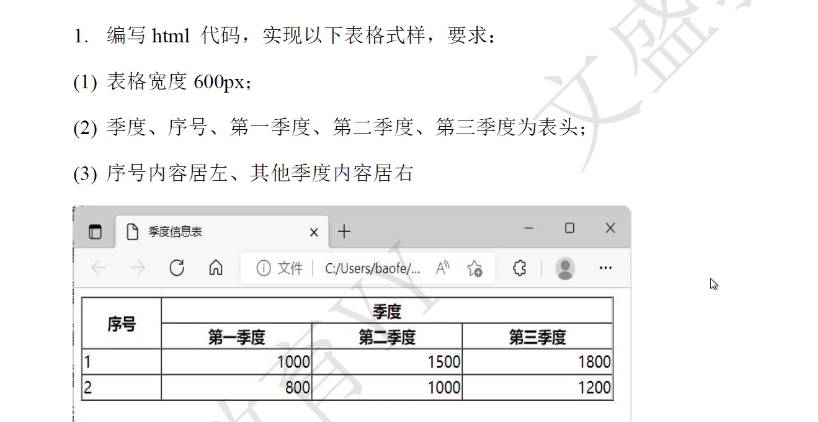

# 表格

1. 成绩登记表的制作。下图是一个基本的成绩登记表，数据包括：ID序号、学号、姓名、平时成绩、期末成绩、总评成绩。

   ```html
   <!DOCTYPE html>
   <html>
   	<head>
   		<meta charset="utf-8">
   		<title></title>
   	</head>
   	<body>
   		<table border="1" cellspacing="0">
   			<caption>成绩登记表</caption>
   			<tr bgcolor="#aaffff">
   				<th>序号</th>
   				<th>学号</th>
   				<th>姓名</th>
   				<th>平时成绩</th>
   				<th>期末成绩</th>
   				<th>学期总成绩</th>
   			</tr>
   			<tr align="center">
   				<td>1</td>
   				<td>2010300201</td>
   				<td>张小丽</td>
   				<td>95</td>
   				<td>95</td>
   				<td>95</td>
   			</tr>
   			<tr align="center" bgcolor="#55ffff">
   				<td>2</td>
   				<td>2010300201</td>
   				<td>张小丽</td>
   				<td>95</td>
   				<td>95</td>
   				<td>95</td>
   			</tr>
   			<tr align="center">
   				<td>3</td>
   				<td>2010300201</td>
   				<td>张小丽</td>
   				<td>95</td>
   				<td>95</td>
   				<td>95</td>
   			</tr>
   			<tr align="center" bgcolor="#55ffff">
   				<td>4</td>
   				<td>2010300201</td>
   				<td>张小丽</td>
   				<td>95</td>
   				<td>95</td>
   				<td>95</td>
   			</tr>
   			<tr align="center">
   				<td>5</td>
   				<td>2010300201</td>
   				<td>张小丽</td>
   				<td>95</td>
   				<td>95</td>
   				<td>95</td>
   			</tr>
   			<tr align="center" bgcolor="#55ffff">
   				<td>6</td>
   				<td>2010300201</td>
   				<td>张小丽</td>
   				<td>95</td>
   				<td>95</td>
   				<td>95</td>
   			</tr>
   		</table>
   	</body>
   </html>
   ```

2. 

   ```html
   <!doctype html>
   <html>
       <head>
           <meta charset="utf-8"/>
           <title>季度信息表</title>
       </head>
       <body>
           <table width="600px" cellspacing="0" border="1">
               <tr>
                   <th rowspan="2">序号</th>
                   <th colspan="3">季度</th>
               </tr>
               <tr>
                   <th>第一季度</th>
                   <th>第二季度</th>
                   <th>第三季度</th>
               </tr>
               <tr>
               	<td>1</td>
                   <td align="right">1000</td>
                   <td lign="right">1500</td>
                   <td lign="right">1800</td>
               </tr>
               <tr>
               	<td>2</td>
                   <td align="right">800</td>
                   <td lign="right">1000</td>
                   <td lign="right">1200</td>
               </tr>
           </table>
       </body>
   </html>
   ```

3. 

   ```html
   <!doctype html>
   <html>
       <head>
           <meta charset="utf-8">
           <title>手表价格表</title>
       </head>
       <body>
           <h2 align="center">
               手表价格行情
           </h2>
           <table align="center" border="3" width="300">
            <tr align="center">
           	<th>品牌</th>
                <th>价格</th>
                <th>折扣</th>
           </tr>
          	<tr align="center">
           	<td>浪琴L4.874.4.12.6</td>
               <td>8500</td>
               <td>9折</td>
           </tr>
          	<tr align="center">
           	<td>浪琴L2.786.4.56.3</td>
               <td>9600</td>
               <td>85折</td>
           </tr>
           </table>
       </body>
   </html>
   ```

   

2. 