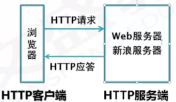
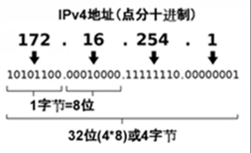
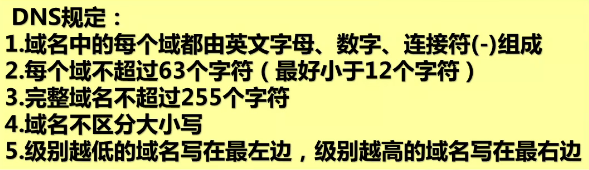
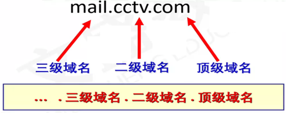
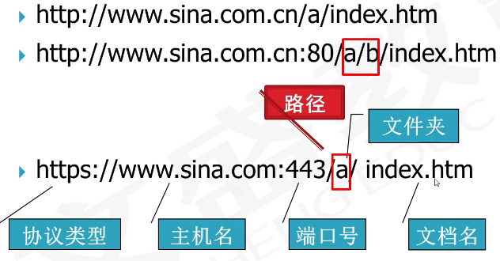

# 网页制作

## 第一章网页制作基础知识

### 网络基础知识

1. Internet

   - **Internet**由不同地区、规模大小不一的网络互相连接而成
     是一个全球性的计算机互联网络，一般翻译为“因特网”或
     国际互联网”
   - 其**作用**是可以在国际范围进行信息传递、资源共享。
   - Internet提供各种各样的信息和资源，通过网络的连接来共
     享和使用。常用的服务有
     - WWW服务：最广泛的服务
     - 电子邮件（E-mail)
     - 网上交际
     - 电子商务
     - 文件传输
     - 远程登录Telnet
     - 网络新闻Usenet

2. WWW简介

   - WWW是**World Wide Web**的缩写，“环球信息网”，中文
     名字常译作“万维网”。
   - WWW是一个由许多互相链接的**超文本文档(网页)**组成的系统，通过互联网**Internet**访问。该超文本机制能够将世界范围内
     Internet.上不同地点的相关信息有机地链接在一起，并以图文
     声等多媒体的方式展示。
   - WWW是**单向连接**而不是双向连接，这使得任何人可以在资源
     拥有者不做任何操作的情况下连接该资源。

3. 浏览器

   - 浏览器作为Web客户端通过URL向**Web服务器**发送所有请求，
     Web服务器根据收到的请求向客户端回送应答信息。
   - 要浏览Web页面，必须在本地计算机上安装**浏览器软件**。
   - 浏览器(Browser)是对网页浏览器的简称，是**Web客户端**，它
     是一个应用程序，用于与**Web服务器**建立连接，并与之进行通
     信。
   - 网页浏览器主要是通过**HTTP(Hypertext Transfer Protocol**
     **超文本传输协议)**与**Web服务器**进行交互并获取网页。
   - 个人计算机上常见的网页浏览器包括
     1. 微软的Internet Explorer（IE)/Edge
     2. Mozilla的Firefox
     3. Apple的Safari
     4. Opera
     5. Google Chrome
     6. 360安全浏览器
     7. 搜狗高速浏览器

4. 服务器

   - **Web服务器**又称WWW服务器、网站服务器或站点服务器。
     从本质上讲，Web服务器就是一个**软件系统**，它通过网络**接收**
     **HTTP请求**，然后**提供HTTP响应**给请求者(浏览器)。
   - 本地网站在制作完成后，不经过**发布**是不能被其他浏览者访问
     的。
   - **发布**就是将本地网站的内容通过**FTP协议(文件传输协议)**传输到连接Internet
     的**Web服务器**上。网站发布后，即获得一个网站地址
     (URL)。**网站通常位于Web服务器上。**

5. IP地址

   - 在Internet.上连接的所有计算机都是以独立的身份出现，称
     为**主机**
   - 为了实现各主机间的通信，每台主机都必须有一个唯一的**网**
     **络地址**，即IP(Internet Protocol)地址，即TCP/IP协议
     表示的地址，并遵循相同的协议。
   - IP地址是**层次地址**，由**网络地址**和**主机地址**组成，网络地址
     表示主机所连接的网络，主机地址标识了网络上特定的主机。
   - 主机间访问就是通过**IP地址**实现的，IP地址**长度为32位**，**分为4**
     **段**，由**十进制数字**组成，每段都在**0-255**之间，段与段之间用**句**
     **点**分隔，经常被写成“点分十进制”的形式。

6. 域名

   - IP地址（主机在网络中的位置)不便于人们记忆，并且不能显示地址组织的名称和性质。所以，设计了**域名**，通过**DNS(Domain Name System域名系统)将域名和IP地址相互映射**，使人们更方便地访问互联网，而不用去记住能够被机器直接读取的IP地址。
   - **一个域名对应一个IP地址，多个域名可同时被解析到一个IP地址**。用户访问一个网站的时候，既可以输入该网站的IP地址，也可以输入其域名，对访问而言，两者是等价的。
   - 域名(Domain Name)是由一串用点分隔的名字组成的
     Internet.上某一台主机或一组**主机的名称**。
   - 作用：用于在数据传输时标识主机的位置。
   - www.sina.com.cn新浪中国网站的域名。
   - 域名采用**分层结构**，每个域名是由几个**域**组成的，域与域之间
     用“.”分开，最末域称为**顶级域**，其他的域称为**子域**
   - 顶级域分为两类
     1. 国家顶级域名：按照1S03166国家代码分配了顶级域名，例如**中国cn**,美国us,日本jp等
     2. 国际顶级域名：**.com**表示工商企业，**.net**表示网络提供
        商，**.org**表示非营利组织。新增**.firm**公司企业，.store销售
        公司或企业，.web突出www活动的单位，.arts突出文化艺术活动的单位，.rec突出消遣娱乐活动的单位，.info提供信息服多的单位，.nom个人。
     3. 在顶级域名下，中国的二级域名又分为类别域名和行政区域名，类别域名如下：
        .ac科研机构.com工业、商业、金融等公司.edu教育机构
        .gov政府部门.mil军事部门.net从事Internet相关的机构或公司.org非盈利的组织或团体.info提供信息服务的企业 .top顶级、标杆组织机构或个人
   - 
   
7. HTTP协议

   - HTTP**(Hypertext Transfer Protocol)超文本传输协议**是Internet遵循一个重要的协议，HTTP是用于传输Web页的客
     户端/服务器协议。
   - 详细规定了**浏览器**和**网站服务器**之间互相通信的规则。
   - HTTP协议**默认使用80端口**。

8. URL

   - URL(Uniform Resource Locator)**统一资源定位符**，用于标识WWW上的某种资源，简称**网址**。用于完整地描述
     Internet.上网页和其他资源的**地址**的一种标识方法。
     
   - Internet的每个网页都具有一个唯一的名称标识，即URL。
   
   - 这些资源通过**超文本传输协议HTTP**(Hypertext Transfer
     Protocol)传送给使用者，使用者通过点击**链接**来获得资源。
   
   - **URL由四部分组成：协议类型，主机名，端口号和路径**
   
     - **主机名**：上例中的"www.sina.com.cn”部分，新浪网站的主机名，可以是域名，也可以是IP地址。
     - **端口号**：http 80,https 443 FTP 21
     - **所要访问的文件路径**：指明要访问资源的具体位置。在主机名与文件路径之间，一般用“/”符号隔开。
   
   - 协议类型
   
     1. **file**：本地计算机上的文件，格式为file://
   
     2. **http**：通过HTTP访问资源，用于传送网页，格式为
   
        http://www.sina.com.cn
   
     3. **ftp**：通过FTP访问资源，用于传送文件，格式为
   
        ftp://192.168.1.20
   
     4. https,通过安全的HTTPS访问资源，格式为https://
   
     5. mailto,资源为电子邮件地址，通过SMTP访问，格式为mailto:
   
        **SMTP(Simple Mail Transfer Protocol)电子邮件传输协议**
   
9. FTP协议

   - **FTP(File Transfer Protocol,文件传输协议)**(**默认端口号21**)是TCP/IP协议组中的协议之一。
   - **FTP协议包括两个组成部分**
     1. FTP服务器：用于存储文件
     2. FTP客户端：用户可以使用FTP客户端通过FTP协议
        访问位于FTP服务器上的资源。
   - 在发布网站的时候，通常利用**FTP协议**把制作好的网页或程序
     传到Web服务器上。此外，由于FTP传输效率非常高，在网
     络上传输大的文件时，一般也采用该协议。

10. TCP/IP协议

    - TCP/IP(Transmission Control Protocol /Internet Protocol)的简写，中文译名为**传输控制协议**/“**因特网互联协议**”或“**网际协议**”
    - TCP/IP**是Internet最基本的协议，是Internet基础。**

11. W3C

    - W3C(world Wide Web Consortium,万维网联盟)是Web技
      术领域非常具有权威性和影响力的国际中立性**技术标准机构**。
    - W3C非常重要的工作就是**发展Web规范，制定Web标准**。

### 网页

1. 网页
   - 网页一般又称为HTML文件，是一种可以在WWW上传输，能被
     浏览器认识和翻译成页面并显示出来的**文件**，英文名**web page。**
   - **网页存储在Web服务器上**，**其内容是由HTML**(Hyper Text
     Markup Language,**超文本标记语言**)**语言编写而成的**。
   - 网页包含了需要展示的信息（文字、图像、声音、视频等)。
   - **构成网页的基本元素**
     1. 文本
     2. 图形
     3. 图像：常用的格式bmp,tif,gif,jpeg,psd,png等
     4. 音频：常用的格式midi,wav,mp3,afi等
     5. 视频：常用的格式avi,mpeg,wmv,rm,asf,flv等
     6. 动画：常用flash动画，.swf
   - **文字与图片是构成网页的两个最基本元素。**
2. 网页分类：
   - 根据采用的技术，大致可以分为**静态网页**和**动态网页**两种：
     1. 静态网页：**浏览器端与服务器端不发生交互操作。.htm和.html为扩展名的文件**
     2. 动态网页：**“动”指的是“交互性”  信息存储在服务器端的数据库**
        - 动态网页开发技术：
          ASP技术，网页文件后缀asp
          ASP.Net技术，网页文件后缀.aspx
          JSP技术，网页文件后缀。jsp
          PHP技术，网页文件后缀php
   - 根据网页在网站中所处位置，网页可分为**主页/首页**和**内**
     **页**两种；
3. 网页制作的核心技术
   - 网页制作的核心技术 HTML网页结构+CSS+JavaScript(JS)
   - CSS**(Cascading Style Sheets)层叠样式表**,是一种用来表
     现HTML文件样式的标记语言，不仅可以静态地修饰网页
     还可以配合各种脚本语言动态地对网页各元素进行格式化。
   - **JavaScript是Web页面中的一种脚本编程语言**，也是一种通
     用的、跨平台的、基于对象和事件驱动并具有安全性的脚本
     语言。
   - 脚本编程语言：VBScript和JavaScript,**JavaScript是最常**
     **用的。**

### 网站

1. 网站
   - 网站是一组相关**网页**和**有关文件**的集合，以一定的方式相链
     接，成为一个整体。
   - **网页是网站的基本组成要素**。
   - 打开一个网站时看到的第一个页面就是**主页**，主页也是网站
     的**首页**。
   - 与主页相链接的其他各个页面称之为**内页**。
   - 一个网站通常只有一个首页文件。
   - 网站的表现形式：Web服务器上的一个特定文件夹。
   - **主页文件的名称index或者default;**
   - **主页/首页**是一个网站的主索引页，是网站的重中之重，是网
     站的灵魂。

### 网页设计与制作

1. 网页设计与制作工具
   - 网页制作工具按照其工作方式，一般可以划分为两类，**一类**
     **是直接编写HTML源代码的软件**，例如EditPlus、微软的记
     事本、HBuilder、.Vebstorm等；
   - **另外一类就是所谓的“所见即所得”的网页编辑工具**，这类
     软件一般提供了可视化的界面，使用者不需要手工编写
     HTML等代码。例如**Dreamweaver**软件。
2. 不同网站类型中不同的设计与制作要求
   - 展示型网站
   - 品牌宣传类型网站
   - 营销性质的网站
   - 门户综合信息网站
   - 商城网站
   - 服务公司的网站
   - 企业网站设计网站
3. 网站建设基本流程
   - 网站建设前的准备工作
   - 创建站点的导航结构
   - 组织文档和数据，进行具体的建设网站
   - 测试站点
   - 网站建设后要申请域名和主页空间
   - 网站制作完成后的发布
   - 网站备案
   - 网站的宣传

## 第二章网页制作软件CS6

## 第三章创建本地站点

## 第四章制作简单的网页

## 第五章超链接

## 第六章图像

## 第七章表格

## 第八章表单

## 第九章DIV与框架

## 第十章CSS

## 第十一章库与模板