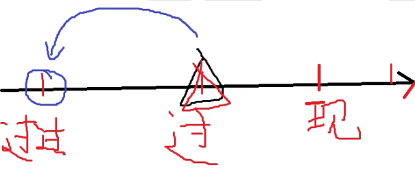
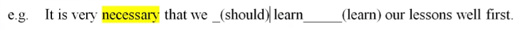
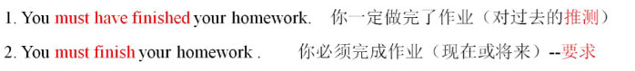

# 动词的时态

1. | 时态           | 形式                                    |
   | -------------- | --------------------------------------- |
   | 一般现在时     | do/does ，==am/is==/**are**             |
   | 一般过去时     | did，==was==/**were**                   |
   | 一般将来时     | will  / shall(第一人称)   do (动词原形) |
   | 过去将来时     | would do (动词原形)                     |
   | 现在进行时     | am/is/are doing                         |
   | 过去进行时     | was/were doing                          |
   | 将来进行时     | will be doing                           |
   | **现在完成时** | have / has done                         |
   | **过去完成时** | had done                                |
   | **将来完成时** | will have  done                         |

2. Do代表所有动词的原形 

  3. **does代表所有动词的第三人称单数**(he plays)

  4. **did代表所有动词的过去式**(play一played,see--saw不规则变化一背诵66页)

  5. 进行=be+doing(缺一不可)

  6. **done代表所有动词的过去分词**(play一played-一played,see一saw-seen)

## 一般现在时

1. 定义：**表示通常性、规律性、习惯性、真理性**的**状态或者动作**有**时间规律**发生的事件的一种时间状态
2. 形式：do/does,am/is/are

### 考点一

1. 一般现在时常见的时间标志词：**always总是，usually通常，often通常，sometimes 有时，every day每天，every week每周，on Mondays每周一**，

   **<u>once 一次/twice两次 a week (day,year,month...)一周一次</u>**等

2. 答题步骤：

   - 找标志词
   - 定考点
   - 出答案

3. 单三：看主语（主语是==第三人称+单数==：谓语动词**+s**)

   - **不是 I we you**

4. 例子

   ```
   1.They (learns/learned/learning/learn) English every day.--learn
   2.He (play/played/plays) basketball once a week.--plays
   ```

5. ```
   Tom often 一般现在时_B_into the traps陷阱set 设置by Jerry.
   A.get  B.gets C.got D.getting.
   词汇：get into陷入--get into troubles陷入麻烦
   ```

### 考点二

1. 真理永一现

2. The **sun 太阳**  the **earth地球**  the **moon月亮**

3. **某国人说某国话**

4. **节日的时间**

5. **(火车train 列车train 飞机airplane)时刻表**

6. ```
   e.g.The earth (go/goes/went)around the sun.--goes
   My train(火车)__in New York at eight o'clock tonight.--A
   A.arrives
   B.will arriving
   C.is going arrive
   D.arrived
   2.He said the sun__in the east and__ in the west.--B
   A.rose:set
   B.rises;sets
   C.rises;set
   D.rise:sets
   ```

7. **and 前后一致**

### 考点三

1. 主将从现--(**主句用一般将来时，从句用一般现在时表将来**)

   - 表示时间的引导词：**<u>when当…时，as soon as 一…就，until直到 after之后.before之前 ,once 一旦</u>**，the moment 一…就，the minute一…就，the day在那天 等
   - 表示条件的引导词：**if如果，unless(=if not)如果不** as long as只要 ，provided假设，等

2. 区分主从句：

   - **有引导词是从句**
   - **没有引导词的是主句**
   - **引导词>时间词**

3. ```
   1.I will tell him the good news when从句一从现he(gets/willget/got/get)here.主将从现.--gets
   主从句翻译：先从句后主句
   变式：I will tell him the good news when从句一从现he(gets/will get/got/get)here tomorrow.主将从现--gets
   2.If主将从现he accepts the job从句，he主句一主将(gets/will get/got/get) more money soon--well get
   3.When the couple ___ here tomorrow,they___to the park.--D
   A.will come;will go
   B.come;go.
   C.will come;go
   D.come;will go.
   4.If we ___to protect the environment,we will regret it sooner or later.
   A.hadn't acted
   B.haven't acted
   C.don't act--C
   D.won't act.==will not act
   5.The new secretary will report to the manager as soon as she__--B
   A.will arrive
   B.arrives
   C.is arriving
   D.is going to arrive
   ```

### 考点四

1. **the+比**较级...... 从句 ，**the+比**较级...... 主句（**越.…就越.…**)句型中 (**主句一主将**)

2. **时态（主将从现）抛砖引玉一前从后主**

3. 比较级

   - 形容词和副词才有比较级和最高级

   - **比较级+than**(**看到than就加比较级**)

   - 变化规则

     1. 普通单词：比较级+er   最高级+est

     2. 以e结尾：比较级+r       最高级+st

     3. 以“**辅-元-辅**”结尾：**双写尾字母**+**er**  /  **+est**（hot-hotter-hottest , thin-thinner--thinnest） 

        元音字母：**a e i o u**

     4. 以“**辅+y**”结尾：**把y变 i +er /est** (busy--busier--busiest)

        注意：最后一个字母为需查看前一个字母是否为辅音

     5. **以“er / ow”结尾：直接+er  +est**（slow-slower-slowest
        clever-cleverer--cleverest）

        注意：第五条是第三条的特殊形式

     6. **多音节词**：比较级 在原词前+more，最高级 在原词前+most

        (元音字母大于等于三-多音节词)
        **terrible ---more terrible---most terrible.**
        **beautiful---more beautiful---most beautiful.**
        **strong---stronger---strongest.**

     7. 特殊需要背诵

        | 原型                    | 比较级           | 最高级             |
        | ----------------------- | ---------------- | ------------------ |
        | Good adj /well adv好：  | Better           | Best               |
        | Bad adj /badly adv坏    | Worse            | Worst              |
        | Many可数/much不可数  多 | More             | Most               |
        | Little  不可数 少的     | Less             | Least              |
        | Far  远                 | Farther/further. | Farthest/furthest. |
        | Old 老的                | Older/elder      | Oldest/eldest.     |
        
     8. **最高级**：1.**时态：现在完成时**   2.**引导词：that**

4. ```
   马上练习]2020年43题
   Scientists have done a lot of study to show that praise is far (effective)__than criticism in improving students'behaviour.
   --more effective
   ```

5. ```
   The harder you study the better results you (get/gets/will get/got)   --will get
   1.The more you know him,the more you___ him.--c
   A.like
   B.likes
   C.will like
   D.liked.
   2.The more progress you make,the___(happy)you will be.--happier
   3.There is a well-known proverb:The more haste,the (little)___speed.
   --less
   ```

## 一般过去式

1. 定义：表示在过去某个特点时间**发生且完成**的动作，**不强调对现在的影响**。

   ```
   She was my girlfriend.
   她是我的女朋友现在不是了 发生且完成
   ```

2. 形式：did  was / were 

### 考点一

1. **一般过去时**的时间词：**just now刚才，yesterday昨天，last week上周，in 1840,  once(曾经)，ago  之前 等**

2. 总结：once

   1. once a week一次       ---一般现在时
   2. once 一旦（引导词）---主将从现
   3. once 曾经                  ---一般过去时

3. ```
   Yesterday he ___ off to buy himself a brand-new car.--D
   A.go
   B.goes
   C.going
   D.went
   
   ```

### 考点二

1. **短语辨析：（背诵）** （**重要**）

   1. **used to do    过去常常，曾经**（现在不做了）
   2. **be / get / become  used to doing    习惯于（主语：人）**
   3. **be used to do被用来     （主语：物）**

2. ```
   1. He used to (smoking/smoke/smoked/smokes)a lot.--smoke
   2. Jerry is used to (have/has/having/had) milk every morning.--having
   3. This pen is used to (writing/write).--write
   1.I am used to___up early. --A
   A.getting
   B.get
   C.got
   D.gets
   2.The knife is used to___grass.--B
   A.cutting
   B.cut
   C.cuts
   D.be cut
   3.He used to___a walk after dinner.--C
   A.taking
   B.takes
   C.take
   D.took
   ```

## 一般将来时

1. 定义：一般**将来**时表示将来某一时刻的动作或状态，或将来某一段时间内经常的动作或状态。
2. 形式：will do
3. 否定：will not do (won^,^t do)

### 考点一

1. **(四星考点)主将从现**

   - 时间类：when,as soon as,until,after
   - 条件类：if,unless=if not

2. ```
   1. We______(begin)our class as soon as the teacher______ (come).
   --will befin   -- comes
   2. USA will overcome the difficulty of COVID-2019(新冠病毒) if the government ___(work)hard with the citizens together.
   --works
   ```

### 考点二

1. 一般将来时的标志词：**==next下一个==，next week下周...，==tomorrow== ,tomorrow morning  ，soon不久之后，some day=one day(未来的某一天)，in the future在未来，==in+时间段==（在…之后 in three years三年后），==this year今年== (week这周,evening今天晚上)**

   in 1990---一般过去加的是时间不是时间段

2. ```
   My mother___(give)me a nice present on my next birthday.--will give
   ```

### 考点三

1. 考点三：**祈使句（表将来）**，**and(和)/ or** **否则(otherwise)** **前后一致**+**will do...**

2. 祈使句定义：以**动词原形/don't开头**—————**祈使句表将来**

3. 否定形式：**Don't**

4. 例句 Open the door.  Sit down.

5. **and(和)/ or** **前后一致**

6. ```
   1.Get up early,or you (miss/is missing /missed/will miss)the first bus this morning.--will miss
   l.Say hello to Tom when you___(see)him.--see
   2.Open the door and you___(see)him.--will see
   (2019年44题)Tell him not to make any response if he___(receive)
   false information.--receives
   ```

### 考点四

1. 表示一般将来时

   - will do                 无计划
   - **be going to do 有计划，暗示**(Look at the dark cloud乌云-暗示，it is going to rain) （只能用于能计划的，不能计划的需要暗示）
   - **be to do**              正式安排、要求
   - **be about to do**   **不能与时间词连用** 不能与tomorrow,next week等表示明确将来时的时间状语连用。

2. ```
   He___part in a party tomorrow.--A更好
   A.is going to take
   B.is about to take
   C.is to take
   D.takes
   ```

3. 答题步骤：找标志词-定考点-看选项出答案

### 考点五

- 某些表示短暂性动作的动词如arrive,come,go,leave,start等，用现在进行时形式表示将来。

- 扩展

  - 延续性动词：like,have

  - 非延续性动词（短暂性动词，**瞬间动词**）：**arrive到达，come来，go去，leave离开，reach到达**

    **注意：短暂性动词：现在进行时（表将来）**  I am coming. 我马上来了

- **瞬间动词的进行表将来**

- ```
  I am coming. 我马上来了
  I am leaving for Beijing tomorrow.  我明天将要去北京
  I am leaving Beijing tomorrow.      我明天将要离开北京
  leave+地点  离开某地
  leave for+地点 动身去某地
  ```

  

## 过去将来时

1. 定义：表示**过去**某时看来**将要**发生的动作或存在的状态。

2. 形式：would do

3. 过去将来时=**将来时间词+过去词**

   ```
   1.She said that her mother___(come)to see her the next day.--would come
   said-say过去式
   2.Her mother__(come)to see her next day.--will come
   She hoped that they___again someday=some day=one day.--D
   A.meet
   B.will meet
   C.met
   D.would meet
   p74.16 The teacher told(tell 过去) us that we___to London the next month.--D
   A.travel
   B.had traveled
   C.are traveling
   D.would travel
   ```

   

## 现在进行时

1. 定义：**正在，现阶段的动作**
2. 形式：am / is / are doing
3. 否定形式：am/is/are+not+doing

### 考点一

1. **现在进行**时常见标志词：**==时刻点（进行）==，now现在，right now 现在，==at the moment在此刻==，listen! 听，look!看，at this time在此刻，these days最近这些天，at present现在，==for the time being现在==，for the present现在**，

   **just now刚刚--一般过去时**

2. 时刻点（所有的时刻点表进行）

   - 时刻点（进行）+过去词=过去进行时
   - 时刻点（进行）+将来词=将来进行时
   - 时刻点（进行）+现在词/无时间词=现在进行时

3. ```
   I (wait/waits/am waiting)for you at the school gate now.--am waiting
   It is six o'clock in the morning.Many（许多） old people(人们)___in the park.
   A.are dancing--A
   B.dance
   C.is dancing
   D.dances
   ```

   

## 过去进行时

1. 定义：表示过去在某一时间段或某一段时间内正在发生或进行的动作或状态。
2. 形式：was / were doing

### 考点一

1. 标志词：**at this time（yesterday） **昨天的这个时刻，at **that** time在那时, at 6  p.m.  yesterday ， **from nine to ten last evening**昨晚从九点到十点 **the whole morning(整个上午)**，**all day yesterday(昨天一整天)**，等。

2. ```
   1.Tom(sleeps/slept/will sleep/was sleeping)this time yesterday?--was sleeping
   2.I (am learning/was learning/learned/learns)at nine last night.--was learning
   ```

## 将来进行时

1. 定义：表示将来某个时刻或时间段正在进行的动作。

2. 形式：will be doing

3. 将来进行时=时刻点（进行）+将来词

4. ```
   I (do)my homework this time tomorrow.--will be doing
   ```

5. ```
   He___basketball at 5p.m.tomorrow.--D
   A.is playing
   B.will play
   C.plays
   D.will be playing
   ```

## 现在完成时

1. 定义：现在完成时表示**过去发生**的动作**对现在造成的影响**或结果或表示**过去的动作**或**状态持续**到现在。

2.  

3. 1.我刚刚吃了个汉堡。一般过去时
   2.A:我们去吃个饭吧  B:我刚刚吃了个汉保。---现在完成时

4. 形式：have / has done

5. 助动词：l.do(don't doesn't)  2.完成时中的  have has had

6. ```
   l.I have a book.have不是助动词，不是现在完成时一般现在时(I don't have a book)
   2.I have finished reading this book. have是现在完成时中的助动词(I have not finished reading the book.
   ```

### 考点一

1. 常见的时间词：**==for+时间段，so far直到现在==，in/over the last/past+时间段（在过去的多长时间），since自从+时间点，over/during/through/throughout+时间段，次数(once,twice,数字+times)，up to now直到现在，lately最近，just刚才，recently最近，already已经**，yel然而，ever曾经，till now直到现在

2. 总结：次数 once twice 数字+times

   - once a week/a day /a year 一周一次               一般现在时
   - once  一次（我去过北京一次）现在完成时
   - once 一旦(引导词+从句)           主将从现
   - once 曾经                                 一般过去时

3. 补充：**遇到具体单独次数时---只能判断存在完成时**

4. ```
   注意：in the past  一般过去时
   in the past+时间段---现在完成时
   1.In the past this district was poor.
   2.In the past few years I have learned 3000 words.
   3.Tom(finished/finishes/has finished the homework up to now.--has finished
   ```

5. ```
   1.They__in Beijing for five years--A
   A.have lived
   B.lived
   C.live
   D.lives
   2.Our country__the sixth population census(人口普查)already--B
   A.finished
   B.has finished
   C.will finish
   D.finishes
   Great changes__in people's life over the past few years.--D
   A.take place
   B.are taking place
   C.took place
   D.have taken place
   ```

### 考点二

1. **主句（现在完成时）**+==since== 引导词+**从句（一般过去时）**

2. **看见since现在完成**

3. ```
   We_have been_(be)friends since we_met _(meet)at first time.
   Jim__in Beijing since he__his college.--C
   A.worked;has finished
   B.has worked;has finished
   C.has worked;finished
   D.worked;finished
   We came to England in 1995 and__here ever since.--C
   A.had lived
   B.have been lived
   C.have lived
   D.lived
   ```

### 考点三

1. 考点三：固定句式 **It is** / It **has been**+一段时间+**since从句**（**一般过去时**）.…
   自从...以来，已经多长时间了。

2. **主句现在完成**，**since从句一般过去**

   ```
   It (has been/is/was/have been)ten years since we (move/moved/have moved)to this beautiful counlry--has been/is   moved
   ```

### 考点四

1. It/This **is** the **first/second**(序数词) time+that**(现在完成时**) 第几次做某事

   It/This **was** the **first/second**(序数词) time+that**(过去完成时**)  第几次做某事

2. 基数词one two three  序数词first sccond third

3. ```
   例：This is my first time that I (visited/have visited/visit/had visited)China  --have visited
   This was my first time that I (visited/have visited/visit/had visited)China  --had visited
   1.It is the first time that she__in public.--A
   A.has sung
   B.had sung
   C.have sung
   D.sang
   2.Is this the second time that you__to school?--A
   A.have been
   B.am
   C.was
   D.had been
   ```

### 考点五

1. It is+==最高级==+that+**现在完成时**

2. ```
   例：This is the best(worst，most interesting)film that I have seen.--worst
   It is the most instructive lecture that I__since I came to this school.--D
   A.attended
   B.had attended
   C.am attending
   D.have attended
   ```

### 考点六

1. 常见的**瞬间动词**完成时(瞬间动词不能用在完成时中需要替换成形容词)

   1. die 死 瞬间动词== be dead(.adj)  He **has been dead for ten years.**

   2. start/begin 开始 瞬间动词 == be on (adj)  The film **has been on** for 20minutes.

   3. leave离开瞬间动词== be away from    I **have been away** from hometown for ten years.

   4. open 打开 瞬间动词==be open    The store **has been open** for 2 hours.

   5. join参加瞬间动词==be in  He **has been in** army for 2 years.

   6. buy买瞬间动词===have有  I **have had** the book for I week.

   7. borrow借进/lend借出 瞬间动词===keep保存   I **have kept** the book for I week.

      **总结：遇到时间段-不选瞬间动词（左侧）-应该选延续性(be+adj右侧)**

2. 瞬间动词：**come来，go去，leave离开，arrive到达，reach到达**

3. 练一练

   ```
   判断
   - He has left his hometown for ten years. 错
   - He has been away from his hometown for ten years. 对
   - The movie has begun for ten minutes.  错
   - The movie has been on for ten minutes. 对
   Tom's  grandmother__since he was four years old  --C
   A.died
   B.has died
   C.has been dead
   D.have been dead
   ```


## 过去完成时

- 定义：它表示动作发生的时间是“**过去的过去**”。句中有**明显**的**过去参照**，**这种时态从来不孤立使用**。

- **过去完成时 = 句子本身过去词 + 过去的过去。**

- **句子本身有过去才能选过去完成**---当要用过去完成必须有一般过去

- ```
  1.他把书包落在学校了。一般过去时
  2.他刚刚说他把书包落在学校了。--过去完成时
    落书包（过去的过去-过去完成时）---说（过去）
  
  1.He lost(lose)his key.一般过去时
  2.He realized意识到 hat  he_had lost_(lose)his key.--过去完成时
    lose丢（过去的过去）--realized(过去)
  ```

- 形式：had done

### 考点一

1. 考点一：在**told,said,knev,heard,thought**(**过去**式)等动词后的宾语从句中

2. **Before+过去词**----Before I arrived--**过去完成时**

3. ```
   1.She said that she __ (be) to Paris. --had been
   2.He told me that he__his wallet in the restaurant.--D
   A.left
   B.lcaves
   C.has left
   D.had left
   ```

### 考点二

1. when(时间类+条件类的引导词)

2. 总结when考点：

   一，主将从现

   二，时态一致（如果when**从句是**一般**过去**时，**主句**可以是**过去的任意时态**（一般过去，过去将来，过去进行，过去完成)

   1. when+did,主句+**过去进行时**（翻译“正在”，两个动作同时发生）
   2. when+did,主句+**过去完成时**（翻译“已经”，两个动作有先后顺序-过去完成时在先，一般过去时在后)
   3. when+did,主句+**过去将来时**（找表示将来的时间词）
   4. when+did,主句+**一般过去时**（不符合前3条）

3. ```
   When the police arrived,the thieves__(run)away. --had run / were run 
   Unluckily,when we arrived here,they__ --D
   A.have left
   B.will leave
   C.were leaving
   D.had left
   ------leave(过去的过去)---arrived(过去)---
   p74 35题
   The robber had escaped and was nowhere to be found when the police__ --B
   A.arrive --当要用过去完成必须有一般过去
   B.arrived
   C.have arrived
   D.had arrived
   p73 9题
   When she was in the city,she often__to this park --C 
   A.had gone    
   B.has gone
   C.went
   D.goes
   p74 17题
   She__someone when I came across her,so I nodded to her and went away.--C
   A.phoned
   B.had phoned
   C.was phoning
   D.has phoned
   p75 37题
   When I met Mary.she said that she__for an interview the following day.--A
   A.would go
   B.has gone
   C.went
   D.had gone
   -- following day=next day将来
   p73 3题
   When he__the door,he found his keys were missing(不见了) --D
   A.was opening
   B.opened
   C.had opened
   D.was to open
   ```
   

### 考点三 

1. **==by== / till**+**时间**，其动词形式用过去完成时。（**特别重要**）

   1. **by(完成)**+**现在时间词**=**现在完成时**
   2. **by(完成)**+**过去时间词**=**过去完成时**
   3. **by(完成)**+**将来时间词**=**将来完成时**
   4. **by(完成)**+**一般现在时的句子(表将来**)=**将来完成时**

2. ```
   1.There (were/have been/had been)25 parks in our city up till the year of 2000.       --had been
   2.By the end of last term,we (had finished/have finished/finished)the book            --had finished
   ```

### 考点四（重点）

- **hardly...when.  ,  scarcely...when..  ,  no sooner..than..**(注意：不是then)
  **一...就...**，主句用过去完成时，从句用一般过去时。

- 时态：**前过完后过**

- 倒装语序(疑问): 

  陈述句--------**倒装句**（疑问句）

  1. He **can** play basketball.---------**can** he play basketball
  2. He **is** a student.-----------**is** he a student
  3. He **has** finished the work.------**has** he finished the work
  4. He **had** finished the work.------**had** he finished the work
  5. He likes red.------**docs** he like(恢复原形)rcd
  6. 总结倒装：有情用情，有be有be,有完成中的have/has/had，前三个都没有求助do/does/did
  7. **情态一be--完成时中have/has/had--前三个都没有求助do/does/did**
  8. **倒装前提：必须否定词放句首（主倒从不倒）**

  **倒装：否定次放句首（主倒从不倒）**

- 答题技巧：

  1. **一看：搭配**
  2. **二看：时态（前过完后过）**
  3. **三看：倒装（必须否定词放句首--主倒从不倒）**

- ```
  I had hardly finished my work when he came to see me.
  1.No sooner__the beautiful bird flew out happily and fast,and threw itself onto the wall heavily.--A 
  A.had the little boy opened the cage than
  B.the little boy opened the cage than
  C.had the little boy opened the cage when
  D.the little boy opened the cage when
  E.the little boy had opened the cage than --否定词放句首
  2.(2010年第4题)__he realized it was time to go back home.--D 
  A.No sooner it grew dark when
  B.Hardly it grew dark than
  C.Scarcely it grew dark than
  D.It was not until,dark that
  强调句：it is /was+被强调成分（名词、短语、从句）+that/who, It was Tom who broke the windows yesterday.
  [马上练习]教材P74第32题
  3.No sooner had she finished her specch than the students__ --A
  checring.
  A.started
  B.have started
  C.start
  D.are to start
  词汇：cheer v欢呼 cheerful adj  cheer up振奋人心鼓励
  ```

### 考点五

- 序数词+time-完成

  It is the first/second time that+现在完成时 **have/has done**
  It was the first/second time that+过去完成时had done

- 辨析题：

  ```
  1.It was the second time that she (had seen/have seen/has seen/saw)her grandfather.
  2.It is the second time that she (had seen/have seen/has seen/saw)her grandfather.
  ```

- 练一练

  ```
  1.It is the first time that I__such a complicated problem.--A
  A.has met
  B.meet
  C.have met
  D.had met
  2.It was the first time that I__such a complicated problem.--D
  A.met
  B.meet
  C.have met
  D.had met
  词汇：complicated adj复杂的=complex
  ```


## 将来完成时

- 定义：表示在**将来**某一时间以前**已经**完成的动作。（注意抓住时间的截止点）
- **形式：will have done**

### 考点一

- 考点：**by/till/until+时间**==**完成** (**超级重要**)

  1. **by(完成)+now=现在完成时**
  2. **by(完成)+过去时间词=过去完成时**
  3. **by(完成)+将来时间词=将来完成时**
  4. ==**by(完成)+一般现在时的句子(表将来)=将来完成时**==

- 例题

  ```
  By next Tuesday,I__(get)ready for the exams. --will have got
  ```

- 真题

  ```
  1.(2021 2)By the time you get to the office.I__all the documents(文件) for the meeting.--D
  A.prepared
  B.was prepared
  C.was prepared
  D.will have prepared
  2.(2020年4题)The workers__the subway by next year. --A
  A.will have built
  B.are going to build
  C.will build
  D.are building
  3.(20l8年3题)By the time the course ends,__a lot about the British way of life.--A
  A.we'll have learned
  B.we'll learn
  C.we are learning
  D.we have learned
  4.(2016 44)By the end of next October.the factory__(produce)about 10,000 cellphones
  -- will have produced
  5.(2015年3题)By the end of this year,they__a new program in Europe.--D
  A.had started
  B.start
  C.are starting
  D.will have started
  ```


# 被动语态

- 定义：主语和谓语动词之间是被动的关系。

- 形式：be+done(缺一不可)

- **by的考点 by+人=被动       by+时间=完成**

- ```
  主动：I主语cat谓语an apple宾语
  被动：An apple is eaten by me
  主动：Students主语planted谓语trees宾语yesterday.
  被动：Trees were planted by students yesterday
  ```

- by

  - **by+时间=完成**
  - **by+人物=被动**

一般现在时被动

- 形式：**am/is/are done**

- ```
  Visitors(游客)__not to touch the exhibits.--B
  A.request
  B.is requested
  C.are requested
  D.will request
  ```

一般过去时的被动

- 形式：**Was/were done**

- ```
  1.I__a nice gift by my mother yesterday一般过去时 B
  A.am given
  B.was given
  C.gave
  D.will be given
  2.(2021 1)Last month four engineers(工程师)__to help solve the technical problems.--C
  A.have sent
  B.sent
  C.were sent
  D.had sent
  ```

一般将来时的被动

- 形式：**will be done**

- 例：

  ```
  The meeting__(put)off if it rains tomorrow. --D
  A.will put
  B.puts
  C.is put
  D.will be put
  ```


过去将来时的被动

- **形式：would be done**

- 例：

  ```
  He said the news__(send)to the soldier's mother the next day.--C
  A.sent
  B.would send
  C.would be sent
  D.will be sent
  ```


快速推导出被动

- 现在进行时+被动

- =am/is/are **doing+be** done

- 加号前的单词不要只保留形式给后面的单词其他单词照抄

- =am/is/are being done

- ```
  过去进行时+被动
  =was/were doing+be done
  =was/were being done
  ```

现在进行时的被动

- 形式：**am/is/are being done**

- ```
  A new cinema__(build)here now.--B
  A.is building
  B.is being built 
  C.was building
  D.was being built
  ```

过去进行时的被动

- 形式：was/were being done

- ```
  The meeting__(hold)at 9 pm yesterday.--D
  A.is holding
  B.is being held
  C.was holding
  D.was being held
```

将来进行时的被动

- 形式：will be being done

- ```
  The meeting__at 9 pm tomorrow.--B
  A.will be holding
  B.will be being held
  C.will hold
  D.will be held
```

现在完成时的被动

- 形式：have / has been done

- ```
  All the tasks__(finish)so far.--C
  A.are finished
  B.will be finished
  C.have been finished
  D.have finished
  ```

过去完成时的被动

- 形式：had been done

- ```
  By完成the end of last year,another new gym__(build)in Beijing.--B
  A.has been built
  B.had been built
  C.had built
  D.built
  ```

将来完成时的被动

- 形式：will have been done

- ```
  The bridge__(build)by the time of next year.--D
  A.has been built
  B.had been built
  C.will have built
  D.will have been built
  ```
  
  
  

## 考点

1. **没有被动的词**：**happen=occur=take place发生，belong to属于，appear出现(disappear消失)，**
   **come true(梦想)实现，break out(疾病战争)爆发，take off起飞**

   - ```
     The dictionary on the desk (belong to /belongs to/is belonged to)me.--belongs to
     ```

2. **主动表被动**：某些表示主语品质或特性的动词，**read读,write写,draw拉,sell卖,wear穿  等，常与well好，easily容易，smoothly顺滑流畅 连用**，用主动形式表示被动含义翻译“**得，起来”---无被动**

   - ```
     1.The new pen (is written/ writes/ write)smoothly--writes
     2.This kinds of shirts (sells /sell /are sold/ is sold)well.--sell
     ```
   
3. 主动表被动（无被动）：感官动词(feel摸起来，look看起来，seem看起来，taste尝起来，smell闻起来，sound听起来)

   - ```
     1.This sweater (feel/is felt/ feels)much softer than that one.--feels
     2.The cake (is tasted/tastes/taste)better than that one.--tastes
     ```
     
   - 总结：“起来/得”   ----无被动 无进行----一般现在时

   - ```
     I want to buy the coat made of that kind of cloth because__ I the cloth__very well
     A.have told;wore
     B.have been told;wears--B
     C.have been told;is worn
     D.have told;wears
     ```
   

# 虚拟语气

1. 虚拟语气（发生的可能性几乎为0）----真实语气（有极大可能性发生）

   **if，主将从现（真实语气）  虚拟语气** (**虚拟都是过去**)

   ```
   真实：If it doesn't rain tomorrow,I will go shopping
   虚拟：If I were you,I would go shopping.
   ```

   总结：判断是否存在虚拟：1与已知事实相反 2将来不太可能

2. ==虚拟表格==

   |      | if从句                                     | 主句                                |
   | ---- | ------------------------------------------ | ----------------------------------- |
   | 过去 | had done                                   | would/could/might/should  have done |
   | 现在 | did(were)                                  | would/could/might/should  do        |
   | 将来 | 1.did(were)<br>2.should do<br>3.were to do | would/could/might/should  do        |

3. 做题方法：

   1. 判断是不是虚拟

   2. 判断好主从句

   3. 判断对什么时候的虚拟

      ```
      If I had had lunch,I wouldn't have asked for something to eat
      If I had lunch,I wouldn't ask for something to eat.
      ```
      

## 考点一

1. 对过去进行虚拟（重点）

   ```
   1.If I (had helped/helped)him,he would have passed the final exam.
   ```
   
2. 对现在进行虚拟

   ```
   2.If I were you,I (would be/were/had been)quiet.
   ```
   
3. 对将来进行虚拟

   ```
   If he were to arrive here,I (would tell/will   tell/tell/told)him the fact at once.
   ```
   

- 练习判断时态（对什么时候的虚拟）

  ```
  1.If I hadhad lunch,I wouldn't have asked for something to eat.
  2.If I had lunch,I wouldn't ask for something to eat.
  3.Jerry would have been encouraged if Tom had been defeated.
  ```

- 练一练

  ```
  Jerry would have been encouraged if Tom had been defeated.
  1.What should we do if it__tomorrow?.--A
  A.should snow
  B.would snow
  C.snow
  D.will snow.
  2.(2021年3题)If wem__more time,we could have visited more places.--B
  A.have
  B.had had
  C.have had
  D.could have
  3.(2020年46题)If I(be)__you.I would not ask such a silly question.--were
  4.(2017年78题)If you__that night,you might have been too late to get your ticket.
  A.didn't hurry  --B
  B.hadn't hurried
  C.wouldn't have hurricd
  D.hadn't to hurry
  ```
  

## 考点二

1. if主从句**混合时间**（虚拟语气：**有时间词优先看时间词**）

2. 例：

   ```
   If I had worked hard at school,I would have been a top student.
   If I had worked hard at school,I would be a top student now.
   ```

3. 练一练

   ```
   1.If you had followed the teacher's advice,you__the team leader now.--C
   A.are
   B.were
   C.would be
   D.would have been
   变式：If you had followed the teacher's advice,you__the tcam lcader.--D
   A.are
   B.were
   C.would be
   D.would have been
   2.(2008年第47题)If you__(not watch)that late movic last night,you would not be so sleepy now.--had not watched
   [马上练习]教材P102第4题
   If you had seen a doctor yesterday,you__what kind of disease you have got now.--B
   A.will know
   B.might know
   C.had known
   D.would have known
   ```
   

## 考点三

1. if虚拟条件句中的“倒装”（难点）

   - 1.**否定词放句首**--**主倒从不倒**
   - 2.虚拟语气：**省略if**(**从句倒装**)   **had,should,were**提到**主语之前**

   判断 **如果be动词助动词情态动词提前没有问号就是省略if虚拟**

2. 练习

   ```
   原句：If he were my father,he would get me out of the crazy prison.
   省略if:Were he my father,he would get me out of the crazy prison.
   注意：否定时，not放在原位，不要提前。
   例如：
   原句：if he hadn't had supper,he would be hungry now.
   正确：Had he not had supper,he would be hungry now.
   错误：Hadn't I had supper,he would be hungry now.
   ```

3. 做题方法：**还原if** 

   ```
   Had you followed the teacher's advice,you__the team leader.--D
   A.arc
   B.were
   C.would be
   D.would have been
   [考点链接]教材P95
   ___your letter,I would have written back two days ago.--C  E 
   A.If I received
   B.Should I receive
   C.Had I reccived
   D.If I have reccived
   E.If I had rcccived
   F.If had I rcccived
   ```
   

## 考点四

1. 含蓄虚拟：常见的标志性词语有：==**with**(如果有=if)，**without**(如果没有) ， **but/but for**(要不是--如果没有)，**or/otherwise**(否则--如果不那样)==，**in case of**(万一，如果那样的话)
   考点：**==If的主句==（等同于If一整个从句）**

2. 例

   ```
   But for your kind-hearted help,we (couldn't have achieved/had not achieved)our success.
   --couldn't have achieved
   ```
   
3. 马上练习

   ```
   Without Chairman Mao,there__no new China in 1949--C
   A.had been
   B.would be
   C.would have been
   D.was
   [考点链接] 教材P101
   He is working with Tom right now;otherwise he__to the party.--B
   A.would have come
   B.would come
   C.came
   D.had come
   ```


## 考点五

1. wish--虚拟语气（倒退一个时态）

   - 对过去的虚拟：had done	(过去完成时)	
   - 对现在的虚拟：did(were)    (一般过去时)
   - 对将来的虚拟：would do  （过去将来时）

   (固定搭配：wish to do)翻译：希望做某事

2. 例

   ```
   1.I wish it were a sunny day today.
   2.I wish she had visited her grandparents then.
   3.He wishes he would do better next time.
   4.He wished to do better next time.
   ```

   

3. 例题：

   做题思路：wish后面不是动词才能考虑虚拟语气

   ```
   「马上练习]教材P102 第9题
   I wish I__courage like him to fight with the thief that day.
   A.took
   B.could take
   C.should have taken 	
   D.had taken
   词汇：courage n 勇气--encourage v 鼓励
   ```

   

## 考点六

1. if only (倒退一个时态的虚拟) 要是…该多好啊！

   - 对过去的虚拟：had done	(过去完成时)	
   - 对现在的虚拟：did(were)    (一般过去时)
   - 对将来的虚拟：would do  （过去将来时）

2. 例

   ```
   If only Tom__(have)breakfast yesterday!
   I wish that I__(be)there with them last month(上月)
   ```

   

3. 例题

   ```
   1.If only Mary__(give)me some help that day!
   2.If only Mary__(give)some help by me that day!
   3.教材P102第15题
   I had a big trouble.If only I__to my parents'advice then.
   A.listened
   B.had listened
   C.should listen
   D.would listen
   ```

   

## 考点七

1. as if = as though好像  (倒退一个时态的虚拟)

   **先判断是不是虚拟（看实现的可能性）**

   **建议：当遇到as if之前是人的行为举止时，常用虚拟** 如He is

2. 例

   ```
   l.She looks as if she were sick.(虚拟语气---与现实事实相反)
   2.It seems as if our team is going to win(真实语气----实现可能性较大)
   ```

3. 例题

   ```
   [练一练]
   Black clouds are gathering in the sky and it looks as if it__.
   A.is going to rain
   B.was going to rain
   C.were going to rain
   D.would rain
   [马上练习]教材P102 第11题
   She looks at me in terror as if I __ the evil stepmother.
   A.was
   B.were
   C.have been
   D.would be
   词汇：terror n惊恐恐怖
   evil adi邪恶的
   stepmother n继母
   ```

   

   

## 考点八

1. **would rather / had rather / would sooner** 宁愿，宁可； 要用“虚拟语气”。

   - **对过去进行虚拟：had done**

   - **对现在 / 将来进行虚拟：did(were)(重点)**

   - **固定搭配：** would rather do
         would rather not do
         would rather do A than do B    宁愿做A而不愿做B

     注意：would rather 只是例子上面 三个都可以

   - **总结**

     1. wish if only  as if=as though---倒退一个时态的虚拟
     2. would rather/had rather/would sooner---倒退一个时态的虚拟**（现在和将来合并）**

2. 例

   ```
   1.We would rather that the matter had not been made public yesterday.
   2.We would rather that you were the chairman now
   区分以下两个句子：
   1.I would rather you__(come)to see me off that day.
   2.I would rather__(die)than surrender to the enemy.
   come----came----come
   become---became---become
   surrender 投降
   enemy 敌人
   ```

   

3. 例题

   ```
   1.I'd rather you__right away.
   A.leave
   B.left
   C.will leave
   D.to leave
   2.(2020 41)Students would rather try once again than (give)__
   up the plan.
   3.教材P103 第21题
   I would sooner you__action to deal with this matter for the time being.
   A.don't take
   B.didn't take
   C.haven't taken
   D.hadn't taken
   ```

   

## 考点九

1. for fear that / in case / lest以防；免得：

   用作虚拟语气时，表现形式为：+ (should) do   （should可以省略）

2. 例

   ```
   I made a circle around the city for fear that anyone (following/follows/followed/should follow)me
   ```

   

## 考点十  

1. 英语中，若**advise建议(advisable),suggest建议(suggestion),demand要求，order命令，propose请求(proposal),ask命令，desire要求，request要求，insist坚持要求，require要求**，等表示“请求、要求、命令、建议等”动词后要用“虚拟语气**(should)do 。**

   - (should) do动词原形   (should可以省略)
   - 否定：should  not do   (should可以省略)
   - 被动：should be done  (should可以省略)

   注意：

   suggest

   - 建议---虚拟---(should)do    主语：人
   - 表明---不虚拟---时态一致   主语：物

   insist

   - 坚持要求（多个人）---虚拟---(should)do 

   - 坚持认为（一个人）---不虚拟---时态一致

     判断方法：要求别人，认为自己

2. 易错题辨析

   ```
   1.The teacher advises that Tom (make/makes)use of every minute at school.
   2.The teacher advises that Tom (don't make/doesn't make/not make)use of every minute at school.
   词汇：make use of利用
   make full use of充分利用
   1.He suggested that we (should finish/finished/finish/finishing) the work on time.
   2.His pale face suggested that he (should be/is/was)ill.
   pale adj 苍白的  white  白色  fair adj公平的 (unfair) 白皙的
   3.She insisted that she (should be/is/was)right
   4.She insisted that we (snould finish/finished/finish/finishing) the work first.
   ```

   

3. 例题

   ```
   l.(2020年2题)It is required that the students__the term paper tomorrow.
   A.finished
   B.finish
   C.will finish
   D.may finish
   2.(2019 3)It is requested that every student__a paper on environmental protection.
   A.writes
   B.wrote
   C.writing
   D.write
   词汇：paper n纸论文
   environment n环境---environmental adj
   protect v保护.--protection n
   3.(20l7年3题)Her parents insisted that she__until she finished her degree.
   A.stayed
   B.stays
   C.stay
   D.would stay
   7.Our teacher insists that we__as attentive as possible when we visit the museum.
   A.be
   B.would be
   C.shall be
   D.are
   词汇：attention n注意  pay attention to (doing) 关注 注意
   attentive adv专注的
   possible adv可能的-impossible adj不可能的
   nothing is impossible!一切皆有可能
   as+adi/adv原形+as possible尽可能
   8.Jane's pale face suggested that she__ill,and we suggested that she__a medical examination.
   A.be:should have
   B.was;have
   C.should be:had
   D.was;has
   词汇：medicine n药--medical adj医药的 医学的
   examine v检验 检查--examination n
   10.The law requires that some cars__at least once a year.
   A.should check
   B.are checked
   C.be checked
   D.check
   词汇：check v检查  at least至少
   ```

   

## 考点十 一

1. **It is (high/about) time that + should(不可省) do / did**  是.的时候了

   注意辨析：It is the **first time** 完成 that+现在完成时  这是某人第几次做某事
                     It was the **first time**完成 that+过去完成时   这是某人第几次做某事

   **time:**

   - **有序数词(first)--完成**
   - **无序数词--虚拟(should do/did)**

2. 例子

   ```
   1.It is time that we__(leave)the poor island.
   2.It is high time that we__(go)to school.
   3.It is the third time that I__(visit)France this year.
   4.It was the third time that I__(visit)France this year.
   ```

3. 例题

   ```
   l.(2022年5题)I think it's high time you__some measures to solve the problem.
   A.take
   B.took
   C.takes
   D.taking
   词汇：measure n措施 方法 take measures to do sth采取措施做某事
   solve v 解决-solution n解决方案
   2.(20l8年7题)It is time we__computers to the production of iron and steel.
   A.will apply
   B.applied
   C.have applied
   D.would have applied
   虚拟：apply v申请应用--application n应用
   apply for申请
   apply to应用
   ```


## 考点十 二

1. It is **important 重要的 /  strange奇怪的 /  necessary必要的 /  essential必要的     /a pity 可惜**   that+(should)可省略  do

2. 例子

   ```
   It is very necessary that we_(should)learn_(learn)our lessons well first.
   ```

   

3. 例题

   ```
   It is very important that you__with Mr.William about this matter immediately.
   A.speak
   B.be spoken
   C.will speak
   D.to speak
   词汇：matter n事情 v有影响 起作用 重要
   [马上练习]教材P103  第22题
   It is important that the government__the policy for the benefit of its people.
   A.makes
   B.made
   C.make
   D.to make
   词汇：government n政府--governmental adj
   policy n政策
   benefit n v利益好处使…受益
   ```


## 考点十 三

1. 情态动词的虚拟语气（情态动词+have done).

   复习情态动词：will/would,.can/could,.may/might,should,must,**need,dare(敢)**,shall(将)

   情态动词：

   - 情态动词+do:现在或将来

   - 情态动词+have done:过去

   - | could have done     | 本能做（却没做）                    |
     | ------------------- | ----------------------------------- |
     | couldn't have done  | 本不能做（却做了）                  |
     | might have done     | 本可以做（却没做）                  |
     | mightn't have done  | 本不可以做（却做了）                |
     | should have done    | 本应该做（却没做）                  |
     | shouldn't have done | 本不应该做（却做了）                |
     | would have done     | 本将要做（却没做）                  |
     | wouldn't have done  | 本不将要做（却做了）                |
     | need have done      | 本需要做（却没做）                  |
     | needn't have done   | 本不需要做（却做了）                |
     | **must have done**  | **一定做了某事<br/>(对过去的推测)** |

2. 例

   ```
   1.You must have finished your homework
   2.You must finish your homework.
   ```

   

3. 例题

   ```
   [马上练习]
   You__come earlier.The bus left a moment ago.
   A.would
   B.should have
   C.may
   D.have
   [考点链接]
   You__caught by the rain just now for you are all wet.[20l0年第9题]
   A.can't be
   B.must being
   C.must have been
   D.can't have
   ```


# 非谓语动词

1. 