# 英语

## 英语基础

- 
- 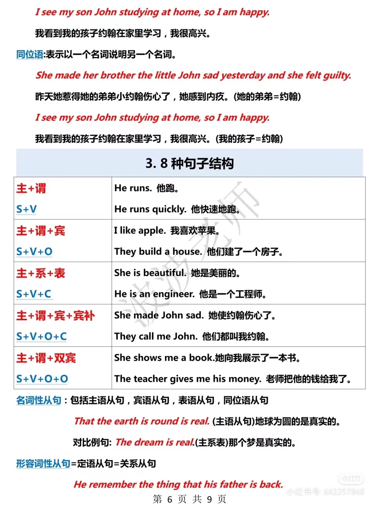

## 高频语法

### 动词

“动词是英语的灵魂”

- 动词：

  1. 谓语动词：有且只有一个
  2. 非谓语动词：0,1,2,3,... 并不重要有没有有多少都可以
  3. 无谓不成句：
     没有谓语动词就不是句子（是句子，必须有一个谓语动词）。

- 定义

  1. 谓语动词定义：一个句子的核心动作（背诵）
  2. 主语定义：发出动作的人、物、事（背诵）
  3. 宾语定义：接收动作的人、物、事（背诵）

- 例子

  ```
  I 主语 eat (谓语动词) an apple宾语
  I 主语 will leave 谓语动词 tomorrow 不是宾语
  ```

  ```
  找出下面句子的“谓语动词”--缩句。
  1.Tom已经学了三个月的英语了。
  2.今年印度的疫情(epidemic situation)给整个世界都带来了不少麻烦
  3.吐槽大会培养出来的人才现在已经各奔东西了
  4.Tom likes China.
  6.Tom who comes from America likes China very much.
  ```

  答案

### 动词的时态

- 英语的时态靠时间状语和动词的变化来表达。
  时间：现在 过去 将来。

  状态：一般 进行 完成

- | 时态           |                                         |
  | -------------- | --------------------------------------- |
  | 一般现在时     | do/does ，am/is/are                     |
  | 一般过去时     | did,was/were                            |
  | 一般将来时     | will  / shall(第一人称)   do (动词原形) |
  | 过去将来时     | would do (动词原形)                     |
  | 现在进行时     | am/is/are doing                         |
  | 过去进行时     | was/were doing                          |
  | 将来进行时     | will be doing                           |
  | **现在完成时** | have / has done                         |
  | **过去完成时** | had done                                |
  | **将来完成时** | will have  done                         |

  1. Do代表所有动词的原形.
  
  2. does代表所有动词的第三人称单数(he plays)
  
  3. did代表所有动词的过去式(play一played,see--saw不规则变化一背诵66页)
  
  4. 进行：be doing
  
  5. done代表所有动词的过去分词(play一played-一played,see一saw-seen)
  
  6. 把加号左右两侧的动词进行合并，规则：加号右侧的词用左侧的形式表示出来！！！
  
     现在完成时的被动语态
     现在+完成+被动
     **do/does+ have** **done + be** done
     have/has been done

**助动词**

1. 第一类does(单三)/do(现在)/did(过去)

   ```
   Tom likes English.==Tom does like English.
   Does Tom like English？
   ```

2. 第二类have在完成时 have done中的用法

   ```
   I have finished my work.
   比较I have a watch.
   本句中have的含义“有”判定不是助动词。
   Tom has passed the exam,本句中has在完成时结构中，没有含义
   Tom will have a test tomorrow. 实义动词
   ```

##### 一般现在时

- 定义：表示通常性、**规律性**、习惯性、真理性的状态或者动作有时间规律发生的事件的一种时间状态

- 形式：do/does,am/is/are

- 否定形式：am/is/are+**not**或do**n't**/does**n't**+行为动词

- 疑问形式：be动词提前；do/does放句首提问。

- 肯定句、否定句、一般疑问句形式：

  ```
  情态动词+动词原形：can/could,will/would,should,must,might/may,
  1.He can do this work.
  否定句：He can not(can't)do this work.
  一般疑问句：Can he do this work?
  2.He is a student.
  否定句：he is not(isn't)a student.
  一般疑问句：Is he a student?
  3.They read books every day. --求助do(助动词)do not(don't)
  否定句：They don't read books every day.
  一般疑问句：Do they read books every day?
  4.Tom likes red.求助do(does doesn't)
  否定句：Tom doesn't like(恢复原形)red,
  一般疑问句：Does Tom like(恢复原形)red,
  ```

- 谓语动词的否定规则：否定词放在be / 助动词 / 情态动词之后！！！

  一般疑问时：be/助动词/情态动词  可以提前

- 总结：有情用情，有be用be,无情无be求助do(does,did)

###### 单三

- 在一般现在时中，如果主语为第三人称单数时，谓语动词常在词尾
  加-s或-es    Tom likes English.
- 规则1：一般情况，词尾-s  例如eat--eats;rise--rises.
- 规则2： 以s、sh、ch、x、o结尾的动词，词尾-es  例如
  discuss---discusses
  wash ---washes.
  teach---teaches
  fix --fixes.
  do---does
  go---goes
- 规则3：以辅音字母加y结尾的动词，词尾y变为ies,
  例如carry-carries  fly---flies
- **常见考点：have的单三形式has**
- 动词的单三变化确定为谓语动词（一般现在时）

###### 考点1

- 一般现在时常见的时间标志词：always总是，usually通常，often通常，sometimes 有时，every day每天，every week每周，on Mondays每周一，once 一次， a week一周一次(day year,month.…)---体现出规律性等。

  seldom很少，不经常（否定词）

- 例子

  ```
  1.They (learns/learned/learning/leam) English every day.
  2.He plays basketball once a week.
  ```

  答案

  

- 答题步骤：找标志词--定考点--出答案--翻译

- 练一练

  ```
  Tom often 一般现在时_B_into the traps陷阱set 设置by Jerry.
  A.get  B.gets C.got D.getting.
  词汇：get into陷入--get into troubles陷入麻烦
  ```

###### 考点2

- 真理永一现

- The sun 太阳  the earth地球  the moon月亮 **节日的时间**

- 例子

  ```
  The earth (go/went/going/goes) around the sun.  选goes
  ```

- 练一练

  ```
  1.The earth___round圆的.  选a
  A.is B.was C.are D.be 
  2.He said(say的过去式) the sun单三 in the east and并列 in the west.真理永一现       选b
  A.rose;set   B.rises;sets  C.rises;set D.rise;sets.
  
  Rise v升起-rose-risen
  Set---set---set-
  ```

###### 考点3

- 表示主语的特征、能力、和状态。

  This cloth feels soft.  这块布摸起来很柔软。
  关键思维：
  什么是主被动？？？
  判断动词主被动时，一定要针对具体的动词，而不是汉语翻译！

  英文中主被动：

  1.主动：与生俱来的，自身的属性、能力、特征。
  2.被动，受外界条件、环境所产生的结果、影响。

  am retired 因为年纪、身体状况不得不退出工作。·
  主动辞职  He quitted the job last week.

- 例

  ```
  This cake__(taste)good. 这个蛋糕很好
  A taste
  B tastes
  C is tasted
  选B自身的属性特征
  ```

###### 考点4

- 用一般现在时表示将来时。（主将从现）

  什么是主将从现！
  在主从句中，当主句、从句都是在表示将来含义时，（英文中常避免重复)，在主句中保留了将来的用法，从句用 现在表示将来。对主将从现考点

- 表示时间的引导词：when当…时，until直到 after之后.before之前,    as soon as 一…就 ,once 一旦，the moment 一…就，the minute一…就，the day在那天 等。

- 表示条件的引导词：if如果，unless(=if not)如果不，provided假设，as long as只要 等

- 带引导词的都是从句
  不带引导词的是主句

- **判断技巧：主从句中，当主句中有明显的将来时形式will do;shall do…或者主句中有将来时含义--祈使句；从句就可以用一般现在表示一般将来**
  
- 误区：千万不要错误认为，主从句中，从句用现在表示将来。
  
- 明确  题干中  连接词 / 时间壮语 / 其他谓语动词
  
- 例子

  ```
  1.I will tell him the good news when从句一从现he(gets/will get/got/get)here.主将从现.
  主从句翻译：先从句后主句
  变式：I will tell him the good news when从句一从现he(gets/will get/got/get)here tomorrow.主将从现
  2.If主将从现he accepts the job从句，he主句一主将(gets/will get/got/get) more money soon
  词汇：accept v接受--receive v收到.
  ```

  

- 马上练习

  ```
  When the couple ___ here tomorrow,they___to the park.
  A.will come;will go
  B.come;go.
  C.will come;go
  D.come;will go.
  ```

  

- [考点链接]教材P64

  ```
  If we ___to protect the environment,we will regret it sooner or later.
  A.hadn't acted
  B.haven't acted
  C.don't act
  D.won't act.
  词汇：protect v保护.--protection n (会写)
  Environment n 环境--environmental  adj 环境的 (会写)
  Regret v后悔遗憾.
  Sooner or later迟早.
  ```

  

- 马上练习

  ```
  The new secretary will report to the manager as soon as she__
  A.will arrive
  B.arrives
  C.is arriving
  D.is going to arrive
  词汇：	secret n adj 秘密--secretary n秘书，
  	Report v报道--reporter n报道者记者.
  	Manage v管理--management n管理--manager n管理者，经理，
  ```

  答案

###### 考点5

- 在make sure(certain),  see to it留意，mind 注意,care小心,matter关心 +宾语从句中，从句用一般现在时代替一般将来时。

- 误区：千万不要错误认为，主从句中，从句用现在表示将来。

- 例题

  ```
  1.Make sure that you__a ticket.
  A will get 
  B get
  c gets
  D got.
  2.I am sure that you __ the exam. 我确信你会通过考试
  A.Pass 
  B will pass
  c passes
  D passed
  1.B 2.B
  千万不要错误认为，主从句中，从句用现在表示将来。
  ```

###### 考点6

- the+比较级...... 从句 ，the+比较级...... 主句（越.…就越.…)句型中，主将从现 

     前面是从句子 后面是主句

- 基础语法：比较级

  1. 形容词，副词比较级和最高级

  2. 比较级：两者+than   最高级：大于等于三

  3. 变化规则：

     1. 普通单词：比较级+er,最高级+est (tall一taller--tallest,short-shorter--shortest)

     2. 以e结尾的：比较级+r,最高级+st

     3. 以“辅-元-辅”结尾：双写尾字母+er/est (hot-hotter---hottest,thin--thinner-thinnest).

        元音 a,e,i,o,u    辅音：除了元音都是辅音

     4. 以“辅+y”结尾：变y为 i +er /est (busy--busier--busiest)

         注意：最后一个字母为需查看前一个字母是否为辅音

     5. 以“er/ow”结尾：直接加er/est (slow-slower-slowest,clever--cleverer---cleverest)

        注意：第五条是第三条的特殊形式

     6. 多音节词：比较级more+本身单词，最高级most+本身单词.

        (元音字母大于等于三-多音节词)
        terrible ---more terrible---most terrible.
        beautiful---more beautiful---most beautiful.
        strong---stronger---strongest.

     7. 特殊需要背诵

        | 原型                    | 比较级           | 最高级             |
        | ----------------------- | ---------------- | ------------------ |
        | Good adj /well adv好：  | Better           | Best               |
        | Bad adj /badly adv坏    | Worse            | Worst              |
        | Many可数/much不可数  多 | More             | Most               |
        | Little  不可数 少的     | Less             | Least              |
        | Far  远                 | Farther/further. | Farthest/furthest. |
        | Old 老的                | Older/elder      | Oldest/eldest.     |
        
     8. 没有明确的**范围**，就不存在最高级、顺序！
     
     9. 连续的时间、距离，英文中认为是整体，用单数。
     
     9. 句子中明显的范围提示：1.介词短语  2.完成时

- 马上练习

  ```
  词汇：science n科学--scientist  n科学家
  art n艺术--artist n 艺术家，
  Praise v n 表扬
  Criticize v 批评-----criticism n批评
  Improve v提高，改善-improvement n
  ```

  答案

- 考点：考时态（主将从现）
             考比较级

- 例题

  ```
  The harder you study the better results you (get/gets/will get/got)主将  答案 will get
  ```

- 练一练

  ```
  1.The more you know him,the more you___ him.
  A.like
  B.likes
  C.will like
  D.liked.
  2.The more progress you make,the___(happy)you will be.
  3.There is a well-known proverb:The more haste,the (little)___speed.
  词汇：make progress取得进步 
  Have有（某人有某物）I have a book
  There be有（某处有某物）there is a cat under the tree.
  ```

  答案
  
  **如何判断第三人称**：不是 I we you  
  
  一个句子只有一个谓语动词
  
  词汇
  
  ```
  war n 战争
  last adj 最后的 上一个的 
  suffer v 遭受 suffer from
  ```

##### 一般过去式

- 定义：表示在过去某个特点时间**发生且完成**的动作，不强调对现在的影响。

  ```
  She was my girlfriend.
  她是我的女朋友现在不是了 发生且完成
  ```

- 形式：did  was / were 

- 规则变化词尾-ed。

- 否定形式：was/were+not;     didn't+动词原形
  疑问形式：was/were放在句首；did放句首提问。

  ```
  I wrote a letter last night.
  否定：I did not write a letter last night.
  疑问：Did you write a letter last night?,
  Tom's father was a teacher 10 years ago.
  否定：Tom’s father was not a teacher 10 years ago.,
  疑问：Was Tom's father a teacher 10 years ago.
  ```

###### 考点一

- **一般过去时**的时间词：yesterday昨天，(the day before yesterday 昨天),just now刚刚，**last** week上周，in 1840,  once(曾经)，**ago**  之前  **just now刚才** long  long ago很久以前；once upon a time有一次等。In the past在过去(用一般过去时)

- 总结：once

  1. once a week一次       ---一般现在时
  2. once 一旦（引导词）---主将从现
  3. once 曾经                  ---一般过去时

- 高频错误点：
  In the past在过去（用一般过去时）
  in the past few years在过去的几年里（用现在完成时）

  ```
  1.In the past this district was poor.
  2.In the past few years I have learned 3000 words.
  教材中一般过去对应练习题：·
  ```

- 例

  **Last week** I bought(buy) a new bike.

  ```
  buy ---bought---bought
  bring 带来---brought---brought
  ```

- 练一练

  ```
  Yesterday he ___ off to buy himself a brand-new car.
  A.go
  B.goes
  C.going
  D.went
  词汇： brand n 品牌
  	  brand-new  adi崭新的
  ```

  答案

###### 考点二

- **短语辨析：（背诵）** 

  1. **used to do    过去常常，曾经**（现在不做了）
  2. **be / get / become  used to doing    习惯于（主语：人）**
  3. **be used to do被用来     （主语：物）**

- 例

  1. He used to (smoking/smoke/smoked/smokes)a lot.
  2. Jerry is used to (have/has/having/had) milk every morning.
  3. This pen is used to (writing/write).

  答案

  

- 练一练

  ```
  1.I am used to___up early.
  A.getting
  B.get
  C.got
  D.gets
  2.The knife is used to___grass.
  A.cutting
  B.cut
  C.cuts
  D.be cut
  3.He used to___a walk after dinner.
  A.taking
  B.takes
  C.take
  D.took
  词汇：take a walk散步
  ```

  答案

  

###### 考点三

- (了解)在口语中，情态动词一般过去时常常表示**委婉语气**
  复习：情态动词：can/**could**,will/would,may/might,should,must,shall

- 例

  Can you help me ？  Could**（委婉语气）** you help me?

  Would(委婉语气)you like to go with me?
  
- 高频错误点：In the past在过去（用一般过去时）
                       in the past few years在过去的几年里（用现在完成时）

- ```
  1.In the past this district was poor.
  2.In the past few years I have learned 3000 words.
  ```

##### 一般将来时

- 定义：一般**将来**时表示将来某一时刻的动作或状态，或将来某一段时间内经常的动作或状态。
- 形式：will do
- 否定：will not do (won^,^t do)

###### 考点一

- 主将从现(when,as soon as---if, unless, as long as**一般现在时考点三**)

- 例

  ```
  1. We______(begin)our class as soon as the teacher______ (come).
  2. USA will overcome the difficulty of COVID-2019(新冠病毒) if the government ___(work)hard with the citizens together.
  
  词汇：overcome v克服-overcame.-overcome
  come---came---come
  difficult ad困难的--difficulty
  govern v管理.--government n政府- governmental adj
  city n城市--citizen n市民
  翻译：of的 A of B  (后——前 B的A) the door of the room(房间的门)
  ```

  答案

  

###### 考点二

- 一般将来时的标志词：next week下周，next day,next month 下个月，next term下学期，the day after **tomorrow**,**tomorrow** morning,**tomorrow** evening,**tomorrow** afternoon，soon不久之后，some day(未来的某一天)，one day 未来的某一天，in the future在未来，in+时间段（在…之后 in three years三年后）

- 例

  ```
  My mother___(give)me a nice present on my next birthday.
  ```

  答案

###### 考点三

- 考点三：祈使句（表将来），and(和)/ or 否则(otherwise) **前后一致**+will do...

- 祈使句定义：以**动词原形**开头—————祈使句表将来

- 否定形式：Don't

- 例：

  1. Open the door.祈使句表将来
  2. Close the window.祈使句表将来
  3. Sit down please.祈使句表将来

- 例题

  ```
  1.Get up early,or you (miss/is missing /missed/will miss)the first bus this morning.
  词汇：miss v想念 错过 I miss you
  2.Don't bother the man,___you will be punished.
  词汇：bother v打扰 brother n兄弟 punish v 惩罚 ---punishment n
  ```

  答案

- 辨析

  ```
  l.Say hello to Tom when you___(see)him.
  2.Open the door and you___(see)him.
  ```

  答案

- 真题

  ```
  (2019年44题)Tell him not to make any response if he___(receive)
  false information.
  词汇：respond v 回复回答--response n
  receive v收到 false 错误
  inform v通知，告知---information n信息（不可数）
  ```

  答案

###### 考点四

- 表示一般将来时

  - will do    无计划
  - be going to do 有计划，暗示(Look at the dark cloud乌云-暗示，it is going to rain) （只能用于能计划的，不能计划的需要暗示）
  - be to do        正式安排、命令
  - be about to do       不能与时间词连用

- 练一练

  ```
  He___part in a party tomorrow.
  A.is going to take
  B.is about to take
  C.is to take
  D.takes
  词汇：take part in参加=join
  ```

  答案

###### 考点五

- (会翻译）某些表示短暂性动作的动词如arrive,come,go,leave,start等，用现在进行时形式表示将来。

- 扩展

  - 延续性动词：lke,have

  - 非延续性动词（短暂性动词，瞬间动词）：arrive到达，come来，go去，leave离开，reach到达

    **注意：短暂性动词：现在进行时（表将来）**  I am coming. 我马上来了

- 例

  ```
  I am leaving for Beijing tomorrow.  我明天将要去北京
  I am leaving Beijing tomorrow.      我明天将要离开北京
  词汇：leave+地点 离开某地
  leave for+地点 动身去某地
  ```
  
  

##### 过去将来时

- 定义：表示**过去**某时看来**将要**发生的动作或存在的状态。

- 形式：would do

- 过去将来时=将来时间词+过去词

- 做题方法找将来时间词+过去词

- The next day/month/year
  The following day/month/year

- 例

  ```
  She said that her mother___(come)to see her the next day.
  ```

  答案

- 练一练

  ```
  She hoped that they___again someday.
  A.meet
  B.will meet
  C.met
  D.would meet
  ```

  答案

- [马上练习]教材P74第16题

  ```
  The teacher told us that we___to London the next month.
  A.travel
  B.had traveled
  C.are traveling
  D.would travel
  ```

  答案

##### 现在进行时

- 定义：表示正在**进行**的动作或存在的状态。
- 形式：am / is / are doing
- 否定形式：am/is/are+not+doing

###### 考点一

- **现在进行**时常见标志词：**now现在，right now，at once, right away现在，at the moment在此刻，listen! 听，look!看，at this time在此刻，these days这些天，at present现在，for the time being现在，for the present现在**，**时刻点（进行）**   

- 时刻点

  - 时刻点（进行）+过去词=过去进行时
  - 时刻点（进行）+将来词=将来进行时
  - 时刻点（进行）+现在词/无时间词=现在进行时

- then 那时 考点

  - 1.时刻点--进行
  - 2.过去

- 例

  ```
  I (wait/waits/am waiting)for you at the school gate now.
  词汇：wait v等待 wait for
       gate大门door小门
  ```

  答案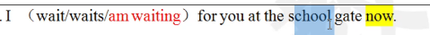

- 马上练习 教材P74第20题

  ```
  It is six o'clock in the morning.Many old people___in the park.
  A.are dancing
  B.dance
  C.is dancing
  D.dances
  词汇：people人们--复数
       person---a person
  ```

  答案

###### 考点二

- (会翻译)**瞬间动词 现在进行时表示将来****

- (瞬间动词：arrive到达，come来，go去，leave离开，reach到达)

- 例

  ```
  Mary is leaving next Friday.      Mary将会在下周五离开
  He is arriving in the afternoon.  他将会在下午到
  ```

###### 考点三

- 与**always,constantly,forever**等词连用，表示反复发生的动作或持续存在的状态，往往带有说话人的主观色彩。
- You are always changing your mind.你这个人怎么总是改主意！
- 现在进行时和一般现在时的区别：
  - He **is making** a telephone call to his teacher.
  - He often **makes** telephone calls to his teacher.
  - The writer **is writing** another novel these days.
  - The writer **writes** stories for children.

##### 过去进行时

- 定义：表示过去在某一时间段或某一段时间内正在发生或进行的动作或状态。
- 形式：was / were doing

###### 考点一

- 过去进行时的常用标志词：this time yesterday昨天的这个时刻,at that time在那时,    at 6  p.m.  yesterday, **from nine to ten last evening**昨晚从九点到十点 the whole morning(整个上午)，all day yesterday(昨天一整天)，等。

- 过去进行时=时刻点（进行）+过去词

- 一般过去时与过去进行时的用法区别：
  一般过去强调一次性的动作，过去进行强调持续的动作。
  Mary **wrote** a letter to her friend last night.写完信了.
  Mary **was** **writing** a letter to her friend **last night.**不一定写完。
  We **built** a bridge **last winter**.建成了。
  We **were building** a bridge **last winter**..一直在修，不涉及结果。

- 例

  ```
  1.Tom(sleeps/slept/will sleep/was sleeping)this time yesterday?
  2.I (am learning/was learning/learned/learns)at nine last night.
  ```

  答案

###### 考点二

- when当…时候

- 复习：when

  - 主将从现     能翻译成：将

  - 时态一致(从句 when+did一般过去时，主句was/were doing                       能翻译成：正在           两个动作同时发生)

    例：当我**回家**的时候，我的妈妈正在做饭呢。

    例：When I came home,my mother was cooking.

- 例

  ```
  1.The boy (does/ did/ was doing / is doing)his homework when his father came back from work.
  2.I will tell him the good news when he(gets/will get/got/get) here tomorrow
  ```

  答案

- 练一练

  ```
  When you___me last night,I ___ the piano.
  A.were calling;was playing
  B.were calling;played
  C.called;played
  D.called;was playing
  没有标志找选项
  ```

  答案

##### 将来进行时

- 定义：表示将来某个时刻或时间段正在进行的动作。

- 形式：will be doing

- 将来进行时=时刻点（进行）+将来词

- 例

  ```
  I (do)my homework this time tomorrow.
  ```

  答案

- 练一练

  ```
  He___basketball at 5p.m.tomorrow.
  A.is playing
  B.will play
  C.plays
  D.will be playing
  ```

  答案

##### 现在完成时

- 定义：现在完成时表示**过去发生**的动作**对现在造成的影响**或结果或表示**过去的动作**或**状态持续**到现在。

-  

- 例子

  ```
  1.我刚刚吃了个汉堡。一般过去时
  2.A:我们去吃个饭吧  B:我刚刚吃了个汉保。---现在完成时
  ```

- 形式：have / has done

- 

- 助动词：l.do(don't doesn't)  2.完成时中的  have has had

- 例子

  ```
  l.I have a book.have不是助动词，不是现在完成时-一般现在时(I don't have a book)
  2.I have finished reading this book. have是现在完成时中的助动词(I have not finished reading the book.
  ```

- 否定或疑问：情态动词  be--完成时中的have/has/had+not  前边三个都不是求助do(don't,doesn't)

###### 考点一

- 常见的时间词：lately最近，recently最近，already已经，yel然而，ever曾经，**for+时间段，**since自从+时间点，**up to now直到现在**，till now直到现在，so far直到现在，到目前为止，**in/over/during the last/past few years**在过去的几年间，over/during/through/throughout+时间段，次数(once,twice,数字+times)

  **注意：in the past  一般过去时**

- 总结：once考点

  1. once a week一周一次               一般现在时
  2. once  一次（我去过北京一次）现在完成时
  3. once 一旦(引导词+从句)           主将从现
  4. once 曾经                                 一般过去时

- 例：

  1.**In the past** this district was poor.
  2.**In the past few years** I have learned 3000 words.
  3.Tom(finished/finishes/**has finished**)the homework **up to now**.

- 练一练

  ```
  1.They__in Beijing for five years
  A.have lived
  B.lived
  C.live
  D.lives
  2.Our country__the sixth population census(人口普查)already
  A.finished
  B.has finished
  C.will finish
  D.finishes
  词汇：popular adj流行的  受欢迎的---popularity n流行普及度
  population n 人口
  ```

  答案

- 考点链接

  ```
  Great changes__in people's life over the past few years.
  A.take place
  B.are taking place
  C.took place
  D.have taken place
  词汇：change n v 改变 chance n机会   choose v选择-choice n选择
  take place=happen=occur发生（无进行无被动）
  ```

  答案

###### 考点二

- 主句（现在完成时）+since 引导词+从句（一般过去时）

- 例：We_have been_(be)friends **since** we_met _(meet)at first time.

- 练一练

  ```
  Jim__in Beijing since he__his college.
  A.worked;has finished
  B.has worked;has finished
  C.has worked;finished
  D.worked;finished
  ```

  答案

- 马上练习

  ```
  We came to England in 1995 and__here ever since.
  A.had lived
  B.have been lived
  C.have lived
  D.lived
  ```

  答案

- 被动：be+donc(缺一不可)

###### 考点三

- 考点三：固定句式 It is / It **has been**+一段时间+since从句（一般过去时）.…
  自从...以来，已经多长时间了。

- 例：

  It (has been/is/was/have been)tcn years since we (move/moved/have moved)to this beautiful counlry

  答案

###### 考点四

- It/This **is** the **first/second**(序数词) time+that**(现在完成时**) 第几次做某事

  It/This **was** the **first/second**(序数词) time+that**(过去完成时**)  第几次做某事

- 基数词one two three  序数词first sccond third

- 例：This is my first time that I (visited/have visited/visit/had visited)China

  ​		This was my first time that I (visited/have visited/visit/had visited)China

  

- 练一练

  ```\
  1.It is the first time that she__in public.
  A.has sung
  B.had sung
  C.have sung
  D.sang
  2.Is this the second time that you__to school?
  A.have been
  B.am
  C.was
  D.had been
  词汇：sing-sang-sung
  public 公开的公共的    private adj私人的私密的
  public school公立学校  private school私立学校
  in public在公共场合
  ```

  答案

   

###### 考点五

- It is+最高级+that+**现在完成时**

- 例：This is the best(worst，most interesting)film that I have seen.

  

- 马上练习

  ```
  It is the most instructive lecture that I__since I came to this school.
  A.attended
  B.had attended
  C.am attending
  D.have attended
  词：instruct v指导，说明--instruction n指导，说明书--instructor n教练，导师---instructive adj 有指导性的
  lecture n讲座
  allend  v出席参加
  ```

  

###### 考点六

- 常见的**瞬间动词**完成时(瞬间动词不能用在完成时中需要替换成形容词)

  1. die 死 瞬间动词== be dead(.adj)  He **has been dead for ten years.**
  2. start/begin 开始 瞬间动词 == be on (adj)  The film **has been on** for 20minutes.
  3. leave离开瞬间动词== be away from    I **have been away** from hometown for ten years.
  4. open 打开 瞬间动词==be open    The store **has been open** for 2 hours.
  5. join参加瞬间动词==be in  He **has been in** army for 2 years.
  6. buy买瞬间动词===have有  I **have had** the book for I week.
  7. borrow借进/lend借出 瞬间动词===keep保存   I **have kept** the book for I week.

- 判断

  1. He **has left** his hometown for ten years. 错
  2. He **has been away** from his hometown for ten years. 对
  3. The movie **has begun** for ten minutes.  错
  4. The movie **has been on** for ten minutes. 对
  5. 

- 练一练

  ```
  Tom's ' grandmother__since he was four years old
  A.died
  B.has died
  C.has been dead
  D.have been dead
  ```

  

##### 过去完成时

- 定义：它表示动作发生的时间是“**过去的过去**”。句中有明显的**过去参照**，**这种时态从来不孤立使用**。

- **过去完成时=句子本身过去词+过去的过去**

-   

- 例：

  1.他把书包落在学校了。一般过去时
  2.他刚刚说他把书包落在学校了。--过去完成时
  落书包（过去的过去-过去完成时）---说（过去）

  1.He lost(lose)his key.一般过去时
  2.He realized意识到 hat he_had lost_(lose)his key.--过去完成时
  lose丢（过去的过去）--realized(过去)

- 形式：had done

###### 考点一

- 考点一：在told,said,knev,heard,thought(过去式)等动词后的宾语从句中

- 例：She said that she __ (be) to Paris.

  

- 练一练

  ```
  He told me that he__his wallet in the restaurant.
  A.left
  B.lcaves
  C.has left
  D.had left
  ```

  

###### 考点二

- 状语从句中，在过去不同时间发生的两个动作中，发尘在前的用过去完成时，发生在后的用一般过去时。（when）

- 总结when考点：

  一，主将从现

  二，时态一致（如果when从句是一般过去时，主句可以是过去的任意时态（一般过去，过去将来，过去进行，过去完成)

  1. when+did,主句+过去进行时（翻译“正在”，两个动作同时发生）
  2. when+did,主句+过去完成时（翻译“已经”，两个动作有先后顺序-过去完成时在先，一般过去时在后)
  3. when+did,主句+过去将来时（找表示将来的时间词）
  4. when+did,主句+一般过去时（不符合前3条）

- 例：When the police arrived,the thieves__(run)away.

  

- 练一练

  ```
  Unluckily,when we arrived here,they__
  A.have left
  B.will leave
  C.were leaving
  D.had left
  词汇：luck n 运气好运--lucky adj(unlucky)--luckily adv(unluckily)
  adv=adj+ly
  ```

  

- 教材

  ```
  p74 35题
  The robber had escaped and was nowhere to be found when the police__
  A.arrive
  B.arrived
  C.have arrived
  D.had arrived
  p73 9题
  When she was in the city,she often__to this park
  A.had gone
  B.has gone
  C.went
  D.goes
  p74 17题
  She__someone when I came across her,so I nodded to her and went away.
  A.phoned
  B.had phoned
  C.was phoning
  D.has phoned
  词汇：come across偶遇
  nod v点头
  p75 37题
  When I met Mary.she said that she__for an interview the following day.
  A.would go
  B.has gone
  C.went
  D.had gone
  词汇：interview  vn面试 采访
  follow y跟着 follow one's advice 采用某人的建议
  p73 3题
  When he__the door,he found his keys were missing
  A.was opening
  B.opened
  C.had opened
  D.was to open
  ```

  

  

  

  

  

###### 考点三 

- **by / till /until(完成)**+过去时间，其动词形式用过去完成时。

  1. by(完成)+现在时间词=现在完成时
  2. by(完成)+过去时间词=过去完成时
  3. by(完成)+将来时间词=将米完成时
  4. by(完成)+一般现在时的句子(表将来)=将来完成时

- 例题

  1.There (were/have been/had been)25 parks in our city up till the year of 2000.
  2.By the end of last term,we (had finished/have finished/finished)the book

  答案

###### 考点四（重点）

- **hardly...when.  ,  scarcely...when..  ,  no sooner..than..**(注意：不是then)
  一...就...，主句用过去完成时，从句用一般过去时。

- 时态：前过完后过

- 倒装语序(疑问): 

  情态一be--完成时中have/has/had--前三个都没有求助do

  陈述句--------倒装句（疑问句）

  1. He **can** play basketball.---------**can** he play basketball
  2. He **is** a student.-----------**is** he a student
  3. He **has** finished the work.------**has** he finished the work
  4. He **had** finished the work.------**had** he finished the work
  5. He likes red.------**docs** he like(恢复原形)rcd

  **倒装：否定次放句首（主倒从不倒）**

- I had hardly finished my work when he came to see me.

  答案

- 答题技巧：

  1. 先看搭配
  2. 在看时态（前过完后过）
  3. 倒装（否定词放句首---主倒从不倒）

- 练一练

  ```
  1.No sooner__the beautiful bird flew out happily and fast,and threw itself onto the wall heavily.
  A.had the little boy opened the cage than
  B.the little boy opened the cage than
  C.had the little boy opened the cage when
  D.the little boy opened the cage when
  E.the little boy had opened the cage than
  2.(2010年第4题)__he realized it was time to go back home.
  A.No sooner it grew dark when
  B.Hardly it grew dark than
  C.Scarcely it grew dark than
  D.It was not until,dark that
  强调句：it is /was+被强调成分（名词、短语、从句）+that/who, It was Tom who broke the windows yesterday.
  [马上练习]教材P74第32题
  3.No sooner had she finished her specch than the students__
  checring.
  A.started
  B.have started
  C.start
  D.are to start
  词汇：cheer v欢呼 cheerful adj  cheer up振奋人心鼓励
  ```
  
  答案1.A  2.D 3.A

###### 考点五

- 表第几次做某事，主句用过去时，从句用过去完成时。
  固定句式（背诵）：

  It is the first/second time that+现在完成时 havc/has done
  It was the first/second time that+过去完成时had done

- 辨析题：

  ```
  1.It was the second time that she (had seen/have seen/has seen/saw)her grandfather.
  2.It is the second time that she (had seen/have seen/has seen/saw)her grandfather.
  ```

  

- 练一练

  ```
  1.It is the first time that I__such a complicated problem.
  A.met
  B.meet
  C.have met
  D.had met
  2.It was the first time that I__such a complicated problem.
  A.met
  B.meet
  C.have met
  D.had met
  词汇：complicated adj复杂的=complex
  ```

  答案 1.C 2.D

###### 考点六

- 动词：hope希望，expect期待，think认为，intend打算，mean意味着，want想，suppose认为，plan计划  用**过去完成时**，表示未实现。（翻译：本...）

- 马上练习

  ```
  I__Tom to be a mouse but found it a cat.
  A.didn't think
  B.was thinking
  C.had thought
  D.have thought
  ```

  答案 c

##### 将来完成时

- 定义：表示在将来某一时间以前已经完成的动作。（注意抓住时间的截止点）
- 形式：will have done

###### 考点一

- 考点：by/till/until-+时间==完成

  1. by(完成)+现在时间词=现在完成时
  2. by(完成)+过去时间词=过去完成时
  3. by(完成)+将来时间词=将来完成时
  4. by(完成)+一般现在时的句子(表将来)=将来完成时

  by March next year以及由by the time…,before或when等引导的副词从句。

- 例题

  ```
  By the end of next month.he__(travel)1000 miles on foot
  By next Tuesday,I__(get)ready for the exams.
  ```

  

- 真题

  ```
  1.(2021 2)By the time you get to the office.I__all the documents(文件) for the meeting.
  A.prepared
  B.was prepared
  C.was prepared
  D.will have prepared
  2.(2020年4题)The workers__the subway by next year.
  A.will have built
  B.are going to build
  C.will build
  D.are building
  3.(20l8年3题)By the time the course ends,__a lot about the British way of life.
  A.we'll have learned
  B.we'll learn
  C.we are learning
  D.we have learned
  4.(2016 44)By the end of next October.the factory__(produce)about 10,000 cellphones
  5.(20l5年3题)By the end of this year,they__a new program in Europe.
  A.had started
  B.start
  C.are starting
  D.will have started
  ```

  

  

  

  ****

##### 现在完成进行时

- 基本形式：have / has been doing

###### 考点一

- 考点一：表示动作从过去某时开始，一直延续到现在，常与all this time，this week，all night，this month，all the morning等时间状语连用。

- 

- 马上练习

  ```
  The manager__the workers how to improve the program all the morning.
  A.has told
  B.is telling
  C.has been telling
  D.will have told
  ```

### 被动语态

- 定义：主语和谓语动词之间是被动的关系。

- 形式：be+done(缺一不可)

- **by的考点 by+人=被动       by+时间=完成**

- 例子

  主动：I主语cat谓语an apple宾语
  被动：An apple is eaten by me
  主动：Students主语planted谓语trees宾语yesterday.
  被动：Trees were planted by students yesterday

一般现在时被动

- 形式：am/is/are done

- 例：Visitors__(request要求)not to touch碰the exhibits展览品(exhibition
  展览会).

  

一般过去时的被动

- 形式：Was/were done

- 例：

  ```
  1.I__(give)a nice gift by my mother yesterday\
  2.(2021 1)Last month four engineers to help solve the __technical problems.
  A.have sent
  B.sent
  C.were sent
  D.had sent
  scnd-scnt--scnt发送
  solve v解决--solution n解决方案
  ```

  

  

一般将来时的被动

- 形式：will be done

- 例：

  ```
  The meeting__(put)off if it rains tomorrow.
  词汇：put off,推迟 (put---put---put)
  ```

  

过去将来时的被动

- 形式：would be done

- 例：

  ```
  He said the news__(send)to the soldier's mother the next day.
  ```

  

快速推导出被动

- 现在进行时+被动

- =am/is/are **doing+be** done

- 加号前的单词不要只保留形式给后面的单词其他单词照抄

- =am/is/are being done

- 例子

  过去进行时+被动
  =was/were doing+be done
  =was/were being done

现在进行时的被动

- 形式：am/is/are being done

- 例：

  ```
  A new cinema__(build)here now.
  ```

  

过去进行时的被动

- 形式：was/were being done

- 例：

  ```
  The meeting__(hold)at 9 pm yesterday.
  hold v (hold--held--held)举行举办容纳握住
  ```

  

将来进行时的被动

- 形式：will be being done

- 例：

  ```
  The meeting__(hold)at 9 pm tomorrow.
  ```

  

现在完成时的被动

- 形式：have / has been done

- 例：

  ```
  All the tasks__(finish)so far.
  ```

  

过去完成时的被动

- 形式：has been done

- 例：

  ```
  By完成the end of last year,.another new gym__(build)in Beijing.
  ```

  

将来完成时的被动

- 形式：will have been done

- 例：

  ```
  The bridge__(build)by the time of next year.
  ```

  

##### 考点

1. 没有被动的词：h**appen发生，occur发生，take place发生，belong to属于，appear出现，come truc实现，break out(疾病，战争)爆发** 这个次出现只有主动没有被动

   - 例：

     ```
     The dictionary on the desk (belong to /belongs to/is belonged to)me.
     ```

     

2. 主动表被动：某些表示主语品质或特性的动词，**read读,write写,draw拉,sell卖,wear穿  等，常与well好，easily容易，smoothly顺滑流畅 连用**，用主动形式表示被动含义翻译“得，起来”---无被动

   - 例：

     ```
     1.The new pen (is written/ writes/ write)smoothly
     2.This kinds of shirts (sells /sell /are sold/ is sold)well.
     ```

     

     

3. 主动表被动（无被动）：感官动词(feel摸起来，look看起来，seem看起来，taste尝起来，smell闻起来，sound听起来)

   - 例：

     ```
     1.This sweater (feel/is felt/ feels)much softer than that one.
     2.The cake (is tasted/tastes/taste)better than that onc.
     ```

     

     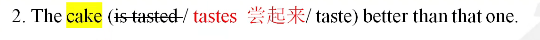

   - 练习

     ```
     I want to buy the coat made of that kind of cloth because__ I the cloth__very well
     A.have told;wore
     B.have been told;wears
     C.have been told;is worn
     D.have told;wears
     ```

     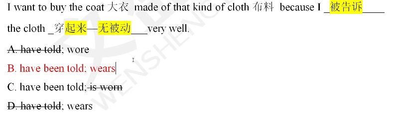

### 虚拟语气

- 虚拟语气（假的）-- 真实语气（真的）

  **if，主将从现（真实语气）  虚拟语气**

  真实：If it doesn't rain tomorrow,I will go shopping
  虚拟：If I were you,I would go shopping.

  总结：判断是否存在虚拟：1与已知事实相反 2将来不太可能

- 虚拟都是过去

- 虚拟表格

  |      | if从句                                     | 主句                                |
  | ---- | ------------------------------------------ | ----------------------------------- |
  | 过去 | had done                                   | would/could/might/should  have done |
  | 现在 | did(were)                                  | would/could/might/should  do        |
  | 将来 | 1.did(were)<br>2.should do<br>3.were to do | would/could/might/should  do        |

- 做题方法：

  1. 判断是不是虚拟
  2. 判断好主从句
  3. 判断对什么时候的虚拟

##### 考点一

1. 对过去进行虚拟（重点）

   例：

   ```
   1.If I (had helped/helped)him,he would have passed the final exam.
   ```

   

2. 对现在进行虚拟

   例：

   ```
   2.If I were you,I (would be/were/had been)quiet.
   ```

   

3. 对将来进行虚拟

   例：

   ```
   If he were to arrive here,I (would tell/will   tell/tell/told)him the fact at once.
   ```

   

- 练习判断时态（对什么时候的虚拟）

  ```
  1.If I hadhad lunch,I wouldn't have asked for something to eat.
  2.If I had lunch,I wouldn't ask for something to eat.
  3.Jerry would have been encouraged if Tom had been defeated.
  ```

  

- 练一练

  ```
  1.What should we do if it__tomorrow?.
  A.should snow
  B.would snow
  C.snow
  D.will snow.
  2.(2021年3题)If wem__more time,we could have visited more places.
  A.have
  B.had had
  C.have had
  D.could have
  3.(2020年46题)If I(be)__you.I would not ask such a silly question.
  4.(2017年78题)If you__that night,you might have been too late to get your ticket.
  A.didn't hurry
  B.hadn't hurried
  C.wouldn't have hurricd
  D.hadn't to hurry
  ```

  

  

  

  

##### 考点二

1. if主从句**混合时间**（虚拟语气：**有时间词优先看时间词**）

2. 例：

   ```
   If I had worked hard at school,I would have been a top student.
   If I had worked hard at school,I would be a top student now.
   ```

   

3. 练一练

   ```
   1.If you had followed the teacher's advice,you__the team leader now.
   A.are
   B.were
   C.would be
   D.would have been
   变式：If you had followed the teacher's advice,.you__the tcam lcader.
   A.are
   B.were
   C.would be
   D.would have been
   2.(2008年第47题)If you__(not watch)that late movic last night,you would not be so sleepy now.
   [马上练习]教材P102第4题
   If you had seen a doctor yesterday,you__what kind of disease you have got now.
   A.will know
   B.might know
   C.had known
   D.would have known
   ill adj生病的---illness n疾病
   assign v分配布置--assignment n
   注意如果主句从句都有时间词看空所在句子的时间词
   ```

   答案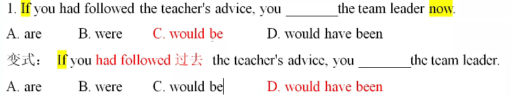

   

##### 考点三

1. if虚拟条件句中的“倒装”（难点）

   复习：

   - 1.否定词放句首--主倒从不倒
   - 2.虚拟语气：省略f(从句倒装) had,should,were提到主语之前

   判断 **如果be动词助动词情态动词提前没有问号就是省略if虚拟**

2. 练习

   ```
   原句：f he were my father,.he would get me out of the crazy prison.
   省略if:Were he my father,he would get me out of the crazy prison.
   注意：否定时，not放在原位，不要提前。
   例如：
   原句：if he hadn't had supper,he would be hungry now.
   正确：Had he not had supper,he would be hungry now.
   错误：Hadn't I had supper,he would be hungry now.
   ```

3. 例题

   做题方法：**还原if** 

   ```
   Had you followed the teacher's advice,you__the team leader.
   A.arc
   B.were
   C.would be
   D.would have been
   [考点链接]教材P95
   ___your letter,I would have written back two days ago.
   A.If I received
   B.Should I receive
   C.Had I reccived
   D.If I have reccived
   E.If I had rcccived
   F.If had I rcccived
   ```

   

   

##### 考点四

1. 含蓄虚拟:常见的标志性词语有：**with**(如果有；=if);**without**(如果没有；)        **but/but for**(要不是--如果没有；)；**or/otherwise**(否则--如果不那样；)；				**in case of**(万一；如果那样的话；)
   **与if表格主句考点一致：**

2. 例

   ```
   But for your kind-hearted help,we (couldn't have achieved/   had not achieved)our success.
   ```

   

3. 马上练习

   ```
   Without Chairman Mao.there__no new China in 1949
   A.had been
   B.would be
   C.would have been
   D.was
   [考点链接] 教材P101
   He is working with Tom right now;otherwise he__to the party.
   A.would have come
   B.would come
   C.came
   D.had come
   ```

   

   

##### 考点五

1. wish--虚拟语气（倒退一个时态）

   - 对过去的虚拟：had done	(过去完成时)	
   - 对现在的虚拟：did(were)    (一般过去时)
   - 对将来的虚拟：would do  （过去将来时）

   (固定搭配：wish to do)翻译：希望做某事

2. 例

   ```
   1.I wish it were a sunny day today.
   2.I wish she had visited her grandparents then.
   3.He wishes he would do better next time.
   4.He wished to do better next time.
   ```

   

3. 例题：

   做题思路：wish后面不是动词才能考虑虚拟语气

   ```
   「马上练习]教材P102 第9题
   I wish I__courage like him to fight with the thief that day.
   A.took
   B.could take
   C.should have taken 	
   D.had taken
   词汇：courage n 勇气--encourage v 鼓励
   ```

   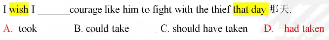

##### 考点六

1. if only (倒退一个时态的虚拟) 要是…该多好啊！

   - 对过去的虚拟：had done	(过去完成时)	
   - 对现在的虚拟：did(were)    (一般过去时)
   - 对将来的虚拟：would do  （过去将来时）

2. 例

   ```
   If only Tom__(have)breakfast yesterday!
   I wish that I__(be)there with them last month(上月)
   ```

   

3. 例题

   ```
   1.If only Mary__(give)me some help that day!
   2.If only Mary__(give)some help by me that day!
   3.教材P102第15题
   I had a big trouble.If only I__to my parents'advice then.
   A.listened
   B.had listened
   C.should listen
   D.would listen
   ```

   

##### 考点七

1. as if = as though好像  (倒退一个时态的虚拟)

   **先判断是不是虚拟（看实现的可能性）**

   **建议：当遇到as if之前是人的行为举止时，常用虚拟** 如He is

2. 例

   ```
   l.She looks as if she were sick.(虚拟语气---与现实事实相反)
   2.It seems as if our team is going to win(真实语气----实现可能性较大)
   ```

3. 例题

   ```
   [练一练]
   Black clouds are gathering in the sky and it looks as if it__.
   A.is going to rain
   B.was going to rain
   C.were going to rain
   D.would rain
   [马上练习]教材P102 第11题
   She looks at me in terror as if I __ the evil stepmother.
   A.was
   B.were
   C.have been
   D.would be
   词汇：terror n惊恐恐怖
   evil adi邪恶的
   stepmother n继母
   ```

   

   

##### 考点八

1. **would rather / had rather / would sooner** 宁愿，宁可； 要用“虚拟语气”。

   - **对过去进行虚拟：had done**

   - **对现在 / 将来进行虚拟：did(were)(重点)**

   - **固定搭配：** would rather do
                        would rather not do
                        would rather do A than do B    宁愿做A而不愿做B

     注意：would rather 只是例子上面 三个都可以

   - **总结**

     1. wish if only  as if=as though---倒退一个时态的虚拟
     2. would rather/had rather/would sooner---倒退一个时态的虚拟**（现在和将来合并）**

2. 例

   ```
   1.We would rather that the matter had not been made public yesterday.
   2.We would rather that you were the chairman now
   区分以下两个句子：
   1.I would rather you__(come)to see me off that day.
   2.I would rather__(die)than surrender to the enemy.
   come----came----come
   become---became---become
   surrender 投降
   enemy 敌人
   ```

   

3. 例题

   ```
   1.I'd rather you__right away.
   A.leave
   B.left
   C.will leave
   D.to leave
   2.(2020 41)Students would rather try once again than (give)__
   up the plan.
   3.教材P103 第21题
   I would sooner you__action to deal with this matter for the time being.
   A.don't take
   B.didn't take
   C.haven't taken
   D.hadn't taken
   ```

   

##### 考点九

1. for fear that / in case / lest以防；免得：

   用作虚拟语气时，表现形式为：+ (should) do   （should可以省略）

2. 例

   ```
   I made a circle around the city for fear that anyone (following/follows/followed/should follow)me
   ```

   

##### 考点十  

1. 英语中，若**advise建议(advisable),suggest建议(suggestion),demand要求，order命令，propose请求(proposal),ask命令，desire要求，request要求，insist坚持要求，require要求**，等表示“请求、要求、命令、建议等”动词后要用“虚拟语气**(should)do 。**

   - (should) do动词原形   (should可以省略)
   - 否定：should  not do   (should可以省略)
   - 被动：should be done  (should可以省略)

   注意：

   suggest

   - 建议---虚拟---(should)do    主语：人
   - 表明---不虚拟---时态一致   主语：物

   insist

   - 坚持要求（多个人）---虚拟---(should)do 

   - 坚持认为（一个人）---不虚拟---时态一致

     判断方法：要求别人，认为自己

2. 易错题辨析

   ```
   1.The teacher advises that Tom (make/makes)use of every minute at school.
   2.The teacher advises that Tom (don't make/doesn't make/not make)use of every minute at school.
   词汇：make use of利用
   make full use of充分利用
   1.He suggested that we (should finish/finished/finish/finishing) the work on time.
   2.His pale face suggested that he (should be/is/was)ill.
   pale adj 苍白的  white  白色  fair adj公平的 (unfair) 白皙的
   3.She insisted that she (should be/is/was)right
   4.She insisted that we (snould finish/finished/finish/finishing) the work first.
   ```

   

3. 例题

   ```
   l.(2020年2题)It is required that the students__the term paper tomorrow.
   A.finished
   B.finish
   C.will finish
   D.may finish
   2.(2019 3)It is requested that every student__a paper on environmental protection.
   A.writes
   B.wrote
   C.writing
   D.write
   词汇：paper n纸论文
   environment n环境---environmental adj
   protect v保护.--protection n
   3.(20l7年3题)Her parents insisted that she__until she finished her degree.
   A.stayed
   B.stays
   C.stay
   D.would stay
   7.Our teacher insists that we__as attentive as possible when we visit the museum.
   A.be
   B.would be
   C.shall be
   D.are
   词汇：attention n注意  pay attention to (doing) 关注 注意
   attentive adv专注的
   possible adv可能的-impossible adj不可能的
   nothing is impossible!一切皆有可能
   as+adi/adv原形+as possible尽可能
   8.Jane's pale face suggested that she__ill,and we suggested that she__a medical examination.
   A.be:should have
   B.was;have
   C.should be:had
   D.was;has
   词汇：medicine n药--medical adj医药的 医学的
   examine v检验 检查--examination n
   10.The law requires that some cars__at least once a year.
   A.should check
   B.are checked
   C.be checked
   D.check
   词汇：check v检查  at least至少
   ```

   

##### 考点十 一

1. **It is (high/about) time that + should(不可省) do / did**  是.的时候了

   注意辨析：It is the **first time** 完成 that+现在完成时  这是某人第几次做某事
                     It was the **first time**完成 that+过去完成时   这是某人第几次做某事

   **time:**

   - **有序数词(first)--完成**
   - **无序数词--虚拟(should do/did)**

2. 例子

   ```
   1.It is time that we__(leave)the poor island.
   2.It is high time that we__(go)to school.
   3.It is the third time that I__(visit)France this year.
   4.It was the third time that I__(visit)France this year.
   ```

   

3. 例题

   ```
   l.(2022年5题)I think it's high time you__some measures to solve the problem.
   A.take
   B.took
   C.takes
   D.taking
   词汇：measure n措施 方法 take measures to do sth采取措施做某事
   solve v 解决-solution n解决方案
   2.(20l8年7题)It is time we__computers to the production of iron and steel.
   A.will apply
   B.applied
   C.have applied
   D.would have applied
   虚拟：apply v申请应用--application n应用
   apply for申请
   apply to应用
   ```

   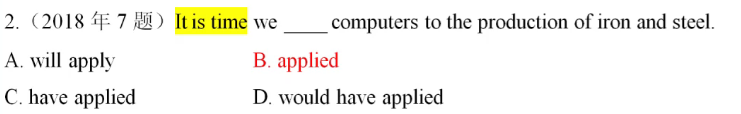

##### 考点十 二

1. It is **important 重要的 /  strange奇怪的 /  necessary必要的 /  essential必要的     /a pity 可惜**   that+(should)可省略  do

2. 例子

   ```
   It is very necessary that we_(should)learn_(learn)our lessons well first.
   ```

   

3. 例题

   ```
   It is very important that you__with Mr.William about this matter immediately.
   A.speak
   B.be spoken
   C.will speak
   D.to speak
   词汇：matter n事情 v有影响 起作用 重要
   [马上练习]教材P103  第22题
   It is important that the government__the policy for the benefit of its people.
   A.makes
   B.made
   C.make
   D.to make
   词汇：government n政府--governmental adj
   policy n政策
   benefit n v利益好处使…受益
   ```

   

##### 考点十 三

1. 情态动词的虚拟语气（情态动词+have done).

   复习情态动词：will/would,.can/could,.may/might,should,must,**need,dare(敢)**,shall(将)

   情态动词：

   - 情态动词+do:现在或将来

   - 情态动词+have done:过去

   - | could have done     | 本能做（却没做）                    |
     | ------------------- | ----------------------------------- |
     | couldn't have done  | 本不能做（却做了）                  |
     | might have done     | 本可以做（却没做）                  |
     | mightn't have done  | 本不可以做（却做了）                |
     | should have done    | 本应该做（却没做）                  |
     | shouldn't have done | 本不应该做（却做了）                |
     | would have done     | 本将要做（却没做）                  |
     | wouldn't have done  | 本不将要做（却做了）                |
     | need have done      | 本需要做（却没做）                  |
     | needn't have done   | 本不需要做（却做了）                |
     | **must have done**  | **一定做了某事<br/>(对过去的推测)** |

2. 例

   ```
   1.You must have finished your homework
   2.You must finish your homework.
   ```

   

3. 例题

   ```
   [马上练习]
   You__come earlier.The bus left a moment ago.
   A.would
   B.should have
   C.may
   D.have
   [考点链接]
   You__caught by the rain just now for you are all wet.[20l0年第9题]
   A.can't be
   B.must being
   C.must have been
   D.can't have
   ```

    

**总结**

1. if表格
2. 倒退一个时态的虚拟
3. should do

### 非谓语动词

1. 动词：

   - 谓语动词：1个（时态）
   - 非谓语动词：0个或多个

   **非谓语动词（主被动）**

   | doing            | 主动，现在         |
   | ---------------- | ------------------ |
   | done             | 被动，完成         |
   | being done       | 被动，进行         |
   | **to do**        | **主动，目的将来** |
   | to be done       | 被动，目的/将来    |
   | **having done**  | **主动，谓语之前** |
   | having been done | 被动，谓语之前     |

   **主动doing被动done,被动进行being done,目的将来to do/to be done,谓语之前带having**

   **总结：**

   - 1.一个简单句：一个谓语动词
   - 2.主句+引导词+从句：两个谓语动词
     主句+that从句+when从句：三个谓语动词
   - 连词：and并列多个谓语动词

2. 练一练：谓语和非谓语的识别（最好的判断方法就是看有没有时态）

   ```
   1.eating 
   2.eats
   3.have eaten
   4.having eaten
   5.to have eaten
   6.having been eaten
   ```

    答案

3. 找出下面句子的谓语动词

   ```
   1.Your employer holds your future prospect in his hands.
   2.If you have not been clear with his expectations,ask him for advice and accept criticism gracefully
   3.In short,getting along with your employer requires getting to know his likes and dislikes and
   learning to work with his personality and management.
   ```

   答案

**非谓语动词考点归纳：**

- 非谓语动词：除了谓语之外，可以充当所有成分（主语，定语，状语）

##### 一、非谓语动词作主语

###### 考点一

1. 动名词---ing 作主语（**主动doing, 被动being done**)

   **动词答题步骤：**

   - **判断谓语动词还是非谓语动词 （先找谓语）**
   - **非谓语动词的成分（主语 定语 状语）**
   - **主被动+时间词**

   前后一致

   ```
   __(lose)is learning  眼见为实
   __ (lose)is learning  失败是成功之母
   ```

   

2. 例

   ```
   Smoking is bad for your health
   Swimming is her favorite sport.
   Being polluted is the biggest problem that the earth has faced.
   词汇 pollute v污染----pollution污染
   ```

   

3. 例题

   ```
   __to the party was a great honor to Mr.White.
   A.Being invited
   B.Inviting
   C.Invited
   D.Invite
   词汇：invite v邀请--invitation n\
   [马上练习]教材P92 第22题
   __good care of these children is a demanding job like others.
   A.Take
   B.Taken
   C.Taking
   D.Being taken
   词汇：take care of=look after 照顾
   demand v要求 demanding adi高要求的，苛刻的
   ```

   

###### 考点二 

1. 非谓语作主语 --- to(主动 to do，被动  to be done)  （目的或将来）

   前后一致

   ```
   to see is learning  眼见为实
   to lose is learning  失败是成功之母
   ```

2. 例

   ```
   1.(To study /Studying)in the USA in the future has long been my dream
   ```

   

3. 例题

   ```
   __is easier than to do.[2010年10题]
   A.To say
   B.Saying
   C.To be saying
   D.Being said
   ```

   答案

###### 考点三

1. 固定句式：it is +adj +(for sb)+to do    (形式主语)

2. 例

   ```
   It is important to finish your homework.
   It takes/took sb time to do sth
   练一练：It took me only a few minutes to go to school.
   倒着考点：(This/That/It)took me only a few minutes to go to school.
   ```

   

3. 例题

   ```
   1.This science book__me a great amount of money.
   A.took B.cost
   C.paid
   D.spent
   2.They spend too much time__the report
   A.writing
   B.to write
   C.on writing
   D.write
   3.(2020年10题)It will__us two years to finish the training program.
   A.cost
   B.spend
   C.pay
   D.take
   ```

   

###### 考点四

1. 特殊情况：**It is no use  (no good,no fun,no point ,a waste of time)+doing。(易错)**

   **总结 it:**

   - 普通：it-to do
   - no系列，a waste of time--doing

2. 例

   ```
   It's no use (worry/worries/to worry/worrying)about something that hasn't happened yet
   ```

   

3. 例题

   ```
   (2018年6题)Is__necessary to take off our shoes when we enter the lab?
   everyone
   B.this
   C.here
   D.it
   (2017年49题)There is no use__(cry)after the milk spilt.
   马上练习1教材P93 第37题
   It is no use__all these old clothes.Let's give them to those in need.
   A.to keep
   B.kept
   C.keeping
   D.being kept
   ```

   

###### 考点五

1. 非谓语动词作主语，谓语动词用“单三”。(句首加ing 不加逗号)

2. 例

   ```
   Reading books in the sun (is/are)bad for your eyes
   Learning English(bring/brings)Chinese students much pressure.
   Refusing invitations(are/is)not always easy.
   ```

   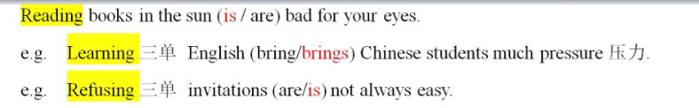

3. 例题

   ```
   (2022年1题)Writing stories and articles__what I enjoy most.
   A.were
   B.was
   C.are
   D.is
   ```

   

##### 二、非谓语动词作表语

- 实义动词（普通动词）+宾语

- 系动词(be,感官动词look hear)+表语

  ```
  I am 系动词 a student表语. 主系表
  I like 实义动词 red 宾语.  主谓宾
  ```

###### 考点一

1. 非谓语动词作表语，表**将来**的动作to do/to be done。

   - 复习：动词类

     1.判断是谓语还是非谓语

     2.非谓语动词的成分（主语 定语 状语)

     3.主被动+时间词

2. 例

   ```
   What I suggest is(doing/todo) it at once
   ```

   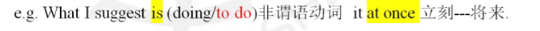

3. 例题

   ```
   The railway is__in about two months.[2016年6题]
   A.completed
   B.completing
   C.to complete
   D.to be completed.
   ```

   

###### 考点二

1. 前后一致

2. 例

   ```
   To see is to believe
   Seeing is believing.
   To lose is to learn.
   Losing is learning
   ```

###### 考点三

1. 如果主语是以aim 目标,hope希望 ,ide想法 ,plan计划 ,purpose目的,wish希望, 表语用to do / to be done。

   my形容词  wish（名词)
   wish动词--倒退一个时态的虚拟

   (看选项虚拟不给to do)

2. 例

   ```
   The purpose of the USA is (to punish punishing)Mexico.
   ```

   

###### 考点四

1. (重点) 非谓语动词作表语有两种情况：一种是ing作表语，一种是 ed作表语，这两者的区别经常考查。(人加ed   物ing )

   - interest   使…感兴趣
     interest**ing**   adj.**令人**感兴趣的
     interest**ed**    adj.**感到**感兴趣的                                              
   - please  V. 使…开心
     pleasing   adj.令人开心的
     pleased    adj.感到开心的
   - surprise  V使…惊讶
     surprising  adj.令人惊讶的
     surprised   adj.感到惊讶的

2. 例

   ```
   1.The dog is very __(excite)when it finds a delicious bone
   2.This news is very__(excite).
   3.Song Xiaobao is an__(interest)man.
   4.(2022年40题)Iam__(please)to inform you that you have won the first prize in the contest.
   ```

   

##### 三、动词接续方式

###### 考点一

1. 考点一、有些动词须接(to do),这种动词包括：**want想，tell告诉，decide决定，ask问，need需要，require要求，promise承诺，refuse拒绝，agree同意，wish希望，hope希望，expect期待，intend打算，plan计划，manage(manage to do设法做某事)，determine决定，attempt尝试，pretend假装，choose选择，offer提供，fail失败，deserve值得，demand要求，allow允许(allow sb to do),afford负担得起买得起，encourage鼓励，seem似乎，aim目的，happen(happen to do碰巧做某事)，warn警告，特殊疑问词(what when why where who how直接加动词一todo)**等。

   注意：
   1.否定形式： **not+ 非谓语**
   2.want/need/require+doing  主动表被动

   - 主动  want to do
     被动  want to be done=want doing:被动

     ```
     l.I need(to water/watering)the flower.
     2.The flower needs (to water/watering).
     ```

     

2. 例

   ```
   1.I hope to study in that school.
   2.They managed to finish all the tasks.
   3.I don't know how to do it.
   ```

   

3. 例题

   ```
   I don't know when you happen__the news,but I hope you can keep it secret.
   A.knowing
   B.to know
   C.known
   D.to be knowing
   The policeman warned the young man__after drinking
   A.not to drive
   B.to not drive
   C.not driving
   D.not drive
   ```

   

###### 考点二

1. 有些动词须接(doing),这种动词包括：**finish完成，enjoy喜欢享受，mind介意，suggest建议，practise练习，admit承认，appreciate喜欢欣赏感激，avoid避免，consider思考，delay推迟，deny否认，escape逃脱，excuse原谅，forbid禁止，forgive原谅，imagine想象，keep一直，mention提到，miss错过，permit允许，prevent阻止，risk冒险**。

2. 例

   ```
   1.She imagined walking into the office and handing in her resignation
   2.Do you mind passing me that dictionary?
   3.The manager doesn't permit giving advice in public.
   ```

   

3. 例题

   ```
   The elderly enjoy__the singing of the birds in the park.
   A.to listen
   B.listening to
   C.to listen to
   D.listening
   有介词优先选介词
   [马上练习]教材P93 第36题
   1.We can't think that we can still escape__even if we do something very bad.
   A.punished
   B.to be punished
   C.punishing
   D.being punished
   2.I would appreciate (get/to get/getting)some help from the president.
   3.They enjoy__(practise)__(read)English.
   ```

   

###### 考点三

1. 有些词组后面须接(doing)。这种词组包括：**be worth值得，look forward to期待，can't help忍不住，can't stand受不了，feel like想，goon(continue)继续，be busy忙于，**

   **所有介词(in,on,of,from,about,up,down,off)**

   **spend...(in)doing..  ,  succeed(in)doing sth 成功做某事，**

   **have+.....doing** (have problem (in)doing sth,have difficulties(in)doing sth,have trouble (in)doing sth,have a hard time (in)doing sth,have a good time (in)doing sth,have a great time(in) doing sth,have fun (in)doing sth)

   **waste time (in)doing sth=lose time (in)doing sth.**

2. 例

   ```
   l.He gave up smoking several months ago
   2.I am tired of doing the same thing all the time.
   ```

   

3. 例题

   ```
   Mr.Black gave up__as a bank clerk several years ago and he started a business later.
   A.to work
   B.working
   C.worked
   D.work
   This novel is really worth (read/ reading /to read)twice
   1.I think that the Great Wall is worth__hundreds of miles to visit..[2015年5题]
   A.to travel
   B.raveling
   C.traveled
   Dtravel
   2.I can't help__(think)about you.[2018年43题]
   3.All the workers are busy__(build)the temple for the king.
   4.Like most of my classmates.I have some difficulties
   __my second foreign language.[2014年4题]
   A.studying
   B.to study
   C.to be studying
   D.being studied
   ```

   

###### 考点四

1. to(介词)后面接doing(重点)

   **look forward to期待，object to反对，be/get/become used to doing习惯于（注意：be used to do被用来)，devote..to..献身投身于，contribute to贡献，pay attention to关注，when it comes to当提到，be accustomed to习惯于，stick to坚持，lead to导致，get down to着手做**

2. 例

   ```
   e.g.I am looking forward to having an interview as early as possible.
   ```

3. 例子

   ```
   As we all know,she has devoted her life to__the rights and dignity of women.
   A.defending
   B.defend
   C.defended
   D.have defended
   ```

   

###### 考点五

1. want /need/require to do主a动
   want /need /require doing被动-to be done

2. 例

   ```
   1.The flower needs to be watered/watering.
   2.The homework requires to be finished/ finishing.
   ```

   

3. 例题

   ```
   My TV set can't be turned on any more.It needs__something is wrong with it.
   A.to repair
   B.to repairing
   C.repaired
   D.repairing
   [马上练习]教材P93 第38题
   The library requires__and four students are asked to help do the work.
   A.cleaning
   B.be cleaned
   C.clean
   D.being cleaned
   ```

   

###### 考点六

1. 有些动词后面既可接doing,又可接todo,但是有区别，这些词包括下面几组：

   - 1.forget to do  忘记要去做某事  (没做)
     forget doing    忘记做过某事（实际做了）

     ```
     I forget returning 还 it your money.  还了
     I forget to return your money.  没还
     ```
     
   - 2.remember to do 记得要去做某事（没做）
     remember doing  记得做过某事（做了）

   - 3.stop to do     停下来去做另一件事（两件事）

     stop doing        停下来（一件事）

   - 4.go on to do  继续做另一件事
     go on doing  继续做同一件事

   - 5.continue to do   继续做另一件事
     continue doing   继续做同一件事

   - 6.mean to do.打算去做
     mean doing..意味着

   - 7.**only to do  却（意料之外）**
     only doing  自然而然的结果

2. 例

   ```
   The air conditioner was on all night because I forget__
   A.turning it off
   B.having turned it off
   C.to turn it off
   D.turn it off
   ```

   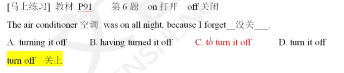

3. 例题

   ```
   2020年40题)I remember(see)__her last year at Mary's birthday party.
   I stop to learn我停下来去学习。
   I stop learning.我停下来学习（不学了）
   e.g.Missing the first bus means__(wait)for another one.
   e.g.They hurried to the railway station only__(find)the train had left already
   This kind of fish can eat animals in few minutes only
   __(leave)bones.
   ```

   

##### 四、非谓语动词作定语（重点）

- **主动doing被动done，被动进行being done,目的将来to do/to be done**
- 看时间词不能看谓语 如果没有进行现在将来时间词

###### 考点一

1. 定语：修饰名词   

   **一颗大**树         **一辆黄色的校**车 

   前置定语   a beautiful girl    后置定语Mary is the girl in the blue.

2. 例

   ```
   1.Experts__invite)for the next meeting about medicine are all from America
   2.Experts__invite)now are all from America.
   3.Experts__(invite)for last meeting about medicine are all from America.
   ```

   

3. 例题

   ```
   1.The meeting__(hold)next week is very important.
   2.The meeting__(hold)now is very important.
   3.The meeting__(hold)last week is very important.
   4.(2022年2题)Some of the experiments__in the book are easy to perform
   A.described
   B.being described
   C.to be described
   D.having been described
   5.(2021年6题)The proposal__at the meeting now is of great importance to our company
   A.being discussed
   B.to be discussing
   C.having discussing
   D.discussing
   (2019年45题)The goods(buy)__on the installment plan are usually goods that will
   last.
   (20l8年45题)I like to read the novel__(write)by Lu Xun.
   ```

   

###### 考点二

1. **不定代词**通常用**to do**作定语

   some    thing    前面一排的和后面的的随意组合就是不定代词
   any       body
   every    where
   no         one

   ```
   something    anything    everything    nothing
   somebody     anybody      everybody nobody  
   somewhere  anywhere  everywhere   nowhere
   someone anyone  evervone   none
   ```

2. 例

   ```
   1.We are very hungry,but there is nothing to eat now.
   来、去
   2.All the soldiers士兵need something
   g to eat.
   来、
   ```

   

###### 考点三

1. 非谓语在**序数词**、**最高级**或**the only**,**the right**后做定语，用**to  do**

2. 例

   ```
   1.He was the right person to do the job.
   2.There are so many things I have to do,and a 3 a.m.start is the only way __(achieve)everything.
   3.Jack is always the first one__(reach)school these days.
   ```

   

###### 考点四

1. 考试中高频的名词+todo的名词汇总：

   **wish希望；decision(decide)决定；intention(intend)目的打算；plan计划；promise承诺：attempt尝试；ability能力chance机会；opportunity机会；Way方式；effort努力；measure措施。**

2. 例

   ```
   e.g.1.I have an opportunity to speak in public.
   2.There is a chance to get (get)this job
   ```

###### 考点五

1. **doing**作定语（前置定语），一般表示被修饰的词的**用途和性能**。

   例如： swimming pool游泳池  reading material阅读材料   walking stick手杖
   washing machine洗衣机  a reading room阅读室

**作定语：非谓语一>定语主被动+时间词**
特殊情况：something to do,first/most/the only/the right to do,a **reading** room

##### 五、非谓语动词作状语（重点）

- 结构：__(do非谓语动词)...主+谓+宾          主+谓+宾__ **(do非谓语动词)...**
- 答题步骤：谓语还是非谓语--成分（状）---主被动+时间词 (翻译：**目的--为了**)

###### 考点一

1. 目的将来 to do / to be done

2. 例

   ```
   1.(Finishing/To finish)the task on schedule.we need to work overtime these days
   2.__(raise)his family,he has to work hard.
   3.__save the badly sick lady,the doctor had an operation on her.
   ```

   

###### 考点二

1. 主动doing 被动 done

2. 例

   ```
   I.__(move)by her words..the old man agreed谓语to her request,
   2.__(hear)the news,they set ou'for Shanghai
   3.(20l8年40题)We stood there,(wait)__for the bus.
   非谓语动词作状语翻译：必须加“为了”-to do to be done
   判断有没有将来含义：没有将来，同时发生（不要用o
   4.__(Impress)by the young man's good qualifications.they offered him a job in their firm
   「马上练习1教材P91第12题
   12.the road on the right.you'll find his house.
   A.Follow
   B.Following
   C.To follow
   D.Followed
   ```

   

###### 考点三

1. 谓语之前带having(主动having done  被动having been done)

   非谓语动词发生在谓语动词之前 谓语之前带having

   **1.翻译：明显的动作先后**
   **2.非谓语动词后有完成时的标志词**

2. 例

   ```
   1.__(finish)his speech,he answered our question.
   2.__(knock)down by a car,he spent a week in hospital.
   ```

   

3. 例题

   ```
   1.__(finish)their homework,the boys went to see a film.
   2.(2013年5题)__in the company for three years.Mark has become experienced in business
   negotiations.
   A.Having worked
   B.Have been working
   C.Have worked
   D.Worked
   「考点链接】教材P86
   __such heavy pollution already,the river is difficult to clean up.
   A.Having suffered
   B.Suffering
   C.To suffer
   D.Suffered
   [马上练习]教材P93第47题
   47.__by the teacher,the students didn't make such mistakes any more.
   A.Having warned
   B.Having been warned
   C.To be warned
   D.being warned
   ```

   

总结：非谓语

1. 非谓语动词作主语(ing  to)

   1.主动doing被动being done    2.目的将来to do to be done

2. 非谓语动词作定语（修饰名词）：

   主动doing被动done,被动进行being done,目的将来to do/to be done

3. 非谓语动词作状语：(__do.,句子     句子，do__)

   主动doing被动done,目的将来to do/to be done,

   **谓语之前带having(找完成时标志词)**

**复习：非谓语动词**

1. 既可以+to do,又可以+doing

   forget  / sremember : to  do(没做)   doing(做了)
   stop : doing(停下来正在做的)   to do(停下来去做另一件事)
   only : to do(意想不到的结果)  doing(自然而然的结果)

2. 非谓语动词作定语（修饰名词）

   **主动doing 被动done**,被动进行being done,目的将来to do/to be done

3. 非谓语动词作状语  (非谓语...，句子    句子，非谓语..…)

   **主动doing 被动done**  ,目的将来to do/to be done (翻译：为了)                                 谓语之前带having（完成时的标志词：for+时间段，already）

**动词答题步骤：**

- 判断谓语还是**非谓语**--非谓语成分（主定状）--先主被动+再时间词

##### 六、非谓语动词的其他考点

###### 考点一

- 特殊疑问词 +to do

  (who,what,which哪个which one,when,where,how如何 怎样，why)+to do

  区分what how:

  - to do有宾语--how
  - to do没有宾语--what

- 例

  ```
  When(starting/started/to start)has not been decided.
  (What/How)to do it has not been decided.
  (What/How)to do has not been decided.
  ```

  

- 例题

  ```
  She didn't know__to express her ideas in English clearly in public.[2013 10]
  A.which
  B.why
  C.what
  D.how
  ```

  

###### 考点二

- 感官动词：feel感觉摸起来，taste尝，watch看，listen to听，notice注意到，**see**
  **看，**look at看，**hear听**等。（考试就靠see 和 hear）

  **see sb （to省略） do sth  看见某人做某事（主动）**
  **see sb doing sth  看见某人正在做某事（主动）**
  **see sb done 看见某人被.…（被动）**

  **be seen to do sth**(重点)

  注意：感官动词变被动时，to要还原回来。

  see sb **do** sth---------be seen to do sth

- 例

  ```
  1.I saw the poor girl (falling/fall)into the river yesterday.
  2.The poor girl was seen (fall/falling/to fall)into the river yesterday.
  3.Back from his work,he was happy to see his mother__well.
  A.take care of
  B.taking care of
  C.takes care of
  D.taken care of
  ```

  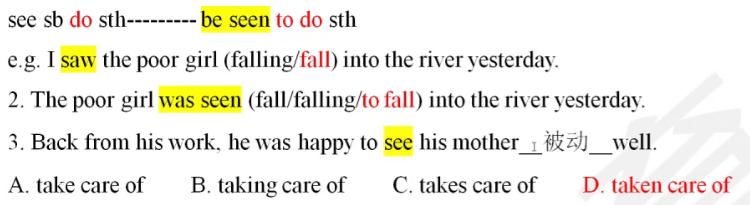

- 例题

  ```
  (2007年8题)She was never heard__so wonderfully before.
  A.singing
  B.sing
  C.to sing
  D.sung
  [马上练习]教材P92第13题
  The poor boy was seen__from his bike in front of his friends.
  A.fell
  B.to fall
  C.falling
  D.fallen
  ```

###### 考点三

- 使役动词（使，让）：make ,let ,have等。

  1. let+宾语+do  让。。做（主动）
     let+宾语+be done让。。被做（被动）

     Let's  go！

  2. have sb do sth让某人做某事 （主动）
     **have sth done让某事被（别人）做**（被动）记这个就行蒙这个

  3. make+宾语+do让。。做（主动）
     make+宾语+done  让。。被做（被动） 

     被动：be made **to do** (to还原)

- 例

  ```
  Don't let your child play with matches.
  Let the work be done immediately.工作要马上去做。
  1.I will have you take in charge of the company.
  2.Mr.Smith had his house broken into while he was away on holiday.
  3.判断句子含义
  I cut my hair..我剪头发了。（我自己剪的）
  I have my hair cut (done).  我剪头发了。（别人剪的）
  1.He make his workers work 12 hours a day.
  2.He tried to make himself understood.
  3.I am made (go/to go)to bed early everyday by my mum.
  ```

  

- 例题

  ```
  [马上练习]教材P91
  第10题
  He lets everyone_that he is a qualified engineer.
  A.realize
  B.to realize
  C.realizing
  D.realized
  (2017 7)Miss Jennifer is going to the photographer's__
  A.to have her photograph take
  B.to have her photograph taking
  C.to have her photograph taken
  D.to have taken her photograph
  ```

  

###### 考点四

- help sb (to)do sth 帮助某人做某事

- 辨析：
  **can't help** doing  忍不住做...
  can't help (to)do 不能帮助...

  I can't help you(to)do your homework我不能帮你写作业

  Ican't help doing my homework.我忍不住做我的作业。

###### 考点五

- but...     结构中，若but前有do的任何形式(does did done),后面无to (do):若but前无do的任何形式，后面有to(to do)。 （原型）

  总结：**but（除了）:前有do后无to **  前无do后有to （原型）

- 例

  ```
  e.g.Last night,I did nothing but (watching/to watch/watch)TV.
  ```

  

- 例题

  ```
  Jack could do nothing but__to his mother that he was wrong and he shouldn't have argued with
  her.
  A.admitting
  B.admits
  C.admit
  D.to admit
  ```

  

###### 考点六

- 五个搭配考点

  **had better** do最好做.../had better not do最好别做..('d better do)
  **would rather** do A than do B   宁愿做A而不愿做B
  **prefer** to do A rather than do B 更喜欢做A而不喜欢做B
  **prefer** doing A to doing B  更喜欢做A而不喜欢做B

- 例题

  ```
  prefer to stay at home rather than__on National Day.[2007年6题]
  A.travel
  B.traveled
  C.to travel
  D.traveling
  ```

  

###### 考点七

- too......to do太…而不能，enough+to do足够的

- 例题

  ```
  I have enough money (buy to buy buying)the book.
  [马上练习]教材P92  第21题
  When they met again,they were too excited__a word.
  A.saying
  B.not to say
  C.not saying
  D.to say
  ```

  

###### 考点八

- be+said据说/thought据认为/reported据报道/believed据相信/supposed据认为 +to do

- 例题

  ```
  Mrs Smith is said to _finish_(finish)her education at Harvard University four years ago.
  ```

###### 考点九

- 独立主格

  谓语/非谓语--非谓语成分--主被动+时间词

- 例题

  ```
  1.The tour guide导游_非谓语_(lead)the way,we had谓语no trouble getting out of the forest.
  2.Their living conditions greatly __(improve),the workers worked harder
  3.With the bike__(steal).she had to walk home.
  [考点链接]教材P90
  With all your energies__the study of French,you will master the language soon.
  A.concentrated
  B.concentrating
  C.concentrated on
  D.concentrating on
  [马上练习]教材P93 第42题
  The woman walked to me.with a handbag__in her left hand and a lovely dog__ behind.
  A.held:following
  B.hold:followed
  C.to hold:to follow
  D.to be held:followed
  ```

  

**总结非谓语动词：**

- 谓语/非谓语---非谓语成分（主 定 状)---先**主被动**+再时间词

- 非谓语动词作主语(--ing,to--)

  普通--ing:主动doing 被动being done
  将来目的to-:主动to do被动to be done

- 非谓语动词作定语（修饰名词）--**时间词**

  主动doing被动done,被动进行being done,目的将来to do/to be done

- 非谓语动词作状语（非谓语..，句子   句子，非谓语.……)

  主动doing被动done,目的将来todo/to be done(翻译：为了)，谓语之前带 having (找完成时的标志词)

- it形式主语

  普通：it+to do
  特殊：no系列，a waste of time+doing

- ing令人 ed感到 (exciting 令人兴奋的   excited 感到兴奋的)

- 只能+doing(enjoy,finish....)

- 只能+to do(wish.plan..)

- 短语+doing(look forward to,devote to,.be worth...)。

- 既可以+to do,又可以加doing(forget/remember  stop   only)

- 感官动词   使役动词

- 固定搭配(too to do,enough to do..)

### 定语从句

- 定语从句：修饰名词的句子

  I bought a cow 先行词 **which 关系词 is black and white.**定语从句

- 先行词：被定语从句修饰的名词(cow)

- 关系词：引导定语从句，指代先行词 (which)

- ```
  1.Tom is a lovely cat先行词 which关系词fights with Jerry alway's
  2.Mr.Trump先行词，who关系词was born in June 1.4,I946,is the45 th president
  ```

  

- 定语从句分类：限定性定语从句    非限定性定语从句（带逗号）

- 关系词（核心）：

  关系代词（作成分）：**that,which,who,whom,whose**,as
  关系副词（不作成分）：when,where,why

- 划分定语从句方法：

  1. V1——**(关系词)——V2...句末** 

  2. ——**(关系词)——V1...**V2...   第二个谓语动词之前

     加粗部分是定义从句

- 例题

  ```
  1.Yangyang is a rising star who/that enjoys enormous popularity in China.
  2.This is a marvelous invention which/that has changed the world.
  3.The noodles which/that I cooked were delicious.
  4.The girl who/whom we met yesterday is Lily.
  5.This is the child whose parents are doctors.
  6.I like the movie whose name is The Fast and The Furious.
  ```

  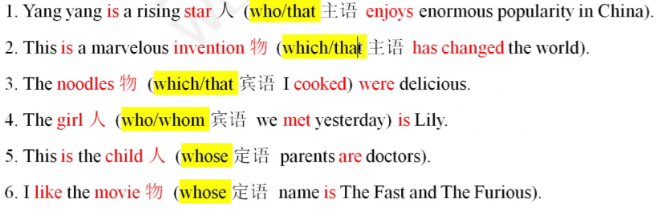

- 总结关系代词：

  that:      人/物，主语/宾语

  which:    物，主语/宾语

  who:       人，主语/宾语

  whom：  人，宾语

  whose:  **后名**翻译“**的**”  (人/物，定语)
  注意：只要关系代词**作宾语**，都可以省略。

- 定语从句答题步骤：一划二找三判断

  一划：划定语从句

  二找：找先行词

  三判断：**判断从句是否缺成分**  （缺：关系代词   不缺：关系副词)

- 练一练

  ```
  1.The eggs__were in the basket were not fresh.
  2.The friend__came to supper last night wasn't hungry.
  3.He is the man__you have been waiting for.
  4.He saw a house__windows were all broken.
  ```

  

##### 考点一

- 只能用that的情况(6种情况)：

  1. 先行词是不定代词， something,anything,everything,much,few,none,all等，只能用that。

     ```
     There should be something__you want to tell me now.
     In China,parents always do everything__they can to raise their children.
     A.which
     B.what
     C.that
     D.who
     ```

     

  2. 当先行词有最高级(-est most)或者序数词(first  last next)时只能用that

     ```
     This is the most interesting movie __I have seen this year.
     This is the third book__I have finished this year.
     ```

     

  3. 先行词被the only唯一，the very正是，the right正确的修饰时只能用That。

     ```
     「练一练]教材P109 6题
     Shanghai is the very__place both the Chinese and foreigners are eager to visit.
     A.where
     B.in which
     C.that
     D.whose
     ```

     

  4. 先行词是人和物时只能用hat。

     ```
     They are talking about the people and the thing __they can remember.
     ```

     

  5. 由which,.who,whom引起的问句中，为了避免重复、常用that

     ```
     Who is the man that you talked with just now?
     ```

     

  6. 当关系代词在从句中作表语时（系动词：be、感官动词   系动词之后是表语)

     ```
     Mary is no longer the girl__ she used to be.
     China is no longer the country__it used to be.
     A.where
     B.which
     C.that
     D.whose
     ```

     

##### 考点二

- 不能用that的情况(2种)

  1. 引导非限定性定语从句时，不用that(逗号后不that)
     定语从句：限定性定语从句     非限定性定语从句（带逗号）

     ```
     Football,__is a popular game,is played all over the world
     [练一练]教材P110 22题
     The building,__was completed in 1856,was famous for its huge marble staircases.
     A.that
     B.which
     C.what
     D.when
     ```

     

  2. 介词后不用that(注意：介词后也不能用who)  

     介词：in on of for from up with without about

     总结：介词+which(物)   介词+whom(人)

     ```
     The tool with__he is working is called a hammer.
     He failed in the exam,__made his father angry.(找先行词)
     ```

     

- 马上练习 (一划二找三判断（判断定语从句是否缺成分）

  ```
  1.he gift comes from my friend,__is a president in a joint venture.
  A.which
  B.that
  C.whom
  D.who
  2.Last winter we visited the Forbidden City,__Beijing is famous.
  A.for which
  B.for that
  C.in which
  D.what
  3.Tom won the first prize in the competition__surprised everyone of the family
  A.who
  B.that
  C.which
  D.whom
  ```

  

##### 考点三

1. 如何判断选择的是关系代词or关系副词

   - 关系代词（缺成分）：**who(人，主/宾)，whom(人,宾)  which(物，主/宾)，that(人/物，主/宾)**， whose后名翻译的，as(固定搭配)解题不用
   - 关系副词（不缺成分）：when,where,why
   - 

2. 例题

   ```
   1.We all prefer the boy__is always polite and modest
   2.He doesn't like the country (who/which/whose)citizens are impolite.
   3.I will forget the days (which/when/who/that)when you made such a great success.
   4.I will never forget the days (when/who/whom/that)we spent together.
   5.Yesterday we went to visit the house__the great writer used to live.
   A.who
   B.whcrc
   C.which
   D.whosc
   Yesterday we went to visit the house __the great writer used to live in
   A.who
   B.whcrc
   C.which
   D.whosc
   介词后一定缺宾语
   ```

   

3. 及物动词/不及物动词

   - 及物动词：直接加宾语 love cat have

   - 不及物动词：不能直接加宾语listen,livc,stay,talk,go,work
     (不及物动词+介词+宾语)listen to music  live in China
     stay at home talk to/with you go to school wait不及物动词

   - 总结：
     及物动词：如果没有宾语--缺宾语
     不及物动词：如果没有宾语-不缺宾语

   - ```
     1.This is__the factory工厂 I like
     2.This is the factory__I worked.
     3.This is the factory__I worked in.
     4.This is the factory in __I worked.
     关系副词=介词+关系代词(which物/whom人)
     教材P110 14题
     The factory__he hadrworked for twenty years was closed for poor management.
     A.that
     B.which
     C.where
     D.why
     1.(2019 2)You'll find taxis waiting at the hotcl front gatc__you can hire to rcach the airport.
     A.which
     B.where
     C.what
     D.as
     2.(2018年1题)The village__my grandfather grew up in is not far from the town.
     A.what
     B.where
     C.wherever
     D.which
     [考点链接] 教材P107
     The time__irst met my boyfriend was a very difficult period of my life.
     A.where
     B.why
     C.which
     D.when
     ```

     

##### 考点四

1. 被动语态(be done)永远不需要宾语，所以不缺宾语

2. 例

   ```
   1.October Ist is the day (when/which/that)new China was founded
   2.Do you know the year__the Chinese Communist Party was founded?
   A.which
   B.that
   C.whcn
   D.on which
   on+具体的某一天：几号星期
   in+不具体的时间：年份，月份，季节，早 中 晚
   at+时刻点--进行时
   ```

   

##### 考点五

1. as的固定搭配：正如  像

   - **as we all know / as it is known to all众所周知**
   - **as far as I know据我所知**
   - **as we all can see 正如我们看到的那样**
   - **as we expect期待  /see/think/suppose认为正如我们所**
   - **as is often the case 正如经常的情况那样**
   - 加粗的加逗号
   - the same..as..和一样
   - such...as... 和…一样
   - as...as... 和…一样
   - so..as.. 和…一样

2. 例题

   ```
   [练一练 教材P110 18题
   __is often the case,a perfect building is the combination of collective wisdom and skills
   A.That
   B.It
   C.What
   D.As
   [马上练习]
   1.He is good at English,__we all know
   A.that
   B.as
   C.whom
   D.what
   2.I want to usc the same dictionary__was used yesterday
   A.which
   B.who
   C.what
   D.as
   ```

   

##### 考点六

1. whose的用法（后名翻译的）

   - **whose+n**=the+n+of+whom/which
   - the girl whose book=the girl the book of whom
     the room whose door=the room the door of which

2. 例题

   ```
   e.g.The girl (who/whose)father is a doctor studies hard.
   ```

   

##### 考点七

1. 如何选择介词

   - 关系副词=介词+关系代词

   - 情况1：根据**从句中的动词与先行词**的（逻辑）关系。翻译

     ```
     1.The engineer (in/on/with)whom my father works is an American.
     2.This is the magazine__I copied the paragraph.
     A.that
     B.for which
     C.from that
     D.from which
     ```

     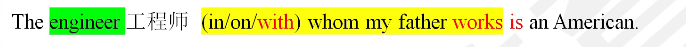

   - 情况2：根据定语从句中v.与adj.的搭配习惯。

     ```
     Last summer we visited the West Lake.__Hangzhou is famous in the world.
     A.for which
     B.for that
     C.in which
     D.what
     be famous for因…而著名
     be famous as+职业/名称作为…而出名
     「考点链接]教材107
     He talked about a hero__no one had ever heard,whether in everyday life or in the history book
     A.of whom
     B.from whom
     C.about that
     D.of that
     hear from 收到某人的米信
     hcar of听说
     ```

     

##### 考点八

1. 区别以下两种结构（背诵）

   - one+of+**复数名词**+who/which/that+谓语（非单三）
   - the **only /right /very** one+ of +复数名词+who / which / that+谓语（单三）

   1. one of+复数名词+定语从句（谓语）
   2. the very/only/right one of+复数名词+定语从句（谓语）
   3. one of+复数名词(…之一 单数)+谓语动词

2. 例题

   ```
   1.She is one of the students who_praised at the meeting yesterday.
   A.was
   B.were
   C.is
   D.are
   2.He is the only one of the students who_a winner of scholarship for three years.
   A.is
   B.are
   C.have been
   D.has been
   Mulan is one of the best films__left a deep impression on me.
   A.which has
   B.which have
   C.that have
   D.that has
   ```

   

##### 考点九

1. 特殊的先行词： the way(.的方式)

   - 正式语体中用**in which(首选)**，非正式语体可用that(次选)或省略（最后选）。
   - in which >  that > 省略

2. 例

   ```
   I didn't like the way in which he spoke.
   ```

##### 考点十

1. 插入语：I think (删去，放在句子中间)
2. 定语从句：all of+关系词，some of+关系词，none of+关系词

##### **总结**

1. 修饰名词（先行词）

2. 关系词

   - 关系代词（缺）：which,that,who,whom解题不用：hose后名翻译的as固定搭配
   - 关系副词（不缺）：when where why
   - 关系副词=介词+关系代词（指物which/指人whom）
   - 及物动词：如果没有宾语---缺宾语  
   - 不及物动词：如果没有宾语--不缺宾语
   - 被动语态：不缺宾语

3. 只that(something-.最高级/序数词-the very,the only-人and物)

4. 不that(逗号后，介词后介词后还不能who介词+which/whom)

5. 答题步骤：一划二找三判断

   V1**——V2句末**     **—— V1..**V2

6. one of+复数名词+定语从句（谓语）
   the only/very/right one of+复数名词+定语从句（谓语）

7. as的固定搭配

8. the way:in which>that>省略

9. 只要定语从句缺宾语，关系词都可以省略

10. 及物动词：如果没有宾语--缺宾语

11. 不及物动词：如果没有宾语--不缺宾语（不及物动词+介词+宾语）
    **介词一定缺宾语**

12. 被动语态 (be done)不缺宾语

**蒙题**

- **有whose先看后名翻译的可以直接蒙whose**  **有关系词的没有关系词的正确没有关系词缺宾语正确** （关系词就是that等）**不定代词(everything,all,few,序数词，最高级，人and物，被the only唯一，the very正是，the right正确，all)只that**    the way 只加 in which >  that > 省略
- 和…一样：same as,such as,so.…as,as..as 固定的
- as we 动词 固定搭配
- 句子首就As

### 名词性从句

1. 包括：宾语从句，表语从句，主语从句，同位语从句

   - 1.主语从句识别：

     **What he wants to tell us 主语从句** is not clear.

     A is not clear

     It is important that we should work hard.

     it形式主语is important that we should work hard真正主语一主语从句.

     **总结识别+划分**
     **1.谓语动词之前（句首）**
     **2.it形式主语**

   - 2.宾语从句识别：

     He thinks **that we should do it at once**宾语从句.

     It depends on **how you do it**宾语从句.

     He has told me宾语**that he will go to Shanghai tomorrow**宾语从句.

     双宾语：tell sb sth   give sb sth   ask sb sth
     I tell you宾语a secret宾语
     I give you宾语a book宾语

     总结识别
     1.动词后
     2.介词后
     3.双宾语(tell sb sth)

   - 3.表语从句识别：

     总结识别：系动词之后系动词(be、感官动词)

     The fact is **that we have lost the game**表语从句

   识别下列从句类型：

   ```
   1.What he wants to tell us is not clear.
   2.We must never think that we are good in everything
   3.He has told me that he will go to Shanghai tomorrow.
   4.That is why he didn't come to the meeting.
   ```

   

2. 总结

   - 定语从句：前名词
   - 名词性从句：主从宾从表从同位语从句
     - 主从：谓语之前  it形式主语
     - 宾从：动词后，介词后，双宾语(sb之后)
     - 表从：系动词之后

##### 考点一

1. 名词性从句引导词

   - (主从，宾从，表从)

   - 缺成份：who(人，主/宾)，whom(人，宾)，what(物，主/宾)

   - 不缺成份(6个)：that(无词义)，whether/if(是否)，how(如何，怎样)，when(什么时候) ， where(在哪里)，why(为什么)

   - +ever:无论，不管
     whoever无论是谁，whomever无论是谁，whatever无论什么，however无论如何，whenever无论何时，wherever无论在哪

   - 从句答题步骤：

     分析是什么从句

     - 定语从句一划二找三判断

       缺成分：关系代词-who,whom,that,which,whose,as

       不缺成分：关系副词-when,where,why

     - 名词性从句一划三判断

       缺成份：who(人，主/宾)，whom(人，宾)，what(物，主/宾)    名词性从句what=which+n

       不缺成份(6个一翻译)：that(无词义)，whether/if(是否)，how(如何，怎样)，when(什么时候)，where(在哪里)，why(为什么)

     - 定语从句：不用what
       名词性从句：不用单独的which

2. 例题

   - 一、what 指物，作主语/宾语

     ```
     1__caused the accident remains unknown.
     A.What
     B.That
     C.Why
     D.When
     2.The scissors are__I need.
     A.what
     B.that
     C.why
     D.when
     3.The book will show you__the best CEO should know.
     A.what
     B.that
     C.why
     D.when
     「考点链接]教材P119
     __impresses me most about his painting is the colors he uses.
     A.What
     B.That
     C.Which
     D.Who
     ```

     

   - who 指人，作主语/宾语=======whom指人，作宾语

     ```
     e.g.1.Do you know__has won Red Alert game?
     A.what
     B.that
     C.who
     D.when
     2.__will be our teacher hasn't been decided yet
     A.What
     B.That
     C.Who
     D.When
     3.The problem is__can replace her.
     A.what
     B.that
     C.who
     D.when
     ```

     

   - that不作成分，没有含义（宾语从句可省，主语从句和表语从句不可省）

     ```
     1.__he finished writing the composition in such a short time surprised us all.
     A.What
     B.That
     C.Why
     D.When
     2.His suggestion is__we should stay calm.
     A.what
     B.that
     C.who
     D.when
     3.He told me__he would go to college the next year.
     A.what
     B.that
     C.who
     D.when
     4.(2022年3题)__the international conference on climate change next year is certain
     A.He will attend
     B.He attends
     C.That he will attend
     D.As he attends
     ```

     

   - whether/if不作成分，翻译成“是否”(同时存在选whether)

     不确定性(don't know,ask,want to know,problem,uncertain不确定的，unknown未知的 or)

     1. if不能引导主语从句和表语从句

     2. if不能与or not连用 (whether....or not 是否)

     3. 介词后不用if

        ```
        1.The problem is__we can carry out the plan.
        A.what
        B.that
        C.if
        D.whether
        2.__we will go for an outing tomorrow remains unknown.
        A.What
        B.That
        C.Ir
        D.Whether
        3.I don't know__there will be a bus any more.
        A.what
        B.that
        C.if
        D.why
        I asked the woman at the booking office __ I could have two tickets.
        A.which
        B.if
        C.that
        D.what
        ```

        

   - how 不作成分，翻译成“怎么、如何表方式

     ```
     Could you please tell me how you use the new phone宾语从句？
     ```

     

   - when,where,why 不作成分，表时间、地点、原因\

     ```
     1.He didn't tell me when we should meet each other again.
     2.None of us knows where we can buy books.
     3.The question is why he cried yesterday.
     ```

   - 定语从句和名词性从句引导词对比表格

     |          | 定语从句                     | 名词性从句（主从 宾从 表从）                                 |
     | -------- | ---------------------------- | ------------------------------------------------------------ |
     | 缺成分   | who,whom,that,which,whose,as | 人：Who、whom物：what                                        |
     | 不缺成分 | when,where,why               | 1.that(无词义)<br/>2.whether/if(是否)<br/>3.how(如何，怎样)<br/>4.when<br/>5.where<br/>6.why |

##### 考点二

1. 宾语从句的语序为陈述句语序：

   陈述句：情态动词，be动词，完成时中的have/has/had--放在主语之后主语之前没有助动词do/does/did

2. 判断正误：

   ```
   c.g.Please tell me宾语when will you come back.
   e.g.Please tell me when you will come back.
   ```

   

3. 例题

   ```
   Everybody won't know___
   A.what time the war begin
   B.what time does the war begin
   C.what time the war began
   D.what time will the war begin
   ```

   

##### 考点三

1. 宾从：时态一致

   主现从不限(主句一般现在时：从句不受限制)
   主过从必过(主句一般过去时：从句可以是过去的任意时态)
   真理永一现

2. 例

   ```
   1.He says that he__(go)to school tomorrow.
   2.He said that he__(go)to school the next day.
   3.He said that the earth__(be)round.
   ```

   

##### 考点四

1. 名词性从句中what与hat的区别

   若从句中缺少主语或宾语，用what:
   若从句不缺主语或宾语，用that。

2. 例

   ```
   1.__(that/what)he likes makes me surprised
   2.__(that/what)he likes eating frogs makes me surprised.
   ```

   

##### 考点五

1. 主语从句（一个句子.单三）做主语，谓语动词加s。(注意：what特殊)

   (注意：what引导的主语从句需要往后看单复数)

2. 例

   ```
   e.g.When we shall hold our sports meeting is not decided.
   e.g.What we need is time.
   e.g.What we need are good doctors.
   ```

   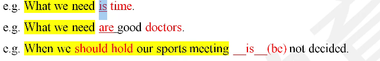

##### 考点六

1. 主语从句用it做形式主语，放在句首，把整个主语从句部分放在句尾。

   复习：主语从句判断
   1.谓语之前（句首）
   2.il形式主语

2. 例

   ```
   原句：That he likes to sing at night alone makes us annoyed.
   改句：It makes us annoyed that he likes to sing at night alone.
   ```

   

3. 例题

   ```
   __is reported in the newspapers that the talks between the two companies have not made any progress.[2015年6题]
   A.That
   B.What
   C.It 
   D.As
   ```

   

##### 考点七

1. 同位语从句

   - 空前是名词：优先判断定语从句——一划二找三判断(如果不缺：关系副词)
   - 但是先行词：时间、地点、原因一都不是一定语从句不行--**是同位语从句--that**

2. ```
   They were happy to hear the news__(which/that)he won the first prize.
   ```

   

3. 例题

   - n.的重点词：news新闻消息，order命令，notice通知，information信息（不代表就是需要进行分析可以不用记）

     ```
     1.Dad made a promise__(which/that)he would buy me a CD player.
     2.Dad made a pr omise__(which/that)excited all his children
     3.The news__(which/that)our team has won the final match is encouraging
     4.The news__(which/that)you told us is really encouraging
     (2021年8题)The news__the Chinese women's football team had won the match excited all of us.
     A.that
     B.which
     C.what
     D.as
     ```

     

##### 总结

1. 主从、宾从、表从
   缺：what who whom
   不缺(6个)：that,whether/if,how when,where,why
2. 同位语从句：按照定语从句分析一定语从句走不通-在判断同位语从句-that
3. 总结从句可以省略引导词的情况：
   - 1.定语从句省略引导词：缺宾语
   - 2.宾语从句省略hat(不缺成分、没有词义)
   - **it形式主语言蒙that**
   - **it形式主语/形式宾语：1.todo2.hat(不一定)**

总结

1. 名词性从句（主从宾从表从同位语从句）
   主从宾从表从： 一划三判断
   缺：who whom what
   不缺：that(无词义)，whether/if(是否)，how(如何怎样)，when,where,why
2. 同位语从句：前名词--优先定语从句（一划二找三判断）-不缺（关系副词when where why)-先行词不是时间不是地点不是原因--不是定语从句--同位语从句 that
3. 宾语从句：陈述句语序(can,be,完成have/has/had,助动词do/does/did放在主语后边)
   宾语从句时态：主现从不限，主过从必过，真理永一现

### 状语从句

1. 状语从句9大类：时间状语从句，地点状语从句，原因状语从句，目的状语从句，结果状语从句，条件状语从句，方式状语从句，比较状语从句，让步状语从句
2. 状语从句核心考点
   - (1)准确掌握每个引导词的含义
   - (2)注意时态的问题，即：时态一致

##### 时间状语从句

1. 时间状语从句，常见的引导词包括：when当…时，while当…时，as当…时，after之后，before之前，as soon as一…就，the minute一…就，since自从，till/until直到，by the time到…为止等。时间状语从句中，当主句是一般将来时，从句用一般现在时（即：**主将从现**)，同时要注意“**时态一致**”。

###### 考点一

1. when的主将从现

2. 例题

   ```
   1.I__(will tell/tell)you when the vice-president (will arrive/arrives)this afternoon.
   2.When Jack__(grow)up,he'll be a doctor and cure a large number of paticnts.
   ```

   

###### 考点二

1. 主句过去进行时过去完成时过去将来时/一般过去时（时态一致）

   - 1.when十did,主句过去进行时--翻译“正在”
   - 2.when+did,主句过去完成时--翻译“己经”
   - 3.when+did,主句过去将来时-找将来时间词
   - 4.when+did,主句一般过去时--排除法

2. 例

   ```
   1.When the teacher came into the classroom,we__(read)English.
   2.When I reached the station,the train__(leave).
   3.--Did you see Jack last week?
   --No.When I heard his news.he__abroad.
   A.goes
   B.went
   C.has gone
   D.had gone
   ```

   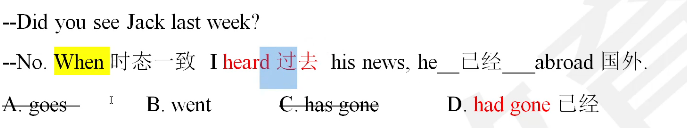

###### 考点三

1. 非谓语

   -  when to do结构一将来
   - when doing结构一主动
   - when done结构--被动

2. 例  

   - 特殊疑问词+to do”when/what/how/who/where to do

     ```
     1.__(When/which)to set off next morning has not been known.
     ```

     

   - (2)when doing-主动  when done一被动

     ```
     e.g.When__(cross)the street,you should be careful
     e.g.When__(hit)by a car,the man lost his consciousness.
     ```

     

###### 考点四

1. 区别while/during在期间，当…时

   while+句子
   during+名词短语（非句子）

2. 例

   ```
   1.__(During/While)summer holiday,I did a lot of interesting work
   2.__(During/While)I was in Beijing,I did a lot of interesting work
   1.I went to visit the Great Wall (during/while)the holiday
   2.I went to visit the Great Wall (during/while)my staying in Beijing for summer vacation.
   ```

   

###### 考点五

1. while引导从句“当…时”，从句通常用进行（现在进行时or过去进行时）”，
   主、从句**时态一致**。

   总结when、while当…时
   1.when+did,主句+过去进行时
   2.while+过去进行，主句+一般过去时

2. 例

   ```
   c.g.He visited a lot of places while he was traveling
   e.g.He visits a lot of places while he is traveling
   ```

   

3. 例题

   ```
   I__in the street__someone called me.
   A.walking:while
   B.was walking;while
   C.walking:when
   D.was walking:when
   ```

   

###### 考点六

1. since(自从)主句现在完成时，从句一般过去时

   **主句：现在完成时+since(从句 一般过去时)**

2. 例

   ```
   e.g. I__(teach) in that university since I__(graduate) many years ago.
   ```

   

###### 考点七

1. until/till直到（时态：生将从现，时态一致）

   not until..直到..才..（注意中文含义）： 重点是翻译---not(不翻译)：

2. 例题

   ```
   1.Xiaoming will not go home ntil he__(finish)the task at school
   [练一练教材P116 1题
   2.I did not know the answer to the question__ my classmate told me.
   A.until
   B.after
   C.as soon as
   D.if
   如果有not 选until
   ```

   

###### 考点八

1. by+时间—— 完成   by+人 ——被动

   1.by(完成)+现在时间词=现在完成时
   2.by(完成)+过去时间词=过去完成时
   3.by(完成)+将来时间词=将来完成时
   4.by(完成)+一般现在时的句子（表将来）=将来完成时

2. 例题

   ```
   1.By the time you come here,I(will have finished/have finished)this work.
   2.By the time you get there this afternoon,the film__
   A.is to start
   B.is starting
   C.will start
   D.will have started
   ```

   

###### 考点九

1. no sooner...than.../ hardly..when./scarcely..when.一…就.（重点)

   hardly/scarcely...when

   no sooner...than....

   - 1.时态：**前过完后过**

     I had **hardly** finished my work **when** he came to see me.

   - 2.倒装：**否定词放句首、主倒从不倒**

     **Hardly**(had I finished/I had finished)my work **when** he came to see me.

   - 总结
     hardly/scarcely(had done的中间).when..
     no sooner...than....
     1.搭配
     2.时态(前过完后过)
     3.倒装（否定词放句首--主倒从不倒）

2. 例题

   ```
   1.No sooner__the beautiful bird flew out happily and fast,and threw itself onto the wall heavily.
   A.had the little boy opened the cage than
   B.the little boy opened the cage than
   C.had the little boy opened the cage when
   D.the little boy opened the cage when
   E.did the little boy open the cage than
   ```

   

复习：状语从句

1. 引导词含义2
2. 时态（时态一致）
   时间状语从句（主将从现、时态一致）：
   when
   while(进行)
   not....until 直到.才
   **by+时间===完成**
3. by(完成)+一般现在时的句子（表将来）=将来完成时
   主句+现在完成时+since从句+一般过去时 一…就
   **hardly/scarcely....when**
   **no sooner...than**
   1.搭配
   2.时态（前过完后过）
   3.倒装（否定词放句首--主倒从不倒）

###### 考点十

1. as soon as 一..就

   主将从现，时态一致

2. 例题

   ```
   He will come and see you as soon as he can.
   He rushed home as soon as he got the good news.
   「练一练] 教材117 19题
   Larry will help with the housework__he comes back from work.
   A.since
   B.while
   C.as soon as
   D.before
   ```

   

##### 条件状语从句

1.  条件状语从句：主将从现  时态一致

2. 引导词：**if如果**（考点：虚拟语气（过去）主将从现)，**unless**=if...not.如果不/如果没有/
   除非，**as long as只要**，**in case以防**，provided that(假设)，on condition that(只要)

3. 例题

   ```
   e.g.We can't get there on time (if/in case/unless/as long as)we book the carliest llight to Shanghai.
   [马上练习]
   1.You will be late__you leave immediately.
   A.unless
   B.until
   C.if
   D.or
   2.You will catch cold__put on more clothes.
   A.if you
   B.if you will not
   C.unless you
   D.until you
   教材P117第28题
   We have no right to accuse him__there is enough evidence to prove that he cheated in the exam
   A.as though
   B.as soon as
   C.in case
   D.unless
   ```

   

##### 地点状语从句

1. 能看懂即可

2. 例题

   ```
   e.g.Put the medicine (when/where)you can easily get it.
   e.g.He follows the girl (whatever/wherever)she goes.
   「练一练]教材P116 3题
   After you finish cycling,be sure to place the bike it ___used to be.
   A.the moment
   B.where
   C.when
   D.though
   ```

   

##### 原因状语从句

1. 引导词通常包括：
   **because**因为，**since**(自从，因为，既然)，**as**(当…时，因为)，for(**因为一不能放在句首**)，**now that**(因为，既然)，considering that(考虑到)，seeing that(考虑到)。
   考点：了解引导词的中文含义。

2. 例题

   ```
   e.g.(Now that/though)all airlines offer discount prices,we could choose any one of them.
   [考点链接]教材P113
   I gave up buying this video game,__I didn't have enough money.
   A.though
   B.because
   C.unless
   D.even if
   [练一练]教材P117第24题
   I didn't need to send the book to Tom.__I'll see him tomorrow.
   A.though
   B.unless
   C.for
   D.when
   ```

   

##### 结果状语从句

1. 引导词：so that.,such that.…,如此…以至于…

   考点：

   - so、such....that搭配；

   - so+adj/adv , such+n

     so early,such a beautiful **girl**, so beautiful a girl  冠词一道墙

     such a useful **book**,**so useful** a book

2. 例题

   ```
   1.The flight scheduled(计划)(such/so/very)early that nobody wanted to look on(考虑)it.
   2.It was (such/so/very)an early flight that nobody wanted to look on it.
   Father was__busy in working__he often forgot rest or meals
   A.very,that
   B.so.that
   C.such,as 
   D.enough,as
   ```

   

##### 目的状语从句

1. 引导词：**so that**为了/以便于，**in order that**为了

   so that / in order that十从句（从句常使用情态动词）

   (扩展：为了 so as to+动词原形；为了 in order to+动词原形）

   为了：
   1.so that/in order that+句子（有谓语动词）
   2.so as to/in order to +do

2. 例

   ```
   School was closed early (so that/so as to)the children might go home ahead of the storm
   ```

   

3. 例题

   ```
   p113 You'd better take the map with you__you can't get lost.
   A.after
   B.as soon as
   C.though
   D.so that
   [练一练]教材P116 6题
   we might see the sunrise,we set out for the mountain early.
   A.Now that
   B.As if
   C.Even if
   D.In order that
   教材P117 第17题
   He set out early he might arrive at the railway station on time.
   A.so that
   B.in that
   C.in order to
   D.for fear that
   ```

   

##### 让步状语从句

1. 引导词：**though** = **although**虽然  尽管、as

###### 考点一

1. though、although不与but连用，但是可以与yet、still连用。

2. 例

   ```
   e.g.Although he is rich,but he is not happy.(错)
   e.g.Although he is rich,yet he is not happy.(对)
   ```

###### 考点二

1. **as尽管**，引导让步状语从句时，**句子要倒装** -- 从句最后一个单词提前。

   从句最后一组单词提前（提前的单词是~~a/an/the~~+名词）。

   没有倒装不能翻译成尽管

2. 例

   ```
   e.g.Busy as he is,he finishes the task.
   e.g.Young girl as she is,she knows a lot.
   辨析：as he is busy;busy as he is
   冠词提前一定错
   ```

   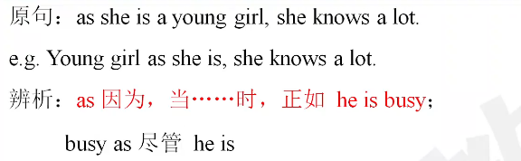

3. 例题

   ```
   练习：翻译句子
   1.As we entered the classroom,we saw our teacher standing on the platform
   2.As a student,we should work harder to get a better grade.
   3.As we all know,Beijing is the capital city of China.
   4.He got up early as he must catch the first bus.
   [马上练习]教材117页8题
   Unhealthy__he was,he persisted in doing the dangerous experiment.
   A.although
   B.unless
   C.as
   D.in case
   空前多一个单词选as
   ```

   

###### 考点三

1. even if=even though即使

2. 例题

   ```
   [考点链接]教材P116
   Tom has a good figure__he doesn't get much exercise.
   A.in order that
   B.even though
   C.now that
   D.as long as
   [马上练习] 教1材116页 5题
   __the forest park is far away,there're still a lot of tourists who visit it every year.
   A.As
   B.When
   C.Even though
   D.In case
   ```

   

###### 考点四

1. whether...or not不管

   whether A or B
   whether or not

2. 例题

   ```
   e.g.(If/Whether)you believe it or not,it is true.
   [马上练习]教材117页16题
   __we're successful or not,we must make sure that we have tried our best.
   A.When
   B.If
   C.Whether
   D.However
   看见Whether就选Whether
   ```

   

###### 考点五

1. **no matter**+"特殊疑问词"="特殊疑问词v十后缀"**ever**"。

   特殊疑问词：what,where,when,who,whom,how

   扩展+ever:无论不管

   - no matter what= whatever
   - no matter who= whoever
   - no matter when= whenever
   - no matter where =wherever
   - no matter which =whichever
   - no matter how =however

   注意：no matter不能引导名词性从句（主从宾从表从）。

   ```
   e.g.1.No matter what you say is of no use now.	
   e.g.2.Whatever you say is of no use now.
   e.g.3.Prisoners have to eat no matter what you are given.
   e.g.4.Prisoners have to eat whatever you are given.
   ```

   **总结：whatever>no matter what**

   **同时出现选带ever**

2. 例题

   ```
   [马上练习]教材P117第10题
   __dictionary you want to buy,I will be willing to pay for it.
   A.Wherever
   B.Whenever
   C.However
   D.Whichever
   ```

   

###### 考点六

1. while

   - 当…时+**进行**
   - 然而（句中）
   - 尽管

2. 例

   ```
   1.While I have sympathy for you,I can't help you.
   2.You like black while I like white.
   3.While I was watching TV,he was doing his homework.
   ```

   

3. 例题

   ```
   ___the employees finished the project on time,the manager was still unsatisfied.
   A.When
   B.Before
   C.Since
   D.While
   ```

   

##### 比较状语从句

###### 考点一

1. as+adj ./adv. 原级+ as.   和.一样

2. 例

   ```
   e.g.Jack is as(smarter/smartest/smart)as Tom.
   ```

   

###### 考点二

1. not as原as=not so原as  和..不一样（不如)

   as原as    肯定句、否定句
   so原as    只能放在否定句

   补充：as soon as possible 尽快 ;  as early as possible 尽早

2. 例

   ```
   e.g.She is not as (more outgoing/most outgoing/outgoing)as her brother.
   [马上练习]
   She doesn't speak.__her friend,but her written work is excellent.
   A.as well as
   B.so often as
   C.so much as
   D.as good as
   形修名
   副修动
   He is a__student.
   He plays basketball__
   ```

   

###### 考点三

1. 比较级+than

2. 例题

   ```
   e.g.This book is (instuctiver/most instructive/more instructive)than that one.
   句子辨析：
   e.g.The juice of girls is more than that of boys.
   e.g.The apples of girls are more than those of boys.
   The weather in Hainan is hotter than(that/those/these/this/it)in Beijing.
   The cars made in Germany are more expensive than (that/those/these/this/it)in Japan.
   ```

   

###### 考点四

1. the+最高级+**in / among**(即：范围)（三者及以上）

   between (两者)之间
   among (三者及以上)之间

2. 例

   ```
   This book is the (most interesting/more interesting/interesting)of the three
   ```

   

###### 考点五

1. the+比较级..（从)，he+比较级..（主）越.越..  主将从现

   比较-最高

   - 普通：比+er  最高+est 
   - 结尾e+ r,st
   - 辅-元-辅：双写尾字母+er est  hot-hotter---hottest
   - 辅+y: y变i+er est
   - er ow:  直接加er est
     clever---cleverer---cleverest slow-slower-slowest
   - 多音节：more  most

2. 例

   ```
   e.g.The better you do the__(happy)you will be.
   ```

   

###### 考点六

1. not+比较级=最高级（识别中文含义即可）

2. 例

   ```
   Ican't meet a better boss..最好的老板
   e.g.I can't agree with you more..我非常同意你的想法
   e.g.I can't love you more.我非常爱你
   ```

##### 方式状语从句

1. 方式状语从句常用的引导词包括：as,as if,as though

###### 考点一

1. as和.一样，好像

2. 例

   ```
   e.g.Do in Rome (if/as)the Romans do
   ```

   

###### 考点二

1. as if=as though好像           even if=even though即使

2. 例

   ```
   They entered the house (as if/even if)they were the host of this house.
   ```

   

**总结**

1. 引导词含义

1. 时态：时态一致

   - 时间状语从句（主将从现时态一致）：when,while+进行 since,by+时间=完成

   - 条件状语从句（主将从现时态一致）：if(虚拟语气)，unless如果不/除非，as long as只要，in case以防i

   - 地点状语从句 翻译

   - 原因状语从句：because因为，since(自从，因为)，for(因为，不能放在句首)，now that既然因为  just now时间词  刚刚 一般过去时

   - 结果状语从句：so..that..…such..that如此…以至于  

     so+adj/adv   such+n

### 主谓一致

1. 主谓一致定义：主语的单复数与谓语动词的单复数一致。

##### 考点一

1. **doing / to do**（**非谓语动词**-单数第三人称）做主语，**谓语动词用+s**

   **句子做主语（主语从句-单数第三人称）**，**谓语动词用单三**。

2. 例

   ```
   Reading books is (be)good
   e.g.Flying in the sky (is /are)great.
   e.g.Whether Biden will pay a visit to China (have/ has)not been known yet.
   ```

   

3. 例题

   ```
   【2022年第1题】
   Writing stories and articles__what I enjoy most.
   A.were
   B.was
   C.are
   D.is
   ```

   

##### 考点二

1. “并列结构”做主语

   A and B  复数
   both A and B  (both两者都)复数
   the A and the B  两个一复数
   the A and B  一个--单数

   注意：a knife刀 and fork叉 一个一单数

2. 例

   ```
   the singer and the dancer  歌手和舞者 两个一复数
   the singer and dancer  一个人具有两种身份 一个一单数
   the teacher and the writer 两个人
   the teacher and writer 一个人
   ```

3. 例题

   ```
   [练一练]
   1.Tom and Jerry (is are)from America
   2.Both Tom and Jerry (is are)from America
   3.The president and the vice-president (has/have)arrived already.
   4.The president and vice-president (has have)arrived already
   [马上练习]教材P133 33题
   The singer and dancer__going to give us a performance tonight.
   A.are
   B.is
   C.were
   D.has
   be going to do将要
   ```

   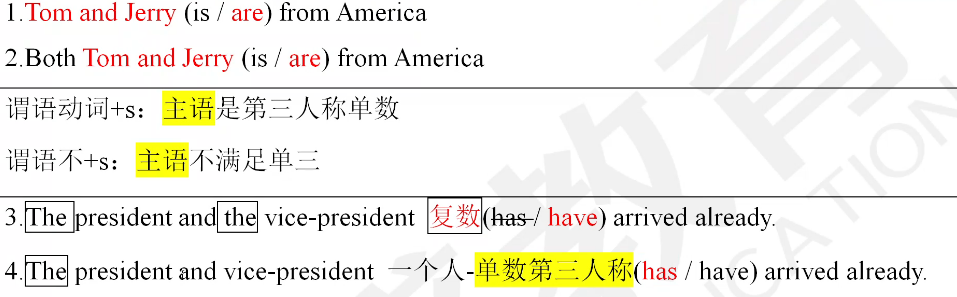

##### 考点三

1. 就近原则(1一个句型，2两个单词，3三个短语)

   - **there be**某处有
   - **or**或者，**nor**不
   - **not(only)...but(also)...** 不但…而且
     **either.…or..**  或者…或者…（两者之一）
     **neither..nor.** 既不…也不…（两者都不)

2. 例

   ```
   1.There (are/is)a pen,a knife and some books on the desk
   2.There (are is)some books,a pen and a knife on the desk
   3.Not only Jerry but also her friends (hates /hate)Tom
   4.Not only friends but also Jerry (hates /hate)Tom.
   5.Either she or you (are /is)going to get the chance.
   6.Either you or she (are /is)going to get the chance.
   [马上练习]教材P13322题
   Neither Tom nor his colleagues__that the director is going to resign.
   A.knows
   B.know
   C.have been known
   D.knew
   ```

   

##### 考点四

1. **with和，together with和，as well as和，without没有，Iike 像，unlike不像，except除了（不包含），besides除了（包含），but除了，no less than不少于**时，就远原则。**只要是 a 和 b 不是就近原则就是就远原则**

2. 例

   ```
   e.g.1.The teacher together with some students (are /is)enjoying the movie Transformers 5.
   e.g.2.He as well as I (want/ wants)to pay a visit to Harvard University.
   [马上练习]教材P13212题
   A library together with two primary schools,__to this region as a gift
   A.donates
   B.have donated
   C.are donated
   D.has been donated
   ```

   

##### 考点五

1. 表示**金钱，时间，距离**的作主语时，表示整体概念，**单数**

2. 例

   ```
   e.g.Twenty dollars (is/are)enough for my lunch.
   e.g.Three years (is/are)a long time for me.
   e.g.Six miles is a short distance距离.
   [马上练习]教材P132 1题
   Ten thousand dollars__ a lot of money for the family in the remote village.
   A.are
   B.is
   C.were
   D.be
   remote control遥控器
   ```

   

##### 考点六

1. each每个，every每个，any任意一个，every A and every B-单数

   只要看到each every  any 就是单数

   特殊注意：
   **We** each have an English-Chinese dictionary. (we是主语，决定谓语动词)

2. 例题

   ```
   e.g.Each of the children in this class (have has)a new bag.
   e.g.Each boy (were was)awarded last week.
   [马上练习]教材P132 6题
   Every student and every teacher __the meeting about how to build a better campus.
   A.are going to attend
   B.have attended
   C.has attended
   D.is attended
   [考点链接] [2016,2]
   She recommended two books to me,but__ of them was interesting.
   A.either
   B.both
   C.none
   D.neither
   辨析：
   both(两者)都        all(大于等于三)都
   neither(两者)都不   none(大于等于三)都不
   either两者之一
   ```

   

##### 考点七

1. 这样的集体名词包括：
   **family家，team队，group组，club俱乐部**，public公众，
   audience观众，crew船员，crowd群体，**class班级**，company公司，committee社区，**population人口等**。

   1.整体---单数，个体--复数

   例题
   
   ```
   1.His family (are is)not large
   2.His family (are is)all friendly to me.
   [马上练习] 教材P133 25题
   Mr.Smith's family,which___quite a large one.
   __all very fond of their old house.
   A.was:was
   B.was;were
   C.are;is
   D.is;are
   马上练习] 教材P133 32题
   What__the population of this country?
   -I don't know,but one-third of the population__workers here.
   A.is;are
   B.are:are
   C.is:is
   D.are;is
   分数表达法：上基下序  one-third
   one-fifth  五分之一
   two fifths 五分之二
   ```
   
   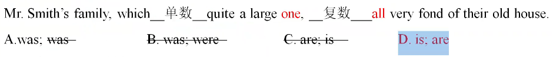
   
2. 集合名词：people:人们，police警察们，cattle牛（总称）**永远表示复数。**

   例题

   ```
   Police (are is)all around here.
   people (are/is)watching TV programme in the living room.
   ```

   

3. many a+**名词单数**，more than one+**名词单数**，**表示单数**

   more+**复数名词**+than one,**表示复数**

   例题

   ```
   Many a person (have has)a smart mobile phone.
   More than one person (are /is)involved in this case.
   More visitors than one (has /have)complained about the service here.
   ```

   

4. 短语辨析（重点）

   - a number of+名词复数：许多   (复数)
   - the number of+名词复数：…数量（数字） (单数)

   例

   ```
   Anumber of students (is/ are)from America
   The number of students (is/ are)not known
   ```

   

   例题

   ```
   [考点链接]教材P128
   As is mentioned above,the number of the students in high school___
   A.is increasing
   B.are increasing
   C.increase
   D.have increased
   ```

   

5. **分数/百分数**+**of**+**名词**”结构作主语时，谓语动词要与of后面的**名词一致。**

   百分数：数字+percent(one percent)
   分数：上基下序（基大于等于2，序+s) 五分之一：one fifth  五分之二：two fifths

   rest/remaining（剩余） of+名词

   特殊：
   分数/百分数+of+population(人口)（整体）人口--单数 / 个体（人）--复数

   点：point  （1.5 one point five）

   例题

   ```
   Two thirds of the food (have /has)been sent to that sea.
   Eighty-five percent of the students in our school (is/ are) girls.
   [马上练习] 教材P132 7题
   Three fourths of the bread__by Bob,and the rest of it left on the table
   A.was eaten;were
   B.were eaten;was
   C.were eaten;were
   D.was eaten;was
   ```

   

6. one of+**复数名词**+定语从句（**谓语动词**）

   the only/very/right/mere **one** of+复数名词+定语从句（**谓语动词**）

   例题

   ```
   Jeff is one of the journalists who (was /were)awarded a prize at that time
   Jeff is the only one of the journalists who (was/ were)awarded a prize at that time.
   [马上练习] 教材P132 11题 29题
   11.He is the only one of the boys who__ never late for school in his class.
   A.are
   B.is
   C.have been
   D.were
   29.This is one of the best novels that __appeared this year ,according to the survey
   A.have been
   B.has
   C.has been
   D.have
   
   ```

   

7. 名词如**trousers裤子，pants裤子，shorts短裤，glasses眼镜，scissors剪刀**等做主语-**表示复数**，：但当这类**词前有a/the pair of**一条，一副**表示单数**

   例题

   ```
   1.The shoes are under the bed.
   2.The pair of shoes is under the bed.
   变式：Two pairs of shoes_are_under the bed.
   [马上练习] 教材P133 26题
   Your trousers__too old.A pair of new trousers__necessary for you
   A.is:is
   B.are:is
   C.are:are
   D.is:are
   ```

   

8. **the+形容词**=**一类人**(**表示复数**)

   the old老年人
   the rich富人
   the poor穷人
   the sick病人

   例题

   ```
   The old-(needs/need)much more care.
   The Chinese (is /are)so interested in smart mobile phones.
   [马上练习]
   In the city the old__
   A.take good care of
   B.are taken good care of
   C.is taken good care of
   D.been taken good care of
   take care of=look after照顾
   ```

   

9. 主语从句作主语**（一个句子作主语--单三**），**谓语动词+s**

   注意：when and where..表示单数（一个句子单数）
         when..and..where..表示复数(两个句子复数)

   特殊：在以**what**从句--往后看

   例题

   ```
   Why she did this__(be)not known.
   1.When and where we will have the meeting__(have)not been  decided.
   2.When we will have the meeting and where we will have the meeting__(have)not been decide
   3.Where to get the materials and how to get them __at the meeting.
   A.have not discussed
   B.have not been discussed
   C.has not discussed
   D.was not discussed
   What we need is (be)more time.
   What we need are (be)doctors.
   ```

   

##### 考点十

1. **the+姓氏复数**= **一家人**”，表达**复数**含义。

   - the+adj一类人--复数

   - the+姓氏s一家人--复数

     Green White Black

2. 例题

   ```
   1.The Greens 格林一家(is/are)all music lovers.1
   ```

   

##### 考点十一

1. 以**s结尾**的表示“**学科**”的名词或者**大写的专有名词**作主语时 **表达单数**

   - **physics物理学，economics经济学，electronics电子学，mathematics数学，ethics伦理学，politics政治学，statistics统计学，gymnastics体育，athletics运动学，news新闻，the United Nations联合国，the United States美国，the United Kingdom英国等。**

   - 名词：方法（**单复数同形**：sheep羊 deer鹿）

     many means 复数  a means单数

     two sheep 复数 a sheep单数

2. 例题

   ```
   1.Statistics (is/are)a basic course at the business school.
   [马上练习]
   教材P1322题
   The United Nations__trying to find a better way to bring the two sides together now.
   A.is
   B.are
   C.were
   D.was
   [考点链接] 教材P131
   Electronics__a new subject of this university,so it is not so well developed as other subjects.
   A.were
   B.was
   C.is
   D.are
   Every possible means__to prevent air pollution,but it doesn't work
   A.usc
   B.are used
   C.has been used
   D.have been used
   ```

   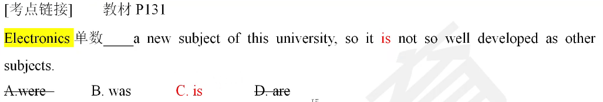

##### 考点十二

1. **四则运算（数字），单数形式。**

2. 例题

   ```
   e.g.2 plus3 is 5.
   e.g.6 minus 2 is 4.
   e.g.5 times 6 is 30.
   e.g.6 divided 2 is 3.
   ```

   

##### 总结

1. 就近原则：
   - 一个句型：there be
   - 两个单词：or  nor
   - 三个短语：not only...but also    either...or    neither...nor
2. 就远原则：with,without,as well as,together with

### 特殊句型

##### 考点一

1. 强调句式**It is/was+被强调部分+that(人、物)/who(人)+其它部分**

   (强调除了谓语之外的所有成分)

   强调句判断方式：删去it,is/was,that/who--剩余部分还是完整句子

   强调句选that

2. 例题

   ```
   练习：原句Trump主语was born in New York in 1946.
   强调主语：It was Trump that/who was born谓语in New York地点in 1946时间，
   强调地点：It was in New York that Trump主语was born谓语in1946时间.
   强调时间：It was in 1946 that Trump主语was born谓语in New York地点.
   [考点链接]
   It was in Jonson's hotel__the business meeting was held last year.[20l5年，4题]
   A.this
   B.that
   C.what
   D.which
   ```

   

##### 考点二

1. 强调谓语动词，在谓语动词之前加**do/does/did**---真的，确实，务必

2. 例子

   ```
   1.原句：Tom likes sleeping all day long.
   强调句：Tom does likes(恢复原形)sleeping all day long
   2.原句：Chinese lived in caves洞穴ever
   强调句：Chinese did lived(恢复原形)in caves ever..
   3.原句：Open the window,please.
   强调句：Do open the window,please..
   ```

### 倒装句（son）

1. 复习：陈述句--疑问句/倒装句

2. 例子

   ```
   He can sing------can he sing
   He is a student.-----is he a student
   He has finished the work.------has he finished the work
   He had finished the work.----had he finished the work
   He likes red,.---does he like(恢复原形)red
   ```

##### 考点一

1. 否定词(son) 置于句首时，句子要进行倒装

   否定词包括：
   **never从不，neither两者都不，nor不，little,seldom几乎不，hardly几乎不，rarely几乎不，scarcely几乎不，no sooner,not only,in no way绝不，in/at no time, few,not,no等。**

   - 不可数：a little有一点（肯定）little一点也没有（否定）
   - 可数：a few有一点（肯定）    few一点也没有（否定）

2. 例题

   ```
   1.Not a word (I said /did I say/ did I said)to him.
   2.Never (I have found/ have I found)him so happy.
   3.Not only (does he likes does he like/he likes)Chinese,but also he is good at English.
   1.No sooner__to school than__to clean the classroom.
   A.she had got;did she begin
   B.had she got;she began
   C.she got;she began
   D.did she get;she had begun
   2.No sooner__to the airport than it began to rain.[20l4年第5题]
   A.we had got
   B.had we got
   C.we got
   D.did we get
   ```

   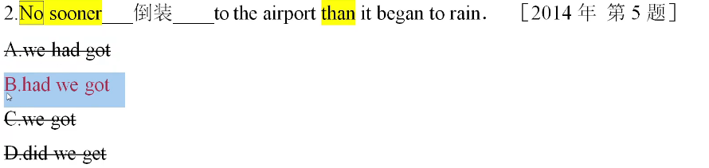

##### 考点二

1. “only只有**+短语/从句”置于句首**，进行倒装

   主倒从不倒
   举例说明：
   only in this way
   only tomorrow
   only when you come从句

2. 例题

   ```
   1.Only then (did he realize/ did he realized /he realized)the importance of English.
   2.Only when__over in 1980__able to get happily back to work.
   A.the war was,was he
   B.the war was,he was
   C.was the war,was he
   D.was the war,he was
   3.Only by practicing a few hours every day the skill in__playing the violin.
   A.you can master
   B.can you master
   C.you will master
   D.did you master
   ```

   

##### 考点三

1. **so .. that. ， such .. that.**的倒装 如此…以至于

   so+adj/adv    such+n  放在句首 主倒从不倒

2. 例题

   ```
   1.So good a man is he that he is always helpful in the neighbourhood
   2.Such a good man is he that he is always helpful in the neighbourhood.
   3.So loudly__ that__hear him in the next room
   A.did he speak,could people
   B.did he speak,people could
   C.did he spoke,could people
   D.he spoke,people could
   [马上练习]教材P145 18题
   So excited__that he didn't notice a big stone on the ground.
   A.he seemed
   B.did he seem
   C.was he seeming
   D.he did seem
   ```

   

##### 考点四

1. (尽管)必须倒装：as从句中最后一个（组）单词提到句首（冠词删去）

2. 例题

   ```
   1.as he is Busy,he finishes the task.
     -Busy as尽管heis,he finishes the task
   2.Young girl as she is,she knows a lot.
   [考点链接]
   __，he managed to find time to go to see a doctor.[201l年，2题]
   A.As he is busy
   B.As he was busy
   C.Busy as he was
   D.Busy as he is
   ```

   

##### 考点五

1. 省略f的虚拟条件句倒装（重点）

   if虚拟倒装：**前提if省略**  **(had / were / should提到主语之前)**

2. 例题

   ```
   1.(Were I you /I were you),I would not do it like that:
   2.(Had finished I/I had finished /Had I finished)the task,I would have got the overtime pay.
   1.__today,he would get there by Friday
   A.Would he leave
   B.Was he leaving
   C.Were he to leave
   D.If he leave
   2.Had you listened to the doctor,you__all right now
   A.are
   B.were
   C.would be
   D.would have been
   ```

   

##### 考点六

1. 短语辨析

   - 肯定句：**so**+情态/be/完成have,has,had/do,does,did+主语---**某人也是**(俩个人)
   - 否定句：**neither/nor**+情态be/have,has,had/do,does,did+主语---**某人也不**(俩个人)
   - 扩展： 肯定句：so+主语+情态be/完成have,has,had/do,does,did--的确如此(一个人)
   - 否定句：neither/,nor+主语+情态/be/完成have,has,had/do,does,did--的确不(一个人)

2. 例题

   ```
   He is a student.---So is Mary. Mary也是
   变式：He is a student..--So he is.他的确是学生
   He can't play football..---neither/nor can Mary.Mary也不会
   He likes red------So does Mary Mary也喜欢
   1.I saw the film__
   A.So did he
   B.So does he
   C.So was he 
   D.Neither did he
   2.He likes the movie__
   A.So did I
   B.So do I
   C.So am I
   D.Neither do I
   [考点链接] 教材P138
   Barry can't drive a car;__
   A.neither can Molly
   B.can Molly either
   C.nor Molly can
   D.so can't Molly
   ```

   

##### 总结倒装

1. “son”:so、such only 否定词 放句首（主倒从不倒）
2. as倒装（尽管）从句最后一个词提前
3. 虚拟语气：f省略-从句倒装
4. 肯定：so+情态/be/完成/do does did+主语 某人也是
   否定：neither/nor+情态/be/完成/do does did +主语 某人也不

### 反意疑问句

1. 反意疑问句：由两部分组成，第一部分是一个陈述句，第二部分是一个简短的问句。（**前肯后否，前否后肯**)

   疑问部分：情态be/完成have has had/,do does did+主语

   ```
   l.It is a fine day, isn't it?
   2.It is not a fine day, is it?
   3.They work here, don't they?
   4.He can't ride a bike, can he?
   5.Mary was ill yesterday, wasn't she?
   ```

   

   **注意：前边主句的主语是I,疑问部分要用aren't I,**

   ```
   I am a student,aren't I?
   ```

##### 考点一

1. 否定词包括：not,never从不，seldom几乎不，hardly几乎不，few,little,barely几乎不，rarely几乎不，scarcely几乎不，nothing没有，none没有(三个及以上)，neither(两者都不) ，no,nobody没有人，等。

   - barc adj很少   rare adj稀少的
   - 不可数：a little有一点（肯定）little一点也没有（否定）
   - 可数：a few有一点（肯定）   few一点也没有（否定）
   - 注意：**有否定前缀的词不算否定**，例如：**unhappy,dislike,impossible** 肯定词等。

2. 例题

   ```
   1.She seldom went abroad,(didn't she/ did she/ did he)?
   2.I have never been there,(have I/do I/haven't I/don't D?
   3.Tom can hardly defeat Jerry,(can it can't it do it does it)?
   4.I have few fricnds,(have I/do I/haven't I/don't D)?
   5.I have a few friends,(have I/do I haven't I/don't I)?
   1.He looks unhappy,(does /doesn't)he?
   2.Jerry dislikes Tom,(does/ doesn't)it?
   [马上练习] 教材P145 17题
   He disagreed with us on many aspects concerning this subject,?
   A.didn't he
   B.did he
   C.doesn't he
   D.will he
   ```

   

##### 考点二

1. 主从句

   - 普通：进行反义--针对主句

     ```
     He said that she is a good student,didn't he
     ```

   - 特殊：如果主句：**I / we+主观意愿动词** believe,think=-suppose,imagine想象，
     expect期待 预料--**进行反义-针对从句**

   - 否定前移：当主句动词是think,believe和suppose时，否定前移

     - ```
       I think he is not tall. 否定前移：I don't think he is tall.
       ```

     - **出现主从句：判断肯否定需要看整个句了**

2. 例题

   ```
   1.I think that Tom will defeat Jerry some day,(don't I/won't he/doesn't he)?
   2.They suppose that they have finished the project,(don't they /haven't they)?
   否定前移
   I don't think that you are correct,(aren't/are)you?
   [考点链接] 教材P142
   I don't suppose anyone will volunteer to help this selfish man,___
   A.do I
   B.don't I
   C.will they
   D.won't they
   [马上练习]教材P146 29题
   I don't think you've heard the place that once was a wilderness before,__
   A.don't I
   B.do I
   C.have you
   D.haven't you
   ```

   

##### 考点三

1. had better 和 have 反义疑问句

   had better do sth最好做    had better not do最好别做

   **had better的反义疑问句：用had**

   have has had的反义疑问句：

   - ```
     1.He has some water,__?
     2.They have to leave here,__?
     3.He has finished it.__?
     4.They had to cross the street,__?
     5.We had better leave now,__?
     6.He has two younger sisters,__?
     7.He had two younger sisters,__?
     8.He doesn't have two younger sisters,__?
     ```

     

2. 例题

   ```
   e.g.You had better leave here now,(didn't/hadn't)you?
   [马上练习]教材P145 21题
   You'd better sign the contract before he changes his mind,__you?
   A.hadn't
   B.did
   C.didn't
   D.don't
   [马上练习] 教材P144 3题
   Mary has few否real friends in the school,__？
   A.does she
   B.doesn't she
   C.didn't she
   D.hasn't she
   ```

   

##### 考点四

1. 祈使句（以动词原形否定：Don^,^t)中的反意疑问句

   | 类型                   | 例子                                                         |
   | ---------------------- | ------------------------------------------------------------ |
   | 一般的祈使句           | Open the window,**will** / won^,^t you?<br/>Open the window,**won't** you?<br/>**Don't** make any noise,**will you** / can you? |
   | **Let us**开头的祈使句 | **Let us** clean the classroom,**will you?**                 |
   | **Let's**开头的祈使句  | **Let's** complete it,**shall we?**                          |

2. 例

   ```
   1)Let us do this job,__?
   2)It is a fine day.Let's go fishing.__?
   3)Turn on the radio,__?
   考点链接 教材P143
   Let's choose Professor Johnson's class this term,__
   A.shall we
   B.will you
   C.can we
   D.could you
   ```

   

##### 考点五

1. must 的反义疑问句“一定--推测

   - 对现在的推测：must+动词原形  **根据must后边动词形式进行反义**

     ```
     e.g.He must be over 60 years old,(isn't he /mustn't he/doesn't he)?
     ```

     

   - 对过去的推测：must have done 

     陈述句部分**有**具体**过去时间词**，**用did进行反意疑问**
     陈述句部分**没有具体过去时间词**，**用haven't/hasn't+主语**

     ```
     1.We must have arrived here early that day,(don't we /mustn't we /didn't we)?
     2.You must have waited for me for a long time,(didn't you /haven't you)?
     ```

     

   - 总结

     现在：must+do
     过去：must+have done
     特殊：must have done有明确过去时间词--did/didn't进行反义

2. 例题

   ```
   [考点链接] 教材P141
   Mr.Smith must have come back from California,__?
   A.did he
   B.hasn't he
   C.didn't he
   D.has he
   He must have seen the film yesterday,__?
   A.hasn't he
   B.didn't he
   C.has he
   D.did he
   ```

   

##### 考点六

1. dare/need的反义疑问句

   need需要dare敢（既是情态动词 又是实义动词 / 普通动词)

   判断是否为情态动词：

   - **情态动词+动词原形**
   - **情态动词的否定在后面加not**

2. 例

   ```
   判断是否为情态动词：
   1.He needs a book
   2.He needs to buy a book.
   3.He need buy a book.
   4.He doesn't need to buy a book.
   5.He needn't buy a book
   6.The bike needs fixing.
   ```

   

3. 例题

   ```
   [马上练习]辨析题
   1.The house needs repairing,__?
   A.needn't it
   B.need it
   C.doesn't it
   D.didn't it
   2.The house need be repaired.__?
   A.needn't it
   B.nced it
   C.doesn't it
   D.didn't it
   3.The house needs to be repaired,__?
   A.needn't it
   B.need it
   C.doesn't it
   D.didn't it
   ```

   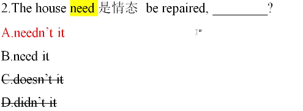

##### 考点七

1. 前面用I wish,后面用 may I

2. 例题

   ```
   e.g.I wish to have a word with you,may I?
   ```

##### 考点八

1. 陈述部分的谓语是**used to do时**，疑问部分用**didn't+主语**或**usedn't+主语**

2. 例题

   ```
   He used to take pictures there,didn't he?
   [马上练习]教材P145 25题
   Janct uscd to take part in volunteer work in that region,
   A.didn't she
   B.did she
   C.used she
   D.wouldn't she
   ```

   

##### 考点九

1. **感叹句**（what/how）中，疑问部分用**be+主语**

2. 例子

   ```
   What colors,aren't they?
   What a smell,isn't it?
   ```

### 感叹句

1. 感叹句引导词：how和what

   what+n 名词
   how+adj/adv 形容词/副词
   **先找形容词冠词一道墙**

   **adj直接n--what   adj没有直接加n--how**

2. 例

   ```
   1.__interesting books you have bought us!
   2.__a interesting book you have bought us!
   3.__happy the man is！
   4.__great fun it is to swim in the river!
   5.__great a building is!
   6.__a great building is!
   ```

   

### 补充语法

##### 倍数表达法

###### 考点一

1. A+be+**倍数**+**比较级+than**+B  倍数在前

   倍数：twice(两倍)    数字+times(three times三倍)

   **看见than考比较级**

2. 例

   ```
   My books are twice more than your books
   e.g.1.This templeis three times (highest more high /more higher higher)than that one.
   2.This temple is(three times higher higher three times)than that one.
   ```

   

###### 考点二

1. A+be+**倍数+as+原+as**+B 倍数在前

2. ```
   1.Asia is four times as (larger /largest large)as Europe.
   2.Asia is (four times as large/large as four times)as Europe.
   3.Tom is (three times as tall as as tall as three times)Jerry.
   (20184)Staying in a hotel costs renting a room in a dormitory for a week
   A.as much twice as
   B.twice as much as
   C.as much as twice
   D.more twice than
   [考点链接|
   Last month,he earned__his wife,who has a well-paid position.(2014 2)
   A.twice as many as
   B.more than twice
   C.twice as more as
   D.twice as much as
   ```

   

###### 考点三

1. A+be+倍数+the size尺寸/height/length/width+of+B  倍数在前

   high adj---height n高度
   long adj--length n长度
   wide adj宽的广阔的--width n宽度

2. ```
   e.g.This new street is (twice the width /the width twice)of the old one.
   ```

   

###### 考点四

1. The size height length width+of++A+be+**that/those**+of++B

   比较：指代前文 **that单数hose复数** ---同类不同个

2. 例

   ```
   1.The size of our classroom is three times (that/this/those/these/it)of the next one.
   2.The weather in Hainan is hotter than (that/this/thosc/these/it)in Beijing.
   3.The cars made in Germany are more expensive than (that/this/those/these/it)made in Japan.
   ```

   

##### 尽管

1. 尽管
   - 1.although
   - 2.though(不倒装-although倒装-as)
   - 3.while
   - 4.as(必须倒装：从句最后一个组单词提到句首一冠词删去)

##### 完全倒装

- **部分倒装（半倒装）：情态/be/完成have has had/,do does did提到主语之前**
  **“son”**
  **s:so such放在句首**
  **o:only放在句首**
  **n:否定词放在句首**（重点）
- 完全倒装：主+谓+宾完全倒装：宾+谓+主

###### 考点一

- there be句型(be可以换成stand,lie,exist,remain,appear,come等)
  He comes there.
  完全倒装：There comes he

  there-+谓语+主语

###### 考点二

- 表示时间、地点的副词位于句首
  The man stands on the mountain.
  On the mountain
  stands the man

### 总结

1. 谓语动词（时态被动语态）
2. 非谓语动词（主被动）
3. 虚拟语气
4. 定语从句（修饰名词）
5. 名词性从句（主从 宾从 表从 同位语从句)
6. 状语从句（引导词的含义）
7. 主谓一致（主语是单三一谓语动词+s)
8. 特殊句型（强调句 倒装句 反义疑问句 感叹句）

## 词性转换

1. 语法

2. 判断词性

   - 冠词(a an the)+名词 a book  a pen a boy a girl
   - 系动词(be+感官动词)+形容词  She is tall.
   - 形容词修饰名词a good(adj)  person
   - 副词修饰动词  work hard (adv)
   - 副词修饰形容词 very (adv) good (adj)
   - 副词修饰副词 work very (adv)hard (adv)
   - 副词修饰句子 Luckily,I finished the work

3. 总结

   - **冠名，系形，形名，副动，副形，副副，副句**

   - 如果题干本身有副词删掉

   - 语法：动词--谓语动词（时态+语态）非谓语动词（主被动）

   - ```
     friend n 朋友--friendly adj 友好的
     health n健康--healthy adj(unhealthy)
     soft adj柔软的-sofy adv
     correct adj正确的--correctly adv
     invite v邀请--invitation n
     complete v完成--completion n
     complete adj完全的--completely adv
     sun n太阳--sunny adj晴朗的
     rain n雨---rainy adj
     snow nv雪---snowy adj
     cloud n云--cloudy adj
     wide adj宽的广泛的--widely adv----width n宽度
     decidev决定--decision n
     conclude v总结---conclusion n
     include v包括--inclusion n
     favor vn支持喜爱---favorite adj最喜爱的
     serve v服务--service n
     forget v忘记--forgetful adj健忘的
     recover v恢复--recovery n痊愈
     power n权利力量---powerful adj强大的
     usual adj通常的---usually adv       
     important adj重要的--importance n
     different ad不同的---difference  n
     significant adj重要的---significance n
     ```
     
   

## 翻译

1. 单句翻译答题方法
   - 找主干：主**谓**宾
   - 用**语法**+认识的单词一排除选项
   - 剩下选项：对照区别
   - 验证：从头到尾读一遍

## 做题技巧  

1. 有时间词看时间词，没有时间词-画数轴判断动作先后顺序
2. 定语从句没有空就不用管
3. 时刻表--真理永一现
4. 时态：看前两个单词
   语态：后两个单词
5. 总结：时态  看选项   时态：看前两个单词  对照选项（主被动）
6. **在选项中有介词，优先选带介词的**
5. 空前有to蒙doing
5. 如果有not 选until
5. 句子内时态一定是连续的不可跳
5. 看见not 选until
5. **蒙题：句子，doing**
5. 非谓语看不懂就用主动doing被动done
5. it形式主语/形式宾语：1.to do  2.**that(不一定)**

## 做题方法

1. 看答案：判断考动词主要考，
   谓语动词 or 非谓语动词
2. 看题干：
   连接词 -- 判断主从句
   时间状语 -- 判断对于时间
   其他已知谓语动词 -- 对时间的判断
3. 答案中常见的主要区别：
   主被动
   强化主被动的判断：
   主要判断谓语动词与**之前**的主语之间的动作逻辑关系。
   当谓语动词是主语发出来的（自身熟悉，特征）主动(主语常是人sb)            当主语是谓语动词动作的承受者 被动（主语常是物sth)。当物是某一类通常是被动当具体到某一个强调自身属性通常是主动

- 做题思路步骤：
- 1找出答案中区别：主被动；倒装：单复数；时间
- 2找出题干中：连接词-时间状语其他谓语动词
- 句子的两要素：主语+谓语动词

## 词组的固定搭配

###  花费

总结花费:spend pay cost take

1. 人spend+时间、金钱+**on sth** / (in)**doing sth**

   ```
   I spent 2 hours on the homework / doing my homework
   ```

2. 人 pay+金钱+**for** sth

   ```
   I paid 10 dollars for the book
   ```

3. **物** cost 人+金钱

   ```
   The book cost me ten dollars
   ```

4. **It takes / took sb st to do sth**


### 写作

```
I am pleased/delighted to write to you.第一句话
```

### 情态动词

```
ought to=should
```


