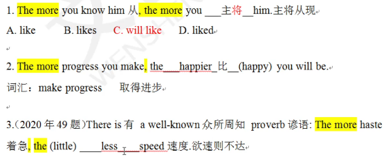
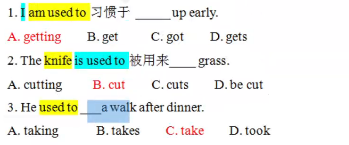

# 英语

## 一.高频语法

### 动词

“动词是英语的灵魂”

- 动词：

  1. 谓语动词：有且只有一个
  2. 非谓语动词：0,1,2,3,... 并不重要有没有有多少都可以
  3. 无谓不成句：
     没有谓语动词就不是句子（是句子，必须有一个谓语动词）。

- 定义

  1. 谓语动词定义：一个句子的核心动作（背诵）
  2. 主语定义：发出动作的人、物、事（背诵）
  3. 宾语定义：接收动作的人、物、事（背诵）

- 例子

  ```
  I 主语 eat (谓语动词) an apple宾语
  I 主语 will leave 谓语动词 tomorrow 不是宾语
  ```

  ```
  找出下面句子的“谓语动词”--缩句。
  1.Tom已经学了三个月的英语了。
  2.今年印度的疫情(epidemic situation)给整个世界都带来了不少麻烦
  3.吐槽大会培养出来的人才现在已经各奔东西了
  4.Tom likes China.
  6.Tom who comes from America likes China very much.
  ```

  答案

### 动词的时态

- 英语的时态靠时间状语和动词的变化来表达。“、
  时间：现在 过去 将来。

  状态：一般 进行 完成

- | 时态           |                           |
  | -------------- | ------------------------- |
  | 一般现在时     | do/does ，am/is/are       |
  | 一般过去时     | did,was/were              |
  | 一般将来时     | will do (动词原形)  shall |
  | 过去将来时     | would do (动词原形)       |
  | 现在进行时     | am/is/are doing           |
  | 过去进行时     | was/were doing            |
  | 将来进行时     | will be doing             |
  | **现在完成时** | have / has done           |
  | **过去完成时** | had done                  |
  | **将来完成时** | will have  done           |

  1. Do代表所有动词的原形.
  2. does代表所有动词的第三人称单数(he plays)
  3. did代表所有动词的过去式(play一played,see--saw不规则变化一背诵66页)
  4. 进行：be doing
  5. done代表所有动词的过去分词(play一played-一played,see一saw-seen)

##### 一般现在时

- 定义：表示通常性、**规律性**、习惯性、真理性的状态或者动作有时间规律发生的事件的一种时间状态

- 形式：do/does,am/is/are

- 肯定句、否定句、一般疑问句形式：

  ```
  情态动词+动词原形：can/could,will/would,should,must,might/may,
  1.He can do this work.
  否定句：He can not(can't)do this work.
  一般疑问句：Can he do this work?
  2.He is a student.
  否定句：he is not(isn't)a student.
  一般疑问句：Is he a student?
  3.They read books every day. --求助do(助动词)do not(don't)
  否定句：They don't read books every day.
  一般疑问句：Do they read books every day?
  4.Tom likes red.求助do(does doesn't)
  否定句：Tom doesn't like(恢复原形)red,
  一般疑问句：Does Tom like(恢复原形)red,
  ```

- 总结：有情用情，有be用be,无情无be求助do(does,did)

###### 考点1

- 一般现在时常见的时间标志词：always总是，usually通常，often通常，sometimes 有时，every day每天，every week每周，on Mondays每周一，once 一次， a week一周一次(day year,month.…)---体现出规律性等。

- 例子

  ```
  1.They (learns/learned/learning/leam) English every day.
  2.Heplays basketball once a week.
  ```

  答案

  

- 答题步骤：找标志词--定考点--出答案--翻译

- 练一练

  ```
  Tom often 一般现在时_B_into the traps陷阱set 设置by Jerry.
  A.get  B.gets C.got D.getting.
  词汇：get into陷入--get into troubles陷入麻烦
  ```

###### 考点2

- 真理永一现

- The sun 太阳  the earth地球  the moon月亮

- 例子

  ```
  The earth (go/went/going/goes) around the sun.  选goes
  ```

- 练一练

  ```
  1.The earth___round圆的.  选a
  A.is B.was C.are D.be 
  2.He said(say的过去式) the sun单三 in the east and并列 in the west.真理永一现       选b
  A.rose;set   B.rises;sets  C.rises;set D.rise;sets.
  
  Rise v升起-rose-risen
  Set---set---set-
  ```

###### 考点3

- 用一般现在时表示将来时。（主将从现）

- 表示时间的引导词：when当…时，until直到 after之后.before之前,    as soon as 一…就 ,once 一旦，the moment 一…就，the minute一…就，the day在那天 等。

- 表示条件的引导词：if如果，unless(=if not)如果不，provided假设，as long as只要 等

- 带引导词的都是从句
  不带引导词的是主句

- 例子

  ```
  1. will tell him the good news when从句一从现he(gets/will get/got/get)here.主将从现.
  主从句翻译：先从句后主句
  变式：I will tell him the good news when从句一从现he(gets/will get/got/get)here tomorrow.主将从现
  2.If主将从现he accepts the job从句，he主句一主将(gets/will get/got/get) more money soon
  词汇：accept v接受--receive v收到.
  ```

  

- 马上练习

  ```
  When the couple ___ here tomorrow,they___to the park.
  A.will come;will go
  B.come;go.
  C.will come;go
  D.come;will go.
  ```

  

- [考点链接]教材P64

  ```
  If we ___to protect the environment,we will regret it sooner or later.
  A.hadn't acted
  B.haven't acted
  C.don't act
  D.won't act.
  词汇：protect v保护.--protection n (会写)
  Environment n 环境--environmental  adj 环境的 (会写)
  Regret v后悔遗憾.
  Sooner or later迟早.
  ```

  

- 马上练习

  ```
  The new secretary will report to the manager as soon as she__
  A.will arrive
  B.arrives
  C.is arriving
  D.is going to arrive
  词汇：	secret n adj 秘密--secretary n秘书，
  	Report v报道--reporter n报道者记者.
  	Manage v管理--management n管理--manager n管理者，经理，
  ```

  答案

###### 考点4

- the+比较级...... 从句 ，the+比较级...... 主句（越.…就越.…)句型中，主将从现

- 基础语法：比较级

  1. 形容词，副词比较级和最高级

  2. 比较级：两者+than   最高级：大于等于三

  3. 变化规则：

     1. 普通单词：比较级+er,最高级+est (tall一taller--tallest,short-shorter--shortest)

     2. 以e结尾的：比较级+r,最高级+st

     3. 以“辅-元-辅”结尾：双写尾字母+er/est (hot-hotter---hottest,thin--thinner-thinnest).

        元音 a,e,i,o,u    辅音：除了元音都是辅音

     4. 以“辅+y”结尾：变y为 i +er /est (busy--busier--busiest)

         注意：最后一个字母为需查看前一个字母是否为辅音

     5. 以“er/ow”结尾：直接加er/est (slow-slower-slowest,clever--cleverer---cleverest)

        注意：第五条是第三条的特殊形式

     6. 多音节词：比较级more+本身单词，最高级most+本身单词.

        (元音字母大于等于三-多音节词)
        terrible ---more terrible---most terrible.
        beautiful---more beautiful---most beautiful.
        strong---stronger---strongest.

     7. 特殊需要背诵

        | 原型                    | 比较级           | 最高级             |
        | ----------------------- | ---------------- | ------------------ |
        | Good adj /well adv好：  | Better           | Best               |
        | Bad adj /badly adv坏    | Worse            | Worst              |
        | Many可数/much不可数  多 | More             | Most               |
        | Little  不可数 少的     | Less             | Least              |
        | Far  远                 | Farther/further. | Farthest/furthest. |
        | Old 老的                | Older/elder      | Oldest/eldest.     |

- 马上练习

  ```
  词汇：science n科学--scientist  n科学家
  art n艺术--artist n 艺术家，
  Praise v n 表扬
  Criticize v 批评-----criticism n批评
  Improve v提高，改善-improvement n
  ```

  答案

- 考点：考时态（主将从现）
             考比较级

- 例题

  ```
  The harder you study the better results you (get/gets/will get/got)主将  答案 will get
  ```

- 练一练

  ```
  1.The more you know him,the more you___ him.
  A.like
  B.likes
  C.will like
  D.liked.
  2.The more progress you make,the___(happy)you will be.
  3.There is a well-known proverb:The more haste,the (little)___speed.
  词汇：make progress取得进步 
  Have有（某人有某物）I have a book
  There be有（某处有某物）there is a cat under the tree.
  ```

  答案
  
  **如何判断第三人称**：不是 I we you  
  
  一个句子只有一个谓语动词
  
  词汇
  
  ```
  war n 战争
  last adj 最后的 上一个的 
  suffer v 遭受 suffer from
  ```

##### 一般过去式

- 定义：表示在过去某个特点时间**发生且完成**的动作，不强调对现在的影响。

  ```
  She was my girlfriend.
  她是我的女朋友现在不是了 发生且完成
  ```

- 形式：did  was / were 

###### 考点一

- **一般过去时**的时间词：yesterday昨天，(the day before yesterday 昨天),just now刚刚，**last** week上周，in 1840,  once(曾经)，**ago** 之前等。

- 总结：once

  1. once a week一次       ---一般现在时
  2. once 一旦（引导词）---主将从现
  3. once 曾经                  ---一般过去时

- 例

  **Last week** I bought(buy) a new bike.

  ```
  buy ---bought---bought
  bring 带来---brought---brought
  ```

- 练一练

  ```
  Yesterday he ___ off to buy himself a brand-new car.
  A.go
  B.goes
  C.going
  D.went
  词汇： brand n 品牌
  	  brand-new  adi崭新的
  ```

  答案

###### 考点二

- **短语辨析：（背诵）** 

  1. **used to do    过去常常，曾经**
  2. **be / get / become  used to doing    习惯于（主语：人）**
  3. **be used to do被用来     （主语：物）**

- 例

  1. He used to (smoking/smoke/smoked/smokes)a lot.
  2. Jerry is used to (have/has/having/had) milk every morning.
  3. This pen is used to (writing/write).

  答案

  

- 练一练

  ```
  1.I am used to___up early.
  A.getting
  B.get
  C.got
  D.gets
  2.The knife is used to___grass.
  A.cutting
  B.cut
  C.cuts
  D.be cut
  3.He used to___a walk after dinner.
  A.taking
  B.takes
  C.take
  D.took
  词汇：take a walk散步
  ```

  答案

  

###### 考点三

- (了解)在口语中，情态动词一般过去时常常表示**委婉语气**
  复习：情态动词：can/**could**,will/would,may/might,.should,must,shall

- 例

  Can you help me ？  Could**（委婉语气）** you help me?

  Would(委婉语气)you like to go with me?

##### 一般将来时

- 定义：一般**将来**时表示将来某一时刻的动作或状态，或将来某一段时间内经常的动作或状态。
- 形式：will do
- 否定：will not do (won^,^t do)

###### 考点一

- 主将从现(when,as soon as---if, unless, as long as**一般现在时考点三**)

- 例

  ```
  1. We______(begin)our class as soon as the teacher______ (come).
  2. USA will overcome the difficulty of COVID-2019(新冠病毒) if the government ___(work)hard with the citizens together.
  
  词汇：overcome v克服-overcame.-overcome
  come---came---come
  difficult ad困难的--difficulty
  govern v管理.--government n政府- governmental adj
  city n城市--citizen n市民
  翻译：of的 A of B  (后——前 B的A) the door of the room(房间的门)
  ```

  答案

  

###### 考点二

- 一般将来时的标志词：next week下周，next day,next month 下个月，next term下学期，the day after **tomorrow**,**tomorrow** morning,**tomorrow** evening,**tomorrow** afternoon，soon不久之后，some day(未来的某一天)，one day 未来的某一天，in the future在未来，in+时间段（在…之后 in three years三年后）

- 例

  ```
  My mother___(give)me a nice present on my next birthday.
  ```

  答案

###### 考点三

- 考点三：祈使句（表将来），and(和)/ or 否则(otherwise) **前后一致**+will do...

- 祈使句定义：以**动词原形**开头—————祈使句表将来

- 否定形式：Don't

- 例：

  1. Open the door.祈使句表将来
  2. Close the window.祈使句表将来
  3. Sit down please.祈使句表将来

- 例题

  ```
  1.Get up early,or you (miss/is missing /missed/will miss)the first bus this morning.
  词汇：miss v想念 错过 I miss you
  2.Don't bother the man,___you will be punished.
  词汇：bother v打扰 brother n兄弟 punish v 惩罚 ---punishment n
  ```

  答案

- 辨析

  ```
  l.Say hello to Tom when you___(see)him.
  2.Open the door and you___(see)him.
  ```

  答案

- 真题

  ```
  (2019年44题)Tell him not to make any response if he___(receive)
  false information.
  词汇：respond v 回复回答--response n
  receive v收到 false 错误
  inform v通知，告知---information n信息（不可数）
  ```

  答案

###### 考点四

- 表示一般将来时

  - will do    无计划
  - be going to do 有计划，暗示(Look at the dark cloud乌云-暗示，it is going to rain) （只能用于能计划的，不能计划的需要暗示）
  - be to do        正式安排、命令
  - be about to do       不能与时间词连用

- 练一练

  ```
  He___part in a party tomorrow.
  A.is going to take
  B.is about to take
  C.is to take
  D.takes
  词汇：take part in参加=join
  ```

  答案

###### 考点五

- (会翻译）某些表示短暂性动作的动词如arrive,come,go,leave,start等，用现在进行时形式表示将来。

- 扩展

  - 延续性动词：lke,have

  - 非延续性动词（短暂性动词，瞬间动词）：arrive到达，come来，go去，leave离开，reach到达

    **注意：短暂性动词：现在进行时（表将来）**  I am coming. 我马上来了

- 例

  ```
  I am leaving for Beijing tomorrow.  我明天将要去北京
  I am leaving Beijing tomorrow.      我明天将要离开北京
  词汇：leave+地点 离开某地
  leave for+地点 动身去某地
  ```

##### 过去将来时

- 定义：表示**过去**某时看来**将要**发生的动作或存在的状态。

- 形式：would do

- 过去将来时=将来时间词+过去词

- 做题方法找将来时间词+过去词

- 例

  ```
  She said that her mother___(come)to see her the next day.
  ```

  答案

- 练一练

  ```
  She hoped that they___again someday.
  A.meet
  B.will meet
  C.met
  D.would meet
  ```

  答案

- [马上练习]教材P74第16题

  ```
  The teacher told us that we___to London the next month.
  A.travel
  B.had traveled
  C.are traveling
  D.would travel
  ```

  答案

##### 现在进行时

- 定义：表示正在**进行**的动作或存在的状态。
- 形式：am / is / are doing

###### 考点一

- **现在进行**时常见标志词：**now现在，right now现在，at the moment在此刻，listen! 听，look!看，at this time在此刻，these days这些天，at present现在，for the time being现在，for the present现在**，**时刻点（进行）**

- 时刻点

  - 时刻点（进行）+过去词=过去进行时
  - 时刻点（进行）+将来词=将来进行时
  - 时刻点（进行）+现在词/无时间词=现在进行时

- 例

  ```
  I (wait/waits/am waiting)for you at the school gate now.
  词汇：wait v等待 wait for
       gate大门door小门
  ```

  答案

- 马上练习 教材P74第20题

  ```
  It is six o'clock in the morning.Many old people___in the park.
  A.are dancing
  B.dance
  C.is dancing
  D.dances
  词汇：people人们--复数
       person---a person
  ```

  答案

###### 考点二

- (会翻译)**瞬间动词******现在进行时表示将来****

- (瞬间动词：arrive到达，come来，go去，leave离开，reach到达)

- 例

  ```
  Mary is leaving next Friday.      Mary将会在下周五离开
  He is arriving in the afternoon.  他将会在下午到
  ```

##### 过去进行时

- 定义：表示过去在某一时间段或某一段时间内正在发生或进行的动作或状态。
- 形式：was / were doing

###### 考点一

- 过去进行时的常用标志词：this time yesterday,at that time,    at 6  p.m.  yesterday, **from nine to ten last evening**等。

- 过去进行时=时刻点（进行）+过去词

- 例

  ```
  1.Tom(sleeps/slept/will sleep/was sleeping)this time yesterday?
  2.I (am learning/was learning/learned/learns)at nine last night.
  ```

  答案

###### 考点二

- when当…时候

- 复习：when

  - 主将从现     能翻译成：将

  - 时态一致(从句 when+did一般过去时，主句was/were doing                     能翻译成：正在           两个动作同时发生)

    例：当我**回家**的时候，我的妈妈正在做饭呢。

    例：When I came home,my mother was cooking.

- 例

  ```
  1.The boy (does/ did/ was doing / is doing)his homework when his father came back from work.
  2.I will tell him the good news when he(gets/will get/got/get) here tomorrow
  ```

  答案

- 练一练

  ```
  When you___me last night,I ___ the piano.
  A.were calling;was playing
  B.were calling;played
  C.called;played
  D.called;was playing
  没有标志找选项
  ```

  答案

##### 将来进行时

- 定义：表示将来某个时刻或时间段正在进行的动作。

- 形式：will be doing

- 将来进行时=时刻点（进行）+将来词

- 例

  ```
  I (do)my homework this time tomorrow.
  ```

  答案

- 练一练

  ```
  He___basketball at 5p.m.tomorrow.
  A.is playing
  B.will play
  C.plays
  D.will be playing
  ```

  答案


