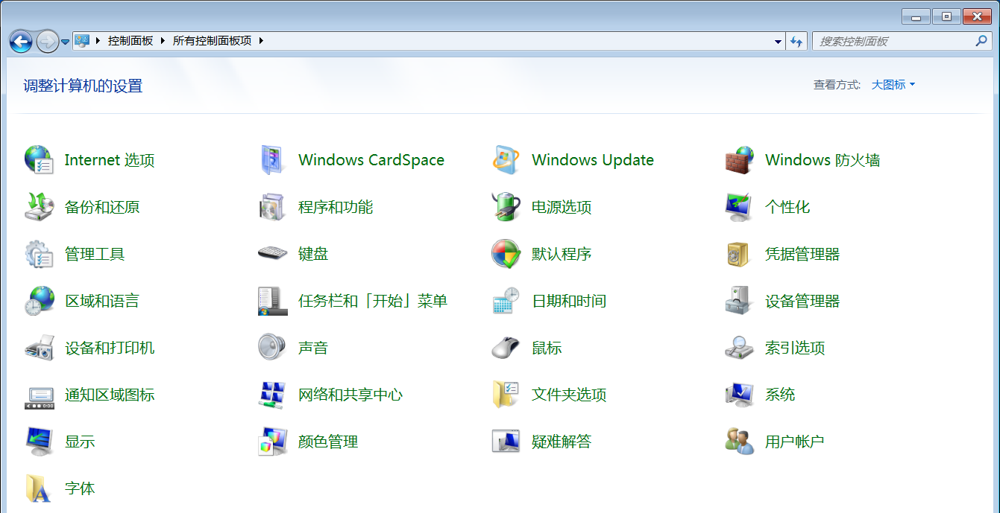
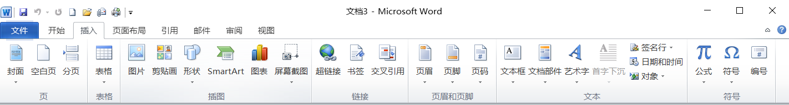
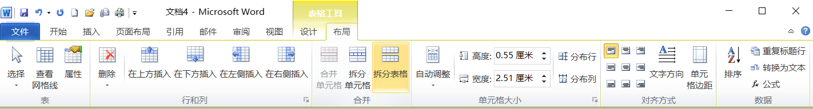
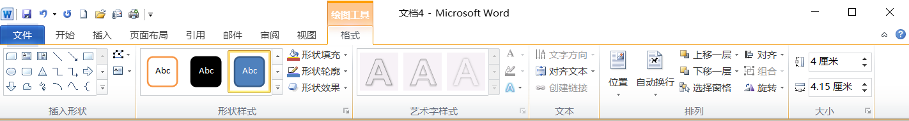
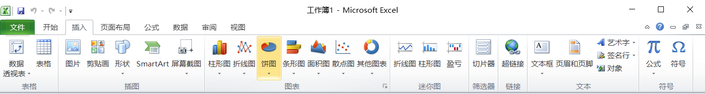
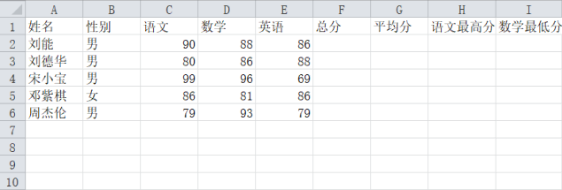

# 第一章

## 计算机系统

1. 请简述计算机发展的各个阶段及发展
   - 第一代为**电子管计算机**采用的主要电子元件是**电子管**。**应用于科学计算**，采用**机器语言和汇编语言**
   - 第二代为**晶体管计算机**所采用的主要电子元件是**晶体管**，**应用于信息处理** ，采用**高级语言，出现了操作系统**
   - 第三代为**集成电路计算机**采用的主要电子元件是**中小规模集成电路**，**进行结构化和半结构化的程序设计**
   - 第四代为**大规模、超大规模集成电路计算机** 所采用的主要电子元件是**大规模、超大规模集成电路**，出现了**微型计算机及巨型计算机等多种类型的计算机**，并向**微型化、巨型化、智能化和多媒体化方向发展**。
2. 简述冯诺依曼原理的三点基本思想。
   - 计算机硬件组成应为**五大部分**：**控制器、运算器、存储器、输入设备和输出设备；**
   - 计算机中的**指令和数据**都**采用二进制数表示**；
   - 计算机**采用“存储程序”的工作原理**。
1. 简述计算机的**定义**，并写出计算机的**工作原理**。
   - **定义**：**计算机**是一种**能按照事先存储的程序**，**自动、高速**地进行**大量数值计算**和**各种信息处理**的**现代化智能电子装置**。
   - 工作**原理**：**存储程序和程序控制**
4. 简述**计算机程序的含义**，并写出计算机的**工作过程**。
   - 计算机**程序**是：为**解决某一问题**而**设计的指令序列**
   - 工作**过程**：**计算机工作过程是执行程序的过程**，**即是不断地取出指令、分析指令、执行指令的过程。**
5. 请简述**指令的含义和构成**，并写出指令的**执行过程**。
   - 指令的**含义**：指令是**指挥和控制**计算机**执行某种操作的命令**
   - 执行**过程**：**取出指令、分析指令和执行指令。**
2. 简述计算机的特点及未来计算机的发展趋势。
   - **特点**：**全自动化工作、逻辑判断能力强、运算速度快、计算精度高、存储容量大等**
   - 发展**趋势**：**巨型化、微型化、智能化、网络化、多媒体化等**
4. 计算机的应用
   - **科学计算**：**天气预报、航空科技、人造卫星、地震预防**
   - **数据处理**：**办公自动化、档案管理、物资管理**  **资料检索** 
   - **过程控制**：**工业自动化生产、流水线** 
   - **计算机辅助系统**：计算机辅助设计CAD，计算机辅助制造CAM，计算机辅助测试CAT，计算机辅助教学CAI
   - **人工智能**：专家系统、机器人
   - **网络通讯**
   - **多媒体**
3. 常用的office软件属于计算机应用中的哪一类？并至少写出其他四类常见的计算机应用
   - 常见的office属于**信息处理**
   - 常见的**计算机应用**还有：**科学计算，过程控制，计算机辅助系统，人工智能，网络通信，多媒体等**
6. 计算机的分类有哪些
   - 根据**处理的对象**划分：**模拟计算机，数字计算机，数模混合计算机**
   - 根据**计算机的用途**划分：**通用计算机，专用计算机**
   - 根据**计算机的规模**划分：**巨型机、大型机、中型机、小型机、微型机**
   - 根据**计算机的网络位置**划分：**工作站，服务器**
4. 常用的微型计算机又称为PC机，请写出PC对应的英文，并简述按规模和性能，计算机可划分为哪几类
   - PC对应的**英文：Personal Computer**
   - 按照**规模和性能**：**巨型机，大型机，中型机，小型机，微型机**
5. 请写出**计算机系统包括哪两部分**，并简述**二者**之间的**关系**
   - 计算机系统包括**硬件系统**和**软件系统**两部分
   - **硬件**是**软件**赖以**工作的物质基础**，**软件**的**正常工作**是**硬件发挥作用的唯一途径**，**二者相辅相成**、互为依托、**缺一不可**。
9. 计算机系统的**组成**请详细说明
   - 计算机系统包括**计算机硬件系统**和**计算机软件系统**
   - 硬件系统包括：
     - **运算器**：由**算术逻辑运算单元**和**寄存器组成**
     - **控制器**：**指挥和控制各部件协调工作**
     - **存储器**：**存储数据和程序的部件**，分为**内存和外存**
     - **输入设备**：**接受用户信息**，转化为**计算机能够接收**和**识别的数据 如：鼠标、键盘**
     - **输出设备**：将**计算机中的数据转换**为**人或者其他设备接受的形式并进行输出** 如：显示器等
   - 软件系统包括：
     - **系统软件**：**操作系统**
     - **应用软件**：是为某种应用或**解决某类问题所编制的应用程序**
10. 计算机的层次结构
    - **裸机** 
    - **系统软件**
    - **应用软件**
    - **应用程序和文档** 
11. 组装一台计算机需要那些硬件
    - **主板，CPU，内存条，硬盘，机箱，电源，显示器，鼠标，键盘，显卡**
12. 简述CPU的两个主要构成部件，并写出各部件的功能
    - **cup**的主要组成部件为**运算器**和**控制器**
    - **运算器的功能**：进行**算数运算和逻辑运算**
    - **控制器的功能**：**控制**和**指挥**计算机**各部件协调工作**
13. 简述**主机主要包括哪些部件**，并写出**各自的功能**。
    - 主机包括**CPU和内存**
    - **CPU**：**主要进行算数运算和逻辑运算，并且能够指挥计算机各部件协调工作等**
    - **内存**：**用于暂时存放CPU中的运算数据，主要负责与CPU和外存交换数据，是外存与CPU进行沟通的桥梁**
14. 简述**存储器的功能**和**分类**。
    - 存储器是**存放**各种**数据**和**程序**的装置，是计算机的**记忆部件**
    - 分为内存和外存
15. 计算机的性能指标
    - **主频**：又叫做**时钟频率**CPU**单位时间内发出的脉冲数** ，**单位（HZ）**
    - **字长**：计算机**一次能处理的二进制位数**
    - **运算速度**：**计算机每秒能执行的指令行数**单位 **MIPS**
    - **内存容量**：**内存容量越大，运算速度越快**
    - **存储周期**：**存取周期越小，运算速度越快**
16. 简述Cache的中文含义及其主要作用。
    - Cache的中文**含义**：**高速缓存存储器**
    - 主要作用：**解决CPU与内存速度不匹配的问题**
17. 与内存相比，外存有哪些特点；并写出计算机中常见的外存有哪些？
    - 与内存相比，**外存容量大，存取速度慢。存储周期长，价格低**，**只能直接与内存交换数据，不可以直接与CPU交换数据**
    - **常见**的外存有：**硬盘，软盘，光盘，U盘等**
18. 简述计算机中**输入设备和输出设备的工作原理**，并写出**常见的**输入设备和输出设备
    - 输入设备的原理：**接受用户输入的信息**，并**转化**成**计算机能够接收和识别的数据**。常见的输入设备有：**鼠标，键盘，条码阅读器，扫描仪**
    - 输出设备的原理：**将计算机中的数据转化**为**人和其它设备**能够**接受的形式**，并**进行输出**。常见的输出设备有：**绘图仪，打印机，屏幕**
19. 简述微型计算机**必有的输出设备**，并写出**衡量此设备的主要性能指标**
    - 微型计算机必有的输出设备：**显示器**
    - 主要性能指标：**点距，分辨率，扫描频率，颜色位数，刷新率等**
20. 简述**系统软件**的**主要作用**，并写出其主要**构成**部分
    - **系统软件**的主要**作用**：**控制计算机运行**，**管理计算机各种资源，为应用软件提供服务和支持**
    - 系统软件包括：**操作系统，语言处理程序，数据库管理系统，系统服务程序等**
21. 简述**操作系统的定义**及主要**功能**。
    - **操作系统**的**定义**：**管理计算机硬件资源和软件资源，提供用户与计算机的接口**
    - 主要**功能**：**设备管理，存储管理，CPU管理，文件管理，进程管理**
22. 请写出计算机语言包括哪些，常用的语言处理程序。
    - 计算机语言**包括**：**机器语言，汇编语言，高级语言**
    - **常用**的语言处理程序：**汇编语言，编译程序和解释程序**
23. 请简述计算机中的**语言处理程序**
    - 计算机的语言处理程序 是指**将计算机语言翻译成计算机能读懂的程序** 
    - **机器语言**：是**二进制**组成是可以由计算机**直接执行** 
    - **汇编语言**：用一些**符号代替二进制**，需要**汇编程序**才能被计算机**执行**
    - 高级语言：
      - **解释型**：**解释完**可以**直接CPU执行**不生成目标程序
      - **编译型**：会**生成目标程序**执行**速度快**
24. 请写出高级语言书写的程序名称为什么？并简述高级语言的语言处理程序有哪些，各有何特点？
    - 高级语言的书写的程序叫**源程序**
    - 高级语言的处理程序有：**编译程序和解释程序**
    - 高级语言的处理程序有
      - **解释程序**是**逐条地解释和执行源程序**，**不产生目标程序；执行速度慢**。
      - **编译程序**是**将源程序先翻译成可执行的目标程序**，然后**执行目标程序**；**执行速度快**。
25. 简述计算机中**总线的含义**，并写出按照总线中传输的信息**分类**，总线分为哪几类？
    - 总线的**含义**：计算机**各功能部件**之间**传递信息**的**公共通信干道**
    - 总线**包括**：**地址总线AB、数据总线DB、控制总线CB**
26. 计算机系统总线有哪些功能是什么
    - **AB地址总线**：**传送地址码**
    - **CB控制总线**：**传递CPU控制命令**
    - **DB数据总线**：**传递数据信息**
30. 汉字字符和西文字符在计算机内存储方式？
    - **中文字符**在计算机**内采用机内码**进行**表示和存储**，机内码**在国际码的基础上**将最**每个字节最高位改为1**，用**两个字节长度进行存储**
    - **西文字符**在计算机内**采用ASCII码进行标识**，**标准ASCII长度为7**，**标识128个不同的字符**

## 多媒体计算机病毒

1. 简述媒体的两重含义，并写出多媒体计算机中处理的媒体常包括哪些？
   - 媒体两重**含义**：**一是存储信息的实体；二是传递信息的载体。**
   - 多媒体计算机中处理的**媒体**常包括：**文字、图形、图像、音频、视频、动画等**
2. 简述多煤体的定义及主要特征。
   - **定义**：多媒体是**指组合两种**或**两种以上媒体**的**一种人机交互式信息交流**和**传播的媒体**
   - 主要**特征**：**数字化，多样性，集成性，交互性，实时性**
3. 简述多媒体技术的含义，并写出多媒体技术中音频信号数字化的主要步骤。
   - **含义**：**多媒体技术**是**利用计算机对文本、图形、图像、音频、视频、动画**等**多种信息综合处理、建立逻辑关系和人机交互作用的技术**。
   - 音频信号数字化的主要**步骤**：**采样、量化和编码**
4. 简述多煤体计算机的含义，并写出多媒体计算机由哪两部分构成。
   - 含义：**多媒体计算机**是**指能够对文本、图形、图像、音频、视频、动画**等**多媒体信息进行综合处理的计算机**
   - 多媒体计算机的构成：**多媒体计算机硬件系统**和**多媒体计算机软件系统**
5. 信息安全的定义和目标
   - **保护**计算机**软件**，**硬件**，**数据信息**的资源等
5. 简述计算机病毒传播最广的媒介是什么？并写出三种防范计算机病毒的方法？
   - 计算机病毒传播最**广**的媒介是**网络**。
   - 防范计算机病毒：**限制网上可执行代码交换，控制共享数据；安装正版软件；专机专用，专盘专用；重要数据及时备份；定期查杀计算机中的病毒。**
7. 计算机病毒的定义特点和分类
   - 计算机病毒的**特点**有 **传染性 可激活性 寄生性 隐蔽性 破坏性  潜伏性 **
   - 计算机病毒的**分类** 
     - 按**传播方式**：**系统型病毒 ，文件型病毒，混合型病毒**
     - 按**危害程度**：**良性病毒，恶性病毒**
8. 防火墙的定义即功能
   - 防火墙是**因特网与内部网之间所采取的一种安全措施**，是**软件或者软件与硬件设备的结合**
   - 防火墙的功能：
     - **记录**内部网络和计算机与外部网络进行通信的**安全日志**
     - **限制内部网络**用户**访问某些特殊站点**，**防止**内部网络的重要**数据泄露**
     - **监控**进出内部网络和计算机的**信息**，**保护**其**不被非法访问或破坏**
9. 计算机病毒的清除方式有哪些
   - 常用/主要有两种方式
     - 1.**磁盘格式化**，对整个磁盘进行格式化。可以彻底杀毒
     - 2.**采用杀毒软件**，对磁盘进行全面扫描，然后进行全面杀毒工作
     - 3.找到磁盘中的病毒文件，进行删除

# 第二章

## Windows 操作题答题方法

1. 文件/文件夹操作--- **年年考**

   - 新建移动(剪切/粘贴)复制 删除/重命名/属性/查看/排序方式/格式化/回收站

   - 新建文件

     打开 C:\，选中文件，**右击文件**(**右击空白处**)，**新建，==文本文档==**，**命名为**“好好说话”

   - 将 C:\好好.txt 移动到 D:\学习文件夹下 

     打开 C:\选中好好.txt，**右击文件**，**剪切**，打开 D:\学习文件夹，空白处右击，**粘贴** 

   - 将 C:\好好说话.txt 复制到 D:\好好学习文件夹下

     打开 C:\选中好好说话.txt，**右击文件**，复制。打开 D:\好好 学习文件夹，**右击空白处**，粘贴

   - 将 C:\好好说话.txt 删除

      打开 C:\选中好好说话 txt，**右击文件**，删除 

   - 将 C:\好好说话.txt 重命名为天天向上

     打开 C:\选中好好说话.txt，**右击文件**，**重命名**，命名为天天向上

   - 将 C:\好好说话.txt 属性设置为只读

     打开 C:\选中好好说话.txt，**右击文件**，**属性**，设置为只读

   - 将 C 盘中的文件以大图标的方式进行查看

     打开 C:\在空白处，单击**鼠标右键，查看**，设置以大图标的方式进行查看

   -  将 C 盘中的文件以详细信息进行排序

     打开C:\，**在空白处**，**单击鼠标右键，排序方式**，设置以详细信息，方式进行排序

   - 将 c 盘进行全面格式化     

      选中 c 盘，**右键**，**格式化**，**全面格式化**，...

2. 快捷方式 ----年年考

   - 为 C 盘中的好好说话.txt 在桌面创建快捷方式（2022）

     打开 C:\，选中好好说话.txt，**右击**文件，**发送到，桌面快捷方式**

   - 为 C 盘中的好好说话.txt 在 D 盘创建快捷方式 （**容易考**）

     打开 D:\，**右击空白处**，**新建，快捷方式**，**浏览**，**选**中 c:\ 好好说话.txt，**下一步，命名为...，完成**

3. 搜索--以A开头的第四个字符为M的所有文本文档--2021

   - 打开**（磁盘 文件夹），在搜索框中输入...并搜索
   - 打开计算机，在搜索栏输入，A??M*.txt

3. 显示/隐藏 具有隐藏属性的文件或者文件件 显示/隐藏文件扩展名(**没考过**)（**容易考**）

   - 打开 C:\，**单击工具菜单，文件夹选项，查看选项卡，设置为....**

4. 回收站

   - 清空回收站

     **选中回收站，右击回收站，清空回收站**

   - 还原项目

     打开回收站，**选中..文件，右击文件，还原**

   - 更改回收站的大小，设置文件不进入回收站，不显示删除确认对话框

     选中回收站，**右击**回收站，**属性**，**常规选项卡**，**设置**为....

6. 控制面板

   - 主题(主题、桌面背景、窗口颜色、声音、屏幕保护)（**容易考**）

     **右击桌面空白处**，**个性化**，设置为....

   - 查看/排序方式

     **右击桌面空白处**，**查看/排序方式**，设置为....

   - **显示图标隐藏图标** / **更改图标**

     **右击桌面空白处**，**个性化**，**更改桌面图标**，设置为...

   - 屏幕分辨率--2022

     **右击桌面空白处**，**屏幕分辩率**，设置为.....

   - 时钟语言和区域，更改时间和日期（**容易考**）

     **单击开始菜单，控制面板，==时钟语言和区域==，==设置时间和日期==，设置为**....

   - 程序，卸载，修复，更改（**容易考**）

     单击开始菜单，控制面板，**程序，卸载程序**，右击..

   - 硬件和声音，鼠标键盘打印机（**容易考**）

     **单击开始菜单，控制面板，==硬件和声音，鼠标/键盘/添加设备==，设置**为....

   - 用户帐户和家庭安全-新建删除更改帐户（**容易考**）

     **单击开始菜单，控制面板，==用户帐户和家庭安全==，==添加或删除用户帐户==，选中帐户**..设置为...

6. 附件

   - 多媒体 记事本写字板 画图录音机媒体播放器计算器 (系统工具)磁盘清理磁盘碎片整理
   
   - 开始，所有程序，附件...
   
     **单击开始菜单，所有程序，附件**，**右击 ****图标，选择发送到，桌面快捷方式
   
   - 磁盘清理（**容易考**）
   
     **开始，所有程序，附件，系统工具，磁盘清理，选中磁盘, 磁盘清理**
   
   - 磁盘碎片整理（**容易考**）
   
     **选中磁盘，右击磁盘，属性，工具选项卡，磁盘碎片整理程序**
   
7. 任务栏

   - 任务栏   除了改大小移动位置
     **右击任务栏空白处，属性，设置为··**
   - 拖动任务栏边框移动到屏幕的右侧
     **在任务栏空白处按住鼠标左键拖动至**...

## Windows 操作题

1. 将c盘中我要上本科文件夹，复制，到我一定能考上
   - 双击计算机打开c盘，选中我要上本科文件夹，**单击右键**，**选择复制**打开c盘，我一定能考上文件夹**右键粘贴**
2. 将c盘中我要上本科文件夹，移动，到我一定能考上
   - 双击计算机打开c盘，选中我要上本科文件夹**单击右键选择剪切**，打开c盘我一定能考上文件夹**右键粘贴**
3. 将c盘中我要上本科文件夹重命名到我一定能考上
   - 双击计算机打开c盘选中我要上本科文件夹**单击右键**选择**重命名**命名为我一定能考上
4. 将c盘中我要上本科文件夹属性设置为隐藏
   - 双击计算机打开c盘选中我要上本科文件夹**单击右键属性**，**设置为隐藏**单击确认
5. 按详细信息查看c盘文件
   - 双击计算机打开c盘在，**在空白处右键单击**，**选择查看，详情信息**
6. 对c盘文件按项目类型排序
   - 双击计算机打开c盘，**在空白处右键单击**，**选择排序方式，项目类型**
7. 更改回收站-大小为3000mb
   - 选择回收站，**单击右键**，**选择属性**，**自定义大小**，**最大值为3000mb**
8. 将我要上本科文件夹放入回收站并清空
   - 选中我要上本科文件夹，**单击右键**，**选择删除**，**选择回收站**，**单击右键**，**选择清空回收站**
9. 在c盘中创建“我要天天学习计算机”文件夹、
   - 双击计算机打开c盘，**在空白处单击右键选择新建**，**文件夹**，命名为我要天天学习计算机
10. 在c盘中为D盘我要天天学习计算机.txt文件创建快捷方式命名为天天学习计算机
    - **双击**计算机**打开c盘**，**文件菜单，新建，快捷方式**，**单击浏览**，**选择**D盘我要天天学习计算机.txt，**下一步**，**命名为**天天学习计算机，**单击完成**
11. 在桌面为D盘我要天天学习计算机.txt文件创建快捷方式
    - **双击**计算机**打开**D盘选中我要天天学习计算机.txt，**单击右键选择发送到**，**桌面快捷方式**
12. 在D盘“我计算机能考100分”文件夹搜索以A开头第四个字母为M的word文件并移动到c盘“我要好好写作业”文件夹
    - 双击计算机打开D盘我计算机能考100分文件夹，**在搜索栏中输入**，A??M*.docx，**在查询结果中Ctrl+a全选**，**单击右键剪切**，进入到c盘“我要好好写作业”文件夹，**单击右键，粘贴**
13. 隐藏c盘“我要刷抖音”的word文件
    - 打开c盘，**选择工具菜单**，**文件夹选项**，**单击查看**，**设置隐藏文件不可见**
    - 双击计算机打开c盘选中我要刷抖音.word文件，**单击右键选择属性**，**设置为隐藏单击确认**
14. 隐藏c盘“我要刷抖音”的word文件扩展名
    - 打开c盘，选择**工具菜单，文件夹选项，单击查看，设置隐藏扩展名**
15. 更改桌面主题为建筑
    - **桌面空白处单击右键**，**选择个性化**，**在弹出的窗口设置主题为建筑**
16. 更改屏幕分辨率为1920X1080
    - **桌面空白处单击右键**，**选择屏幕分辨率**，**在弹出的窗口设置分辨率为1920X1080**
17. 为附件中的**创建桌面快捷方式
    - **打开开始菜单**，**选择所有程序**，**附件**，**右击...图标**，**选择发送到，桌面快捷方式**
18. 对D盘进行磁盘碎片整理
    - **单击开始，所有程序，附件，系统工具，双击打开磁盘碎片整理，选择D盘，分析磁盘，磁盘碎片整理**
19. **切换鼠标左键右键功能（控制面板都可以这么答）**
    - **单击开始菜单**，**单击控制面板**，**切换查看方式为大图标**，**单击鼠标**，**选择鼠标键选项卡**，**鼠标配置设置切换主要和次要按钮单击确定**

# 第三章

## Word操作题答题方法

1. 文档内容的操作----移动/复制/删除（DEL）

   - 选中..，单击右键，..（操作）

2. 文件---保存/另存为，新建

   - 单击**文件选项卡**，..（命令），..(操作)
   - 文件选项卡，**新建，样本模板，选中...模板，创建**    ppt同上.

3. 开始选项卡（**年年考**）

   - 剪贴版组---格式刷

   - 字体组（**年年考**）

     - 将文字设置为·····（**上标，下标，带圈文字，拼音，文字效果，单删除线**，**文字边框，文字底纹**）

       选中….，单击**开始选项卡，字体组，设置**字体为…字号为…

     - **字体选项卡**----**同时设置中英文字体/着重号**

       选中…，单击**开始选项卡，字体组，打开字体对话框**，**字体选项卡**，设置…..

     - **高级选项卡**---**字符间距**（2020）

       选中…，**单击开始选项卡，字体组，打开字体对话框，高级选项卡**，设置为…..

   - 段落组

     - 5436 （5 对齐方式 4 缩进 3 间距 6 行距）（**年年考**）

       选中…**单击开始选项卡，段落组，打开段落对话框**，**缩进和间距选项卡**，设置····

     - 边框和底纹

       选中…**单击开始选项卡，段落组，边框，边框和底纹**，**边框选项卡，设置**为…..，**底纹选项卡，设置**为…

     - 项目符号和编号（**容易考**）

       选中…**单击开始选项卡，段落组，项目符号/编号**，**定义新项目符号/编号，设置为**····
       
       **注意：设置为..一定要写全如【A】【B】【C】等**

   - 样式组

     - 样式

       选中..**单击开始选项卡，样式组，设置样式**为….

   - 编辑组

     - 替换（不用选中）

       单击**开始选项卡，编辑组，替换，设置查找内容为..替换内容为..**   若有格式设置（**选中替换内容，更多，格式，设置格式为…**）单击**全部替换**

4. 插入选项卡（**年年考**）

   - 页组：封面 空白

     **将插入点定位到**···，**单击插入选项卡，页组，插入**··

   - 表格组

     - 表格--2022

       **将插入点定位至…**，**单击插入选项卡，表格组，表格，插入表格**，设置….
       **选中表格**，**单击表格工具设计/布局选项卡，设置为…..**
       
       **表格工具设计选项卡**：**边框 底纹 表格样式 绘制表格**
       
       **表格工具布局选项卡**：**其它**
       
     - 文本—表格

       **选中文本，单击插入选项卡，表格组，表格，文本转换为表格，设置分隔符为**···

   - 插图组

     - 图片—图片  剪贴画—剪贴画（跟图相关）

       **将插入点定位至…**，**单击插入选项卡，插图组，图片/剪贴画，抄路径，进行插入**
       **选中图片，单击图片工具格式选项卡，设置**为···
       
     - 形状

       **单击插入选项卡，插图组，形状，选中**···路径，**拖动并绘制**···

     - 添加文字

       **右击形状，==添加文字==，输入**···

       **选中**···，**单击绘图工具格式选项卡，设置为**···

   -  链接组--2022

     - 超链接

       **选中..单击插入选项卡，链接组，超链接.设置为…**

   - 页眉和页脚组

     - 页眉/页脚/页码 **年年考**

       单击**插入选项卡，页面和页脚组，页眉/页脚，==编辑页眉/编辑页脚==**，**输入*****

       单击**插入选项卡，页面和页脚组，页码：==选择..（位置）==，设置页码格式为..**

   - 文本组---和文字相关的  文本框  首字下沉  艺术字 签名行

     - 文本框

       单击**插入选项卡，文本组，文本框，...（绘制文本框），在文档空白处 拖动并绘制文本框 并输入“    ”**
       
       **选中文本框，单击绘图工具格式选项卡，设置为**···
       
     - 艺术字（**容易考**）

       **单击插入选项卡，文本组，艺术字，设置**为...【输入...】

     - 首字下沉（下沉 悬挂）（**容易考**）

       **选中**····**单击插入选项卡，文本组，==首字下沉==，==首字下沉选项==，设置为**···

     - ---2017/艺术字 2022[修饰同形状]

     - 日期和时间

   - 符号组

5. 页面布局选项卡（**年年考**）

   - 主题组

     - 主题

       **单击页面布局选项卡**，**主题组，主题**，**设置为**···

   - 页面设置组---纸张大小/方向/页边距/文字方向/分栏（更多分栏 2020）

     - **一页一大小 两分两方向**

     - 页边距

       **单击页面布局选项卡，页面设置组，页边距，==自定义页边距==，设置**为···

     - 纸张大小

       **单击页面布局选项卡，页面设置组，纸张大小**，**其他页面大小**，**设置**为····

     - 分栏符

       **选中**···，**单击页面布局选项卡，页面设置组，==分栏， 更多分栏==，设置**为···

     - 分隔符

       **将插入点定位到**···，**单击页面布局选项卡，页面设置组，分隔符，设置为·**···

     - 纸张方向

       **单击页面布局选项卡，页面设置组，纸张方向，设置为**····

     - 文字方向

       **选中**···，**单击页面布局选项卡，页面设置组，文字方向，设置为**····

   - 页面背景组（**容易考**）

     - **延（页面颜色）边（页面的边框）水（水印）**
     
       **单击页面布局选项卡，页面背景组，页面颜色，设置**为··· 
     
       **单击页面布局选项卡，页面背景组，页面边框，设置**为··· 
     
       **单击页面布局选项卡，页面背景组，==水印，自定义水印==，设置**为··

6. 引用选项卡

   - 目录组
     - 目录 
     
       **单击引用选项卡，目录组，目录，设置**为···
     
   - 脚注组
     - **脚注和尾注**
     
       **选中...，单击引用选项卡，脚注组，==插入脚注==，输入**...
       
       **单击引用选项卡，脚注组，==插入尾注==，设置为**···
       
       **脚注需要选中，尾注不需要**

7. 审阅选项卡

   - 校对组

     - 拼写和语法
     - 字数统计
     
   - 批注组

     - 批注

       **选中…，单击审阅选项卡，批注组，新建批注，输入内容**为···

6. 视图选项卡

   - **文档视图组（5个）**
   - 窗口组
     - 新建窗口
     - 拆分
     - 全部重排，并排查看
   - 宏

## word操作题

1. 将正文中“打游戏”替换为“学计算机”且文字为红色
   - **单击开始选项卡**，**选择编辑组的替换**，**设置查找内容为“打游戏”**，**替换内容为学计算机**，**选中替换内容**，**选择更多**，**格式**，**设置字体颜色为红色**，**选择全部替换**
2. 将正文第三段文字设置为黑体加粗三号并加下划线
   - 选中正文第三段，**单击右键选择字体对话框**，**选择字体选项卡**，设置为黑体，加粗，三号，下划线
3. 将正文第二段设置为黑色边框1.5磅即黄色底纹
   - 选中正文第二段，**单击开始选项卡**，**段落组**，**选择边框**，**打开边框和底纹对话框**，**设置**为黑色边框1.5磅即黄色底纹
4. 将正文第五段设置为悬挂缩进2字符，行距为20磅
   - 选中正文第五段，**单击开始选项卡**，**段落组**，**打开段落对话框**，**缩进和间距选项卡**，**设置**为悬挂缩进2字符，行距固定值，设置值为20磅
5. 将正文第一段格式，复制到第三段
   - 选中正文第一段，单击**格式刷**，使用格式刷把第三段刷为相同格式
6. 将正文第一段文字，设置为标题样式
   - 选中正文第一段，**单击开始选项卡**，**样式组**，**单击标题样式**
7. 将正文第三段设置为5栏，栏宽40字符，间距2字符，并设置分割线
   - 选中正文第三段，**单击页面布局选项卡**，**页面设置组**，**分栏**，**单击更多分栏**，**打开分栏对话框**，**设置**栏数位5，栏宽40字符，间距2字符，并设置分割线
8. 将正文第三段后**分节符删除**
   - **单击状态栏右下角草稿视图按钮**，**切换到草稿视图**，**选中正文第三段后分节符，按delete键删除**
9. 在正文第二段结尾处插入图片库中“考拉.jpg”并设置文字环绕为四周型
   - 将插入点定位到第二段结尾处，**单击插入选项卡**，**插图组**，**图片**，**选择图片库中“考拉.jpg”**，**单击图片工具格式选项卡**，**排列组**，**文字环绕设置为四周型**
10. 正文空白处插入文本框
    - **单击插入选项卡**，**文本组**，**文本框，绘制文本框**，**在正文空白处拖动并绘制文本框**
11. 在正文空白处插入5行3列表格，并将第一行合并
    - 将插入点定位到在正文空白处，**单击插入选项卡**，**表格组**，**表格**，**拖动选择5行3列表格**，**选择表格第一行**，**单击表格工具布局选项卡**，**合并组**，**合并单元格**

# 第四章

## Excel操作题答题方法

1. 文件选项卡

   - Word  excel ppt  保存 另存 新建 打开  ==只读  保护 修改权限==···

     文件选项卡—保存（其他的）

     **文件选项卡，==信息，权限==，设置为**····（**只读  保护 修改权限**）

2. 开始选项卡

   - 字体组--边框，填充颜色（底纹）（**可能考**）

   - 插入

     **右击行号，插入**··

     **右击列标，插入**··

   - 行高和列宽（**可能考**）

     **右击行号，行高，设置为**··

     **右击列标，列宽，设置为**··

     **选中，右击，隐藏**

   - 编辑组，查找和替换

   - 关键字 字体··对齐方式/数字的格式/保留两位小数/百分数

     **选中···，右击单元格，设置单元格格式**，**字体选项卡 /对齐选项卡/数字选项卡/边框选项卡/填充选项卡**，**设置为**···

   - 样式组--样式，条件格式

     - 设置单元格样式

       **选中···单击开始选项卡，样式组，==单元格样式==，设置为·**···（**可能考**）

     - 条件格式（字体颜色 ）
   
       **选中区域（一般不带标题），单击开始选项卡，样式组，==条件格式==**，突出显示单元格，**设置为**··
   
       **选中区域，单击开始选项卡，样式组，==套用表格格式==， 设置为···**
   
   - 工作表操作-**重命名/隐藏/删除**（不可用DEL)/移动或复制

     右击...工作表标签， ... （命令） ，...（操作）。

3. 插入选项卡

   - 表格组

   - 数据透视图，数据透视表（**可能考**）

     **选中区域全选（如果第一行合并了 不选）**，**单击插入选项卡，表格组，数据透视表，数据透视图/数据透视表，将···拖至····**

   - 图表组--年年考（**可能考**）

     **选中区域全选（如果第一行合并了 不选），单击插入选项卡，图表组，设置为···大类，小类**

     图表工具格式选项卡：改大小

     图表工具布局选项卡：**三标**：图表标题,标签,横纵坐标标题   **一图**：图例 ，**一线**：背景网格线

     图表工具设计选项卡：剩下，好看

     **选中图表，图表工具格式选项卡/图表工具布局选项卡 /图表工具设计选项卡,设置为**···

   - 迷你图组（**可能考**）

     **选中单元格（迷你图所在的单元格），单击插入选项卡，迷你图组，选择···，设置数据区域为**···
     
   - 文本组——>**页眉和页脚**

4. 页面布局选项卡

   - 主题组

     **页面布局选项卡，主题组，主题，设置**····

   - 页面设置组（比word**多了背景**）

     一页一大小，一分一方向
     
   - 工作表选项--设置网格线（显示，打印）

5. 公式选项卡---不用

   - 函数库组

   - **直接输入公式**

     **选中G2，输入=公式，enter ，指向G2单元格右下角填充点处，按下左键 拖动至**..==.(**=count(sheet1!A2:A9)--四模**)（**=if(b2>=60,”合格”不合格”**)==-**公式中有字符-需加””.**）(=if(b2>=10,3000,2000)--**公式中有数值--直接写，无需加“”**)（在公式复制时，**其数值不变的单元格---需要加绝对引用**，例如`= $A$7`）

6. 数据选项卡

   - 排序

     **选中全部单元格，（第一行如果是表的标题，或者第一行合并单元格不选），单击数据选项卡，排序和筛选组， 排序，设置主要关键字为··次序为···，次要关键字 为···次序为**···

   - 筛选--自动筛选（**可能考**）

     **选中全部单元格，（第一行如果是表的标题，或者第一 行合并单元格不选），单击数据选项卡，排序和筛选组， 筛选，单击···==筛选器箭头==，设置为**····(大于或等于写汉字）（说明：**筛选出姓李的记录单击姓名字段的筛选器箭头**，设置筛选条件为等于**李 ***）

   - **高级**（筛选）（**可能考**）

     **选中标题行复制到目标区域，填充条件，单击数据选项卡，排序和筛选组，==高级==，设置==数据区域==（绝对引用），==条件区域==（绝对引用），==确定==**

   - 分类汇总--可能考（**可能考**）

     **选中**全部单元格，（第一行如果是表的标题，或者第一 行合并单元格不选），单击**数据选项卡**，**排序和筛选组， 排序，设置主要关键字**为（分类字段）**次序**为升序， **选中**全部单元格，（第一行如果是表的标题，或者第一 行合并单元格不选），**单击数据选项卡，分级显示组，分类汇总**，设置**分类字段**（排序字段），**汇总方式**（后面写的，求和，平均值，最大/小值...），选定**汇总项**··

   - 数据有效性（**可能考**）

     **选中··不带标题，单击数据选项卡，数据工具组，数据有效性，设置为**···
     
     百分制成绩：**小数**，**介于，最小值**...，**最大值**...
     
     十位学号：**文本长度**，**等于**，**(10)
     
     性别为男或女：**序列**，**来源为****（男，女）·
   
7. 审阅=（word）

7. 视图=（word）

## Excel操作题

- 

1. 设置数学成绩大于等于90分且浅红色
   - 选中D2-D6，**单击开始选项卡**，**样式组**，**条件格式**，**突出显示单元格规则**，**设置**为大于等于90，填充浅红色
2. 给A5单元格添加批注内容为成绩错误
   - 选中A5单元格，**单击审阅选项卡**，**批注组**，**新建批注**，**批注内容为成绩错误**
3. 计算所有同学的平均分
   - 双击G2单元格**，输入=average(C2:E2)**，**按回车键确定**，**拖动G2单元格右下角填充柄到G6单元格**
4. 计算所有同学的总分
   - 双击F2单元格，**输入=Sum(C2:E2)**，**按回车键确定**，**拖动F2单元格右下角填充柄到F6单元格**
5. 计算语文最高分，数学最低分
   - 双击H2单元格，**输入=max(C2:C6)**，**按回车键确定**，双击H2单元格，**输入=min(D2:D6)**，按回车键确定
6. 将总分排序，次序为降序次要关键字为语文升序
   - 选中A1:G6单元格区域，**单击数据选项卡**，**排序和筛选组**，**排序**，**设置主要关键字**为总分**次序**为降序，**次要关键字为**语文**次序**为升序
7. 用自动筛选出语文成绩大于等于90分的同学
   - 选中A1:G6单元格区域，**单击数据选项卡**，**排序和筛选组**，**筛选**，**单击语文字段的筛选器箭头**，**设置数字筛选大于等于90**
8. 用高级筛选出语文大于等于90并且数学小于等于90的同学（条件字段复制到第九行）
   - **选中A1:G1单元格区域**，**右键复制到第九行**，**在C10单元格输入>=90**，在**D10单元格输入<=90**，**单击数据选项卡**，**排序和筛选组**，**单击高级筛选**，**设置列表区域为A1:G6**，设**置条件区域为A9:G10**，**单击确定完成筛选**
9. 汇总出男生女生英语平均分
   - **单击性别字段任意单元格**，**单击数据选项卡**，**排序筛选组**，**排序**，**设置主要关键字为性别**，**次序为降序**，**单击数据选项卡**，**分级显示组**，**分类汇总**，**设置分类字段**为性别，**汇总方式**为平均值，**选定汇总项**为英语
10. 插入三维柱形图更改图表标题为学生成绩表
    - 选中A1:G6单元格区域，**插入选项卡**，**图表组**，**单击柱形图**，**三维柱形图**，**单击图表工具布局选项卡**，**标签组**，**图标标题**，**设置为学生成绩表**

# 第五章

## PowerPoint操作题答题方法

1. 文件选项卡--新建 保存 另存为 打印  信息-权限

   - 单击文件选项卡，新建，····
   - 单击文件选项卡，保存
   - 单击文件选项卡，另存为，·······
   - 单击文件选项卡，打印，设置为····
   - 单击文件选项卡，**信息，权限，设置为**·····

1. 幻灯片操作---移动/复制/删除（DEL）/新建/隐藏/版式 1 分

   - 选中...，单击右键，...（命令），**（操作）

   - 特殊：新建一个**版式的幻灯片

     **将插入点定位到...，单击开始选项卡，幻灯片组，新建幻灯片，选择...版式**

   - 新建  复制  删除  隐藏幻灯片 更改版式··

     定位，**右键 ，新建幻灯片**

     选中 **右键版式，设置为····**
     
   - 复制.移动.删除.隐藏.版式
     复制：选中幻灯片，**右击**，**复制**，选中右击，**粘贴**
     移动：选中幻灯片，**右击**，**剪切**，选中..，右击，**粘贴**
     删除：选中幻灯片，**右击**，**删除**
     隐藏：选中幻灯片，**右击**，**隐藏幻灯片**
     版式：选中幻灯片，**右击**，**版式**，设置为····

2. 开始选项卡

   - 字体 段落同word（**可能考**）

3. 插入选项卡

   - 表格

     **单击插入选项卡，表格组，表格，插入表格， 设置为**····

     修饰

     表格工具布局选项卡 

     表格工具设计选项卡：边框 底纹 表格样式 绘制表格

   - **图像组**---图片，剪贴画，截图（好看的图）（**可能考**）

   - **插图组**---图表  smart 形状--都是系统带的可以生成的（**可能考**）

   - 动作按钮

     **单击插入选项卡，插图组，形状，选择··动作按钮，拖动并绘制动作按钮**，单击[==**单击鼠标，鼠标移过**]  **选项卡**==， 设置为····

   - 超链接--超链接 动作

     超链接：**选中···，单击插入选项卡，链接组，超链接，设置为**···· 

     动作： **选中···单击插入选项卡，链接组，动作，···选项卡，设置为**····（**可能考**）

   - **文本组**：多了一个**页眉和页脚**

   - 媒体组视频 音频

     **选中··幻灯片，单击插入选项卡，媒体组， 视频/音频，设置为**····（**可能考**）

     **声音有关系** 

     **选中音频，单击==音频工具播放选项卡==，设置为**···· （**可能考**）

     **和声音没关系** 

     **选中音频，单击==音频工具格式选项卡==，设置为**···（**可能考**）

5. 设计选项卡

   - **页面设置组**

     页面设置

     **幻灯片方向**

     幻灯片起始值

   - 主题（**可能考**）

     **选中···幻灯片，单击设计选项卡，主题组，右击…主题，设置为应用于选定幻灯片**，（**主题字体，主题颜色，主题效果**）

   - 背景（背景样式123456789）（**可能考**）

     **选中···幻灯片，单击设计选项卡，背景组，背景样式，右击背景样式····，设置应用于选定幻灯片**

   - 特殊 纯色 预设颜色 渐变 图片 图案 纹理（**可能考**）

     **选中···幻灯片，单击设计选项卡，背景组， 背景样式，设置背景格式，填充**，图片/纹理/···，**设置为**····， **单击关闭**

5. 切换选项卡

   - 切换
     **选中...幻灯片，单击切换选项卡，切换到此幻灯片组，设置为**····，**效果选项...**

   - 添加声音，持续时间····

     **选中...幻灯片，单击切换选项卡，计时组，设置为**·····

6. 动画选项卡

   - 动画（**可能考**）

     **选中···，单击动画选项卡，动画组，设置动画为···效果选项为**···
     
   - 添加两个以上的动画，高级动画组（**可能考**）

     **选中···，单击动画选项卡，动画组，设置动画为···，==效果选项为==····，==高级动画组，添加动画==，设置为···==效果选项为==**····

7. 幻灯片放映选项卡

   - 设置幻灯片放映（**可能考**）

     **单击幻灯片放映选项卡，设置组，设置幻灯片放映**，·····(操作，如循环播放，放映时不加旁白/动画；观众自行浏览，在展台浏览，换片方式)

8. 审阅选项卡

8. 视图组

   - 演示文稿视图组

   - 母版视图组--对所有幻灯片，对“对象的改变”（改标题，添加图片，添加形状)
   
     **单击视图选项卡，==母版视图组，幻灯片母版==，在第一张母版中**，插入选项卡，插图组，形状，心形，拖动并绘制，设置...，关闭视图母版（**可能考**）

## PowerPoint操作题

1. 将演示文稿中，第二张幻灯片的版式设置为“比较”
   - 选中第二张幻灯片，**单击鼠标右键**，**在弹出的快捷菜单中选择版式**，**选择“比较”**
2. 在幻灯片浏览视图下，在第二张幻灯片后插入一张图片
   - **单击视图选项卡**，**选择演示文稿视图组**，**选择幻灯片浏览视图**，**将插入点定位至第二张幻灯片之后**，**单击鼠标右键**，**在弹出的快捷菜单中选择“新建幻灯片”**
3. 将演示文稿的第一张幻灯片进行隐藏
   - 选中第一张幻灯片，**单击鼠标右键，选择隐藏幻灯片**
4. 在第二张幻灯片空白处中插入形状“笑脸”并设置动画为浮入
   - 选中第二张幻灯片，**单击插入选项卡**，**插图组**，**形状**，**选择笑脸**，**在空白处拖动并绘制笑脸**。**选中笑脸**，**选择动画选项卡，动画组，设置动画为浮入。**
5. 将整个演示文稿的主题设置为波形主题
   - **选中所有幻灯片**，**单击设计选项卡**，**主题组**，**右击波形主题，选择应用于所有幻灯片**
6. 在第三张幻灯片插入动作按钮“信息”设置超链接，链接到最后一张幻灯片
   - 选中第三张幻灯片，**单击插入选项卡，插图组，选择形状，选择动作按钮“信息”拖动并绘制，设置超链接链接到最后一张幻灯片**
7. 设置幻灯片放映类型为观众自行浏览
   - **单击幻灯片放映选项卡**，**设置组**，**设置幻灯片放映**，**设置放映类型为观众自行浏览**
8. 将演示文稿打包成CD
   - **单击文件选项卡**，**选择保存并发送**，**选择将演示文稿打包成CD**，**选择打包成CD**，**在弹出的对话框中选择复制到CD**
9. 设置第三张幻灯片的背景样式为样式3
   - 选中第三张幻灯片，**单击设计选项卡**，**背景组，选择背景样式，右击样式3，选择应用于所有幻灯片**
10. 设置第二张幻灯片的切换方式为淡出
    - 选中第二张幻灯片，**单击切换选项卡，切换到此幻灯片组，选择淡出**
11. 将第一张幻灯片中的灯塔图片的动画设置为擦除，设置效果选项自上方
    - 选中第一张幻灯片中的灯塔图片，**单击动画选项卡，动画组，选择擦除**，**设置效果选项**为自上方
12. 在第二张幻灯片之后直接复制一张幻灯片
    - 选中第二张幻灯片，**单击鼠标右键，选择复制幻灯片**
13. 将第三张幻灯片的背景样式设置为熊熊火焰
    - **选中第三张幻灯片，单击设计选项卡，背景组，背景样式，设置背景格式，填充，预设颜色，设置背景为“熊熊火焰”，单击关闭按钮。**
14. 在第二张幻灯片后插入一张幻灯片并设置版式为“仅标题”
    - **将插入点定位在幻灯片/大纲窗格中第二张幻灯片之后**，**单击鼠标右键选择新建幻灯片**。选中新建的幻灯片，**单击鼠标右键选择版式**，**设置**版式为“仅标题”
15. 在第一张幻灯片中插入一个5行3列的表格
    - 选中第一张幻灯片，**单击插入选项卡，表格组，表格，设置5行3列表格。**
16. 为第一张幻灯片中的“考拉”图片插入批注“我不要玩，我要学习”
    - 选中第一张幻灯片“考拉”图片，**单击审阅选项卡，批注组，新建批注，设置批注内容为“我不要玩，我要学习”**
17. 使用样本模板“都市相册”新建一个演示文稿
    - 打开PowerPoint2010程序，**单击文件选项卡**，**新建**，**选择样本模板**，**设置**“都市相册”模板。
18. 在第二张幻灯片插入音乐库中“sleep away.Mp3”音乐设置“循环播放，直到停止为止”
    - 选中第二张幻灯片，**单击插入选项卡，媒体组，音频**。**文件中的音频**，选择音乐库中“sleep away.Mp3”，选中插入后的音乐图标，单击**音频工具播放选项卡**，音频选项设置**“循环播放，直到停止为止**”
19. 在第三张幻灯片中空白处插入横排文本框/竖排文本框，并输入“我能考100分”
    - 选择第三张幻灯片，**单击插入选项卡，文本组，文本框，选择横排文本框/竖排文本框**，**在空白处，拖动并绘制。输入**“我能考100分”
21. 第一张幻灯片中的考拉图片形状裁剪为“心形”
    - 选中第一张幻灯片中的考拉图片**，单击图片工具格式选项卡**，**大小组，裁剪，裁剪形状为“心形”**
22. 为第一张幻灯片中“我就是最棒的”设置超链接，链接到www.wenshengedu.cn。
    - 选中第一张幻灯片中“我是最棒的文字”，**单击插入选项卡，链接组，超链接，选择现有的文件或网页**，**设置**地址为www.wenshengedu.cn
23. 设置幻灯片放映范围为第7-18张
    - **单击幻灯片放映选项卡，设置组，设置幻灯片放映，设置放映范围为第7-18张**
24. 打印幻灯片第3,6,9,11-14，设置打印颜色为“纯黑白”
    - **单击文件选项卡，打印，设置打印范围为3,6,9,11-14，并设置打印颜色为“纯黑白”**
26. 在第三张幻灯片插入动作按钮“回到首页”设置超链接，链接到第一张幻灯片
    - 选中第三张幻灯片，**单击插入选项卡，插图组，选择形状**，**选择动作按钮“回到首页”拖动并绘制**，**设置超链接链接到第一张幻灯片**
29. 设置幻灯片放映类型为演讲者放映
    - **单击幻灯片放映选项卡，设置组，设置幻灯片放映，设置放映类型为演讲者放映**
33. 将第三张.第五张、第七张幻灯片的背景样式设置为红日西斜
    - 选中第三张幻灯片，**按住CTRL键选择第五张和第七张幻灯片单击设计选项卡**，**背景组**，**背景样式**，**设置背景格式**，**填充，预设颜色，设置背景为“红日西斜”**，**单击关闭按钮**。
34. 在第二张幻灯片插入音乐库中“直到世界尽头.Mp3”音乐设置“单击播放”
    - 选中第二张幻灯片，**单击插入选项卡，媒体组，音频**。**文件中的音频**，**选择音乐库中**“直到世界尽头.Mp3”，**选中插入后的音乐图标**，**单击音频工具播放选项卡**，**音频选项设置“单击播放”**
35. 为第一张幻灯片中“考拉”设置超链接，链接到桌面“我在努力学习.Docx”。
    - 选中第一张幻灯片中“考拉”，**单击插入选项卡，链接组，超链接**，**选择现有的文件或网页**，**设置桌面“我在努力学习.Docx”**

# 第六章

## 网络概述

1. 简述计算机**网络的定义**及其**功能**。 
   - **定义**：是指将分布在**不同地点**且**具有独立功能**的**多个计算机系统**使用**通信设备相互连接起来**，在**网络软件**的**支持**下**实现数据通信**和**资源共享**的系统。 
   - **功能**：**数据通信、资源共享、协同工作（分布式处理）**
2. 请简述网络拓扑结构的含义并写出常见的网络拓扑结构。
   - 含义：**网络拓扑结构**是指**多台计算机**设备**连入网络**时**形成的几何图形**，即**指用传输介质互连各种设备的物理布局**
   - **常见**的网络拓扑结构：**星型结构、环型结构、总线型结构、树型结构、网状结构**
3. 请写出常见的网络拓扑结构及其各自的特点。 
   - 常见的网络拓扑结构：**星型结构、环型结构、总线型结构、树型结构、网状结构**
   - **星型结构**：**中央节点故障**易造成**网络瘫痪**；**结构简单**，**便于扩充**；**中央节点常用集线器；常用于局域网**
   - **环型结构**：**任一节点故障**都易造成**网络瘫痪**；**环路封闭**，**不便于扩充；常用于局域网**
   - **总线型结构**：**总线故障会造成网络瘫痪**；**结构简单**，**便于扩充；常用于局域网**
   - **树型结构**：**根节点故障**会造成**网络瘫痪**；**便于扩充**；**叶子节点故障不会造成网络瘫痪**
   - **网状结构**：**网络强壮，不易形成网络瘫痪**；**便于扩充；常用于大型网络**
4. 简述**网络协议**的**含义**，并写出网络协议**三要素**。 
   - **含义**：**网络协议**是指为**计算机网络**中**进行的数据交换**而**建立的规则、标准或约定**
   - 网络协议**三要素**：**语法、语义和同步（或者写时序）**
5. 简述网络协议三个要素
   - 网络协议通常有**三个要素**
     - **语法**：语法是**用户数据与控制信息**的**结构与格式**，以及**数据出现的顺序**
     - **语义**：语义是**解释控制**信息**每个部分的意义**。
     - **时序**：时序是对**事件发生顺序的详细说明**。（也可称为“同步”）
   - **常见的协议有ISO制定的OSI七层协议模型**，以及**互联网TCP/IP协议**。
6. 简述**网络协议的作用**。
   - 网络协议的**作用**是指**在计算机网络中**，为**保证有条有理的进行数据交换**，**合理**地**共享资源**，网络协议**提供**了各个**独立的计算机系统之间**必须**严格遵守**的、**事先约定好**的一套**通信规则**
7. 简述**网络体系结构的含义**，并写出**国际标准化组织制定的网络体系结构**
   - 含义：**网络体系结构**是指**计算机网络各层次**及**其协议的集合**，**常指通信系统的整体设计** 
   - 国际标准化组织制定的网络体系结构：**OSI体系结构**
8. 简述 **OSI 的中文含义**，并写出 **OSI 参考模型共几层**，分别是什么？
   - OSI 的中文**含义**：**==开放系统互联参考模型==**
   - OSI 参考模型共**七层**，从低到高依次是：**物理层、数据链路层、网络层、传输层、会话层、表示层、应用层**
9. OSI七层模型的层次是什么？包括哪些设备
   - ISO组织提出的标准OSI参考模型有**七层**， 
     （1）**物理层    设备：中继器、集线器以及线路**
     （2）**数据链路层   设备：网桥和交换机**
     （3）**网络层    设备：路由器**
     （4）**传输层	设备：网关、终端设备**
     （5）**会话层	设备：网关、终端设备**
     （6）**表示层	设备：网关、终端设备**
     （7）**应用层	设备：网关、终端设备**
10. 网络中常用的路由器，工作在 OSI 网络体系结构的哪一层？写出在 Internet 中应用层中常用的 3 种协议？ 
    - **路由器**工作在 OSI 网络体系结构的**网络层**；
    - Internet 应用层**常用的协议**有：**HTTP 超文本传输协议、Telnet 远程登录协议、SMTP 简单的邮件传输协议、POP3 邮件接收协议、FTP 文件传输协议**
11. 简述计算机**网络的构成**。 
    - 计算机网络由**计算机网络硬件系统**和**计算机网络软件系统构成**；
    - **计算机网络硬件常包括**：**主机、传输介质和网络互联设备；**
    - **计算机网络软件包括**：**网络系统软件（如：网络操作系统）**和**网络应用软件（如：IE 浏览器、QQ）**
12. 网络中常用的传输介质包括几类，分别是什么？并写出每类常见的传输介质。 
    - 网络中常见的传输介质包括2类，分别是**有线传输介质**和**无线传输介质**
    - **常见有线**传输介质包括：**双绞线，光纤，同轴电缆**
    - **常见无线**的传输介质包括：**微波，红外线，卫星**
13. 请列举出常见的网络互联设备。 
    - **常见的网络互联设备**有：**网卡、中继器、集线器、调制解调器、网桥、交换机、 路由器、网关等**
14. 简述计算机的**网络发展阶段**分别是什么？ **Internet 起源**于那个阶段？ 
    - 计算机网络的发展一共经历**四个阶段**，分别是
      - **第一阶段**：**诞生阶段主要是远程中端联机阶段**
      - **第二阶段**：**形成阶段典型代表是ARPANET**
      - **第三阶段**：**互联互通阶段**，**出现了OSI体系结构和TCP/IP体系结构**
      - **第四阶段**：**高速网络技术阶段**，**典型代表Internet**
    - **Internet起源**于**第二阶段形成阶段**，**ARPANET 是 internet 的前身**
15. 简述计算机网络的分类
    - 按照**地理范围**分：**分为局域网（LAN）城域网（MAN）广域网（WAN**）
    - 按照**信息传输方式**分：**电路交换、报文交换。分组交换**
    - 按照**拓扑结构**分：**星型、环型、树型、总线型、网状型**
    - 按照**用途**分：**分为专用网络和通用网络**
16. 请简述调制解调器的功能。并写出调制/解调的含义
    - 调制解调器的**功能**是：**完成数字信号和模拟信号的相互转换**
    - **调制**的含义：完成**数字信号转换为模拟信号**
    - **解调**的含义：**模拟信号转换为数字信号**
17. 请简述 OSI 参考模型和 TCP/IP 模型的层次对应关系主要区别 
    - **OSI参考模型**的**会话层表示层和应用层**对应 **TCP/IP 的应用层**，**OSI 参考模型**的**网络层和传输层分别** 对应 T**CP/IP 模型的网络层和传输层**，**OSI 参考模型**的**物理层和数据链路层**对应 **OSI 参考模型的网络接口层。**
    - OSI 和 TCP/IP 的**主要区别是**：**OSI参考模型为国际标准**，**TCP/IP是Internet上事实的网络标准**
18. 分别阐述局域网和广域网的特点 
    - **局域网**的特点：**传输速率高、延迟小、可靠性高、误码率低、成本低**
    - **广域网**的特点：**主要采用分组交换技术、传输较慢、误码率高**

## Internet

1. 简述 **IP** 地址的**定义**及**构成**。
   - **定义**：**IP 地址是**指**在 Internet 上每一台设备的唯一标识**
   - **构成**：**IP 地址**由**网络地址**和**主机地址构成。**
2. 简述 DNS 的**含义**与**作用**。
   - DNS 的**含义**：**DNS 指域名系统**。（英文：Domain Name System），是**域名和 IP 地址相互映射的形成一个分布式数据库**
   - **作用**：DNS 用于**将域名转换为 IP 地址**，**能够使人更方便地访问**
3. **域名**的**定义**及**格式**
   - **定义**：**域名是IP地址的字符表示**
   - **格式**：**主机名.三级域名.二级域名.顶级域名**
3. 请写出下列 IP 地址是哪一类，判断依据是什么？并指出其中的网络地址和主机地址。IP 地址： 202.118.112.1
   - **此 IP 地址为 C 类 IP**
   - **判断依据**：**C 类 IP 地址以 110 开头**，**本 IP 中 202 对应的二进制数为 11001010**，**以 110 开头，符合C类IP地址的规定**
   - **网络地址：202.118.112.0**  **主机地址：0.0.0.1**
4. Internet的介入方式有哪些
   - **ISP Internet服务提供商是接入Internet的桥梁。**
   - **接入方式有以下4种**
     1.**PSTN（公共电话交换网接入）**
     2.**ADSL（非对称数字用户环路接入）**
     3.**光纤接入**
     4.**局域网或无线局域网接入**
5. 请简述 Internet 常见应用。
   - **www 服务、电子邮件、文件传输、远程登录、电子公告板等**
6. 请指出下列电子邮件的用户名，并写出发信和收信要遵守的协议。电子邮件：yifan@sina.com
   - 此电子邮件的**用户名**为yifan
   - **发信协议：SMTP，收信协议POP3**
7. 请简述下载的含义，并写出下载所使用的通信协议及其含义。
   - 下载：将**网络中**其他**远程主机**的**文件复制到本地主机**
   - 下载所使用的通信协议为：**FTP**，含义为**文件传输协议**
8. 请简述FTP协议
   - **FTP协议叫做文件传输协议**，主要是**进行文件的上传和下载的协议。**
   - **上传**：就是**将文件从自己的计算机的复制到远程的主机上**。
   - **下载**：就是**将文件从远程主机复制到自己的计算机上**。
10. URL 的定义及格式 
    - URL **定义**：**统一资源定位符**。URL 是**对互联网上**得到的**资源的位置和访问方法**的**一种简洁表示**，**是互联网上标准资源的地址**
    - **格式**：**协议：//域名或IP地址/路径/文件名**
11. 请为 IE 浏览器设置主页为 www.baidu.com，并设置退出时删除浏览历史记录的方法 
    - **双击打开 IE 浏览器**，**选择工具**，**Internet 选项**，**设置主页**为 www.baidu.com，**并选中退出时删除浏览历史记录**
12. 将计算机 IP 地址设置为 192.168.1.9，子网掩码设置为 255.255.255.0 
    - 单击**开始菜单**，**控制面板**，**网络和 internet**，**网络共享中心**，**连接**，**打开网络状态对话框，属性，双击打开 internet 协议版本 4（tcp/ipv4）,选择使用下面的 IP 地址，设置 IP 地址为** 192.168.1.9，**子网掩码为** 255.255.255.0
