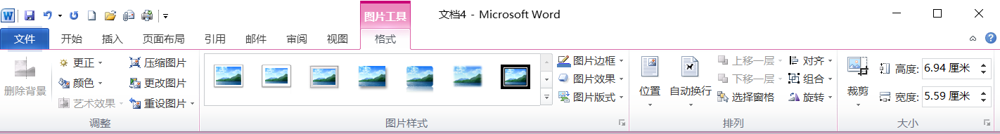
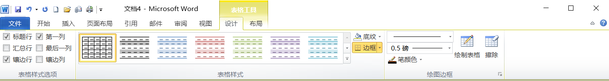
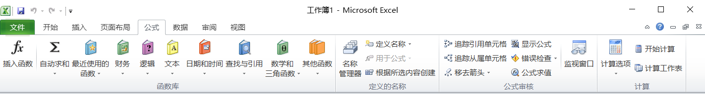

# 第一章

1. 请简述计算机发展的各个阶段及发展
   - 第一代为**电子管计算机**采用的主要电子元件是**电子管**。使用**机器语言**和**汇编语言编制程序**，用于事务处理。
   - 第二代为**晶体管计算机**所采用的主要电子元件是**晶体管**，这一时期出现了**管理程序及某些高级语言**。用于事务处理。
   - 第三代为**集成电路计算机**采用的主要电子元件是**中小规模集成电路**，出现**操作系统 ，出现了分时操作系统和实时操作系统等**。
   - 第四代为**大规模、超大规模集成电路计算机** 所采用的主要电子元件是**大规模、超大规模集成电路**，出现了**微型计算机及巨型计算机等多种类型的计算机**，并向**微型化、巨型化、智能化和多媒体化方向发展**。
2. 请简述计算机未来发展趋势
   - **巨型化**
   - **微型化**
   - **网络化**
   - **智能化**
   - **多媒体化**
3. 计算机的分类有哪些
   - 根据**处理的对象**划分：**模拟计算机，数字计算机，数模混合计算机**
   - 根据**计算机的用途**划分：**通用计算机，专用计算机**
   - 根据**计算机的规模**划分：**巨型机、大型机、中型机、小型机、微型机**
   - 根据**计算机的网络位置**划分：**工作站，服务器**
4. 计算机的特点
   1. **运算速度快**
   2. **运算精度高**
   3. **逻辑判断能力强**
   4. **工作自动化、自动化程度高**
   5. **存储容量大**
   6. **通用性强 可靠性高**
5. 计算机的应用
   - **科学计算**：**天气预报、航空科技、人造卫星、地震预防**
   - **数据处理**：**办公自动化、档案管理、物资管理**  **资料检索** 
   - **过程控制**：**工业自动化生产、流水线** 
   - **计算机辅助系统**：计算机辅助设计CAD，计算机辅助制造CAM，计算机辅助测试CAT，计算机辅助教学CAI
   - **人工智能**：专家系统、机器人
   - **网络通讯**
   - **多媒体**
6. 请简述冯诺依曼原理
   - 计算机是由**五大部件**组成：**控制器，运算器，存储器，输入设备，输出设备**
   - 计算机使用**二进制**
   - 计算机中核心思想是**存储程序**
7. 计算机系统的组成 请详细说明
   - 计算机系统包括**计算机硬件系统**和**计算机软件系统**
   - 硬件系统包括：
     - **运算器**：**算数逻辑单元**
     - **控制器**：**指挥和控制各部件协调工作**
     - **存储器**：**存储数据和程序的部件**，分为**内存和外存**
     - **输入设备**：**接受用户信息**，转化为**计算机能够接收**和**识别的数据**
     - **输出设备**：将**计算机中的数据转换**为**人或者其他设备接受的形式并进行输出**
   - 软件系统包括：
     - **系统软件**：**操作系统**
     - **应用软件**：是为某种应用或**解决某类问题所编制的应用程序**
8. 组装一台计算机需要那些硬件
   - **主板，CPU，内存条，硬盘，机箱，电源，显示器，鼠标，键盘，显卡**
9. 硬件系统中各个部件的功能
   - **运算器**：由**算术逻辑运算单元**和**寄存器组成**
   - 控制器：**指挥和控制各部件协调工作**
   - 存储器：**存储数据和程序的部件**，分为**内存和外存**
   - 输入设备：**接受用户信息，转化为计算机能够接收和识别的数据 如：鼠标、键盘**
   - 输出设备：**将计算机中的数据转换为人或者其他设备接受的形式并进行输 如：显示器等**
10. 操作系统的定义及功能
    - 操作系统的定义为：**管理**和管理**计算机硬件和软件资源**
    - 计算机操作系统的**功能**
      - **CPU管理**
      - **设备管理**
      - **存储器管理**
      - **进程管理**
      - **文件管理**
11. 请简述计算机中的语言处理程序
    - 计算机的语言处理程序 是指**将计算机语言翻译成计算机能读懂的程序** 
    - **机器语言**：是**二进制**组成是可以由计算机**直接执行** 
    - **汇编语言**：用一些**符号代替二进制**，需要**汇编程序**才能被计算机**执行**
    - 高级语言：
      - **解释型**：**解释完**可以**直接CPU执行**不生成目标程序
      - **编译型**：会**生成目标程序**执行**速度快**
12. 计算机的性能指标
    - **主频**：又叫做**时钟频率**CPU**单位时间内发出的脉冲数** ，**单位（HZ）**
    - **字长**：计算机**一次能处理的二进制位数**
    - **运算速度**：**计算机每秒能执行的指令行数**单位 **MIPS**
    - **内存容量**：**内存容量越大，运算速度越快**
    - **存储周期**：**存取周期越小，运算速度越快**
13. 计算机的层次结构
    - **裸机** 
    - **系统软件**
    - **应用软件**
    - **应用程序和文档** 
14. 计算机系统总线有哪些功能是什么
    - **AB地址总线**：**传送地址码**
    - **CB控制总线**：**传递CPU控制命令**
    - **DB数据总线**：**传递数据信息**
15. 多媒体的特征
    - **数字性**
    - **多样性**
    - **集成性**
    - **实时性**
    - **交互性**
16. 多媒体的六大元素
    - **文本，图形，图像，音频，视频，动画**
17. 信息安全的定义和目标
    - **保护**计算机**软件**，**硬件**，**数据信息**的资源等
18. 计算机病毒的定义特点和分类
    - 计算机病毒的**特点**有 **破坏性 传染性 寄生性 潜伏期 可激活性 隐蔽性**
    - 计算机病毒的**分类** 
      - 按**传播方式**：系**统型病毒 ，文件型病毒，混合型病毒**
      - 按**危害程度**：**良性病毒，恶性病毒**
19. 防火墙的定义即功能
    - 防火墙是**因特网与内部网之间所采取的一种安全措施**，是**软件或者软件与硬件设备的结合**
    - 防火墙的功能：
      - **记录**内部网络和计算机与外部网络进行通信的**安全日志**
      - **限制内部网络**用户**访问某些特殊站点**，**防止**内部网络的重要**数据泄露**
      - **监控**进出内部网络和计算机的**信息**，**保护**其**不被非法访问或破坏**
20. 计算机病毒的清除方式有哪些
    - 常用/主要有两种方式
      - 1.**磁盘格式化**，对整个磁盘进行格式化。可以彻底杀毒
      - 2.**采用杀毒软件**，对磁盘进行全面扫描，然后进行全面杀毒工作
      - 3.找到磁盘中的病毒文件，进行删除

## 计算机系统

1. 简述计算机的定义，并写出计算机的工作原理。
   - **定义**：计算机是一种**能按照事先存储的程序**，**自动、高速**地进行**大量数值计算**和**各种信息处理**的**现代化智能电子装置**。
   - 工作**原理**：存储程序和程序控制
2. 简述计算机的特点及未来计算机的发展趋势。
   - **特点**：**全自动化工作、运算速度快、计算精度高、逻辑判断能力强、存储容量大等**
   - 发展**趋势**：**巨型化、微型化、智能化、网络化、多媒体化等**
3. 常用的office软件属于计算机应用中的哪一类？并至少写出其他四类常见的计算机应用。
   - 常见的office属于**信息处理**
   - 常见的**计算机应用**还有：**科学计算，过程控制，计算机辅助系统，人工智能，网络通信，多媒体等**
4. 常用的微型计算机又称为PC机，请写出PC对应的英文，并简述按规模和性能，计算机可划分为哪几类
   - PC对应的**英文：Personal Computer**
   - 按照**规模和性能**：**巨型机，大型机，中型机，小型机，微型机**
5. 请写出计算机系统包括哪两部分，并简述二者之间的关系
   - 计算机系统包括**硬件系统**和**软件系统**两部分
   - **硬件**是**软件**赖以**工作的物质基础**，**软件**的**正常工作**是**硬件发挥作用的唯一途径**，**二者相辅相成**、互为依托、**缺一不可**。
6. 简述CPU的两个主要构成部件，并写出各部件的功能
   - cup的主要组成部件为运算器和控制器
   - **运算器的功能**：进行**算数运算和逻辑运算**
   - **控制器的功能**：**控制**和**指挥**计算机**各部件协调工作**
7. 简述主机主要包括哪些部件，并写出各自的功能。
   - 主机包括**CPU和内存**
   - CPU：**主要进行算数运算和逻辑运算，并且能够指挥计算机各部件协调工作等**
   - 内存：**用于暂时存放CPU中的运算数据，主要负责与CPU和外存交换数据，是外存与CPU进行沟通的桥梁**
8. 简述存储器的功能和分类。
   - 存储器是**存放**各种**数据**和**程序**的装置，是计算机的**记忆部件**
   - 分为内存和外存
9. 简述Cache的中文含义及其主要作用。
   - Cache的中文**含义**：**高速缓存存储器**
   - 主要作用：**解决CPU与内存速度不匹配的问题**
10. 与内存相比，外存有哪些特点；并写出计算机中常见的外存有哪些？
    - 与内存相比，**外存容量大，存取速度慢。存储周期长，价格低**，**只能直接与内存交换数据，不可以直接与CPU交换数据**
    - **常见**的外存有：**硬盘，软盘，光盘，U盘等**
11. 简述计算机中输入设备和输出设备的工作原理，并写出常见的输入设备和输出设备
    - 输入设备的原理：**接受用户输入的信息**，并**转化**成**计算机能够接收和识别的数据**。常见的输入设备有：**鼠标，键盘，条码阅读器，扫描仪**
    - 输出设备的原理：**将计算机中的数据转化**为**人和其它设备**能够**接受的形式**，并**进行输出**。常见的输出设备有：**绘图仪，打印机，屏幕**
12. 简述微型计算机必有的输出设备，并写出衡量此设备的主要性能指标
    - 微型计算机必有的输出设备：**显示器**
    - 主要性能指标：**点距，分辨率，扫描频率，颜色位数，刷新率等**
13. 简述系统软件的主要作用，并写出其主要构成部分
14. 简述操作系统的定义及主要功能。
15. 请写出计算机语言包括哪些，常用的语言处理程序。
16. 请写出高级语言书写的程序称为什么？并简述高级语言的语言处理程序有哪些，各有何特点？
17. 简述计算机中总线的含义，并写出按照总线中传输的信息分类，总线分为哪几类？
18. 请简述指令的含义和构成，并写出指令的执行过程。
19. 简述计算机程序的含义，并写出计算机的工作过程。
20. 简述冯诺依显原理的三点基本思想。
21. 汉字字符和西文字符在计算机内存储方式？

## 多媒体计算机病毒

1. 简述媒体的两重含义，并写出多媒体计算机中处理的媒体常包括哪些？
2. 简述多煤体的定义及主要特征。
3. 简述多媒体技术的含义，并写出多媒体技术中音频信号数字化的主要步骤。
4. 简述多煤体计算机的含义，并写出多媒体计算机由哪两部分构成。
5. 简述计算机病毒传播最广的媒介是什么？并写出三种防范计算机病毒的方法？

# 第二章

1. 将c盘中我要上本科文件夹，复制，到我一定能考上
   - 双击计算机打开c盘选中我要上本科文件夹**单击右键**，**选择复制**打开c盘，我一定能考上文件夹**右键粘贴**
2. 将c盘中我要上本科文件夹，移动，到我一定能考上
   - 双击计算机打开c盘选中我要上本科文件夹**单击右键选择剪切**打开c盘，我一定能考上文件夹**右键粘贴**
3. 将c盘中我要上本科文件夹重命名到我一定能考上
   - 双击计算机打开c盘选中我要上本科文件夹**单击右键**选择**重命名**命名为我一定能考上
4. 将c盘中我要上本科文件夹属性设置为隐藏
   - 双击计算机打开c盘选中我要上本科文件夹**单击右键属性**，**设置为隐藏**单击确认
5. 按详细信息查看c盘文件
   - 双击计算机打开c盘在，**在空白处右键单击**，**选择查看，详情信息**
6. 对c盘文件按项目类型排序
   - 双击计算机打开c盘，**在空白处右键单击**，**选择排序方式，项目类型**
7. 更改回收站-大小为3000mb
   - 选择回收站，**单击右键**，**选择属性**，**自定义大小**，**最大值为3000mb**
8. 将我要上本科文件夹放入回收站并清空
   - 选中我要上本科文件夹，**单击右键**，**选择删除**，**选择回收站**，**单击右键**，**选择清空回收站**
9. 在c盘中创建“我要天天学习计算机”文件夹、
   - 双击计算机打开c盘，**在空白处单击右键选择新建**，**文件夹**，命名为我要天天学习计算机
10. 在c盘中为D盘我要天天学习计算机.txt文件创建快捷方式命名为天天学习计算机
    - **双击**计算机**打开c盘**，**文件菜单，新建，快捷方式**，**单击浏览**，**选择**D盘我要天天学习计算机.txt，**下一步**，**命名为**天天学习计算机，**单击完成**
11. 在桌面为D盘我要天天学习计算机.txt文件创建快捷方式
    - **双击**计算机**打开**D盘选中我要天天学习计算机.txt，**单击右键选择发送到**，**桌面快捷方式**
12. 在D盘“我计算机能考100分”文件夹搜索以A开头第四个字母为M的word文件并移动到c盘“我要好好写作业”文件夹
    - 双击计算机打开D盘我计算机能考100分文件夹，**在搜索栏中输入**，A??M*.docx，**在查询结果中Ctrl+a全选**，**单击右键剪切**，进入到c盘“我要好好写作业”文件夹，**单击右键，粘贴**
13. 隐藏c盘“我要刷抖音”的word文件
    - 打开c盘，**选择工具菜单**，**文件夹选项**，**单击查看**，**设置隐藏文件不可见**
    - 双击计算机打开c盘选中我要刷抖音.word文件，**单击右键选择属性**，**设置为隐藏单击确认**
14. 隐藏c盘“我要刷抖音”的word文件扩展名
    - 打开c盘，选择**工具菜单，文件夹选项，单击查看，设置隐藏扩展名**
15. 更改桌面主题为建筑
    - **桌面空白处单击右键**，**选择个性化**，**在弹出的窗口设置主题为建筑**
16. 更改屏幕分辨率为1920X1080
    - **桌面空白处单击右键**，**选择屏幕分辨率**，**在弹出的窗口设置分辨率为1920X1080**
17. 为附件中的**创建桌面快捷方式
    - **打开开始菜单**，**选择所有程序**，**附件**，**右击...图标**，**选择发送到，桌面快捷方式**
18. 对D盘进行磁盘碎片整理
    - **单击开始，所有程序，附件，系统工具，双击打开磁盘碎片整理，，选择D盘，分析磁盘，磁盘碎片整理**
19. **切换鼠标左键右键功能（控制面板都可以这么答）**
    - **单击开始菜单**，**单击控制面板**，**切换查看方式为大图标**，**单击鼠标**，**选择鼠标键选项卡**，**鼠标配置设置切换主要和次要按钮单击确定**

# 第三章

1. 将正文中“打游戏”替换为“学计算机”且文字为红色
   - **单击开始选项卡**，**选择编辑组的替换**，**设置查找内容为“打游戏”**，**替换内容为学计算机**，**选中替换内容**，**选择更多**，**格式**，**设置字体颜色为红色**，**选择全部替换**
2. 将正文第三段文字设置为黑体加粗三号并加下划线
   - 选中正文第三段，**单击右键选择字体对话框**，**选择字体选项卡**，设置为黑体，加粗，三号，下划线
3. 将正文第二段设置为黑色边框1.5磅即黄色底纹
   - 选中正文第二段，**单击开始选项卡**，**段落组**，**选择边框**，**打开边框和底纹对话框**，**设置**为黑色边框1.5磅即黄色底纹
4. 将正文第五段设置为悬挂缩进2字符，行距为20磅
   - 选中正文第五段，**单击开始选项卡**，**段落组**，**打开段落对话框**，**缩进和间距选项卡**，**设置**为悬挂缩进2字符，行距固定值，设置值为20磅
5. 将正文第一段格式，复制到第三段
   - 选中正文第一段，单击**格式刷**，使用格式刷把第三段刷为相同格式
6. 将正文第一段文字，设置为标题样式
   - 选中正文第一段，**单击开始选项卡**，**样式组**，**单击标题样式**
7. 将正文第三段设置为5栏，栏宽40字符，间距2字符，并设置分割线
   - 选中正文第三段，**单击页面布局选项卡**，**页面设置组**，**分栏**，**单击更多分栏**，**打开分栏对话框**，**设置**栏数位5，栏宽40字符，间距2字符，并设置分割线
8. 将正文第三段后**分节符删除**
   - **单击状态栏右下角草稿视图按钮**，**切换到草稿视图**，**选中正文第三段后分节符，按delete键删除**
9. 在正文第二段结尾处插入图片库中“考拉.jpg”并设置文字环绕为四周型
   - 将插入点定位到第二段结尾处，**单击插入选项卡**，**插图组**，**图片**，**选择图片库中“考拉.jpg”**，**单击图片工具格式选项卡**，**排列组**，**文字环绕设置为四周型**
10. 正文空白处插入文本框
    - **单击插入选项卡**，**文本组**，**文本框，绘制文本框**，**在正文空白处拖动并绘制文本框**
11. 在正文空白处插入5行3列表格，并将第一行合并
    - 将插入点定位到在正文空白处，**单击插入选项卡**，**表格组**，**表格**，**拖动选择5行3列表格**，**选择表格第一行**，**单击表格工具布局选项卡**，**合并组**，**合并单元格**

# 第四章

- 

1. 设置数学成绩大于等于90分且浅红色
   - 选中D2-D6，**单击开始选项卡**，**样式组**，**条件格式**，**突出显示单元格规则**，**设置**为大于等于90，填充浅红色
2. 给A5单元格添加批注内容为成绩错误
   - 选中A5单元格，**单击审阅选项卡**，**批注组**，**新建批注**，**批注内容为成绩错误**
3. 计算所有同学的平均分
   - 双击G2单元格**，输入=average(C2:E2)**，**按回车键确定**，**拖动G2单元格右下角填充柄到G6单元格**
4. 计算所有同学的总分
   - 双击F2单元格，**输入=Sum(C2:E2)**，**按回车键确定**，**拖动F2单元格右下角填充柄到F6单元格**
5. 计算语文最高分，数学最低分
   - 双击H2单元格，**输入=max(C2:C6)**，**按回车键确定**，双击H2单元格，**输入=min(D2:D6)**，按回车键确定
6. 将总分排序，次序为降序次要关键字为语文升序
   - 选中A1:G6单元格区域，**单击数据选项卡**，**排序和筛选组**，**排序**，**设置主要关键字**为总分**次序**为降序，**次要关键字为**语文**次序**为升序
7. 用自动筛选出语文成绩大于等于90分的同学
   - 选中A1:G6单元格区域，**单击数据选项卡**，**排序和筛选组**，**筛选**，**单击语文字段的筛选器箭头**，**设置数字筛选大于等于90**
8. 用高级筛选出语文大于等于90并且数学小于等于90的同学（条件字段复制到第九行）
   - **选中A1:G1单元格区域**，**右键复制到第九行**，**在C10单元格输入>=90**，在**D10单元格输入<=90**，**单击数据选项卡**，**排序和筛选组**，**单击高级筛选**，**设置列表区域为A1:G6**，设**置条件区域为A9:G10**，**单击确定完成筛选**
9. 汇总出男生女生英语平均分
   - **单击性别字段任意单元格**，**单击数据选项卡**，**排序筛选组**，**排序**，**设置主要关键字为性别**，**次序为降序**，**单击数据选项卡**，**分级显示组**，**分类汇总**，**设置分类字段**为性别，**汇总方式**为平均值，**选定汇总项**为英语
10. 插入三维柱形图更改图表标题为学生成绩表
    - 选中A1:G6单元格区域，**插入选项卡**，**图表组**，**单击柱形图**，**三维柱形图**，**单击图表工具布局选项卡**，**标签组**，**图标标题**，**设置为学生成绩表**

# 第五章

1. 将演示文稿中，第二张幻灯片的版式设置为“比较”
   - 选中第二张幻灯片，**单击鼠标右键**，**在弹出的快捷菜单中选择版式**，**选择“比较”**
2. 在幻灯片浏览视图下，在第二张幻灯片后插入一张图片
   - **单击视图选项卡**，**选择演示文稿视图组**，**选择幻灯片浏览视图**，**将插入点定位至第二张幻灯片之后**，**单击鼠标右键**，**在弹出的快捷菜单中选择“新建幻灯片”**
3. 将演示文稿的第一张幻灯片进行隐藏
   - 选中第一张幻灯片，**单击鼠标右键，选择隐藏幻灯片**
4. 在第二张幻灯片空白处中插入形状“笑脸”并设置动画为浮入
   - 选中第二张幻灯片，**单击插入选项卡**，**插图组**，**形状**，**选择笑脸**，**在空白处拖动并绘制笑脸**。**选中笑脸**，**选择动画选项卡，动画组，设置动画为浮入。**
5. 将整个演示文稿的主题设置为波形主题
   - **选中所有幻灯片**，**单击设计选项卡**，**主题组**，**右击波形主题，选择应用于所有幻灯片**
6. 在第三张幻灯片插入动作按钮“信息”设置超链接，链接到最后一张幻灯片
   - 选中第三张幻灯片，**单击插入选项卡，插图组，选择形状，选择动作按钮“信息”拖动并绘制，设置超链接链接到最后一张幻灯片**
7. 设置幻灯片放映类型为观众自行浏览
   - **单击幻灯片放映选项卡**，**设置组**，**设置幻灯片放映**，**设置放映类型为观众自行浏览**
8. 将演示文稿打包成CD
   - **单击文件选项卡**，**选择保存并发送**，**选择将演示文稿打包成CD**，**选择打包成CD**，**在弹出的对话框中选择复制到CD**
9. 设置第三张幻灯片的背景样式为样式3
   - 选中第三张幻灯片，**单击设计选项卡**，**背景组，选择背景样式，右击样式3，选择应用于所有幻灯片**
10. 设置第二张幻灯片的切换方式为淡出
    - 选中第二张幻灯片，**单击切换选项卡，切换到此幻灯片组，选择淡出**
11. 将第一张幻灯片中的灯塔图片的动画设置为擦除，设置效果选项自上方
    - 选中第一张幻灯片中的灯塔图片，**单击动画选项卡，动画组，选择擦除**，**设置效果选项**为自上方
12. 在第二张幻灯片之后直接复制一张幻灯片
    - 选中第二张幻灯片，**单击鼠标右键，选择复制幻灯片**
13. 将第三张幻灯片的背景样式设置为熊熊火焰
    - **选中第三张幻灯片，单击设计选项卡，背景组，背景样式，设置背景格式，填充，预设颜色，设置背景为“熊熊火焰”，单击关闭按钮。**
14. 在第二张幻灯片后插入一张幻灯片并设置版式为“仅标题”
    - **将插入点定位在幻灯片/大纲窗格中第二张幻灯片之后**，**单击鼠标右键选择新建幻灯片**。选中新建的幻灯片，**单击鼠标右键选择版式**，**设置**版式为“仅标题”
15. 在第一张幻灯片中插入一个5行3列的表格
    - 选中第一张幻灯片，**单击插入选项卡，表格组，表格，设置5行3列表格。**
16. 为第一张幻灯片中的“考拉”图片插入批注“我不要玩，我要学习”
    - 选中第一张幻灯片“考拉”图片，**单击审阅选项卡，批注组，新建批注，设置批注内容为“我不要玩，我要学习”**
17. 使用样本模板“都市相册”新建一个演示文稿
    - 打开PowerPoint2010程序，**单击文件选项卡**，**新建**，**选择样本模板**，**设置**“都市相册”模板。
18. 在第二张幻灯片插入音乐库中“sleep away.Mp3”音乐设置“循环播放，直到停止为止”
    - 选中第二张幻灯片，**单击插入选项卡，媒体组，音频**。**文件中的音频**，选择音乐库中“sleep away.Mp3”，选中插入后的音乐图标，单击**音频工具播放选项卡**，音频选项设置**“循环播放，直到停止为止**”
19. 在第三张幻灯片中空白处插入横排文本框/竖排文本框，并输入“我能考100分”
    - 选择第三张幻灯片，**单击插入选项卡，文本组，文本框，选择横排文本框/竖排文本框**，**在空白处，拖动并绘制。输入**“我能考100分”
21. 第一张幻灯片中的考拉图片形状裁剪为“心形”
    - 选中第一张幻灯片中的考拉图片**，单击图片工具格式选项卡**，**大小组，裁剪，裁剪形状为“心形”**
22. 为第一张幻灯片中“我就是最棒的”设置超链接，链接到www.wenshengedu.cn。
    - 选中第一张幻灯片中“我是最棒的文字”，**单击插入选项卡，链接组，超链接，选择现有的文件或网页**，**设置**地址为www.wenshengedu.cn
23. 设置幻灯片放映范围为第7-18张
    - **单击幻灯片放映选项卡，设置组，设置幻灯片放映，设置放映范围为第7-18张**
24. 打印幻灯片第3,6,9,11-14，设置打印颜色为“纯黑白”
    - **单击文件选项卡，打印，设置打印范围为3,6,9,11-14，并设置打印颜色为“纯黑白”**
26. 在第三张幻灯片插入动作按钮“回到首页”设置超链接，链接到第一张幻灯片
    - 选中第三张幻灯片，**单击插入选项卡，插图组，选择形状**，**选择动作按钮“回到首页”拖动并绘制**，**设置超链接链接到第一张幻灯片**
29. 设置幻灯片放映类型为演讲者放映
    - **单击幻灯片放映选项卡，设置组，设置幻灯片放映，设置放映类型为演讲者放映**
33. 将第三张.第五张、第七张幻灯片的背景样式设置为红日西斜
    - 选中第三张幻灯片，**按住CTRL键选择第五张和第七张幻灯片单击设计选项卡**，**背景组**，**背景样式**，**设置背景格式**，**填充，预设颜色，设置背景为“红日西斜”**，**单击关闭按钮**。
34. 在第二张幻灯片插入音乐库中“直到世界尽头.Mp3”音乐设置“单击播放”
    - 选中第二张幻灯片，**单击插入选项卡，媒体组，音频**。**文件中的音频**，**选择音乐库中**“直到世界尽头.Mp3”，**选中插入后的音乐图标**，**单击音频工具播放选项卡**，**音频选项设置“单击播放”**
35. 为第一张幻灯片中“考拉”设置超链接，链接到桌面“我在努力学习.Docx”。
    - 选中第一张幻灯片中“考拉”，**单击插入选项卡，链接组，超链接**，**选择现有的文件或网页**，**设置桌面“我在努力学习.Docx”**

# 第六章

1. 简述网络协议的概念及要素
   - **网络协议为**计算机网络中**进行数据交换**而**建立的规则、标准或约定的集合**。
   - 网络协议通常有**三个要素**：
     ①**语法**：语法是**用户数据与控制信息**的**结构与格式**，以及数据出现的顺序。
     ②**语义**：语义是**解释控制**信息**每个部分的意义**。
     ③**时序**：时序是对**事件发生顺序的详细说明**。（也可称为“同步”）
   - **常见的协议有ISO制定的OSI七层协议模型**，以及**互联网TCP/IP协议**。
2. OSI七层模型的层次是什么？包括哪些设备
   - ISO组织提出的标准OSI参考模型有**七层**， 
     （1）**物理层    设备：中继器、集线器以及线路**
     （2）**数据链路层   设备：网桥和交换机**
     （3）**网络层    设备：路由器**
     （4）**传输层	设备：网关、终端设备**
     （5）**会话层	设备：网关、终端设备**
     （6）**表示层	设备：网关、终端设备**
     （7）**应用层	设备：网关、终端设备**
3. 简述计算机的网络发展阶段。
   - 第一阶段：**诞生阶段**----**远程终端联机阶段**：**主要是实现主机和终端互联。**
   - 第二阶段：**形成阶段**----**形成了ARPANET**：ARPANET**将计算机网络分为通信子网和资源子网**
   - 第三阶段：**互联互通阶段-**--**出现了OSI体系结构和TCP/IP体系结构**
   - 第四阶段：**高速网络技术阶段**—**典型代表internet**
4. 计算机网络的定义
   - 计算机网络是**分布在不同地点**的**具有独立功能**的**多个计算机**系统用**通信设备互相连接**起来，**在 网络软件的支持下**，**实现**彼此之间的**数据通信**和**资源共享**的系统。
5. 计算机网络的功能有哪些
   - **数据通信**
   - **资源共享**
   - **分布式处理**
   - **提高可靠性**
   - **负载均衡**
   - （答出前三条即可）
6. 简述计算机网络的分类
   - 按照**地理范围**分：**分为局域网（LAN）城域网（MAN）广域网（WAN**）
   - 按照**信息传输方式**分：**电路交换、报文交换。分组交换**
   - 按照**拓扑结构**分：**星型、环型、树型、总线型、网状型**
   - 按照**用途**分：**分为专用网络和通用网络**
7. 简述局域网中的传输介质
   - 传输介质分为**有线**和**无线**两大类
   - 有线传输介质有：**双绞线、同轴电缆和光纤**
   - 无线传输介质有：**红外线、激光、卫星和微波**
8. 请简述调制解调器的功能
   - 调制解调器是**拨号上网必备的设备之一。**
   - 调制解调器**完成的是数字信号和模拟信号的相互转换**，其中：
     - **调制**的功能是将**数字信号变为模拟信号。**
     - **解调**的功能是将**模拟信号变为数字信号。**
9. 简述DNS域名系统
   - 域名：**是IP地址的字母表示形式。**
   - 域名的格式为：**主机名.三级域名.二级域名.顶级域名**
   - DNS:**是域名和IP地址的映射形成的一个分布式数据库**。**用于将域名转变为IP地址**
10. Internet的介入方式有哪些
    - **ISP Internet服务提供商是接入Internet的桥梁。**
    - **接入方式有以下4种**
      1.**PSTN（公共电话交换网接入）**
      2.**ADSL（非对称数字用户环路接入）**
      3.**光纤接入**
      4.**局域网或无线局域网接入**
11. 什么是URL它的格式是什么？
    - URL**是统一资源定位符**，**俗称网址**，是信息资源**在网上什么位置**及**如何定位寻找的统一描述方法**
    - URL的**格式**为：**协议：//主机域名（或IP地址）/路径/文件名**
12. 请简述FTP协议
    - **FTP协议叫做文件传输协议**，主要是**进行文件的上传和下载的协议。**
    - **上传**：就是**将文件从自己的计算机的复制到远程的主机上**。
    - **下载**：就是**将文件从远程主机复制到自己的计算机上**。
