# 计算机基础

## 计算机基础

### 1.计算机的诞生与发展

1. 计算机的定义

   计算机是一种按照事先**存储程序(工做原理)**，自动、高速地进行大量的**数值计算**(最早的)和各种**信息处理**(最广泛)的现代化智能电子装置

2. 计算机的诞生

   第一台计算机-ENIAC(电子数字积分计算机）

   - 1946年2月、美国
   - 电子管
   - 数值计算
   - 5000次每秒

3. 计算机发展史上重要的人物

   - 英国科学家：阿兰·图灵
   - 图灵测试
   - 图灵奖
   - 冯·诺依曼-计算机之父
   - 计算机的体系结构由运算器、控制器、存储器、输入设备、输出设备构成
   - 计算机采用二进制
   - 存储程序

4. 计算机的发展史

   - |        | 时间          | 电子元器件（逻辑元件）               | 特征                                 |
     | ------ | ------------- | ------------------------------------ | ------------------------------------ |
     | 第一代 | 1946年-1957年 | 电子管                               | **数值计算**、机器语言、汇编语言     |
     | 第二代 | 1958年-1964年 | 晶体管                               | **信息处理**、**操作系统**、高级语言 |
     | 第三代 | 1965年-1970年 | 中小规模集成电路                     | 结构化程序设计、半导体存储材料       |
     | 第四代 | 1971-至今     | 大规模和超大规模集成 电路 (集成度高) | 向**巨型机**和**微型机**两个方向发展 |

5. 微型计算机的发展

   - 微型计算机又称为PC机(Personal Computer,个人计算机)
   - 世界上第一个微处理器芯片Intel4004   **1971年，美国intel公司**
   - 微处理器的特点：将运算器和控制器做在一个集成电路芯片上
   - 微型计算机发展是以**微处理器的**发展为特征的
   - 如：Pentium 酷睿i系列家族等

6. 计算未来发展趋势

   - 巨型化（功能强）
   - 微型化（集成度高）
   - 智能化（人工智能）
   - 网络化（上网）
   - 多媒体化（声音，视频，动画）

### 2.计算机的特点，分类，应用

1. 特点

   1. 全自动工作（自动化程度高）
   2. 运算速度快
   3. 运算精度高
   4. 逻辑判断能力强
   5. 存储容量大
   6. 通用性强、可靠性高

2. 分类

   | 分类方式              | 具体类型                                       |
   | --------------------- | ---------------------------------------------- |
   | 按计算机处理数据类型  | **数字计算机，模拟计算机，数模混合计算机** *   |
   | 按计算机使用范围/用途 | 通用计算机，专用计算机                         |
   | 按计算机的规模和性能  | **巨型机、大型机、中型机、小型机、微型机**  ** |
   | 网络中的计算机        | **工作站、服务器** *                           |

3. 应用

   1. **科学计算（数值计算)---最早的应用领域**

      **天气预报、航空科技、人造卫星、地震预防** **

   2. **数据处理（信息处理)---最广泛的应用领域**

      **办公自动化、档案管理、物资管理**  **

   3. **实时控制（过程控制）**

      **工业自动化生产、流水线** **
      
   4. 计算机辅助系统  **

      - **计算机辅助设计---CAD,Computer Aided Design**
      - **计算机辅助制造--CAM,Computer Aided Manufacturing**
      - **计算机辅助测试--CAT,Computer Aided Test**
      - **计算机辅助教学--CAI,Computer Aided Instruction**

5. 人工智能AI  专家系统、机器人

6. 网络通信

7. 多媒体

### 3.计算机系统组成与工作原理

1. 系统组成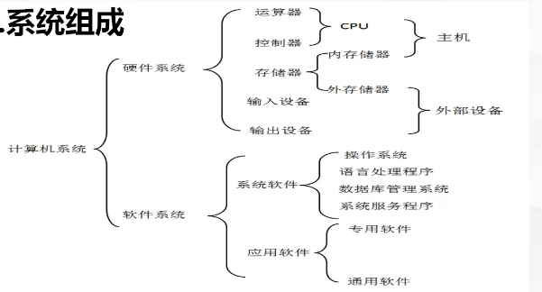

2. 计算机系统层次结构

   - **应用程序文档---应用软件---软件系统---裸机**

   - 裸机：只有硬件的计算机，没有安装任何软件的计算机
   - 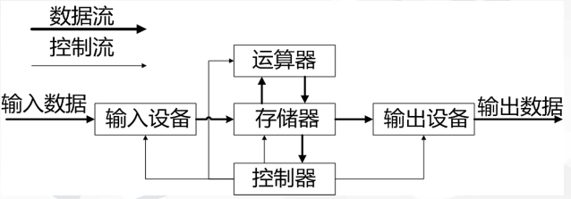
   - 控制器
     1. 控制器通过指令控制输入设备
     2. 控制器通过指令控制运算器处理设备
     3. 控制器通过指令控制输出设备输出数据

3. 计算机工作原理

   计算机工作原理（又称冯·诺依曼原理)---**存储程序**
   冯·诺依曼机的主要特点

   1. 计算机五大部件：运算器、存储器、控制器、输入设备、输出设备

   2. 计算机内部采用二进制表示数据和指令。

      **采用二进制的优点：与逻辑电路相匹配，易于表示，容易实现、适用于逻辑运算；运算简单；可靠性高**  *

   3. “存储程序”---**全自动工作，自动化程度高**

4. 指令、程序及执行过程

   1. 指令：计算机执行某个操作的命令
   2. 程序：指令序列
   3. 指令系统：一台计算机所有指令的集合
   4. 计算机工作的过程：
   5. 开始→取出指令→分析指令→执行指令→停止

### 4.微型计算机硬件系统

1. 中央处理器

   - 中央处理器(CPU,):也叫微处理器，是计算机系统的核心部件主要由运算器、控制器、寄存器和Cache(高速缓冲存储器组成)

   - 组成：

     1. 运算器：（ALU)算术逻辑单元（核）**算术运算   逻辑运算**

     2. 控制器：指挥和控制各部件协调工作

        指令：操作码+地址码（操作数）

     3. 寄存器：临时存放操作数和操作结果
   
2. 计算机系统使用二进制系统

   - 二进制运算

   - 二进制加法运算

     ```
     0+0=0
     0+1=1
     1+0=1
     1+1=10
     ```

   - 二进制减法运算

     ```
     0-0=0
     1-0=1
     0-1=1（借一当二)
     1-1=0
     ```

   - 例子

     ```
     求101110、101的和与差（二进制)
     1001110+101=1010011
     1001110-101=1001001
     ```

   - 二进制系统的逻辑运算        三种基本逻辑关系与或非

     | a    | b    | anb  与 | aUb  或 | a^—— ^  非 |
     | ---- | ---- | ------- | ------- | ---------- |
     | 1    | 1    | 1       | 1       | 0          |
     | 1    | 0    | 0       | 1       | 0          |
     | 0    | 1    | 0       | 1       | 1          |
     | 0    | 0    | 0       | 0       | 1          |

   - 例子

     ```
     求101110、101的逻辑与和逻辑或（二进制）
     101110与101=0000100
     101110或101=1001111
     ```

3. 存储器

   - 定义：存储器是用来**存储**数据和**程序**的部件，分为**内存储器**和**外存储器**。是计算机当中的记忆部件

     存储单元当中存放的是**数据**和**指令**  每个存储单元可以存储8位2进制

   - 存储容量

     1. 位（bit,b)是计算机存储设备**最小的单位**  1B=8b
     2. 字节（Byte,B)是计算机处理数据的**基本单位**，计算机存储容量的基本单位。
     3. 容量换算
        1. 1B=8bit
        2. 1KB=2^10^B=1024B
        3. 1MB=2^20^B=1024KB
        4. 1GB=2^30^B=1024MB
        5. 1TB=2^40^B=1024GB

   - 计算机存储器的分类
     **内存（主存)**、**外存（辅存)**

   - 内存

     1. 定义：直接与CPU交换信息的存储器称为内存。
     2. 内存分类
        - **ROM**：只读存储器；只能读：内容由厂家一次写入并且永久保存下来。断电后，内容不消失（开机程序）
        - **RAM**:随机存储器；可读可写；断电后存储内容丢失。
        - **Cache**:高速缓冲存储器；解决内存和CPU速度不匹配的问题，提高整体的运行速度。
          注意：Cache位于CPU

   - 外存

     1. 外存：用于长期保存数据，断电后内容不消失

     2. 外存和内存的比较

        | 分类 | 是否可以与cpu直接交换数据 | 存取速度 | 存取周期 | 容量 | 价格 |
        | ---- | ------------------------- | -------- | -------- | ---- | ---- |
        | 内存 | 是                        | 快       | 短       | 小   | 高   |
        | 外存 | 否                        | 慢       | 长       | 大   | 低   |

        说明：存取周期是指连续两次读操作（或者写操作）所需的最小时间间隔

     3. 常用的外存：硬盘、软盘、光盘、U盘等

        - (机械)硬盘

          1. **机械硬盘注意防震动**

          2. 硬盘的读取速度与**容量**无关，与接口类型、**转速**有关

          3. 硬盘盘符从C盘开始，一个电脑可以有1/多个硬盘个硬盘,可以有1/多个分区

          4. 基本概念

             - **面数**

               **双面存储（0面，1面)**

             - **磁道**数

               同心圆形式存储

               每个同心圆为一个磁道

               **第0道在最外层**

             - **扇区**数

               基本存储单位

               512字节/扇区

             - **柱面：多个盘片上序号相同的磁道组合在一起形成圆柱的环壁**

        - 固态硬盘:

          1. 优点：**读写速度快**、防震防摔性强、无噪音、能耗低、体积小、重量轻、工作温度范围大
          2. 缺点：**容量小、价格高**

        - 软盘

          1. 包括：磁道、扇区、磁面
          2. 软盘的容量=磁面数（2)×磁道数(40/80)×扇区数(18)×512B
          3. **写保护后：只能读取数据，不可更改，有效防毒**

        - 光盘

          1. 类型
             - ①固定型光盘（只读型光盘) CD-ROM
             - ②追记型光盘（一次写入光盘，多次读出）CD-R
             - ③可改写型光盘（可擦写型光盘，多次刻录) CD-RW

        - U盘

          1. **删除U盘数据不放入回收站**(永久性删除)
          2. **U盘可以格式化(彻底删除病毒)**

4. 输入设备

   - 定义：输入设备是指向计算机输入数据的设备
   - 功能：接收用户输入信息，并将其转换为计算机能够接收和识别的数据
   - 输入设备：**鼠标、键盘、扫描仪**、麦一摄像头、光笔、手写输入板、游戏杆、语音输入装置、磁盘,**条码阅读器**等

5. 输出设备

   - 定义：输出设备是用于输出计算机中数据的设备

   - 功能：将计算机中的数据转换为人或其他设备所接受的形式，并进行输出。

   - 输出设备：**显示器**、**打印机**、**绘图仪、**影像输出系统，(投影仪)、语音输入系统（音响）、磁盘等

     1. 显示器

        - 显示器主要的性能参数（与大小、体积、重量无关)

        - 点距、分辨率、扫描频率、刷新率、颜色位数等

        - 显示器参数及其含义

          1. 点距是指一种给定颜色的发光点与离它**最近的相邻色发光点之间的距离**，不能用软件来更改，这一点与分辨率是不同的；**点距越小图像越清晰**

          2. 分辨率是指**像素点写点之间的距离**：单位；像素；像素越多
             分辨率越高；可以设置改变 , 分辨率图像越清晰

             例：1280*1024分辨率是指屏幕水平方向为1280个像素点，垂
             直方向为1024个像素点
             像素点：水平垂直

          3. **扫描频率**是指显示器每秒扫描的行数，单位为千赫(KHZ)它决定着最大逐行扫描清晰度和刷新速度。

          4. **刷新率**指每秒钟出现新图像的数量，单位为Hz（赫兹)。**刷新率越高，图像质量越好**，闪烁越不明显，人的感觉越舒适。

          5. **尺寸指对角线的长度**，不是体积

             例：17英寸显示器是指屏幕对角线长度是17英寸。

        - 电脑配置显示器

          - 显卡：

            **显卡是连接主机和显示器的接口卡**

            显卡核心部件---图形处理器GPU

            **分类：集成显卡、独立显卡**

            品牌：七彩虹、华硕、技嘉

     2. 打印机

        - 针式打印机（24针打印机表示有24根针）（击打式）、              喷墨式打印机（非打式）、激光式打印机（非打式）

6. 输入输出设备

   - 同一设备既可以输入信息到计算机，又可以将计算机内的信息输出，称为输入输出设备
   - 常见的输入输出设备有：**磁盘（CD-ROM除外)、磁带、可读写光盘、触摸屏、通信设备等。**

7. 主板

   - 主板：计算机各个部件的连接载体

   - 主板通常是长方形电路板，其上有CPU,内存插槽、总线扩展槽、芯片组及BIOS    

     主板品牌:七彩虹、华硕、技嘉

   - 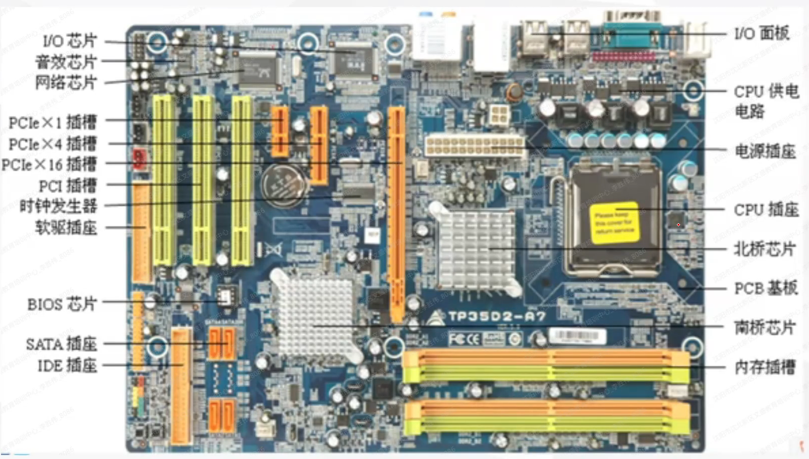

   - BIOS一基本的输入输出系统

     1. **固化在ROM芯片上**
     2. **保存着计算机最重要最基本的输入输出程序、开机自检程序、系统开机程序等**
     3. **系统设置的具体用户信息从CMOS读写**

   - CMOS

     1. **可读写的RAM芯片**
     2. **电池供电**
     3. **用于保存BIOS的硬件配置和用户对某些参数的设定(日期、时间和启动设置)**

   - 总线

     1. 总线：计算机系统各功能部件之间**传递信息**的**公共通信**干线。
     2. 按传输信息分类：
        - **地址总线(AB)**:传输地址信息(单向)
        - **控制总线(CB)**:传输控制信号(双向)
        - **数据总线(DB**)：传输数据(双向)

### 5.微型计算机软件系统

1. **计算机软件：程序+文档**

   程序：计算任务处理对象和处理规则的描述程序必须装入机器内部才能工作。
   文档：文档是为了便于了解程序所需的阐明性资料。文档一般是给人看的不一定装入机器

系统软件

1. 操作系统：管理计算机的软件、硬件资源提供用户和计算机的**交互**接口

2. 裸机上的第一层软件是操作系统，没有操作系统的软件无法工作。

3. 操作系统是最**重要**的系统软件

4. 常见的操作系统
   windows、dos、Unix、Linux、Netware、OS/2

5. 操作系统的基本功能

   1. CPU管理
   2. 存储器管理
   3. 设备管理
   4. 文件管理
   5. 进程管理

6. 数据库管理系统

   1. 数据库：按照数据结构来组织、存储和管理数据的仓库
   2. 数据库管理系统：是一种操纵和管理数据库的大型软件，用于建立、使用和维护数据库。
   3. 现在流行的关系数据库产品有：ACCESS、MySQL、sql sever、Orcale等

7. | 计算机语言 | 语言处理程序      | 说明                                                         |
   | ---------- | ----------------- | ------------------------------------------------------------ |
   | 机器语言   |                   | 二进制：能够直接执行                                         |
   | 汇编语言   | 汇编程序          | 符号语言                                                     |
   | 高级语言   | 解释程序 编译程序 | 解释：**慢；直接执行源程序**<br/>编译：快；先翻译为**目标程序**在执行<br/>**源程序：高级语言书写的程序** |

8. 系统服务程序

   系统服务程序：又称为服务性程序、工具软件
          如：系统诊断程序、磁盘碎片整理

9. 应用软件

   - **应用软件，是为某种应用或解决某类问题所编制的应用程序**。
     1. 文字处理软件
     2. 电子表格软件
     3. 图像处理软件
     4. 多媒体处理软件
     5. 企业管理软件
     6. 游戏软件

计算机系统主要性能指标

1. **字长**：CPU一次能处理的二进制数的位数。

   **字长越长，计算精度越高，处理能力越强。**

2. **运算速度**：指计算机每秒钟所能执行的指令条数，一般用MIPS为单位。

   MIPS :Million Instruction Per Second(百万条指令/秒)

3. **主频**：CPU主频（时钟频率）
   单位：**Ghz **;主频越高，运算速度越快

4. **内存容量**

5. 存取周期

### 6.数制转换与信息编码

1. | 进制数     | 数字符号（数码）                               | 进制标识 |
   | ---------- | ---------------------------------------------- | -------- |
   | 十进制数   | 0、1、2、3、4、5、6、7、8、9                   | D(10)    |
   | 二进制数   | 0、1                                           | B(2)     |
   | 八进制数   | 0、1、2、3、4、5、6、7                         | O/Q(8)   |
   | 十六进制数 | 0、1、2、3、4、5、6、7、8、9、A、B、C、D、E、F | H(16)    |

2. 数制的特点

   1. **逢N进一：十进制逢10进一；二进制逢2进一**

   2. 基数：十进制基数为10；二进制基数为2

   3. 权/权值
      **权是指一个数字在某个固定位置上所代表的值。**

      **将非10进制转10进制先找小数点，左侧部分（0.1.2.3）右侧部分（-1，-2，-3），每个数码X基数的位次方**

      例如：十进制351.26可以表示为：
      (351.26)10=1×1+5×10+3×100+2×0.1+6×0.01
                       =1×100+5×101+3×102+2×10-1+6×10-2
      (110.11)2=0×20+1×21+1×22+1×2-1+1×22
                     =0×1+1×2+1×4+1×0.5+1×0.25
                     =6.75（位权展开法)

3. 数制间的转换

   1. 非十进制数转换成十进制数

      具体应用：**将非10进制转10进制先找小数点，左侧部分（0.1.2.3）右侧部分（-1，-2，-3），每个数码X基数的位次方**

   2. 十进制数转换成非十进制数
      **整数部分：采用“除基数取余法”**

      把十进制数逐次用任意进制数的基数去除，一直到商是0为止，然后将所得到的余数**由下而上**读取即可

      **小数部分：采用“乘基数取整法**
      把十进制小数不断用其他进制数的基数去乘直到小数的当前值等于0或满足精度为止，然后将乘积的整数部分**由上而下**排列

   3. 十进制数转换成非十进制数8
      整数部分：采用“除基数取余法
      小数部分：采用“乘基数取整法
      说明：十进制小数不定能精确的转换为二进制

      注意：正整数在数值相同的情况下进制数越大值越大（1除外）

   4. 二进制整数与十进制整数的快速转换

      - 方法：记住2进制上方乘积数值去掉0的一加即可转换成十进制

      - 十进制转换成2进制就看哪个数加在一起得于这个数加不了的写0

      - | 2的次幂             | 0    | 1    | 2    | 3    | 4    | 5    | 6    | 7    | 8    |
        | ------------------- | ---- | ---- | ---- | ---- | ---- | ---- | ---- | ---- | ---- |
        | 2的次幂与项数的乘积 | 1    | 2    | 4    | 8    | 16   | 32   | 34   | 128  | 256  |

      - 十进制的奇数转换为二进制最后一位一定是1

      - 十进制的偶数转换为二进制的最后一位一定是0

   5. 二进制数与八、十六进制数之间的转换

      -  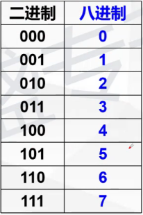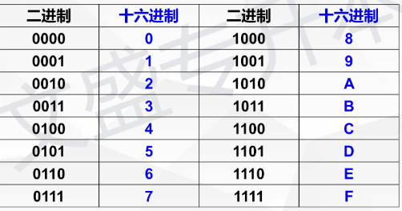
      
      - 注意八进制3个一组16进制4个一组小数点前不够位数在前面加0小数点后面不过在后面加0

4. 计算机中的正负数表示方法

   1. 机器数

      无符号二进制数
      说明1：八位无符号二进制数转换成十进制数的范围0-255

      说明2：256员工用二进制编码，至少需要8位二进制
      说明3：一个非零的无符号二进制整数，若要在其右边末尾加上两
      个零，形成一个新的二进制数，则新数是原来的四倍

      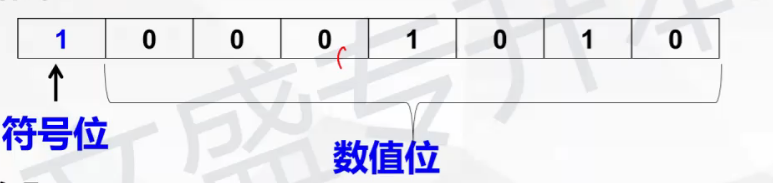

      1. 说明：符号位“0”表示正数，“1”表示负数，最左边
      2. 这种符号被数值化了的数称为机器数，而把原来的用正负号和绝对
         值来表示的数值称为机器数的真值（+101）

   2. 机器数的原码、反码和**补码**表示

      1. 原码：正数的符号位用0来表示，负数的符号位思1来表示，有效值部分用二进制绝对值表示

         例如：X=+33,Y=-33求X和Y的原码分析0表示。

         (+33)原=00100001
         (-33)原=10100001

         (+0)$_原$=（00000000)（-0)$_原$=(10000000)

      2. 反码:正数的反码和原码相同。负数的反码是对该数的原码除符号位外各位取反，即“0”变“1” "1”变"0"

         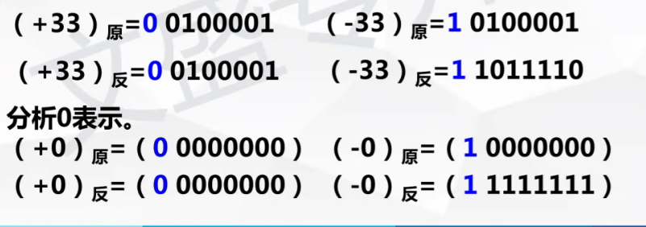

      3. 补码

         正数的补码和原码相同。
         负数的补码用反码+1表示

         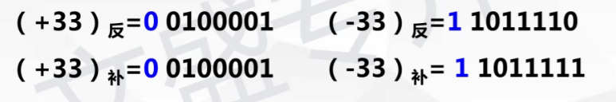

         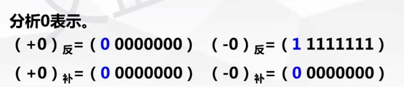

         |                            | 原码              | 反码                         | 补码                |
         | -------------------------- | ----------------- | ---------------------------- | ------------------- |
         | 正数00000001               | 本身<br>00000001  | 本身<br/>00000001            | 本身<br/>00000001   |
         | 负数10000001               | 本身<br/>10000001 | 符号位不变数值位取反11111110 | 反码加1<br>11111111 |
         | +0                         | 本身00000000      | 本身00000000                 | 本身00000000        |
         | 00000000<br>-0<br>10000000 | 本身10000000      | 符号位不变数值位取反11111111 | 00000000            |

         **计算机用补码进行计算**

         **为什么符号位计算?为了让符号位参与运算**

         **补码中0的表示形式唯一**

   3. 定点数与浮点数

      1. 计算机中的小数：隐含小数点

      2. 表示类型：
         定点数：小数点位置固定

         1. 定点整数：小数点隐含固定在整个数值的最后
         2. 定点小数：将小数点固定在最高数据位的左边(符号位的右边)

         浮点数：小数点位置不固定

         1. 浮点数：整数部分，小数部分
         2. 浮点数表示：尾数+阶码（指数）
         3. 浮点数处比定点数表示的范围大

   4. 非数值数据在计算机中的编码表示

      - 信息：自然界中存在的一切物质的属性

      - 数据：信息在计算机中的具体表现形式，是信息的载体

        如文本、图形、图像、音频、视频等
        信息经过数字化后转变为数据、方便存储与传输

      1. 字符编码：美国信息交换标准码简称为ASCIK码，共128个字符。

         - 一个ASCI码：7位编码，8位存储，其中最高为0

         - A是65之后按顺序排

         - a是97之后按顺序排

         - 空格是32

           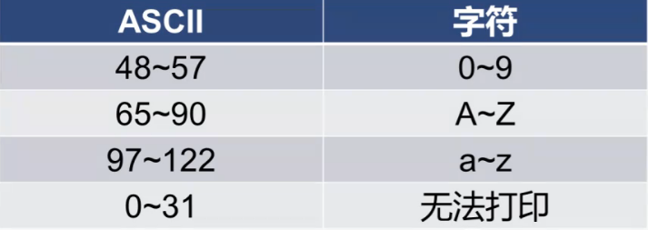

           一个ASCLL占一个字节

      2. 汉字编码

         - 国标码（交换码)/区位码--无重码

           说明：国标码：采用2个字节编码，且每个字节最高位为0

         - 机外码（输入码）-不唯一

           机内码：采用2个字节编码，且每个字节最高位为1

           **国标码（十六进制）+8080 =机内码（十六进制）**

         - 机内码--二进制，唯一
           一个汉字的机内码占2个字节
           一个字符的ASCII占1个字节

         - 字形码--用于输出显示汉字

           1. 汉字字形码：点阵和矢量表示法

           2. 一个16*16点阵汉字占用(32)个字节的存储空间

              无论x*x都除于8结果就是字节

           3. 点阵：放大失真，快，存储空间大，色彩丰富

           4. 矢量：放大不失真，慢，存储空间小（程序），
              色彩不丰富

### 7.多媒体计算机

##### 定义

- 多媒体”中的“媒体”两重含义：一是指**存储信息的实体**，如磁盘、光盘、
  磁带、半导体存储器等；

  二是指**传递信息的载体**如**文本、图形、图像、音频、视频、动画等**

  **多媒体技术中的媒体指后者。**

##### 多媒体存储对象

- 六大媒体元素：文本、图形、图像、音频、动画、视频
- **利用计算机对**文本、图形、图像、声音、动画、视频等**六种媒体元素进行数字化**采集、获取、存储等**综合处理**在多种媒体信息之间建立起逻辑连接，并
  具有人机交互功能的集成系统。

##### 多媒体的特征

- 数字化
- 多样性
- 集成性
- 交互性
- 实时性

##### 媒体的分类

- 国际电话与电报咨询委员会(CCITT),将媒体分为以下5类；
  **感觉媒体**指直接作用于人的感觉器官，使人产生直接感觉的媒体
  **如声音、文本、图形、图像等。**多媒体计算机技术中所说的媒体一般是指感觉媒体，
- **表示媒体**：用于加工、处理和传输感觉的媒体
  如：文本编码、图像编码、声音编码等
- **表现媒体**（显示媒体）：是指信息输入和输出的媒体。
  如：键盘、鼠标、扫描仪、显示器、打印机和扬声器等。
- **存储媒体**：硬盘、软盘、光盘和胶卷
- **传输媒体**：电缆、光纤

**多媒体信息从时效性分为两类**

- 静态媒体：文本、图形、图像
- 动态媒体：音频、视频、动画、声音、影片

##### 常见的媒体类型

1. 文本
   1. txt-纯文本文件，“记事本”
   2. docx---Word 
   3. html--超文标记语言文档，网页
   4. pdf-电子文档书
2. 图形--矢量图--见汉字字形码
3. 图像
   1. BMP-位图
   2. png-高保真性、透明性、文件体积小
   3. .jpg-静态压缩图像
   4. .gif-存储空间小，常用于网页制作
   5. psd-photoshop专用格式
4. 音频
   1. .wav一波形文件格式、容量很大、适用于解说
   2. .mid一由乐器数字接口指令序列组成的计算机乐谱所占存储空间较小，常用于背景音乐
   3. .mp3一当前流行音乐文件格式，音质好，占磁盘空小
5. 视频
   1. .avi一音频、视频信号交叉存储的格式，Windows标准格式
   2. .mpg一压缩的视频文件。节省空间。
   3. .rvb一降低了静态画面下的比特率的视频文件格式。
   4. .flv一新兴视频格式，文件小加载快
6. 动画
   1. .gif一网页、二维动画
   2. .fla一Flash制作的二维动画源文件
   3. .swf一Flash制作的二维动画文件格式

##### 多媒体技术

- **数据压缩与解压缩技术**

  1. 无损压缩
     压缩比低于4：1   用于文本压缩

  2. 有损压缩
     压缩比可以达到10：1  常用于音频视频图像压缩

     **MP3标准一适合声音**
     **JPEG标准一适合静态图像**
     **MPEG标准一适用于动态影像与音频**

- **音频技术**

  - 声音信号数字化的主要步骤：**采样、量化、编码**

- **视频技术**

  - 视频是由连续的图像帧组成的

- 网络技术

- 存储技术

- 媒体同步技术

- 超文本和超媒体连接技术

##### 多媒体计算机的组成

1. 概念：具有**多媒体信息处理**功能的计算机称为多媒体计算机

2. 组成：多媒体硬件系统+多媒体软件系统

   硬件：光驱、音频卡（声卡）、视频卡、麦克风、音箱、扫描仪、数码相机、数码摄像机等

   软件：windows系统中附件中的“录音机”、photoshop、
   Flash,3DMAX,Premiere

3. 最简单的多媒体计算机的硬件构成：
   普通计算机+**CD-ROM+声卡+音箱/耳机**

### 8.计算机信息安全

##### 信息安全

1. 定义：保护计算机软件、硬件、数据信息的资源等
2. 目标：可靠性、可用性、保密性、完整性
3. 保证计算机安全最有效的方法--加强预防和管理
4. 加强网络安全最重要的基础措施是：设计有效的网络安全策略
5. 主要防护策略：杀毒、加密、备份
6. 信息安全技术的核心和关键是密码技术

##### 计算机病毒

1. 定义：计算机病毒是指人为编写的、具有破坏作用的能够自我复制的一组**计算机程序（或一段可执行代码)**

2. 特点

   1. 破坏性
   2. 传染性
   3. 潜伏性
   4. 隐蔽性
   5. 可激活性
   6. 寄生性

3. 分类

   1. 按其传播方式分类

      系统型病毒（感染系统引导程序）
      文件型病毒（感染文件)

      混合型病毒（既可感染文件，又可感染系统引导程序）

   2. 按其危害程度

      良性计算机病毒（占内存、速度慢、死机）
      恶性计算机病毒（破坏系统数据、文件)

   3. 传播途径

      磁盘：硬盘、光盘、U盘等

      网络--传播病毒最广的媒介

      电子邮件、网页网站、文件传输

4. 症状（一般不直接对硬件造成影响）

   1. 计算机屏幕上出现异常显示
   2. 执行程序的时间比平时长，系统运行速度减慢
   3. 对磁盘的访问时间比平时长，磁盘卷标发生变化，系统无法识别磁盘
   4. 有规律的出现异常信息
   5. 磁盘空间突然变小
   6. 内存空间突然变小，对存储系统异常访问
   7. 系统经常无故发生死机或重新启动
   8. 文件的日期、时间、属性等发生变化；文件丢失或损坏，无法正确
      读取、复制或打开
   9. 异常要求用户输入密码；
   10. 打印机、键盘等一些外部设备工作异常
   11. 虚假报警
   12. 时钟倒转
   13. **Word或Excel提示执行“宏"**

5. 预防

   1. 限制网上可执行代码的交换，控制共享数据
   2. 安装正版软件，不非法拷贝软件；
   3. 重要文件及时备份
   4. 专机专用，专盘专用；
   5. 安装正版杀毒软件，常查毒杀毒，定期升级：

   **说明：磁盘格式化是清除病毒的最彻底的方法**，但磁盘格式化，磁盘上
   的所有文件将丢

##### 防火墙技术

1. 防火墙：是Internet（因特网)与intranet（内部网）之间所采取的一种安全措施；是软件或者软件与硬件的设备组合

2. 防火墙技术：通过有机结合各类用于安全管理与筛选的**软件**和**硬件**设备，帮助计算机网络于**其内、外网**之间构建一道相对隔绝的保护屏障，以**保护用**
   **户资料与信息安全性**的一种技术

3. 功能：记录内部网络和计算机与外部网络进行通信的安全日志

   限制内部网络用户访问某些特殊站点，防止内部网络的重要数据外泄

   监控进出内部网络和计算机的信息，保护其不被非法授访问或破坏

4. 说明
   防火墙不能防止感染了病毒的软件或文件的传输。
   防火墙是由计算机软件和硬件设备组合而成的保护屏障
   为了更全面的保护计算机，除了启用防火墙，还应安装杀毒软件

## Window操作系统

### 1.常见计算机操作系统

1.常见操作系统

1. DOS:单用户单任务、命令行（字符）、界面

2. windows:多任务、图形用户窗口界面

   **--windows可以设置多个用户，但某一个时刻只有一人可用**

   **--windows可以为不同的用户保留不同的设置**

3. Unix:多用户、多任务（例：铁路订票、银行)

### 2.windows7的基本操作

一、windows7的安装、启动与退出

1. **windows7安装时，选择文件系统格式一般为  NTFS **

2. 退出：开始关机   说明： 

   开机顺序：先开外设，然后启动主机；

   **关机顺序：与开机相反; (点击开始关机)**  

二、键盘、鼠标

1. 鼠标

   **①指向**
   **②单机：选定**
   **③双击：打开或者运行**
   **④三击**
   **⑤右击：打开快捷菜单**
   **⑥拖动：移动(路径相同)和复制(路径不同)**

2. 键盘

    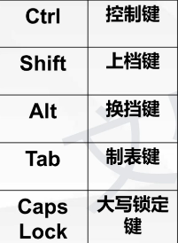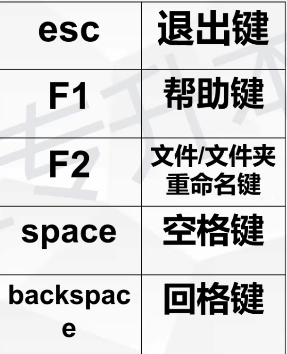

3. 键盘快捷键(所有软件)

    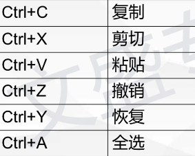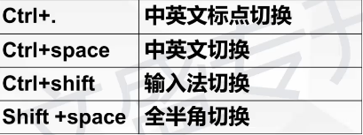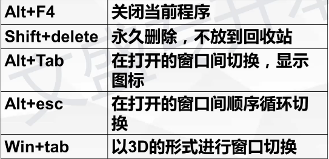

    注意：恢复只能恢复撤销的操作

   说明：在全角半角状态下输入一个英文字母，则改字母在屏幕上占两个/一个字符的位置

   如果处于放映状态alt+f4 是先关闭幻灯片播放

三、桌面、任务栏、开始菜单

1. 桌面

   1.桌面用户启动计算机后看到整个屏幕区域

    **显示桌面的快捷键：win+D**

2. 桌面图标

   双击，打开执行
   类型：系统图标、应用程序图标、快捷方式图标、文件、文件夹等

   系统图标:

   - 计算机--管理各种资源配置
   - 网络--管理所在网络上的资源
   - 用户文档--系统默认文档的保存位置
   - 回收站--暂时存放垃圾文件
   - 控制面板--它允许用户查看并操作基本的系统设置

   **回收站考点:**

   - **(1)回收站无删除命令**
   - **(2)回收站占用硬盘空间，断电后内容不消失**								             
   - (3)可还原到原始位置（还原后才可以编译）                                      		        
   - **(4)可删除可清空，真正删除的文件，不可恢复**			                   		        
   - (5)U盘文件删除不放入回收站（只有删除硬盘数据，放入回收站) 

   **快捷方式图标考点**

   - (1)图标**左下角**有个小箭头标记，用于快速启动程序的一种方式。
   - (2)**扩展名：lnk**
   - **(3)删除快捷方式，不影响原始对象** 
   - **(4)一个对象可创建多个快捷方式，而一个快捷方式，只对应一个原始对象**

3. 任务栏的管理和使用

   - 任务栏的构成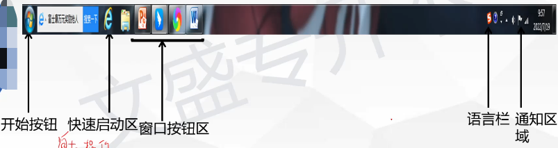

   ​			窗口按钮区 切换窗口 窗口排列	

   ​			语言栏只能切换不能添加或者删除

   ​			通知区域可以设置显示或者隐藏

   - 切换窗口
     1. **单击任务栏窗口按钮区**
     2. **单击窗口可见区域**
     3. ALT+Tab
     4. ALT+Shift+Tab(从右向左)
     5. ALT+Esc
     6. Win+Tab
   - 窗口排列：
     层叠、璀叠（水平)、并排（垂直）--最小化窗口不能进行此操作
   - 任务栏属性
     1. 大小：拖动边框，可以改变，最大不超过桌面的1/2
     2. 位置：拖动空白区：可调，上下左右；可锁定
     3. 属性：可隐藏不可删除
     4. 设置任务栏相关属性
        **右击任务栏空白处→属性→任务栏选项卡→设置**

4. **开始菜单**

   1. 作用：完成计算机的大部分功能。
   2. 快捷方式：**Ctrl+Esc或Win键**
   3. 主要内容：
      - “所有程序”区：快捷方式；单击执行；
      - 系统控制区：控制面板（用于系统设置）/设备和打印机（添加）
      - 开关机（切换用户、注销、锁定、重新启动、睡眠）等

四、窗口、对话框、菜单

1. 组成

   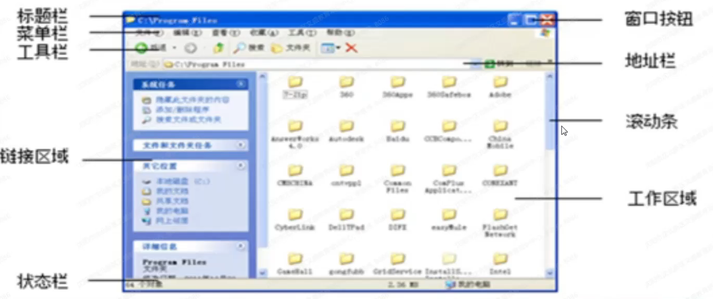

   - 标题栏
     最右侧—控制按钮（最小化、最大化/还原、关闭)

     最左侧—控制菜单

   - 菜单栏：完成该软件的所有功能

   - 工具栏：完成菜单的一部分功能

   - 窗口最下方--状态栏

     说明：桌面最下方一任务栏

2. 分类

   - 应用程序窗口
   - 文档窗口（不能单独存在)
   - 说明：可打开多个窗口，但活动窗口只有一个（不一定是最大化的窗口)

3. 操作

   - 最小化：窗口处于后台运行状态，没有关闭
   - 最大化/还原：双击标题栏
   - 最大化：拖动标题栏到桌面最上方
   - 关闭：见后面
   - 移动：拖动标题栏
   - 改大小：拖动窗口边框或角

   说明1：关闭窗口

   1. 单击关闭按钮【X】
   2. 右击标题栏--关闭
   3. 单击控制菜单(AIt+空格)--关闭
   4. 双击控制菜单
   5. 单击文件--关闭/退出
   6. 右击任务栏窗口--关闭
   7. Alt+F4
   8. Ctrl+Alt+Del

   说明2：控制菜单包括

   -   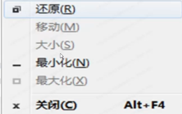
   - 窗口最大化时不可用 最大化、移动、大小
   - 窗口非最大化时不可用一还原
   
   **对话框**
   
   1. 对话框：有选项卡，无菜单，可移动，**不可改大小**
   2. 对话框中可输入字符，可有滚动条（自动出现）
   3. 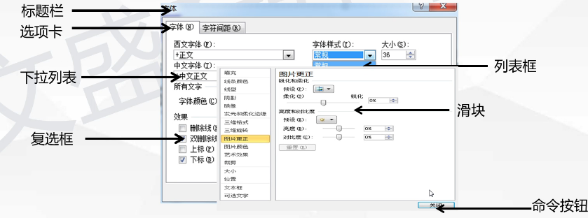
   
   **菜单**
   
   1. 菜单的打开：单击菜单名…【Alt+快捷键字母】-F10
   2. 菜单的关闭：单击菜单名一 【AIt】键    F10  单击菜单以外的地方   Esc
   3. 分类 ①下拉式   ②快捷菜单→右击
   4. 菜单中的符号约定
      - **浅灰色的命令-当前不可用。**
      - **选中标志  【对号】为复选（可选单个或者多个），【·】为单选。**
      - **黑色三角标志【失心侧三角】子菜单**
      - **向下箭头标志【两个向下的大于号】单击展开显示全部内容**
      - **省略号标志【…】对话框**
      - **命令项后带（字母)按下字母，与鼠标单击效果相同**

### 3.windows7的资源管理器（文件管理）

1. 文件、文件夹的定义、管理、命名

   - 定义
     文件：是存储在磁盘上的一组相关信息的集合。
     文本文档、电子表格、图片、歌曲等都属于文件。
     文件夹：既可包含文件，也可包含其他文件夹。
   - 子文件夹：指文件夹中包含的文件夹
   - 文件、文件夹组织结构一树形(是空心三角)
   - 管理文件和文件夹：**Windows资源管理器、计算机**

   **windows资源管理器**

   - 说明1 Windows资源管理器、计算机的启动方法
     ①右击“开始”→资源管理器

     ②开始→所有程序→附件→资源管理器

     ③开始→搜索一资源管理器

     ④Win+E

     ⑤双击计算机

   - 说明2 资源管理器默认包括四个库：视频 图片 文档 音乐
     可新建/能改/能删

   **命名**

   - **文件名：主名.扩展名  文件夹：主名**

     - **说明：扩展名--标识文件类型，可无，可改（尽量不要随意改）**

   - **文件主名命名规则如下**
     
     - **最多可用255个字符（汉字/2=127个)**
     
     - **不区分大小写**
     
     - **可以多分隔符**
     
       **例如：file1.txt.mp3.DOC(最后一个标识扩展名)**
     
     - **不能出现以下字符：\ | / ：“ ？* <>**
     
     - **同一个文件夹中，文件不可同名；不同文件夹中，文件可同名文件夹命名中可以有空格但是不能出现在开头**

2. 文件、文件夹的操作

   - 新建、**选定**、打开、**复制**、**剪切**、**粘贴**、删除、**撤消**，**恢复**、搜索、重命名、创建快捷方式、更改属性、查看、排序方式、压缩、共享

     加粗的都在编辑里

     查看里面有 查看和排序方式

     剩下的的全在文件里

     - 完成文件的4种常用方法
       方法一：菜单/选项卡
       方法二：工具栏                                                                                       方法三：快捷菜单                                                                                                          方法四：组合键

   - 说明1：以上操作文件是关闭状态

     说明2：只能共享文件夹

   - 1.选定文件和文件夹：先选定后操作

     单个：单击
     多个：1.连续：单击，Shift+单击
                2.不连续：单击，Ctrl+单击                                                                 		   3.鼠标框选 																						全选：Ctrl+A(“编辑”菜单中有反向选择)                                                          取消选定：部分：【Ctrl】+单击														                    				  全部：单机空白处

   - 2打开文件和文件夹
     方法+

     ​		双击
     ​		选定文件夹后，按Enterf键

   - 3.移动复制

     方法1：使用命令  使用剪切板

     方法2：拖动鼠标 不使用剪切板

   - 说明：Windows:剪贴板-方法1

     Windows:剪贴板：临时存放移动或复制文件/文件夹

     占内存空间，断电后内容消失。

     内容来源：复制、剪切、截屏

     与剪切板相关的操作：3(上面三个)+粘贴

     剪切板只能保存一次的内容

     各程序之间的信息交换是通过剪切板实现的

     PrintScreen--截屏键、截全屏 ( prtsc）简写
     AIt+PrintScreen---截当前活动窗口

   - 方法2：鼠标拖动一不使用剪贴板

     1. 鼠标左键拖动  同一驱动器--移动   不同驱动器--复制

        移动--【Shift】+拖动      复制---【Ctrl】+拖动

     2. 鼠标右键拖动  会弹出快捷菜单 可以实现移动和复制的操作

   - 操作应用示例
     题目：将C:\11.txt文件复制到D盘中

     答：选中C:11.txt文件单击右键→复制→打开D盘→单击右——>键粘贴
     答：单击选中C:11.txt文件，单击右键，选择复制，双击打开D盘，单击右键，选择粘

     此方法还适用于：
     移动、重命名、删除、（更改)属性、

     查看、排序方式（二者第一步为：打开**磁盘）

   - 4.删除文件和文件夹

     - 逻辑删除--放入回收站
       ①4种通用方法下别
       ②左/右拖动到回收站																			 ③剪切，粘贴到回收
     - 彻底删除
       选定后，按shift+逻辑删除(Shift+Del)

   - 5.撤销和恢复

     - 出现误操作，需**立即澈消**

       windows的文件文件夹只能澈消一步
       Office可多步

     - 恢复操作：恢复撤消的操作

   - 6.重命名文件/文件夹

     - 方法+1：单击（选定)，单击（重命名）
     
   - 7.新建文件/文件夹/快捷方式

     - **特殊：单击右键，发送到，桌面快捷方式**

     - 操作示例：新建文件/文件夹/快捷方式

       示例1：在C盘中创建名为OK的文件夹（*文件)

       **答：打开C盘，选择“文件”菜单，新建，文件夹/文件 命名*为OK**

       示例2：在C盘中为D:\A1.txt创建名为OK的快捷方式

       **答：打开C盘，选择“文件”菜单，新建，快捷方式，单击浏览，选中DA1.TXT,单击下一步，命名快捷方式为OK**

   - 8.(更改)属性

     - 在windows中，文件和文件夹包含属性：只读(只能读不能写)、隐藏、存档(可读可写)、系统（加密和压缩)

     - 说明1：新建office文档属性默认为存档

     - **说明2：隐藏属性，同样进行移动、删除等**

     - 显示隐藏的文件和文件夹（扩展名同之)：

       **打开*盘，选择工具菜单，文件夹选项，单击查看，设置...**

   - 9.查找/搜索

     - 1.可以使用的通配符有【？】和【*】。 

       (?:代表单个字符 , *:代表零个或多个字符)

       - *. *:所有文件
       - *.txt:所有的文本文档

       以A头第四个字符M的所有文本文档： A??M*.TXT

       **如果没有文件名长度一定有 ***

     - 2.操作示例

       "搜索"计算机中名字为aa文件夹

       答：打开"计算机”→在搜索框中输入aa后进行搜索。

   - 10.查看、排序方式

     - 图标、列表、详细信息、平铺、内容
     - 详细信息：名称、修改日期、类型、大小
     - 图标：图片
     - 排序方式：名称、修改日期、类型、大小

   - 11.压缩与解压缩

     - 1.常用软件：Winrar、Winzip (属无损压缩)
     - 2.压缩格式：rar、zip

### 4.windows7任务管理器

1. 作用：提供计算机性能信息

2. **打开**   

   方法1：右击任务栏空白处→启动任务管理器

   方法2：Ctrl+AIt+Del→启动任务管理器
   方法3：Ctrl+Shift+Esc

3. 操作
   结束任务/查看CPU内存使用率等

### 5.windows7控制面板

1. 定义：**控制面板**是windows图形用户界面的一部分，它允许用户查看并操作基本的**系统设置**。

2. **启动：**开始菜单，控制面板

   说明：查看方式一类别，大/小图标

3. 控制面板--系统设置
   (1)外观和个性化-主题、屏幕分辨率

   ◆更改主题（桌面背景、屏保、窗口颜色、声音）、设置屏幕分辨率

   ◆操作：win7   方法：右击桌面空白处。【个性化】/【屏幕分辨率】

   说明1：屏保可以提高显示器的使用寿命

   说明2：在**指定时间**内，不使用键盘和鼠标，可激活屏保

   (2)时钟、区域和语言
   (都可更改日期时间显示格式)

   区域和语言：安装/卸载语言

   时钟：任务栏→单击时间；控制面板→日期和时间

   (3)**用户帐户（添加、删除、修改）**

   Win7默认帐户：
   Adminstrator 管理员帐户、Guest来宾帐户

   创建账户：管理员，标准用户

   (4)程序（卸载、修复、更改）更改和修复只能出现一个

   说明：可以对windows:组件进行操作（如：IE、Windows Media Player等)

   office包含组件：word excel ppt access (数据库管理系统)

   (5)硬件和声音

   ◆鼠标：可设置切换主要、次要按钮（左右手习惯）、双击速度、指针形状、移动速度等

   ◆键盘：字符重复、光标闪烁速度

   **打印机：不可以连好线直接使用**

   **说明1：多台计算机可以共享一台打印机**
   **说明2：一台计算机可以安装多台打印机**

   说明3：设置默认打印机在控制面板中完成；选择使用某台打印在文件打印时完成

### 6.windows7的实用工具

1. 附件

   - 记事本、写字板、画图、录音机、媒体播放器 计算器、磁盘清理、磁盘碎片整理、远程桌面连接 windows:资源管理器
     
   - 操作示例：
     问：为附件中的..创建一个桌面快捷方式。
     答：打开开始菜单，选择所有程序，附件，右击..图标 选择发送到，桌面快捷方式
   
2. 介绍

   - **记事本--文字编辑软件**

     - 扩展名：.txt
     - 只可修饰文字格式、可打印 (无法修饰段落文字)（单文档窗口）

   - **写字板--文字编辑软件**

     - 扩展名：.rtf

     - **可修饰文字格式、可设置段落、可插入图片、可插入表格、**
       **可打开Word文档、TXT文档、可打印；（单文档窗口）**

     - Word:插入、改写
       方法：1、状态栏上单击插入/改写按钮
                  2、INSRT

       写字板：插入、改写
       	方法：INSERT
       记事本：插入

   - 画图

     - **扩展名--- .bmp/ .png / .jpg / .gif**
     - **正方形、正圆---Shift**
     - 可写字
     - **前/背景色---左/右键**
     - **画布大小可改**
     - 可撤消多于3步--win7
       最多3步--XP

   - 录音机

     - 扩展名---.wav(xp)  .wma(win7)

   - 媒体播放器

     - 说明：不能播放所有类型的音频、视频。

   - 计算器

     - **标准型、科学型（3^5^)** **程序员（进制转换）、统计信息**
     - 无存储功能
     
- 磁盘清理（硬盘)
  
  - **目的：清理磁盘中的垃圾、释放磁盘空间**
  
  - 磁盘格式化：
       格式化：选中磁盘→右击→格式化； 
  
    格式化将破坏磁盘中原来的（所有）信息
  
    格式化可以彻底清除病毒
  
    当磁盘上已经有文件被打开时，该磁盘是不能格式化的
  
    全面格式化、快速格式化（只适用于做过格式化的磁盘)
  
    格式化可制作系统启动盘(DOS)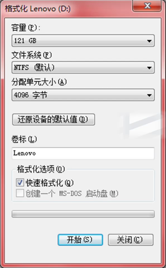
  
    
  
- 磁盘碎片整理
  
  - **含义：对电脑磁盘中的碎片和凌乱文件进行合并。**
     - **作用：可提高电脑的整体性能和运行速度，**
     - **操作步骤：**
       **选定磁盘→分析磁盘→磁盘碎片整理**
  
- 远程桌面连接（固定IP地址)
  
  - 图形化的Telnet(远程登录协议)

## Word

### 1.word基本知识

1. office:组件

   - **word**
   - **Excel**
   - **PowerPoint**
   - **Access**

2. Office组件启动与退出

   - **Word启动方法**
     - **方法1：双击桌面上Word**
     - **方法2：开始→所有程序→OFFICE→单击Word**
     - **方法3：单击任务栏快速启动区的"Word"**
     - **方法4：打开任意一个Word文档**
     - **方法5：单击Office 快捷工具栏上的"Word"**
     - **方法6：开始→搜索Word**
   - Word退出方法
     - 方法1：单击关闭按钮[X]
     - 方法2：双击控制菜单
     - 方法3：单击控制菜单(Alt+空格)-关闭
     - 方法4：右击标题栏-关闭
     - 方法5：单击文件退出
     - 方法6：右击任务栏窗口按钮--关闭
     - 方法7：AIt+F4
     - 方法8：Ctrl+AIt+Del

3. 窗口组成

   - 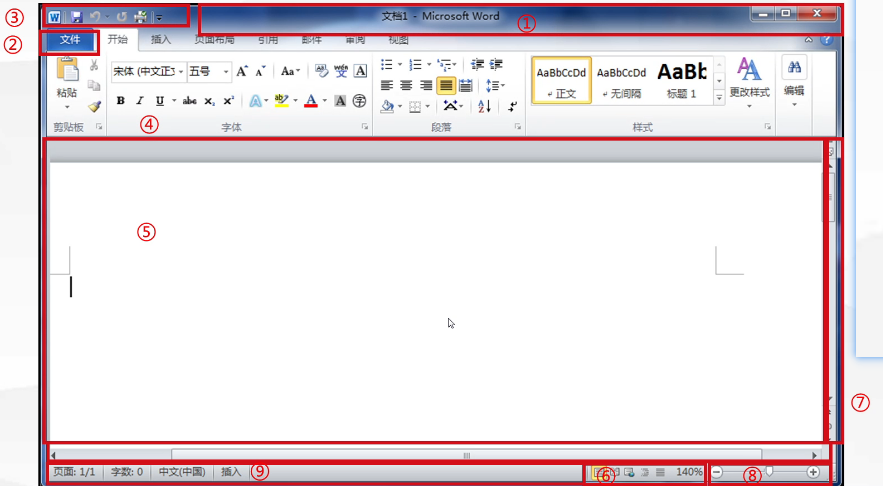

   - 1.标题栏  作用：显示文档的名称  **新建Word文档名称一“文档1”**

   - 2**.展开/折叠功能区**：CTRL+F1/双击选项卡（文件选项卡除外）

   - 3.快速访问工具栏  默认包括：**"保存”、“撤消”、“恢复”可自定义**(能添加删除  改位置）   可设置位于功能区上下方

   - 4.选项卡8组(默认)(**可以新建/删除/显示/隐藏/重命名**)  

     - 方法：文件选项卡→选项→自定义功能区		

   - 5.拆分条（下拉拖动 或双击拆分条，视图选项卡→窗口组→拆分)

     - 说明1：拆分窗口后对任一窗口进行编辑都会对文档产生影响；
     - 说明2：同时查看文档的不同部分，可以拆分窗口、新建窗口（全部重			 排，并排查看)；
     - 说明3：新建且未保存过的文档，其文件名不会出现在文件选项卡的最近所用文件里，但可以在视图选项卡窗口组的切换窗口中呈现。
     
- 6.标尺：水平标尺和垂直标尺
  
  - **更改页边距、段落缩进、分栏宽度、表格栏宽**。图片不能改
     - **显示或隐藏标尺：1.视图→显示组→标尺  2.单击滚动条上端【标尺】按钮**
     - **大纲视图、阅读版式视图下无标尺**
  
- 7、滚动条：(可有可无 自动出现)
  
  - **滚动一行：单击上下单箭头**
     - **滚动一页：单击上下双箭头**
     - **滚动一屏：单击上下空白区域**
     - 可【选择浏览对象】：页、节、批注、脚注、尾注、图片、表格浏览，亦可进行查找、定位。
  
- 8、选定区：文档窗口左边的一列空列，指针为用于选定文本
  
- 9、编辑区：输入和编辑文档内容。
  
- 10、状态栏：（无文件名）
  
  - **当前页的页码、总页数、字数、语言以及当前写入改写状态；（行数、列数和节数）**可添加减少
  
  - **视图按钮** 和 **显示比例**
  
  - 视图方式(5种视图)
  
    - 1.**页面视图**：**默认视图方式**：**显示的文档页面与打印时完全相同；可以编辑页眉和页脚等；显示水平+垂直标尺（所见即所得）**
  
    - 2.**草稿视图**：文本的录入与编辑，页眉、页脚等都不显示，**显示水平标尺。**
  
    - 3.**Web版式视图**：编辑WEB页，效果如IE浏览器；**显示水平标尺**
  
    - 4.**大纲视图**：查看文档的结构标题级别1-9级，**不显示标尺**。
  
    - 5.**阅读版式视图**：隐藏功能区，可刘览文档但不允许编辑文档，默认不显示页眉页脚（可设置显示）**不显示标尺**。
  
    - 说明1：视图切换的方法  1.**视图→文档视图   2. 状态栏右侧的【视图切换】区**
  
    - 说明2：显示比例：
  
      状态栏右侧的→【显示比例】**（10%-500%)**
  
      视图显示比例（单页双页）
  
      Ctrl+鼠标滚轮
  
  - 补充说明：窗口操作： 可拆分、新建、全部重排、并排查看、切换窗口
  
    - 视图选项卡：文档视图、显示（标尺）、显示比例、窗口、宏

### 2.文档编辑

1. **对文档文件编辑**

   - 新建、打开、保存、**另存为(F12)**、打印、关闭等

   - **操作方法：**

     - **1.文件选项卡**
     - **2.快速访问工具栏**
     - **3.快捷键：Ctrl+N / O / S / Shift+s(另存为) / P (打印)/ W(关闭)**

   - **1.新建文件：文档1**

   - **2.打开文件：**

     - **打开文件，数据从外存读入到内存中 。**
     - **保存文件，数据从内存写入到外存中。**
     - **关闭文档，清除内存数据，保留外存数据。**
     - 双击打开  
     - Ctrl+F12
     - 单击【文件】中显示的最近所用文件 (默认：4，可设**0-25**可以更改最多50)
     - **说明：可以一次打开/保存多个文档**

   - 3.保存

     - **说明1：第一次保存或另存为，均弹出【另存为】对话框，需要设置存储路径、文件名及类型；不是第一次点保存，不弹出任何对话框按原路径、原名、原类型存储。**
     - **说明2：自动保存：文件/选项/保存/自动保存间隔(1-120分钟，默认10分钟)**

   - 4.另存为

     - 文件A另存为文件B当前显示文件B

       文件A未修改被关闭

     - 说明1：在另存为/打开对话框中，可进行文件/文件夹的新建、移动、复制等基本操作

     - 说明2：Word保存类型  .docx .dotx  .txt  .rtf .html .pdf

   - 5.打印

     - **说明1：可以选择打印机、打印范围、打印份数** **打印机属性等（但默认打印机的设置只在控制面板中）**
     - **说明2：默认打印页；可自定义打印：1,3,5-8**
     - 说明3：**【打印预览】**状态下可以直接打印
     - 说明4：【打印预览】状态下可以设置**显示比例**，**多页预览**
     - **说明5：文件→【打印】→页面设置**
     
   - 6.保护文件
   
     - 设置密码（**打开**和**修改**）、标记最终状态（只读）
     - 文件→信息
   
   - 7.关闭
   
2. 对文档内容编辑

   - 定位、选定、插入/改写、移动/复制/删除、撤消/恢复、查找/替换/定位

   - 1.定位：

     - 插入的对象出现在**插入点**处
     - 定位方法
       - **①单击/双击（即点即输）**
       - **②Home/End:行首/尾**
       - **③Ctrl+Home/End:文档首尾**
       - **④PgUp/PgDn:上下翻一屏**
       - **⑤Ctrl+PgUp/PgDn:上下翻一页**

   - 2.选定文本

     - 方法：**可键盘、可鼠标、可键盘鼠标相结合**

     - | 选定区 | 操作                                 | 编辑区                |
       | ------ | ------------------------------------ | --------------------- |
       | 行     | 单击                                 | 改变插入点            |
       | 段     | 双击                                 | 词                    |
       | 全文   | 三击                                 | 段                    |
       | 全文   | Ctrl+单击                            | 句                    |
       |        | 全选--Ctrl+A<br/>开始→编辑→选择→全选 |                       |
       |        | 选**连续**区域-**Shift**             |                       |
       |        | 选**不连续**区域-**Ctrl**            |                       |
       |        | 特殊                                 | **矩形**区域一**AIt** |

   - 3.移动/复制/删除文本

     - (1)移动/复制 ：**Office剪贴板最多容纳24个 **     **开始**→**剪贴板**
     - (2**)插入点前/后文本删除：前backspace/, 后del**
     - 说明：选定文本等，“剪切”不“粘贴”则删除文本，不放入回收站；放入剪切版
     - 但是选定文件/文件夹或者Excel单元格区域。"剪切”不 "粘贴"，则不删除

   - 4.插入/改写文本

     - **输入段落，以回车结束**

     - **插入分页，插入→页**

     - **插入符号/公式：插入→符号**（在插入尾部）

     - **插入超链接**（在插入中间）

       - 插入超链接：**插入选项卡→连接组→超链接**

       - 说明1：可编辑、打开、复制、取消

       - 说明2：超链接对象（4类)
         ①现有的文件或网页

         ②本文档中的位置

         ③新建文档

         ④电子邮件地址

   - 5.撤消/恢复（重复）可多步

   - 6.查找/替换/定位

     - 方法1：查找/替换/定位 **Ctrl+F/H/G**

     - 方法2：开始→编辑

     - 可查找及替换文本、格式、带格式文本

     - **区分大小写   支持通配符**

     - 区分全角半角   全部突出显示

     - 特殊查找
       段落标记 ^p 人工换行符( ^l ) (**shift+enter换行不分段**)-非打印

       手动分页符/分节符/分栏符
       批注/脚注/尾注
       图形（只能按类，不能按名）表格

     - **特殊应用**
       **替换，可完成批量修改；**

       **替换，替换内容为空，则完成删除；**

     - 说明：默认向下查找替换，可向上，可全部

     - 操作示例：
       将正文中的“计算机”替换为“电脑”，且文字为红色。

       **答：单击开始选项卡，选择编辑组中的替换，设置查找内**
       **容为：计算机，替换内容为：电脑，选中替换内容，选择更**
       **多，格式，设置字体颜色为红色，选择 "全部替换"**

### 3.文档排版

1. 文本排版

   - 字符格式  字符间距

     段落格式  段落间距

     格式刷、样式

   - 1.字符格式排版

     - 方法1：选中*→开始→字体→设置**

       - **1.默认：五号、宋体/Calibri**
       - **2.字号：一大五小(大写数字)   1小5大(小写数字)**
       - **3.可手动输入字号，范围1-1638**
       - **5.选定文本字号不同，字号框为空，字体同之**
       - **5.Ctrl+B+I+U加粗/倾斜/下划线（取消同设置)**

     - 方法2：字体对话框

       - 字体 选项卡：同时设置中英文字体、着重号、 效果（隐藏等)

       - 高级”选项卡：字符间距

       - 操作示例：
         将正文中第一段文字设置为：三号、黑体、加粗，**并加着重**
         **号**
         答：选中正文第一段文字，选择 开始选项卡，字体组设置
         文字为：三号、黑体、加粗，打开字体对话框,选择字体选
         项卡，设置加着重号

         答：选中正文第一段文字,打开字体对话框,选择字体选
         项卡,设置三号、黑体、加粗, 加着重号
     
   - 2.段落格式排版（先选定）

     - **方法1：开始→段落**
       对齐方式、缩进、间距、行距、**项目符号、编号、边框，底纹**等

     - **方法2：使用段落对话框**

       三选项卡：缩进和间距、换行和分页、中文版式

     - 【1】5436

       **①5种对齐方式**
       **左对齐、居中、右对齐、两端对齐（默认)、分散对齐(文字未充满一行可见效果)**

       **②4种缩进：首行/悬挂/左右缩进**

       **③3种间距：段前、段后（最小值为-0.2行)、行距**

       **④6种行距：单倍、1.5倍、2倍、多倍、固定值（如18磅）、最小值（无最大值）**

       **说明1：行距设置固定值时，插入图片，可能无法完全显示；**
       **其余可全部显示；**

       **说明2：标尺可以进行 首行缩进、悬挂缩进、左缩进、右缩进**

       操作示例：
       问：将正文中第一段艾字设置为：首行缩进2字符,行距18磅答：**选中正文第一段，选择开始选项卡，段落组，打开段落对话框，选择缩进和间距选项卡，设置首行缩进2字符，行距固定值18磅**
       
     - 【2】项目符号/编号

       ◆**开始→段落→项目符号/编号→定义新项目符号/编号**
       ①自动设置、自动调整义、
       ②多级别
     
     - 【3】边框、底纹
       **◆开始→段落→边框→边框和底纹**
     
       ①应用范围：文字、段落
       ②底纹可以设置图案样式、颜色
     
   - 3.字符段落综合排版-格式刷、样式

     - (1)格式刷一复制**字符**与**段落**格式

       开始→剪贴板

       Ctrl+shift+C / V(格式复制/粘贴)

       Ctrl+shift+Z(清除格式)

       **说明：单击--刷一次**
       		   **双击--刷多次**
       **结束：按ESC键或单击格式刷**
   
     - (2)样式—格式的集合（字符、段)

       ◆开始→样式

       ◆可应用、修改、新建、删除、重命名

       ◆新建文档：默认样式为正文

       ◆**应用样式方法**
         选中文本→单击样式名
         单击样式名（直接应用于插入点所在的段）
         格式化刷
   
2. 页面排版

   - 页面布局→页面设置/页面背景

   - 插入→页眉和页脚→页眉/页脚/页码

     **说明：页面整体美化，无需选中**

   - 1.页面布局→页面设置/页面背景 （一页 一大小 两分 两方向）
     **纸张大小、纸张方向、页边距、文字方向**，分栏、分隔符（分页符、分节符）等

     **①页边距：上下左右、装订线**

     **②页眉和页脚：奇偶页不同，首页不同（可设置，不可编辑)**

     ③大小：A4大、B5小  可自定仪大小

     ④方向：横纵

   - **页面布局→页面设置→分栏→更多分栏（1-45)**

     **①栏宽（可相等、不相等）、间距、分隔符**

     **②应用于整篇文档或部分文档**

     **③未选中，对整篇文档**

     **④页面视图下可见，草稿视图下不可见**

     **⑤最后一段分栏，不要选中段落标记**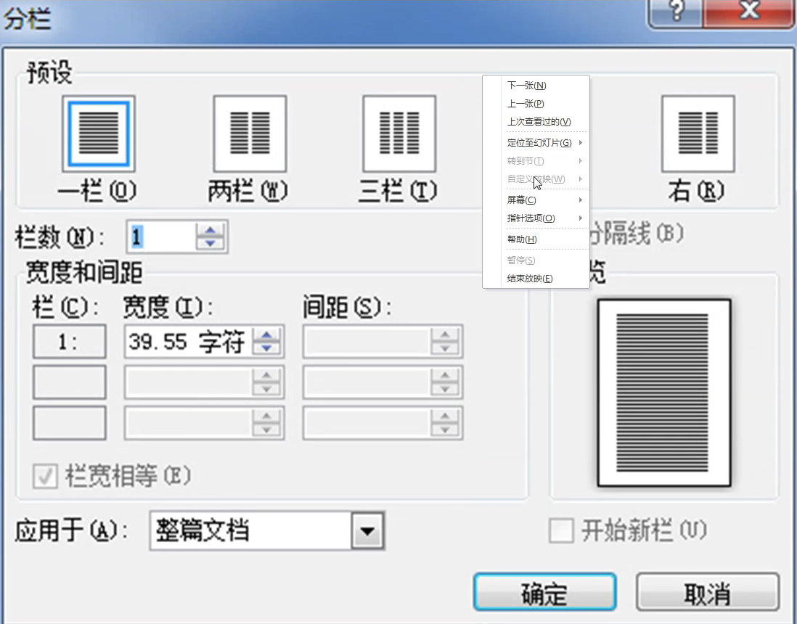

   - 页面布局→页面设置→分隔符→**分页符/分节符**
     说明1：草稿视图下可见
     说明2：不可打印，可查找、定位

     (1)分页符

     **自动分页符 自动产生；不可删除**

     **手动分页符(Ctrl+回车)  可删除**

     (2)分节符

     默认整个文档是一节，可以分成几个节

     每个节可以采用不同的格式编排

     可删除：草稿视图下选中→按delete键

   - 页面布局→页面背景→水印/页面颜色/页面边框

     **①页面颜色：纯色、渐变、纹理、图案、图片**

     **②水印：文字 图片**

     **二者不能同时编辑**

   - 页眉页脚
     **插入→页眉和页脚（双击页眉和页脚）**
     可插入图片、表格、页码等
     可编辑、修饰、打印

     不可与正文同时编辑

     可设置首页不同、奇偶页不同
     草稿视图下不可见
     一篇文档可设置多种页眉页脚（分节符）

     每一页都出现相同的内容，可在页眉页脚中操作

   - 4.页码
     位置：页面顶/底端、页边距、当前位置
     对整个文档进行插入页码，可以在任何一页中进行
     可设置起始页码（默认是1)

### 4.图形、图片

1. 插入 选项卡
   - 页组：分页 封面 空白页
   - 表格组
   - **插图组**：**图片 剪贴画**→图片工具 格式 选项卡  **形状**→绘图工具 格式   选项卡
   - 链接组：超链接
   - 页眉页脚组：页眉页脚页码
   - **文本组**：**文本框 艺术字** **首字下沉**日期和时间
   - 符号组：符号公式
   
2. 插入方法

   - 将插入点定位到*，单击**插入**选项卡，**插图**组，**图片 / 剪贴画**选择**并插入
   - 修饰方法：
     选中图片*，选择 **图片工具**  **格式选项卡**，设置**

3. 图片

   1.图片编辑（图片工具格式选项卡）

   - 调整组：亮度、对比度、**重新着色**、压缩图片、删除背景
   - 图片样式组：边框
   - 排列组：旋转、叠放次序、**组合**、对齐、**文字环绕**
   - 大小组：改变大小、裁剪

   说明1.文字环绕嵌入型（默认)  四周型、紧密型、穿越型、上下型（无左右）对于文字下方、浮于文字上方

   说明2：选定多个**非嵌入型图片**(**shift+分别单击**)后，可 组合 ，亦可取消组合

   说明3：可选定，移动，复制，删除（剪切不粘贴)

4. 形状

   - 默认：浮于文字上方
   - 正圆、正方形：shift
   - 封闭图形可添加文字

5. 文本框

   - 插入→文本→文本框→绘制文本框一拖动并绘制文本框
   - 文本框：横排、竖排（可相互转换）
   - 文本框内部：文字、图片、表格、文本框等

6. 艺术字（当图片处理)

7. 首字下沉

   - 插入→文本→首字下沉→首字下沉选项
   - 位置：下沉、悬挂
   - 选项：字体、下沉行数（默认3：可设置1-10）、距正文距离

8. 插入日期： AIt+shift+D / T（插入当前系统的日期 / 时间)

9. 图表、SmartArt图（组织结构图）、屏幕截图等

   - 插入→插图组

10. 插入→文本→对象、

    - 图片、Word、Excel、.PowerPoint等对象

### 5.表格

1. 插入表格

   - 方法：插入→表格组→表格（Excel表格也可以插入)
   - 表格、行、列、单元格
   - 单元格内容：文本、数字、图片表格等

2. 编辑表格

   - **表格工具：设计 / 选项卡**

     表格边框、底纹、表格样式、绘制表格（水平、垂直、对角线)

   - **表格工具  布局  选项卡**

     具体操作如下：选定、插入、删除、合并、拆分、设置行高列宽、
                              单元格对齐方式、表格对齐方式
     
   - 选定

     1. 表格：单击表格左上角

     2. 行/列：单击行左侧 / 列上方

     3. 单元格：单击单元格左下角（黑色实心向右上角的箭头）

        ​            连续：shift不连续：Ctrl

     **说明1：表格右下角，拖动，可调表格大小**
     **说明2：表格不能同时选行和列**

   - 插入(布局→行和列→行、列)

     - 行/列  行：上下方   列：左/右侧

     - 插入行/列/单元格

       可**一次插入多行 / 多列（先选定多行 / 多列）**

       插入一行的特殊方法	

       - **把插入点定位在表格外任意一行按回车键**
       - **把插入点定位在表格的最后一个单元格内或外按tab键**

     - 单元格    右移  下移

   - 删除

     - 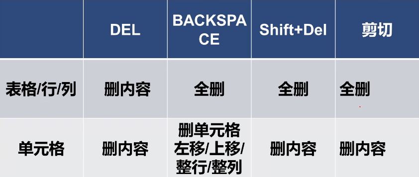

   - 合并单元格

     - **数据区域必须多个、连续**

     - 保留多个单元格内容

       说明：合并表格，**手动**删除两表之间的回车符

   - 拆分单元格

     - **拆分行数：是原有行数的约数。如4的约数为1.2.4**
     - 说明1：Wod中拆分表格，只可上下拆，不可左右拆
     - 说明2：**选定行位于下表**(光标所在的行的为新表格的首行)

   - 行高/列宽

     - 拖动标尺
     - 拖动表格线（shift+拖动：只改本列列宽) 不加shift 改自己页也改其他
     - 表格工具布局一>**单元格大小**
     - **单元格内按Enter,增加行高**
     - **调整字号，可改行高**
     - **表格属性→行→行高（列一列宽)**

   - 说明：

     - 表格属性对话框
     - 表格：对齐方式（左、中、右）、文字环绕、边框和底纹
     - 行：行高
     - 列：列宽
     - 单元格：**垂直对齐方式**

   - 单元格对齐方式（9 种）

     - 垂直：靠上、中部、靠下
     - 水平：两端对齐、居中、右对齐

3. 数据计算与排序

   - 计算：布局→数据、公式

     - =sum（**left**/**right**/**above**/,**below**)向**左**/ **右** /**上 下**求和

     - Average--求平均值

     - **Word表格数据变化后，其计算结果不会自动更新**

       - 需要更新域
         方法：
         **①选中后，按下F9**
         **②单击右键，更新域**

         说明：更新目录同之

   - 排序：

     - 最多3个关键字（主要/次要/第三关键字）
     - 升序、降序
     - 有/无标题行
     - 按数字、拼音排序

4. 表格与文本相互转换

   - 表格--文本

     分隔符4种—**段落标记，制表符，逗号，其他**

   - 文本--表格

     分隔符5种—**4，空格**

### 6.其他常用功能

1. 重复标题行：表跨页重复出现标题行

2. 【审阅】选项卡

   - **拼写和语法**

     **(波浪线：红色-拼写错误绿色--语法错误） 字数统计（校对组)**

   - **新建批注（红色边框，可打印)**

   - 繁简转换

   - 修订（不同修订者可设不同修订标记
     可接受可拒绝)

3. 【引用】选项卡

   - **脚注**（一页下方的注释）
   - 尾注（文档未尾的注释)
   - 目录：根据**样式**或**大纲级别**动生成目录功能
     更新方法：F9    更新域

4. 【邮件】选项卡

   - 邮件合并
   - 两文档
     主文档--共有内容
     数据源--变化信息
   - 应用：批量生成录取通知书、准考证
   - 合并后，可保存单个文档、可打印/问发邮件

## Excel

### 1.Exce基本知识

1. Excel的功能、启动和退出

   - 功能
     **Excel,建立电子表格，并可以对表中的数据进行计算，处理和统计分析等**

     **Excel可应用于行政管理，股票分析，数据统计分析，财务管理等**

2. Excel窗口—窗口的组成

   - 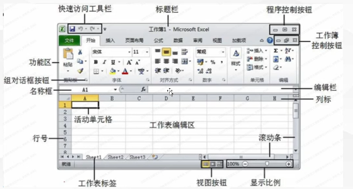

   - 1.名称框、编辑栏：

     - 名称框：显示位置；快速定位；定义名称
       **说明：名称框只显示一个单元格名**

     - 编辑栏：显示当前单元格的内容，用于输入编辑**常量**和**公式（无图）**
       **X 取消按扭=Esc**
       **V 确认按钮=Enter**
       Fx是插入函数按钮

       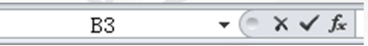

   - 2.视图

     - Excel默认视图方式普通视图
     - Word默认视图方式页面视图

   - 3.窗口管理（视图)

     - **新建窗口——文件名后加：1：2：3（第几个窗口）**
     - **拆分窗口——可上下拆分，左右拆分**
     - 全部重排——平铺，水平并排，垂直并排，层叠
     - 冻结窗格——括首行/首列冻结结、冻结窗格（选定单元格上面的行和左侧的列冻结）
     - 隐藏窗口——可取消

3. Excel基本概念

   - 1.工作簿：Excel文件（*.xlsx)
     - **新建文件：工作簿1，默认有3张工作表 (可1—255张)**
     - 工作簿是Excel文件保存单位
   - 2.工作表sheet：1048576行×16384列
   - 3.单元格：存储数据的最小单位
     - 单元格地址：列号+行号 A3  B5
   - 4.活动工作表、活动单元格
   - 5.填充点（填充柄)
     - 活动单元格的**右下角，黑点**。
     - 鼠标形状：空心一>**实心的黑十字架**
   - 6.全选按钮
     - **位于工作表左上角，行号和列号交错位置的空白按钮**

### 2.Excel工作簿、工作表、单元格的基本操作

1. 工作簿基本操作（同Word)

2. 工作表操作

   - **工作表的选定、单击切换、向前插入、删除、重命名、移动**
     **复制、隐藏、保护、设置标签颜色（无保存命令）**
   - **小结：**
     - **方法1：开始→单元格**
     - **方法2：右击**工作表标签**
   - **说明1：以上操作不能撤消（设置标签颜色除外）**
   - **说明2：不可使用常用快捷键**
   - **说明3：工作表切换--Ctrl+ PageUp / PageDown**

3. 单元格操作

   - **1.编辑单元格**

     - **单击单元格（格上）**
     - **双击单元格（格里）**
     - **直接修改编辑栏中的内容**
     - 说明1：向多个单元格中输入同一个内容：选定多个单元格
       →输入→**Ctrl+回车**
     - **说明2：单元格内强制换行：Alt+回车**

   - 2.输入数据

     - (1)数据分类：常量、**公式（=号开头)**

     - (2)数值型

       - **右对齐**

       - **输入分数：整数N/M:如0空格1/2**

       - **输入负数：-5或(5)**

       - 超过11位，**科学计数法表示。**

         例如：5.56E+11,表示5.56*10^11^

       - 列宽过小，#号填充

     - (3)字符型

       - **左对齐**
       - **数字以文本输入，前加'  或=""**
       - 设置：开始→数字→【文本】
       - **说明**：数字作为文本后也可进行算术运算

     - (4)日期、时间

       - 右对齐
       - **日期分隔符：/或-**  (Excel中起始时间为1900-1-1)
       - 时间分隔符：冒号
       - **Ctrl + ; 输入当前系统日期**
       - **Ctrl+ Shift + ;输入当前系统时间**

     - (5)逻辑型

       - 居中
       - 真：TRUE 代表1   假：FALSE 代表0 
       - TRUE和FALSE可以运算运算时候TRUE 代表1 FALSE 代表0 
       - 例：=3>5   结果为FALSE
       - 例：=(3>5)+2结果为2

     - (6)序列输入

       - (1)序列类型

         - 等差、等比、日期、自动填充

       - (2)自定义序列 (文本加数字可以自动填充)

         - 例如：星期、月、季、甲乙丙丁、子丑寅卯等

       - (3)方法

         - **开始→编辑→填充→系列** 

           步长：公差 公比

           终止值：最大值

         - **右拖动填充柄(等差、等比复制等)**

         - **左拖动填充柄(等差或复制)**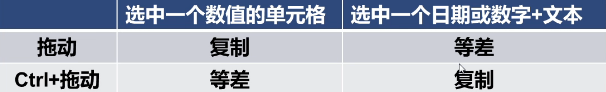

       - 思考：在a1:a5中1.3.5.7.9序列的输入方法
         **答：在a1、a2单元格中分别输入1和3，选中a1:a2并指向**
         **填充柄，按下左键向下拖动填充柄到a5**
       
     - 编辑单元格、输入数据、选取 
     
       移动或复制数据、插入、删除、清除单元格
     
       操作：选中 鼠标单击右键...
     
     - 说明1：在Excel中实现单元格的移动时，鼠标形状为空心箭头()
     
     - **说明2：清除与删除的区别**
     
       - del键删内容
       - 清除---全部、格式、内容、批注、超链接 （只清除所指向的例清除内容格式在清除格式内容在）
       - 删除单元格命令---删单元格(+内容)

### 3.数据美化

1. 设置单元格格式

   - **方法1：开始→单元格→格式**
   - **方法2：右击单元格**→**设置单元格格式**
   - **方法3：开始→字体/对齐方式/数字**
     - **字体：+边框  底纹**
     - **对齐方式：合并后居中（多个连续的单元格，只保留一个**
       **左上角的数据)自动换行**
     - **垂直对齐方式：靠上 居中 靠下 两端 分散**
     - **水平对齐方式：左 居中 右 两端 分散+常规 跨列居中(并没有对单元格合并)  填充(填充不会改变数值)**
     - **数字：小数位数%￥，（干位分隔符)**
     - **说明：小数位数四舍五入，%四舍五入的整数**

2. 改变行高、列宽

   - 拖动行列分隔线

     **自动调整：双击行列分隔线**

   - **开始→单元格→格式→行高/列宽**

   - **右击行号/列号→行高/列宽**

     说明：整行的行高是一样的 整列的列宽是一样的

     ​          默认情况下，行高是以本行中最高的字符为准

     ​          一次可以调整多行的行高（想调整几行选中几行）

3. 套用表格格式/单元格样式

   - 开始→样式

4. 条件格式

   - 开始→样式→条件格式
     （重应用：如果性别为男，则设置格式：蓝色、底纹)

5. 查找和选择：开始→编辑

   - 查找范围：**工作簿，工作表**
   - 查找内容：**数值，公式，批注（在格上）** 无图片
   - 查找方式：按行，按列（按行先找同行的然后下一行列同理

6. 新建批注：审阅→批注

   - 单元格右上角，**红色小三角**

   - 默认隐藏，可设置显示

   - **默认不打印，可设置打印**   

     操作：文件选择卡 打印 页面设置 工作表组 选择批注 设置为显示打印

7. 添加背景

   - 页面布局→页面设置→背景

8. 网格线设置—页面布局

   - 可改颜色

   - 可取消/显示：视图→显示→网格线

   - 默认不可**打印**，可设置打印（文件→打印→页面设置→工作表)

     说明：网格线**显示**或**打印**均可设置：页面布局→工作表选项

### 4.数据计算

1. 公式

   - 以=**开头**
   - 包括常量、运算符、单元格名称、函数等
   - 如：=A1*2+sum(A2:C2)
   - **Excel自动完成计算结果显示在单元格上，公式显示在编辑栏里（显示公式的方法：双击单元格单击 单元格后按F2)**
   - 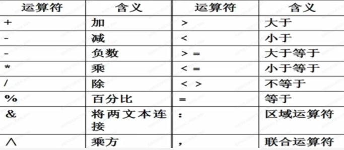

2. 运算符

   - (1)引用运算符

     - **：矩形区域** 

       **,并集**    

       **空格 交集**  (不自动出现 手动输入) 例：B2:C3C3:D4交集为C3

       **! 三维引用（表间引用） **例：Sheet1!A1:D2引用工作表Sheet1中的A1:D2

   - (2)算术运算符：+ - * /  ^（乘方） %（百分号）（从低到高）

     - 注意：现有等号才能计算
     - 例1：=2^3结果为：8     例2：=30%*10结果为：3

   - (3)文本连接符：&

     - 可以连接文本格式，不能连接数字格式

   - (4)关系（比较)运算符：<、<=、>、>=、<>、=

   - (5)运算优先级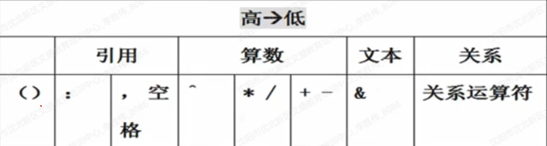

     先看范围，算术，文本，关系

3. 单元格的地址引用

   - (1)相对引用：
     公式复制、地址改变。如：A1

   - (2)绝对引用：
     公式复制、地址不变。如： $A\$1

   - (3)混合引用：$A1     A\$1

     注：地址切换功能键：**F4**

     如果移动是不变的只有复制变

     方法：先看有没有$有远洋写没有差多少就加或减多少
     
     **注意：如果绝对引用的单元格移动地址变化 因为绝对引用锁定的是单元格不是单元格的位置**

4. 函数

   - (1)插入函数的方法
     - **编辑栏左侧的fx**
     - **开始→编辑→自动求和（Alt+= 自动求和）**
     - 公式→函数库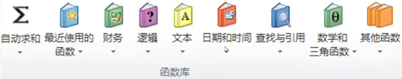
   - **(2)6个函数**
     - 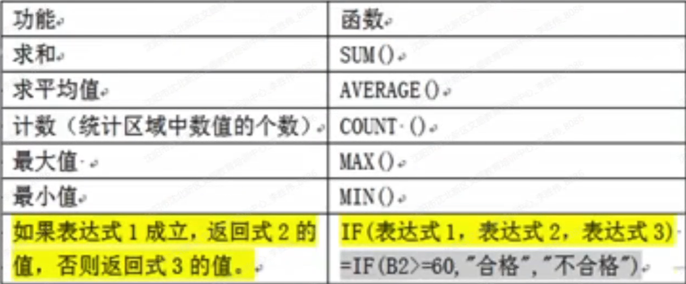
     - Sum/average/max/min 求和/平均值/最大值/最小值
       Count(数值)--计数（日期时间也算）
       If（B2>=60,"合格","不合格")                                                                     含义：如果B2>=60，则合格否则不合格(如果B2位置是单元格复制后结果发生变化如果是数值无变化)
     - 操作示例——计算
       答：选中...（第一个写计算结果的单元格)
       输入公式：=...，选中*并指向填充柄，按下左键向 下/右 拖动填充柄到##（最后一个写计算结果的单元格）

5. 出错信息

   - 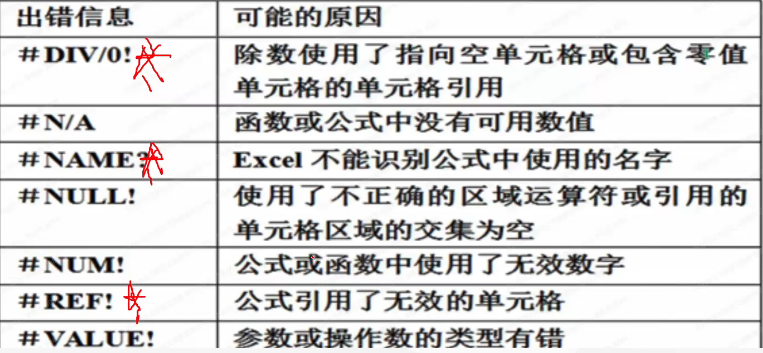

### 5.数据管理

1. 记录单(数据清单)

   - 说明--记录单（数据清单）
     1. **作用：用于进行排序、筛选、分类汇总等操作。**
     2. 构建要求
        - **第一行--列标志**
        - **同一列--数据类型相同**
        - **避免空白的行或列**
        - **尽量在一张工作表上**
     3. 记录：表中的一行
        字段：表中的一列

2. **排序、筛选、分类汇总**、数据有效性、合并计算、分列

   - 操作方法

     1. 数据选项卡
     2. 开始→编辑→排序和筛选

   - 排序

     1. **64个关键字：主要、次要、次要关键字**

        **(主要关键字相同、再按次要关键字排序)**

     2. **次序：升序、降序、自定义序列**

        **(不同关键字次序可同、不同)**

     3. **排序依据：数值、字体颜色、单元格颜色、单元格的图标**

     4. 排序列有空格排在最后

     5. 排序列有相同值，位置不变

     6. 操作示例——排序：

        选中**（带列标题的全部有效数据区域如A1:D5),选择数据选项卡，排序和筛选组，排序，设置：主要关键字为##，次序为##（次要关键字为##，次序为##）

     7. 说明：分类

        - 1.简单排序 尽量不选择序列，可选某一个单元格
        - 2.复杂排序 可选中表中有效数据区域（任意一个单元格）

   - 筛选

     1. 满足条件---显示；不满足条件---隐藏

     2. 可以按值、颜色等进行筛选（筛选当中可以进行排序）

     3. 分类：

        |        | 自动筛选 | 高级筛选                       |
        | ------ | -------- | ------------------------------ |
        | 不同列 | 与       | 或/与                          |
        |        | 可排序   | 需先设**条件区域（绝对引用）** |

     - 说明1 条件区域：

       1. 字段名必须同原表
       2. 条件必须在同一行上——与
       3. 条件在不同行——或

     - 操作示例--自动筛选

       选中...（如A1:D5),选择数据选项卡，排序和筛选组，筛选，单击“...”字段的筛选器箭头，设置...

   - 分类汇总

     1. 分类汇总前，必须对**分类字段排序**
     2. 自动计算分类汇总和总计，结果可展开或折叠
     3. 撤消分类汇总，在分类汇总对话框中单击【全部删除】按钮

     - 汇总出男女生期末的最高分

       分类字段排序--见排序示例   选中...（如：A1:D5),**单击数据选项卡，分级 显示组，分类汇总**，设置**分类字段**：性别 **汇总方式**：最大值 **选定汇总项**：期末

   - 数据有效性

     1. 输入信息提示、出错警告、圈释无效数据(**红色椭圆**)

     2. 操作示例：问：设置高数英语成绩为百分制

        答：选中...（**不带列标题的有效数据区域**)，**单击数据选项卡，数据工具组**，**数据有效性**，设置数据为：**小数，介于，最小值为0，最大值为100**

   - 分列

     1. 将1列的单元格内容（如姓名)**拆分**到**不同的列**中

   - 合并计算

     - 将多个单独工作表中的数据合并到一个工作表中。

       (需设标签位置：首行、最左列)

### 6.图表

1. 图表

   - 数据的图形化表示
   - 图表数据：可相邻回或不相邻
   - 分类：嵌入式图表、图表工作表（chart1)
   - F11 快速生成簇状柱形图
   - **4322**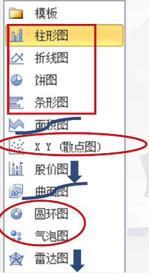

2. 图表考点

   - **图表可改位置、大小、可删除**
   - **数据源更新，图表数据自动更新**
     图表中数据删除不会改变数据源表
   -  **分类汇总后数据生成图表，图表数据可显示或隐藏**

3. 图表修饰（重要）

   - **图表工具设计：图表样式（样式1)、图表布局（布局2）；增加、删除图表数据；切换行列：移动图表(跨工作表进行移动)**

   - **图表工具布局：更改图表标题、坐标轴标题，图例、数据标签、背景网格线**（数二标背网图）

   - **图表工具格式：图形高度和宽度**

   - 操作示例：一插入/修饰图表

     1. 插入

        选中 ...(带列标题的第一行有效数据区域,如A1:A5)按下Ctrl键同时选中...（带列标题的其他列有效数据区域,如D1:D5)单击插入选项卡，图表组，...（大类，如柱形图)，选择...（小类，如三维柱状型图

     2. 修饰
        选中图表，单击图表工具...选项卡...组，设置...

4. 迷你图

   - 插入→迷你图
   - 数据源--1行或1列
   - 绘图区域--单元格（上）
   - 类型--折线图、柱形图、盈亏

5. 数据透视表/图

   - **插入→表格组→数据透视表**
   - 功能：能够将排序、筛选、分类汇总、数据计算、美化等操作一次完成，有利于将数据转换为有价值的信息。
   - 说明：数据更改，不自动更新，可刷新

### 7.页面设置和打印

- 页面布局→页面设置→纸张大小，纸张方向，页边距，背景打印区域，打印标题 以及页眉页脚等
- 打印区域不设置，默认打印当前活动工作表
  (可选择打印：工作簿、工作表、选定区域、图表 (无单元格)
- 同一行数据可能打印在不同页上
- Excel在打印时可以设置或编辑页眉页脚（文件 打印 页面设置）

## PowerPoint

### 1.PowerPoint2010概述

1. PowerPoint功能

   - 1.制作**演示文稿**

2. PowerPoint窗口

   - PPT的视图方式

     1. **普通视图（默认，编辑幻灯片的内容）**
     2. **幻灯片浏览视图**
     3. **幻灯片放映视图** ---视图选项卡中无
     4. **备注页视图**---状态栏视图切换区中无
     5. **阅读视图**

   - **普通视图**

     - **默认视图**
     - **3窗格 幻灯片/大纲窗格、幻灯片窗格、备注窗格**
     - **拖动**可以调整窗格的大小
     - **幻灯片选项卡**：以**缩略图**方式**遍历**演示文稿，方便重新**排列、添加或删除幻灯片**
     - **大纲视图选项卡**：
       只显示文本（**标题、正文**），不显示文本框，图片不显示，但是**可以插入图片**
     - **幻灯片窗格**：显示当前幻灯片的**大视图**。**可以添加所有对象**
     - **备注窗格**：用于键入**当前**幻灯片的**备注**。
     - 在普通视图中，在幻灯片窗格滚动条处按下鼠标左键时在**滚动条**旁会显示**当前幻灯片的编号和幻灯片总数、标题**
     
   - **幻灯片浏览视图**
   
     - 一个窗口，缩略图
     - 适合预览整体变化：设计主题、背景
     - 方便幻灯片的添加、删除、移动（**不可编辑幻灯片内容**）可预览动画
     - 可以在**右下角**看到幻灯片的**隐藏标记**（只在放映时隐藏）
     - **增大显示比例，减少一屏幻灯片浏览页数**
   
   - 备注页视图
   
     - **默认不播放**
   
     - **在备注页视图/幻灯片浏览视图**下，**双击幻灯片**，**进入普通视图**
   
     - |      | 普通视图 | 备注页视图           |
       | ---- | -------- | -------------------- |
       | 备注 | 文本     | 文本、图片等各类对象 |
   
   - 阅读视图->窗口显示
   
     - 查看演示文稿
     - **窗口**上显示**标题栏  幻灯片放映效果  状态栏**
   
   - 放映视图->铺满屏幕
   
     - 无标题栏 无状态栏 展示放映效果
     - 在幻灯片放映选项卡下 前面的都在视图选项卡下
     - **从头放映F5  当前开始Shift+F5**
   
   - PPT状态栏
   
     - 幻灯片第 * 张 ，共*张  --（滚动条也显示）
     - 主题名
     - 语言
     - 显示比例：**10%-400%(PPT,Excel)  10%-500%(Word)**
   
3. PPT概念

   - **演示文稿：文件(*.pptx)**
   - 幻灯片：演示文稿由 **0/多** 张幻灯片构成
   - 占位符：虚线：可以放置各种对象
   - 对象：**文字、图片、图表、音频、视频、动画**等

### 2.演示文稿的基本操作

1. 演示文稿的基本操作
   - 说明1：启动PowerPoint后，自动建立“**演示文稿1**"包含**一张标题幻灯片**
   - 说明2：文件保存类型
     - pptx一演示文稿
     - potx一设计模板
     - ppsx一PowerPoint放映
     - .rtf/.pdf/.html一文本
     - .gif jpg .png一图形
     - (无音频)
     - .Wmv一视频

### 3.幻灯片的设计与制作

1. 幻灯片的基本操作
   - 选定、**新建**、删除、移动、复制、**隐藏**、重用、**版式**
     (**无保存 无重命名**)
   - 通用方法
     1. 选项卡-“开始”/幻灯片放映
     2. 单击右键 -快捷菜单
     3. 快捷键
   - 新建幻灯片（先定位、后操作)
     - **Ctrl+M**--新建幻灯片
     - **幻灯片/大纲窗格单击定位，按Enter键**
     - **在幻灯片（最后）项目的结尾处，按Ctrl+Enter**
     - 复制，定位，粘贴
     - 幻灯片浏览视图，**右击→新建幻灯片**
     - **Ctrl+N--新建演示文稿**
   - “复制”与“复制幻灯片”
     - **复制：需定位后粘贴**（放入剪切板）
     - **复制幻灯片：无需定位，直接粘贴到选定幻灯片下一页**（不放入剪切板）**快捷键Ctrl+D**
   - 隐藏幻灯片
     - **默认不放映，可强制放映**
     - **编号不变、多一斜杠**
     - **隐藏不等于删除，可编辑**
     - 操作：**幻灯片放映 选项卡 设置组 隐藏幻灯片**
   - 重用--**重复使用**
   - 版式
     - 选中...幻灯片，单击右键，版式，选则...版式
     - **说明：新建幻灯片的版式一般同定位前一页幻灯片版式（标**
       **题幻灯片除外)**
2. 幻灯片的编辑
   - 占位符、版式
     - **单击操作**
     - **占位符里提示文字不播放**
     - 单击占位符，打开**绘图工具格式**选项卡
     - 在幻灯片**母版**中，**可插入占位符**（**普通视图中不可以）**
   - 插入对象
   - 幻灯片版式
     - 显示占位符和各类对象的**布局**
     - 内置、**自定义版式**
     - 空白版式默认无占位符
   - 插入对象一**【插入】选项卡**
     - 表格—表格
     - 图像—图片（动画)、剪贴画、屏幕截图
     - 插图一形状、Smartart图、图表
     - 链接一超链接、动作
     - 文本一艺术字 时间和日期+页眉和页脚、幻灯片编号
     - 符号一符号、公式
     - 媒体一音频、视频
   - 说明1-插入文本
     - 插入选项卡→文本组
     - 文本占位符
     - 封闭图形内可以写文字
     - 复制→粘贴（会出现文本框）
     - **说明：不可以在幻灯片上直接输入文本**
   - 说明2-插入音频、视频
     - 数据源： **文件中的音频/视频  剪贴画 来自网站的 录制音频、CD音频**

### 4.幻灯片的外观设计

**对象美化**

1. 对象美化
   - 文本框、艺术字
   - 图形、图片、剪贴画、SmartArt图、图表、动画
   - 表格
   - 声音、影片
2. 文本
   - 5种对齐方式
   - 3种缩进方式：首行/悬挂缩进、**文本之前**
   - 3种间距
   - 5种行距 无最小值
3. 对象美化-音频**（音频工具-播放选项卡）**（音频工具-格式选项卡）和图片大致一样
   - 自动——在显示幻灯片时自动开始播放
   - 单击——在单击鼠标时开始播放（默认）
   - 跨幻灯片播放——播放所有幻灯片
   - 循环连续播放，直至停止为止
   - 可以预览、音频剪辑、放映时隐藏音频图标

**整体美化**

1. **主题（主题颜色、主题字体、主题效果）**

   - 主题：一套可以**直接应用**的、具有**专业设计师**水准的演示文稿的方案。

   - 主题：颜色、字体、效果。（更改超链接颜色：设计主题--颜色)

   - 一个演示文稿可设一个或多个主题（在主题上右击）

   - 单击/双击--应用于所有（右击--应用于所有/选定幻灯片）当一个文档中有多个主题是+相应的幻灯片

   - 操作示例-主题

     将第三张（所有）幻灯片设置“波形”主题

     答：选中第三张（所有）幻灯片，单击**设计**选项卡，**主题组**
     **右击波形主题**，选择应用于选定幻灯片

2. 背景

   - 设计→背景→背景样式（**样式1**)-右击...选择应用于选定幻灯片

   - 纯色、渐变、预设颜色、图片、纹理、图案等背景（在设置背景格式选项卡）

   - 操作示例

     选定...幻灯片，单击**设计**选项卡，**背景**组，**背景样式**，**设置**
     **背景格式**，填充，设置背景为**

     (关闭按钮--应用于选定幻灯片
     全部应用--全部）

   - 说明

     - 背景图片大小、位置不可调
     - 可隐藏背景图形（可用于隐藏幻灯片母版中添加的对象 普通视图添加的对象不可以）

3. 母版

   - 作用：可以对**演示文稿**进行**统一的样式更改**
   - 视图→**母版视图组**→**幻灯片母版 / 备注母版 / 讲义母版**
   - 幻灯片母版
     - 默认包含**5**个**占位符**。**标题、文本、页脚、数字、日期**
     - 可插入**图片**、**表格**、**图表**、**占位符**等各种对象
     - **母版**中**插入的对象**，在**普通视图**状态下**不可以修改**
     - 可以**创建**包含**一个**或**多个**幻灯片**母版**的演示文稿。**修改**其中**某一母版**，**则只会**影响**基于该母版的**相关**幻灯片**
     - 进入幻灯片母版：**按住shift并单击普通视图按钮**
   - 备注母版  讲义母版
     - 二者含相同的占位符：页眉、页脚、数字、日期
     - 说明：
       讲义中每页幻灯片数量：**6（默认）**，**9（最多)**，**1,2,3,4**

4. 模板

   - **PowerPoint模板**是一张幻灯片或一组幻灯片的**图案**或**蓝图**
   - 包含版式、主题和背景样式，甚至内容
   - PowerPoint模板文件一*.potx
   - 可应用、可创建、可下载

### 5.演示文稿的交互设计

1. 设计动画效果

   - 动画：给**对象**添加视觉或声音效果

   - 类型：**进入、退出、强调、动作路径**：可使用**1/多种**

   - 操作示例：

     选中..，单击**动画**选项卡，**动画**组，选择...（如：飞入)设置**效果选项**：..（自左侧）[**高级动画组，添加动画，选择..**.]

   - 说明：

     - 预览
     - 计时组---顺序、持续时间
     - 可添加、删除、修改
     - 引入文本的方式：**整批发送、按段/字/词/字母** **无按句**
     - **可反转路径**
     - 可设置**触发器** 重复、**播放后快退**
     - 播放动画后可选不变暗（默认)、其他颜色、播放动画后隐藏、下次单击后隐藏
     - 复制动画---**动画刷(Alt+Shift+C)**

2. 幻灯片切换

   - **由一张幻灯片过度到下一张幻灯片的效果**

   - 切换选项卡：

     预览、**切换到此幻灯片**、计时
     动画选项卡
     预览、**动画**、高级动画、计时

   - 说明：计时组

     - 添加**声音**、持续时间、换片方式等
     - 换片方式：**单击**鼠标、**计时换片**

   - 操作示例：
     选中..幻灯片，单击**切换**选项卡，**切换到此幻灯片组**，
     选择...（**大类**)，**设置效果选项**为**（小类）

3. 设置动作按钮

   - **插入→插图→形状→动作按钮→选择... 按钮并拖动绘**
     **制，设置链接...**

   - 自定义动作设置
     **单击鼠标**
     **鼠标移过**

   - 可设置动作  

     超链接
     运行程序
     运行宏
     设置播放声音

   - 说明：对**其他对象**设置动作--插入→超链接→动作

4. 超链接 -幻灯片放映状态下可见的具体效果

   - 文本、图片、表格等所有对象都可创建超链接
   - **超链接目标可以是幻灯片，不可以是幻灯片中的某个具体对象**

### 6.演示文稿的放映、打包和打印

1. 放映

   - F5--**从头**放映
   - Shift+F5--从**当前**幻灯片开始放映
   - Home/end--**第一**张/**最后**一张幻灯片
   - 播放任意一张幻灯片-放映状态下，输入**编号，按Enter**（可**放映隐藏幻灯片**)
   - 上一张：← ↑ **backspace** pgup
   - 下一张：→ ↓ **Enter空格**  pgdn
   - **单击左键：下一张**
   - **单击右键：上下一张/结束放映**
   - 结束放映：**ESC  Alt+F4  右击→结束放映**
   - 可在放映的幻灯片上**涂写**（**Ctrl+P**),按**E键可擦除涂写**(放映视图下)
   - **按W/B—白/黑屏暂停**
   - 按住**Ctrl同时按住鼠标左键 激光笔**
   - **单击鼠标右击一暂停放映**

2. 放映类型

   - **演讲者放映（全屏幕）**
   - **观众自行浏览（窗口）**
   - **在站台浏览（全屏幕）(键盘鼠标不好使只可按Esc)**

3. 放映范围

   - 全部、部分(连续)、自定义放映(可连续可不连续)

4. 换片方式

   - **手动、按排练计时**

5. 放映方式

   - **循环放映**，按Esc键终止
   - 放映时可以不加**旁白/动画**

6. 操作示例

   - 单击**幻灯片放映放映**选项片，**设置**组，选择**设置幻灯片放映**，设置**

7. 打包

   - 作用：**可以在没有PPT软件的计算机上放映PPT文件**
   - 方法：**文件→保存并发送→将讲演示文稿打包成CD**
   - 说明：光盘、硬盘、U盘等磁盘均可

8. 打印

   - 1.页面设置一“在设计选项卡下”
     设置幻灯片大小、方向、页面方向、幻灯片编号起始值（可以是0）

   - 2.页眉页脚/幻灯片编号—插入→文本

     | 位置 | 幻灯片                            | 备注和讲义 |
     | ---- | --------------------------------- | ---------- |
     |      | 页脚                              | 页眉页脚   |
     |      | 幻灯片编号                        | 页码       |
     |      | 可设标题幻灯片中不显示            |            |
     |      | 两者都可设日期/时间/固定/自动更新            |

   - 3.打印设置一“文件”→打印

     - 打印版式：幻灯片、备注、讲义、大纲
     - 打印范围：1,3,5-8
     - 打印颜色：颜色、灰度、纯黑白
     
   - PPT打印状态下可编辑页眉页脚

     - 讲义，每页三张幻灯片：
       上/左侧--幻灯片缩略图
       下/右侧--注释空间

## 网络

### 1.计算机网络基础知识

1. 计算机网络的发展

   - 第一阶段：**诞生阶段—远程终端联机阶段**
     - 20世纪50年代末。典型应用是由一台计算机和全美范围内2000多个终端组成的飞机订票系统
   - 第二阶段：**形成阶段**
     - **60年代后期，典型代表ARPANET。**1969年
     - ARPANET将计算机网络分为**通信子网**和**资源子网**两部分
   - 第三阶段：互联互通阶段
     - 20世纪70年代末至90年代，出现**OSI体系结构**和**TCP/IP体系结构**
     - TCP:传输控制协议
     - IP:网际协议/网间协议
     - OSI:开放系统参考模型
   - 第四阶段：高速网络技术阶段
     - 典型代表Internet

2. 网络的定义

   - 计算机网络是分布在**不同地点**的具有**独立功能**的**多个计算机**系统用**通信设备互相**连接起来，在**网络软件的支持下**，实现彼此之间的**数据通信和资源共享**的系
     统。（简答）

3. 网络的功能

   - 数据通信（信息交换）
   - 资源共享（最本质的功能） （共享硬件资源  共享软件资源 共享数据资源）
   - 协同工作（分布式处理）

4. 网络分类

   - 按地理范围分

     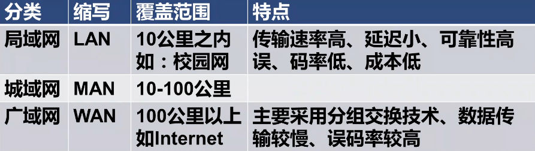

   - 按信息传输方式

     - 电路交换
     - 报文交换
     - 分组交换

   - **按网络拓扑**

     - **星型、环型、总线型**、树状、网状

     - 拓扑结构：**多部计算机连成一个网络所形成的几何图形**

     - 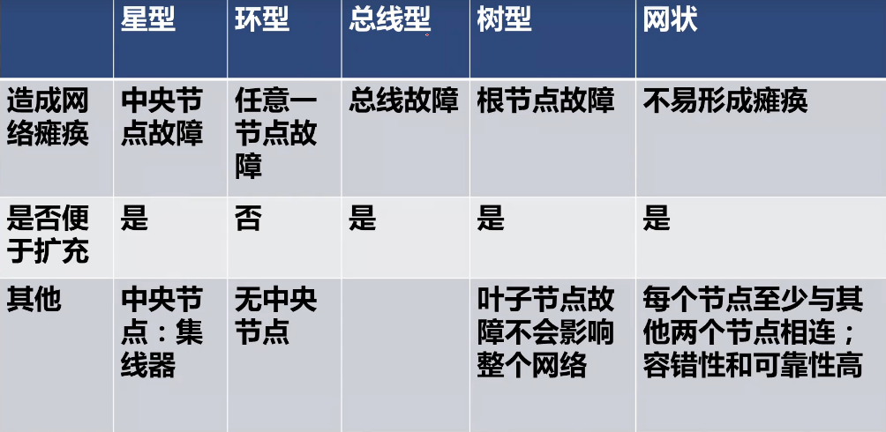

       集线器（Hub） 
       
       树形 和 网状 
       
       星型 环型 总线型 树型 应用局域网

   - 按用途分

     - 公共网络 和 专用网络

5. **OSI网络体系结构**

   - 网络体系结构：计算机网络的**各层及网络协议的集合**

   - 网络协议：为进行网络中的数据交换而建立的**规则、标准和约定**

   - **网络协议三要素**

     - **语法**：用户数据与控制信息的**结构与格式**
     - **语义**：解释控制信息每个**部分的意义**
     - **时序**（同步）：对事件**发生顺序的详细说明**

   - **作用**：将复杂的网络设计**标准化、模型化**

   - OSI:**开放系统互联参考模型**

   - 70年代，由国际标准化组织ISO提出，共7层**（1977年）**

     **(1)物理层（2)数据链路层（3)网络层 (4)传输层（5)会话层**
     **(6)表示层  (7)应用层**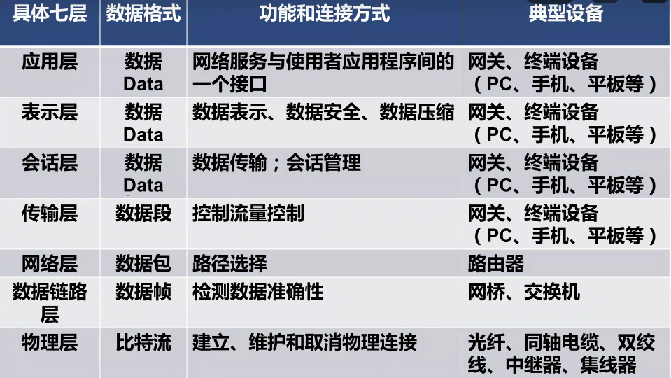

### 2.局域网的组成

1. 网络组成：网络硬件+网络软件

   - 网络软件：网络系统软件：

     - 网络操作系统等  网络应用软件：浏览器、QQ等

   - 网络硬件：

     - 网络主体设备：服务器、工作站  

     - 网络传输介质
     - 网络连接设备

2. 网络的主体设备

   - 网络中计算机称为**主机(HOST)**,包括**服务器**（中心站) 和**工作站**（客户机）
   - 服务器：**多用户计算机**，是网络中**提高共享资源的特殊计算机**，具有**网络系统资源及安全管理等功能对工作站进行管理并提供网络服务**
   - 工作站：**连接到网络中的独立计算机**

3. 传输介质

   - 有线：双绞线  光纤 同轴电缆
   - 无线：红外线  激光 微波 卫星
   - 1.双绞线(Twisted-Pair) 双绞线价格便宜，易于安装使用，性价比高（RJ-45）**有效距离100米；常用于局域网**
   - 2.同轴电缆(Coaxial Cable)  分类：粗缆(传输距离500m)  、细缆 (传输距离180m）粗缆传输性能优于细缆
   - 3.**光纤(Optical Fiber)** 光纤的芯线一般是直径为0.11微米的石英玻璃丝  常用于广域网    优点：速度快、距离长、信息量大、重量轻、体积小、可靠性好、安全保密性好、抗电磁干扰能力强，误码率低等

4. 网络互联设备

   - 网卡NIC（网络接口卡 网络适配器） 上网必备网卡

     选择网卡的依据

     - (1)组网的拓扑结构
     - (2)使用传输介质的类型
     - (3)网络段的最大长度
     - (4)节点之间的距离

   - 中继器

     - 功能：完成信号的**复制**、**调整**、**放大**、并**发送** 以此来延长网络的距离
     - 工作在物理层

   - 集线器（hub）

     - 特殊的中继器
     - 星型拓扑结构的网络中心
     - 工作：广播方式
     - 工作在OSI的物理层

   - 调制解调器

     - 完成**数字信号**和**模拟信号**之间的**相互转换**
     - **调制：数字信号→模以信号**
     - **解调：模拟信号→数字信号**
     - 拨号上网必须的设备之一

   - 网桥

     - 功能：连接两网（类型相同）
     - 工作在数据链路层
     - 特殊的网桥：交换机

   - 路由器

     - 路由器：实现不同网络之间的相互通信
     - 功能：路由选择
     - 工作在网络层
     - 传输单位：数据包

   - 网关

     - 连接两网（类型可相同、可不同）
     - 工作在0SI 4一7层

### 3.Internet:基础知识

1. Internet概述
   - 起源于：ARPANET(阿帕网)
   
   - **Internet**是一个以**TCP/IP协议**连接各个国家、各个部门、各个机构的进行数据通信、资源共享的**广域网**
   
   - **Internet,国际互联网（网际网）**
   
   - **Internet标准协议→TCP/IP协议**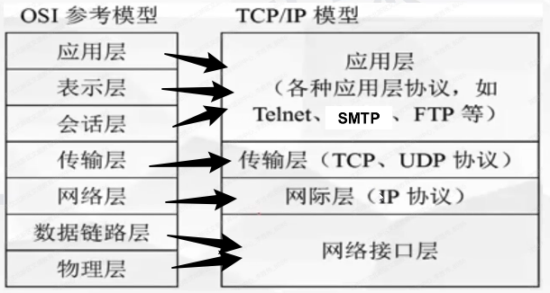
   
   - OSI参考模型是国际标准，TCP/IP:是Internet上事实的网络标准
   
   - 说明：Internet使用路由器将专用计算机网络互连在一起。
   
   - Internet采用**分组交换**技术
   
   - IP电话就是通过因特网(Internet)打电话
   
   - Internet地址结构
   
     - IP地址(逻辑地址)
   
       - 含义：IP地址是给每一个连接到Internet上的网络设备或主机分配的一个全网范围的**唯一**网络标识
       - IPV4:32位二进制数，难于记忆 IPv6:128位 相差2^96^倍
       - 表示方法：点分十进制
         1. 按字节分为4个十进制数
         2. 没个数范围0-255
         3. 中间用点隔开
       - 组成：**网络地址+主机地址**
   
     - **IP地址的分类**
   
       - 分类标准：首字节划分
   
       - | 范围    | 范围    | 开头     |                             |                              |                 |
         | ------- | ------- | -------- | --------------------------- | ---------------------------- | --------------- |
         | A类范围 | 0-126   | 0开头    | 网络地址前8位 主机地址24位  | 后3为全为0 或者全为255不可用 | 2^24^-2         |
         | B类范围 | 128-191 | 10开头   | 网络地址前16位 主机地址16位 | 后2为全为0 或者全为255不可用 | 2^16^-2         |
         | C类范围 | 192-223 | 110开    | 网络地址前24位 主机地址8位  | 后1为全为0 或者全为255不可用 | 可用254个ip地址 |
         | D类范围 | 224-239 | 1110开头 | 多播地址                    |                              |                 |
         | E类范围 | 240-254 | 1111开头 | 预留地址                    |                              |                 |
   
       - | 分类             |
         | ---------------- |
         | A类：超大型网    |
         | B类：大中型网    |
         | C类：小型网      |
         | D类E类有特殊用途 |
   
       - | 子网掩码 | 网络地址换成255        | 主机地址换成0 |
         | -------- | ---------------------- | ------------- |
         | A        | 网络一个数  主机三个数 | 255.0.0.0     |
         | B        | 网络俩个数  主机俩个数 | 255.255.0.0   |
         | C        | 网络三个数  主机一个数 | 255.255.255.0 |
   
2. 域名系统DNS

   - 域名：IP地址的字母表示形式；
   - 格式：主机名.三级域名.二级域名.顶级域名
   - DNS:是域名和IP地址的映射形成的一个分布式数据库。用于**将域名转换为IP地址**
   - 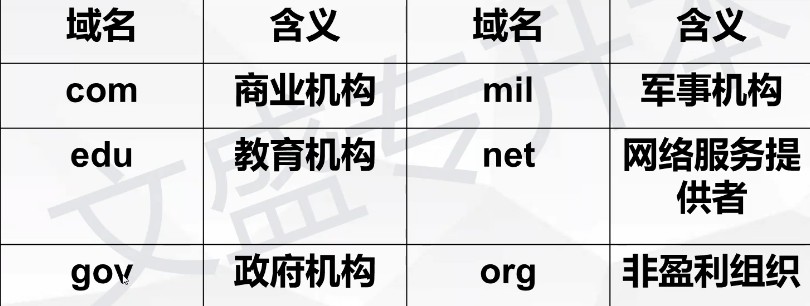

3. Internet的接入

   - **Internet服务提供商(ISP)**是接入Internet的桥梁
   - 接入方式
     1. **PSTN(公共电话交换网)接入**
     2. **ADSL（非对称数字用户环路)接入**
     3. **光纤接入**
     4. **局域网/无线局域网接入**

### 4.Internet服务与应用

1. www服务(WWW-World Wide Web)

   - www服务：万维网

   - 工作模式：客户机/服务器（c/s）

   - 协议：HTTP(超文本传输协议)

   - 浏览器：IE

   - 统一资源定位符（URL)

     - 含义：信息资源在网上什么位置及如何定位寻找的统一描述方法
     - 格式：协议：//主机域名（或IP地址）/路径/文件名
     - 例子HTTP://www.baidu.com/news2012/Index.htm

   - 说明：IE浏览器的应用

     - 可浏览、可下载；可收藏、保存网页（.HTML)、**不可编辑网页**

   - Internet选项：可设定主页、清除浏览记录

     - 主页：启动浏览器时自动连接到网站

     - 首页：网站的第一页

   - **IE浏览器**

     - 说明：网络流媒体技术：网络流媒体技术即在线播放技术它支持边下载边播放的功能
     - 数字证书：相当于在网络上证明个人和公司身份的网上身份证
     - 误码率：衡量数据在规定时间内数据传输精确性、可靠性的指标

2. 电子邮件（E-mail)

   - 邮箱地址：全球唯一
     - 地址格式：用户名@电子邮件服务器域名
     - 如：sunny@163.com
   - 协设
     - SMTP(简单邮件传输协这→用于发信）
     - POP3(邮件接受协议→用于收信）
   - 电子邮件的组成：**邮件头**与**邮件体**两部分
   - **特点**
     1. 邮箱是在E-mail服务器磁盘上的存储空间（不在自己计算机上)
     2. 不要求双方同时在线
     3. 一信多发
     4. 可以给自己发信
     5. **添加附件：传送多媒体信息文件；**

3. 文件传输（协议FTP)

   - **下载：将文件从远程主机复制文件至自己的计算机上**
   - **上传：将文件从自己的计算机中复制至远程主机上**
   - IE浏览器也支持FTP 如：ftp://**ftp.gznu.edu.cn**

4. 远程登录服务（协议：Telnet)

   - 允许用户利用一台联网的计算机登录到一个远程分时系统，然后像使用自己的计算机一样使用远程登录的计算机。

5. 电子公告板(BBS)

   - BBS(Bulletin Board System);BBS上开设了许多专题可以展开讨论、交流、疑难解答、召开网络会议等

6. 网络常用缩写含义

   | 网络常用缩写           |                                        |
   | ---------------------- | -------------------------------------- |
   | LAN:局域网             | TCP:传输控制协议                       |
   | MAN:城域网             | IP:网际协议                            |
   | WAN:广域网             | FTP:文件传输协议                       |
   | ISO:国际标准化组织     | DNS:域名系统                           |
   | OSI:开放式系统互联     | URL:统一资源定位符                     |
   | E-mail:电子邮件        | SMTP:简单邮件传输协议                  |
   | POP3:邮件接收协议      | WWW:(World Wide Web)全球信息网或万维网 |
   | ISP:互联网服务提供商   | Telnet:远程登录                        |
   | bps:网速单位、带宽单位 |                                        |

   


