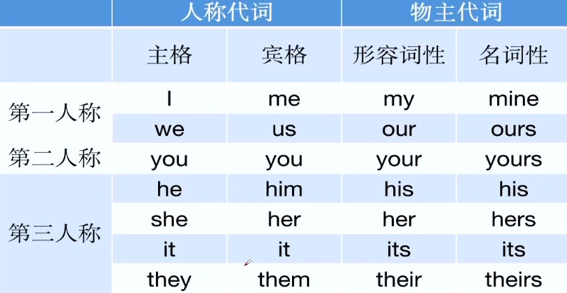
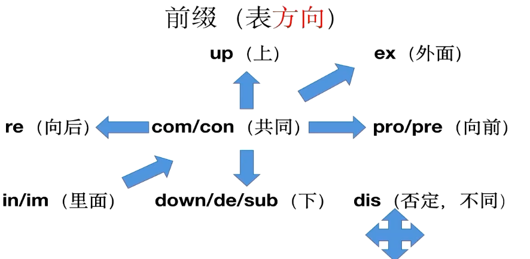

# 英语

## 词性

1. 动词V
   - 动词大都以ate /fy / ize结尾
2. 名词n
   - er / or / ant / ist 结尾表示人或物
   - tion / sion / al / ary名词后缀
3. 形容词adj
   - 一般以ous / ful / ary / ive / able / ible / al尾，翻译为...的
4. 副词adv
   - 一般以ly结尾
5. 介词(prep)
   - on / at / in / of / for等，介词后面要加名词性的成分
   - 表示地点at / in  小地点at 大地点in
   - 表示时间 at / on / in  
     - 具体的几点钟at  at six o'clock
     - 具体的某一天on on Monday on October 1st
     - 某一特定的时间段以及不具体的月份，年份in  in the morning in spring
   - 表示所属of   A of B=B的A
   - 表示为了 for
6.  冠词(article)
   - 定冠词the
   - 不定冠词a/an   **a/an看首字母，元音前用an,辅音前用a**
   - I want to eat the apple 我想吃这个苹果  表示指定一个(这个)苹果
   - I want to eat an apple. 我想吃苹果  表示比如一个篮子里的苹果随便一个都行
7. 代词
   - 代替前面出现过的名词
   - 人称代词和物主代词
     - 人称代词：一个称呼，指代人或物体  The cat is white It is so cute.
     - 物主代词：一种所属关系，可以理解为..的  my friend=a friend of mine.****
     - other/others/the other/another的区别
     - this(这一个)/that(哪一个)/these(这些)/those(哪些)的区别
8. 所有格
   - 和物主代词一样，是一种所关系

## 词根词缀

1. ex外面（前缀）  pen钱（词根） ive形容词后缀（词缀）

   - expensive 贵的 

2. dict 说（词根） ary名词后缀（词缀）

   - dictionary 字典

3. con/com一起（前缀） tempo节奏（词根） ary形容词后缀（词缀）

   - contemporary  当代的，同时代的

4. 前缀表方向

   - com/con (共同)

     ```
     communicate with sb V.交流
     cooperate/collaborate with sb v.合作
     compete with sb v.竞争 和皮特一起竞争
     combine A with B v.结合
     A contradict B v.矛盾  dict说
     contradict/controversy/controversial 矛盾的
     contrary adj.相反的
     on the contrary
     compensate sb for sth v补偿
     concentrate on sth v.集中注意力
     convention n.大会；传统，惯例
     conventional adj..传统的
     community n.社区
     condemn  v.谴责
     commerce n.商业
     merchant n.商人
     commercial adj.商业的
     confront sth v.面对
     be confronted with
     contest n.竞赛
     confirm v.确认，证实
     company n.公司，陪伴
     companion n.陪同（陪伴的人或物）
     compatible adj.兼容的
     A is compatible with B
     compile v.收集，编纂
     a pile of = piles of = lots of =a lot of  一堆
     compromise v./n.妥协，折中
     consist of v.由...组成
     The class consists of 60 students
     consult with v.咨询
     consultant n.顾问
     ```

   - dis(不同)(否定)

     ```
     discuss v.讨论
     distinction=difference=disparity n.不同
     dismiss v.解雇
     display v.展示
     dispute v./n.争论
     dispute with sb       dispute sth
     distribute v.  distribution n.分配
     tribute 贡品
     contribute v.  contribution n.贡献
     discriminate A from B v.区分
     crime n.罪 commit crimes犯罪
     criminal adj.犯罪的n.罪犯
     distinguish A from B v.区分
     dispose sth v.安排布置
     disadvantage n.缺点
     disagree with sb v.不同意
     discover v.发现
     charge sb with sth v.控告
     charge a battery 充电
     discharge v.释放
     dis否定
     discriminate against vi.歧视
     dispose of vi..处理
     dis不同
     discriminate vt.区分
     dispose vt.安排布置
     ```

   - up(上) down/de/sub(下)

     ```
     upward adj..上升的
     downward adj..下降的
     upgrade v.升级
     degrade v.降级
     decrease=decline v.下降
     download  V.下载
     subway  n.地铁
     ```

   - ex (外面)   in/im (里面)

     ```
     import 进口
     export 出口（贸易出口）
     exit 出口（场所出口）
     ex-boyfriend/girlfriend（前男友/女友）
     eliminate v.消除
     exaggerate v.夸张
     elaborate v.详细阐述(on); adj.精心制作的
     evaluate=estimate v.评估
     explode v.爆炸
     expose v.暴露
     be exposed to
     exposure n.暴露
     invite v.邀请
     involve v.卷入
     be involved in
     invade v.入侵
     install v.安装
     invest v.投资
     investigate v.调查
     isolate v.孤立
     ```

5. 后缀表词性

6. 词根表意思

   

## 句子成分

1. 主语：动作的发出者
   - **The boy** comes from China.
   - **He** usually goes to school by bus.
   - **Studying English** is very important.
   - **To help others** is very important.
   - **What he said** made me happy.
2. 谓语：一个动作
   - He **likes** me.
   - I **ate** an apple.
   - I **bought** a book yesterday.
   - **谓语只能是动词**
3. 宾语：动作的接受者
   - Tom likes **the girl**.
   - I am afraid of **dogs**.
   - He enjoys **painting.**
   - He wants **to become a doctor**.
   - He thinks **that he is right**.
   - **宾语只能是名词性的成分**，**宾语有没有取决于动词**
   - **主语，宾语只能是名词性的成分**
   - 一个句子必须要有主语和谓语，宾语有没有取决于动词
4. 表语
   - **be动词后面的任何成分**都**是表语**主系表结构
   - I am **happy**.
   - His father is **a teacher**.
   - His speech was **so boring**.
5. 定语
   - 定语是用来修饰名词的，起修饰限定的作用。
   - 定语（将其理解为.....的）
6. 状语(adverbial)
   - 修动词，形容词，以及全句的句子成分叫状语，可以将其理解为副词的用法，去掉状语，句子完整。
   - 我遇见了他  I met him
   - 我最终遇见了他 Finally,I met him.
   - 我在公园遇见了他 I met him at the park.
   - 我昨天晚上遇见了他 Yesterday,I met him.
7. 

