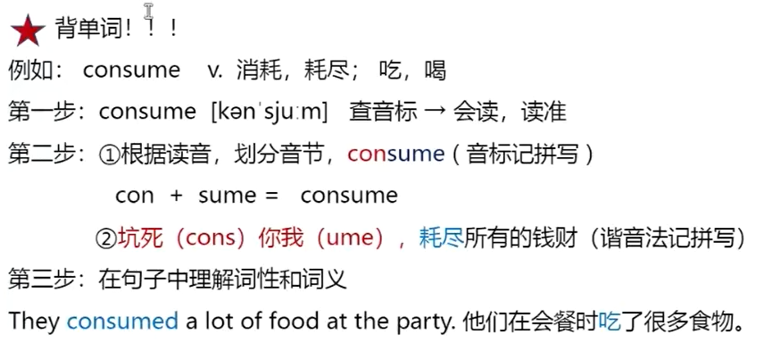

# 快速单词记忆法！

例如：alter v.改变，改动，变更

1. 第一步：alter 查音标  会读，读准

2. 第二步：根据读音，划分音节 **al**ter (联想法忆拼写)

   1.  例

3. 第三步：在句子中理解性和词义

   1. It doesn't **alter** my feeling. 这并没有**改变**我的感受。

4. 如果学有余力，可加第四步，或者前三步坚持一段时间后进行第四步。
   第四步：词性转换

   alter**able**  adj.可改变的
   alter**ation**  n.改造，改变

****

