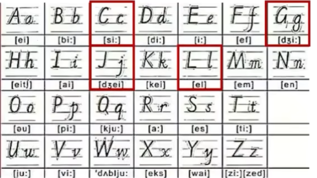
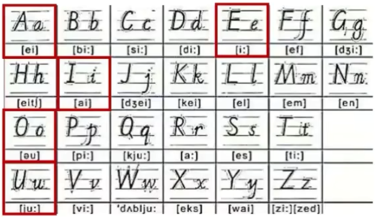
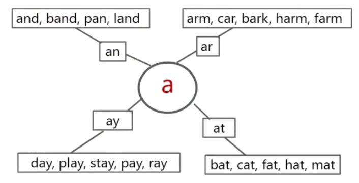
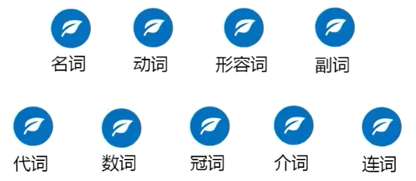

# 英语基础

## 字母

- 
- 注意：
  - G g 读法 zhe i
  - J j 读法 zhai 
  - C c 读法 s i
  - L l 读法 爱 儿
- 
- 元音：A E I O U
- a e i o u 最重要，字母中的“最强音” 没有元音字母不成词。
- 有时候y也可以担当勇任。 如：fly,try,cry,dry,fry,shy…       **y是半元音字母。**
- 

## 词性

- 语法功能 词性
- 
- 1.名词是什么？     →名字、名称
- 2.形容词是什么？ →修饰名词的词
- 3.动词是什么？    →说明动作和行为的词
- 4.副词是什么？   →修饰动词的词 (多以-y结尾)
- 形名动副     大部分语中顺序

## 句子

- 1.从短语到句子一**名词性**短语（**谁做了**什么事。**/谁是**什么。）

  long hair                 I have **long hair**.
  big eyes                 They have **big eyes**.
  good students        You are **good** **students**.

  人+do/be(am/is/are)+名词性短语。  **我用am 你用are，is用于他她它**

- 2.从短语到句子—动词短语

  smile happily       I smile happily.
  speak clearly      You speak clearly.
  sing loudly          They sing loudly.

  人+动词短语。

- 

 