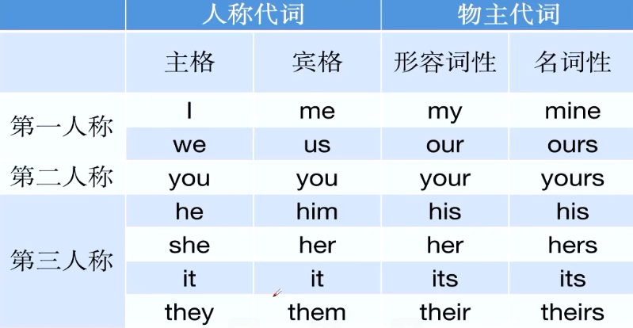

# 词汇

## 实词

- 动词v   名词n   形容词adj   副词adv、

### 动词v

- 动词可以分为及物动词vt , 和不及物动词ⅵ

- Vt后面能**直接**加名词的动词；ⅵ后面**不能直接加**名词的动词

  I like you.


  You jump .I jump.

  I jump into the water.

  采纳建议                                    适应社会

  **adopt** a piece of advice 及物           **adapt** to the society不及物

- 动词大都以ate  /fy  /ize结尾

  ```
  generate  产生
  concentrate 浓缩
  modify 修正
  beautify   美化                                                   publicize 宣传
  realize  了解 实现
  criticize 批评
  ```

  

### 名词n

- er /or /ant / ist 结尾表示人或物

  ```
  teacher 老师                                            
  actor 男演员
  attendant 随从
  accountant 会计
  merchant 商人（摸钱）
  scientist 科学家
  ```

- tion /sion /al / ary名词后缀

  ```
  action 行动
  nation 国家
  version 版本
  approval 
  disposal
  removal
  diary
  factory
  ```

### 形容词adj

- 一般以ous /ful /ary / ive /able/ al结尾，翻译为...的

  ```
  dangerous危险的
  famous出名的
  cautious
  beautiful/careful
  necessary/revolutionary
  positive/negative/sensitive
  reasonable/drinkable
  possible/terrible/horrible
  mental/general
  ```

### 副词adv

- 一般以y结尾

  ```
  successfully,importantly
  daily/monthly/yearly/costly/friendly 这些是形容词
  ```

## 虚词

- 介词prep 冠词article 连词conj 代词 pron

### 介词prep

- on/ at / in / of / for等，介词后面要加名词性的成分

  ```
  I am afraid of dogs.
  I am afraid of sleeping alone. sleep是动词加ing名词
  ```

- 表示地，点at / in   小地点 at 大地点 in

  ```
  at school/home
  in the world/China
  ```

- 表示时间at /on / in     

  ```
  具体的几点钟at
  at six o'clock
  具体的某一天on
  on Monday on October 1st
  某一特定的时间段以及不具体的月份，年份in
  in the morning in spring
  in October in 2000
  ```

- 表示所属of

  ```
  A of B=B的A
  the name of the dog. 狗的名字
  the importance of confidence 自信的重要性
  ```

- 表示为了for

  ```
  I want to cook for you.
  ```

### 冠词(article)

- 定冠词the  不定冠词a/an

  ```
  I want to eat the apple. 我想吃这个苹果
  I want to eat an apple. 我想吃一个苹果
  ```

- a/an看音标，元音音标前用an,  辅音音标前用a

### 代词pron

- 代替前面出现过的名词

  ```
  Tom is a boy.He likes English. 
  Students in the class are reading.They are smart.
  The number of boys is larger than that of girls.
  ```

- 人称代词和物主代词

  人称代词：一个称呼，指代人或物体

  ```
  The cat is white it is so cute.
  The boy's mother is 30 years old.She is so beautiful.
  I like you.I hate him.
  ```

  物主代词：一种所属关系，可以理解为...的

  ```
  my friend=a friend of mine.
  ```

  

## 词根词缀

- expensive 贵的   ex外面（前缀）pen钱（词根） ive 形容词后缀（词缀）

- dictionary 字典   dict说（词根）ary名词后缀（词缀）

- contemporary 形容词 同时代的 con一起（前缀）tempo节奏（词根）ary形容词后缀（词缀）

- 前缀表方向

  后缀表词性

  词根表意思

  

  - com/con(共同)

    ```
    communicate with sbV.交流
    cooperate/collaborate with sb v.合作
    compete with sbV.竞争
    combine A with BV.结合
    A contradict Bv.矛盾
    contradict/controversy/controversial
    contrary adj.相反的
    on the contrary
    ```

    

  - 

- 

